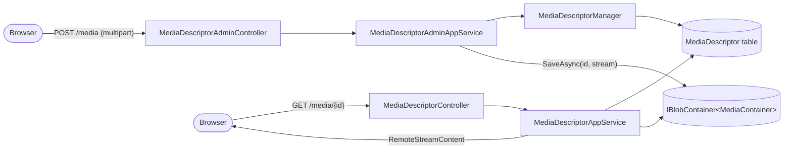

The CMS Kit Media Descriptors feature is the file‑upload backbone for blog posts, pages, and any other entity that needs to embed images or documents. The design is deliberately split: a `MediaDescriptor` aggregate stores only metadata (name, MIME type, size, owning entity type) in the relational/Mongo store, while the actual file bytes live in an ABP BLOB container called `cms-kit-media`. A `MediaDescriptorManager` validates the entity type against a registered allow‑list, the descriptor's id doubles as the BLOB key, and a public `IMediaDescriptorAppService.DownloadAsync` streams the bytes back. This page maps the source under `Volo.CmsKit.Domain/Volo/CmsKit/MediaDescriptors/`, lists every type and signature, and shows the upload and download paths.

<Info>
Source folder: [`modules/cms-kit/src/Volo.CmsKit.Domain/Volo/CmsKit/MediaDescriptors/`](https://github.com/abpframework/abp/tree/dev/modules/cms-kit/src/Volo.CmsKit.Domain/Volo/CmsKit/MediaDescriptors). The BLOB store integration sits on [`Volo.Abp.BlobStoring`](https://github.com/abpframework/abp/tree/dev/framework/src/Volo.Abp.BlobStoring) — see the framework BLOB Storing guide.
</Info>

## File inventory

```text title="modules/cms-kit/src/Volo.CmsKit.Domain/Volo/CmsKit/MediaDescriptors/"
MediaDescriptor.cs
MediaDescriptorManager.cs
IMediaDescriptorRepository.cs
MediaContainer.cs
MediaDescriptorChecks.cs
CmsKitMediaOptions.cs
MediaDescriptorDefinition.cs
IMediaDescriptorDefinitionStore.cs
DefaultMediaDescriptorDefinitionStore.cs
EntityCantHaveMediaException.cs
InvalidMediaDescriptorNameException.cs
```

| File | Type | Role |
| --- | --- | --- |
| `MediaDescriptor.cs` | `FullAuditedAggregateRoot<Guid>` | Metadata only — name, MIME, size, entity type |
| `MediaDescriptorManager.cs` | `DomainService` | Validates entity type, builds the aggregate |
| `IMediaDescriptorRepository.cs` | interface | Empty marker — only inherits `IBasicRepository<MediaDescriptor, Guid>` |
| `MediaContainer.cs` | type | BLOB container marker, `[BlobContainerName("cms-kit-media")]` |
| `MediaDescriptorChecks.cs` | static | `IsValidMediaFileName` — rejects path‑invalid characters |
| `CmsKitMediaOptions.cs` | options | List of allowed `MediaDescriptorDefinition` |
| `MediaDescriptorDefinition.cs` | DTO | Per‑entity‑type CRUD policies |
| `IMediaDescriptorDefinitionStore.cs` / `DefaultMediaDescriptorDefinitionStore.cs` | interface + impl | Lookup over the options list |
| `EntityCantHaveMediaException.cs` | `BusinessException` | Raised on an unregistered entity type |
| `InvalidMediaDescriptorNameException.cs` | `BusinessException` | Raised on a name containing path‑invalid characters |

## Domain model



The aggregate id and the BLOB key are the same `Guid` string — there is no separate "blob id". This is what lets `DownloadAsync` find the bytes with a single `MediaContainer.GetAsync(id.ToString())`.

### `MediaDescriptor`

```csharp title="modules/cms-kit/src/Volo.CmsKit.Domain/Volo/CmsKit/MediaDescriptors/MediaDescriptor.cs"
public class MediaDescriptor : FullAuditedAggregateRoot<Guid>, IMultiTenant
{
    public Guid?  TenantId   { get; protected set; }
    public string EntityType { get; protected set; }
    public string Name       { get; protected set; }
    public string MimeType   { get; protected set; }
    public long   Size       { get; protected set; }

    internal MediaDescriptor(
        Guid id, string entityType, string name, string mimeType, long size, Guid? tenantId = null)
        : base(id)
    {
        TenantId = tenantId;

        EntityType = Check.NotNullOrEmpty(entityType, nameof(entityType), MediaDescriptorConsts.MaxEntityTypeLength);
        MimeType = Check.NotNullOrWhiteSpace(mimeType, nameof(name), MediaDescriptorConsts.MaxMimeTypeLength);
        Size = size;

        SetName(name);
    }

    public void SetName(string name)
    {
        if (!MediaDescriptorChecks.IsValidMediaFileName(name))
        {
            throw new InvalidMediaDescriptorNameException(name);
        }
        Name = name;
    }
}
```

`MediaDescriptorChecks.IsValidMediaFileName` rejects any character returned by `Path.GetInvalidFileNameChars()`, which is the standard `.NET` rule for cross‑platform file safety:

```csharp title="modules/cms-kit/src/Volo.CmsKit.Domain/Volo/CmsKit/MediaDescriptors/MediaDescriptorChecks.cs"
public static class MediaDescriptorChecks
{
    public static bool IsValidMediaFileName(string name)
    {
        if (string.IsNullOrWhiteSpace(name))
        {
            return false;
        }
        return !Path.GetInvalidFileNameChars().Any(name.Contains);
    }
}
```

This is a *defence‑in‑depth* check — the BLOB store does not use the name to construct a path (the id is the key) but the name flows back to the browser in `Content-Disposition`, so an attacker‑controlled name could otherwise confuse client downloads.

### `MediaDescriptorManager`

```csharp title="modules/cms-kit/src/Volo.CmsKit.Domain/Volo/CmsKit/MediaDescriptors/MediaDescriptorManager.cs"
public class MediaDescriptorManager : DomainService
{
    protected IMediaDescriptorDefinitionStore MediaDescriptorDefinitionStore { get; }

    public virtual async Task<MediaDescriptor> CreateAsync(
        string entityType, string name, string mimeType, long size)
    {
        if (!await MediaDescriptorDefinitionStore.IsDefinedAsync(entityType))
        {
            throw new EntityCantHaveMediaException(entityType);
        }

        return new MediaDescriptor(
            GuidGenerator.Create(),
            entityType, name, mimeType, size,
            CurrentTenant.Id);
    }
}
```

That is the entire manager — entity‑type validation plus aggregate creation. The BLOB write is performed by the admin app service immediately after `MediaDescriptorRepository.InsertAsync(descriptor)`.

## `IMediaDescriptorRepository`

```csharp title="modules/cms-kit/src/Volo.CmsKit.Domain/Volo/CmsKit/MediaDescriptors/IMediaDescriptorRepository.cs"
public interface IMediaDescriptorRepository : IBasicRepository<MediaDescriptor, Guid>
{
}
```

Standard CRUD only — there are no specialised queries because callers always know the descriptor id (it's stored on the referencing aggregate, e.g. `BlogPost.CoverImageMediaId`).

## BLOB container

```csharp title="modules/cms-kit/src/Volo.CmsKit.Domain/Volo/CmsKit/MediaDescriptors/MediaContainer.cs"
[BlobContainerName("cms-kit-media")]
public class MediaContainer
{
}
```

The empty class plus the `[BlobContainerName]` attribute is ABP's standard pattern for a named blob container. Services inject `IBlobContainer<MediaContainer>` and the framework resolves the underlying provider — local file system, Azure Blob, S3, MinIO, etc — from configuration.

`CmsKitDomainModule` already depends on `AbpBlobStoringModule`, so no extra wiring is required to get a working in‑memory or file‑system store. Production deployments configure `AbpBlobStoringOptions` to point at a cloud provider:

```csharp
Configure<AbpBlobStoringOptions>(options =>
{
    options.Containers.Configure<MediaContainer>(c =>
    {
        c.UseAzure(b =>
        {
            b.ConnectionString = configuration["Azure:Storage"];
            b.ContainerName = "cms-kit-media";
        });
    });
});
```

See the framework's [BLOB Storing documentation](https://docs.abp.io/en/abp/latest/Blob-Storing) for provider details.

## Registering media‑capable entity types

```csharp title="modules/cms-kit/src/Volo.CmsKit.Domain/Volo/CmsKit/MediaDescriptors/CmsKitMediaOptions.cs"
public class CmsKitMediaOptions
{
    [NotNull]
    public List<MediaDescriptorDefinition> EntityTypes { get; } = new();
}
```

```csharp title="modules/cms-kit/src/Volo.CmsKit.Domain/Volo/CmsKit/MediaDescriptors/MediaDescriptorDefinition.cs"
public class MediaDescriptorDefinition : PolicySpecifiedDefinition
{
    public MediaDescriptorDefinition(
        [NotNull] string entityType,
        IEnumerable<string> createPolicies = null,
        IEnumerable<string> updatePolicies = null,
        IEnumerable<string> deletePolicies = null)
        : base(entityType, createPolicies, updatePolicies, deletePolicies)
    {
    }
}
```

The Admin Application module wires both blog posts and pages as media‑capable, with policies that piggy‑back on the existing CRUD permissions:

```csharp title="modules/cms-kit/src/Volo.CmsKit.Admin.Application/Volo/CmsKit/Admin/CmsKitAdminApplicationModule.cs"
if (GlobalFeatureManager.Instance.IsEnabled<MediaFeature>())
{
    Configure<CmsKitMediaOptions>(options =>
    {
        if (GlobalFeatureManager.Instance.IsEnabled<BlogsFeature>())
        {
            options.EntityTypes.AddIfNotContains(
                new MediaDescriptorDefinition(
                    BlogPostConsts.EntityType,
                    createPolicies: new[]
                    {
                        CmsKitAdminPermissions.BlogPosts.Create,
                        CmsKitAdminPermissions.BlogPosts.Update
                    },
                    deletePolicies: new[]
                    {
                        CmsKitAdminPermissions.BlogPosts.Create,
                        CmsKitAdminPermissions.BlogPosts.Update,
                        CmsKitAdminPermissions.BlogPosts.Delete
                    }));
        }

        if (GlobalFeatureManager.Instance.IsEnabled<PagesFeature>())
        {
            options.EntityTypes.AddIfNotContains(
                new MediaDescriptorDefinition(
                    PageConsts.EntityType,
                    createPolicies: new[]
                    {
                        CmsKitAdminPermissions.Pages.Create,
                        CmsKitAdminPermissions.Pages.Update
                    },
                    deletePolicies: new[]
                    {
                        CmsKitAdminPermissions.Pages.Create,
                        CmsKitAdminPermissions.Pages.Update,
                        CmsKitAdminPermissions.Pages.Delete
                    }));
        }
    });
}
```

Notice how *delete* requires either the create, update, *or* delete permission on the parent entity — this is intentional: an author who can update a blog post should be able to remove a wrong cover image without holding the broader `Delete` permission.

## Public download

The download path lives in the Common project (it is needed by both admin and public renderers):

```csharp title="modules/cms-kit/src/Volo.CmsKit.Common.Application.Contracts/Volo/CmsKit/MediaDescriptors/IMediaDescriptorAppService.cs"
public interface IMediaDescriptorAppService : IApplicationService
{
    Task<RemoteStreamContent> DownloadAsync(Guid id);
}
```

Implementation:

```csharp title="modules/cms-kit/src/Volo.CmsKit.Common.Application/Volo/CmsKit/MediaDescriptors/MediaDescriptorAppService.cs"
[RequiresGlobalFeature(typeof(MediaFeature))]
public class MediaDescriptorAppService : CmsKitAppServiceBase, IMediaDescriptorAppService
{
    protected IMediaDescriptorRepository MediaDescriptorRepository { get; }
    protected IBlobContainer<MediaContainer> MediaContainer { get; }

    public virtual async Task<RemoteStreamContent> DownloadAsync(Guid id)
    {
        var entity = await MediaDescriptorRepository.GetAsync(id);
        var stream = await MediaContainer.GetAsync(id.ToString());

        return new RemoteStreamContent(stream, entity.Name, entity.MimeType);
    }
}
```

The two reads — metadata + BLOB — happen serially because the metadata fetch is what tells the response *how* to name and content‑type the BLOB stream. `RemoteStreamContent` is ABP's standard wrapper for streaming responses (see the framework's content streaming guide).

Note that `DownloadAsync` is anonymous — there is no `[Authorize]` attribute. Anyone with a media id can download. If you need authorisation, override `MediaDescriptorAppService` or add a server‑side proxy that does the auth before delegating.

## Admin upload

```csharp title="modules/cms-kit/src/Volo.CmsKit.Admin.Application.Contracts/Volo/CmsKit/Admin/MediaDescriptors/IMediaDescriptorAdminAppService.cs"
public interface IMediaDescriptorAdminAppService : IApplicationService
{
    Task<MediaDescriptorDto> CreateAsync(string entityType, CreateMediaInputWithStream inputStream);
    Task DeleteAsync(Guid id);
}
```

`CreateMediaInputWithStream` carries an `IRemoteStreamContent` (a multipart upload). The admin HTTP API module registers it as ignored for form binding so the framework binds the file as a stream, not a string:

```csharp title="modules/cms-kit/src/Volo.CmsKit.Admin.HttpApi/Volo/CmsKit/Admin/CmsKitAdminHttpApiModule.cs"
Configure<AbpAspNetCoreMvcOptions>(options =>
{
    options.ConventionalControllers
           .FormBodyBindingIgnoredTypes
           .Add(typeof(CreateMediaInputWithStream));
});
```

The admin app service then:

1. Looks up the `MediaDescriptorDefinition` for the entity type.
2. Verifies the current user satisfies one of the `createPolicies`.
3. Calls `MediaDescriptorManager.CreateAsync` to build the aggregate.
4. Inserts the metadata row.
5. Streams the bytes into `IBlobContainer<MediaContainer>` under `descriptor.Id.ToString()` as the key.

The id‑as‑key choice keeps the BLOB store free of name collisions — two uploads with the same original `Name` end up in separate keys.

## Default definition store

```csharp title="modules/cms-kit/src/Volo.CmsKit.Domain/Volo/CmsKit/MediaDescriptors/DefaultMediaDescriptorDefinitionStore.cs"
public class DefaultMediaDescriptorDefinitionStore : IMediaDescriptorDefinitionStore
{
    protected CmsKitMediaOptions Options { get; }
    // ... reads from Options.EntityTypes
}
```

Replace this if you need to dynamically determine which entity types accept media — for example by reading a configuration table.

## Feature flags

- **Global feature** [`MediaFeature`](https://github.com/abpframework/abp/blob/dev/modules/cms-kit/src/Volo.CmsKit.Domain.Shared/Volo/CmsKit/GlobalFeatures/MediaFeature.cs) — name `CmsKit.Media`.
- There is no per‑tenant feature for media — the `CmsKitFeatures` constants list does not include a `MediaEnable`. Media is global‑only.

This is intentional — if a tenant has blogs or pages enabled, they implicitly need media for cover images and embedded illustrations.

## EF Core and MongoDB

```csharp
options.AddRepository<MediaDescriptor, EfCoreMediaDescriptorRepository>();
```

The EF entity table is small and indexed on `EntityType` so admin listings can filter by parent type without a sequential scan. The BLOB store, however, is the dominant storage cost — see the BLOB provider's own configuration for replication, lifecycle, and access policies.

## See also

<CardGroup cols={2}>
  <Card title="Overview" icon="map" href="/modules/cms-kit/overview">
    Where Media descriptors sits in the package matrix.
  </Card>
  <Card title="Blogs" icon="rss" href="/modules/cms-kit/blogs">
    `BlogPost.CoverImageMediaId` references a media descriptor.
  </Card>
  <Card title="Pages" icon="file" href="/modules/cms-kit/pages">
    Embedded images on pages flow through the same store.
  </Card>
  <Card title="Permission System" icon="lock" href="/authz/permission-system">
    How `createPolicies` / `deletePolicies` arrays on `MediaDescriptorDefinition` plug into ABP authorization.
  </Card>
</CardGroup>
