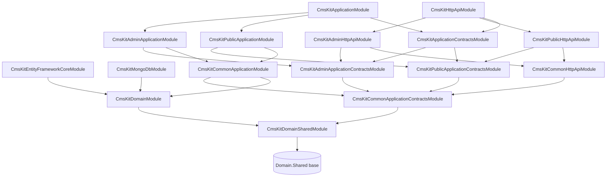

The ABP CMS Kit is a bundle of small, opt‑in content building blocks — blogs, pages, menus, comments, tags, ratings, reactions, media descriptors, and a synced `CmsUser` projection — designed to be dropped into any ABP application that already has identity, multi‑tenancy, and EF Core or MongoDB wired up. Unlike the all‑in‑one [Blogging](/modules/blogging) module, CMS Kit ships each capability as a separate aggregate gated by a `GlobalFeature`, plus a three‑tier package split — **Common**, **Admin**, and **Public** — so a consumer application can mount only the admin surface, only the public surface, or both. This page is the map: it lists every project under `modules/cms-kit/src/`, draws the `[DependsOn]` graph, enumerates the aggregates inside `Volo.CmsKit.Domain`, and points at the deeper pages for each feature.

<Info>
Source root: [`modules/cms-kit/src/`](https://github.com/abpframework/abp/tree/dev/modules/cms-kit/src) and [`modules/cms-kit/angular/`](https://github.com/abpframework/abp/tree/dev/modules/cms-kit/angular). All paths on this page are relative to those roots.
</Info>

## Why CMS Kit is split three ways

Most ABP modules ship a single Application / HttpApi pair. CMS Kit instead splits along the *audience* of each endpoint:

- **Common** — domain‑level cross‑cutting services that both admins and the public site need (the `BlogFeature` toggle store, `MediaDescriptor` reader, tag and menu DTOs).
- **Admin** — back‑office CRUD: create/update/delete blogs, blog posts, pages, menu items, tags, and moderate comments. Every endpoint is gated by `CmsKitAdminPermissions.*`.
- **Public** — anonymous or end‑user endpoints: list blog posts, render a page by slug, post a comment, set a star rating, react with an emoji, fetch the navigation menu.

The split matters because consumer apps often want only one half. A marketing site can pull `Volo.CmsKit.Public.HttpApi` plus `Volo.CmsKit.Public.Application` and ship a read‑only renderer. A separate admin portal hosts `Volo.CmsKit.Admin.HttpApi` plus `Volo.CmsKit.Admin.Application` behind authentication. Both halves share `Volo.CmsKit.Domain` and `Volo.CmsKit.Common.*`.

On top of the package split, every feature is opt‑in via [`GlobalCmsKitFeatures`](https://github.com/abpframework/abp/blob/dev/modules/cms-kit/src/Volo.CmsKit.Domain.Shared/Volo/CmsKit/GlobalFeatures/GlobalCmsKitFeatures.cs). See [Admin / Public split](/modules/cms-kit/admin-public-split) for the full rationale, and [Permission System](/authz/permission-system) for how the `CmsKit` permission group plugs into ABP authorization.

## Package matrix

The solution under [`Volo.CmsKit.sln`](https://github.com/abpframework/abp/blob/dev/modules/cms-kit/Volo.CmsKit.sln) groups the projects into four tiers.

| Package | Project folder | Tier | Layer |
| --- | --- | --- | --- |
| `Volo.CmsKit.Domain.Shared` | `Volo.CmsKit.Domain.Shared/` | Base | Constants, enums, `EntityTypeDefinition`, `GlobalCmsKitFeatures`, `CmsKitFeatures`, error codes, localization |
| `Volo.CmsKit.Domain` | `Volo.CmsKit.Domain/` | Base | Aggregates, repositories, domain services, definition stores |
| `Volo.CmsKit.EntityFrameworkCore` | `Volo.CmsKit.EntityFrameworkCore/` | Base | `CmsKitDbContext`, EF Core repositories, configuration extensions |
| `Volo.CmsKit.MongoDB` | `Volo.CmsKit.MongoDB/` | Base | `CmsKitMongoDbContext`, Mongo repositories |
| `Volo.CmsKit.Common.Application.Contracts` | `Volo.CmsKit.Common.Application.Contracts/` | Common | Shared DTOs (`CmsUserDto`, `MenuItemDto`, `TagDto`, `BlogFeatureDto`), `CmsKitPermissions` |
| `Volo.CmsKit.Common.Application` | `Volo.CmsKit.Common.Application/` | Common | `BlogFeatureAppService`, `MediaDescriptorAppService`, `TagAppService`, event handlers |
| `Volo.CmsKit.Common.HttpApi` | `Volo.CmsKit.Common.HttpApi/` | Common | `MediaDescriptorController`, `BlogFeatureController`, shared base controller |
| `Volo.CmsKit.Common.HttpApi.Client` | `Volo.CmsKit.Common.HttpApi.Client/` | Common | Generated typed proxies for the common controllers |
| `Volo.CmsKit.Common.Web` | `Volo.CmsKit.Common.Web/` | Common | Razor pages, tag helpers, view components used by both UIs |
| `Volo.CmsKit.Admin.Application.Contracts` | `Volo.CmsKit.Admin.Application.Contracts/` | Admin | `IBlogAdminAppService`, `IPageAdminAppService`, `IMenuItemAdminAppService`, admin DTOs, `CmsKitAdminPermissions` |
| `Volo.CmsKit.Admin.Application` | `Volo.CmsKit.Admin.Application/` | Admin | `BlogAdminAppService`, `BlogPostAdminAppService`, `PageAdminAppService`, `CommentAdminAppService`, `MenuItemAdminAppService`, `TagAdminAppService`, `MediaDescriptorAdminAppService` |
| `Volo.CmsKit.Admin.HttpApi` | `Volo.CmsKit.Admin.HttpApi/` | Admin | Admin MVC controllers under the `/api/cms-kit-admin/*` route |
| `Volo.CmsKit.Admin.HttpApi.Client` | `Volo.CmsKit.Admin.HttpApi.Client/` | Admin | Typed admin client proxies |
| `Volo.CmsKit.Admin.Web` | `Volo.CmsKit.Admin.Web/` | Admin | Razor admin UI (back‑office pages, menus, components) |
| `Volo.CmsKit.Public.Application.Contracts` | `Volo.CmsKit.Public.Application.Contracts/` | Public | `IBlogPostPublicAppService`, `IPagePublicAppService`, `ICommentPublicAppService`, `IRatingPublicAppService`, `IReactionPublicAppService`, `IMenuItemPublicAppService`, `CmsKitPublicPermissions` |
| `Volo.CmsKit.Public.Application` | `Volo.CmsKit.Public.Application/` | Public | Public app service implementations, `PublicApplicationAutoMapperProfile`, event handlers |
| `Volo.CmsKit.Public.HttpApi` | `Volo.CmsKit.Public.HttpApi/` | Public | Public MVC controllers under `/api/cms-kit/*` |
| `Volo.CmsKit.Public.HttpApi.Client` | `Volo.CmsKit.Public.HttpApi.Client/` | Public | Typed public client proxies |
| `Volo.CmsKit.Public.Web` | `Volo.CmsKit.Public.Web/` | Public | Razor view components, tag helpers, JS bundles for the public site |
| `Volo.CmsKit.Application.Contracts` | `Volo.CmsKit.Application.Contracts/` | Aggregate | Empty bundle: depends on Admin + Public contracts |
| `Volo.CmsKit.Application` | `Volo.CmsKit.Application/` | Aggregate | Empty bundle: depends on Admin + Public Application |
| `Volo.CmsKit.HttpApi` | `Volo.CmsKit.HttpApi/` | Aggregate | Empty bundle: depends on Admin + Public HttpApi |
| `Volo.CmsKit.HttpApi.Client` | `Volo.CmsKit.HttpApi.Client/` | Aggregate | Empty bundle: depends on Admin + Public HttpApi.Client |
| `Volo.CmsKit.Web` | `Volo.CmsKit.Web/` | Aggregate | Aggregate Web bundle (Admin.Web + Public.Web) |
| `Volo.CmsKit.Installer` | `Volo.CmsKit.Installer/` | Tooling | Bundles embedded NuGet for the ABP CLI installer |

The "Aggregate" rows are just bundles: their module class has nothing in it but a `[DependsOn]` attribute. They exist so consumer apps can reference `Volo.CmsKit.HttpApi` and pull both halves in a single line.

## [DependsOn] graph

The module dependencies between the four tiers look like this:



Two things to notice in the diagram:

1. **Admin and Public are siblings.** Neither depends on the other; both depend on `Common`. A consumer can host them in separate processes without dragging in the other half.
2. **The aggregate `CmsKitApplicationModule` / `CmsKitHttpApiModule` are just convenience bundles** — their `.cs` files are empty apart from a `[DependsOn]` attribute (see [`CmsKitHttpApiModule.cs`](https://github.com/abpframework/abp/blob/dev/modules/cms-kit/src/Volo.CmsKit.HttpApi/Volo/CmsKit/CmsKitHttpApiModule.cs)).

```csharp title="modules/cms-kit/src/Volo.CmsKit.HttpApi/Volo/CmsKit/CmsKitHttpApiModule.cs"
[DependsOn(
    typeof(CmsKitAdminHttpApiModule),
    typeof(CmsKitPublicHttpApiModule),
    typeof(CmsKitApplicationContractsModule)
    )]
public class CmsKitHttpApiModule : AbpModule
{
}
```

The `CmsKitDomainModule` itself only depends on the framework and `CmsKitDomainSharedModule`:

```csharp title="modules/cms-kit/src/Volo.CmsKit.Domain/Volo/CmsKit/CmsKitDomainModule.cs"
[DependsOn(
    typeof(CmsKitDomainSharedModule),
    typeof(AbpUsersDomainModule),
    typeof(AbpDddDomainModule),
    typeof(AbpBlobStoringModule)
)]
public class CmsKitDomainModule : AbpModule
```

That dependency on [`AbpBlobStoringModule`](https://github.com/abpframework/abp/tree/dev/framework/src/Volo.Abp.BlobStoring) is how `MediaDescriptor` (covered on [Media descriptors](/modules/cms-kit/media-descriptors)) stores the actual file bytes — the entity holds metadata, the BLOB store holds the payload.

## Aggregates inside `Volo.CmsKit.Domain`

The domain project is organised one folder per feature. Each folder owns its aggregate, its repository interface, its domain service, its options class, and any feature‑specific exceptions.

```text title="modules/cms-kit/src/Volo.CmsKit.Domain/Volo/CmsKit/"
Blogs/             # Blog, BlogPost, BlogFeature aggregates + managers
Comments/          # Comment aggregate + CommentManager + ICommentEntityTypeDefinitionStore
GlobalResources/   # Site-wide script/style/header/footer resource bundles
MediaDescriptors/  # File metadata + BLOB store integration
Menus/             # MenuItem tree + MenuItemManager + PageChangedHandler
Pages/             # Page aggregate (CMS pages with content/script/style)
Ratings/           # Rating entity + RatingManager + star count queries
Reactions/         # UserReaction + ReactionManager + reaction definition store
Settings/          # CmsKit setting definitions
Tags/              # Tag aggregate + EntityTag join + TagManager / EntityTagManager
Users/             # CmsUser projection + CmsUserSynchronizer
```

| Folder | Aggregate root | Repository interface | Domain service | Dedicated page |
| --- | --- | --- | --- | --- |
| `Blogs/` | `Blog`, `BlogPost`, `BlogFeature` | `IBlogRepository`, `IBlogPostRepository`, `IBlogFeatureRepository` | `BlogManager`, `BlogPostManager`, `BlogFeatureManager` | [Blogs](/modules/cms-kit/blogs) |
| `Comments/` | `Comment` | `ICommentRepository` | `CommentManager` | [Comments](/modules/cms-kit/comments) |
| `Pages/` | `Page` | `IPageRepository` | `PageManager` | [Pages](/modules/cms-kit/pages) |
| `Menus/` | `MenuItem` | `IMenuItemRepository` | `MenuItemManager` | [Menus](/modules/cms-kit/menus) |
| `Ratings/` | `Rating` | `IRatingRepository` | `RatingManager` | [Ratings](/modules/cms-kit/ratings) |
| `Reactions/` | `UserReaction` | `IUserReactionRepository` | `ReactionManager` | [Reactions](/modules/cms-kit/reactions) |
| `Tags/` | `Tag`, `EntityTag` | `ITagRepository`, `IEntityTagRepository` | `TagManager`, `EntityTagManager` | [Tags](/modules/cms-kit/tags) |
| `MediaDescriptors/` | `MediaDescriptor` | `IMediaDescriptorRepository` | `MediaDescriptorManager` | [Media descriptors](/modules/cms-kit/media-descriptors) |
| `Users/` | `CmsUser` | `ICmsUserRepository` | `CmsUserLookupService`, `CmsUserSynchronizer` | covered in [Comments](/modules/cms-kit/comments) |

`CmsUser` is the only aggregate that is not user‑facing on its own. It is a denormalised projection of `IUser` events kept inside the CMS bounded context so that blog posts, comments, and ratings can join authors without crossing module boundaries. The synchroniser hooks into `UserCreatedEventData` / `UserUpdatedEventData` from `Volo.Abp.Users`.

## Global features

Every feature is gated by a global flag declared in `GlobalCmsKitFeatures`. A consumer app calls `GlobalFeatureManager.Instance.Modules.CmsKit().Blogs.Enable()` (or the equivalents for `Pages`, `Comments`, `Menu`, `Ratings`, `Reactions`, `Tags`, `Media`, `User`, `GlobalResources`, `BlogPostScrollIndex`) before module startup to compile the feature in.

```csharp title="modules/cms-kit/src/Volo.CmsKit.Domain.Shared/Volo/CmsKit/GlobalFeatures/GlobalCmsKitFeatures.cs"
public class GlobalCmsKitFeatures : GlobalModuleFeatures
{
    public const string ModuleName = "CmsKit";

    public ReactionsFeature   Reactions       => GetFeature<ReactionsFeature>();
    public CommentsFeature    Comments        => GetFeature<CommentsFeature>();
    public MediaFeature       Media           => GetFeature<MediaFeature>();
    public RatingsFeature     Ratings         => GetFeature<RatingsFeature>();
    public TagsFeature        Tags            => GetFeature<TagsFeature>();
    public PagesFeature       Pages           => GetFeature<PagesFeature>();
    public BlogsFeature       Blogs           => GetFeature<BlogsFeature>();
    public CmsUserFeature     User            => GetFeature<CmsUserFeature>();
    public MenuFeature        Menu            => GetFeature<MenuFeature>();
    public GlobalResourcesFeature GlobalResources => GetFeature<GlobalResourcesFeature>();
    public BlogPostScrollIndexFeature BlogPostScrollIndex => GetFeature<BlogPostScrollIndexFeature>();
}
```

The startup gating works in two layers:

1. **`[RequiresGlobalFeature(typeof(BlogsFeature))]`** on every `*AppService` and controller class — requests fail with `GlobalFeatureNotEnabledException` if blogs are off at build time.
2. **`[RequiresFeature(CmsKitFeatures.BlogEnable)]`** for tenant‑scoped toggles via the standard ABP feature system.

`CmsKitFeatures` (note: tenant feature, not global) is the per‑tenant on/off switch. Both layers are required for an endpoint to serve traffic.

```csharp title="modules/cms-kit/src/Volo.CmsKit.Domain.Shared/Volo/CmsKit/Features/CmsKitFeatures.cs"
public static class CmsKitFeatures
{
    public const string GroupName            = "CmsKit";
    public const string BlogEnable           = GroupName + ".BlogEnable";
    public const string CommentEnable        = GroupName + ".CommentEnable";
    public const string GlobalResourceEnable = GroupName + ".GlobalResourceEnable";
    public const string MenuEnable           = GroupName + ".MenuEnable";
    public const string PageEnable           = GroupName + ".PageEnable";
    public const string RatingEnable         = GroupName + ".RatingEnable";
    public const string ReactionEnable       = GroupName + ".ReactionEnable";
    public const string TagEnable            = GroupName + ".TagEnable";
}
```

See [`CmsKitFeatureDefinitionProvider`](https://github.com/abpframework/abp/blob/dev/modules/cms-kit/src/Volo.CmsKit.Domain.Shared/Volo/CmsKit/Features/CmsKitFeatureDefinitionProvider.cs) for the wiring. Each feature is only registered with the tenant feature system if the matching `GlobalFeature` is enabled — that is why the global flags are the master switch and the per‑tenant flags are a refinement.

## Permissions at a glance

Permissions are split the same way the application services are.

| Permission group | Constant class | Source |
| --- | --- | --- |
| `CmsKit` (admin permissions) | `CmsKitAdminPermissions` | `Volo.CmsKit.Admin.Application.Contracts/Volo/CmsKit/Permissions/CmsKitAdminPermissions.cs` |
| `CmsKitPublic` | `CmsKitPublicPermissions` | `Volo.CmsKit.Public.Application.Contracts/Volo/CmsKit/Permissions/CmsKitPublicPermissions.cs` |
| `CmsKit.Public` (umbrella) | `CmsKitPermissions` | `Volo.CmsKit.Common.Application.Contracts/Volo/CmsKit/Permissions/CmsKitPermissions.cs` |

The admin set covers `Comments.Delete`, `Tags.*`, `Pages.*` (including `SetAsHomePage`), `Blogs.*` (including `Features`), `BlogPosts.*` (including `Publish`), `Menus.*`, and `GlobalResources`. The public set is intentionally tiny — currently only `Comments.DeleteAll` — because the public endpoints are mostly anonymous or require only `[Authorize]`. Read more on the [Permission System](/authz/permission-system) page.

## EF Core and MongoDB

Persistence is pluggable. The EF Core module registers a repository per aggregate against `CmsKitDbContext`:

```csharp title="modules/cms-kit/src/Volo.CmsKit.EntityFrameworkCore/Volo/CmsKit/EntityFrameworkCore/CmsKitEntityFrameworkCoreModule.cs"
context.Services.AddAbpDbContext<CmsKitDbContext>(options =>
{
    options.AddRepository<CmsUser, EfCoreCmsUserRepository>();
    options.AddRepository<UserReaction, EfCoreUserReactionRepository>();
    options.AddRepository<Comment, EfCoreCommentRepository>();
    options.AddRepository<Rating, EfCoreRatingRepository>();
    options.AddRepository<Tag, EfCoreTagRepository>();
    options.AddRepository<EntityTag, EfCoreEntityTagRepository>();
    options.AddRepository<Page, EfCorePageRepository>();
    options.AddRepository<Blog, EfCoreBlogRepository>();
    options.AddRepository<BlogPost, EfCoreBlogPostRepository>();
    options.AddRepository<BlogFeature, EfCoreBlogFeatureRepository>();
    options.AddRepository<MediaDescriptor, EfCoreMediaDescriptorRepository>();
    options.AddRepository<GlobalResource, EfCoreGlobalResourceRepository>();
});
```

`Volo.CmsKit.MongoDB` mirrors the same surface with `MongoDbContext` collections. Choosing one or the other is a single `[DependsOn]` in the consumer's `EntityFrameworkCoreModule` / `MongoDbModule`.

## UI surfaces

Two UIs ship in‑tree:

| UI | Project | Notes |
| --- | --- | --- |
| Razor / MVC | `Volo.CmsKit.Admin.Web`, `Volo.CmsKit.Public.Web`, `Volo.CmsKit.Common.Web` | The default Razor admin and public renderer. Embedded view components for blog post lists, comment trees, reaction bars, etc. |
| Angular | `modules/cms-kit/angular/projects/cms-kit/` | A lazy‑loadable `CmsKitModule` plus a `CmsKitConfigModule` that registers a `/cms-kit` route. See [Angular UI](/modules/cms-kit/angular-ui). |

There is no Blazor UI in this repo for CMS Kit at the time of writing — the Blazor admin is shipped under the commercial CMS Kit Pro module on `abp.io`. For the open‑source MVC UI, every page is feature‑gated the same way the app services are.

## Where to go next

<CardGroup cols={2}>
  <Card title="Blogs" icon="rss" href="/modules/cms-kit/blogs">
    `Blog` and `BlogPost` aggregates, per‑blog feature toggles, admin and public app services.
  </Card>
  <Card title="Pages" icon="file" href="/modules/cms-kit/pages">
    Single‑slug content pages with script and style fields, plus home‑page election.
  </Card>
  <Card title="Comments" icon="comments" href="/modules/cms-kit/comments">
    Generic comment aggregate, idempotency, threaded replies, moderation.
  </Card>
  <Card title="Menus" icon="bars" href="/modules/cms-kit/menus">
    Self‑referential `MenuItem` tree, page‑linked URLs, drag‑and‑drop reorder.
  </Card>
  <Card title="Ratings" icon="star" href="/modules/cms-kit/ratings">
    One star count per user per entity, with grouped aggregation queries.
  </Card>
  <Card title="Reactions" icon="face-smile" href="/modules/cms-kit/reactions">
    Emoji‑style reactions with a definition store and per‑entity allow‑list.
  </Card>
  <Card title="Tags" icon="tag" href="/modules/cms-kit/tags">
    Tag aggregate, `EntityTag` join, popular‑tag query, tag‑scoped permissions.
  </Card>
  <Card title="Media descriptors" icon="image" href="/modules/cms-kit/media-descriptors">
    Metadata records that reference BLOBs in `IBlobContainer`.
  </Card>
  <Card title="Admin vs Public split" icon="layer-group" href="/modules/cms-kit/admin-public-split">
    Why every feature has two app services, two controllers, and two permission sets.
  </Card>
  <Card title="Angular UI" icon="angular" href="/modules/cms-kit/angular-ui">
    The lazy‑loaded `CmsKitModule` and its `CmsKitConfigModule` route provider.
  </Card>
</CardGroup>

For the older monolithic CMS module that CMS Kit replaces, see [Blogging](/modules/blogging). For the user, role, and tenant primitives every CMS Kit aggregate relies on, see [Identity](/modules/identity).
