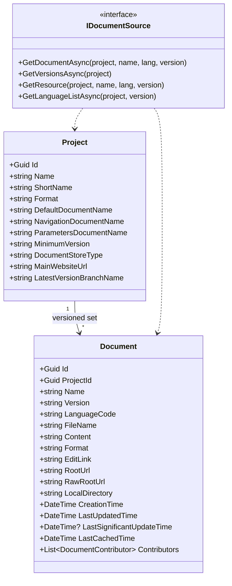
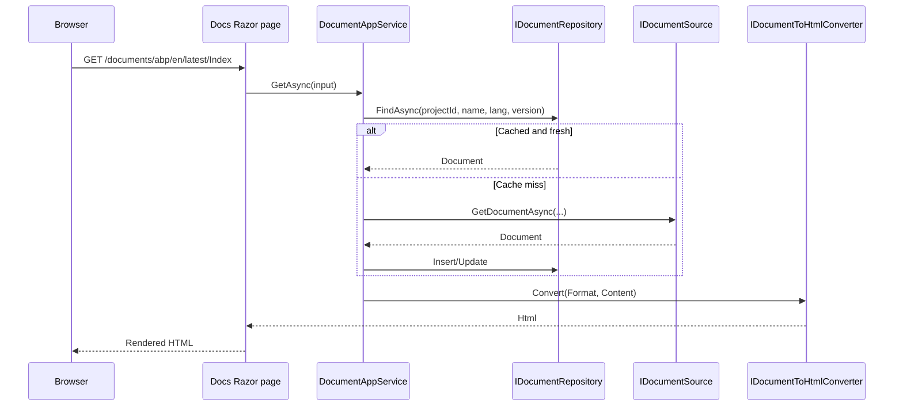

`Volo.Docs` is the documentation rendering module that powers
[docs.abp.io](https://docs.abp.io). It models projects and their versioned
documents as aggregates, abstracts the document storage through
`IDocumentSource`, ships GitHub and File System implementations out of
the box, and renders the result through a Razor-based reader UI with
search and version switching. This page lays out the package graph, the
core abstractions, and where to find each concern in the source tree.

## Package layout

| Package | Layer |
| --- | --- |
| `Volo.Docs.Domain.Shared` | Localization, constants, ETOs |
| `Volo.Docs.Domain` | `Project`, `Document`, `IDocumentSource`, full-text search interfaces |
| `Volo.Docs.Application.Contracts` | DTOs and application service interfaces |
| `Volo.Docs.Application` | `DocumentAppService`, `ProjectAppService` |
| `Volo.Docs.HttpApi` | REST controllers |
| `Volo.Docs.HttpApi.Client` | C# dynamic proxies |
| `Volo.Docs.Web` | Razor reader pages and Markdown/HTML rendering pipeline |
| `Volo.Docs.Admin.Application(.Contracts)` | Admin reindex / pull services |
| `Volo.Docs.Admin.HttpApi(.Client)` | Admin REST surface |
| `Volo.Docs.Admin.Web` | Admin Razor Pages |
| `Volo.Docs.EntityFrameworkCore` | EF Core repositories |
| `Volo.Docs.MongoDB` | MongoDB repositories |
| `Volo.Docs.Installer` | CLI manifest |

The reference deployment lives separately under `modules/docs/app/`. See
[VoloDocs application](/modules/docs/voldocs-app).

## Domain abstractions



### Project

A `Project` is the top-level container — for example *abp* on
docs.abp.io. It records the human name, URL slug, document format
(`md`, `html`, …), the names of the special **default**, **navigation**,
and **parameters** documents inside the project, plus which document
**store type** (`GitHub`, `FileSystem`, …) backs it.

```csharp Volo.Docs.Domain/Volo/Docs/Projects/Project.cs
public class Project : AggregateRoot<Guid>
{
    /// <summary>Name of the project for display purposes.</summary>
    public virtual string Name { get; protected set; }

    /// <summary>A short name of the project to be seen in URLs.</summary>
    public virtual string ShortName { get; protected set; }

    /// <summary>The format of the document (e.g. "md" for Markdown).</summary>
    public virtual string Format { get; protected set; }

    /// <summary>The document for the initial page.</summary>
    public virtual string DefaultDocumentName { get; protected set; }

    /// <summary>The document to be used for the navigation menu (index).</summary>
    public virtual string NavigationDocumentName { get; protected set; }

    /// <summary>The document to be used for the parameters file (index).</summary>
    public virtual string ParametersDocumentName { get; protected set; }

    public virtual string MinimumVersion { get; set; }

    /// <summary>The source of the documents (e.g. Github).</summary>
    public virtual string DocumentStoreType { get; protected set; }

    public virtual string MainWebsiteUrl { get; set; }

    public virtual string LatestVersionBranchName { get; set; }
    // ...
}
```

```csharp Volo.Docs.Domain/Volo/Docs/Projects/IProjectRepository.cs
public interface IProjectRepository : IBasicRepository<Project, Guid>
{
    Task<List<Project>> GetListAsync(string sorting, int maxResultCount,
        int skipCount, CancellationToken cancellationToken = default);
    Task<List<ProjectWithoutDetails>> GetListWithoutDetailsAsync(
        CancellationToken cancellationToken = default);
    Task<Project> GetByShortNameAsync(string shortName,
        CancellationToken cancellationToken = default);
    Task<bool> ShortNameExistsAsync(string shortName,
        CancellationToken cancellationToken = default);
}
```

### Document

A `Document` is a single page within a project, scoped by `Version` and
`LanguageCode`. It captures everything needed to render the page and
generate edit links, including the `RootUrl`, `RawRootUrl`, and the local
file-system path of the document inside the source tree:

```csharp Volo.Docs.Domain/Volo/Docs/Documents/Document.cs
public class Document : AggregateRoot<Guid>
{
    public virtual Guid ProjectId { get; protected set; }
    public virtual string Name { get; protected set; }
    public virtual string Version { get; protected set; }
    public virtual string LanguageCode { get; protected set; }
    public virtual string FileName { get; set; }
    public virtual string Content { get; set; }
    public virtual string Format { get; set; }
    public virtual string EditLink { get; set; }
    public virtual string RootUrl { get; set; }
    public virtual string RawRootUrl { get; set; }
    public virtual string LocalDirectory { get; set; }
    public virtual DateTime CreationTime { get; set; }
    public virtual DateTime LastUpdatedTime { get; set; }
    public virtual DateTime? LastSignificantUpdateTime { get; set; }
    public virtual DateTime LastCachedTime { get; set; }
    public virtual List<DocumentContributor> Contributors { get; set; }
    // (+ constructor with all required fields)
}
```

`IDocumentRepository` exposes the cache-style writes (`DeleteAsync` by
key, large `GetAllAsync` filter overloads, etc.) used by the admin
reindex flow and the reader cache. The full signature is intentionally
verbose to support the documents admin grid and Elasticsearch sync:

```csharp Volo.Docs.Domain/Volo/Docs/Documents/IDocumentRepository.cs
public interface IDocumentRepository : IBasicRepository<Document>
{
    Task<List<DocumentWithoutDetails>> GetListWithoutDetailsByProjectId(Guid projectId, CancellationToken ct = default);
    Task<List<DocumentInfo>> GetUniqueListDocumentInfoAsync(CancellationToken ct = default);
    Task<List<Document>> GetListByProjectId(Guid projectId, CancellationToken ct = default);
    Task<Document> FindAsync(Guid projectId, string name, string languageCode, string version,
                             bool includeDetails = true, CancellationToken ct = default);
    Task DeleteAsync(Guid projectId, string name, string languageCode, string version,
                     bool autoSave = false, CancellationToken ct = default);
    Task<List<Document>> GetListAsync(Guid? projectId, string version, string name,
                                      CancellationToken ct = default);
    // GetAllAsync(...) and GetAllCountAsync(...) take 18 filter parameters
    Task<Document> GetAsync(Guid id, CancellationToken ct = default);
}
```

### IDocumentSource

The polymorphic seam that lets Volo.Docs read from anywhere:

```csharp Volo.Docs.Domain/Volo/Docs/Documents/IDocumentSource.cs
public interface IDocumentSource : IDomainService
{
    Task<Document> GetDocumentAsync(Project project, string documentName,
        string languageCode, string version,
        DateTime? lastKnownSignificantUpdateTime = null);

    Task<List<VersionInfo>> GetVersionsAsync(Project project);

    Task<DocumentResource> GetResource(Project project, string resourceName,
        string languageCode, string version);

    Task<LanguageConfig> GetLanguageListAsync(Project project, string version);
}
```

Two implementations ship with the module:

| Type | Class | Behaviour |
| --- | --- | --- |
| `GitHub` | `GithubDocumentSource` | Pulls raw markdown/HTML from a GitHub repository, computes contributor data from commits |
| `FileSystem` | `FileSystemDocumentSource` | Reads files from the local file system, with a directory-security check |

These are registered in `DocsDomainModule.ConfigureServices`:

```csharp Volo.Docs.Domain/Volo/Docs/DocsDomainModule.cs
Configure<DocumentSourceOptions>(options =>
{
    options.Sources[GithubDocumentSource.Type]    = typeof(GithubDocumentSource);
    options.Sources[FileSystemDocumentSource.Type] = typeof(FileSystemDocumentSource);
});
```

And resolved through `DocumentSourceFactory`:

```csharp Volo.Docs.Domain/Volo/Docs/Documents/DocumentSourceFactory.cs
public class DocumentSourceFactory : IDocumentSourceFactory, ITransientDependency
{
    public virtual IDocumentSource Create(string sourceType)
    {
        var serviceType = Options.Sources.GetOrDefault(sourceType);
        if (serviceType == null)
        {
            throw new ApplicationException($"Unknown document store: {sourceType}");
        }
        return (IDocumentSource) ServiceProvider.GetRequiredService(serviceType);
    }
}
```

Adding a custom source is a matter of implementing `IDocumentSource` and
appending it to `DocumentSourceOptions.Sources` from a host module. The
`Project.DocumentStoreType` column then names the source per project.

#### Database / cached source

There is no separate `DatabaseDocumentSource` class; instead, the
`IDocumentRepository` is itself the cache. The application layer is
responsible for asking the source for fresh content and persisting the
returned `Document` to the repository so subsequent reads can skip the
network. This same repository powers the Elasticsearch full-text search
indexer (`ElasticDocumentFullSearch`).

### Full-text search

`Volo.Docs.Domain/Volo/Docs/Documents/FullSearch/Elastic` adds an
optional Elasticsearch backend. `DocsDomainModule` opts into it when
`DocsElasticSearchOptions.Enable` is true:

```csharp Volo.Docs.Domain/Volo/Docs/DocsDomainModule.cs
public async override Task OnApplicationInitializationAsync(
    ApplicationInitializationContext context)
{
    using (var scope = context.ServiceProvider.CreateScope())
    {
        if (scope.ServiceProvider
                 .GetRequiredService<IOptions<DocsElasticSearchOptions>>()
                 .Value.Enable)
        {
            var documentFullSearch = scope.ServiceProvider
                .GetRequiredService<IDocumentFullSearch>();
            await documentFullSearch.CreateIndexIfNeededAsync();
        }
    }
}
```

The Elasticsearch implementation is fed by a
`DocumentChangedEventHandler` which keeps the index in sync as documents
mutate.

## Application services

### DocumentAppService

```csharp Volo.Docs.Application/Volo/Docs/Documents/DocumentAppService.cs
public virtual async Task<DocumentWithDetailsDto> GetAsync(GetDocumentInput input);
public virtual async Task<DocumentWithDetailsDto> GetDefaultAsync(GetDefaultDocumentInput input);
public virtual async Task<NavigationNode> GetNavigationAsync(GetNavigationDocumentInput input);
public virtual async Task<DocumentResourceDto> GetResourceAsync(GetDocumentResourceInput input);
public virtual async Task<PagedResultDto<DocumentSearchOutput>> SearchAsync(DocumentSearchInput input);
public virtual async Task<bool> FullSearchEnabledAsync();
public virtual async Task<List<string>> GetUrlsAsync(string prefix);
public virtual async Task<DocumentParametersDto> GetParametersAsync(GetParametersDocumentInput input);
```

`GetNavigationAsync` returns the navigation tree parsed from
`Project.NavigationDocumentName`; `INavigationTreePostProcessor` lets
hosts mutate that tree (filter by feature flags, etc.) before rendering.

### ProjectAppService

```csharp Volo.Docs.Application/Volo/Docs/Projects/ProjectAppService.cs
public virtual async Task<ListResultDto<ProjectDto>> GetListAsync();
public virtual async Task<ProjectDto> GetAsync(string shortName);
public virtual async Task<ListResultDto<VersionInfoDto>> GetVersionsAsync(string shortName);
public virtual async Task<LanguageConfig> GetLanguageListAsync(string shortName, string version);
public virtual async Task<string> GetDefaultLanguageCodeAsync(string shortName, string version);
```

Both services hang off `DocsAppServiceBase`, which sets the
localization resource to `DocsResource` and provides the standard ABP
helpers.

## HTTP API surface

`Volo.Docs.HttpApi` exposes the two app services as auto-controllers
through `DocsDocumentController` and `DocsProjectController`. Their
routes are conventional (`/api/docs/document/...`, `/api/docs/projects/...`).

For images and other static resources that live inside a project,
`Volo.Docs.Web/Areas/Documents/DocumentResourceController.cs` exposes
binary content directly with the right MIME type, bypassing the app
service envelope.

## Reader Web module

`DocsWebModule` carries the reader UI, the Markdown pipeline (built with
**Markdig**), Scriban-based partial rendering, and the prism extensions
for code highlighting:

```csharp Volo.Docs.Web/DocsWebModule.cs
[DependsOn(
    typeof(DocsApplicationContractsModule),
    typeof(AbpAutoMapperModule),
    typeof(AbpAspNetCoreMvcUiBootstrapModule),
    typeof(AbpAspNetCoreMvcUiThemeSharedModule),
    typeof(AbpAspNetCoreMvcUiPackagesModule),
    typeof(AbpAspNetCoreMvcUiBundlingModule)
    )]
public class DocsWebModule : AbpModule { /* ... */ }
```

The Markdown → HTML pipeline is exposed via `IMarkdownConverter` and
`MarkDigMarkdownConverter`; the Scriban-based partial expansion is in
`ScribanDocumentSectionRenderer`. The factory
`IDocumentToHtmlConverterFactory` picks the right converter by
`Document.Format`.

### Reader page routes

| Route family | Purpose |
| --- | --- |
| `/documents/{shortName}/{languageCode}/{version}/{documentName}` | Versioned document page |
| `/documents/{shortName}` | Project landing redirect |
| `/documents/{shortName}/{languageCode}/{version}` | Default document for that project/lang/version |

Inside each page, the navigation tree comes from
`DocumentAppService.GetNavigationAsync`, and version pickers use
`ProjectAppService.GetVersionsAsync`.

## End-to-end render flow



## VoloDocs reference application

The `modules/docs/app/` folder contains the actual `VoloDocs.Web` host
that runs docs.abp.io, together with its EF Core DbContext and Migrator.
See [VoloDocs application](/modules/docs/voldocs-app) for a per-project
walkthrough.

## See also

* [VoloDocs application](/modules/docs/voldocs-app) — the reference host.
* [Virtual file explorer](/vfs/virtual-file-explorer-module) — useful for
  inspecting the embedded reader assets.
* [Basic theme](/themes/basic-theme-module) — the layout the reader uses
  when the host opts into it.
* [CMS Kit](/modules/cms-kit) — alternative content module focused on
  marketing-style sites.
