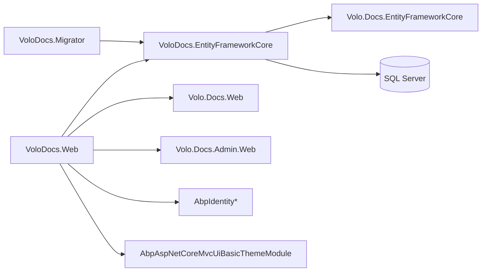

`modules/docs/app/` contains the **reference deployment** of the Volo.Docs
module — the host, EF Core context, and migrator that the ABP team uses
to run [docs.abp.io](https://docs.abp.io). Unlike the `modules/docs/src/`
packages, which are published as reusable NuGet libraries, the projects
here are *applications*: they are the canonical example of how to wire
`Volo.Docs` into a runnable host. This page walks through each project.

<Info>
  The reusable Volo.Docs packages are documented in
  [Volo.Docs overview](/modules/docs/overview). This page is specifically
  about the apps under `modules/docs/app/`.
</Info>

## Projects in `modules/docs/app/`

```
modules/docs/app/
├── VoloDocs.EntityFrameworkCore/  ← reusable persistence module for the host
├── VoloDocs.Migrator/             ← console app that creates/updates the DB
└── VoloDocs.Web/                  ← the ASP.NET Core host (docs.abp.io)
```

| Project | Type | Role |
| --- | --- | --- |
| `VoloDocs.EntityFrameworkCore` | Class library / ABP module | `VoloDocsDbContext` and `VoloDocsEntityFrameworkCoreModule` |
| `VoloDocs.Migrator` | Console (`Program.Main`) | Applies EF migrations against the configured SQL Server |
| `VoloDocs.Web` | ASP.NET Core Razor app | Hosts `DocsWebModule` + admin + identity |

Both `VoloDocs.Web` and `VoloDocs.Migrator` ship `Dockerfile`s; the root
`modules/docs/` folder also contains `docker-compose.yml`,
`docker-compose.override.yml`, and `docker-compose.migrate.yml` to
orchestrate them locally.

## VoloDocs.EntityFrameworkCore

This is the persistence wiring for the host. It composes Volo.Docs'
EF module with the identity, permission, and setting-management
EF modules so that everything the host uses lives in one DbContext.

```csharp VoloDocs.EntityFrameworkCore/VoloDocsEntityFrameworkCoreModule.cs
[DependsOn(
    typeof(DocsEntityFrameworkCoreModule),
    typeof(AbpIdentityEntityFrameworkCoreModule),
    typeof(AbpPermissionManagementEntityFrameworkCoreModule),
    typeof(AbpSettingManagementEntityFrameworkCoreModule),
    typeof(AbpEntityFrameworkCoreSqlServerModule))]
public class VoloDocsEntityFrameworkCoreModule : AbpModule { }
```

The DbContext itself is equally minimal:

```csharp VoloDocs.EntityFrameworkCore/VoloDocsDbContext.cs
public class VoloDocsDbContext : AbpDbContext<VoloDocsDbContext>
{
    public VoloDocsDbContext(DbContextOptions<VoloDocsDbContext> options)
        : base(options) { }

    protected override void OnModelCreating(ModelBuilder modelBuilder)
    {
        base.OnModelCreating(modelBuilder);
        modelBuilder.ConfigurePermissionManagement();
        modelBuilder.ConfigureSettingManagement();
        modelBuilder.ConfigureIdentity();
        modelBuilder.ConfigureDocs();
    }
}
```

Each `ConfigureXxx()` extension method is provided by the
corresponding `*EntityFrameworkCore` module — for example
`modelBuilder.ConfigureDocs()` lives in
`Volo.Docs.EntityFrameworkCore` and configures the `AbpDocs_*` tables.

### Migrations on disk

The `Migrations/` folder contains the single seed migration:

* `20230622110108_Initial.cs` — full `CREATE TABLE` script for the
  combined identity + docs schema.
* `20230622110108_Initial.Designer.cs` — model snapshot used by EF.
* `VoloDocsDbContextModelSnapshot.cs` — current snapshot.

If you change a Volo.Docs entity (rare; the reusable EF module
configures everything by convention), generate a new migration here.

## VoloDocs.Migrator

`VoloDocs.Migrator` is a stand-alone console executable that runs the EF
migrations. It is the program shipped in `docker-compose.migrate.yml`
and is suitable for sidecar containers or one-shot CI jobs.

```csharp VoloDocs.Migrator/VoloDocsMigratorModule.cs
[DependsOn(typeof(VoloDocsEntityFrameworkCoreModule))]
public class VoloDocsMigratorModule : AbpModule
{
    public override void ConfigureServices(ServiceConfigurationContext context)
    {
        var configuration = context.Services.GetConfiguration();

        context.Services.AddAbpDbContext<VoloDocsDbContext>();

        Configure<AbpDbConnectionOptions>(options =>
        {
            options.ConnectionStrings.Default = configuration["ConnectionString"];
        });

        Configure<AbpDbContextOptions>(options =>
        {
            options.UseSqlServer();
        });
    }
}
```

The entry point bootstraps the ABP application, resolves the DbContext,
and runs (or, with `-script`, prints) the migrations:

```csharp VoloDocs.Migrator/Program.cs
class Program
{
    private const string ScriptFile = "Script.txt";

    static void Main(string[] args)
    {
        Console.WriteLine("Initializing VoloDocs Migrator ... ");

        using (var app = AbpApplicationFactory.Create<VoloDocsMigratorModule>())
        {
            app.Initialize();

            using (var dbContext = app.Resolve<VoloDocsDbContext>())
            {
                var connectionString = dbContext.Database
                                                .GetDbConnection()
                                                .ConnectionString;

                Console.Clear();

                if (args != null && args.Contains("-script"))
                {
                    GenerateMigrationScript(dbContext);
                    return;
                }

                RunMigrations(connectionString, dbContext);
            }

            Console.WriteLine("\n\nPress ENTER to exit...");
            Console.ReadLine();
        }
    }
    // ...
}
```

Helpful flags:

| Argument | Behaviour |
| --- | --- |
| (none) | Prompt for confirmation, then call `Database.Migrate()` |
| `-script` | Generate the `idempotent` SQL script to `Script.txt` |

There is a Windows convenience launcher (`Migrate.bat`) for the prompt
flow and a `Dockerfile` for sidecar deployment.

## VoloDocs.Web

`VoloDocs.Web` is the actual ASP.NET Core host. The host module
declaration is the longest dependency block in this folder; it composes
the public reader UI, the admin UI, identity/account/permission
management, and the basic theme:

```csharp VoloDocs.Web/VoloDocsWebModule.cs
[DependsOn(
    typeof(DocsWebModule),
    typeof(DocsAdminWebModule),
    typeof(DocsApplicationModule),
    typeof(DocsHttpApiModule),
    typeof(DocsAdminApplicationModule),
    typeof(DocsAdminHttpApiModule),
    typeof(VoloDocsEntityFrameworkCoreModule),
    typeof(AbpAutofacModule),
    typeof(AbpAccountWebModule),
    typeof(AbpAccountApplicationModule),
    typeof(AbpAccountHttpApiModule),
    typeof(AbpIdentityWebModule),
    typeof(AbpIdentityApplicationModule),
    typeof(AbpIdentityHttpApiModule),
    typeof(AbpPermissionManagementDomainIdentityModule),
    typeof(AbpPermissionManagementApplicationModule),
    typeof(AbpPermissionManagementHttpApiModule),
    typeof(AbpAspNetCoreMvcUiBasicThemeModule)
)]
public class VoloDocsWebModule : AbpModule { /* ... */ }
```

`AbpAspNetCoreMvcUiBasicThemeModule` is what provides the layout
templates around the reader pages — see
[Basic theme](/themes/basic-theme-module).

### Localization

The languages enabled by docs.abp.io are explicit. They are configured
in `VoloDocsWebModule.ConfigureServices` and backed by the JSON files in
`Localization/Resources/VoloDocs/Web/`:

```csharp VoloDocs.Web/VoloDocsWebModule.cs
Configure<AbpLocalizationOptions>(options =>
{
    options.Languages.Add(new LanguageInfo("cs", "cs", "Čeština"));
    options.Languages.Add(new LanguageInfo("en", "en", "English"));
    options.Languages.Add(new LanguageInfo("pt-BR", "pt-BR", "Português"));
    options.Languages.Add(new LanguageInfo("fi", "fi", "Finnish"));
    options.Languages.Add(new LanguageInfo("fr", "fr", "Français"));
    options.Languages.Add(new LanguageInfo("hi", "hi", "Hindi", "in"));
    options.Languages.Add(new LanguageInfo("is", "is", "Icelandic", "is"));
    options.Languages.Add(new LanguageInfo("it", "it", "Italiano", "it"));
    options.Languages.Add(new LanguageInfo("hu", "hu", "Magyar"));
    options.Languages.Add(new LanguageInfo("ro-RO", "ro-RO", "Română"));
    options.Languages.Add(new LanguageInfo("sk", "sk", "Slovak"));
    options.Languages.Add(new LanguageInfo("tr", "tr", "Türkçe"));
    options.Languages.Add(new LanguageInfo("zh-Hans", "zh-Hans", "简体中文"));
    options.Languages.Add(new LanguageInfo("el", "el", "Ελληνικά"));

    options.Resources
        .Get<DocsResource>()
        .AddBaseTypes(typeof(AbpValidationResource))
        .AddBaseTypes(typeof(AbpUiResource))
        .AddVirtualJson("/Localization/Resources/VoloDocs/Web");
});
```

The `Localization/Resources/VoloDocs/Web/` folder contains JSON
resource files for each language (`en.json`, `tr.json`, `de.json`, …).

### Theme + branding

The host sets the Basic theme as default and replaces the branding
provider:

```csharp VoloDocs.Web/Branding/VoloDocsBrandingProvider.cs
[Dependency(ReplaceServices = true)]
public class VoloDocsBrandingProvider : DefaultBrandingProvider
{
    public VoloDocsBrandingProvider(IConfiguration configuration,
                                    IStringLocalizer<DocsResource> localizer)
    {
        AppName = localizer["DocsTitle"];

        if (configuration["LogoUrl"] != null)
        {
            LogoUrl = configuration["LogoUrl"];
        }
    }

    public override string AppName { get; }
    public override string LogoUrl { get; }
}
```

The logo can be swapped from configuration without code changes — handy
for white-labelled deployments of `VoloDocs.Web`.

### Pipeline configuration

The host's `OnApplicationInitialization` configures the standard
ASP.NET Core middleware order plus the ABP-specific calls — static files,
routing, authentication/authorization, request localization, security
headers, and Swagger:

```csharp VoloDocs.Web/VoloDocsWebModule.cs
public override void OnApplicationInitialization(
    ApplicationInitializationContext context)
{
    var app = context.GetApplicationBuilder();

    app.UseStaticFiles();
    app.UseRouting();
    app.UseAuthentication();
    app.UseAuthorization();
    app.UseAbpRequestLocalization();
    app.UseAbpSecurityHeaders();
    app.UseSwagger();
    app.UseSwaggerUI(options =>
    {
        options.SwaggerEndpoint("/swagger/v1/swagger.json", "Support APP API");
        // ...
    });
    // ...
}
```

The Swagger title (`"Support APP API"`) is hard-coded — replace it in
your fork if you publicize the API.

## Composition map



## Running locally

The `docker-compose*.yml` files in `modules/docs/` orchestrate this app:

| File | Purpose |
| --- | --- |
| `docker-compose.yml` | Builds and runs `VoloDocs.Web` |
| `docker-compose.override.yml` | Local overrides (volumes, ports) |
| `docker-compose.migrate.yml` | Spins up `VoloDocs.Migrator` against the DB |

Outside Docker, run the migrator first
(`dotnet run --project VoloDocs.Migrator`) and then the host
(`dotnet run --project VoloDocs.Web`) with a SQL Server connection string
in `ConnectionStrings:Default`.

## See also

* [Volo.Docs overview](/modules/docs/overview) — the reusable module that
  the host composes.
* [Basic theme](/themes/basic-theme-module) — the layout this app uses.
* [Virtual file explorer](/vfs/virtual-file-explorer-module) — for
  inspecting the embedded reader assets at runtime.
* [Database BLOB provider](/blobs/database-provider) — pluggable when
  hosting variants want to store uploads in SQL.
