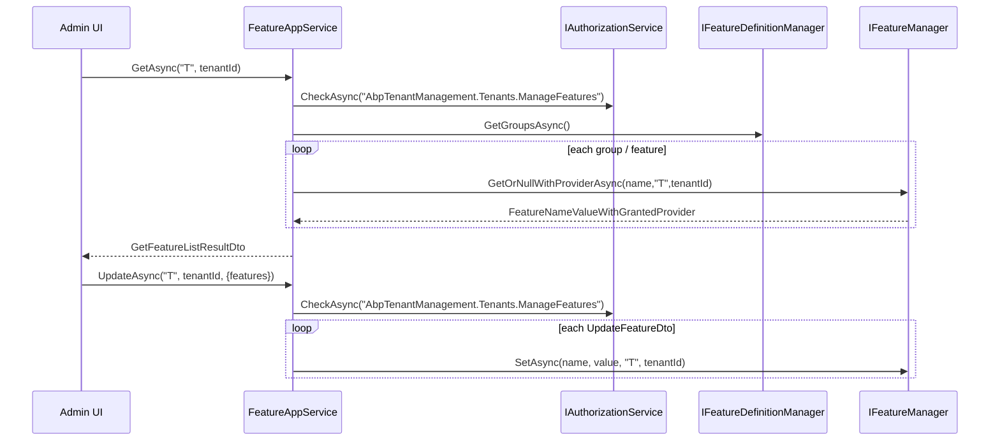

The Feature Management application layer is small but does the three things you can't safely push into the controller: it walks the feature definitions to build the grouped DTO tree the UI consumes, projects each row into a `FeatureDto` carrying its `IStringValueType` so the modal knows whether to render a toggle/text/select, and enforces a *provider‑specific* policy on every read and write. The implementation lives in `modules/feature-management/src/Volo.Abp.FeatureManagement.Application/` and its contract in `Volo.Abp.FeatureManagement.Application.Contracts/`.

<Info>
Namespace: `Volo.Abp.FeatureManagement`. `FeatureAppService` is `[Authorize]` so callers must at minimum be authenticated; per‑provider policies layer on top.
</Info>

## File inventory

| File | Role |
| --- | --- |
| `IFeatureAppService.cs` | Contract — three methods (`GetAsync`, `UpdateAsync`, `DeleteAsync`) that the controller and proxy share. |
| `FeatureAppService.cs` | Implementation. Iterates `IFeatureDefinitionManager`, calls `IFeatureManager`, runs `CheckProviderPolicy`. |
| `FeatureManagementAppServiceBase.cs` | Base class wiring localization + AutoMapper to this module. |
| `AbpFeatureManagementApplicationModule.cs` | `[DependsOn(Domain, ApplicationContracts, AbpDddApplication)]`. |
| `UpdateFeatureDto.cs` / `UpdateFeaturesDto.cs` | Write payloads. |
| `FeatureDto.cs` / `FeatureGroupDto.cs` / `GetFeatureListResultDto.cs` | Read payloads. |
| `FeatureProviderDto.cs` | `{ Name, Key }` — which provider granted the displayed value. |
| `FeatureManagementPermissions.cs` | `FeatureManagement.ManageHostFeatures` constant. |
| `FeaturePermissionDefinitionProvider.cs` | Permission definition (host‑side only). |
| `FeatureManagementRemoteServiceConsts.cs` | `RemoteServiceName = "AbpFeatureManagement"`, `ModuleName = "featureManagement"`. |

## Contract: `IFeatureAppService`

The contract intentionally takes `providerName` / `providerKey` as primitives instead of a dedicated object — it mirrors the same parameters `IFeatureManager` uses and lets the controller bind them straight from the query string.

```csharp modules/feature-management/src/Volo.Abp.FeatureManagement.Application.Contracts/Volo/Abp/FeatureManagement/IFeatureAppService.cs
public interface IFeatureAppService : IApplicationService
{
    Task<GetFeatureListResultDto> GetAsync([NotNull] string providerName, string providerKey);
    Task UpdateAsync([NotNull] string providerName, string providerKey, UpdateFeaturesDto input);
    Task DeleteAsync([NotNull] string providerName, string providerKey);
}
```

### Read DTOs

`GetAsync` returns a tree shape: groups → features. Each `FeatureDto` carries the resolved `Value`, the granting `FeatureProviderDto`, plus the **`IStringValueType`** that tells the UI which control to render — the same value type the feature definition declared in code.

```csharp modules/feature-management/src/Volo.Abp.FeatureManagement.Application.Contracts/Volo/Abp/FeatureManagement/FeatureDto.cs
public class FeatureDto
{
    public string Name { get; set; }
    public string DisplayName { get; set; }
    public string Value { get; set; }
    public FeatureProviderDto Provider { get; set; }
    public string Description { get; set; }
    public IStringValueType ValueType { get; set; }
    public int Depth { get; set; }
    public string ParentName { get; set; }
}
```

```csharp modules/feature-management/src/Volo.Abp.FeatureManagement.Application.Contracts/Volo/Abp/FeatureManagement/FeatureGroupDto.cs
public class FeatureGroupDto
{
    public string Name { get; set; }
    public string DisplayName { get; set; }
    public List<FeatureDto> Features { get; set; }

    public string GetNormalizedGroupName() => Name.Replace(".", "_");
}
```

`Depth` is computed server‑side by `SetFeatureDepth`. The MVC view‑component and Blazor modal use it to indent nested features (`margin-left: depth * 20px`).

### Write DTOs

The write side is a flat list of `(Name, Value)` pairs — the modal sends all visible feature names back, and the manager decides which rows to update and which to clear (see [`/modules/feature-management/domain`](/modules/feature-management/domain) for the same‑as‑fallback de‑duplication).

```csharp modules/feature-management/src/Volo.Abp.FeatureManagement.Application.Contracts/Volo/Abp/FeatureManagement/UpdateFeaturesDto.cs
public class UpdateFeaturesDto { public List<UpdateFeatureDto> Features { get; set; } }
public class UpdateFeatureDto   { public string Name { get; set; } public string Value { get; set; } }
```

`UpdateFeatureDto.Value` is always a `string`. For `ToggleStringValueType` the UI serializes `bool` → `"True"`/`"False"`; for `SelectionStringValueType` it sends the chosen item value; for `FreeTextStringValueType` the raw text. The `ValueType.Validator` on the domain side enforces shape.

## Implementation: `FeatureAppService`

`FeatureAppService` is `[Authorize]` and inherits `FeatureManagementAppServiceBase` (which fixes the localization resource and object‑mapper context). It composes three services: `IFeatureManager` for read/write, `IFeatureDefinitionManager` for iteration order, and `FeatureManagementOptions` for the provider→policy map.

```csharp modules/feature-management/src/Volo.Abp.FeatureManagement.Application/Volo/Abp/FeatureManagement/FeatureAppService.cs
[Authorize]
public class FeatureAppService : FeatureManagementAppServiceBase, IFeatureAppService
{
    protected FeatureManagementOptions Options { get; }
    protected IFeatureManager FeatureManager { get; }
    protected IFeatureDefinitionManager FeatureDefinitionManager { get; }

    public FeatureAppService(IFeatureManager featureManager,
        IFeatureDefinitionManager featureDefinitionManager,
        IOptions<FeatureManagementOptions> options) { ... }
```

### Building the grouped DTO tree

`GetAsync` walks every group, then every feature in each group, calls `IFeatureManager.GetOrNullWithProviderAsync` for the resolved value, and finally calls `SetFeatureDepth` to compute the indent levels:

```csharp modules/feature-management/src/Volo.Abp.FeatureManagement.Application/Volo/Abp/FeatureManagement/FeatureAppService.cs
public virtual async Task<GetFeatureListResultDto> GetAsync([NotNull] string providerName, string providerKey)
{
    await CheckProviderPolicy(providerName, providerKey);

    var result = new GetFeatureListResultDto { Groups = new List<FeatureGroupDto>() };

    foreach (var group in await FeatureDefinitionManager.GetGroupsAsync())
    {
        var groupDto = CreateFeatureGroupDto(group);

        foreach (var featureDefinition in group.GetFeaturesWithChildren())
        {
            if (providerName == TenantFeatureValueProvider.ProviderName &&
                CurrentTenant.Id == null && providerKey == null &&
                !featureDefinition.IsAvailableToHost)
            {
                continue;
            }

            var feature = await FeatureManager.GetOrNullWithProviderAsync(
                featureDefinition.Name, providerName, providerKey);
            groupDto.Features.Add(CreateFeatureDto(feature, featureDefinition));
        }

        SetFeatureDepth(groupDto.Features, providerName, providerKey);

        if (groupDto.Features.Any()) result.Groups.Add(groupDto);
    }
    return result;
}
```

Two visibility rules are worth flagging:

- **`IsAvailableToHost`.** When the caller is the host (`CurrentTenant.Id == null`) viewing host‑side tenant features (`providerKey == null`), features that aren't marked `IsAvailableToHost = true` are skipped. This is what hides per‑tenant‑only features (e.g. *Chat*) from the host overview.
- **Empty groups are dropped.** If every feature in a group got filtered, the group is omitted — the UI tab list stays clean.

The DTO is assembled here:

```csharp modules/feature-management/src/Volo.Abp.FeatureManagement.Application/Volo/Abp/FeatureManagement/FeatureAppService.cs
private FeatureDto CreateFeatureDto(FeatureNameValueWithGrantedProvider f, FeatureDefinition def) =>
    new FeatureDto
    {
        Name = def.Name,
        DisplayName = def.DisplayName?.Localize(StringLocalizerFactory),
        Description = def.Description?.Localize(StringLocalizerFactory),
        ValueType = def.ValueType,
        ParentName = def.Parent?.Name,
        Value = f.Value,
        Provider = new FeatureProviderDto { Name = f.Provider?.Name, Key = f.Provider?.Key }
    };
```

`SetFeatureDepth` does a depth‑first walk based on `ParentName`:

```csharp modules/feature-management/src/Volo.Abp.FeatureManagement.Application/Volo/Abp/FeatureManagement/FeatureAppService.cs
protected virtual void SetFeatureDepth(List<FeatureDto> features, string providerName, string providerKey,
    FeatureDto parentFeature = null, int depth = 0)
{
    foreach (var feature in features)
    {
        if ((parentFeature == null && feature.ParentName == null) ||
            (parentFeature != null && parentFeature.Name == feature.ParentName))
        {
            feature.Depth = depth;
            SetFeatureDepth(features, providerName, providerKey, feature, depth + 1);
        }
    }
}
```

### Provider‑policy authorization

The single most important piece of this layer is `CheckProviderPolicy`. It maps the inbound `providerName` to a concrete authorization policy, with a special case for host‑side viewing of tenant features:

```csharp modules/feature-management/src/Volo.Abp.FeatureManagement.Application/Volo/Abp/FeatureManagement/FeatureAppService.cs
protected virtual async Task CheckProviderPolicy(string providerName, string providerKey)
{
    string policyName;
    if (providerName == TenantFeatureValueProvider.ProviderName &&
        CurrentTenant.Id == null && providerKey == null)
    {
        policyName = FeatureManagementPermissions.ManageHostFeatures;
    }
    else
    {
        policyName = Options.ProviderPolicies.GetOrDefault(providerName);
        if (policyName.IsNullOrEmpty())
        {
            throw new AbpException(
                $"No policy defined to get/set permissions for the provider '{providerName}'. " +
                $"Use {nameof(FeatureManagementOptions)} to map the policy.");
        }
    }
    await AuthorizationService.CheckAsync(policyName);
}
```

The mapping table (after the domain module configures it):

| Caller intent | `providerName` | `providerKey` | `CurrentTenant.Id` | Policy enforced |
| --- | --- | --- | --- | --- |
| Host edits host‑side tenant features | `T` | `null` | `null` | `FeatureManagement.ManageHostFeatures` |
| Host edits a specific tenant's features | `T` | `Guid` | `null` | `AbpTenantManagement.Tenants.ManageFeatures` |
| Tenant edits its own features | `T` | `null` | non‑`null` | `AbpTenantManagement.Tenants.ManageFeatures` |
| Edits an edition's features | `E` | `Guid` | any | *map your own* in `options.ProviderPolicies["E"]` |
| Custom provider (e.g. `User`) | `U` | … | any | *map your own* |

`AbpException` at startup‑time is intentional: it surfaces a mis‑configured provider before requests start failing with confusing 403s.

### Write path

```csharp modules/feature-management/src/Volo.Abp.FeatureManagement.Application/Volo/Abp/FeatureManagement/FeatureAppService.cs
public virtual async Task UpdateAsync(string providerName, string providerKey, UpdateFeaturesDto input)
{
    await CheckProviderPolicy(providerName, providerKey);

    foreach (var feature in input.Features)
    {
        await FeatureManager.SetAsync(feature.Name, feature.Value, providerName, providerKey);
    }
}

public virtual async Task DeleteAsync(string providerName, string providerKey)
{
    await FeatureManager.DeleteAsync(providerName, providerKey);
}
```

The `Update` loop is intentionally not transactional — each `SetAsync` runs in its own UoW because the underlying `FeatureManagementStore` is `[UnitOfWork]`. If the third call fails, the first two writes still land. The UI compensates by re‑fetching after a save.

`DeleteAsync` deletes *all* feature rows for the given `(ProviderName, ProviderKey)` pair. This is exposed in the UI as **Reset to default**.

## Permissions

Feature management defines exactly one permission of its own — the host‑only `ManageHostFeatures` toggle:

```csharp modules/feature-management/src/Volo.Abp.FeatureManagement.Application.Contracts/Volo/Abp/FeatureManagement/FeatureManagementPermissions.cs
public class FeatureManagementPermissions
{
    public const string GroupName = "FeatureManagement";
    public const string ManageHostFeatures = GroupName + ".ManageHostFeatures";

    public static string[] GetAll() => ReflectionHelper.GetPublicConstantsRecursively(typeof(FeatureManagementPermissions));
}
```

```csharp modules/feature-management/src/Volo.Abp.FeatureManagement.Application.Contracts/Volo/Abp/FeatureManagement/FeaturePermissionDefinitionProvider.cs
public class FeaturePermissionDefinitionProvider : PermissionDefinitionProvider
{
    public override void Define(IPermissionDefinitionContext context)
    {
        var featureManagementGroup = context.AddGroup(
            FeatureManagementPermissions.GroupName, L("Permission:FeatureManagement"));

        featureManagementGroup.AddPermission(
            FeatureManagementPermissions.ManageHostFeatures,
            L("Permission:FeatureManagement.ManageHostFeatures"),
            multiTenancySide: MultiTenancySides.Host);
    }

    private static LocalizableString L(string name)
        => LocalizableString.Create<AbpFeatureManagementResource>(name);
}
```

That permission is hosted by the [`/modules/permission-management`](/modules/permission-management/overview) module's `IPermissionGrantRepository`, like every other ABP permission. The tenant‑side policy (`AbpTenantManagement.Tenants.ManageFeatures`) is defined by `AbpTenantManagementPermissionDefinitionProvider` over in the [tenant management application contracts](/modules/tenant-management/application).

## Localization & error mapping

`FeatureManagementAppServiceBase` pins the localization resource so `L["NoFeatureFoundMessage"]`, `L["ResetToDefault"]`, and the validation messages all resolve through `AbpFeatureManagementResource`:

```csharp modules/feature-management/src/Volo.Abp.FeatureManagement.Application/Volo/Abp/FeatureManagement/FeatureManagementAppServiceBase.cs
public abstract class FeatureManagementAppServiceBase : ApplicationService
{
    protected FeatureManagementAppServiceBase()
    {
        ObjectMapperContext = typeof(AbpFeatureManagementApplicationModule);
        LocalizationResource = typeof(AbpFeatureManagementResource);
    }
}
```

`FeatureValueInvalidException` thrown by `FeatureManager.SetAsync` is mapped to its localized form by `AbpExceptionLocalizationOptions` (configured by the domain module) using the namespace `AbpFeatureManagement` and the `Volo.Abp.FeatureManagement:InvalidFeatureValue` code.

## Module wiring

The application module is intentionally bare — all the moving parts already register themselves via `[Dependency]` attributes in the domain layer:

```csharp modules/feature-management/src/Volo.Abp.FeatureManagement.Application/Volo/Abp/FeatureManagement/AbpFeatureManagementApplicationModule.cs
[DependsOn(
    typeof(AbpFeatureManagementDomainModule),
    typeof(AbpFeatureManagementApplicationContractsModule),
    typeof(AbpDddApplicationModule)
    )]
public class AbpFeatureManagementApplicationModule : AbpModule { }
```

## End‑to‑end flow



## Cross‑references

<CardGroup cols={3}>
  <Card title="Domain" icon="cube" href="/modules/feature-management/domain">
    `IFeatureManager` semantics, provider chain, validation.
  </Card>
  <Card title="HTTP API" icon="plug" href="/modules/feature-management/http-api">
    `FeaturesController` route table + client proxy.
  </Card>
  <Card title="Persistence" icon="database" href="/modules/feature-management/persistence">
    Where `FeatureValue` rows live (EF Core / Mongo).
  </Card>
  <Card title="Permission management" icon="lock" href="/modules/permission-management/overview">
    The store the provider policies are evaluated against.
  </Card>
  <Card title="Multi‑tenancy" icon="users" href="/multitenancy">
    `CurrentTenant.Id` / host vs tenant scopes used by `CheckProviderPolicy`.
  </Card>
  <Card title="Features overview" icon="book" href="/settings-features/features-overview">
    Read‑side `IFeatureChecker`, the consumer of what this service writes.
  </Card>
</CardGroup>
