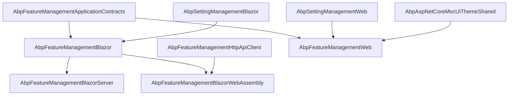

Both the MVC and Blazor UI surfaces present the same artefact — a modal that pivots over groups in a tabbed layout, renders a control per `IStringValueType`, and saves the bulk update back through `IFeatureAppService`. The MVC project lives in `Volo.Abp.FeatureManagement.Web/`, the Blazor project in `Volo.Abp.FeatureManagement.Blazor/`, with thin Blazor Server / WebAssembly hosts that re‑export the right transport. Other tenant‑facing modules (notably [`/modules/tenant-management/blazor-and-web`](/modules/tenant-management/blazor-and-web)) embed the modal directly to expose the "Features" action on a tenant row.

<Info>
The Blazor modal is intentionally invokable from anywhere: callers grab a `@ref` to `FeatureManagementModal` and call `OpenAsync(providerName, providerKey)`. The MVC story is similar but uses a Razor Page modal with an MVC handler.
</Info>

## File inventory

| File | UI | Role |
| --- | --- | --- |
| `AbpFeatureManagementWebModule.cs` | MVC | Module entry. Registers the embedded views, disables the dynamic JS proxy, adds the settings‑page contributor. |
| `Pages/FeatureManagement/FeatureManagementModal.cshtml.cs` | MVC | Razor Page model. Binds `ProviderName` / `ProviderKey` from query, projects the DTO into a view‑model, publishes `CurrentApplicationConfigurationCacheResetEventData` on save. |
| `Pages/FeatureManagement/Components/FeatureSettingGroup/FeatureSettingGroupViewComponent.cs` | MVC | View component embedded by the setting‑management page. |
| `Settings/FeatureSettingManagementPageContributor.cs` | MVC | Adds the *Feature Management* group to the setting‑management page. |
| `AbpFeatureManagementBlazorModule.cs` | Blazor | Module entry. Registers the Blazor settings contributor and adds `AbpUiResource` as a base of the localization resource. |
| `Components/FeatureManagementModal.razor` + `.razor.cs` | Blazor | The actual modal component. |
| `Components/FeatureSettingGroup/FeatureSettingManagementComponent.razor(.cs)` | Blazor | Component embedded by the Blazor setting‑management page. |
| `Settings/FeatureSettingManagementComponentContributor.cs` | Blazor | Adds the Blazor settings group, gated by `FeatureManagement.ManageHostFeatures`. |
| `AbpFeatureManagementComponentBase.cs` | Blazor | Base component fixing the localization resource. |
| `AbpFeatureManagementBlazorServerModule.cs` | Blazor Server | `[DependsOn(AbpFeatureManagementBlazorModule, AbpAspNetCoreComponentsServerThemingModule)]`. |
| `AbpFeatureManagementBlazorWebAssemblyModule.cs` | Blazor WASM | Adds `AbpFeatureManagementHttpApiClientModule` so the modal uses the HTTP proxy. |

## MVC module

`AbpFeatureManagementWebModule` pulls in the shared theming module, the embedded virtual file system, and disables the framework's dynamic JavaScript proxy generator for the `featureManagement` area (the embedded JS file already does it):

```csharp modules/feature-management/src/Volo.Abp.FeatureManagement.Web/AbpFeatureManagementWebModule.cs
[DependsOn(
    typeof(AbpFeatureManagementApplicationContractsModule),
    typeof(AbpAspNetCoreMvcUiThemeSharedModule),
    typeof(AbpSettingManagementWebModule)
    )]
public class AbpFeatureManagementWebModule : AbpModule
{
    public override void ConfigureServices(ServiceConfigurationContext context)
    {
        Configure<AbpVirtualFileSystemOptions>(options =>
        {
            options.FileSets.AddEmbedded<AbpFeatureManagementWebModule>();
        });

        Configure<DynamicJavaScriptProxyOptions>(options =>
        {
            options.DisableModule(FeatureManagementRemoteServiceConsts.ModuleName);
        });

        Configure<SettingManagementPageOptions>(options =>
        {
            options.Contributors.Add(new FeatureSettingManagementPageContributor());
        });
    }
}
```

### Razor Page modal

The MVC modal binds the provider parameters as query/hidden inputs, calls `IFeatureAppService.GetAsync` on `GET`, and on `POST` projects its view‑model back into `UpdateFeaturesDto`:

```csharp modules/feature-management/src/Volo.Abp.FeatureManagement.Web/Pages/FeatureManagement/FeatureManagementModal.cshtml.cs
public class FeatureManagementModal : AbpPageModel
{
    [Required, HiddenInput, BindProperty(SupportsGet = true)]
    public string ProviderName { get; set; }
    [HiddenInput, BindProperty(SupportsGet = true)]
    public string ProviderKey { get; set; }
    [BindProperty]
    public List<FeatureGroupViewModel> FeatureGroups { get; set; }

    public virtual async Task<IActionResult> OnGetAsync()
    {
        ValidateModel();
        FeatureListResultDto = await FeatureAppService.GetAsync(ProviderName, ProviderKey);
        return Page();
    }

    public virtual async Task<IActionResult> OnPostAsync()
    {
        var features = new UpdateFeaturesDto
        {
            Features = FeatureGroups.SelectMany(g => g.Features).Select(f => new UpdateFeatureDto
            {
                Name = f.Name,
                Value = f.Type == nameof(ToggleStringValueType) ? f.BoolValue.ToString() : f.Value
            }).ToList()
        };

        await FeatureAppService.UpdateAsync(ProviderName, ProviderKey, features);
        await LocalEventBus.PublishAsync(new CurrentApplicationConfigurationCacheResetEventData());
        return NoContent();
    }
}
```

Two details worth flagging:

- **Disabled controls.** `IsDisabled(providerName)` returns `true` when the current row's value came from another provider (e.g. an Edition value displayed in a Tenant view). The user can still type — saving will turn the row into an explicit override at this provider — but the indicator shows the fallback.
- **Cache reset.** Publishing `CurrentApplicationConfigurationCacheResetEventData` clears the per‑user `IAbpApplicationConfigurationAccessor` cache so the next request sees the new feature values *without* a refresh.

### Settings‑page contributor

The settings page contributor registers a *Feature Management* group, gated by the `FeatureManagement.ManageHostFeatures` permission so non‑host admins don't see it:

```csharp modules/feature-management/src/Volo.Abp.FeatureManagement.Web/Settings/FeatureSettingManagementPageContributor.cs
public class FeatureSettingManagementPageContributor : SettingPageContributorBase
{
    public FeatureSettingManagementPageContributor()
    {
        RequiredPermissions(FeatureManagementPermissions.ManageHostFeatures);
    }

    public override Task ConfigureAsync(SettingPageCreationContext context)
    {
        var l = context.ServiceProvider.GetRequiredService<IStringLocalizer<AbpFeatureManagementResource>>();
        context.Groups.Add(new SettingPageGroup(
            "Volo.Abp.FeatureManagement",
            l["Menu:FeatureManagement"],
            typeof(FeatureSettingGroupViewComponent)));
        return Task.CompletedTask;
    }
}
```

The view component itself simply exposes whether the current user holds the permission so the embedded view can hide the *Manage host features* button:

```csharp modules/feature-management/src/Volo.Abp.FeatureManagement.Web/Pages/FeatureManagement/Components/FeatureSettingGroup/FeatureSettingGroupViewComponent.cs
public virtual async Task<IViewComponentResult> InvokeAsync()
{
    var model = new FeatureSettingViewModel
    {
        HasManageHostFeaturesPermission = await PermissionChecker.IsGrantedAsync(FeatureManagementPermissions.ManageHostFeatures)
    };
    return View("~/Pages/FeatureManagement/Components/FeatureSettingGroup/Default.cshtml", model);
}
```

## Blazor module

`AbpFeatureManagementBlazorModule` is intentionally tiny: it adds the Blazor settings contributor and chains the localization resource onto `AbpUiResource`:

```csharp modules/feature-management/src/Volo.Abp.FeatureManagement.Blazor/AbpFeatureManagementBlazorModule.cs
[DependsOn(
    typeof(AbpAspNetCoreComponentsWebThemingModule),
    typeof(AbpFeatureManagementApplicationContractsModule),
    typeof(AbpFeaturesModule),
    typeof(AbpSettingManagementBlazorModule)
)]
public class AbpFeatureManagementBlazorModule : AbpModule
{
    public override void ConfigureServices(ServiceConfigurationContext context)
    {
        Configure<SettingManagementComponentOptions>(options =>
        {
            options.Contributors.Add(new FeatureSettingManagementComponentContributor());
        });

        Configure<AbpLocalizationOptions>(options =>
        {
            options.Resources
                .Get<AbpFeatureManagementResource>()
                .AddBaseTypes(typeof(AbpUiResource));
        });
    }
}
```

Note that `AbpFeatureManagementApplicationContractsModule` is in the `[DependsOn]` list but `AbpFeatureManagementHttpApiClientModule` is **not**. That's because the Blazor module is host‑agnostic — the host (`Blazor.Server` or `Blazor.WebAssembly`) chooses the transport:

```csharp modules/feature-management/src/Volo.Abp.FeatureManagement.Blazor.Server/AbpFeatureManagementBlazorServerModule.cs
[DependsOn(
    typeof(AbpFeatureManagementBlazorModule),
    typeof(AbpAspNetCoreComponentsServerThemingModule)
    )]
public class AbpFeatureManagementBlazorServerModule : AbpModule { }
```

```csharp modules/feature-management/src/Volo.Abp.FeatureManagement.Blazor.WebAssembly/AbpFeatureManagementBlazorWebAssemblyModule.cs
[DependsOn(
    typeof(AbpFeatureManagementBlazorModule),
    typeof(AbpAspNetCoreComponentsWebAssemblyThemingModule),
    typeof(AbpFeatureManagementHttpApiClientModule)
)]
public class AbpFeatureManagementBlazorWebAssemblyModule : AbpModule { }
```

Server‑rendered Blazor resolves `IFeatureAppService` to the in‑proc implementation; WebAssembly resolves it to `FeaturesClientProxy` (see [`/modules/feature-management/http-api`](/modules/feature-management/http-api)).

## `FeatureManagementModal.razor`

The Blazor modal is the most-used surface — every "Features" button in the framework (tenant list, edition list, custom admin panels) opens it. The component renders a `Tabs` layout with one `TabPanel` per group:

```razor modules/feature-management/src/Volo.Abp.FeatureManagement.Blazor/Components/FeatureManagementModal.razor
<Modal @ref="Modal" Closing="@ClosingModal">
    <ModalContent Size="ModalSize.Large" Centered="true">
        <ModalHeader>
            <ModalTitle>@L["Features"]</ModalTitle>
            <CloseButton Clicked="CloseModal" />
        </ModalHeader>
        ...
        <ModalBody MaxHeight="50">
            <Tabs TabPosition="TabPosition.Start" Pills="true" @bind-SelectedTab="@SelectedTabName">
                <Items>
                    @foreach (var group in Groups)
                    {
                        <Tab Name="@GetNormalizedGroupName(group.Name)">
                            <span>@group.DisplayName</span>
                        </Tab>
                    }
                </Items>
                <Content>...</Content>
            </Tabs>
        </ModalBody>
        <ModalFooter>
            <Button Color="Color.Primary" Clicked="@(async () => await DeleteAsync(ProviderName, ProviderKey))">@L["ResetToDefault"]</Button>
            <Button Color="Color.Secondary" Clicked="CloseModal">@L["Cancel"]</Button>
            <Button Color="Color.Primary" Clicked="SaveAsync">@L["Save"]</Button>
        </ModalFooter>
    </ModalContent>
</Modal>
```

### Value‑type aware rendering

For each `FeatureDto`, the markup branches on the `ValueType`:

| `ValueType` | Control rendered | Bound to |
| --- | --- | --- |
| `FreeTextStringValueType` | `<TextEdit>` with debounce on `TextChanged` calling `OnFeatureValueChangedAsync` (validates with the feature's `ValueType.Validator`). | `feature.Value` directly. |
| `SelectionStringValueType` | `<Select>` populated from `ValueType.ItemSource.Items`, each option localized through `CreateStringLocalizer`. | `SelectionStringValues[feature.Name]`. |
| `ToggleStringValueType` | `<Check>` (checkbox). | `ToggleValues[feature.Name]`. |

`IsDisabled(provider.Name)` returns `true` when the displayed value came from another provider and the modal is locked at the current provider — so a Tenant view shows Edition fallbacks as read‑only.

### Open / Save / Reset

```csharp modules/feature-management/src/Volo.Abp.FeatureManagement.Blazor/Components/FeatureManagementModal.razor.cs
public virtual async Task OpenAsync([NotNull] string providerName, string providerKey = null)
{
    ProviderName = providerName;
    ProviderKey = providerKey;
    ToggleValues = new Dictionary<string, bool>();
    SelectionStringValues = new Dictionary<string, string>();

    var result = await FeatureAppService.GetAsync(ProviderName, ProviderKey);
    Groups = result?.Groups ?? new List<FeatureGroupDto>();

    if (Groups.Any())
        SelectedTabName = GetNormalizedGroupName(Groups.First().Name);

    foreach (var g in Groups)
        foreach (var f in g.Features)
        {
            if (f.ValueType is ToggleStringValueType) ToggleValues.Add(f.Name, bool.Parse(f.Value));
            if (f.ValueType is SelectionStringValueType) SelectionStringValues.Add(f.Name, f.Value);
        }
    await InvokeAsync(Modal.Show);
}
```

```csharp modules/feature-management/src/Volo.Abp.FeatureManagement.Blazor/Components/FeatureManagementModal.razor.cs
protected virtual async Task SaveAsync()
{
    var features = new UpdateFeaturesDto
    {
        Features = Groups.SelectMany(g => g.Features).Select(f => new UpdateFeatureDto
        {
            Name = f.Name,
            Value = f.ValueType is ToggleStringValueType ? ToggleValues[f.Name].ToString() :
                    f.ValueType is SelectionStringValueType ? SelectionStringValues[f.Name] : f.Value
        }).ToList()
    };

    await FeatureAppService.UpdateAsync(ProviderName, ProviderKey, features);
    await CurrentApplicationConfigurationCacheResetService.ResetAsync();
    await InvokeAsync(Modal.Hide);
}
```

`Reset to default` confirms with the user, then `DELETE`s the entire scope:

```csharp modules/feature-management/src/Volo.Abp.FeatureManagement.Blazor/Components/FeatureManagementModal.razor.cs
public virtual async Task DeleteAsync(string providerName, string providerKey = null)
{
    if (!await Message.Confirm(L["AreYouSureToResetToDefault"])) return;
    await FeatureAppService.DeleteAsync(ProviderName, ProviderKey);
    await Message.Success(L["ResetedToDefault"]);
    await CloseModal();
}
```

### Parent/child toggle propagation

The modal preserves feature‑tree invariants client‑side: toggling a parent on cascades up through `CheckParents`, toggling a parent off cascades the children off through `UncheckChildren`. The server is still the final arbiter (it validates each value), but the UI reflects the hierarchy immediately:

```csharp modules/feature-management/src/Volo.Abp.FeatureManagement.Blazor/Components/FeatureManagementModal.razor.cs
protected virtual void CheckParents(string parentName)
{
    if (parentName.IsNullOrWhiteSpace()) return;
    foreach (var fg in Groups)
        foreach (var f in fg.Features)
            if (f.Name == parentName && ToggleValues.ContainsKey(f.Name))
            {
                ToggleValues[f.Name] = true;
                CheckParents(f.ParentName);
            }
}

protected virtual void UncheckChildren(string featureName)
{
    foreach (var fg in Groups)
        foreach (var f in fg.Features)
            if (f.ParentName == featureName && ToggleValues.ContainsKey(f.Name))
            {
                ToggleValues[f.Name] = false;
                UncheckChildren(f.Name);
            }
}
```

### Indentation

The modal applies `margin-left: depth * 20px` to each rendered field using the `Depth` value computed by `FeatureAppService.SetFeatureDepth` — so nested features are clearly indented in the UI.

## Blazor settings contributor

The settings page contributor mirrors the MVC one but registers a Blazor component instead of an MVC view component, and double‑checks the host permission before showing the group:

```csharp modules/feature-management/src/Volo.Abp.FeatureManagement.Blazor/Settings/FeatureSettingManagementComponentContributor.cs
public virtual async Task ConfigureAsync(SettingComponentCreationContext context)
{
    if (!await CheckPermissionsInternalAsync(context)) return;

    var l = context.ServiceProvider.GetRequiredService<IStringLocalizer<AbpFeatureManagementResource>>();
    context.Groups.Add(new SettingComponentGroup(
        "Volo.Abp.Feature",
        l["Permission:FeatureManagement"],
        typeof(FeatureSettingManagementComponent)));
}

protected virtual async Task<bool> CheckPermissionsInternalAsync(SettingComponentCreationContext context)
{
    var authorizationService = context.ServiceProvider.GetRequiredService<IAuthorizationService>();
    return await authorizationService.IsGrantedAsync(FeatureManagementPermissions.ManageHostFeatures);
}
```

## Hosting the modal from your own component

```razor
@inject IAuthorizationService AuthorizationService
@if (canManageFeatures)
{
    <Button Clicked="OpenFeatures">Features</Button>
    <FeatureManagementModal @ref="FeatureManagementModal" />
}

@code {
    FeatureManagementModal FeatureManagementModal;
    bool canManageFeatures;

    protected override async Task OnInitializedAsync()
        => canManageFeatures = await AuthorizationService
              .IsGrantedAsync("AbpTenantManagement.Tenants.ManageFeatures");

    async Task OpenFeatures()
        => await FeatureManagementModal.OpenAsync(providerName: "T", providerKey: tenantId.ToString());
}
```

This is exactly what [`TenantManagement.razor.cs`](/modules/tenant-management/blazor-and-web) does to expose the *Features* action on a tenant row.

## Module composition



## Cross‑references

<CardGroup cols={3}>
  <Card title="Application" icon="gears" href="/modules/feature-management/application">
    `IFeatureAppService` semantics consumed by both modals.
  </Card>
  <Card title="HTTP API" icon="plug" href="/modules/feature-management/http-api">
    Client proxy the WASM host uses.
  </Card>
  <Card title="Tenant management Blazor & Web" icon="users" href="/modules/tenant-management/blazor-and-web">
    The sibling UI that embeds `FeatureManagementModal`.
  </Card>
  <Card title="Permission management UI" icon="lock" href="/modules/permission-management/blazor-and-web">
    Sibling modal pattern for permissions.
  </Card>
  <Card title="Features overview" icon="book" href="/settings-features/features-overview">
    What runs at runtime after a save.
  </Card>
  <Card title="Multi‑tenancy" icon="globe" href="/multitenancy">
    Why the Tenant provider is the most common caller.
  </Card>
</CardGroup>
