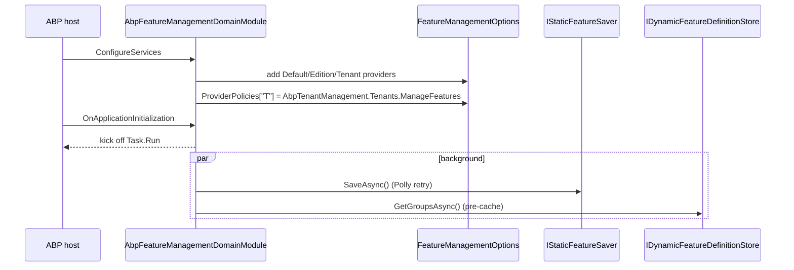

The Feature Management domain layer (`Volo.Abp.FeatureManagement.Domain`) is the heart of the module: a persisted `FeatureValue` aggregate, an `IFeatureManagementStore` that fronts the repository with a distributed cache, an `IFeatureManager` write‑facing API, and the three `IFeatureManagementProvider` implementations (Default, Edition, Tenant) that map the framework's read‑side provider names to actual storage. Every snippet on this page comes from `modules/feature-management/src/Volo.Abp.FeatureManagement.Domain/Volo/Abp/FeatureManagement/` and links directly to the file it was extracted from.

<Info>
The provider *names* (`"D"`, `"E"`, `"T"`) come from `DefaultValueFeatureValueProvider.ProviderName`, `EditionFeatureValueProvider.ProviderName`, and `TenantFeatureValueProvider.ProviderName` declared in the framework's [`Volo.Abp.Features`](https://github.com/abpframework/abp/tree/dev/framework/src/Volo.Abp.Features) package. This module re‑uses the strings so `IFeatureChecker` (read) and `IFeatureManager` (write) refer to the same providers.
</Info>

## File inventory

| File | Role |
| --- | --- |
| `FeatureValue.cs` | Aggregate root (`Entity<Guid>, IAggregateRoot<Guid>`) — Name/Value/ProviderName/ProviderKey row. |
| `IFeatureValueRepository.cs` | `IBasicRepository<FeatureValue, Guid>` with name+provider lookups. |
| `IFeatureManagementStore.cs` / `FeatureManagementStore.cs` | Store contract + caching implementation over the repository. |
| `IFeatureManager.cs` / `FeatureManager.cs` | The write‑facing API used by `FeatureAppService`. Walks the provider chain. |
| `IFeatureManagementProvider.cs` / `FeatureManagementProvider.cs` | Abstract provider with default `Store`‑based GET/SET/CLEAR. |
| `DefaultValueFeatureManagementProvider.cs` | Reads from `FeatureDefinition.DefaultValue`; throws on writes. |
| `EditionFeatureManagementProvider.cs` | Tenant‑independent; key = current edition id. |
| `TenantFeatureManagementProvider.cs` | Key = `ICurrentTenant.Id`; understands tenant switching via `HandleContextAsync`. |
| `FeatureManagementOptions.cs` | Provider list + provider policies + dynamic‑store switches. |
| `FeatureStore.cs` | `IFeatureStore` adapter for the framework's read side. |
| `FeatureValueCacheItem.cs` / `FeatureValueCacheItemInvalidator.cs` | Per‑value distributed cache + entity‑event invalidator. |
| `FeatureDefinitionRecord.cs` / `FeatureGroupDefinitionRecord.cs` | Persistable feature/group definitions for the dynamic store. |
| `DynamicFeatureDefinitionStore.cs` | `IDynamicFeatureDefinitionStore` implementation behind `IsDynamicFeatureStoreEnabled`. |
| `StaticFeatureSaver.cs` / `IStaticFeatureSaver.cs` | Boot‑time reconciliation of static `IFeatureDefinitionProvider` output into the database. |
| `AbpFeatureManagementDomainModule.cs` | Wires the provider list, options, static save & dynamic pre‑cache on startup. |

## The `FeatureValue` aggregate

`FeatureValue` is the only persisted aggregate in this module. Each row stores one feature setting for one provider key — for example "`MaxProjects = 25` for provider `T` with key `4d68…`":

```csharp modules/feature-management/src/Volo.Abp.FeatureManagement.Domain/Volo/Abp/FeatureManagement/FeatureValue.cs
public class FeatureValue : Entity<Guid>, IAggregateRoot<Guid>
{
    [NotNull] public virtual string Name { get; protected set; }
    [NotNull] public virtual string Value { get; internal set; }
    [NotNull] public virtual string ProviderName { get; protected set; }
    [CanBeNull] public virtual string ProviderKey { get; protected set; }

    public FeatureValue(
        Guid id,
        [NotNull] string name,
        [NotNull] string value,
        [NotNull] string providerName,
        [CanBeNull] string providerKey)
    {
        Id = id;
        Name = Check.NotNullOrWhiteSpace(name, nameof(name));
        Value = Check.NotNullOrWhiteSpace(value, nameof(value));
        ProviderName = Check.NotNullOrWhiteSpace(providerName, nameof(providerName));
        ProviderKey = providerKey;
    }
}
```

The repository contract surfaces the lookups the store needs — by name + provider, by provider, and a bulk delete:

```csharp modules/feature-management/src/Volo.Abp.FeatureManagement.Domain/Volo/Abp/FeatureManagement/IFeatureValueRepository.cs
public interface IFeatureValueRepository : IBasicRepository<FeatureValue, Guid>
{
    Task<FeatureValue> FindAsync(string name, string providerName, string providerKey, CancellationToken ct = default);
    Task<List<FeatureValue>> FindAllAsync(string name, string providerName, string providerKey, CancellationToken ct = default);
    Task<List<FeatureValue>> GetListAsync(string providerName, string providerKey, CancellationToken ct = default);
    Task DeleteAsync(string providerName, string providerKey, CancellationToken ct = default);
}
```

Length limits are pinned in `FeatureValueConsts` (128 chars for Name and Value, 64 chars for ProviderName and ProviderKey) — both EF Core and Mongo configurations enforce them. See [`/modules/feature-management/persistence`](/modules/feature-management/persistence) for the schema.

## `IFeatureManagementStore` — cache + repository

`FeatureManagementStore` is the single source of truth between the manager and the database. It is `ITransientDependency`, decorated with `[UnitOfWork]`, and goes through `IDistributedCache<FeatureValueCacheItem>` so subsequent reads in the same UoW hit memory:

```csharp modules/feature-management/src/Volo.Abp.FeatureManagement.Domain/Volo/Abp/FeatureManagement/FeatureManagementStore.cs
public class FeatureManagementStore : IFeatureManagementStore, ITransientDependency
{
    protected IDistributedCache<FeatureValueCacheItem> Cache { get; }
    protected IFeatureDefinitionManager FeatureDefinitionManager { get; }
    protected IFeatureValueRepository FeatureValueRepository { get; }
    protected IGuidGenerator GuidGenerator { get; }

    [UnitOfWork]
    public virtual async Task SetAsync(string name, string value, string providerName, string providerKey)
    {
        var featureValue = await FeatureValueRepository.FindAsync(name, providerName, providerKey);
        if (featureValue == null)
        {
            featureValue = new FeatureValue(GuidGenerator.Create(), name, value, providerName, providerKey);
            await FeatureValueRepository.InsertAsync(featureValue);
        }
        else
        {
            featureValue.Value = value;
            await FeatureValueRepository.UpdateAsync(featureValue);
        }

        await Cache.SetAsync(
            CalculateCacheKey(name, providerName, providerKey),
            new FeatureValueCacheItem(featureValue?.Value),
            considerUow: true);
    }
```

The interesting detail is **bulk prewarm**: on a cache miss for any single feature, `SetCacheItemsAsync` pulls *all* feature values for the same `(ProviderName, ProviderKey)` pair, then writes one cache entry per known definition. So after the first miss for tenant *Acme*, every subsequent feature check for *Acme* is a cache hit:

```csharp modules/feature-management/src/Volo.Abp.FeatureManagement.Domain/Volo/Abp/FeatureManagement/FeatureManagementStore.cs
private async Task SetCacheItemsAsync(
    string providerName, string providerKey, string currentName, FeatureValueCacheItem currentCacheItem)
{
    var featureDefinitions = await FeatureDefinitionManager.GetAllAsync();
    var featuresDictionary = (await FeatureValueRepository.GetListAsync(providerName, providerKey))
        .ToDictionary(s => s.Name, s => s.Value);

    var cacheItems = new List<KeyValuePair<string, FeatureValueCacheItem>>();
    foreach (var featureDefinition in featureDefinitions)
    {
        var featureValue = featuresDictionary.GetOrDefault(featureDefinition.Name);
        cacheItems.Add(new(
            CalculateCacheKey(featureDefinition.Name, providerName, providerKey),
            new FeatureValueCacheItem(featureValue)));
        if (featureDefinition.Name == currentName) currentCacheItem.Value = featureValue;
    }
    await Cache.SetManyAsync(cacheItems, considerUow: true);
}
```

The cache key is deterministic and shared with the read‑side adapter:

```csharp modules/feature-management/src/Volo.Abp.FeatureManagement.Domain/Volo/Abp/FeatureManagement/FeatureValueCacheItem.cs
public static string CalculateCacheKey(string name, string providerName, string providerKey)
{
    return "pn:" + providerName + ",pk:" + providerKey + ",n:" + name;
}
```

A `LocalEventHandler<EntityChangedEventData<FeatureValue>>` removes the entry on every insert/update/delete so other nodes see the change after they replay the local event:

```csharp modules/feature-management/src/Volo.Abp.FeatureManagement.Domain/Volo/Abp/FeatureManagement/FeatureValueCacheItemInvalidator.cs
public virtual async Task HandleEventAsync(EntityChangedEventData<FeatureValue> eventData)
{
    var cacheKey = CalculateCacheKey(
        eventData.Entity.Name,
        eventData.Entity.ProviderName,
        eventData.Entity.ProviderKey);

    await Cache.RemoveAsync(cacheKey, considerUow: true);
}
```

`FeatureStore` is the thin shim that exposes the store to the framework's read‑side `IFeatureStore` (consumed by `IFeatureValueProvider`):

```csharp modules/feature-management/src/Volo.Abp.FeatureManagement.Domain/Volo/Abp/FeatureManagement/FeatureStore.cs
public class FeatureStore : IFeatureStore, ITransientDependency
{
    public virtual Task<string> GetOrNullAsync(string name, string providerName, string providerKey)
        => FeatureManagementStore.GetOrNullAsync(name, providerName, providerKey);
}
```

That single line is why `IFeatureChecker.IsEnabledAsync(...)` (described in [`/settings-features/features-overview`](/settings-features/features-overview)) ends up reading the same rows this module manages.

## `IFeatureManager` — the write API

`IFeatureManager` is the surface `FeatureAppService` (and your own code) calls to read or mutate the persisted values. It returns provider information so the UI can display *which* provider granted a value:

```csharp modules/feature-management/src/Volo.Abp.FeatureManagement.Domain/Volo/Abp/FeatureManagement/IFeatureManager.cs
public interface IFeatureManager
{
    Task<string> GetOrNullAsync(string name, string providerName, string providerKey, bool fallback = true);
    Task<List<FeatureNameValue>> GetAllAsync(string providerName, string providerKey, bool fallback = true);
    Task<FeatureNameValueWithGrantedProvider> GetOrNullWithProviderAsync(string name, string providerName, string providerKey, bool fallback = true);
    Task<List<FeatureNameValueWithGrantedProvider>> GetAllWithProviderAsync(string providerName, string providerKey, bool fallback = true);
    Task SetAsync(string name, string value, string providerName, string providerKey, bool forceToSet = false);
    Task DeleteAsync(string providerName, string providerKey);
}
```

### Read: walking the chain in reverse

`FeatureManager` is registered as a singleton and resolves the `Providers` list lazily from `FeatureManagementOptions`. On every read it starts from the requested `providerName` and walks the chain *backward* (Tenant → Edition → Default) until a provider returns a non‑null value:

```csharp modules/feature-management/src/Volo.Abp.FeatureManagement.Domain/Volo/Abp/FeatureManagement/FeatureManager.cs
protected virtual async Task<FeatureNameValueWithGrantedProvider> GetOrNullInternalAsync(
    string name, string providerName, string providerKey, bool fallback = true)
{
    var feature = await FeatureDefinitionManager.GetAsync(name);
    var providers = Enumerable.Reverse(Providers);

    if (providerName != null) providers = providers.SkipWhile(c => c.Name != providerName);

    var result = new FeatureNameValueWithGrantedProvider(name, null);
    foreach (var provider in providers)
    {
        string pk = null;
        if (provider.Compatible(providerName)) pk = providerKey;

        var value = await provider.GetOrNullAsync(feature, pk);
        if (value != null)
        {
            result.Value = value;
            result.Provider = new FeatureValueProviderInfo(provider.Name, pk);
            break;
        }
    }
    return result;
}
```

The `Compatible(providerName)` check is what makes fallback work: when reading a tenant value and falling through to the edition provider, the *tenant* providerKey isn't passed to the edition provider; instead the edition provider derives its own key from the current principal.

### Write: same‑as‑fallback de‑duplication

`SetAsync` does three things you can't easily get by hitting the store directly:

1. **Validation.** It uses `FeatureDefinition.ValueType.Validator.IsValid(value)`. Mismatches throw `FeatureValueInvalidException(feature.DisplayName)` which the application layer rethrows as a localized `BusinessException` via `FeatureManagementDomainErrorCodes.FeatureValueInvalid`.
2. **Same‑as‑fallback de‑dup.** If you set the value to the *same* value the next provider would have returned anyway, the row is cleared instead of inserted — the system never persists overrides that don't actually override anything.
3. **Tenant‑context switching.** Calls `provider.HandleContextAsync(providerName, providerKey)` before re‑reading the fallback value, so the comparison happens in the right tenant scope.

```csharp modules/feature-management/src/Volo.Abp.FeatureManagement.Domain/Volo/Abp/FeatureManagement/FeatureManager.cs
public virtual async Task SetAsync(string name, string value, string providerName, string providerKey, bool forceToSet = false)
{
    var feature = await FeatureDefinitionManager.GetAsync(name);

    if (feature.ValueType?.Validator.IsValid(value) == false)
        throw new FeatureValueInvalidException(feature.DisplayName.Localize(StringLocalizerFactory));

    var providers = Enumerable.Reverse(Providers).SkipWhile(p => p.Name != providerName).ToList();
    if (!providers.Any()) return;

    if (providers.Count > 1 && !forceToSet && value != null)
    {
        await using (await providers[0].HandleContextAsync(providerName, providerKey))
        {
            var fallbackValue = await GetOrNullInternalAsync(name, providers[1].Name, null);
            if (fallbackValue.Value == value) value = null; // clear if redundant
        }
    }
    ...
    if (value == null) foreach (var provider in providers) await provider.ClearAsync(feature, providerKey);
    else foreach (var provider in providers) await provider.SetAsync(feature, value, providerKey);
}
```

`forceToSet: true` skips the de‑dup, which the UI uses when an admin explicitly wants to pin a tenant's value even if it currently matches its edition.

## The `IFeatureManagementProvider` chain

`IFeatureManagementProvider` is one method richer than the framework's `IFeatureValueProvider`: it adds `SetAsync` / `ClearAsync` and a `HandleContextAsync` hook for scope switching.

```csharp modules/feature-management/src/Volo.Abp.FeatureManagement.Domain/Volo/Abp/FeatureManagement/IFeatureManagementProvider.cs
public interface IFeatureManagementProvider
{
    string Name { get; }
    bool Compatible(string providerName);
    Task<IAsyncDisposable> HandleContextAsync(string providerName, string providerKey);
    Task<string> GetOrNullAsync(FeatureDefinition feature, string providerKey);
    Task SetAsync(FeatureDefinition feature, string value, string providerKey);
    Task ClearAsync(FeatureDefinition feature, string providerKey);
}
```

`FeatureManagementProvider` is the abstract base — it delegates GET/SET/CLEAR to `IFeatureManagementStore` and exposes a `NormalizeProviderKeyAsync` hook that subclasses override to inject ambient state (edition claim, current tenant id) when the caller didn't supply one.

### Default (D)

The Default provider is read‑only: it returns the value from the definition's `DefaultValue` and **throws** if anyone tries to mutate it — the only legitimate way to change a default is to edit a `IFeatureDefinitionProvider`.

```csharp modules/feature-management/src/Volo.Abp.FeatureManagement.Domain/Volo/Abp/FeatureManagement/DefaultValueFeatureManagementProvider.cs
public class DefaultValueFeatureManagementProvider : IFeatureManagementProvider, ISingletonDependency
{
    public string Name => DefaultValueFeatureValueProvider.ProviderName;     // "D"

    public virtual Task<string> GetOrNullAsync(FeatureDefinition feature, string providerKey)
        => Task.FromResult(feature.DefaultValue);

    public virtual Task SetAsync(FeatureDefinition feature, string value, string providerKey)
        => throw new AbpException("Can not set default value of a feature. It is only possible while defining the feature in a IFeatureDefinitionProvider implementation.");
}
```

### Edition (E)

The Edition provider keys off the **`Edition` claim** carried by the current `ClaimsPrincipal` — pulled through `ICurrentPrincipalAccessor`. If the caller passes an explicit key (admin UI sets an edition's features) it wins; otherwise the provider falls back to `Principal.FindEditionId()`.

```csharp modules/feature-management/src/Volo.Abp.FeatureManagement.Domain/Volo/Abp/FeatureManagement/EditionFeatureManagementProvider.cs
public class EditionFeatureManagementProvider : FeatureManagementProvider, ITransientDependency
{
    public override string Name => EditionFeatureValueProvider.ProviderName; // "E"

    protected override Task<string> NormalizeProviderKeyAsync(string providerKey)
    {
        if (providerKey != null) return Task.FromResult(providerKey);
        return Task.FromResult(PrincipalAccessor.Principal?.FindEditionId()?.ToString("N"));
    }
}
```

### Tenant (T)

The Tenant provider is the most interesting. Its key defaults to `ICurrentTenant.Id`, but when the caller hands it an explicit tenant id it overrides `HandleContextAsync` to push that id onto the current‑tenant ambient — so the same‑as‑fallback comparison inside `FeatureManager.SetAsync` runs in the correct tenant scope when the edition provider derives its key from the principal:

```csharp modules/feature-management/src/Volo.Abp.FeatureManagement.Domain/Volo/Abp/FeatureManagement/TenantFeatureManagementProvider.cs
public class TenantFeatureManagementProvider : FeatureManagementProvider, ITransientDependency
{
    public override string Name => TenantFeatureValueProvider.ProviderName;  // "T"

    public override Task<IAsyncDisposable> HandleContextAsync(string providerName, string providerKey)
    {
        if (providerName == Name && !providerKey.IsNullOrWhiteSpace() &&
            Guid.TryParse(providerKey, out var tenantId))
        {
            var disposable = CurrentTenant.Change(tenantId);
            return Task.FromResult<IAsyncDisposable>(
                new AsyncDisposeFunc(() => { disposable.Dispose(); return Task.CompletedTask; }));
        }
        return base.HandleContextAsync(providerName, providerKey);
    }

    protected override Task<string> NormalizeProviderKeyAsync(string providerKey)
        => Task.FromResult(providerKey ?? CurrentTenant.Id?.ToString());
}
```

This is also why the module's domain layer registers a *permission policy* for the Tenant provider — see [`/modules/tenant-management/overview`](/modules/tenant-management/overview) for the matching `AbpTenantManagement.Tenants.ManageFeatures` permission.

## Integration with permission management

Feature management ships **its own** permission (`FeatureManagement.ManageHostFeatures`) so a host admin can edit host‑side features without holding any tenant management permission. The definition lives in the contracts layer:

```csharp modules/feature-management/src/Volo.Abp.FeatureManagement.Application.Contracts/Volo/Abp/FeatureManagement/FeaturePermissionDefinitionProvider.cs
public override void Define(IPermissionDefinitionContext context)
{
    var featureManagementGroup = context.AddGroup(
        FeatureManagementPermissions.GroupName, L("Permission:FeatureManagement"));

    featureManagementGroup.AddPermission(
        FeatureManagementPermissions.ManageHostFeatures,
        L("Permission:FeatureManagement.ManageHostFeatures"),
        multiTenancySide: MultiTenancySides.Host);
}
```

The Tenant provider's policy is configured by the *domain* module from `FeatureManagementOptions.ProviderPolicies` and *aliased* to a permission published by the tenant management module. When you read that table:

| Provider name | Policy name | Defined by |
| --- | --- | --- |
| `T` | `AbpTenantManagement.Tenants.ManageFeatures` | `AbpTenantManagementPermissionDefinitionProvider` (see [`/modules/tenant-management/application`](/modules/tenant-management/application)) |
| `T` *(host side, providerKey null)* | `FeatureManagement.ManageHostFeatures` | `FeaturePermissionDefinitionProvider` (this module) |
| `E` | *no default* | Add your own `options.ProviderPolicies["E"] = …` when shipping editions |

Permissions themselves are stored and checked by the [`/modules/permission-management`](/modules/permission-management/overview) module — Feature management never opens the permission tables itself, it just calls `IAuthorizationService.CheckAsync(policyName)` from `FeatureAppService` (see the [application page](/modules/feature-management/application)).

## Dynamic feature definitions

Beyond persisting *values*, the module can persist *definitions* too. When `FeatureManagementOptions.IsDynamicFeatureStoreEnabled = true`:

- `IStaticFeatureSaver.SaveAsync` reconciles whatever `IFeatureDefinitionProvider`s declared in code into the `AbpFeatureGroups` / `AbpFeatures` tables on boot. It uses Polly with exponential backoff so flaky databases don't abort startup.
- `DynamicFeatureDefinitionStore` (a `[Dependency(ReplaceServices = true)]` for `IDynamicFeatureDefinitionStore`) exposes the merged set of static + dynamic definitions to `IFeatureDefinitionManager`. It uses an in‑memory cache guarded by `IDynamicFeatureDefinitionStoreInMemoryCache.SyncSemaphore` and an `IAbpDistributedLock` so multiple nodes don't race when reloading.
- The boot path pre‑caches the groups so the first request after startup doesn't pay the load cost:

```csharp modules/feature-management/src/Volo.Abp.FeatureManagement.Domain/Volo/Abp/FeatureManagement/AbpFeatureManagementDomainModule.cs
private static async Task PreCacheDynamicFeaturesAsync(FeatureManagementOptions options, IServiceScope scope)
{
    if (!options.IsDynamicFeatureStoreEnabled) return;
    await scope
        .ServiceProvider
        .GetRequiredService<IDynamicFeatureDefinitionStore>()
        .GetGroupsAsync();
}
```

`FeatureDefinitionRecord` carries everything you'd find on the in‑code `FeatureDefinition`: `GroupName`, `Name`, `ParentName`, `DisplayName`, `Description`, `DefaultValue`, `IsVisibleToClients`, `IsAvailableToHost`, `AllowedProviders` (comma list), `ValueType` (serialized `IStringValueType`) and `ExtraProperties`. The `HasSameData` / `Patch` helpers are what `StaticFeatureSaver` uses to do idempotent reconciliation.

## Module boot summary



The background task respects `IHostApplicationLifetime.ApplicationStopping` and `ICancellationTokenProvider`, and both paths short‑circuit in a data‑migration environment (`context.Services.IsDataMigrationEnvironment()`).

## Cross‑references

<CardGroup cols={3}>
  <Card title="Overview" icon="layer-group" href="/modules/feature-management/overview">
    Package matrix and module graph.
  </Card>
  <Card title="Application" icon="gears" href="/modules/feature-management/application">
    How `FeatureAppService` calls `IFeatureManager` and enforces provider policies.
  </Card>
  <Card title="Persistence" icon="database" href="/modules/feature-management/persistence">
    `AbpFeatureValues` table schema (EF + Mongo).
  </Card>
  <Card title="Features overview" icon="book" href="/settings-features/features-overview">
    Framework read‑side: `IFeatureChecker`, `RequiresFeature`.
  </Card>
  <Card title="Multi‑tenancy" icon="users" href="/multitenancy">
    `ICurrentTenant` semantics used by `TenantFeatureManagementProvider`.
  </Card>
  <Card title="Permission management" icon="lock" href="/modules/permission-management/overview">
    Where `AbpTenantManagement.Tenants.ManageFeatures` is stored and checked.
  </Card>
</CardGroup>
