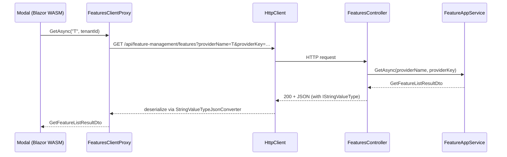

The HTTP API layer takes everything from [`/modules/feature-management/application`](/modules/feature-management/application) and hangs it off three HTTP verbs at a single URL — `GET`, `PUT`, and `DELETE` on `/api/feature-management/features`. It also pre‑configures `System.Text.Json` so that the `IStringValueType` polymorphic property on `FeatureDto` round‑trips correctly between the server and the typed client proxy. The implementation is in `modules/feature-management/src/Volo.Abp.FeatureManagement.HttpApi/` and the matching client lives in `Volo.Abp.FeatureManagement.HttpApi.Client/`.

<Info>
Route prefix: `/api/feature-management/features`. Remote‑service name: `AbpFeatureManagement` (`FeatureManagementRemoteServiceConsts.RemoteServiceName`). Area name: `featureManagement`.
</Info>

## File inventory

| File | Role |
| --- | --- |
| `FeaturesController.cs` | The single MVC controller — implements `IFeatureAppService` so it inherits its semantics and DI types. |
| `AbpFeatureManagementHttpApiModule.cs` | Registers the application part, adds the value‑type JSON converter, configures `AbpFeatureManagementResource → AbpUiResource` base type. |
| `FeaturesClientProxy.cs` / `FeaturesClientProxy.Generated.cs` | Auto‑generated typed client proxy (`partial` + manual file). |
| `AbpFeatureManagementHttpApiClientModule.cs` | Registers the static HTTP client proxies for `AbpFeatureManagementApplicationContractsModule`. |

## Controller

`FeaturesController` is a tiny adapter that forwards to `IFeatureAppService`. It is marked as a remote service so ABP's dynamic proxy generator picks it up, scoped to the `featureManagement` area, and inherits `AbpControllerBase`:

```csharp modules/feature-management/src/Volo.Abp.FeatureManagement.HttpApi/Volo/Abp/FeatureManagement/FeaturesController.cs
[RemoteService(Name = FeatureManagementRemoteServiceConsts.RemoteServiceName)]
[Area(FeatureManagementRemoteServiceConsts.ModuleName)]
[Route("api/feature-management/features")]
public class FeaturesController : AbpControllerBase, IFeatureAppService
{
    protected IFeatureAppService FeatureAppService { get; }

    public FeaturesController(IFeatureAppService featureAppService)
    {
        FeatureAppService = featureAppService;
    }

    [HttpGet]
    public virtual Task<GetFeatureListResultDto> GetAsync(string providerName, string providerKey)
        => FeatureAppService.GetAsync(providerName, providerKey);

    [HttpPut]
    public virtual Task UpdateAsync(string providerName, string providerKey, UpdateFeaturesDto input)
        => FeatureAppService.UpdateAsync(providerName, providerKey, input);

    [HttpDelete]
    public virtual Task DeleteAsync(string providerName, string providerKey)
        => FeatureAppService.DeleteAsync(providerName, providerKey);
}
```

### Route table

| Verb | Route | Bound parameters | Body | Effect |
| --- | --- | --- | --- | --- |
| `GET` | `/api/feature-management/features?providerName={n}&providerKey={k}` | `providerName`, `providerKey` (query) | — | Returns `GetFeatureListResultDto` (groups → features). |
| `PUT` | `/api/feature-management/features?providerName={n}&providerKey={k}` | `providerName`, `providerKey` (query) | `UpdateFeaturesDto` | Bulk update — calls `FeatureManager.SetAsync` per feature. |
| `DELETE` | `/api/feature-management/features?providerName={n}&providerKey={k}` | `providerName`, `providerKey` (query) | — | Resets the provider scope to default. |

`providerName` is typically `"T"` for tenant scopes, `"E"` for edition scopes (and `"D"` is read‑only via Default). `providerKey` is the tenant id / edition id / `null` for host‑side host features. Authorization rules per combination are enforced inside `FeatureAppService.CheckProviderPolicy` — see [`/modules/feature-management/application`](/modules/feature-management/application#provider-policy-authorization).

Because the controller *implements* `IFeatureAppService`, ABP's swagger description, dynamic JavaScript proxy generator (`abp.featureManagement.features.getAsync(...)`), and the C# client proxy below all stay in sync automatically.

### Sample request/response

```http
GET /api/feature-management/features?providerName=T&providerKey=4d68… HTTP/1.1
Authorization: Bearer …
```

```json
{
  "groups": [
    {
      "name": "MyProject.Reporting",
      "displayName": "Reporting",
      "features": [
        {
          "name": "MyProject.Reporting.Enable",
          "displayName": "Enable reporting",
          "value": "true",
          "description": null,
          "valueType": { "name": "ToggleStringValueType", "properties": {} },
          "depth": 0,
          "parentName": null,
          "provider": { "name": "E", "key": "9b7c…" }
        }
      ]
    }
  ]
}
```

Note the `provider.name = "E"` even though we asked for tenant scope — that's the manager telling the UI "this value came from the edition, you're displaying the edition's value as a fallback".

```http
PUT /api/feature-management/features?providerName=T&providerKey=4d68… HTTP/1.1
Content-Type: application/json

{ "features": [ { "name": "MyProject.Reporting.Enable", "value": "false" } ] }
```

## Module wiring

`AbpFeatureManagementHttpApiModule` registers the controller as an application part and (importantly) adds a JSON converter that knows how to round‑trip every concrete `IStringValueType` declared via `ValueValidatorFactoryOptions`:

```csharp modules/feature-management/src/Volo.Abp.FeatureManagement.HttpApi/Volo/Abp/FeatureManagement/AbpFeatureManagementHttpApiModule.cs
[DependsOn(
    typeof(AbpFeatureManagementApplicationContractsModule),
    typeof(AbpAspNetCoreMvcModule))]
public class AbpFeatureManagementHttpApiModule : AbpModule
{
    public override void PreConfigureServices(ServiceConfigurationContext context)
    {
        PreConfigure<IMvcBuilder>(mvcBuilder =>
        {
            mvcBuilder.AddApplicationPartIfNotExists(typeof(AbpFeatureManagementHttpApiModule).Assembly);
        });
    }

    public override void ConfigureServices(ServiceConfigurationContext context)
    {
        Configure<AbpLocalizationOptions>(options =>
        {
            options.Resources
                .Get<AbpFeatureManagementResource>()
                .AddBaseTypes(typeof(AbpUiResource));
        });

        var valueValidatorFactoryOptions = context.Services.ExecutePreConfiguredActions<ValueValidatorFactoryOptions>();
        Configure<JsonOptions>(options =>
        {
            options.JsonSerializerOptions.Converters.AddIfNotContains(
                new StringValueTypeJsonConverter(valueValidatorFactoryOptions));
        });
    }
}
```

`StringValueTypeJsonConverter` is the bit that lets the `ValueType` property on `FeatureDto` round‑trip across the wire — without it, ASP.NET can't decide which concrete `IStringValueType` to construct on read. The converter lives in `Volo.Abp.FeatureManagement.Domain.Shared`'s `JsonConverters/` folder and is reused both server‑side (via `JsonOptions`) and inside the contract module (`AbpFeatureManagementDomainSharedModule` registers it on `AbpSystemTextJsonSerializerOptions`).

## Client proxy

The HTTP client module registers *static* client proxies — generated at build time from the application‑contracts assembly — and points them at the `AbpFeatureManagement` remote service:

```csharp modules/feature-management/src/Volo.Abp.FeatureManagement.HttpApi.Client/Volo/Abp/FeatureManagement/AbpFeatureManagementHttpApiClientModule.cs
[DependsOn(
    typeof(AbpFeatureManagementApplicationContractsModule),
    typeof(AbpHttpClientModule))]
public class AbpFeatureManagementHttpApiClientModule : AbpModule
{
    public override void ConfigureServices(ServiceConfigurationContext context)
    {
        context.Services.AddStaticHttpClientProxies(
            typeof(AbpFeatureManagementApplicationContractsModule).Assembly,
            FeatureManagementRemoteServiceConsts.RemoteServiceName);
    }
}
```

The generated proxy implements `IFeatureAppService` directly so caller code doesn't change between in‑proc and out‑of‑proc topologies:

```csharp modules/feature-management/src/Volo.Abp.FeatureManagement.HttpApi.Client/ClientProxies/Volo/Abp/FeatureManagement/FeaturesClientProxy.Generated.cs
[Dependency(ReplaceServices = true)]
[ExposeServices(typeof(IFeatureAppService), typeof(FeaturesClientProxy))]
public partial class FeaturesClientProxy : ClientProxyBase<IFeatureAppService>, IFeatureAppService
{
    public virtual async Task<GetFeatureListResultDto> GetAsync(string providerName, string providerKey)
        => await RequestAsync<GetFeatureListResultDto>(nameof(GetAsync), new ClientProxyRequestTypeValue
        {
            { typeof(string), providerName },
            { typeof(string), providerKey }
        });
    ...
}
```

The companion (non‑generated) `FeaturesClientProxy.cs` is the place to add hand‑written overrides — by default it is empty.

### Where the proxy is used

- **Blazor WebAssembly.** `AbpFeatureManagementBlazorWebAssemblyModule` depends on the HTTP client module so the modal calls the server over HTTPS.
- **Microservice gateways.** Any host that doesn't want a direct dependency on `…Application` can reference `…HttpApi.Client` and resolve `IFeatureAppService` — the proxy fulfils it.
- **Test harnesses & CLIs.** A console app can `AddApplication<…HttpApi.Client>()` and call the API with strongly typed methods.

## End‑to‑end request



## OpenAPI / Swagger

Because the controller implements `IFeatureAppService` (not just its methods), ABP's `AbpServiceConvention` exposes it under the `featureManagement` API definition. Hosts that register `AddAbpSwaggerGen()` see one operation per verb, parameter types lifted from the interface, and request/response schemas inferred from the DTOs. Configure `AbpSwaggerOptions` if you want to filter or rename the group; see your host's Swagger setup.

## Disabling the dynamic JS proxy on the UI host

When an MVC host references both `…HttpApi` and `…Web` it would normally publish two JavaScript proxies: a generic dynamic one and the static one from the JS files embedded in the Web module. `AbpFeatureManagementWebModule` disables the dynamic generator so only the embedded `featureManagement.js` is served:

```csharp modules/feature-management/src/Volo.Abp.FeatureManagement.Web/AbpFeatureManagementWebModule.cs
Configure<DynamicJavaScriptProxyOptions>(options =>
{
    options.DisableModule(FeatureManagementRemoteServiceConsts.ModuleName);
});
```

That same pattern is repeated in tenant management (see [`/modules/tenant-management/blazor-and-web`](/modules/tenant-management/blazor-and-web)).

## Cross‑references

<CardGroup cols={3}>
  <Card title="Application" icon="gears" href="/modules/feature-management/application">
    The `IFeatureAppService` contract this controller forwards to.
  </Card>
  <Card title="Blazor & Web UI" icon="window" href="/modules/feature-management/blazor-and-web">
    Where the proxy is consumed by the modal.
  </Card>
  <Card title="Persistence" icon="database" href="/modules/feature-management/persistence">
    Where `FeatureValue` rows ultimately land.
  </Card>
  <Card title="Permission management" icon="lock" href="/modules/permission-management/overview">
    Stores the policies the controller checks before calling the service.
  </Card>
  <Card title="Tenant management HTTP API" icon="users" href="/modules/tenant-management/http-api">
    Sibling controller for the `multi-tenancy` area.
  </Card>
  <Card title="Features overview" icon="book" href="/settings-features/features-overview">
    How runtime feature checks ride on the rows updated through this API.
  </Card>
</CardGroup>
