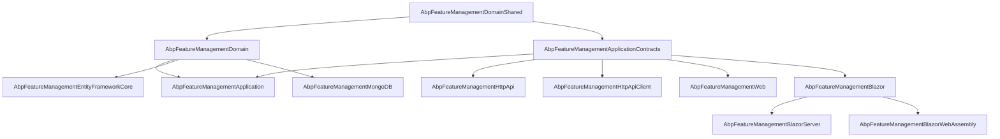
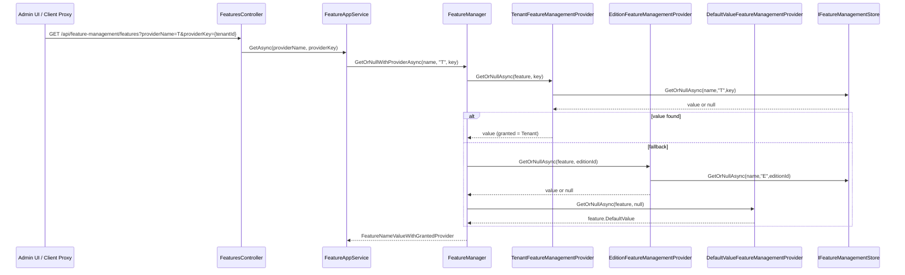

The ABP Feature Management module is the persistence + management plane that sits on top of the framework's `Volo.Abp.Features` abstractions. The framework gives you `IFeatureChecker`, feature definition providers, and the `IFeatureValueProvider` chain that asks "is feature *X* enabled for the current edition/tenant?". This module fills in the missing half: a persistent `FeatureValue` aggregate, an `IFeatureManagementStore` backed by EF Core or MongoDB, an `IFeatureManager` write API, an `IFeatureManagementProvider` chain (Default → Edition → Tenant) that reads/writes those values, an application service + HTTP API to manage them remotely, and Blazor/MVC components that render the feature‑management modal you see in the tenant list.

<Info>
Source root: [`modules/feature-management/src/`](https://github.com/abpframework/abp/tree/dev/modules/feature-management/src). The framework abstractions this module extends live under [`framework/src/Volo.Abp.Features`](https://github.com/abpframework/abp/tree/dev/framework/src/Volo.Abp.Features) and are documented at [`/settings-features/features-overview`](/settings-features/features-overview).
</Info>

## Why a dedicated Feature Management module?

The core framework decides what features *exist* and how to check them at runtime — but it intentionally leaves three concerns to a module:

- **Storage.** A `FeatureValue` aggregate (Name, Value, ProviderName, ProviderKey) persisted in EF Core or MongoDB so values survive process restarts.
- **Management API.** Domain‑level `IFeatureManager` plus an application service / HTTP API so admin UIs (and remote clients) can read every group, set a value for an edition or tenant, and reset to the default.
- **Provider implementations.** Concrete `IFeatureManagementProvider` for the Default value, Edition (keyed by current edition claim), and Tenant (keyed by `ICurrentTenant.Id`) layers, plus authorization policies for each.

Together they let host‑side admins answer: "Edition *Premium* gets `Chat.Enabled=true` and a `SupportLevel=Gold`; tenant *Acme* (on *Premium*) overrides `MaxProjects=50`" — and have those decisions roundtrip through the `IFeatureChecker` everyone else uses.

For the consumer side — how downstream code calls `IFeatureChecker.IsEnabledAsync` and how `[RequiresFeature]` works — see [`/settings-features/features-overview`](/settings-features/features-overview) and [`/settings-features/feature-providers`](/settings-features/feature-providers). For the parallel module that manages permissions, see [`/modules/permission-management/overview`](/modules/permission-management/overview). For tenant identity and the connection‑string store, see [`/multitenancy`](/multitenancy) and the sibling [`/modules/tenant-management/overview`](/modules/tenant-management/overview).

## Package matrix

The module follows ABP's standard layering. Each row maps to a project folder under `modules/feature-management/src/`.

| Package | Project folder | Layer | Primary purpose |
| --- | --- | --- | --- |
| `Volo.Abp.FeatureManagement.Domain.Shared` | `Volo.Abp.FeatureManagement.Domain.Shared/` | Domain.Shared | Constants (`FeatureValueConsts`, error codes), `FeatureValueInvalidException`, value‑validator JSON converters, localization resource. |
| `Volo.Abp.FeatureManagement.Domain` | `Volo.Abp.FeatureManagement.Domain/` | Domain | `FeatureValue` aggregate, `IFeatureManagementStore`/`FeatureManagementStore`, `IFeatureManager`/`FeatureManager`, the `IFeatureManagementProvider` chain, `FeatureStore` adapter, dynamic feature store, distributed cache items. |
| `Volo.Abp.FeatureManagement.Application.Contracts` | `Volo.Abp.FeatureManagement.Application.Contracts/` | Application.Contracts | `IFeatureAppService`, DTOs (`FeatureDto`, `FeatureGroupDto`, `UpdateFeaturesDto`, …), `FeatureManagementPermissions`, `FeaturePermissionDefinitionProvider`. |
| `Volo.Abp.FeatureManagement.Application` | `Volo.Abp.FeatureManagement.Application/` | Application | `FeatureAppService` implementation with provider‑policy authorization. |
| `Volo.Abp.FeatureManagement.HttpApi` | `Volo.Abp.FeatureManagement.HttpApi/` | HttpApi | `FeaturesController` exposing `api/feature-management/features`. |
| `Volo.Abp.FeatureManagement.HttpApi.Client` | `Volo.Abp.FeatureManagement.HttpApi.Client/` | HttpApi.Client | Typed `FeaturesClientProxy` (static + generated) for remote consumption. |
| `Volo.Abp.FeatureManagement.EntityFrameworkCore` | `Volo.Abp.FeatureManagement.EntityFrameworkCore/` | Persistence | `FeatureManagementDbContext` + `EfCoreFeatureValueRepository` / `EfCoreFeatureDefinitionRecordRepository`. |
| `Volo.Abp.FeatureManagement.MongoDB` | `Volo.Abp.FeatureManagement.MongoDB/` | Persistence | `FeatureManagementMongoDbContext` + `MongoFeatureValueRepository` / `MongoFeatureDefinitionRecordRepository`. |
| `Volo.Abp.FeatureManagement.Web` | `Volo.Abp.FeatureManagement.Web/` | MVC UI | `AbpFeatureManagementWebModule`, `FeatureManagementModal.cshtml`, `FeatureSettingGroupViewComponent`, settings‑page contributor. |
| `Volo.Abp.FeatureManagement.Blazor` | `Volo.Abp.FeatureManagement.Blazor/` | Blazor UI | `FeatureManagementModal.razor`, `FeatureSettingManagementComponent`, settings contributor. |
| `Volo.Abp.FeatureManagement.Blazor.Server` / `.WebAssembly` | `Volo.Abp.FeatureManagement.Blazor.Server/`, `.../Blazor.WebAssembly/` | Blazor hosts | Empty `[DependsOn]` shells that pull the right transport (HTTP API or local app service). |
| `Volo.Abp.FeatureManagement.Installer` | `Volo.Abp.FeatureManagement.Installer/` | Installer | Embeds the NuGet manifest used by the ABP CLI to install/update the module. |

## Layered composition (`[DependsOn]` graph)

The dependency graph mirrors the package matrix. Persistence implementations only depend on `Domain`; UI surfaces depend on `Application.Contracts` so they can use either an in‑proc app service or the HTTP client proxy.



`AbpFeatureManagementDomainModule` itself depends on `AbpFeaturesModule` (the framework abstraction package) and `AbpCachingModule`:

```csharp modules/feature-management/src/Volo.Abp.FeatureManagement.Domain/Volo/Abp/FeatureManagement/AbpFeatureManagementDomainModule.cs
[DependsOn(
    typeof(AbpFeatureManagementDomainSharedModule),
    typeof(AbpFeaturesModule),
    typeof(AbpCachingModule)
    )]
public class AbpFeatureManagementDomainModule : AbpModule
{
    public override void ConfigureServices(ServiceConfigurationContext context)
    {
        Configure<FeatureManagementOptions>(options =>
        {
            options.Providers.Add<DefaultValueFeatureManagementProvider>();
            options.Providers.Add<EditionFeatureManagementProvider>();

            //TODO: Should be moved to the Tenant Management module
            options.Providers.Add<TenantFeatureManagementProvider>();
            options.ProviderPolicies[TenantFeatureValueProvider.ProviderName] = "AbpTenantManagement.Tenants.ManageFeatures";
        });
        ...
    }
}
```

Note the **provider order**: Default → Edition → Tenant. `FeatureManager` iterates the list in reverse, so reads start at *Tenant* and fall back to *Edition* and *Default*. That same module wires `ProviderPolicies` so the Tenant provider requires the `AbpTenantManagement.Tenants.ManageFeatures` permission published by the [tenant management module](/modules/tenant-management/overview).

## The provider chain at runtime

<Card title="Two parallel pipelines" icon="route">
The framework's read‑side `IFeatureValueProvider` (Default/Edition/Tenant in `Volo.Abp.Features`) is what `IFeatureChecker` walks at runtime to answer "is X enabled?". This module's `IFeatureManagementProvider` chain is the *management* counterpart — it shares the same three layers but persists writes through `IFeatureManagementStore` and authorizes them through `FeatureManagementOptions.ProviderPolicies`. See [`/settings-features/feature-providers`](/settings-features/feature-providers) for the read side.
</Card>



## Source tree at a glance

```
modules/feature-management/src/
├── Volo.Abp.FeatureManagement.Domain.Shared/
│   └── Volo/Abp/FeatureManagement/
│       ├── AbpFeatureManagementDomainSharedModule.cs
│       ├── FeatureValueConsts.cs
│       ├── FeatureValueInvalidException.cs
│       ├── FeatureManagementDomainErrorCodes.cs
│       └── JsonConverters/        ← StringValueType / ValueValidator converters
├── Volo.Abp.FeatureManagement.Domain/
│   └── Volo/Abp/FeatureManagement/
│       ├── AbpFeatureManagementDomainModule.cs
│       ├── FeatureValue.cs                  ← aggregate
│       ├── FeatureValueCacheItem.cs / Invalidator
│       ├── IFeatureManager.cs / FeatureManager.cs
│       ├── IFeatureManagementStore.cs / FeatureManagementStore.cs
│       ├── IFeatureManagementProvider.cs / FeatureManagementProvider.cs
│       ├── DefaultValueFeatureManagementProvider.cs
│       ├── EditionFeatureManagementProvider.cs
│       ├── TenantFeatureManagementProvider.cs
│       ├── FeatureStore.cs                   ← IFeatureStore adapter
│       ├── DynamicFeatureDefinitionStore.cs  ← when IsDynamicFeatureStoreEnabled
│       ├── StaticFeatureSaver.cs
│       └── FeatureDefinitionRecord.cs / FeatureGroupDefinitionRecord.cs
├── Volo.Abp.FeatureManagement.Application.Contracts/
│   └── Volo/Abp/FeatureManagement/
│       ├── IFeatureAppService.cs
│       ├── FeatureDto.cs / FeatureGroupDto.cs
│       ├── UpdateFeatureDto.cs / UpdateFeaturesDto.cs
│       ├── GetFeatureListResultDto.cs
│       ├── FeatureManagementPermissions.cs
│       └── FeaturePermissionDefinitionProvider.cs
├── Volo.Abp.FeatureManagement.Application/
│   └── Volo/Abp/FeatureManagement/FeatureAppService.cs
├── Volo.Abp.FeatureManagement.HttpApi/
│   └── Volo/Abp/FeatureManagement/FeaturesController.cs
├── Volo.Abp.FeatureManagement.HttpApi.Client/
│   └── ClientProxies/.../FeaturesClientProxy.cs
├── Volo.Abp.FeatureManagement.EntityFrameworkCore/
│   └── Volo/Abp/FeatureManagement/EntityFrameworkCore/
│       ├── FeatureManagementDbContext.cs
│       ├── EfCoreFeatureValueRepository.cs
│       └── FeatureManagementDbContextModelCreatingExtensions.cs
├── Volo.Abp.FeatureManagement.MongoDB/
│   └── Volo/Abp/FeatureManagement/MongoDB/
│       ├── FeatureManagementMongoDbContext.cs
│       └── MongoFeatureValueRepository.cs
├── Volo.Abp.FeatureManagement.Web/
│   ├── AbpFeatureManagementWebModule.cs
│   └── Pages/FeatureManagement/FeatureManagementModal.cshtml.cs
└── Volo.Abp.FeatureManagement.Blazor/
    ├── AbpFeatureManagementBlazorModule.cs
    └── Components/FeatureManagementModal.razor(.cs)
```

## Key flows

### Reading a feature value (admin view)

1. The UI calls `IFeatureAppService.GetAsync(providerName, providerKey)` — `providerName` is `"T"` (tenant), `"E"` (edition) or another registered key.
2. `FeatureAppService` enforces `FeatureManagementOptions.ProviderPolicies[providerName]` via `IAuthorizationService.CheckAsync`. The Tenant provider's policy is `AbpTenantManagement.Tenants.ManageFeatures`; reading host‑side ("T" with `tenantId == null`) requires the dedicated `FeatureManagement.ManageHostFeatures` permission.
3. For each feature definition, `FeatureManager.GetOrNullWithProviderAsync` walks the providers in reverse order, returning the first non‑null value plus the provider that granted it.
4. The DTO returned to the UI carries `Value`, the granting `FeatureProviderDto`, plus the `IStringValueType` (Free text / Selection / Toggle) so the modal knows which control to render.

### Writing a feature value

1. The UI sends `PUT /api/feature-management/features?providerName=T&providerKey={tenantId}` with an `UpdateFeaturesDto`.
2. `FeatureManager.SetAsync` validates the value with the feature's `ValueType.Validator` (throws `FeatureValueInvalidException` on mismatch).
3. If the new value equals the next provider's fallback value, the new value is *cleared* — feature management never persists redundant rows. Otherwise it calls `IFeatureManagementStore.SetAsync`, which upserts a `FeatureValue` row and writes a cache entry keyed by `pn:{ProviderName},pk:{ProviderKey},n:{Name}`.
4. `FeatureValueCacheItemInvalidator` (a `LocalEventHandler<EntityChangedEventData<FeatureValue>>`) removes the cache entry on any subsequent change so other nodes pick it up.

### Resetting

`DELETE /api/feature-management/features?providerName=…&providerKey=…` calls `FeatureAppService.DeleteAsync` → `FeatureManager.DeleteAsync`, which iterates every feature for the provider and calls `ClearAsync` (i.e. `Store.DeleteAsync`). The modal exposes this as the **Reset to default** button.

## When to use this module

<CardGroup cols={2}>
  <Card title="Use it" icon="check">
    - You ship a SaaS where editions / tenants need different feature sets.
    - You need persistent overrides for `IFeatureChecker` / `[RequiresFeature]`.
    - You want the standard admin modal in the tenant list.
  </Card>
  <Card title="Skip it (use `Volo.Abp.Features` directly)" icon="xmark">
    - Your features are static and known at compile time.
    - You only need `IFeatureDefinitionProvider` + `DefaultValue`; no per‑tenant/edition overrides.
    - You implement your own `IFeatureValueProvider` over a custom store.
  </Card>
</CardGroup>

## Configuration knobs

Both knobs live on `FeatureManagementOptions`:

| Option | Default | Effect |
| --- | --- | --- |
| `SaveStaticFeaturesToDatabase` | `true` | On boot, `IStaticFeatureSaver` reconciles `IFeatureDefinitionProvider` output into `AbpFeatureGroups` / `AbpFeatures` tables. |
| `IsDynamicFeatureStoreEnabled` | `false` | Enables `DynamicFeatureDefinitionStore` — feature definitions can be added/edited at runtime via the persistence layer and are merged with static definitions. |
| `Providers` | `[Default, Edition, Tenant]` | Ordered list of `IFeatureManagementProvider` types. Add custom providers (e.g. *User*) by `options.Providers.Add<MyProvider>()`. |
| `ProviderPolicies` | `{ "T" → "AbpTenantManagement.Tenants.ManageFeatures" }` | Authorization policy required by `FeatureAppService.CheckProviderPolicy` to read/write that provider. |

Inside a `IDataMigrationEnvironment` (CLI seed runs) both static save and dynamic store are forced off so migrations never block on cache init.

## Where to go next

<CardGroup cols={3}>
  <Card title="Domain layer" icon="cube" href="/modules/feature-management/domain">
    `FeatureValue`, `FeatureManager`, the provider chain and the cache.
  </Card>
  <Card title="Application layer" icon="gears" href="/modules/feature-management/application">
    `FeatureAppService`, DTOs, policies, permission integration.
  </Card>
  <Card title="HTTP API" icon="plug" href="/modules/feature-management/http-api">
    `FeaturesController`, route table, client proxy.
  </Card>
  <Card title="Persistence" icon="database" href="/modules/feature-management/persistence">
    EF Core and MongoDB schemas + repositories.
  </Card>
  <Card title="Blazor & Web UI" icon="window" href="/modules/feature-management/blazor-and-web">
    `FeatureManagementModal.razor`, the MVC page model, settings contributors.
  </Card>
  <Card title="Features overview" icon="book" href="/settings-features/features-overview">
    How `IFeatureChecker` / `[RequiresFeature]` consume what this module persists.
  </Card>
</CardGroup>
