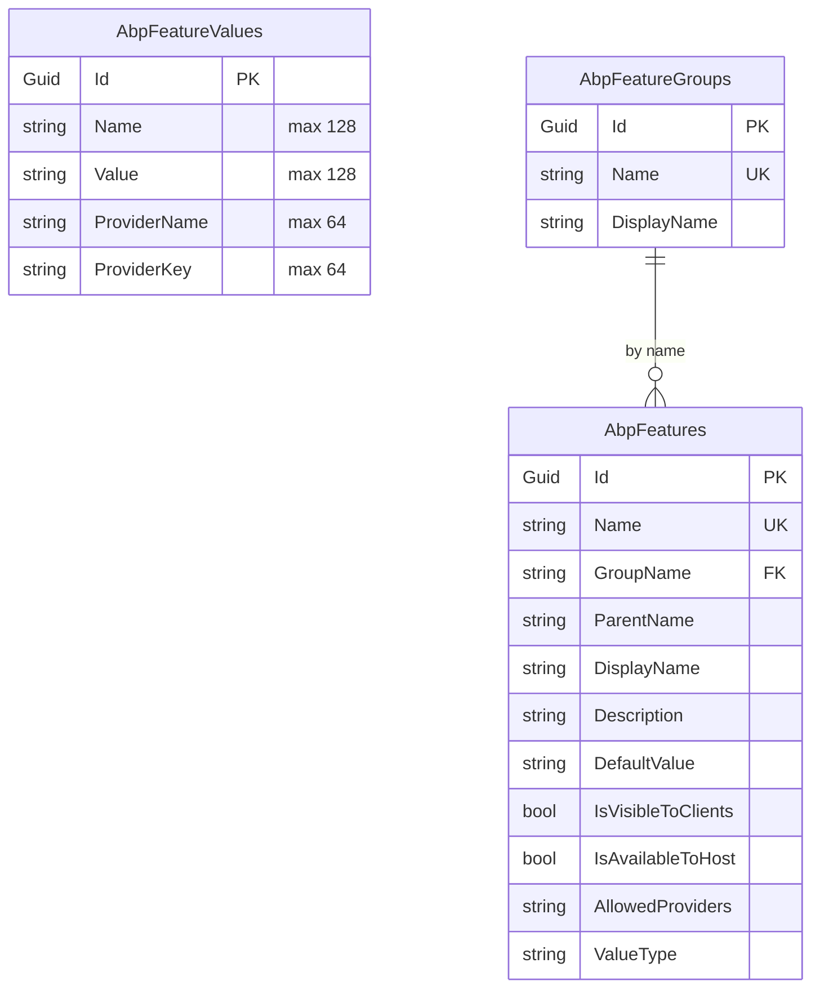

This module ships two interchangeable persistence implementations. Both back the same three aggregates — `FeatureValue` (the runtime overrides), `FeatureDefinitionRecord` and `FeatureGroupDefinitionRecord` (the dynamic definitions) — and both register the same repository interfaces, so picking EF Core or MongoDB is a single `[DependsOn]` change in your host module. This page shows the schemas, the `DbContext` shapes, the repositories, and the indexes that matter for hot paths.

<Info>
Connection string name: `AbpFeatureManagement` (`AbpFeatureManagementDbProperties.ConnectionStringName`). Table/collection prefix defaults to `Abp` (`AbpFeatureManagementDbProperties.DbTablePrefix = AbpCommonDbProperties.DbTablePrefix`). Both contexts are `[IgnoreMultiTenancy]` — feature values live in the host database keyed by `ProviderName` + `ProviderKey`.
</Info>

## Tables / collections

| Aggregate | Default table / collection | Purpose |
| --- | --- | --- |
| `FeatureValue` | `AbpFeatureValues` | One row per `(Name, ProviderName, ProviderKey)` — the actual override values. |
| `FeatureGroupDefinitionRecord` | `AbpFeatureGroups` | Persisted group definitions (when `IsDynamicFeatureStoreEnabled = true`). |
| `FeatureDefinitionRecord` | `AbpFeatures` | Persisted feature definitions (when dynamic store is enabled or `SaveStaticFeaturesToDatabase = true`). |

`FeatureValueConsts` pins the maximum lengths used by both backends:

```csharp modules/feature-management/src/Volo.Abp.FeatureManagement.Domain.Shared/Volo/Abp/FeatureManagement/FeatureValueConsts.cs
public static class FeatureValueConsts
{
    public static int MaxNameLength { get; set; } = 128;
    public static int MaxProviderNameLength { get; set; } = 64;
    public static int MaxProviderKeyLength { get; set; } = 64;
    public static int MaxValueLength { get; set; } = 128;
}
```

`FeatureDefinitionRecordConsts` / `FeatureGroupDefinitionRecordConsts` define the dynamic‑store column lengths the same way.

## Entity Framework Core

### `IFeatureManagementDbContext`

The interface is what every repository binds to. It is `[IgnoreMultiTenancy]` and `[ConnectionStringName]`‑tagged so ABP routes it to the right connection from `IConnectionStringResolver`:

```csharp modules/feature-management/src/Volo.Abp.FeatureManagement.EntityFrameworkCore/Volo/Abp/FeatureManagement/EntityFrameworkCore/IFeatureManagementDbContext.cs
[IgnoreMultiTenancy]
[ConnectionStringName(AbpFeatureManagementDbProperties.ConnectionStringName)]
public interface IFeatureManagementDbContext : IEfCoreDbContext
{
    DbSet<FeatureGroupDefinitionRecord> FeatureGroups { get; }
    DbSet<FeatureDefinitionRecord> Features { get; }
    DbSet<FeatureValue> FeatureValues { get; }
}
```

The concrete `FeatureManagementDbContext` is the only place ABP creates tables when you scaffold migrations against it; if you reuse a host context (e.g. `MyAppDbContext`) you can still pull in the same model via `builder.ConfigureFeatureManagement()`.

### Model creation

`ConfigureFeatureManagement` honours `IsTenantOnlyDatabase` — if the host runs in a tenant‑only database, the entire model is skipped (feature values live on the host side):

```csharp modules/feature-management/src/Volo.Abp.FeatureManagement.EntityFrameworkCore/Volo/Abp/FeatureManagement/EntityFrameworkCore/FeatureManagementDbContextModelCreatingExtensions.cs
public static void ConfigureFeatureManagement(this ModelBuilder builder)
{
    if (builder.IsTenantOnlyDatabase()) return;

    builder.Entity<FeatureValue>(b =>
    {
        b.ToTable(AbpFeatureManagementDbProperties.DbTablePrefix + "FeatureValues",
                  AbpFeatureManagementDbProperties.DbSchema);
        b.ConfigureByConvention();
        b.Property(x => x.Name).HasMaxLength(FeatureValueConsts.MaxNameLength).IsRequired();
        b.Property(x => x.Value).HasMaxLength(FeatureValueConsts.MaxValueLength).IsRequired();
        b.Property(x => x.ProviderName).HasMaxLength(FeatureValueConsts.MaxProviderNameLength);
        b.Property(x => x.ProviderKey).HasMaxLength(FeatureValueConsts.MaxProviderKeyLength);
        b.HasIndex(x => new { x.Name, x.ProviderName, x.ProviderKey }).IsUnique();
        b.ApplyObjectExtensionMappings();
    });

    builder.Entity<FeatureGroupDefinitionRecord>(b =>
    {
        b.ToTable(AbpFeatureManagementDbProperties.DbTablePrefix + "FeatureGroups",
                  AbpFeatureManagementDbProperties.DbSchema);
        b.ConfigureByConvention();
        b.Property(x => x.Name).HasMaxLength(FeatureGroupDefinitionRecordConsts.MaxNameLength).IsRequired();
        b.Property(x => x.DisplayName).HasMaxLength(FeatureGroupDefinitionRecordConsts.MaxDisplayNameLength).IsRequired();
        b.HasIndex(x => new { x.Name }).IsUnique();
    });

    builder.Entity<FeatureDefinitionRecord>(b =>
    {
        b.ToTable(AbpFeatureManagementDbProperties.DbTablePrefix + "Features",
                  AbpFeatureManagementDbProperties.DbSchema);
        b.ConfigureByConvention();
        b.Property(x => x.GroupName).HasMaxLength(FeatureGroupDefinitionRecordConsts.MaxNameLength).IsRequired();
        b.Property(x => x.Name).HasMaxLength(FeatureDefinitionRecordConsts.MaxNameLength).IsRequired();
        b.Property(x => x.ParentName).HasMaxLength(FeatureDefinitionRecordConsts.MaxNameLength);
        b.Property(x => x.DisplayName).HasMaxLength(FeatureDefinitionRecordConsts.MaxDisplayNameLength).IsRequired();
        b.Property(x => x.Description).HasMaxLength(FeatureDefinitionRecordConsts.MaxDescriptionLength);
        b.Property(x => x.DefaultValue).HasMaxLength(FeatureDefinitionRecordConsts.MaxDefaultValueLength);
        b.Property(x => x.AllowedProviders).HasMaxLength(FeatureDefinitionRecordConsts.MaxAllowedProvidersLength);
        b.Property(x => x.ValueType).HasMaxLength(FeatureDefinitionRecordConsts.MaxValueTypeLength);
        b.HasIndex(x => new { x.Name }).IsUnique();
        b.HasIndex(x => new { x.GroupName });
    });

    builder.TryConfigureObjectExtensions<FeatureManagementDbContext>();
}
```

### Indexes that matter

| Table | Index | Used by |
| --- | --- | --- |
| `AbpFeatureValues` | unique (`Name`, `ProviderName`, `ProviderKey`) | `IFeatureValueRepository.FindAsync` (single value), upsert guard. |
| `AbpFeatureValues` | covered by the unique index | `IFeatureValueRepository.GetListAsync(providerName, providerKey)` — the bulk prewarm in `FeatureManagementStore`. |
| `AbpFeatures` | unique on `Name` | `IFeatureDefinitionRecordRepository.FindByNameAsync`. |
| `AbpFeatures` | non‑unique on `GroupName` | `DynamicFeatureDefinitionStore` lookups per group. |
| `AbpFeatureGroups` | unique on `Name` | Group lookups during `StaticFeatureSaver` reconciliation. |

The `(Name, ProviderName, ProviderKey)` unique index doubles as the hot read path — `FeatureManagementStore.SetCacheItemsAsync` issues a single `WHERE ProviderName = ? AND ProviderKey = ?` query and the index covers it.

### Repositories

```csharp modules/feature-management/src/Volo.Abp.FeatureManagement.EntityFrameworkCore/Volo/Abp/FeatureManagement/EntityFrameworkCore/EfCoreFeatureValueRepository.cs
public class EfCoreFeatureValueRepository :
    EfCoreRepository<IFeatureManagementDbContext, FeatureValue, Guid>, IFeatureValueRepository
{
    public virtual async Task<FeatureValue> FindAsync(
        string name, string providerName, string providerKey, CancellationToken ct = default)
    {
        return await (await GetDbSetAsync())
            .OrderBy(x => x.Id)
            .FirstOrDefaultAsync(
                s => s.Name == name && s.ProviderName == providerName && s.ProviderKey == providerKey,
                GetCancellationToken(ct));
    }

    public virtual async Task<List<FeatureValue>> GetListAsync(
        string providerName, string providerKey, CancellationToken ct = default)
    {
        return await (await GetDbSetAsync())
            .Where(s => s.ProviderName == providerName && s.ProviderKey == providerKey)
            .ToListAsync(GetCancellationToken(ct));
    }

    public virtual async Task DeleteAsync(string providerName, string providerKey, CancellationToken ct = default)
    {
        await DeleteAsync(s => s.ProviderName == providerName && s.ProviderKey == providerKey,
            cancellationToken: GetCancellationToken(ct));
    }
}
```

The dynamic‑store repositories are even thinner:

```csharp modules/feature-management/src/Volo.Abp.FeatureManagement.EntityFrameworkCore/Volo/Abp/FeatureManagement/EntityFrameworkCore/EfCoreFeatureDefinitionRecordRepository.cs
public class EfCoreFeatureDefinitionRecordRepository :
    EfCoreRepository<IFeatureManagementDbContext, FeatureDefinitionRecord, Guid>,
    IFeatureDefinitionRecordRepository
{
    public virtual async Task<FeatureDefinitionRecord> FindByNameAsync(string name, CancellationToken ct = default)
        => await (await GetDbSetAsync())
            .OrderBy(x => x.Id)
            .FirstOrDefaultAsync(r => r.Name == name, ct);
}
```

### EF module wiring

`AbpFeatureManagementEntityFrameworkCoreModule` registers the DbContext, then explicitly replaces the three repositories (the default convention‑based ones would also work, but the explicit registration documents the intent):

```csharp modules/feature-management/src/Volo.Abp.FeatureManagement.EntityFrameworkCore/Volo/Abp/FeatureManagement/EntityFrameworkCore/AbpFeatureManagementEntityFrameworkCoreModule.cs
context.Services.AddAbpDbContext<FeatureManagementDbContext>(options =>
{
    options.AddRepository<FeatureGroupDefinitionRecord, EfCoreFeatureGroupDefinitionRecordRepository>();
    options.AddRepository<FeatureDefinitionRecord, EfCoreFeatureDefinitionRecordRepository>();
    options.AddDefaultRepositories<IFeatureManagementDbContext>();
    options.AddRepository<FeatureValue, EfCoreFeatureValueRepository>();
});
```

### Schema diagram



(There is no foreign key — `FeatureDefinitionRecord.GroupName` is matched by string. Both records carry `ExtraProperties` thanks to `ConfigureByConvention` + `ApplyObjectExtensionMappings`.)

## MongoDB

The MongoDB story is symmetric. `IFeatureManagementMongoDbContext` exposes the same three collections; the context binds the `AbpFeatureManagement` connection name:

```csharp modules/feature-management/src/Volo.Abp.FeatureManagement.MongoDB/Volo/Abp/FeatureManagement/MongoDB/IFeatureManagementMongoDbContext.cs
[IgnoreMultiTenancy]
[ConnectionStringName(AbpFeatureManagementDbProperties.ConnectionStringName)]
public interface IFeatureManagementMongoDbContext : IAbpMongoDbContext
{
    IMongoCollection<FeatureGroupDefinitionRecord> FeatureGroups { get; }
    IMongoCollection<FeatureDefinitionRecord> Features { get; }
    IMongoCollection<FeatureValue> FeatureValues { get; }
}
```

```csharp modules/feature-management/src/Volo.Abp.FeatureManagement.MongoDB/Volo/Abp/FeatureManagement/MongoDB/FeatureManagementMongoDbContextExtensions.cs
public static void ConfigureFeatureManagement(this IMongoModelBuilder builder)
{
    builder.Entity<FeatureGroupDefinitionRecord>(b => { b.CollectionName = AbpFeatureManagementDbProperties.DbTablePrefix + "FeatureGroups"; });
    builder.Entity<FeatureDefinitionRecord>(b => { b.CollectionName = AbpFeatureManagementDbProperties.DbTablePrefix + "Features"; });
    builder.Entity<FeatureValue>(b => { b.CollectionName = AbpFeatureManagementDbProperties.DbTablePrefix + "FeatureValues"; });
}
```

`MongoFeatureValueRepository` mirrors the EF implementation function for function:

```csharp modules/feature-management/src/Volo.Abp.FeatureManagement.MongoDB/Volo/Abp/FeatureManagement/MongoDB/MongoFeatureValueRepository.cs
public virtual async Task<FeatureValue> FindAsync(
    string name, string providerName, string providerKey, CancellationToken ct = default)
{
    return await (await GetMongoQueryableAsync(ct))
        .OrderBy(x => x.Id)
        .FirstOrDefaultAsync(
            s => s.Name == name && s.ProviderName == providerName && s.ProviderKey == providerKey,
            GetCancellationToken(ct));
}

public virtual async Task DeleteAsync(string providerName, string providerKey, CancellationToken ct = default)
{
    var dbContext = await GetDbContextAsync();
    await dbContext.FeatureValues.DeleteManyAsync(
        x => x.ProviderName == providerName && x.ProviderKey == providerKey,
        GetCancellationToken(ct));
}
```

`MongoFeatureValueRepository.DeleteAsync` uses `DeleteManyAsync` directly on the collection rather than the generic repository's delete pipeline because the upstream call (`FeatureManager.DeleteAsync` for **Reset to default**) wants the bulk operation in a single round trip.

### Mongo module wiring

```csharp modules/feature-management/src/Volo.Abp.FeatureManagement.MongoDB/Volo/Abp/FeatureManagement/MongoDB/AbpFeatureManagementMongoDbModule.cs
context.Services.AddMongoDbContext<FeatureManagementMongoDbContext>(options =>
{
    options.AddDefaultRepositories<IFeatureManagementMongoDbContext>();
    options.AddRepository<FeatureGroupDefinitionRecord, MongoFeatureGroupDefinitionRecordRepository>();
    options.AddRepository<FeatureDefinitionRecord, MongoFeatureDefinitionRecordRepository>();
    options.AddRepository<FeatureValue, MongoFeatureValueRepository>();
});
```

## Choosing a backend

<CardGroup cols={2}>
  <Card title="EF Core" icon="database">
    Pick this when your host already runs on EF Core. You get migrations, foreign‑key‑style indexes on `AbpFeatureValues`, and a single transaction with the rest of your domain via `IUnitOfWork`.
  </Card>
  <Card title="MongoDB" icon="leaf">
    Pick this when your host uses Mongo end‑to‑end. The collections are created on demand and the repositories use server‑side `DeleteMany` for resets. There is no built‑in unique index on `(Name, ProviderName, ProviderKey)` — uniqueness is enforced by `FeatureManagementStore.SetAsync` (read then insert/update). Add a compound index in your seed if you write to the collection from outside the manager.
  </Card>
</CardGroup>

## Static save vs dynamic store

`FeatureManagementOptions` flips two switches that control which tables are touched:

| Switch | Default | Touches |
| --- | --- | --- |
| `SaveStaticFeaturesToDatabase` | `true` | `AbpFeatureGroups` + `AbpFeatures` — `IStaticFeatureSaver` reconciles in‑code definitions on boot. |
| `IsDynamicFeatureStoreEnabled` | `false` | `AbpFeatureGroups` + `AbpFeatures` — `DynamicFeatureDefinitionStore` reads them at runtime as additional definitions. |

Both default to *off* when the host runs in a data‑migration environment, so EF migrations never block on the dynamic pre‑cache step.

## Cross‑references

<CardGroup cols={3}>
  <Card title="Domain" icon="cube" href="/modules/feature-management/domain">
    The aggregates this layer persists.
  </Card>
  <Card title="Application" icon="gears" href="/modules/feature-management/application">
    What writes to these tables via `IFeatureManager`.
  </Card>
  <Card title="Tenant management persistence" icon="users" href="/modules/tenant-management/persistence">
    Sibling persistence pattern for the tenant aggregate.
  </Card>
  <Card title="Permission management" icon="lock" href="/modules/permission-management/overview">
    Where the policies guarding writes are stored.
  </Card>
  <Card title="Features overview" icon="book" href="/settings-features/features-overview">
    How `IFeatureChecker` reads these rows at runtime.
  </Card>
  <Card title="Multi‑tenancy" icon="globe" href="/multitenancy">
    Why `IFeatureManagementDbContext` is `[IgnoreMultiTenancy]`.
  </Card>
</CardGroup>
