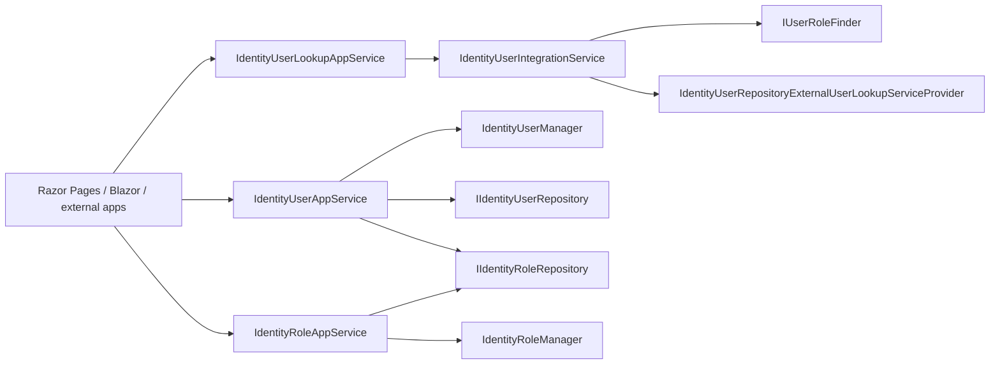

The Identity application layer is the public face of the module for callers that already speak ABP — Razor Pages, Blazor components, MVC controllers in the same process, or other modules invoked via `ICrudAppService<>`. Two packages compose it: `Volo.Abp.Identity.Application.Contracts` (interfaces, DTOs, permission definitions) and `Volo.Abp.Identity.Application` (implementations). This page walks through every app‑service member you'll touch, its `[Authorize]` decoration, the AutoMapper profile, and the integration service that sits behind the cross‑service `/integration-api/...` HTTP surface. For domain types referenced below, jump to [`/modules/identity/domain`](/modules/identity/domain); for HTTP routing, see [`/modules/identity/http-api`](/modules/identity/http-api).

## Module wiring

```csharp modules/identity/src/Volo.Abp.Identity.Application/Volo/Abp/Identity/AbpIdentityApplicationModule.cs
[DependsOn(
    typeof(AbpIdentityDomainModule),
    typeof(AbpIdentityApplicationContractsModule),
    typeof(AbpAutoMapperModule),
    typeof(AbpPermissionManagementApplicationModule)
    )]
public class AbpIdentityApplicationModule : AbpModule
{
    public override void ConfigureServices(ServiceConfigurationContext context)
    {
        context.Services.AddAutoMapperObjectMapper<AbpIdentityApplicationModule>();

        Configure<AbpAutoMapperOptions>(options =>
        {
            options.AddProfile<AbpIdentityApplicationModuleAutoMapperProfile>(validate: true);
        });
    }
}
```

The application module pulls in `AbpPermissionManagementApplicationModule` because every Identity user/role surface needs to be able to read/write per‑role and per‑user permission grants — see [`/modules/permission-management/overview`](/modules/permission-management/overview).

The contracts module configures the dynamic property extension system so extra properties on `IdentityUserDto` / `IdentityRoleDto` survive round trips:

```csharp modules/identity/src/Volo.Abp.Identity.Application.Contracts/Volo/Abp/Identity/AbpIdentityApplicationContractsModule.cs
[DependsOn(
    typeof(AbpIdentityDomainSharedModule),
    typeof(AbpUsersAbstractionModule),
    typeof(AbpAuthorizationModule),
    typeof(AbpPermissionManagementApplicationContractsModule)
    )]
public class AbpIdentityApplicationContractsModule : AbpModule
{
    public override void PostConfigureServices(ServiceConfigurationContext context)
    {
        OneTimeRunner.Run(() =>
        {
            ModuleExtensionConfigurationHelper.ApplyEntityConfigurationToApi(
                IdentityModuleExtensionConsts.ModuleName,
                IdentityModuleExtensionConsts.EntityNames.Role,
                getApiTypes:    new[] { typeof(IdentityRoleDto) },
                createApiTypes: new[] { typeof(IdentityRoleCreateDto) },
                updateApiTypes: new[] { typeof(IdentityRoleUpdateDto) }
            );

            ModuleExtensionConfigurationHelper.ApplyEntityConfigurationToApi(
                IdentityModuleExtensionConsts.ModuleName,
                IdentityModuleExtensionConsts.EntityNames.User,
                getApiTypes:    new[] { typeof(IdentityUserDto) },
                createApiTypes: new[] { typeof(IdentityUserCreateDto) },
                updateApiTypes: new[] { typeof(IdentityUserUpdateDto) }
            );
        });
    }
}
```

## File inventory

### `Volo.Abp.Identity.Application.Contracts`

| File | Type | Role |
| --- | --- | --- |
| `IIdentityUserAppService.cs` | interface | `ICrudAppService<...>` + GetRoles/Assign/Update/FindByUsername/FindByEmail |
| `IIdentityRoleAppService.cs` | interface | `ICrudAppService<...>` + `GetAllListAsync` |
| `IIdentityUserLookupAppService.cs` | interface (obsolete) | Find/search by id/username/count |
| `Integration/IIdentityUserIntegrationService.cs` | `[IntegrationService]` interface | Cross‑service lookups |
| `IdentityUserDto.cs` / `IdentityRoleDto.cs` | DTOs | Read models |
| `IdentityUserCreateDto.cs` / `IdentityUserUpdateDto.cs` | DTOs | Create/update |
| `IdentityRoleCreateDto.cs` / `IdentityRoleUpdateDto.cs` | DTOs | Create/update |
| `IdentityUserUpdateRolesDto.cs` | DTO | Role assignment input |
| `GetIdentityUsersInput.cs` / `GetIdentityRolesInput.cs` | inputs | Paged/sorted list inputs |
| `UserLookupSearchInputDto.cs` / `UserLookupCountInputDto.cs` | inputs | Lookup inputs |
| `IdentityPermissions.cs` | static | Permission name constants |
| `IdentityPermissionDefinitionProvider.cs` | provider | Permission definition tree |
| `IdentityRemoteServiceConsts.cs` | static | `RemoteServiceName = "AbpIdentity"` |

### `Volo.Abp.Identity.Application`

| File | Type | Role |
| --- | --- | --- |
| `IdentityAppServiceBase.cs` | abstract | Sets `LocalizationResource = IdentityResource`, `ObjectMapperContext = AbpIdentityApplicationModule` |
| `IdentityUserAppService.cs` | service | User CRUD + role assignment |
| `IdentityRoleAppService.cs` | service | Role CRUD |
| `IdentityUserLookupAppService.cs` | service (obsolete) | Delegates to `IIdentityUserIntegrationService` |
| `Integration/IdentityUserIntegrationService.cs` | service | `[IntegrationService]` implementation |
| `AbpIdentityApplicationModuleAutoMapperProfile.cs` | AutoMapper profile | DTO mappings |

## Base class

All four app services derive from `IdentityAppServiceBase`, which fixes the localization and object‑mapper contexts:

```csharp modules/identity/src/Volo.Abp.Identity.Application/Volo/Abp/Identity/IdentityAppServiceBase.cs
public abstract class IdentityAppServiceBase : ApplicationService
{
    protected IdentityAppServiceBase()
    {
        ObjectMapperContext  = typeof(AbpIdentityApplicationModule);
        LocalizationResource = typeof(IdentityResource);
    }
}
```

That lets every service call `L["..."]` against `IdentityResource` and `ObjectMapper.Map<TFrom, TTo>(...)` against the profile registered above.

## `IdentityUserAppService`

The interface extends `ICrudAppService<>` with the user‑specific methods:

```csharp modules/identity/src/Volo.Abp.Identity.Application.Contracts/Volo/Abp/Identity/IIdentityUserAppService.cs
public interface IIdentityUserAppService
    : ICrudAppService<
        IdentityUserDto,
        Guid,
        GetIdentityUsersInput,
        IdentityUserCreateDto,
        IdentityUserUpdateDto>
{
    Task<ListResultDto<IdentityRoleDto>> GetRolesAsync(Guid id);
    Task<ListResultDto<IdentityRoleDto>> GetAssignableRolesAsync();
    Task UpdateRolesAsync(Guid id, IdentityUserUpdateRolesDto input);
    Task<IdentityUserDto> FindByUsernameAsync(string userName);
    Task<IdentityUserDto> FindByEmailAsync(string email);
}
```

The implementation delegates to `IdentityUserManager` for invariants and `IIdentityUserRepository` for query‑side calls:

```csharp modules/identity/src/Volo.Abp.Identity.Application/Volo/Abp/Identity/IdentityUserAppService.cs
public class IdentityUserAppService : IdentityAppServiceBase, IIdentityUserAppService
{
    protected IdentityUserManager UserManager { get; }
    protected IIdentityUserRepository UserRepository { get; }
    protected IIdentityRoleRepository RoleRepository { get; }
    protected IOptions<IdentityOptions> IdentityOptions { get; }

    public IdentityUserAppService(
        IdentityUserManager userManager,
        IIdentityUserRepository userRepository,
        IIdentityRoleRepository roleRepository,
        IOptions<IdentityOptions> identityOptions)
    {
        UserManager     = userManager;
        UserRepository  = userRepository;
        RoleRepository  = roleRepository;
        IdentityOptions = identityOptions;
    }

    [Authorize(IdentityPermissions.Users.Default)]
    public virtual async Task<IdentityUserDto> GetAsync(Guid id)
    {
        return ObjectMapper.Map<IdentityUser, IdentityUserDto>(
            await UserManager.GetByIdAsync(id)
        );
    }

    [Authorize(IdentityPermissions.Users.Default)]
    public virtual async Task<PagedResultDto<IdentityUserDto>> GetListAsync(GetIdentityUsersInput input)
    {
        var count = await UserRepository.GetCountAsync(input.Filter);
        var list  = await UserRepository.GetListAsync(
            input.Sorting, input.MaxResultCount, input.SkipCount, input.Filter);

        return new PagedResultDto<IdentityUserDto>(
            count,
            ObjectMapper.Map<List<IdentityUser>, List<IdentityUserDto>>(list)
        );
    }
}
```

Authorization is method‑level. The permission constants come from `IdentityPermissions` (see further down):

| Method | Permission | Notes |
| --- | --- | --- |
| `GetAsync(Guid)` | `AbpIdentity.Users` | Throws `EntityNotFoundException` via `UserManager.GetByIdAsync` |
| `GetListAsync(GetIdentityUsersInput)` | `AbpIdentity.Users` | Simple `Filter` over username/email |
| `GetRolesAsync(Guid)` | `AbpIdentity.Users` | Uses `IIdentityUserRepository.GetRolesAsync` |
| `GetAssignableRolesAsync()` | `AbpIdentity.Users` | Returns every role in the tenant |
| `CreateAsync(IdentityUserCreateDto)` | `AbpIdentity.Users.Create` | `UserManager.CreateAsync(user, input.Password)`, then `UpdateUserByInput` |
| `UpdateAsync(Guid, IdentityUserUpdateDto)` | `AbpIdentity.Users.Update` | Honors `ConcurrencyStamp`, optional password reset |
| `DeleteAsync(Guid)` | `AbpIdentity.Users.Delete` | Refuses self‑deletion with `IdentityErrorCodes.UserSelfDeletion` |
| `UpdateRolesAsync(Guid, IdentityUserUpdateRolesDto)` | `AbpIdentity.Users.Update` | `UserManager.SetRolesAsync` |
| `FindByUsernameAsync(string)` | `AbpIdentity.Users` | Thin wrapper on `UserManager.FindByNameAsync` |
| `FindByEmailAsync(string)` | `AbpIdentity.Users` | Thin wrapper on `UserManager.FindByEmailAsync` |

A few subtleties to call out:

**Create flow.** `CreateAsync` constructs the aggregate, stamps it via `MapExtraPropertiesTo`, calls `UserManager.CreateAsync(user, input.Password)`, then `UpdateUserByInput` handles email/phone/lockout/roles, and finally `CurrentUnitOfWork.SaveChangesAsync()` commits — see [`/data/unit-of-work`](/uow/overview).

```csharp modules/identity/src/Volo.Abp.Identity.Application/Volo/Abp/Identity/IdentityUserAppService.cs
[Authorize(IdentityPermissions.Users.Create)]
public virtual async Task<IdentityUserDto> CreateAsync(IdentityUserCreateDto input)
{
    await IdentityOptions.SetAsync();

    var user = new IdentityUser(
        GuidGenerator.Create(),
        input.UserName,
        input.Email,
        CurrentTenant.Id
    );

    input.MapExtraPropertiesTo(user);

    (await UserManager.CreateAsync(user, input.Password)).CheckErrors();
    await UpdateUserByInput(user, input);
    (await UserManager.UpdateAsync(user)).CheckErrors();

    await CurrentUnitOfWork.SaveChangesAsync();

    return ObjectMapper.Map<IdentityUser, IdentityUserDto>(user);
}
```

**Update flow honors concurrency and lockout self‑edit.** `UpdateUserByInput` only flips `LockoutEnabled` if the operator is editing *another* user (so administrators cannot accidentally lock themselves out):

```csharp modules/identity/src/Volo.Abp.Identity.Application/Volo/Abp/Identity/IdentityUserAppService.cs
protected virtual async Task UpdateUserByInput(IdentityUser user, IdentityUserCreateOrUpdateDtoBase input)
{
    if (!string.Equals(user.Email, input.Email, StringComparison.InvariantCultureIgnoreCase))
    {
        (await UserManager.SetEmailAsync(user, input.Email)).CheckErrors();
    }

    if (!string.Equals(user.PhoneNumber, input.PhoneNumber, StringComparison.InvariantCultureIgnoreCase))
    {
        (await UserManager.SetPhoneNumberAsync(user, input.PhoneNumber)).CheckErrors();
    }

    if (user.Id != CurrentUser.Id)
    {
        (await UserManager.SetLockoutEnabledAsync(user, input.LockoutEnabled)).CheckErrors();
    }

    user.Name = input.Name;
    user.Surname = input.Surname;
    (await UserManager.UpdateAsync(user)).CheckErrors();
    user.SetIsActive(input.IsActive);
    if (input.RoleNames != null)
    {
        (await UserManager.SetRolesAsync(user, input.RoleNames)).CheckErrors();
    }
}
```

**Self‑deletion guard.** `DeleteAsync` consults `CurrentUser.Id` (see [`/authz/current-user`](/utilities/security-and-current-user)):

```csharp modules/identity/src/Volo.Abp.Identity.Application/Volo/Abp/Identity/IdentityUserAppService.cs
[Authorize(IdentityPermissions.Users.Delete)]
public virtual async Task DeleteAsync(Guid id)
{
    if (CurrentUser.Id == id)
    {
        throw new BusinessException(code: IdentityErrorCodes.UserSelfDeletion);
    }

    var user = await UserManager.FindByIdAsync(id.ToString());
    if (user == null)
    {
        return;
    }

    (await UserManager.DeleteAsync(user)).CheckErrors();
}
```

## `IdentityRoleAppService`

```csharp modules/identity/src/Volo.Abp.Identity.Application.Contracts/Volo/Abp/Identity/IIdentityRoleAppService.cs
public interface IIdentityRoleAppService
    : ICrudAppService<
        IdentityRoleDto,
        Guid,
        GetIdentityRolesInput,
        IdentityRoleCreateDto,
        IdentityRoleUpdateDto>
{
    Task<ListResultDto<IdentityRoleDto>> GetAllListAsync();
}
```

The implementation puts a class‑level `[Authorize(IdentityPermissions.Roles.Default)]` on the type and tightens per‑method permissions where needed:

```csharp modules/identity/src/Volo.Abp.Identity.Application/Volo/Abp/Identity/IdentityRoleAppService.cs
[Authorize(IdentityPermissions.Roles.Default)]
public class IdentityRoleAppService : IdentityAppServiceBase, IIdentityRoleAppService
{
    protected IdentityRoleManager  RoleManager   { get; }
    protected IIdentityRoleRepository RoleRepository { get; }

    public virtual async Task<IdentityRoleDto> GetAsync(Guid id)
    {
        return ObjectMapper.Map<IdentityRole, IdentityRoleDto>(await RoleManager.GetByIdAsync(id));
    }

    public virtual async Task<ListResultDto<IdentityRoleDto>> GetAllListAsync()
    {
        var list = await RoleRepository.GetListAsync();
        return new ListResultDto<IdentityRoleDto>(
            ObjectMapper.Map<List<IdentityRole>, List<IdentityRoleDto>>(list)
        );
    }

    public virtual async Task<PagedResultDto<IdentityRoleDto>> GetListAsync(GetIdentityRolesInput input)
    {
        var list = await RoleRepository.GetListAsync(input.Sorting, input.MaxResultCount, input.SkipCount, input.Filter);
        var totalCount = await RoleRepository.GetCountAsync(input.Filter);

        return new PagedResultDto<IdentityRoleDto>(
            totalCount,
            ObjectMapper.Map<List<IdentityRole>, List<IdentityRoleDto>>(list)
        );
    }

    [Authorize(IdentityPermissions.Roles.Create)]
    public virtual async Task<IdentityRoleDto> CreateAsync(IdentityRoleCreateDto input)
    {
        var role = new IdentityRole(GuidGenerator.Create(), input.Name, CurrentTenant.Id)
        {
            IsDefault = input.IsDefault,
            IsPublic  = input.IsPublic
        };

        input.MapExtraPropertiesTo(role);

        (await RoleManager.CreateAsync(role)).CheckErrors();
        await CurrentUnitOfWork.SaveChangesAsync();

        return ObjectMapper.Map<IdentityRole, IdentityRoleDto>(role);
    }

    [Authorize(IdentityPermissions.Roles.Update)]
    public virtual async Task<IdentityRoleDto> UpdateAsync(Guid id, IdentityRoleUpdateDto input)
    {
        var role = await RoleManager.GetByIdAsync(id);

        role.SetConcurrencyStampIfNotNull(input.ConcurrencyStamp);

        (await RoleManager.SetRoleNameAsync(role, input.Name)).CheckErrors();

        role.IsDefault = input.IsDefault;
        role.IsPublic  = input.IsPublic;

        input.MapExtraPropertiesTo(role);

        (await RoleManager.UpdateAsync(role)).CheckErrors();
        await CurrentUnitOfWork.SaveChangesAsync();

        return ObjectMapper.Map<IdentityRole, IdentityRoleDto>(role);
    }

    [Authorize(IdentityPermissions.Roles.Delete)]
    public virtual async Task DeleteAsync(Guid id)
    {
        var role = await RoleManager.FindByIdAsync(id.ToString());
        if (role == null) return;
        (await RoleManager.DeleteAsync(role)).CheckErrors();
    }
}
```

Renaming or deleting an `IsStatic` role surfaces a `BusinessException` from `IdentityRoleManager` — the failure mode is described on [`/modules/identity/domain#identityrolemanager`](/modules/identity/domain).

## `IdentityUserLookupAppService` (obsolete)

The lookup service exists for backward compatibility. Today it simply forwards to `IIdentityUserIntegrationService`:

```csharp modules/identity/src/Volo.Abp.Identity.Application/Volo/Abp/Identity/IdentityUserLookupAppService.cs
[Obsolete("Use IdentityUserIntegrationService for module-to-module (or service-to-service) communication.")]
[Authorize(IdentityPermissions.UserLookup.Default)]
public class IdentityUserLookupAppService : IdentityAppServiceBase, IIdentityUserLookupAppService
{
    protected IIdentityUserIntegrationService IdentityUserIntegrationService { get; }

    public IdentityUserLookupAppService(IIdentityUserIntegrationService identityUserIntegrationService)
    {
        IdentityUserIntegrationService = identityUserIntegrationService;
    }

    public virtual Task<UserData> FindByIdAsync(Guid id)                               => IdentityUserIntegrationService.FindByIdAsync(id);
    public virtual Task<UserData> FindByUserNameAsync(string userName)                 => IdentityUserIntegrationService.FindByUserNameAsync(userName);
    public virtual Task<ListResultDto<UserData>> SearchAsync(UserLookupSearchInputDto input) => IdentityUserIntegrationService.SearchAsync(input);
    public virtual Task<long> GetCountAsync(UserLookupCountInputDto input)             => IdentityUserIntegrationService.GetCountAsync(input);
}
```

New code should consume `IIdentityUserIntegrationService` directly.

## `IdentityUserIntegrationService`

`IIdentityUserIntegrationService` is the supported cross‑service contract. It is decorated with `[IntegrationService]`, which causes ABP to surface it under `integration-api/...` rather than the public `api/...` surface — see [`/microservices/integration-services`](/web/auto-api-controllers).

```csharp modules/identity/src/Volo.Abp.Identity.Application.Contracts/Volo/Abp/Identity/Integration/IIdentityUserIntegrationService.cs
[IntegrationService]
public interface IIdentityUserIntegrationService : IApplicationService
{
    Task<string[]> GetRoleNamesAsync(Guid id);

    Task<UserData> FindByIdAsync(Guid id);

    Task<UserData> FindByUserNameAsync(string userName);

    Task<ListResultDto<UserData>> SearchAsync(UserLookupSearchInputDto input);

    Task<long> GetCountAsync(UserLookupCountInputDto input);
}
```

The implementation composes two collaborators — `IUserRoleFinder` (for `GetRoleNamesAsync`) and `IdentityUserRepositoryExternalUserLookupServiceProvider` (the in‑process `IExternalUserLookupServiceProvider`):

```csharp modules/identity/src/Volo.Abp.Identity.Application/Volo/Abp/Identity/Integration/IdentityUserIntegrationService.cs
public class IdentityUserIntegrationService : IdentityAppServiceBase, IIdentityUserIntegrationService
{
    protected IUserRoleFinder UserRoleFinder { get; }
    protected IdentityUserRepositoryExternalUserLookupServiceProvider UserLookupServiceProvider { get; }

    public IdentityUserIntegrationService(
        IUserRoleFinder userRoleFinder,
        IdentityUserRepositoryExternalUserLookupServiceProvider userLookupServiceProvider)
    {
        UserRoleFinder = userRoleFinder;
        UserLookupServiceProvider = userLookupServiceProvider;
    }

    public virtual async Task<string[]> GetRoleNamesAsync(Guid id)
    {
        return await UserRoleFinder.GetRoleNamesAsync(id);
    }

    public virtual async Task<UserData> FindByIdAsync(Guid id)
    {
        var userData = await UserLookupServiceProvider.FindByIdAsync(id);
        if (userData == null)
        {
            return null;
        }

        return new UserData(userData);
    }

    public virtual async Task<UserData> FindByUserNameAsync(string userName)
    {
        var userData = await UserLookupServiceProvider.FindByUserNameAsync(userName);
        if (userData == null)
        {
            return null;
        }

        return new UserData(userData);
    }

    public virtual async Task<ListResultDto<UserData>> SearchAsync(UserLookupSearchInputDto input)
    {
        var users = await UserLookupServiceProvider.SearchAsync(
            input.Sorting,
            input.Filter,
            input.MaxResultCount,
            input.SkipCount
        );

        return new ListResultDto<UserData>(
            users.Select(u => new UserData(u)).ToList()
        );
    }

    public virtual async Task<long> GetCountAsync(UserLookupCountInputDto input)
    {
        return await UserLookupServiceProvider.GetCountAsync(input.Filter);
    }
}
```

`UserData` is the cross‑module DTO from `Volo.Abp.Users` — see the same record in the `/account` module surface for sign‑in.

## DTOs

### `IdentityUserDto`

```csharp modules/identity/src/Volo.Abp.Identity.Application.Contracts/Volo/Abp/Identity/IdentityUserDto.cs
public class IdentityUserDto : ExtensibleFullAuditedEntityDto<Guid>, IMultiTenant, IHasConcurrencyStamp, IHasEntityVersion
{
    public Guid?  TenantId { get; set; }
    public string UserName { get; set; }
    public string Name { get; set; }
    public string Surname { get; set; }
    public string Email { get; set; }
    public bool   EmailConfirmed { get; set; }
    public string PhoneNumber { get; set; }
    public bool   PhoneNumberConfirmed { get; set; }
    public bool   IsActive { get; set; }
    public bool   LockoutEnabled { get; set; }
    public int    AccessFailedCount { get; set; }
    public DateTimeOffset? LockoutEnd { get; set; }
    public string ConcurrencyStamp { get; set; }
    public int    EntityVersion { get; set; }
    public DateTimeOffset? LastPasswordChangeTime { get; set; }
}
```

Inheriting `ExtensibleFullAuditedEntityDto<Guid>` means an `ExtraProperties` bag is serialized alongside the named fields — see [`/data/extra-properties`](/ddd/entities-and-aggregates).

### `IdentityRoleDto`

```csharp modules/identity/src/Volo.Abp.Identity.Application.Contracts/Volo/Abp/Identity/IdentityRoleDto.cs
public class IdentityRoleDto : ExtensibleEntityDto<Guid>, IHasConcurrencyStamp
{
    public string Name { get; set; }
    public bool   IsDefault { get; set; }
    public bool   IsStatic { get; set; }
    public bool   IsPublic { get; set; }
    public string ConcurrencyStamp { get; set; }
}
```

### Create / update inputs

```csharp modules/identity/src/Volo.Abp.Identity.Application.Contracts/Volo/Abp/Identity/IdentityUserCreateOrUpdateDtoBase.cs
public abstract class IdentityUserCreateOrUpdateDtoBase : ExtensibleObject
{
    [Required]
    [DynamicStringLength(typeof(IdentityUserConsts), nameof(IdentityUserConsts.MaxUserNameLength))]
    public string UserName { get; set; }

    [DynamicStringLength(typeof(IdentityUserConsts), nameof(IdentityUserConsts.MaxNameLength))]
    public string Name { get; set; }

    [DynamicStringLength(typeof(IdentityUserConsts), nameof(IdentityUserConsts.MaxSurnameLength))]
    public string Surname { get; set; }

    [Required]
    [EmailAddress]
    [DynamicStringLength(typeof(IdentityUserConsts), nameof(IdentityUserConsts.MaxEmailLength))]
    public string Email { get; set; }

    [DynamicStringLength(typeof(IdentityUserConsts), nameof(IdentityUserConsts.MaxPhoneNumberLength))]
    public string PhoneNumber { get; set; }

    public bool IsActive { get; set; }
    public bool LockoutEnabled { get; set; }

    [CanBeNull]
    public string[] RoleNames { get; set; }

    protected IdentityUserCreateOrUpdateDtoBase() : base(false) { }
}
```

`DynamicStringLength` defers to the constants in `IdentityUserConsts` so module‑extension overrides survive. `IdentityUserCreateDto` adds `Password`; `IdentityUserUpdateDto` adds optional `Password` plus `ConcurrencyStamp`.

### Search inputs

```csharp modules/identity/src/Volo.Abp.Identity.Application.Contracts/Volo/Abp/Identity/GetIdentityUsersInput.cs
public class GetIdentityUsersInput : PagedAndSortedResultRequestDto
{
    public string Filter { get; set; }
}
```

`GetIdentityRolesInput` is identical in shape.

## AutoMapper profile

The application module's profile is minimal because most DTO members match aggregate properties one‑to‑one. The interesting calls are the `MapExtraProperties()` extensions, which surface the dynamic property dictionary into the DTO:

```csharp modules/identity/src/Volo.Abp.Identity.Application/Volo/Abp/Identity/AbpIdentityApplicationModuleAutoMapperProfile.cs
public class AbpIdentityApplicationModuleAutoMapperProfile : Profile
{
    public AbpIdentityApplicationModuleAutoMapperProfile()
    {
        CreateMap<IdentityUser, IdentityUserDto>()
            .MapExtraProperties();

        CreateMap<IdentityRole, IdentityRoleDto>()
            .MapExtraProperties();
    }
}
```

The `validate: true` argument on `AddProfile` forces AutoMapper to surface missing/typo'd member mappings at startup. There's a sibling domain‑layer profile (`IdentityDomainMappingProfile`) for the distributed ETOs — see [`/modules/identity/domain`](/modules/identity/domain).

## Permission definitions

`IdentityPermissions` defines the permission *names*:

```csharp modules/identity/src/Volo.Abp.Identity.Application.Contracts/Volo/Abp/Identity/IdentityPermissions.cs
public static class IdentityPermissions
{
    public const string GroupName = "AbpIdentity";

    public static class Roles
    {
        public const string Default            = GroupName + ".Roles";
        public const string Create             = Default + ".Create";
        public const string Update             = Default + ".Update";
        public const string Delete             = Default + ".Delete";
        public const string ManagePermissions  = Default + ".ManagePermissions";
    }

    public static class Users
    {
        public const string Default            = GroupName + ".Users";
        public const string Create             = Default + ".Create";
        public const string Update             = Default + ".Update";
        public const string Delete             = Default + ".Delete";
        public const string ManagePermissions  = Default + ".ManagePermissions";
    }

    public static class UserLookup
    {
        public const string Default = GroupName + ".UserLookup";
    }

    public static string[] GetAll()
        => ReflectionHelper.GetPublicConstantsRecursively(typeof(IdentityPermissions));
}
```

`IdentityPermissionDefinitionProvider` registers them into the permission tree. The tree is consumed by the permission management UI and persisted via [`/modules/permission-management`](/modules/permission-management/overview). For the broader authorization pipeline, see [`/authz/overview`](/authz/overview).

## Authorization map

This table consolidates the `[Authorize]` attributes already shown above:

| Operation | Required permission |
| --- | --- |
| `IdentityUserAppService.GetAsync`, `GetListAsync`, `GetRolesAsync`, `GetAssignableRolesAsync`, `FindByUsernameAsync`, `FindByEmailAsync` | `AbpIdentity.Users` |
| `IdentityUserAppService.CreateAsync` | `AbpIdentity.Users.Create` |
| `IdentityUserAppService.UpdateAsync`, `UpdateRolesAsync` | `AbpIdentity.Users.Update` |
| `IdentityUserAppService.DeleteAsync` | `AbpIdentity.Users.Delete` |
| `IdentityRoleAppService` (class‑level) | `AbpIdentity.Roles` |
| `IdentityRoleAppService.CreateAsync` | `AbpIdentity.Roles.Create` |
| `IdentityRoleAppService.UpdateAsync` | `AbpIdentity.Roles.Update` |
| `IdentityRoleAppService.DeleteAsync` | `AbpIdentity.Roles.Delete` |
| `IdentityUserLookupAppService` (class‑level) | `AbpIdentity.UserLookup` |
| `IIdentityUserIntegrationService` | No `[Authorize]`; gated by integration‑service auth — see [`/microservices/integration-services`](/web/auto-api-controllers) |

## Composition diagram



## Cross‑module integration points

<CardGroup cols={2}>
  <Card title="Permission Management" icon="key" href="/modules/permission-management/overview">
    `[Authorize]` constants come from `IdentityPermissions`; grants live in the permission management store.
  </Card>
  <Card title="Account module" icon="user" href="/modules/account/overview">
    Calls `IIdentityUserAppService` for registration and `IIdentityUserIntegrationService` for cross‑service lookups.
  </Card>
  <Card title="HTTP API" icon="globe" href="/modules/identity/http-api">
    The controllers in `HttpApi` re‑expose every method of these interfaces.
  </Card>
  <Card title="Unit of work" icon="rotate" href="/uow/overview">
    Each app‑service method runs in an ABP unit of work — note the explicit `SaveChangesAsync()` calls in `CreateAsync`.
  </Card>
</CardGroup>
