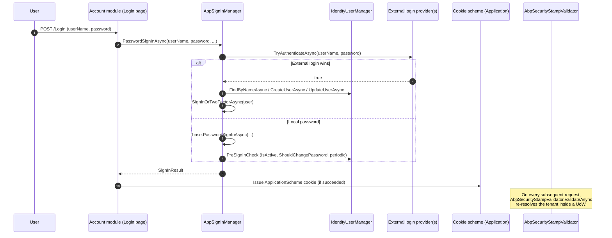

`Volo.Abp.Identity.AspNetCore` is the thin glue that makes the domain layer behave like a regular ASP.NET Core Identity stack inside an HTTP host. It replaces the default `SignInManager<>` with a tenant‑ and external‑login‑aware `AbpSignInManager`, swaps in a tenant‑switching `AbpSecurityStampValidator`, registers the `LinkUserTokenProvider` used by impersonation flows, and (optionally) sets up the cookie authentication handlers Identity expects. It is the seam between the persisted aggregates from [`/modules/identity/domain`](/modules/identity/domain) and the cookie/JWT pipeline that the [`/modules/account`](/modules/account/overview) module drives.

<Info>
Source root: [`modules/identity/src/Volo.Abp.Identity.AspNetCore/`](https://github.com/abpframework/abp/tree/dev/modules/identity/src/Volo.Abp.Identity.AspNetCore). Namespace: `Volo.Abp.Identity.AspNetCore`.
</Info>

## File inventory

| File | Type | Purpose |
| --- | --- | --- |
| `Volo/Abp/Identity/AspNetCore/AbpIdentityAspNetCoreModule.cs` | `AbpModule` | Wires the rest of the package |
| `Volo/Abp/Identity/AspNetCore/AbpIdentityAspNetCoreOptions.cs` | options | `ConfigureAuthentication` toggle |
| `Volo/Abp/Identity/AspNetCore/AbpSignInManager.cs` | `SignInManager<IdentityUser>` | External‑login + pre‑sign‑in checks |
| `Volo/Abp/Identity/AspNetCore/AbpSecurityStampValidator.cs` | `SecurityStampValidator<IdentityUser>` | Tenant‑scoped stamp refresh |
| `Volo/Abp/Identity/AspNetCore/AbpSecurityStampValidatorCallback.cs` | static callback | Preserves non‑Identity claims across refresh |
| `Volo/Abp/Identity/AspNetCore/SecurityStampValidatorOptionsExtensions.cs` | extensions | `UpdatePrincipal()` registration helper |
| `Volo/Abp/Identity/AspNetCore/LinkUserTokenProvider.cs` | token provider | Tokens for the link‑user flow |
| `Volo/Abp/Identity/AspNetCore/SignInResultExtensions.cs` | extensions | `SignInResult` → `IdentitySecurityLogActionConsts` mapping |
| `Microsoft/AspNetCore/Extensions/DependencyInjection/AbpAspNetCoreServiceCollectionExtensions.cs` | extensions | `ForwardIdentityAuthenticationForBearer` |

## Module wiring

```csharp modules/identity/src/Volo.Abp.Identity.AspNetCore/Volo/Abp/Identity/AspNetCore/AbpIdentityAspNetCoreModule.cs
[DependsOn(
    typeof(AbpIdentityDomainModule)
    )]
public class AbpIdentityAspNetCoreModule : AbpModule
{
    public override void PreConfigureServices(ServiceConfigurationContext context)
    {
        PreConfigure<IdentityBuilder>(builder =>
        {
            builder
                .AddDefaultTokenProviders()
                .AddTokenProvider<LinkUserTokenProvider>(LinkUserTokenProviderConsts.LinkUserTokenProviderName)
                .AddSignInManager<AbpSignInManager>()
                .AddUserValidator<AbpIdentityUserValidator>();
        });
    }

    public override void ConfigureServices(ServiceConfigurationContext context)
    {
        //(TODO: Extract an extension method like IdentityBuilder.AddAbpSecurityStampValidator())
        context.Services.AddScoped<AbpSecurityStampValidator>();
        context.Services.AddScoped(typeof(SecurityStampValidator<IdentityUser>),
            provider => provider.GetService(typeof(AbpSecurityStampValidator)));
        context.Services.AddScoped(typeof(ISecurityStampValidator),
            provider => provider.GetService(typeof(AbpSecurityStampValidator)));

        var options = context.Services.ExecutePreConfiguredActions(new AbpIdentityAspNetCoreOptions());

        if (options.ConfigureAuthentication)
        {
            context.Services
                .AddAuthentication(o =>
                {
                    o.DefaultScheme        = IdentityConstants.ApplicationScheme;
                    o.DefaultSignInScheme  = IdentityConstants.ExternalScheme;
                })
                .AddIdentityCookies();
        }
    }

    public override void PostConfigureServices(ServiceConfigurationContext context)
    {
        Configure<SecurityStampValidatorOptions>(options =>
        {
            options.UpdatePrincipal();
        });
    }
}
```

Three things happen in order:

1. **PreConfigure** runs first across the module tree, so when the domain module's `AddAbpIdentity` returns an `IdentityBuilder`, this block injects the link‑user token provider, replaces the sign‑in manager with `AbpSignInManager`, and adds `AbpIdentityUserValidator`.
2. **ConfigureServices** then registers the tenant‑aware security stamp validator, executes the `AbpIdentityAspNetCoreOptions` actions (which let downstream modules opt out of cookie wiring), and — by default — adds the standard cookie schemes Identity ships with (`Application`, `External`, `TwoFactorRememberMe`, `TwoFactorUserId`).
3. **PostConfigure** patches `SecurityStampValidatorOptions.OnRefreshingPrincipal` so non‑Identity claims survive a stamp refresh.

The `AbpIdentityAspNetCoreOptions` toggle is intentionally tiny:

```csharp modules/identity/src/Volo.Abp.Identity.AspNetCore/Volo/Abp/Identity/AspNetCore/AbpIdentityAspNetCoreOptions.cs
public class AbpIdentityAspNetCoreOptions
{
    /// <summary>
    /// Default: true.
    /// </summary>
    public bool ConfigureAuthentication { get; set; } = true;
}
```

Set `ConfigureAuthentication = false` from a host's `PreConfigureServices` if your application already calls `AddAuthentication(...).AddCookie(...)` itself (typical when sharing schemes with OpenIddict).

## Identity builder construction recap

The `IdentityBuilder` that `[PreConfigure]` mutates above is created by the domain‑layer extension:

```csharp modules/identity/src/Volo.Abp.Identity.Domain/Microsoft/Extensions/DependencyInjection/AbpIdentityServiceCollectionExtensions.cs
public static IdentityBuilder AddAbpIdentity(this IServiceCollection services, Action<IdentityOptions> setupAction)
{
    services.TryAddScoped<IdentityRoleManager>();
    services.TryAddScoped(typeof(RoleManager<IdentityRole>), provider => provider.GetService(typeof(IdentityRoleManager)));

    services.TryAddScoped<IdentityUserManager>();
    services.TryAddScoped(typeof(UserManager<IdentityUser>), provider => provider.GetService(typeof(IdentityUserManager)));

    services.TryAddScoped<IdentityUserStore>();
    services.TryAddScoped(typeof(IUserStore<IdentityUser>), provider => provider.GetService(typeof(IdentityUserStore)));

    services.TryAddScoped<IdentityRoleStore>();
    services.TryAddScoped(typeof(IRoleStore<IdentityRole>), provider => provider.GetService(typeof(IdentityRoleStore)));

    return services
        .AddIdentityCore<IdentityUser>(setupAction)
        .AddRoles<IdentityRole>()
        .AddClaimsPrincipalFactory<AbpUserClaimsPrincipalFactory>();
}
```

By the time the AspNetCore module runs, every `UserManager<IdentityUser>` resolve hits the ABP `IdentityUserManager`, `IUserStore<IdentityUser>` hits `IdentityUserStore`, and `IUserClaimsPrincipalFactory<IdentityUser>` resolves to `AbpUserClaimsPrincipalFactory` (covered on [`/modules/identity/domain`](/modules/identity/domain)).

## `AbpSignInManager`

`AbpSignInManager` overrides `PasswordSignInAsync` to consult every registered `IExternalLoginProvider` and overrides `PreSignInCheck` to enforce ABP‑specific invariants (`IsActive`, `ShouldChangePasswordOnNextLogin`, periodic password change settings).

```csharp modules/identity/src/Volo.Abp.Identity.AspNetCore/Volo/Abp/Identity/AspNetCore/AbpSignInManager.cs
public class AbpSignInManager : SignInManager<IdentityUser>
{
    protected AbpIdentityOptions AbpOptions { get; }
    protected ISettingProvider SettingProvider { get; }

    private readonly IdentityUserManager _identityUserManager;

    public AbpSignInManager(
        IdentityUserManager userManager,
        IHttpContextAccessor contextAccessor,
        IUserClaimsPrincipalFactory<IdentityUser> claimsFactory,
        IOptions<IdentityOptions> optionsAccessor,
        ILogger<SignInManager<IdentityUser>> logger,
        IAuthenticationSchemeProvider schemes,
        IUserConfirmation<IdentityUser> confirmation,
        IOptions<AbpIdentityOptions> options,
        ISettingProvider settingProvider)
        : base(userManager, contextAccessor, claimsFactory, optionsAccessor, logger, schemes, confirmation)
    {
        SettingProvider     = settingProvider;
        AbpOptions          = options.Value;
        _identityUserManager = userManager;
    }
```

### External login interception

```csharp modules/identity/src/Volo.Abp.Identity.AspNetCore/Volo/Abp/Identity/AspNetCore/AbpSignInManager.cs
public async override Task<SignInResult> PasswordSignInAsync(
    string userName, string password, bool isPersistent, bool lockoutOnFailure)
{
    foreach (var externalLoginProviderInfo in AbpOptions.ExternalLoginProviders.Values)
    {
        var externalLoginProvider = (IExternalLoginProvider)Context.RequestServices
            .GetRequiredService(externalLoginProviderInfo.Type);

        if (await externalLoginProvider.TryAuthenticateAsync(userName, password))
        {
            var user = await UserManager.FindByNameAsync(userName);
            if (user == null)
            {
                if (externalLoginProvider is IExternalLoginProviderWithPassword externalLoginProviderWithPassword)
                {
                    user = await externalLoginProviderWithPassword.CreateUserAsync(userName, externalLoginProviderInfo.Name, password);
                }
                else
                {
                    user = await externalLoginProvider.CreateUserAsync(userName, externalLoginProviderInfo.Name);
                }
            }
            else
            {
                if (externalLoginProvider is IExternalLoginProviderWithPassword externalLoginProviderWithPassword)
                {
                    await externalLoginProviderWithPassword.UpdateUserAsync(user, externalLoginProviderInfo.Name, password);
                }
                else
                {
                    await externalLoginProvider.UpdateUserAsync(user, externalLoginProviderInfo.Name);
                }
            }

            return await SignInOrTwoFactorAsync(user, isPersistent);
        }
    }

    return await base.PasswordSignInAsync(userName, password, isPersistent, lockoutOnFailure);
}
```

Key behavior:

- Providers are tried in dictionary order. The first one whose `TryAuthenticateAsync` returns `true` wins.
- If the user does not exist locally, the provider provisions one via `CreateUserAsync` / `CreateUserAsync(..., password)` — see the base class on [`/modules/identity/domain#external-login-providers`](/modules/identity/domain).
- If the user exists, the provider syncs profile data via `UpdateUserAsync`. This is how an LDAP rename or group change propagates into `IdentityUser`.
- The method ends in `SignInOrTwoFactorAsync` (via the protected `CallSignInOrTwoFactorAsync` helper) so 2FA still applies to external sign‑ins.
- If no external provider authenticates, the base `SignInManager<>.PasswordSignInAsync` runs the normal password hash check.

### Pre‑sign‑in checks

```csharp modules/identity/src/Volo.Abp.Identity.AspNetCore/Volo/Abp/Identity/AspNetCore/AbpSignInManager.cs
protected async override Task<SignInResult> PreSignInCheck(IdentityUser user)
{
    if (!user.IsActive)
    {
        Logger.LogWarning($"The user is not active therefore cannot login! (username: \"{user.UserName}\", id:\"{user.Id}\")");
        return SignInResult.NotAllowed;
    }

    if (user.ShouldChangePasswordOnNextLogin)
    {
        Logger.LogWarning($"The user should change password! (username: \"{user.UserName}\", id:\"{user.Id}\")");
        return SignInResult.NotAllowed;
    }

    if (await _identityUserManager.ShouldPeriodicallyChangePasswordAsync(user))
    {
        return SignInResult.NotAllowed;
    }

    return await base.PreSignInCheck(user);
}
```

Each rule maps to a constant in `IdentitySecurityLogActionConsts` (via `SignInResult.ToIdentitySecurityLogAction()` — see further down), so the account module logs *why* a login was refused.

### `CallSignInOrTwoFactorAsync`

```csharp modules/identity/src/Volo.Abp.Identity.AspNetCore/Volo/Abp/Identity/AspNetCore/AbpSignInManager.cs
public virtual async Task<SignInResult> CallSignInOrTwoFactorAsync(IdentityUser user, bool isPersistent,
    string loginProvider = null, bool bypassTwoFactor = false)
{
    return await base.SignInOrTwoFactorAsync(user, isPersistent, loginProvider, bypassTwoFactor);
}
```

This exposes the otherwise `protected` `SignInOrTwoFactorAsync` of the base class so the Account module can complete impersonation / link‑user flows without re‑validating the password.

## `AbpSecurityStampValidator`

The default `SecurityStampValidator` runs *outside* an ABP unit‑of‑work scope and does not know about the current tenant. Identity replaces it with a tenant‑aware version:

```csharp modules/identity/src/Volo.Abp.Identity.AspNetCore/Volo/Abp/Identity/AspNetCore/AbpSecurityStampValidator.cs
public class AbpSecurityStampValidator : SecurityStampValidator<IdentityUser>
{
    protected ITenantConfigurationProvider TenantConfigurationProvider { get; }
    protected ICurrentTenant CurrentTenant { get; }

    public AbpSecurityStampValidator(
        IOptions<SecurityStampValidatorOptions> options,
        SignInManager<IdentityUser> signInManager,
        ILoggerFactory loggerFactory,
        ITenantConfigurationProvider tenantConfigurationProvider,
        ICurrentTenant currentTenant)
        : base(options, signInManager, loggerFactory)
    {
        TenantConfigurationProvider = tenantConfigurationProvider;
        CurrentTenant = currentTenant;
    }

    [UnitOfWork]
    public async override Task ValidateAsync(CookieValidatePrincipalContext context)
    {
        TenantConfiguration tenant = null;
        try
        {
            tenant = await TenantConfigurationProvider.GetAsync(saveResolveResult: false);
        }
        catch (Exception e)
        {
            Logger.LogException(e);
        }

        using (CurrentTenant.Change(tenant?.Id, tenant?.Name))
        {
            await base.ValidateAsync(context);
        }
    }
}
```

The `[UnitOfWork]` attribute opens an ABP UoW around the cookie validation, so the inner call to `UserManager.GetUserAsync(...)` can hit the per‑tenant database — see [`/data/unit-of-work`](/uow/overview) and [`/multi-tenancy/current-tenant`](/multitenancy/current-tenant) for the broader story.

### Preserving non‑Identity claims

`SecurityStampValidator` rebuilds the `ClaimsPrincipal` from the user record whenever the stamp expires. That would normally drop external claims such as `idp`, `auth_time`, or `amr`. ABP installs a callback to copy them forward:

```csharp modules/identity/src/Volo.Abp.Identity.AspNetCore/Volo/Abp/Identity/AspNetCore/AbpSecurityStampValidatorCallback.cs
public class AbpSecurityStampValidatorCallback
{
    public class SecurityStampValidatorCallback
    {
        public static Task UpdatePrincipal(SecurityStampRefreshingPrincipalContext context)
        {
            var newClaimTypes        = context.NewPrincipal.Claims.Select(x => x.Type).ToArray();
            var currentClaimsToKeep  = context.CurrentPrincipal.Claims
                .Where(x => !newClaimTypes.Contains(x.Type)).ToArray();

            var id = context.NewPrincipal.Identities.First();
            id.AddClaims(currentClaimsToKeep);

            return Task.CompletedTask;
        }
    }
}
```

…and wires it through `OnRefreshingPrincipal` via an extension method (so existing handlers aren't clobbered):

```csharp modules/identity/src/Volo.Abp.Identity.AspNetCore/Volo/Abp/Identity/AspNetCore/SecurityStampValidatorOptionsExtensions.cs
public static SecurityStampValidatorOptions UpdatePrincipal(this SecurityStampValidatorOptions options)
{
    var previousOnRefreshingPrincipal = options.OnRefreshingPrincipal;
    options.OnRefreshingPrincipal = async context =>
    {
        await SecurityStampValidatorCallback.UpdatePrincipal(context);
        if(previousOnRefreshingPrincipal != null)
        {
            await previousOnRefreshingPrincipal.Invoke(context);
        }
    };
    return options;
}
```

That extension is what `PostConfigureServices` calls in the module wiring above.

## `LinkUserTokenProvider`

The link‑user feature lets a signed‑in user "switch into" another linked account. The token format is a regular ASP.NET Identity data‑protector token, but ABP registers it under a dedicated provider name so it can be issued/validated without colliding with email/2FA tokens:

```csharp modules/identity/src/Volo.Abp.Identity.AspNetCore/Volo/Abp/Identity/AspNetCore/LinkUserTokenProvider.cs
public class LinkUserTokenProvider : DataProtectorTokenProvider<IdentityUser>
{
    public LinkUserTokenProvider(
        IDataProtectionProvider dataProtectionProvider,
        IOptions<DataProtectionTokenProviderOptions> options,
        ILogger<DataProtectorTokenProvider<IdentityUser>> logger)
        : base(dataProtectionProvider, options, logger)
    {
    }
}
```

The token provider is registered by name via `LinkUserTokenProviderConsts.LinkUserTokenProviderName` in the module's `PreConfigureServices`. The account module uses `UserManager.GenerateUserTokenAsync(user, providerName, purpose)` against that name to mint a one‑time switch token.

## Cookie scheme registration

When `ConfigureAuthentication` is left at its default (`true`), the module calls `AddIdentityCookies()` after `AddAuthentication(...)`. That adds four cookie schemes shipped with ASP.NET Core Identity:

| Scheme | Purpose |
| --- | --- |
| `IdentityConstants.ApplicationScheme` | Main application cookie (long‑lived) |
| `IdentityConstants.ExternalScheme` | Cookie used as the default sign‑in scheme during OAuth round trips |
| `IdentityConstants.TwoFactorRememberMeScheme` | Remembers a browser as having passed 2FA |
| `IdentityConstants.TwoFactorUserIdScheme` | Carries the user identifier between the password challenge and the 2FA challenge |

Two‑factor wiring follows automatically: when `SignInOrTwoFactorAsync` decides the user has a 2FA token, the base manager issues the `TwoFactorUserIdScheme` cookie and returns `SignInResult.TwoFactorRequired`. The Account module's TwoFactor page reads that cookie and calls the manager's `TwoFactorSignInAsync`.

## Bearer forwarding helper

For mixed cookie/JWT scenarios (e.g. an MVC app that also exposes a JWT‑guarded API), the module ships a one‑liner to forward Bearer requests to the JWT scheme while keeping cookie auth for the rest:

```csharp modules/identity/src/Volo.Abp.Identity.AspNetCore/Microsoft/AspNetCore/Extensions/DependencyInjection/AbpAspNetCoreServiceCollectionExtensions.cs
public static IServiceCollection ForwardIdentityAuthenticationForBearer(this IServiceCollection services,
    string jwtBearerScheme = "Bearer")
{
    services.ConfigureApplicationCookie(options =>
    {
        options.ForwardDefaultSelector = ctx =>
        {
            string authorization = ctx.Request.Headers.Authorization;
            if (!authorization.IsNullOrWhiteSpace() && authorization.StartsWith("Bearer ", StringComparison.OrdinalIgnoreCase))
            {
                return jwtBearerScheme;
            }

            return null;
        };
    });

    return services;
}
```

Call this from your host's startup *after* registering the Identity module and your JWT bearer handler.

## Lockout

Lockout is implemented in three layers:

1. `IdentityUser` exposes `LockoutEnd`, `LockoutEnabled`, `AccessFailedCount` (see [`/modules/identity/domain`](/modules/identity/domain)).
2. `IdentityUserManager` (`UserManager<>` base) increments / resets the counter via `AccessFailedAsync` / `ResetAccessFailedCountAsync` and consults `IdentityOptions.Lockout` for the threshold and duration.
3. `AbpSignInManager.PreSignInCheck` allows the base manager to return `SignInResult.LockedOut` when `IsLockedOutAsync` is true.

Setting values for `IdentityOptions.Lockout` come from `AbpIdentitySettingDefinitionProvider` (Domain) and flow through `AbpIdentityOptionsManager`, so an administrator can tune `AllowedForNewUsers`, `MaxFailedAccessAttempts`, and `DefaultLockoutTimeSpan` without restarting the host.

## Two‑factor

`IdentityOptions.SignIn.RequireConfirmedEmail`, `RequireConfirmedPhoneNumber`, and the two‑factor providers (`Phone`, `Email`, `Authenticator`) are all configurable via the same setting pipeline. Because `AbpIdentityAspNetCoreModule` calls `AddDefaultTokenProviders()` on the builder, the standard email/phone/authenticator token providers are registered out of the box.

The Account module's 2FA UI reads the result of `AbpSignInManager.PasswordSignInAsync`:

| `SignInResult` | Branch |
| --- | --- |
| `Succeeded` | redirect to the return URL |
| `RequiresTwoFactor` | render the 2FA challenge (`TwoFactorUserIdScheme` cookie is set) |
| `IsLockedOut` | render the lockout page |
| `IsNotAllowed` | render the "confirm email" or "change password" page (depending on the underlying cause) |
| `Failed` | render the invalid‑credentials error |

## Mapping sign‑in results to security log actions

```csharp modules/identity/src/Volo.Abp.Identity.AspNetCore/Volo/Abp/Identity/AspNetCore/SignInResultExtensions.cs
public static class SignInResultExtensions
{
    public static string ToIdentitySecurityLogAction(this SignInResult result)
    {
        if (result.Succeeded)         return IdentitySecurityLogActionConsts.LoginSucceeded;
        if (result.IsLockedOut)       return IdentitySecurityLogActionConsts.LoginLockedout;
        if (result.RequiresTwoFactor) return IdentitySecurityLogActionConsts.LoginRequiresTwoFactor;
        if (result.IsNotAllowed)      return IdentitySecurityLogActionConsts.LoginNotAllowed;
        if (!result.Succeeded)        return IdentitySecurityLogActionConsts.LoginFailed;
        return IdentitySecurityLogActionConsts.LoginFailed;
    }
}
```

The Account module passes the mapped action to `IdentitySecurityLogManager.SaveAsync(...)` so the persisted log row is searchable by action constant.

## Error handling

`IdentityResult.CheckErrors()` (Domain) throws an `AbpIdentityResultException` whose `LocalizeMessage` looks up the ASP.NET Core Identity resource keys, then translates them through `IdentityResource`:

```csharp modules/identity/src/Volo.Abp.Identity.Domain/Volo/Abp/Identity/AbpIdentityResultException.cs
public class AbpIdentityResultException : BusinessException, ILocalizeErrorMessage
{
    public IdentityResult IdentityResult { get; }

    public AbpIdentityResultException([NotNull] IdentityResult identityResult)
        : base(
            code: $"Volo.Abp.Identity:{identityResult.Errors.First().Code}",
            message: identityResult.Errors.Select(err => err.Description).JoinAsString(", "))
    {
        IdentityResult = Check.NotNull(identityResult, nameof(identityResult));
    }

    public virtual string LocalizeMessage(LocalizationContext context)
    {
        var localizer = context.LocalizerFactory.Create<IdentityResource>();
        SetData(localizer);
        return IdentityResult.LocalizeErrors(localizer);
    }
}
```

So a `PasswordTooShort` from `IdentityErrorDescriber` becomes the localized message under the `Volo.Abp.Identity:PasswordTooShort` key — the Account module renders this through the standard exception‑to‑response middleware. See [`/authz/overview`](/authz/overview) for the broader pipeline.

## Sign‑in pipeline at a glance



## Cross‑module references

<CardGroup cols={2}>
  <Card title="Domain layer" icon="cube" href="/modules/identity/domain">
    `IdentityUser`, `AbpUserClaimsPrincipalFactory`, external login providers, `AbpIdentityUserValidator`.
  </Card>
  <Card title="Account module" icon="user" href="/modules/account/overview">
    Hosts the Razor pages that invoke `AbpSignInManager` and consume `SignInResult`.
  </Card>
  <Card title="Claims pipeline" icon="id-badge" href="/utilities/security-and-current-user">
    Where `AbpClaimTypes` and the `IAbpClaimsPrincipalContributor` hooks live.
  </Card>
  <Card title="Multi-tenancy" icon="building" href="/multitenancy/current-tenant">
    Tenant resolution drives `AbpSecurityStampValidator.ValidateAsync`.
  </Card>
  <Card title="HTTP API" icon="globe" href="/modules/identity/http-api">
    The controllers that run under the schemes registered here.
  </Card>
  <Card title="Permission Management" icon="key" href="/modules/permission-management/overview">
    The dynamic permission claim cache invalidated by `IdentityRoleManager`.
  </Card>
</CardGroup>
