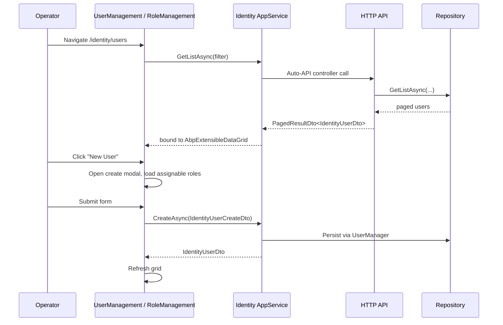

The `Volo.Abp.Identity.Blazor` package ships the Blazorise-based
administration UI for the Identity module: a `RoleManagement.razor` page at
`/identity/roles` and a `UserManagement.razor` page at `/identity/users`,
both bound to the standard ABP application services
(`IIdentityRoleAppService`, `IIdentityUserAppService`). Two thin host
packages — `Volo.Abp.Identity.Blazor.Server` and
`Volo.Abp.Identity.Blazor.WebAssembly` — pull this shared package in along
with the matching `PermissionManagement.Blazor` host so the Permission modal
component is also available. This page walks the module class, the menu
contributor, the auto-mapper profile, and each page component.

## Package layout

```
modules/identity/src/Volo.Abp.Identity.Blazor/
├── AbpIdentityBlazorModule.cs
├── AbpIdentityBlazorAutoMapperProfile.cs
├── AbpIdentityWebMainMenuContributor.cs
├── IdentityMenuNames.cs
├── _Imports.razor
└── Pages/Identity/
    ├── RoleManagement.razor (+ .razor.cs)
    ├── RoleNameComponent.razor (+ .razor.cs)
    └── UserManagement.razor (+ .razor.cs)

modules/identity/src/Volo.Abp.Identity.Blazor.Server/
└── AbpIdentityBlazorServerModule.cs

modules/identity/src/Volo.Abp.Identity.Blazor.WebAssembly/
└── AbpIdentityBlazorWebAssemblyModule.cs
```

## Module class

`AbpIdentityBlazorModule` depends on:

- `AbpIdentityApplicationContractsModule` — the app-service interfaces and
  DTOs the pages bind to.
- `AbpAutoMapperModule` — the profile registers UI-only mappings.
- `AbpPermissionManagementBlazorModule` — the
  `PermissionManagementModal` component embedded inside the entity actions.
- `AbpBlazoriseUIModule` — the Blazorise theme, `AbpCrudPageBase<>`, and
  data grid components.

It registers the AutoMapper object mapper for the module, plugs
`AbpIdentityWebMainMenuContributor` into `AbpNavigationOptions`, registers
this assembly with the Blazor router so the `@page` directives are
discovered, and joins the `IdentityResource` localization to the shared
`AbpUiResource`:

```csharp title="modules/identity/src/Volo.Abp.Identity.Blazor/AbpIdentityBlazorModule.cs"
[DependsOn(
    typeof(AbpIdentityApplicationContractsModule),
    typeof(AbpAutoMapperModule),
    typeof(AbpPermissionManagementBlazorModule),
    typeof(AbpBlazoriseUIModule)
)]
public class AbpIdentityBlazorModule : AbpModule
{
    private static readonly OneTimeRunner OneTimeRunner = new OneTimeRunner();

    public override void ConfigureServices(ServiceConfigurationContext context)
    {
        context.Services.AddAutoMapperObjectMapper<AbpIdentityBlazorModule>();

        Configure<AbpAutoMapperOptions>(options =>
        {
            options.AddProfile<AbpIdentityBlazorAutoMapperProfile>(validate: true);
        });

        Configure<AbpNavigationOptions>(options =>
        {
            options.MenuContributors.Add(new AbpIdentityWebMainMenuContributor());
        });

        Configure<AbpRouterOptions>(options =>
        {
            options.AdditionalAssemblies.Add(typeof(AbpIdentityBlazorModule).Assembly);
        });

        Configure<AbpLocalizationOptions>(options =>
        {
            options.Resources
                .Get<IdentityResource>()
                .AddBaseTypes(typeof(AbpUiResource));
        });
    }

    public override void PostConfigureServices(ServiceConfigurationContext context)
    {
        OneTimeRunner.Run(() =>
        {
            ModuleExtensionConfigurationHelper
                .ApplyEntityConfigurationToUi(
                    IdentityModuleExtensionConsts.ModuleName,
                    IdentityModuleExtensionConsts.EntityNames.Role,
                    createFormTypes: new[] { typeof(IdentityRoleCreateDto) },
                    editFormTypes: new[] { typeof(IdentityRoleUpdateDto) });

            ModuleExtensionConfigurationHelper
                .ApplyEntityConfigurationToUi(
                    IdentityModuleExtensionConsts.ModuleName,
                    IdentityModuleExtensionConsts.EntityNames.User,
                    createFormTypes: new[] { typeof(IdentityUserCreateDto) },
                    editFormTypes: new[] { typeof(IdentityUserUpdateDto) });
        });
    }
}
```

`PostConfigureServices` runs the
[object extension](/data) registrations against the **DTO** types so
extra properties added to `IdentityUserCreateDto` /
`IdentityRoleCreateDto` etc. show up as additional form fields in the
create/edit modals. The `OneTimeRunner` ensures this runs exactly once
across multiple module composition graphs.

## Menu contributor

`AbpIdentityWebMainMenuContributor` adds an `AbpIdentity` group under the
Administration menu with two children — Roles and Users — each gated by the
relevant default permission:

```csharp title="modules/identity/src/Volo.Abp.Identity.Blazor/AbpIdentityWebMainMenuContributor.cs"
public class AbpIdentityWebMainMenuContributor : IMenuContributor
{
    public virtual Task ConfigureMenuAsync(MenuConfigurationContext context)
    {
        if (context.Menu.Name != StandardMenus.Main)
        {
            return Task.CompletedTask;
        }

        var administrationMenu = context.Menu.GetAdministration();
        var l = context.GetLocalizer<IdentityResource>();

        var identityMenuItem = new ApplicationMenuItem(
            IdentityMenuNames.GroupName,
            l["Menu:IdentityManagement"],
            icon: "far fa-id-card");
        administrationMenu.AddItem(identityMenuItem);

        identityMenuItem.AddItem(new ApplicationMenuItem(
            IdentityMenuNames.Roles, l["Roles"],
            url: "~/identity/roles")
            .RequirePermissions(IdentityPermissions.Roles.Default));

        identityMenuItem.AddItem(new ApplicationMenuItem(
            IdentityMenuNames.Users, l["Users"],
            url: "~/identity/users")
            .RequirePermissions(IdentityPermissions.Users.Default));

        return Task.CompletedTask;
    }
}
```

The menu names are kept in a shared constants class so other modules can
look up the group when contributing siblings:

```csharp title="modules/identity/src/Volo.Abp.Identity.Blazor/IdentityMenuNames.cs"
public class IdentityMenuNames
{
    public const string GroupName = "AbpIdentity";
    public const string Roles    = GroupName + ".Roles";
    public const string Users    = GroupName + ".Users";
}
```

## AutoMapper profile

The Blazor profile only needs to round-trip the DTOs the
`AbpCrudPageBase<>` reads and writes — `IdentityUserDto` ➝
`IdentityUserUpdateDto` and `IdentityRoleDto` ➝ `IdentityRoleUpdateDto`.
Both maps carry `MapExtraProperties()` so extra properties on the
extensible DTOs survive a round trip:

```csharp title="modules/identity/src/Volo.Abp.Identity.Blazor/AbpIdentityBlazorAutoMapperProfile.cs"
public class AbpIdentityBlazorAutoMapperProfile : Profile
{
    public AbpIdentityBlazorAutoMapperProfile()
    {
        CreateMap<IdentityUserDto, IdentityUserUpdateDto>()
            .MapExtraProperties()
            .Ignore(x => x.Password)
            .Ignore(x => x.RoleNames);

        CreateMap<IdentityRoleDto, IdentityRoleUpdateDto>()
            .MapExtraProperties();
    }
}
```

Password is ignored because the edit modal collects it from a dedicated
input only when the operator chooses to change it; `RoleNames` is ignored
because role membership is computed from a separate
`AssignedRoleViewModel[]`.

## UserManagement page

`UserManagement.razor` declares the route and authorize attribute and
inherits the generic `AbpCrudPageBase<…>` so most CRUD behaviour is
inherited from BlazoriseUI:

```razor title="modules/identity/src/Volo.Abp.Identity.Blazor/Pages/Identity/UserManagement.razor"
@page "/identity/users"
@attribute [Authorize(IdentityPermissions.Users.Default)]
@inject AbpBlazorMessageLocalizerHelper<IdentityResource> LH

@inherits AbpCrudPageBase<IIdentityUserAppService,
                         IdentityUserDto,
                         Guid,
                         GetIdentityUsersInput,
                         IdentityUserCreateDto,
                         IdentityUserUpdateDto>

<Card>
    <CardHeader>
        <PageHeader Title="@L["Users"]" BreadcrumbItems="@BreadcrumbItems" Toolbar="@Toolbar" />
    </CardHeader>
    <CardBody class="row">
        <!-- search box, AbpExtensibleDataGrid, create/edit modals -->
    </CardBody>
</Card>
```

The code-behind binds policies, breadcrumb items, the toolbar, and the
embedded Permission modal:

```csharp title="modules/identity/src/Volo.Abp.Identity.Blazor/Pages/Identity/UserManagement.razor.cs"
public partial class UserManagement
{
    protected const string PermissionProviderName = "U";
    protected const string DefaultSelectedTab = "UserInformations";

    protected PermissionManagementModal PermissionManagementModal;

    protected IReadOnlyList<IdentityRoleDto> Roles;
    protected AssignedRoleViewModel[] NewUserRoles;
    protected AssignedRoleViewModel[] EditUserRoles;
    protected string ManagePermissionsPolicyName;
    protected bool HasManagePermissionsPermission { get; set; }
    protected string CreateModalSelectedTab = DefaultSelectedTab;
    protected string EditModalSelectedTab = DefaultSelectedTab;
    protected bool ShowPassword { get; set; }
    protected PageToolbar Toolbar { get; } = new();
    private List<TableColumn> UserManagementTableColumns => TableColumns.Get<UserManagement>();

    public UserManagement()
    {
        ObjectMapperContext = typeof(AbpIdentityBlazorModule);
        LocalizationResource = typeof(IdentityResource);

        CreatePolicyName            = IdentityPermissions.Users.Create;
        UpdatePolicyName            = IdentityPermissions.Users.Update;
        DeletePolicyName            = IdentityPermissions.Users.Delete;
        ManagePermissionsPolicyName = IdentityPermissions.Users.ManagePermissions;
    }

    protected override async Task OnInitializedAsync()
    {
        await base.OnInitializedAsync();
        try
        {
            Roles = (await AppService.GetAssignableRolesAsync()).Items;
        }
        catch (Exception ex)
        {
            await HandleErrorAsync(ex);
        }
    }
}
```

Key behaviours:

- **CRUD policies** are mapped to `IdentityPermissions.Users.*` so the data
  grid hides toolbar buttons and row actions when the user lacks the
  matching permission.
- `GetAssignableRolesAsync()` is called once to populate the role checkbox
  list shown inside the create/edit modal's *Roles* tab.
- `TableColumns.Get<UserManagement>()` returns the extensible column
  collection — other modules can append columns through this list without
  forking the page.
- The Permission modal is opened via `PermissionManagementModal.OpenAsync(
  "U", userName)` for the *Permissions* row action, using the same provider
  key (`U`) the back-end `UserPermissionManagementProvider` registers.

The page also defines an `AssignedRoleViewModel` (Name / IsAssigned /
IsDefault) used to track which roles a user is in across the modal's
checkbox group.

## RoleManagement page

`RoleManagement.razor` follows the same shape but binds to
`IIdentityRoleAppService`:

```razor title="modules/identity/src/Volo.Abp.Identity.Blazor/Pages/Identity/RoleManagement.razor"
@page "/identity/roles"
@attribute [Authorize(IdentityPermissions.Roles.Default)]
@inject AbpBlazorMessageLocalizerHelper<IdentityResource> LH

@inherits AbpCrudPageBase<IIdentityRoleAppService,
                         IdentityRoleDto,
                         Guid,
                         GetIdentityRolesInput,
                         IdentityRoleCreateDto,
                         IdentityRoleUpdateDto>
```

The code-behind wires permission constants and the entity actions:

```csharp title="modules/identity/src/Volo.Abp.Identity.Blazor/Pages/Identity/RoleManagement.razor.cs"
public partial class RoleManagement
{
    protected const string PermissionProviderName = "R";

    protected PermissionManagementModal PermissionManagementModal;
    protected string ManagePermissionsPolicyName;
    protected bool HasManagePermissionsPermission { get; set; }
    protected PageToolbar Toolbar { get; } = new();
    protected List<TableColumn> RoleManagementTableColumns => TableColumns.Get<RoleManagement>();

    public RoleManagement()
    {
        ObjectMapperContext = typeof(AbpIdentityBlazorModule);
        LocalizationResource = typeof(IdentityResource);

        CreatePolicyName            = IdentityPermissions.Roles.Create;
        UpdatePolicyName            = IdentityPermissions.Roles.Update;
        DeletePolicyName            = IdentityPermissions.Roles.Delete;
        ManagePermissionsPolicyName = IdentityPermissions.Roles.ManagePermissions;
    }

    protected override ValueTask SetEntityActionsAsync()
    {
        EntityActions
            .Get<RoleManagement>()
            .AddRange(new EntityAction[]
            {
                new EntityAction
                {
                    Text = L["Edit"],
                    Visible = (data) => HasUpdatePermission,
                    Clicked = async (data) => await OpenEditModalAsync(data.As<IdentityRoleDto>())
                },
                new EntityAction
                {
                    Text = L["Permissions"],
                    Visible = (data) => HasManagePermissionsPermission,
                    Clicked = async (data) =>
                        await PermissionManagementModal.OpenAsync(
                            PermissionProviderName,
                            data.As<IdentityRoleDto>().Name)
                },
                new EntityAction
                {
                    Text = L["Delete"],
                    Visible = (data) => HasDeletePermission && !data.As<IdentityRoleDto>().IsStatic,
                    Clicked = async (data) => await DeleteEntityAsync(data.As<IdentityRoleDto>()),
                    ConfirmationMessage = (data) => GetDeleteConfirmationMessage(data.As<IdentityRoleDto>())
                }
            });

        return base.SetEntityActionsAsync();
    }
}
```

Notable details:

- The *Delete* action checks `IsStatic`, mirroring the back-end guard so the
  built-in `admin` role cannot be removed.
- The Permission modal opens with provider key `"R"`, which matches the
  back-end `RolePermissionManagementProvider`.
- `RoleNameComponent.razor` is a small extracted component that draws a role
  badge with the role's display name — both pages embed it inside grid
  cells.

## Page interaction flow



## Blazor.Server wrapper

The Server host package adds the dependency on
`AbpPermissionManagementBlazorServerModule` so the Permission modal works
under server-side Blazor. There is no extra code beyond the dependency
declaration:

```csharp title="modules/identity/src/Volo.Abp.Identity.Blazor.Server/AbpIdentityBlazorServerModule.cs"
[DependsOn(
    typeof(AbpIdentityBlazorModule),
    typeof(AbpPermissionManagementBlazorServerModule)
)]
public class AbpIdentityBlazorServerModule : AbpModule { }
```

## Blazor.WebAssembly wrapper

The WebAssembly host adds the Permission Management WASM module **and** the
`AbpIdentityHttpApiClientModule` so the WASM client can talk to the back-end
HTTP API for the Identity app services:

```csharp title="modules/identity/src/Volo.Abp.Identity.Blazor.WebAssembly/AbpIdentityBlazorWebAssemblyModule.cs"
[DependsOn(
    typeof(AbpIdentityBlazorModule),
    typeof(AbpPermissionManagementBlazorWebAssemblyModule),
    typeof(AbpIdentityHttpApiClientModule)
)]
public class AbpIdentityBlazorWebAssemblyModule : AbpModule { }
```

The Server flavour reuses the host's own DI container to resolve the
Identity app services, so the HTTP API client is **not** referenced there.

## Related pages

<CardGroup cols={2}>
  <Card title="Identity module overview" href="/modules/identity/overview" icon="circle-info">
    Domain, application, and UI layers in one place.
  </Card>
  <Card title="MVC / Razor Pages UI" href="/modules/identity/web-ui" icon="window-restore">
    The classic Razor Pages alternative to this Blazor UI.
  </Card>
  <Card title="Blazor framework" href="/blazor" icon="bolt">
    `AbpCrudPageBase`, routing, and component activation that this UI rides on.
  </Card>
  <Card title="ABP UI / MVC" href="/ui-mvc" icon="window-maximize">
    Background on the MVC-side toolbar / page-header conventions reused here.
  </Card>
</CardGroup>
