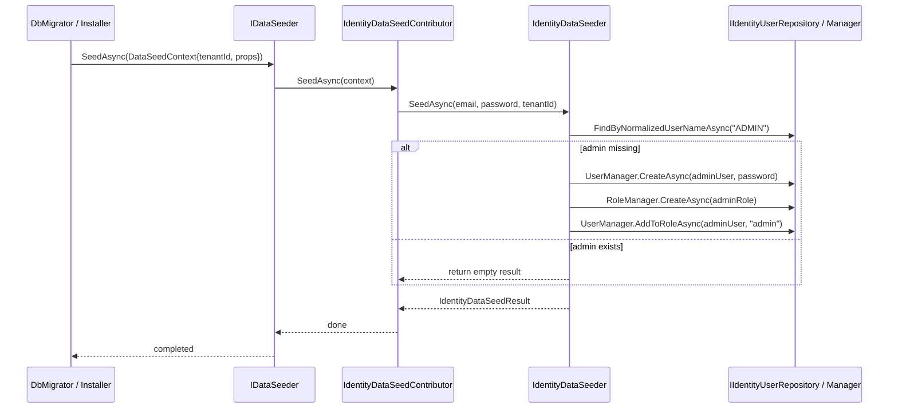

When a fresh ABP application is installed, the Identity module needs to
make sure there is at least one user who can log in and exercise every
permission. That bootstrap is implemented by **`IdentityDataSeeder`** — the
domain service that creates the `admin` user and `admin` role — and
**`IdentityDataSeedContributor`** — the small adapter that hooks the seeder
into the framework's `IDataSeeder` pipeline. A separate
**`Volo.Abp.Identity.Installer`** NuGet package embeds the module metadata
(`.abppkg` / `.abpmdl` files) so the ABP CLI's installer can detect the
module is present and offer it for inclusion in new templates. This page
walks all three pieces.

## Package layout

```
modules/identity/src/Volo.Abp.Identity.Domain/Volo/Abp/Identity/
├── IIdentityDataSeeder.cs
├── IdentityDataSeeder.cs
├── IdentityDataSeedContributor.cs
└── IdentityDataSeedResult.cs

modules/identity/src/Volo.Abp.Identity.Installer/
├── Volo/Abp/Identity/AbpIdentityInstallerModule.cs
└── Volo.Abp.Identity.Installer.csproj   (packs .abppkg and .abpmdl files)
```

## Contract: IIdentityDataSeeder

The seeder exposes a single async method that callers (the contributor, or
custom installation scripts) invoke with an admin email, password, and
tenant id:

```csharp title="modules/identity/src/Volo.Abp.Identity.Domain/Volo/Abp/Identity/IIdentityDataSeeder.cs"
public interface IIdentityDataSeeder
{
    Task<IdentityDataSeedResult> SeedAsync(
        [NotNull] string adminEmail,
        [NotNull] string adminPassword,
        Guid? tenantId = null);
}
```

The result captures which side-effects the call produced:

```csharp title="modules/identity/src/Volo.Abp.Identity.Domain/Volo/Abp/Identity/IdentityDataSeedResult.cs"
public class IdentityDataSeedResult
{
    public bool CreatedAdminUser { get; set; }
    public bool CreatedAdminRole { get; set; }
}
```

This is useful for tests that want to assert a seed happened and for
downstream code that wants to attach extra setup (claims, profile fields,
external logins) only when the user was actually created.

## IdentityDataSeeder implementation

`IdentityDataSeeder` is a transient domain service that orchestrates the
existing repositories and managers. It depends on:

- `IGuidGenerator` — produces tenant-aware GUIDs.
- `IIdentityRoleRepository` / `IIdentityUserRepository` — to *find* the
  admin user/role without going through the manager (which would throw on
  a missing entity).
- `ILookupNormalizer` — to compute the normalized username / role name.
- `IdentityUserManager`, `IdentityRoleManager` — to *create* the entities
  so policies (password rules, role uniqueness) are enforced.
- `ICurrentTenant` — to switch the unit of work into the target tenant
  scope.
- `IOptions<IdentityOptions>` — so the framework can apply any settings
  changes that need to flow into the ASP.NET Core Identity options *before*
  the password is validated.

```csharp title="modules/identity/src/Volo.Abp.Identity.Domain/Volo/Abp/Identity/IdentityDataSeeder.cs"
public class IdentityDataSeeder : ITransientDependency, IIdentityDataSeeder
{
    protected IGuidGenerator GuidGenerator { get; }
    protected IIdentityRoleRepository RoleRepository { get; }
    protected IIdentityUserRepository UserRepository { get; }
    protected ILookupNormalizer LookupNormalizer { get; }
    protected IdentityUserManager UserManager { get; }
    protected IdentityRoleManager RoleManager { get; }
    protected ICurrentTenant CurrentTenant { get; }
    protected IOptions<IdentityOptions> IdentityOptions { get; }

    public IdentityDataSeeder(
        IGuidGenerator guidGenerator,
        IIdentityRoleRepository roleRepository,
        IIdentityUserRepository userRepository,
        ILookupNormalizer lookupNormalizer,
        IdentityUserManager userManager,
        IdentityRoleManager roleManager,
        ICurrentTenant currentTenant,
        IOptions<IdentityOptions> identityOptions)
    {
        GuidGenerator    = guidGenerator;
        RoleRepository   = roleRepository;
        UserRepository   = userRepository;
        LookupNormalizer = lookupNormalizer;
        UserManager      = userManager;
        RoleManager      = roleManager;
        CurrentTenant    = currentTenant;
        IdentityOptions  = identityOptions;
    }
}
```

### SeedAsync flow

```csharp title="modules/identity/src/Volo.Abp.Identity.Domain/Volo/Abp/Identity/IdentityDataSeeder.cs"
[UnitOfWork]
public virtual async Task<IdentityDataSeedResult> SeedAsync(
    string adminEmail, string adminPassword, Guid? tenantId = null)
{
    Check.NotNullOrWhiteSpace(adminEmail, nameof(adminEmail));
    Check.NotNullOrWhiteSpace(adminPassword, nameof(adminPassword));

    using (CurrentTenant.Change(tenantId))
    {
        await IdentityOptions.SetAsync();

        var result = new IdentityDataSeedResult();

        // "admin" user — idempotent check
        const string adminUserName = "admin";
        var adminUser = await UserRepository.FindByNormalizedUserNameAsync(
            LookupNormalizer.NormalizeName(adminUserName));

        if (adminUser != null)
        {
            return result; // already seeded — nothing to do
        }

        adminUser = new IdentityUser(
            GuidGenerator.Create(), adminUserName, adminEmail, tenantId)
        {
            Name = adminUserName
        };

        (await UserManager.CreateAsync(adminUser, adminPassword, validatePassword: false)).CheckErrors();
        result.CreatedAdminUser = true;

        // "admin" role
        const string adminRoleName = "admin";
        var adminRole = await RoleRepository.FindByNormalizedNameAsync(
            LookupNormalizer.NormalizeName(adminRoleName));

        if (adminRole == null)
        {
            adminRole = new IdentityRole(GuidGenerator.Create(), adminRoleName, tenantId)
            {
                IsStatic = true,
                IsPublic = true
            };

            (await RoleManager.CreateAsync(adminRole)).CheckErrors();
            result.CreatedAdminRole = true;
        }

        (await UserManager.AddToRoleAsync(adminUser, adminRoleName)).CheckErrors();

        return result;
    }
}
```

Observations:

- **Idempotent.** If an `admin` user already exists for the tenant, the
  method returns an empty result without touching anything. The contributor
  is therefore safe to run on every application start-up.
- **`[UnitOfWork]`** wraps the whole sequence so a failure halfway through
  (for example, a password-policy violation after the role was created)
  rolls back atomically.
- **`validatePassword: false`** on `UserManager.CreateAsync` lets the seed
  password pass even if the host has stricter rules than the seed value —
  the assumption is that the operator will rotate it on first login.
- **`IsStatic = true`** on the admin role tells the UI and back-end guards
  to forbid deletion of the role, mirroring the check in
  `RoleManagement.razor`'s entity action and the back-end app service.
- **`AddToRoleAsync`** runs *after* the role exists. The role is created
  with `IsPublic = true` so it shows up in the management UI's role lists.

## IdentityDataSeedContributor

`IDataSeedContributor` is the framework abstraction that
`IDataSeeder.SeedAsync()` enumerates on application start (or whenever the
host runs its installation script). `IdentityDataSeedContributor` translates
the `DataSeedContext` (which carries the target tenant id and free-form
properties) into a call to `IIdentityDataSeeder.SeedAsync`:

```csharp title="modules/identity/src/Volo.Abp.Identity.Domain/Volo/Abp/Identity/IdentityDataSeedContributor.cs"
public class IdentityDataSeedContributor : IDataSeedContributor, ITransientDependency
{
    public const string AdminEmailPropertyName    = "AdminEmail";
    public const string AdminEmailDefaultValue    = "admin@abp.io";
    public const string AdminPasswordPropertyName = "AdminPassword";
    public const string AdminPasswordDefaultValue = "1q2w3E*";

    protected IIdentityDataSeeder IdentityDataSeeder { get; }

    public IdentityDataSeedContributor(IIdentityDataSeeder identityDataSeeder)
    {
        IdentityDataSeeder = identityDataSeeder;
    }

    public virtual Task SeedAsync(DataSeedContext context)
    {
        return IdentityDataSeeder.SeedAsync(
            context?[AdminEmailPropertyName]    as string ?? AdminEmailDefaultValue,
            context?[AdminPasswordPropertyName] as string ?? AdminPasswordDefaultValue,
            context?.TenantId);
    }
}
```

The defaults — `admin@abp.io` / `1q2w3E*` — are deliberately well-known so
test fixtures can sign in without extra plumbing. Production hosts override
them by passing properties to `DataSeedContext` from their installation
script.

### Custom admin credentials

```csharp title="ApplicationDbMigrationService.cs (host pattern)"
public async Task SeedAdminAsync(Guid? tenantId, string email, string password)
{
    await dataSeeder.SeedAsync(new DataSeedContext(tenantId)
        .WithProperty(IdentityDataSeedContributor.AdminEmailPropertyName,    email)
        .WithProperty(IdentityDataSeedContributor.AdminPasswordPropertyName, password));
}
```

## Where seeding runs



The contributor is normally executed:

1. By the **DbMigrator console** the ABP startup templates ship with —
   right after EF Core migrations apply.
2. By the **Mongo initialization service** equivalent when a project uses
   the MongoDB provider.
3. By **unit-test fixtures** that need a real admin to sign requests with.

## AbpIdentityInstallerModule

The `Volo.Abp.Identity.Installer` package exists for a different lifecycle
— it is the metadata package the ABP CLI installer reads to know that
"Identity" is a real module that can be added to or removed from a
solution. The module class itself is intentionally minimal: it just plugs
its own assembly into the [virtual file system](/vfs) so the embedded
`.abppkg` and `.abpmdl` files are discoverable at runtime.

```csharp title="modules/identity/src/Volo.Abp.Identity.Installer/Volo/Abp/Identity/AbpIdentityInstallerModule.cs"
[DependsOn(typeof(AbpVirtualFileSystemModule))]
public class AbpIdentityInstallerModule : AbpModule
{
    public override void ConfigureServices(ServiceConfigurationContext context)
    {
        Configure<AbpVirtualFileSystemOptions>(options =>
        {
            options.FileSets.AddEmbedded<AbpIdentityInstallerModule>();
        });
    }
}
```

### What ships inside the package

The csproj packs the module metadata files from the parent folder so they
are available as `content/` in the resulting NuGet package:

```xml title="modules/identity/src/Volo.Abp.Identity.Installer/Volo.Abp.Identity.Installer.csproj"
<Project Sdk="Microsoft.NET.Sdk">
  <PropertyGroup>
    <TargetFramework>net8.0</TargetFramework>
    <GenerateEmbeddedFilesManifest>true</GenerateEmbeddedFilesManifest>
    <RootNamespace />
  </PropertyGroup>

  <ItemGroup>
    <ProjectReference Include="..\..\..\..\framework\src\Volo.Abp.VirtualFileSystem\Volo.Abp.VirtualFileSystem.csproj" />
  </ItemGroup>

  <ItemGroup>
    <None Remove="..\..\Volo.Abp.Identity.abpmdl" />
    <Content Include="..\..\Volo.Abp.Identity.abpmdl">
      <Pack>true</Pack>
      <PackagePath>content\</PackagePath>
    </Content>
    <None Remove="..\..\**\*.abppkg*" />
    <Content Include="..\..\**\*.abppkg*">
      <Pack>true</Pack>
      <PackagePath>content\</PackagePath>
    </Content>
  </ItemGroup>
</Project>
```

| File | Purpose |
| --- | --- |
| `Volo.Abp.Identity.abpmdl` | Module manifest — lists the constituent NuGet packages by role (`Domain`, `Domain.Shared`, `Application`, `Application.Contracts`, `HttpApi`, `HttpApi.Client`, `EntityFrameworkCore`, `MongoDB`, `Web`, `Blazor`, …). |
| `*.abppkg` | Per-package metadata, picked up by the ABP CLI when adding the module to a solution so it knows which projects to reference. |
| `*.abppkg.analyze.json` | Static-analysis cache used by the ABP CLI's module-introspection commands. |

When a host adds a reference to `Volo.Abp.Identity.Installer`, those files
are restored into its output and surfaced through the virtual file system —
that is what lets `abp install-module Volo.Abp.Identity …` discover the
module without an external registry call.

<Info>
The Installer module is **only** required for solutions that want to run
ABP CLI install/remove operations on the Identity module at solution
authoring time. A typical hosting project that already references
`Volo.Abp.Identity.Domain`, `Volo.Abp.Identity.EntityFrameworkCore`, etc.
does not need to add the Installer package at runtime.
</Info>

## Putting it together

A complete bootstrap for a multi-tenant SaaS looks like:

```csharp title="DbMigrator entry point (excerpt)"
await using var scope = host.Services.CreateAsyncScope();
var dataSeeder = scope.ServiceProvider.GetRequiredService<IDataSeeder>();
var tenantStore = scope.ServiceProvider.GetRequiredService<ITenantRepository>();

// Host admin
await dataSeeder.SeedAsync(new DataSeedContext()
    .WithProperty(IdentityDataSeedContributor.AdminEmailPropertyName,    "admin@yourdomain.com")
    .WithProperty(IdentityDataSeedContributor.AdminPasswordPropertyName, GenerateInitialPassword()));

// Per-tenant admin
foreach (var tenant in await tenantStore.GetListAsync())
{
    await dataSeeder.SeedAsync(new DataSeedContext(tenant.Id)
        .WithProperty(IdentityDataSeedContributor.AdminEmailPropertyName,    $"admin@{tenant.Name}.com")
        .WithProperty(IdentityDataSeedContributor.AdminPasswordPropertyName, GenerateInitialPassword()));
}
```

Because `IdentityDataSeeder` runs inside a tenant scope and is idempotent,
re-running the migrator is a no-op for tenants that already have an admin.

## Related pages

<CardGroup cols={2}>
  <Card title="Identity module overview" href="/modules/identity/overview" icon="circle-info">
    Where the seed user/role fit in the wider Identity domain.
  </Card>
  <Card title="EF Core provider" href="/modules/identity/entity-framework-core" icon="database">
    The schema the admin user is persisted into.
  </Card>
  <Card title="MongoDB provider" href="/modules/identity/mongodb" icon="database">
    Same seeder, different storage engine.
  </Card>
  <Card title="ABP data layer" href="/data" icon="layer-group">
    `IDataSeeder` / `IDataSeedContributor` framework primitives.
  </Card>
</CardGroup>
