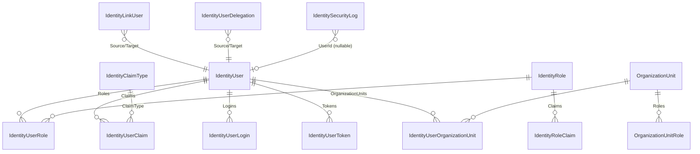

The Identity domain layer (`Volo.Abp.Identity.Domain`) is where the entire model lives: aggregates, value objects, repository contracts, domain services that wrap ASP.NET Core's `UserManager` / `RoleManager`, the data seeder, external login provider extension points, and the claims‑principal factory used by every cookie/JWT pipeline downstream. This page traces those types directly from `modules/identity/src/Volo.Abp.Identity.Domain/`, with the source file paths in every snippet so you can dive into the original code in one click. If you want the persistence wiring, see [`/data/overview`](/data/overview); for the principal/claims plumbing the factory feeds, see [`/authz/claims`](/utilities/security-and-current-user).

<Info>
Namespace root: `Volo.Abp.Identity`. Project: [`modules/identity/src/Volo.Abp.Identity.Domain/`](https://github.com/abpframework/abp/tree/dev/modules/identity/src/Volo.Abp.Identity.Domain).
</Info>

## Module entry point

`AbpIdentityDomainModule` orchestrates everything below. It depends on `AbpDddDomainModule`, `AbpIdentityDomainSharedModule`, `AbpUsersDomainModule` and `AbpAutoMapperModule`, registers the domain mapping profile, configures distributed ETOs, calls `IServiceCollection.AddAbpIdentity(...)` (the ABP extension over `AddIdentity`), and replaces `IdentityOptions` with a dynamic `AbpIdentityOptionsManager` that reads from `ISettingProvider`.

```csharp modules/identity/src/Volo.Abp.Identity.Domain/Volo/Abp/Identity/AbpIdentityDomainModule.cs
public override void ConfigureServices(ServiceConfigurationContext context)
{
    context.Services.AddAutoMapperObjectMapper<AbpIdentityDomainModule>();

    Configure<AbpAutoMapperOptions>(options =>
    {
        options.AddProfile<IdentityDomainMappingProfile>(validate: true);
    });

    Configure<AbpDistributedEntityEventOptions>(options =>
    {
        options.EtoMappings.Add<IdentityUser, UserEto>(typeof(AbpIdentityDomainModule));
        options.EtoMappings.Add<IdentityClaimType, IdentityClaimTypeEto>(typeof(AbpIdentityDomainModule));
        options.EtoMappings.Add<IdentityRole, IdentityRoleEto>(typeof(AbpIdentityDomainModule));
        options.EtoMappings.Add<OrganizationUnit, OrganizationUnitEto>(typeof(AbpIdentityDomainModule));

        options.AutoEventSelectors.Add<IdentityUser>();
        options.AutoEventSelectors.Add<IdentityRole>();
    });

    var identityBuilder = context.Services.AddAbpIdentity(options =>
    {
        options.User.RequireUniqueEmail = true;
    });

    context.Services.AddObjectAccessor(identityBuilder);
    context.Services.ExecutePreConfiguredActions(identityBuilder);

    Configure<IdentityOptions>(options =>
    {
        options.ClaimsIdentity.UserIdClaimType = AbpClaimTypes.UserId;
        options.ClaimsIdentity.UserNameClaimType = AbpClaimTypes.UserName;
        options.ClaimsIdentity.RoleClaimType = AbpClaimTypes.Role;
        options.ClaimsIdentity.EmailClaimType = AbpClaimTypes.Email;
    });

    context.Services.AddAbpDynamicOptions<IdentityOptions, AbpIdentityOptionsManager>();
}
```

`AbpIdentityOptions` is currently a small carrier for one dictionary of external login providers:

```csharp modules/identity/src/Volo.Abp.Identity.Domain/Volo/Abp/Identity/AbpIdentityOptions.cs
public class AbpIdentityOptions
{
    public ExternalLoginProviderDictionary ExternalLoginProviders { get; }

    public AbpIdentityOptions()
    {
        ExternalLoginProviders = new ExternalLoginProviderDictionary();
    }
}
```

## Aggregate model

The seven aggregates form the core domain. The diagram below shows their relationships (entity ↔ entity, not navigation properties).



### `IdentityUser`

```csharp modules/identity/src/Volo.Abp.Identity.Domain/Volo/Abp/Identity/IdentityUser.cs
public class IdentityUser : FullAuditedAggregateRoot<Guid>, IUser, IHasEntityVersion
{
    public virtual Guid? TenantId { get; protected set; }
    public virtual string UserName { get; protected internal set; }
    public virtual string NormalizedUserName { get; protected internal set; }
    public virtual string Name { get; set; }
    public virtual string Surname { get; set; }
    public virtual string Email { get; protected internal set; }
    public virtual string NormalizedEmail { get; protected internal set; }
    public virtual bool EmailConfirmed { get; protected internal set; }
    public virtual string PasswordHash { get; protected internal set; }
    public virtual string SecurityStamp { get; protected internal set; }
    public virtual bool IsExternal { get; set; }
    public virtual string PhoneNumber { get; protected internal set; }
    public virtual bool PhoneNumberConfirmed { get; protected internal set; }
    public virtual bool IsActive { get; protected internal set; }
    public virtual bool TwoFactorEnabled { get; protected internal set; }
    public virtual DateTimeOffset? LockoutEnd { get; protected internal set; }
    public virtual bool LockoutEnabled { get; protected internal set; }
    public virtual int AccessFailedCount { get; protected internal set; }
    public virtual bool ShouldChangePasswordOnNextLogin { get; protected internal set; }
    public virtual int EntityVersion { get; protected set; }
    public virtual DateTimeOffset? LastPasswordChangeTime { get; protected set; }

    public virtual ICollection<IdentityUserRole> Roles { get; protected set; }
    public virtual ICollection<IdentityUserClaim> Claims { get; protected set; }
    public virtual ICollection<IdentityUserLogin> Logins { get; protected set; }
    public virtual ICollection<IdentityUserToken> Tokens { get; protected set; }
    public virtual ICollection<IdentityUserOrganizationUnit> OrganizationUnits { get; protected set; }
    // ...
}
```

The constructor sets the audit fields and stamps:

```csharp modules/identity/src/Volo.Abp.Identity.Domain/Volo/Abp/Identity/IdentityUser.cs
public IdentityUser(Guid id, [NotNull] string userName, [NotNull] string email, Guid? tenantId = null)
    : base(id)
{
    Check.NotNull(userName, nameof(userName));
    Check.NotNull(email, nameof(email));

    TenantId = tenantId;
    UserName = userName;
    NormalizedUserName = userName.ToUpperInvariant();
    Email = email;
    NormalizedEmail = email.ToUpperInvariant();
    ConcurrencyStamp = Guid.NewGuid().ToString("N");
    SecurityStamp = Guid.NewGuid().ToString();
    IsActive = true;

    Roles = new Collection<IdentityUserRole>();
    Claims = new Collection<IdentityUserClaim>();
    Logins = new Collection<IdentityUserLogin>();
    Tokens = new Collection<IdentityUserToken>();
    OrganizationUnits = new Collection<IdentityUserOrganizationUnit>();
}
```

Key invariants enforced by `IdentityUser` methods:

| Method | Behavior |
| --- | --- |
| `AddRole(Guid roleId)` | No‑ops if already in role; otherwise pushes `IdentityUserRole(Id, roleId, TenantId)` |
| `RemoveRole(Guid roleId)` | Removes all `IdentityUserRole` matches |
| `IsInRole(Guid roleId)` | Linear scan of `Roles` |
| `AddClaim(IGuidGenerator, Claim)` | Adds an `IdentityUserClaim` with a freshly minted Guid |
| `ReplaceClaim(Claim, Claim)` | Mutates matching `IdentityUserClaim` values via `SetClaim` |
| `AddLogin` / `RemoveLogin` / `AddToken` / `RemoveToken` | Mirror the EF Core Identity stores |

### `IdentityRole`

```csharp modules/identity/src/Volo.Abp.Identity.Domain/Volo/Abp/Identity/IdentityRole.cs
public class IdentityRole : AggregateRoot<Guid>, IMultiTenant, IHasEntityVersion
{
    public virtual Guid? TenantId { get; protected set; }
    public virtual string Name { get; protected internal set; }
    public virtual string NormalizedName { get; protected internal set; }
    public virtual ICollection<IdentityRoleClaim> Claims { get; protected set; }
    public virtual bool IsDefault { get; set; }
    public virtual bool IsStatic { get; set; }
    public virtual bool IsPublic { get; set; }
    public virtual int EntityVersion { get; protected set; }
    // ...
}
```

Three flags shape role semantics:

- `IsDefault` — automatically assigned to newly created users (used by `IdentityDataSeeder` and the registration flow in [`/modules/account`](/modules/account/overview)).
- `IsStatic` — system role that cannot be renamed or deleted (enforced inside `IdentityRoleManager`).
- `IsPublic` — visible to other users in user‑listing surfaces.

### `IdentityClaimType`

```csharp modules/identity/src/Volo.Abp.Identity.Domain/Volo/Abp/Identity/IdentityClaimType.cs
public class IdentityClaimType : AggregateRoot<Guid>
{
    public virtual string Name { get; protected set; }
    public virtual bool Required { get; set; }
    public virtual bool IsStatic { get; protected set; }
    public virtual string Regex { get; set; }
    public virtual string RegexDescription { get; set; }
    public virtual string Description { get; set; }
    public virtual IdentityClaimValueType ValueType { get; set; }
    // ...
}
```

Tenant administrators register custom claim definitions (e.g. `EmployeeCode`) and the application layer can validate `IdentityUserClaim` rows against them. `IdentityClaimTypeManager` (in the same folder) handles uniqueness.

### `IdentityLinkUser`

```csharp modules/identity/src/Volo.Abp.Identity.Domain/Volo/Abp/Identity/IdentityLinkUser.cs
public class IdentityLinkUser : BasicAggregateRoot<Guid>
{
    public virtual Guid SourceUserId { get; protected set; }
    public virtual Guid? SourceTenantId { get; protected set; }
    public virtual Guid TargetUserId { get; protected set; }
    public virtual Guid? TargetTenantId { get; protected set; }

    public IdentityLinkUser(Guid id, IdentityLinkUserInfo sourceUser, IdentityLinkUserInfo targetUser)
        : base(id)
    {
        SourceUserId   = sourceUser.UserId;
        SourceTenantId = sourceUser.TenantId;
        TargetUserId   = targetUser.UserId;
        TargetTenantId = targetUser.TenantId;
    }
}
```

This row pairs a user in one tenant with a "linked" user in another (typical impersonation / account switching scenario). The `LinkUserTokenProvider` in the AspNetCore package produces the tokens used to authenticate the switch.

### `IdentitySecurityLog`

```csharp modules/identity/src/Volo.Abp.Identity.Domain/Volo/Abp/Identity/IdentitySecurityLog.cs
public class IdentitySecurityLog : AggregateRoot<Guid>, IMultiTenant
{
    public Guid? TenantId { get; protected set; }
    public string ApplicationName { get; protected set; }
    public string Identity { get; protected set; }
    public string Action { get; protected set; }
    public Guid? UserId { get; protected set; }
    public string UserName { get; protected set; }
    public string TenantName { get; protected set; }
    public string ClientId { get; protected set; }
    public string CorrelationId { get; protected set; }
    public string ClientIpAddress { get; protected set; }
    public string BrowserInfo { get; protected set; }
    public DateTime CreationTime { get; protected set; }
    // constructor truncates each field to IdentitySecurityLogConsts.Max*Length
}
```

The constructor uses the truncation constants defined in `IdentitySecurityLogConsts` (Domain.Shared) so that very long browser strings cannot break persistence. Sign‑in actions map to constants from `IdentitySecurityLogActionConsts` (e.g. `LoginSucceeded`, `LoginLockedout`, `LoginRequiresTwoFactor`).

### `IdentityUserDelegation`

```csharp modules/identity/src/Volo.Abp.Identity.Domain/Volo/Abp/Identity/IdentityUserDelegation.cs
public class IdentityUserDelegation : BasicAggregateRoot<Guid>, IMultiTenant
{
    public virtual Guid?    TenantId      { get; protected set; }
    public virtual Guid     SourceUserId  { get; protected set; }
    public virtual Guid     TargetUserId  { get; protected set; }
    public virtual DateTime StartTime     { get; protected set; }
    public virtual DateTime EndTime       { get; protected set; }
    // ...
}
```

`IdentityUserDelegationManager` (same folder) coordinates the creation/expiration of delegations. The cookie pipeline in the Account module checks the active delegation when impersonating.

### `OrganizationUnit`

```csharp modules/identity/src/Volo.Abp.Identity.Domain/Volo/Abp/Identity/OrganizationUnit.cs
public class OrganizationUnit : FullAuditedAggregateRoot<Guid>, IMultiTenant, IHasEntityVersion
{
    public virtual Guid?  TenantId    { get; protected set; }
    public virtual Guid?  ParentId    { get; internal set; }
    public virtual string Code        { get; internal set; }   // "00001.00042.00005"
    public virtual string DisplayName { get; set; }
    public virtual int    EntityVersion { get; set; }
    public virtual ICollection<OrganizationUnitRole> Roles { get; protected set; }
    // ...
}
```

OUs form a hierarchical tree via the materialized `Code` path. `OrganizationUnit.CreateCode(params int[])` formats `00001.00042.00005`‑style codes; `OrganizationUnitManager` re‑codes the subtree on moves and propagates dynamic‑claim cache invalidation when role membership changes.

## Repository contracts

Each aggregate has at least one repository interface that EF Core and MongoDB packages implement independently. See [`/data/repositories`](/ddd/repositories) for the base abstractions.

| Interface | Aggregate | Notable methods |
| --- | --- | --- |
| `IIdentityUserRepository` | `IdentityUser` | `FindByNormalizedUserNameAsync`, `FindByNormalizedEmailAsync`, `FindByLoginAsync`, `GetRolesAsync`, `GetListAsync(...)` with rich filters, `GetUsersInOrganizationUnitWithChildrenAsync(string code)` |
| `IIdentityRoleRepository` | `IdentityRole` | `FindByNormalizedNameAsync`, `GetListWithUserCountAsync`, `GetDefaultOnesAsync` |
| `IIdentityClaimTypeRepository` | `IdentityClaimType` | `AnyAsync(name)` |
| `IIdentityLinkUserRepository` | `IdentityLinkUser` | CRUD plus `DeleteAsync(IdentityLinkUserInfo, CancellationToken)` |
| `IIdentitySecurityLogRepository` | `IdentitySecurityLog` | Paged `GetListAsync` and `GetCountAsync` with date/action filters |
| `IIdentityUserDelegationRepository` | `IdentityUserDelegation` | Lookup by source/target user |
| `IOrganizationUnitRepository` | `OrganizationUnit` | `GetChildrenAsync(parentId)`, `GetAllChildrenWithParentCodeAsync(code, parentId)`, `GetListByRoleIdAsync` |

A representative slice — the rich `GetListAsync` overload that powers user‑management list pages and admin search:

```csharp modules/identity/src/Volo.Abp.Identity.Domain/Volo/Abp/Identity/IIdentityUserRepository.cs
Task<List<IdentityUser>> GetListAsync(
    string sorting = null,
    int maxResultCount = int.MaxValue,
    int skipCount = 0,
    string filter = null,
    bool includeDetails = false,
    Guid? roleId = null,
    Guid? organizationUnitId = null,
    string userName = null,
    string phoneNumber = null,
    string emailAddress = null,
    string name = null,
    string surname = null,
    bool? isLockedOut = null,
    bool? notActive = null,
    bool? emailConfirmed = null,
    bool? isExternal = null,
    DateTime? maxCreationTime = null,
    DateTime? minCreationTime = null,
    DateTime? maxModifitionTime = null,
    DateTime? minModifitionTime = null,
    CancellationToken cancellationToken = default
);
```

## Domain services

### `IdentityUserManager`

`IdentityUserManager` derives from ASP.NET Core's `UserManager<IdentityUser>` and is registered as a domain service. The constructor is broad because `UserManager<>` needs the full ASP.NET Identity infrastructure plus the ABP‑specific dependencies for OU/link‑user/dynamic claim handling:

```csharp modules/identity/src/Volo.Abp.Identity.Domain/Volo/Abp/Identity/IdentityUserManager.cs
public class IdentityUserManager : UserManager<IdentityUser>, IDomainService
{
    protected IIdentityRoleRepository RoleRepository { get; }
    protected IIdentityUserRepository UserRepository { get; }
    protected IOrganizationUnitRepository OrganizationUnitRepository { get; }
    protected ISettingProvider SettingProvider { get; }
    protected ICancellationTokenProvider CancellationTokenProvider { get; }
    protected IDistributedEventBus DistributedEventBus { get; }
    protected IIdentityLinkUserRepository IdentityLinkUserRepository { get; }
    protected IDistributedCache<AbpDynamicClaimCacheItem> DynamicClaimCache { get; }
    protected override CancellationToken CancellationToken => CancellationTokenProvider.Token;

    public IdentityUserManager(
        IdentityUserStore store,
        IIdentityRoleRepository roleRepository,
        IIdentityUserRepository userRepository,
        IOptions<IdentityOptions> optionsAccessor,
        IPasswordHasher<IdentityUser> passwordHasher,
        IEnumerable<IUserValidator<IdentityUser>> userValidators,
        IEnumerable<IPasswordValidator<IdentityUser>> passwordValidators,
        ILookupNormalizer keyNormalizer,
        IdentityErrorDescriber errors,
        IServiceProvider services,
        ILogger<IdentityUserManager> logger,
        ICancellationTokenProvider cancellationTokenProvider,
        IOrganizationUnitRepository organizationUnitRepository,
        ISettingProvider settingProvider,
        IDistributedEventBus distributedEventBus,
        IIdentityLinkUserRepository identityLinkUserRepository,
        IDistributedCache<AbpDynamicClaimCacheItem> dynamicClaimCache)
        : base(store, optionsAccessor, passwordHasher, userValidators, passwordValidators,
            keyNormalizer, errors, services, logger)
    { /* assignments */ }
```

Selected methods worth knowing:

| Method | Override of `UserManager<>` | What ABP adds |
| --- | --- | --- |
| `CreateAsync(IdentityUser, string, bool validatePassword)` | new | Wraps `UpdatePasswordHash` so the validator may be bypassed during seeding |
| `DeleteAsync(IdentityUser user)` | yes | Clears `Claims`, `Roles`, `Tokens`, `Logins`, `OrganizationUnits`, then removes link‑user rows |
| `SetRolesAsync(IdentityUser, IEnumerable<string>)` | new | Diffs the current set against the new set and applies the delta |
| `GetByIdAsync(Guid)` | new | Throws `EntityNotFoundException` if missing |
| `ShouldPeriodicallyChangePasswordAsync(user)` | new | Used by `AbpSignInManager.PreSignInCheck` |
| `AddToOrganizationUnitAsync` / `RemoveFromOrganizationUnitAsync` | new | OU membership |

The `DeleteAsync` override illustrates the cascade pattern:

```csharp modules/identity/src/Volo.Abp.Identity.Domain/Volo/Abp/Identity/IdentityUserManager.cs
public async override Task<IdentityResult> DeleteAsync(IdentityUser user)
{
    user.Claims.Clear();
    user.Roles.Clear();
    user.Tokens.Clear();
    user.Logins.Clear();
    user.OrganizationUnits.Clear();
    await IdentityLinkUserRepository.DeleteAsync(
        new IdentityLinkUserInfo(user.Id, user.TenantId), CancellationToken);
    await UpdateAsync(user);

    return await base.DeleteAsync(user);
}
```

### `IdentityRoleManager`

```csharp modules/identity/src/Volo.Abp.Identity.Domain/Volo/Abp/Identity/IdentityRoleManager.cs
public class IdentityRoleManager : RoleManager<IdentityRole>, IDomainService
{
    protected IStringLocalizer<IdentityResource> Localizer { get; }
    protected ICancellationTokenProvider CancellationTokenProvider { get; }
    protected IIdentityUserRepository UserRepository { get; }
    protected IOrganizationUnitRepository OrganizationUnitRepository { get; }
    protected OrganizationUnitManager OrganizationUnitManager { get; }
    protected IDistributedCache<AbpDynamicClaimCacheItem> DynamicClaimCache { get; }
    // ...
}
```

Two overrides protect the `IsStatic` invariant and invalidate the dynamic‑claim cache for affected users:

```csharp modules/identity/src/Volo.Abp.Identity.Domain/Volo/Abp/Identity/IdentityRoleManager.cs
public async override Task<IdentityResult> SetRoleNameAsync(IdentityRole role, string name)
{
    if (role.IsStatic && role.Name != name)
    {
        throw new BusinessException(IdentityErrorCodes.StaticRoleRenaming);
    }

    var userIdList = await UserRepository.GetUserIdListByRoleIdAsync(role.Id, cancellationToken: CancellationToken);
    var result = await base.SetRoleNameAsync(role, name);
    if (result.Succeeded)
    {
        await DynamicClaimCache.RemoveManyAsync(
            userIdList.Select(userId => AbpDynamicClaimCacheItem.CalculateCacheKey(userId, role.TenantId)),
            token: CancellationToken);
    }

    return result;
}

public async override Task<IdentityResult> DeleteAsync(IdentityRole role)
{
    if (role.IsStatic)
    {
        throw new BusinessException(IdentityErrorCodes.StaticRoleDeletion);
    }
    // ... invalidate user + OU dynamic‑claim caches, then base.DeleteAsync(role)
}
```

### `OrganizationUnitManager`, `IdentityClaimTypeManager`, `IdentityLinkUserManager`, `IdentityUserDelegationManager`

These services mirror the pattern: they encapsulate cross‑aggregate invariants and dynamic‑claim cache invalidation. See the corresponding source files in `Volo/Abp/Identity/`.

### `AbpIdentityUserValidator`

Registered into the `IdentityBuilder` by `AbpIdentityAspNetCoreModule`:

```csharp modules/identity/src/Volo.Abp.Identity.Domain/Volo/Abp/Identity/AbpIdentityUserValidator.cs
public class AbpIdentityUserValidator : IUserValidator<IdentityUser>
{
    protected IStringLocalizer<IdentityResource> Localizer { get; }

    public AbpIdentityUserValidator(IStringLocalizer<IdentityResource> localizer)
    {
        Localizer = localizer;
    }

    public virtual async Task<IdentityResult> ValidateAsync(UserManager<IdentityUser> manager, IdentityUser user)
    {
        var describer = new IdentityErrorDescriber();
        Check.NotNull(manager, nameof(manager));
        Check.NotNull(user, nameof(user));

        var errors = new List<IdentityError>();
        var userName = await manager.GetUserNameAsync(user);
        if (userName == null)
        {
            errors.Add(describer.InvalidUserName(null));
        }
        else
        {
            var owner = await manager.FindByEmailAsync(userName);
            if (owner != null && !string.Equals(await manager.GetUserIdAsync(owner), await manager.GetUserIdAsync(user)))
            {
                errors.Add(new IdentityError
                {
                    Code = "InvalidUserName",
                    Description = Localizer["InvalidUserName", userName]
                });
            }
        }

        return errors.Count > 0 ? IdentityResult.Failed(errors.ToArray()) : IdentityResult.Success;
    }
}
```

This validator rejects sign‑ups where the user name collides with another user's email address — a common phishing surface when usernames are emails.

## `AbpUserClaimsPrincipalFactory`

The factory builds the `ClaimsPrincipal` that downstream cookie/JWT pipelines persist. It augments the default factory by:

- Calling `AbpClaimsPrincipalFactory` (from the framework) so other `IAbpClaimsPrincipalContributor` implementations can inject claims.
- Adding `AbpClaimTypes.TenantId`, `Name`, `SurName`, `PhoneNumber` if present on the user.

```csharp modules/identity/src/Volo.Abp.Identity.Domain/Volo/Abp/Identity/AbpUserClaimsPrincipalFactory.cs
public class AbpUserClaimsPrincipalFactory : UserClaimsPrincipalFactory<IdentityUser, IdentityRole>,
    ITransientDependency
{
    protected ICurrentPrincipalAccessor CurrentPrincipalAccessor { get; }
    protected IAbpClaimsPrincipalFactory AbpClaimsPrincipalFactory { get; }

    public AbpUserClaimsPrincipalFactory(
        UserManager<IdentityUser> userManager,
        RoleManager<IdentityRole> roleManager,
        IOptions<IdentityOptions> options,
        ICurrentPrincipalAccessor currentPrincipalAccessor,
        IAbpClaimsPrincipalFactory abpClaimsPrincipalFactory)
        : base(userManager, roleManager, options)
    {
        CurrentPrincipalAccessor = currentPrincipalAccessor;
        AbpClaimsPrincipalFactory = abpClaimsPrincipalFactory;
    }

    [UnitOfWork]
    public async override Task<ClaimsPrincipal> CreateAsync(IdentityUser user)
    {
        var principal = await base.CreateAsync(user);
        var identity  = principal.Identities.First();

        if (user.TenantId.HasValue)
        {
            identity.AddIfNotContains(new Claim(AbpClaimTypes.TenantId, user.TenantId.ToString()));
        }

        if (!user.Name.IsNullOrWhiteSpace())
        {
            identity.AddIfNotContains(new Claim(AbpClaimTypes.Name, user.Name));
        }

        if (!user.Surname.IsNullOrWhiteSpace())
        {
            identity.AddIfNotContains(new Claim(AbpClaimTypes.SurName, user.Surname));
        }

        if (!user.PhoneNumber.IsNullOrWhiteSpace())
        {
            identity.AddIfNotContains(new Claim(AbpClaimTypes.PhoneNumber, user.PhoneNumber));
        }
        // continues with AbpClaimsPrincipalFactory delegation
    }
}
```

See [`/authz/claims`](/utilities/security-and-current-user) for how `AbpClaimTypes` are consumed by `ICurrentUser`.

## Settings

`AbpIdentitySettingDefinitionProvider` registers password, lockout, sign‑in, two‑factor, and OU settings (excerpt — see source for the full set):

```csharp modules/identity/src/Volo.Abp.Identity.Domain/Volo/Abp/Identity/AbpIdentitySettingDefinitionProvider.cs
context.Add(
    new SettingDefinition(IdentitySettingNames.Password.RequiredLength,
        6.ToString(),
        L("DisplayName:Abp.Identity.Password.RequiredLength"),
        L("Description:Abp.Identity.Password.RequiredLength"),
        true),
    new SettingDefinition(IdentitySettingNames.Password.RequireNonAlphanumeric,
        true.ToString(), /* ... */),
    new SettingDefinition(IdentitySettingNames.Password.RequireDigit,
        true.ToString(), /* ... */),
    new SettingDefinition(IdentitySettingNames.Password.ForceUsersToPeriodicallyChangePassword,
        false.ToString(), /* ... */),
    // sign-in / lockout / two-factor / OU settings...
);
```

`AbpIdentityOptionsManager` reads these into `IdentityOptions` at request time so an admin's setting change takes effect on the next sign‑in.

## External login providers

ABP supports pluggable corporate logins (e.g. LDAP) via `IExternalLoginProvider`. The base class wires the GUID generator, current tenant, and user manager so concrete providers only override authentication and user provisioning:

```csharp modules/identity/src/Volo.Abp.Identity.Domain/Volo/Abp/Identity/ExternalLoginProviderBase.cs
public abstract class ExternalLoginProviderBase : IExternalLoginProvider
{
    protected IGuidGenerator GuidGenerator { get; }
    protected ICurrentTenant CurrentTenant { get; }
    protected IdentityUserManager UserManager { get; }
    protected IIdentityUserRepository IdentityUserRepository { get; }
    protected IOptions<IdentityOptions> IdentityOptions { get; }

    public abstract Task<bool> TryAuthenticateAsync(string userName, string plainPassword);
    public abstract Task<bool> IsEnabledAsync();

    public virtual async Task<IdentityUser> CreateUserAsync(string userName, string providerName)
    {
        await IdentityOptions.SetAsync();
        var externalUser = await GetUserInfoAsync(userName);
        return await CreateUserAsync(externalUser, userName, providerName);
    }

    protected virtual async Task<IdentityUser> CreateUserAsync(ExternalLoginUserInfo externalUser, string userName, string providerName)
    {
        NormalizeExternalLoginUserInfo(externalUser, userName);

        var user = new IdentityUser(GuidGenerator.Create(), userName, externalUser.Email, tenantId: CurrentTenant.Id);
        user.Name = externalUser.Name;
        user.Surname = externalUser.Surname;
        user.IsExternal = true;
        // ...
    }
}
```

Related types:

- `IExternalLoginProvider` / `IExternalLoginProviderWithPassword` — abstractions.
- `ExternalLoginProviderWithPasswordBase` — base for providers that need to persist the password (e.g. cached LDAP credentials).
- `ExternalLoginProviderInfo` / `ExternalLoginProviderDictionary` — registration entries inside `AbpIdentityOptions.ExternalLoginProviders`.
- `ExternalLoginUserInfo` — DTO returned by `GetUserInfoAsync`.

`AbpSignInManager` (in the AspNetCore package) iterates over `AbpIdentityOptions.ExternalLoginProviders` during `PasswordSignInAsync`, so a provider only needs to be added to the option dictionary at startup.

## Data seeding

`IdentityDataSeeder` is the recipe used by the application template's startup module to provision the initial `admin` user, the `admin` role, and the host's default permissions.

```csharp modules/identity/src/Volo.Abp.Identity.Domain/Volo/Abp/Identity/IdentityDataSeeder.cs
public class IdentityDataSeeder : ITransientDependency, IIdentityDataSeeder
{
    protected IGuidGenerator GuidGenerator { get; }
    protected IIdentityRoleRepository RoleRepository { get; }
    protected IIdentityUserRepository UserRepository { get; }
    protected ILookupNormalizer LookupNormalizer { get; }
    protected IdentityUserManager UserManager { get; }
    protected IdentityRoleManager RoleManager { get; }
    protected ICurrentTenant CurrentTenant { get; }
    protected IOptions<IdentityOptions> IdentityOptions { get; }

    [UnitOfWork]
    public virtual async Task<IdentityDataSeedResult> SeedAsync(
        string adminEmail,
        string adminPassword,
        Guid? tenantId = null)
    {
        Check.NotNullOrWhiteSpace(adminEmail, nameof(adminEmail));
        Check.NotNullOrWhiteSpace(adminPassword, nameof(adminPassword));

        using (CurrentTenant.Change(tenantId))
        {
            await IdentityOptions.SetAsync();

            var result = new IdentityDataSeedResult();
            const string adminUserName = "admin";
            var adminUser = await UserRepository.FindByNormalizedUserNameAsync(
                LookupNormalizer.NormalizeName(adminUserName)
            );
            // ... creates admin user + admin role if missing, returns IdentityDataSeedResult
        }
    }
}
```

Important: `IIdentityDataSeeder.SeedAsync` is called *per tenant* (with `tenantId`) when a new tenant is created — see [`/data/data-seeding`](/data/data-seeding) for how this hooks into the seed pipeline. The matching `IdentityDataSeedContributor` runs during host startup.

## Dynamic claims

Two collaborators support dynamic role/permission claim refreshing without re‑logging the user in:

| Type | Purpose |
| --- | --- |
| `IdentityDynamicClaimsPrincipalContributor` | `IAbpClaimsPrincipalContributor` that re‑projects roles + claims at refresh time |
| `IdentityDynamicClaimsPrincipalContributorCache` | Distributed cache of the dynamic claim set, invalidated by role/OU changes |

The repositories invalidate `IDistributedCache<AbpDynamicClaimCacheItem>` keys whenever roles are renamed/deleted (see `IdentityRoleManager` above) — this is the only way the cookie pipeline can pick up role permission changes without a re‑sign‑in.

## Domain mapping profile

`IdentityDomainMappingProfile` powers the ETOs published over the distributed bus:

```csharp modules/identity/src/Volo.Abp.Identity.Domain/Volo/Abp/Identity/IdentityDomainMappingProfile.cs
// maps IdentityUser → UserEto, IdentityRole → IdentityRoleEto,
// IdentityClaimType → IdentityClaimTypeEto, OrganizationUnit → OrganizationUnitEto
```

The `AbpDistributedEntityEventOptions.AutoEventSelectors.Add<IdentityUser>()` line above means every `IdentityUser` insert/update/delete is automatically published as a `UserEto` event — see [`/distributed/events`](/events/distributed-event-bus) for subscribers.

## Where to go next
<CardGroup cols={2}>
  <Card title="Application layer" icon="gears" href="/modules/identity/application">
    `IdentityUserAppService`, `IdentityRoleAppService`, integration service, AutoMapper profile, permission attributes.
  </Card>
  <Card title="ASP.NET Core integration" icon="shield-halved" href="/modules/identity/aspnet-core-integration">
    `AbpSignInManager`, `AbpSecurityStampValidator`, `LinkUserTokenProvider`, cookie wiring.
  </Card>
  <Card title="Permission Management" icon="key" href="/modules/permission-management/overview">
    How permissions flow from `IdentityPermissions` into the persistent permission grants.
  </Card>
  <Card title="DDD primitives" icon="cube" href="/ddd/entities-and-aggregates">
    `FullAuditedAggregateRoot<T>`, `IHasEntityVersion`, distributed events.
  </Card>
</CardGroup>
