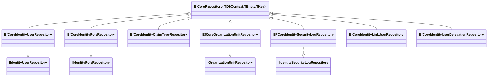

The `Volo.Abp.Identity.EntityFrameworkCore` package is the relational
persistence provider for the Identity module. It maps every domain aggregate
(`IdentityUser`, `IdentityRole`, `IdentityClaimType`, `OrganizationUnit`,
`IdentitySecurityLog`, `IdentityLinkUser`, `IdentityUserDelegation`) onto
EF Core entities, ships an `IdentityDbContext` (and matching
`IIdentityDbContext` interface so applications can compose it into their own
context), and registers a `EfCoreXxxRepository` for each repository contract
the domain layer declared. This page walks the module class, the model
builder extension method that produces the schema, and the repository
implementations one by one.

## Package layout

```
modules/identity/src/Volo.Abp.Identity.EntityFrameworkCore/
└── Volo/Abp/Identity/EntityFrameworkCore/
    ├── AbpIdentityEntityFrameworkCoreModule.cs
    ├── IIdentityDbContext.cs
    ├── IdentityDbContext.cs
    ├── IdentityDbContextModelBuilderExtensions.cs  (ConfigureIdentity)
    ├── IdentityEfCoreQueryableExtensions.cs        (IncludeDetails)
    ├── EfCoreIdentityUserRepository.cs
    ├── EfCoreIdentityRoleRepository.cs
    ├── EfCoreIdentityClaimTypeRepository.cs
    ├── EfCoreOrganizationUnitRepository.cs
    ├── EFCoreIdentitySecurityLogRepository.cs
    ├── EfCoreIdentityLinkUserRepository.cs
    └── EfCoreIdentityUserDelegationRepository.cs
```

<Info>
The package targets the `IIdentityDbContext` *interface*, not the concrete
`IdentityDbContext`. That means a host application that bundles Identity into
its own `MyAppDbContext` only needs to implement `IIdentityDbContext` and call
`builder.ConfigureIdentity()` from `OnModelCreating` — the repositories
automatically resolve against the interface via `EfCoreRepository<TDbContext,
…>`'s generic constraint.
</Info>

## Module class

`AbpIdentityEntityFrameworkCoreModule` depends on
`AbpIdentityDomainModule` (so the entity classes and repository interfaces
are available) and `AbpUsersEntityFrameworkCoreModule` (so the shared
`Volo.Abp.Users` configurations such as `ConfigureAbpUser()` are present).
It then calls `AddAbpDbContext<IdentityDbContext>` and lists one
`AddRepository<TEntity, TRepository>()` line per aggregate.

```csharp title="modules/identity/src/Volo.Abp.Identity.EntityFrameworkCore/Volo/Abp/Identity/EntityFrameworkCore/AbpIdentityEntityFrameworkCoreModule.cs"
[DependsOn(
    typeof(AbpIdentityDomainModule),
    typeof(AbpUsersEntityFrameworkCoreModule))]
public class AbpIdentityEntityFrameworkCoreModule : AbpModule
{
    public override void ConfigureServices(ServiceConfigurationContext context)
    {
        context.Services.AddAbpDbContext<IdentityDbContext>(options =>
        {
            options.AddRepository<IdentityUser, EfCoreIdentityUserRepository>();
            options.AddRepository<IdentityRole, EfCoreIdentityRoleRepository>();
            options.AddRepository<IdentityClaimType, EfCoreIdentityClaimTypeRepository>();
            options.AddRepository<OrganizationUnit, EfCoreOrganizationUnitRepository>();
            options.AddRepository<IdentitySecurityLog, EFCoreIdentitySecurityLogRepository>();
            options.AddRepository<IdentityLinkUser, EfCoreIdentityLinkUserRepository>();
            options.AddRepository<IdentityUserDelegation, EfCoreIdentityUserDelegationRepository>();
        });
    }
}
```

`AddRepository<TEntity, TRepository>()` registers the repository as the
implementation for both `IRepository<TEntity, TKey>` and the entity-specific
interface declared in the domain (for example `IIdentityUserRepository`).
The generic implementation in the framework's
[data layer](/data) wires up the EF Core `DbContextProvider`, unit-of-work
integration, and connection-string resolution.

## DbContext and interface

`IIdentityDbContext` exposes one `DbSet<T>` per identity aggregate. It is
decorated with `[ConnectionStringName(AbpIdentityDbProperties.ConnectionStringName)]`
so the framework picks the `AbpIdentity` connection string when present and
falls back to the default string otherwise.

```csharp title="modules/identity/src/Volo.Abp.Identity.EntityFrameworkCore/Volo/Abp/Identity/EntityFrameworkCore/IIdentityDbContext.cs"
[ConnectionStringName(AbpIdentityDbProperties.ConnectionStringName)]
public interface IIdentityDbContext : IEfCoreDbContext
{
    DbSet<IdentityUser> Users { get; }
    DbSet<IdentityRole> Roles { get; }
    DbSet<IdentityClaimType> ClaimTypes { get; }
    DbSet<OrganizationUnit> OrganizationUnits { get; }
    DbSet<IdentitySecurityLog> SecurityLogs { get; }
    DbSet<IdentityLinkUser> LinkUsers { get; }
    DbSet<IdentityUserDelegation> UserDelegations { get; }
}
```

`IdentityDbContext` is the default implementation. Its `OnModelCreating`
calls `base.OnModelCreating(builder)` (which lets every loose
`IEntityTypeConfiguration<>` registered against the assembly run) and then
delegates the bulk of the work to `builder.ConfigureIdentity()`:

```csharp title="modules/identity/src/Volo.Abp.Identity.EntityFrameworkCore/Volo/Abp/Identity/EntityFrameworkCore/IdentityDbContext.cs"
[ConnectionStringName(AbpIdentityDbProperties.ConnectionStringName)]
public class IdentityDbContext : AbpDbContext<IdentityDbContext>, IIdentityDbContext
{
    public DbSet<IdentityUser> Users { get; set; }
    public DbSet<IdentityRole> Roles { get; set; }
    public DbSet<IdentityClaimType> ClaimTypes { get; set; }
    public DbSet<OrganizationUnit> OrganizationUnits { get; set; }
    public DbSet<IdentitySecurityLog> SecurityLogs { get; set; }
    public DbSet<IdentityLinkUser> LinkUsers { get; set; }
    public DbSet<IdentityUserDelegation> UserDelegations { get; set; }

    public IdentityDbContext(DbContextOptions<IdentityDbContext> options)
        : base(options) { }

    protected override void OnModelCreating(ModelBuilder builder)
    {
        base.OnModelCreating(builder);
        builder.ConfigureIdentity();
    }
}
```

## ConfigureIdentity model builder extension

`IdentityDbContextModelBuilderExtensions.ConfigureIdentity(this ModelBuilder)`
is the single entry point that produces the Identity schema. It runs through
each entity, declares the table name (prefixed with
`AbpIdentityDbProperties.DbTablePrefix`), applies
`ConfigureByConvention()` for ABP auditing / multi-tenancy columns, and adds
indexes plus relationships.

### IdentityUser configuration

```csharp title="modules/identity/src/Volo.Abp.Identity.EntityFrameworkCore/Volo/Abp/Identity/EntityFrameworkCore/IdentityDbContextModelBuilderExtensions.cs"
builder.Entity<IdentityUser>(b =>
{
    b.ToTable(AbpIdentityDbProperties.DbTablePrefix + "Users", AbpIdentityDbProperties.DbSchema);

    b.ConfigureByConvention();
    b.ConfigureAbpUser();

    b.Property(u => u.NormalizedUserName).IsRequired()
        .HasMaxLength(IdentityUserConsts.MaxNormalizedUserNameLength);
    b.Property(u => u.NormalizedEmail).IsRequired()
        .HasMaxLength(IdentityUserConsts.MaxNormalizedEmailLength);
    b.Property(u => u.PasswordHash).HasMaxLength(IdentityUserConsts.MaxPasswordHashLength);
    b.Property(u => u.SecurityStamp).IsRequired().HasMaxLength(IdentityUserConsts.MaxSecurityStampLength);
    b.Property(u => u.TwoFactorEnabled).HasDefaultValue(false);
    b.Property(u => u.LockoutEnabled).HasDefaultValue(false);
    b.Property(u => u.IsExternal).IsRequired().HasDefaultValue(false);
    b.Property(u => u.AccessFailedCount)
        .If(!builder.IsUsingOracle(), p => p.HasDefaultValue(0));

    b.HasMany(u => u.Claims).WithOne().HasForeignKey(uc => uc.UserId).IsRequired();
    b.HasMany(u => u.Logins).WithOne().HasForeignKey(ul => ul.UserId).IsRequired();
    b.HasMany(u => u.Roles).WithOne().HasForeignKey(ur => ur.UserId).IsRequired();
    b.HasMany(u => u.Tokens).WithOne().HasForeignKey(ur => ur.UserId).IsRequired();
    b.HasMany(u => u.OrganizationUnits).WithOne().HasForeignKey(ur => ur.UserId).IsRequired();

    b.HasIndex(u => u.NormalizedUserName);
    b.HasIndex(u => u.NormalizedEmail);
    b.HasIndex(u => u.UserName);
    b.HasIndex(u => u.Email);

    b.ApplyObjectExtensionMappings();
});
```

The trailing `ApplyObjectExtensionMappings()` lets extra properties added
through the ABP object-extension system materialise as actual columns
(`ExtraProperties` JSON is always there, but typed columns appear when a
host calls `ObjectExtensionManager.Instance.AddOrUpdateProperty<IdentityUser, T>(name)`).

### Relationship and junction tables

Every junction (`IdentityUserRole`, `IdentityUserLogin`, `IdentityUserToken`,
`OrganizationUnitRole`, `IdentityUserOrganizationUnit`) is declared with an
explicit composite key and indexed on the "reverse" lookup direction:

| Table | Key | Reverse index |
| --- | --- | --- |
| `AbpUserRoles` | `(UserId, RoleId)` | `(RoleId, UserId)` |
| `AbpUserLogins` | `(UserId, LoginProvider)` | `(LoginProvider, ProviderKey)` |
| `AbpUserTokens` | `(UserId, LoginProvider, Name)` | — |
| `AbpOrganizationUnitRoles` | `(OrganizationUnitId, RoleId)` | `(RoleId, OrganizationUnitId)` |
| `AbpUserOrganizationUnits` | `(OrganizationUnitId, UserId)` | `(UserId, OrganizationUnitId)` |

### Host-only entities

`IdentityClaimType` and `IdentityLinkUser` are guarded with
`if (builder.IsHostDatabase())` so they only appear on the host database in
multi-tenant setups (tenants reuse the host's claim type catalog and link
user table):

```csharp title="modules/identity/src/Volo.Abp.Identity.EntityFrameworkCore/Volo/Abp/Identity/EntityFrameworkCore/IdentityDbContextModelBuilderExtensions.cs"
if (builder.IsHostDatabase())
{
    builder.Entity<IdentityClaimType>(b =>
    {
        b.ToTable(AbpIdentityDbProperties.DbTablePrefix + "ClaimTypes", AbpIdentityDbProperties.DbSchema);
        b.ConfigureByConvention();
        b.Property(uc => uc.Name).HasMaxLength(IdentityClaimTypeConsts.MaxNameLength).IsRequired();
        b.Property(uc => uc.Regex).HasMaxLength(IdentityClaimTypeConsts.MaxRegexLength);
        b.Property(uc => uc.RegexDescription).HasMaxLength(IdentityClaimTypeConsts.MaxRegexDescriptionLength);
        b.Property(uc => uc.Description).HasMaxLength(IdentityClaimTypeConsts.MaxDescriptionLength);
        b.ApplyObjectExtensionMappings();
    });
}
```

The `IdentityLinkUser` entity additionally has a composite unique index that
spans both the source and target tenant/user pair so a link is recorded only
once in either direction:

```csharp title="modules/identity/src/Volo.Abp.Identity.EntityFrameworkCore/Volo/Abp/Identity/EntityFrameworkCore/IdentityDbContextModelBuilderExtensions.cs"
b.HasIndex(x => new {
    UserId       = x.SourceUserId,
    TenantId     = x.SourceTenantId,
    LinkedUserId = x.TargetUserId,
    LinkedTenantId = x.TargetTenantId
}).IsUnique();
```

### IdentitySecurityLog indexes

Security log queries are almost always tenant-scoped, so the configuration
ships four composite indexes — one per common filter axis — instead of one
big covering index:

```csharp title="modules/identity/src/Volo.Abp.Identity.EntityFrameworkCore/Volo/Abp/Identity/EntityFrameworkCore/IdentityDbContextModelBuilderExtensions.cs"
b.HasIndex(x => new { x.TenantId, x.ApplicationName });
b.HasIndex(x => new { x.TenantId, x.Identity });
b.HasIndex(x => new { x.TenantId, x.Action });
b.HasIndex(x => new { x.TenantId, x.UserId });
```

### Object-extension hook

The method finishes with `builder.TryConfigureObjectExtensions<IdentityDbContext>();`
which runs once per context type and lets the EF Core integration pick up any
`ObjectExtensionManager` configuration the host added between module
boot-up.

## IncludeDetails extensions

`IdentityEfCoreQueryableExtensions` provides the canonical `IncludeDetails`
helpers used by repositories whenever an aggregate root is loaded:

```csharp title="modules/identity/src/Volo.Abp.Identity.EntityFrameworkCore/Volo/Abp/Identity/EntityFrameworkCore/IdentityEfCoreQueryableExtensions.cs"
public static IQueryable<IdentityUser> IncludeDetails(this IQueryable<IdentityUser> queryable, bool include = true)
{
    if (!include) return queryable;

    return queryable
        .Include(x => x.Roles)
        .Include(x => x.Logins)
        .Include(x => x.Claims)
        .Include(x => x.Tokens)
        .Include(x => x.OrganizationUnits);
}
```

Similar overloads exist for `IdentityRole` (`Claims`) and `OrganizationUnit`
(`Roles`). Repository methods accept an `includeDetails` flag so callers can
opt out when they only need a projection.

## Repositories overview



Each repository inherits
`EfCoreRepository<IIdentityDbContext, TEntity, TKey>` and implements its
domain interface from `Volo.Abp.Identity.Domain`. They use the framework's
`GetDbSetAsync()` / `GetDbContextAsync()` helpers so unit-of-work semantics
are preserved.

### EfCoreIdentityUserRepository

Implements `IIdentityUserRepository` with rich lookup methods used by
`IdentityUserManager`:

| Method | Purpose |
| --- | --- |
| `FindByNormalizedUserNameAsync(string, bool, CancellationToken)` | Username login lookup |
| `FindByNormalizedEmailAsync(string, bool, CancellationToken)` | Email login lookup |
| `FindByLoginAsync(string loginProvider, string providerKey, …)` | External-login lookup |
| `FindByTenantIdAndUserNameAsync(string, Guid?, …)` | Cross-tenant lookup |
| `GetRoleNamesAsync(Guid, CancellationToken)` | Direct + OU roles for one user |
| `GetRoleNamesAsync(IEnumerable<Guid>, CancellationToken)` | Batched variant returning `IdentityUserIdWithRoleNames` |
| `GetRoleNamesInOrganizationUnitAsync(Guid, CancellationToken)` | Only OU-derived roles |
| `GetListByClaimAsync(Claim, …)` | Users carrying a claim |
| `GetListByNormalizedRoleNameAsync(string, …)` | Users in a role |
| `GetUserIdListByRoleIdAsync(Guid, CancellationToken)` | Lightweight id projection |
| `GetListAsync(sorting, max, skip, filter, includeDetails, …)` | Paged list used by app services |
| `GetCountAsync(filter, …)` | Total count for paging |
| `GetRolesAsync(Guid, …)` / `GetOrganizationUnitsAsync(Guid, …)` | Related entities |
| `GetUsersInOrganizationUnitAsync(Guid, CancellationToken)` | Members of one OU |
| `GetUsersInOrganizationUnitWithChildrenAsync(string code, …)` | Members of a subtree |
| `UpdateRoleAsync(sourceRoleId, targetRoleId, …)` | Bulk re-point role assignments before deleting a role |
| `UpdateOrganizationAsync(sourceOrgId, targetOrgId, …)` | Bulk re-point OU memberships |

The role-name lookup illustrates how it composes direct role assignments and
OU-derived role assignments in one query:

```csharp title="modules/identity/src/Volo.Abp.Identity.EntityFrameworkCore/Volo/Abp/Identity/EntityFrameworkCore/EfCoreIdentityUserRepository.cs"
public virtual async Task<List<string>> GetRoleNamesAsync(Guid id, CancellationToken cancellationToken = default)
{
    var dbContext = await GetDbContextAsync();
    var query = from userRole in dbContext.Set<IdentityUserRole>()
                join role in dbContext.Roles on userRole.RoleId equals role.Id
                where userRole.UserId == id
                select role.Name;

    var organizationUnitIds = dbContext.Set<IdentityUserOrganizationUnit>()
        .Where(q => q.UserId == id).Select(q => q.OrganizationUnitId).ToArray();

    var organizationRoleIds = await (
        from ouRole in dbContext.Set<OrganizationUnitRole>()
        join ou in dbContext.Set<OrganizationUnit>() on ouRole.OrganizationUnitId equals ou.Id
        where organizationUnitIds.Contains(ouRole.OrganizationUnitId)
        select ouRole.RoleId
    ).ToListAsync(GetCancellationToken(cancellationToken));

    var orgUnitRoleNameQuery = dbContext.Roles
        .Where(r => organizationRoleIds.Contains(r.Id))
        .Select(n => n.Name);

    return await query.Union(orgUnitRoleNameQuery)
        .ToListAsync(GetCancellationToken(cancellationToken));
}
```

### EfCoreIdentityRoleRepository

Implements `IIdentityRoleRepository`:

| Method | Purpose |
| --- | --- |
| `FindByNormalizedNameAsync(string, bool, CancellationToken)` | Lookup by `NormalizedName` |
| `GetListAsync(sorting, max, skip, filter, includeDetails, …)` | Paged role list |
| `GetListWithUserCountAsync(sorting, max, skip, filter, includeDetails, …)` | Paged list with the number of users per role |
| `GetDefaultOnesAsync(includeDetails, …)` | Roles marked `IsDefault = true` |
| `GetCountAsync(filter, …)` | Total count |

`GetListWithUserCountAsync` issues a second `GroupBy` query against
`IdentityUserRole` to avoid the N+1 pattern the management UI would
otherwise produce.

### EFCoreIdentitySecurityLogRepository

Implements `IIdentitySecurityLogRepository`. Returns paged
`IdentitySecurityLog` rows matching application name / identity / action /
user filters plus a tenant-aware `GetByUserIdAsync` for the per-user log
panel:

| Method | Purpose |
| --- | --- |
| `GetListAsync(sorting, max, skip, startTime, endTime, applicationName, identity, action, userId, userName, clientIpAddress, correlationId, includeDetails, …)` | Filtered/paged listing |
| `GetCountAsync(startTime, endTime, applicationName, identity, action, userId, userName, clientIpAddress, correlationId, …)` | Count |
| `GetByUserIdAsync(Guid id, Guid userId, bool includeDetails, CancellationToken)` | Single row scoped to user |

### EfCoreOrganizationUnitRepository

The widest surface area. Covers the tree itself, role assignments, and
membership management:

| Method | Purpose |
| --- | --- |
| `GetAsync(string displayName, bool includeDetails, …)` | Lookup by display name |
| `GetChildrenAsync(Guid? parentId, …)` | Direct children |
| `GetAllChildrenWithParentCodeAsync(string code, Guid? parentId, …)` | All descendants by prefix |
| `GetListAsync(sorting, max, skip, includeDetails, …)` | Paged tree listing |
| `GetListAsync(IEnumerable<Guid> ids, includeDetails, …)` | Batched lookup |
| `GetListByRoleIdAsync(Guid roleId, …)` | OUs that own a role |
| `GetRolesAsync(OrganizationUnit, sorting, max, skip, …)` | Roles assigned to an OU |
| `GetRolesCountAsync(OrganizationUnit, …)` | Count of assigned roles |
| `GetUnaddedRolesAsync(OrganizationUnit, sorting, max, skip, filter, …)` | Roles available to add |
| `GetUnaddedRolesCountAsync(OrganizationUnit, filter, …)` | Count of available roles |
| `GetMembersAsync(OrganizationUnit, sorting, max, skip, filter, …)` | Paged user members |
| `GetMemberIdsAsync(Guid, …)` | Member ID projection |
| `GetMembersCountAsync(OrganizationUnit, filter, …)` | Count |
| `GetUnaddedUsersAsync(OrganizationUnit, sorting, max, skip, filter, …)` | Users that can be added |
| `RemoveAllMembersAsync(OrganizationUnit, CancellationToken)` | Cascade detach members on delete |

### EfCoreIdentityClaimTypeRepository, EfCoreIdentityLinkUserRepository, EfCoreIdentityUserDelegationRepository

These are smaller, mostly CRUD repositories — `EfCoreIdentityClaimTypeRepository.FindByNameAsync`,
`EfCoreIdentityLinkUserRepository.FindAsync(sourceLinkUserInfo, targetLinkUserInfo, …)` /
`GetListAsync(IdentityLinkUserInfo, includeIndirect, …)`, and the
delegation repository's `FindActiveDelegationsAsync` and
`GetListAsync` for the impersonation workflow.

## How a host application composes Identity into its own DbContext

Most ABP applications do not use the standalone `IdentityDbContext`. Instead
they declare a per-application context and tell ABP to map the Identity
repositories onto it. The reusable pieces are:

1. Make the application's `DbContext` implement `IIdentityDbContext` (or use
   the `[ReplaceDbContext]` attribute to mark the application context as the
   replacement for the Identity context).
2. Call `builder.ConfigureIdentity()` from `OnModelCreating`.
3. Keep the
   `AbpIdentityEntityFrameworkCoreModule` dependency so the
   `AddRepository<…>()` lines run.

```csharp title="MyAppDbContext.cs (host pattern)"
[ReplaceDbContext(typeof(IIdentityDbContext))]
[ConnectionStringName("Default")]
public class MyAppDbContext : AbpDbContext<MyAppDbContext>, IIdentityDbContext
{
    public DbSet<IdentityUser> Users { get; set; }
    public DbSet<IdentityRole> Roles { get; set; }
    // ... other DbSets from IIdentityDbContext

    protected override void OnModelCreating(ModelBuilder builder)
    {
        base.OnModelCreating(builder);
        builder.ConfigureIdentity();
    }
}
```

Because the repositories are typed as
`EfCoreRepository<IIdentityDbContext, …>` and ABP's
`ReplaceDbContextAttribute` machinery substitutes `MyAppDbContext` for
`IIdentityDbContext` at resolve time, no extra DI wiring is required.

## Related pages

<CardGroup cols={2}>
  <Card title="Identity module overview" href="/modules/identity/overview" icon="circle-info">
    Aggregates, managers, and how the EF Core provider plugs in.
  </Card>
  <Card title="MongoDB provider" href="/modules/identity/mongodb" icon="database">
    Same repository contracts, document model instead of relational tables.
  </Card>
  <Card title="ABP EF Core data layer" href="/data" icon="layer-group">
    `AbpDbContext`, `EfCoreRepository`, and unit-of-work integration.
  </Card>
  <Card title="Data seeding & installer" href="/modules/identity/data-seeding-and-installer" icon="seedling">
    Bootstrapping the admin user and role with this schema.
  </Card>
</CardGroup>
