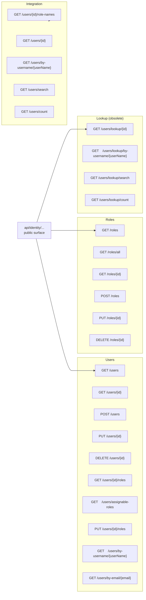
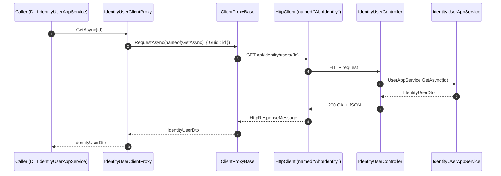

The Identity module exposes two coordinated surfaces over HTTP: a controller package (`Volo.Abp.Identity.HttpApi`) that re‑hosts the application services as `[ApiController]`‑style endpoints, and a client package (`Volo.Abp.Identity.HttpApi.Client`) whose generated `ClientProxy` classes implement the very same app‑service interfaces against `HttpClient`. The proxies plug into ABP's `IDynamicProxyInterceptor` machinery so a remote caller using `IIdentityUserAppService` gets a transparent HTTP round trip; the same code runs unchanged when the module is hosted in‑process. This page maps every route and every proxy class, with the source paths inline.

<Info>
Source roots:
[`modules/identity/src/Volo.Abp.Identity.HttpApi/`](https://github.com/abpframework/abp/tree/dev/modules/identity/src/Volo.Abp.Identity.HttpApi),
[`modules/identity/src/Volo.Abp.Identity.HttpApi.Client/`](https://github.com/abpframework/abp/tree/dev/modules/identity/src/Volo.Abp.Identity.HttpApi.Client).
</Info>

## Module wiring

### HttpApi

```csharp modules/identity/src/Volo.Abp.Identity.HttpApi/Volo/Abp/Identity/AbpIdentityHttpApiModule.cs
[DependsOn(typeof(AbpIdentityApplicationContractsModule), typeof(AbpAspNetCoreMvcModule))]
public class AbpIdentityHttpApiModule : AbpModule
{
    public override void PreConfigureServices(ServiceConfigurationContext context)
    {
        PreConfigure<IMvcBuilder>(mvcBuilder =>
        {
            mvcBuilder.AddApplicationPartIfNotExists(typeof(AbpIdentityHttpApiModule).Assembly);
        });
    }

    public override void ConfigureServices(ServiceConfigurationContext context)
    {
        Configure<AbpLocalizationOptions>(options =>
        {
            options.Resources
                .Get<IdentityResource>()
                .AddBaseTypes(typeof(AbpUiResource));
        });
    }
}
```

The `AddApplicationPartIfNotExists` call ensures the controllers in this assembly are discovered by the MVC pipeline even when the module is consumed via DLL only (no `csproj` reference) — important for plugin scenarios.

### HttpApi.Client

```csharp modules/identity/src/Volo.Abp.Identity.HttpApi.Client/Volo/Abp/Identity/AbpIdentityHttpApiClientModule.cs
[DependsOn(
    typeof(AbpIdentityApplicationContractsModule),
    typeof(AbpHttpClientModule))]
public class AbpIdentityHttpApiClientModule : AbpModule
{
    public override void ConfigureServices(ServiceConfigurationContext context)
    {
        context.Services.AddStaticHttpClientProxies(
            typeof(AbpIdentityApplicationContractsModule).Assembly,
            IdentityRemoteServiceConsts.RemoteServiceName
        );

        Configure<AbpVirtualFileSystemOptions>(options =>
        {
            options.FileSets.AddEmbedded<AbpIdentityHttpApiClientModule>();
        });
    }
}
```

`AddStaticHttpClientProxies` scans the application‑contracts assembly for service interfaces and registers proxies against the named remote service `"AbpIdentity"`. The host's `AbpRemoteServiceOptions` decides which base URL maps to that name.

## File inventory

### `Volo.Abp.Identity.HttpApi`

| File | Type | Route prefix |
| --- | --- | --- |
| `Volo/Abp/Identity/IdentityUserController.cs` | controller | `api/identity/users` |
| `Volo/Abp/Identity/IdentityRoleController.cs` | controller | `api/identity/roles` |
| `Volo/Abp/Identity/IdentityUserLookupController.cs` | controller | `api/identity/users/lookup` |
| `Volo/Abp/Identity/Integration/IdentityUserIntegrationController.cs` | controller | `integration-api/identity/users` |
| `Volo/Abp/Identity/AbpIdentityHttpApiModule.cs` | `AbpModule` | — |

### `Volo.Abp.Identity.HttpApi.Client`

| File | Type | Implements |
| --- | --- | --- |
| `ClientProxies/Volo/Abp/Identity/IdentityUserClientProxy.Generated.cs` | proxy | `IIdentityUserAppService` |
| `ClientProxies/Volo/Abp/Identity/IdentityUserClientProxy.cs` | partial customization | — |
| `ClientProxies/Volo/Abp/Identity/IdentityRoleClientProxy.Generated.cs` | proxy | `IIdentityRoleAppService` |
| `ClientProxies/Volo/Abp/Identity/IdentityRoleClientProxy.cs` | partial customization | — |
| `ClientProxies/Volo/Abp/Identity/IdentityUserLookupClientProxy.Generated.cs` | proxy | `IIdentityUserLookupAppService` |
| `ClientProxies/Volo/Abp/Identity/IdentityUserLookupClientProxy.cs` | partial customization | — |
| `ClientProxies/Volo/Abp/Identity/Integration/IdentityUserIntegrationClientProxy.Generated.cs` | proxy | `IIdentityUserIntegrationService` |
| `ClientProxies/Volo/Abp/Identity/Integration/IdentityUserIntegrationClientProxy.cs` | partial customization | — |
| `Volo/Abp/Identity/HttpClientExternalUserLookupServiceProvider.cs` | service | `IExternalUserLookupServiceProvider` over HTTP |
| `Volo/Abp/Identity/HttpClientUserRoleFinder.cs` | service | `IUserRoleFinder` over HTTP |
| `Volo/Abp/Identity/IdentityUserDtoExtensions.cs` | extension | DTO → `IUserData` helpers |
| `Volo/Abp/Identity/AbpIdentityHttpApiClientModule.cs` | `AbpModule` | — |

## Controllers

Every controller is attributed with `[RemoteService(Name = IdentityRemoteServiceConsts.RemoteServiceName)]` and `[Area(IdentityRemoteServiceConsts.ModuleName)]`, then implements the matching app‑service interface so OpenAPI sees one canonical method set per operation.

### `IdentityUserController`

```csharp modules/identity/src/Volo.Abp.Identity.HttpApi/Volo/Abp/Identity/IdentityUserController.cs
[RemoteService(Name = IdentityRemoteServiceConsts.RemoteServiceName)]
[Area(IdentityRemoteServiceConsts.ModuleName)]
[ControllerName("User")]
[Route("api/identity/users")]
public class IdentityUserController : AbpControllerBase, IIdentityUserAppService
{
    protected IIdentityUserAppService UserAppService { get; }

    public IdentityUserController(IIdentityUserAppService userAppService)
    {
        UserAppService = userAppService;
    }

    [HttpGet] [Route("{id}")]
    public virtual Task<IdentityUserDto> GetAsync(Guid id) => UserAppService.GetAsync(id);

    [HttpGet]
    public virtual Task<PagedResultDto<IdentityUserDto>> GetListAsync(GetIdentityUsersInput input)
        => UserAppService.GetListAsync(input);

    [HttpPost]
    public virtual Task<IdentityUserDto> CreateAsync(IdentityUserCreateDto input)
        => UserAppService.CreateAsync(input);

    [HttpPut] [Route("{id}")]
    public virtual Task<IdentityUserDto> UpdateAsync(Guid id, IdentityUserUpdateDto input)
        => UserAppService.UpdateAsync(id, input);

    [HttpDelete] [Route("{id}")]
    public virtual Task DeleteAsync(Guid id) => UserAppService.DeleteAsync(id);

    [HttpGet] [Route("{id}/roles")]
    public virtual Task<ListResultDto<IdentityRoleDto>> GetRolesAsync(Guid id)
        => UserAppService.GetRolesAsync(id);

    [HttpGet] [Route("assignable-roles")]
    public Task<ListResultDto<IdentityRoleDto>> GetAssignableRolesAsync()
        => UserAppService.GetAssignableRolesAsync();

    [HttpPut] [Route("{id}/roles")]
    public virtual Task UpdateRolesAsync(Guid id, IdentityUserUpdateRolesDto input)
        => UserAppService.UpdateRolesAsync(id, input);

    [HttpGet] [Route("by-username/{userName}")]
    public virtual Task<IdentityUserDto> FindByUsernameAsync(string userName)
        => UserAppService.FindByUsernameAsync(userName);

    [HttpGet] [Route("by-email/{email}")]
    public virtual Task<IdentityUserDto> FindByEmailAsync(string email)
        => UserAppService.FindByEmailAsync(email);
}
```

Route table:

| Method | Route | App‑service method |
| --- | --- | --- |
| `GET` | `api/identity/users` | `GetListAsync(GetIdentityUsersInput)` |
| `GET` | `api/identity/users/{id}` | `GetAsync(Guid)` |
| `POST` | `api/identity/users` | `CreateAsync(IdentityUserCreateDto)` |
| `PUT` | `api/identity/users/{id}` | `UpdateAsync(Guid, IdentityUserUpdateDto)` |
| `DELETE` | `api/identity/users/{id}` | `DeleteAsync(Guid)` |
| `GET` | `api/identity/users/{id}/roles` | `GetRolesAsync(Guid)` |
| `GET` | `api/identity/users/assignable-roles` | `GetAssignableRolesAsync()` |
| `PUT` | `api/identity/users/{id}/roles` | `UpdateRolesAsync(Guid, IdentityUserUpdateRolesDto)` |
| `GET` | `api/identity/users/by-username/{userName}` | `FindByUsernameAsync(string)` |
| `GET` | `api/identity/users/by-email/{email}` | `FindByEmailAsync(string)` |

### `IdentityRoleController`

```csharp modules/identity/src/Volo.Abp.Identity.HttpApi/Volo/Abp/Identity/IdentityRoleController.cs
[RemoteService(Name = IdentityRemoteServiceConsts.RemoteServiceName)]
[Area(IdentityRemoteServiceConsts.ModuleName)]
[ControllerName("Role")]
[Route("api/identity/roles")]
public class IdentityRoleController : AbpControllerBase, IIdentityRoleAppService
{
    protected IIdentityRoleAppService RoleAppService { get; }

    public IdentityRoleController(IIdentityRoleAppService roleAppService)
    {
        RoleAppService = roleAppService;
    }

    [HttpGet] [Route("all")]
    public virtual Task<ListResultDto<IdentityRoleDto>> GetAllListAsync()
        => RoleAppService.GetAllListAsync();

    [HttpGet]
    public virtual Task<PagedResultDto<IdentityRoleDto>> GetListAsync(GetIdentityRolesInput input)
        => RoleAppService.GetListAsync(input);

    [HttpGet] [Route("{id}")]
    public virtual Task<IdentityRoleDto> GetAsync(Guid id) => RoleAppService.GetAsync(id);

    [HttpPost]
    public virtual Task<IdentityRoleDto> CreateAsync(IdentityRoleCreateDto input)
        => RoleAppService.CreateAsync(input);

    [HttpPut] [Route("{id}")]
    public virtual Task<IdentityRoleDto> UpdateAsync(Guid id, IdentityRoleUpdateDto input)
        => RoleAppService.UpdateAsync(id, input);

    [HttpDelete] [Route("{id}")]
    public virtual Task DeleteAsync(Guid id) => RoleAppService.DeleteAsync(id);
}
```

Route table:

| Method | Route | App‑service method |
| --- | --- | --- |
| `GET` | `api/identity/roles` | `GetListAsync(GetIdentityRolesInput)` |
| `GET` | `api/identity/roles/all` | `GetAllListAsync()` |
| `GET` | `api/identity/roles/{id}` | `GetAsync(Guid)` |
| `POST` | `api/identity/roles` | `CreateAsync(IdentityRoleCreateDto)` |
| `PUT` | `api/identity/roles/{id}` | `UpdateAsync(Guid, IdentityRoleUpdateDto)` |
| `DELETE` | `api/identity/roles/{id}` | `DeleteAsync(Guid)` |

### `IdentityUserLookupController`

```csharp modules/identity/src/Volo.Abp.Identity.HttpApi/Volo/Abp/Identity/IdentityUserLookupController.cs
[RemoteService(Name = IdentityRemoteServiceConsts.RemoteServiceName)]
[Area(IdentityRemoteServiceConsts.ModuleName)]
[ControllerName("UserLookup")]
[Route("api/identity/users/lookup")]
public class IdentityUserLookupController : AbpControllerBase, IIdentityUserLookupAppService
{
    protected IIdentityUserLookupAppService LookupAppService { get; }

    [HttpGet] [Route("{id}")]
    public virtual Task<UserData> FindByIdAsync(Guid id) => LookupAppService.FindByIdAsync(id);

    [HttpGet] [Route("by-username/{userName}")]
    public virtual Task<UserData> FindByUserNameAsync(string userName)
        => LookupAppService.FindByUserNameAsync(userName);

    [HttpGet] [Route("search")]
    public Task<ListResultDto<UserData>> SearchAsync(UserLookupSearchInputDto input)
        => LookupAppService.SearchAsync(input);

    [HttpGet] [Route("count")]
    public Task<long> GetCountAsync(UserLookupCountInputDto input)
        => LookupAppService.GetCountAsync(input);
}
```

The endpoints under `api/identity/users/lookup/...` exist for backward compatibility — the corresponding app service is `[Obsolete]`. New clients should call the integration controller below.

### `IdentityUserIntegrationController`

```csharp modules/identity/src/Volo.Abp.Identity.HttpApi/Volo/Abp/Identity/Integration/IdentityUserIntegrationController.cs
[RemoteService(Name = IdentityRemoteServiceConsts.RemoteServiceName)]
[Area(IdentityRemoteServiceConsts.ModuleName)]
[ControllerName("UserIntegration")]
[Route("integration-api/identity/users")]
public class IdentityUserIntegrationController : AbpControllerBase, IIdentityUserIntegrationService
{
    protected IIdentityUserIntegrationService UserIntegrationService { get; }

    [HttpGet] [Route("{id}/role-names")]
    public virtual Task<string[]> GetRoleNamesAsync(Guid id)
        => UserIntegrationService.GetRoleNamesAsync(id);

    [HttpGet] [Route("{id}")]
    public Task<UserData> FindByIdAsync(Guid id)
        => UserIntegrationService.FindByIdAsync(id);

    [HttpGet] [Route("by-username/{userName}")]
    public Task<UserData> FindByUserNameAsync(string userName)
        => UserIntegrationService.FindByUserNameAsync(userName);

    [HttpGet] [Route("search")]
    public Task<ListResultDto<UserData>> SearchAsync(UserLookupSearchInputDto input)
        => UserIntegrationService.SearchAsync(input);

    [HttpGet] [Route("count")]
    public Task<long> GetCountAsync(UserLookupCountInputDto input)
        => UserIntegrationService.GetCountAsync(input);
}
```

The `integration-api/...` prefix is the convention ABP uses for inter‑service contracts; the controller is the HTTP face of an `[IntegrationService]`. See [`/microservices/integration-services`](/web/auto-api-controllers) for how integration controllers are authenticated against a different scope than the public API.

## Combined route map



## Client proxies

`HttpApi.Client` ships `.Generated.cs` files (rewritten by the ABP tooling) plus a sibling `.cs` partial that exists so applications can add hand‑written overrides without losing changes on regeneration.

### `IdentityUserClientProxy`

```csharp modules/identity/src/Volo.Abp.Identity.HttpApi.Client/ClientProxies/Volo/Abp/Identity/IdentityUserClientProxy.Generated.cs
[Dependency(ReplaceServices = true)]
[ExposeServices(typeof(IIdentityUserAppService), typeof(IdentityUserClientProxy))]
public partial class IdentityUserClientProxy : ClientProxyBase<IIdentityUserAppService>, IIdentityUserAppService
{
    public virtual async Task<IdentityUserDto> GetAsync(Guid id)
    {
        return await RequestAsync<IdentityUserDto>(nameof(GetAsync), new ClientProxyRequestTypeValue
        {
            { typeof(Guid), id }
        });
    }

    public virtual async Task<PagedResultDto<IdentityUserDto>> GetListAsync(GetIdentityUsersInput input)
    {
        return await RequestAsync<PagedResultDto<IdentityUserDto>>(nameof(GetListAsync), new ClientProxyRequestTypeValue
        {
            { typeof(GetIdentityUsersInput), input }
        });
    }

    public virtual async Task<IdentityUserDto> CreateAsync(IdentityUserCreateDto input)
    {
        return await RequestAsync<IdentityUserDto>(nameof(CreateAsync), new ClientProxyRequestTypeValue
        {
            { typeof(IdentityUserCreateDto), input }
        });
    }

    public virtual async Task<IdentityUserDto> UpdateAsync(Guid id, IdentityUserUpdateDto input)
    {
        return await RequestAsync<IdentityUserDto>(nameof(UpdateAsync), new ClientProxyRequestTypeValue
        {
            { typeof(Guid), id },
            { typeof(IdentityUserUpdateDto), input }
        });
    }

    public virtual async Task DeleteAsync(Guid id)
    {
        await RequestAsync(nameof(DeleteAsync), new ClientProxyRequestTypeValue
        {
            { typeof(Guid), id }
        });
    }

    // ... GetRolesAsync, GetAssignableRolesAsync, UpdateRolesAsync,
    //     FindByUsernameAsync, FindByEmailAsync
}
```

The companion customization file is empty by default — applications can add helpers or override the generated methods here:

```csharp modules/identity/src/Volo.Abp.Identity.HttpApi.Client/ClientProxies/Volo/Abp/Identity/IdentityUserClientProxy.cs
// This file is part of IdentityUserClientProxy, you can customize it here
// ReSharper disable once CheckNamespace
namespace Volo.Abp.Identity;

public partial class IdentityUserClientProxy
{
}
```

### `IdentityRoleClientProxy`

```csharp modules/identity/src/Volo.Abp.Identity.HttpApi.Client/ClientProxies/Volo/Abp/Identity/IdentityRoleClientProxy.Generated.cs
[Dependency(ReplaceServices = true)]
[ExposeServices(typeof(IIdentityRoleAppService), typeof(IdentityRoleClientProxy))]
public partial class IdentityRoleClientProxy : ClientProxyBase<IIdentityRoleAppService>, IIdentityRoleAppService
{
    public virtual async Task<ListResultDto<IdentityRoleDto>> GetAllListAsync()
        => await RequestAsync<ListResultDto<IdentityRoleDto>>(nameof(GetAllListAsync));

    public virtual async Task<PagedResultDto<IdentityRoleDto>> GetListAsync(GetIdentityRolesInput input)
        => await RequestAsync<PagedResultDto<IdentityRoleDto>>(nameof(GetListAsync), new ClientProxyRequestTypeValue
        {
            { typeof(GetIdentityRolesInput), input }
        });

    public virtual async Task<IdentityRoleDto> GetAsync(Guid id)
        => await RequestAsync<IdentityRoleDto>(nameof(GetAsync), new ClientProxyRequestTypeValue
        {
            { typeof(Guid), id }
        });

    // CreateAsync, UpdateAsync, DeleteAsync ...
}
```

### `IdentityUserLookupClientProxy`

```csharp modules/identity/src/Volo.Abp.Identity.HttpApi.Client/ClientProxies/Volo/Abp/Identity/IdentityUserLookupClientProxy.Generated.cs
[Dependency(ReplaceServices = true)]
[ExposeServices(typeof(IIdentityUserLookupAppService), typeof(IdentityUserLookupClientProxy))]
public partial class IdentityUserLookupClientProxy : ClientProxyBase<IIdentityUserLookupAppService>, IIdentityUserLookupAppService
{
    public virtual async Task<UserData> FindByIdAsync(Guid id)
        => await RequestAsync<UserData>(nameof(FindByIdAsync), new ClientProxyRequestTypeValue
        {
            { typeof(Guid), id }
        });

    public virtual async Task<UserData> FindByUserNameAsync(string userName)
        => await RequestAsync<UserData>(nameof(FindByUserNameAsync), new ClientProxyRequestTypeValue
        {
            { typeof(string), userName }
        });

    public virtual async Task<ListResultDto<UserData>> SearchAsync(UserLookupSearchInputDto input)
        => await RequestAsync<ListResultDto<UserData>>(nameof(SearchAsync), new ClientProxyRequestTypeValue
        {
            { typeof(UserLookupSearchInputDto), input }
        });

    public virtual async Task<long> GetCountAsync(UserLookupCountInputDto input)
        => await RequestAsync<long>(nameof(GetCountAsync), new ClientProxyRequestTypeValue
        {
            { typeof(UserLookupCountInputDto), input }
        });
}
```

### `IdentityUserIntegrationClientProxy`

```csharp modules/identity/src/Volo.Abp.Identity.HttpApi.Client/ClientProxies/Volo/Abp/Identity/Integration/IdentityUserIntegrationClientProxy.Generated.cs
[Dependency(ReplaceServices = true)]
[ExposeServices(typeof(IIdentityUserIntegrationService), typeof(IdentityUserIntegrationClientProxy))]
[IntegrationService]
public partial class IdentityUserIntegrationClientProxy : ClientProxyBase<IIdentityUserIntegrationService>, IIdentityUserIntegrationService
{
    public virtual async Task<String[]> GetRoleNamesAsync(Guid id)
        => await RequestAsync<String[]>(nameof(GetRoleNamesAsync), new ClientProxyRequestTypeValue
        {
            { typeof(Guid), id }
        });

    public virtual async Task<UserData> FindByIdAsync(Guid id)
        => await RequestAsync<UserData>(nameof(FindByIdAsync), new ClientProxyRequestTypeValue
        {
            { typeof(Guid), id }
        });

    // FindByUserNameAsync, SearchAsync, GetCountAsync ...
}
```

Note the `[IntegrationService]` attribute is preserved on the proxy so caller scope checks still know the contract is an integration service.

## How a remote call flows



The transparent indirection means downstream code only ever sees `IIdentityUserAppService` — `[Dependency(ReplaceServices = true)]` causes the proxy to take the place of the local implementation in the DI container when the client module is loaded.

## HTTP‑backed lookup providers

In a microservice host, the Identity module isn't present locally — but other modules (e.g. background jobs, audit logs) still need to resolve user names and role lists. Two helpers in `HttpApi.Client` plug those gaps:

```csharp modules/identity/src/Volo.Abp.Identity.HttpApi.Client/Volo/Abp/Identity/HttpClientExternalUserLookupServiceProvider.cs
[Dependency(TryRegister = true)]
public class HttpClientExternalUserLookupServiceProvider : IExternalUserLookupServiceProvider, ITransientDependency
{
    protected IIdentityUserIntegrationService IdentityUserIntegrationService { get; }

    public virtual async Task<IUserData> FindByIdAsync(Guid id, CancellationToken cancellationToken = default)
    {
        return await IdentityUserIntegrationService.FindByIdAsync(id);
    }

    public virtual async Task<IUserData> FindByUserNameAsync(string userName, CancellationToken cancellationToken = default)
    {
        return await IdentityUserIntegrationService.FindByUserNameAsync(userName);
    }

    public async Task<List<IUserData>> SearchAsync(
        string sorting = null,
        string filter = null,
        int maxResultCount = int.MaxValue,
        int skipCount = 0,
        CancellationToken cancellationToken = default)
    {
        var result = await IdentityUserIntegrationService.SearchAsync(new UserLookupSearchInputDto
        {
            Filter = filter,
            MaxResultCount = maxResultCount,
            SkipCount = skipCount,
            Sorting = sorting
        });

        return result.Items.Cast<IUserData>().ToList();
    }
}
```

```csharp modules/identity/src/Volo.Abp.Identity.HttpApi.Client/Volo/Abp/Identity/HttpClientUserRoleFinder.cs
[Dependency(TryRegister = true)]
public class HttpClientUserRoleFinder : IUserRoleFinder, ITransientDependency
{
    protected IIdentityUserAppService _userAppService { get; }
    protected IIdentityUserIntegrationService _userIntegrationService { get; }

    public HttpClientUserRoleFinder(IIdentityUserAppService userAppService, IIdentityUserIntegrationService userIntegrationService)
    {
        _userAppService = userAppService;
        _userIntegrationService = userIntegrationService;
    }

    [Obsolete("Use GetRoleNamesAsync instead.")]
    public virtual async Task<string[]> GetRolesAsync(Guid userId)
    {
        var output = await _userAppService.GetRolesAsync(userId);
        return output.Items.Select(r => r.Name).ToArray();
    }

    public async Task<string[]> GetRoleNamesAsync(Guid userId)
    {
        return await _userIntegrationService.GetRoleNamesAsync(userId);
    }
}
```

Both are registered with `[Dependency(TryRegister = true)]` so that a host can choose a different `IExternalUserLookupServiceProvider` / `IUserRoleFinder` simply by registering its own implementation first.

## Customizing a proxy

Because the generated files are `partial`, you can add cross‑cutting behavior in the sibling customization file:

```csharp
public partial class IdentityUserClientProxy
{
    // Example: cache assignable roles for the lifetime of the proxy.
    private ListResultDto<IdentityRoleDto> _cachedAssignable;
    public override async Task<ListResultDto<IdentityRoleDto>> GetAssignableRolesAsync()
    {
        _cachedAssignable ??= await base.GetAssignableRolesAsync();
        return _cachedAssignable;
    }
}
```

If you need to override request shaping you can fall back to `ClientProxyBase<>.RequestAsync(...)` directly. See [`/http-api/client-proxies`](/http/dynamic-c-sharp-proxies) for the proxying infrastructure.

## Cross‑module references

<CardGroup cols={2}>
  <Card title="Application services" icon="gears" href="/modules/identity/application">
    The same interfaces the controllers implement and the proxies replace.
  </Card>
  <Card title="ASP.NET Core integration" icon="shield-halved" href="/modules/identity/aspnet-core-integration">
    Authentication scheme the controllers run under.
  </Card>
  <Card title="Account module" icon="user" href="/modules/account/overview">
    Public HTTP surface that drives sign‑in / register / 2FA against these Identity endpoints.
  </Card>
  <Card title="Permission Management" icon="key" href="/modules/permission-management/overview">
    The `[Authorize]` evaluations that gate each controller method.
  </Card>
</CardGroup>
