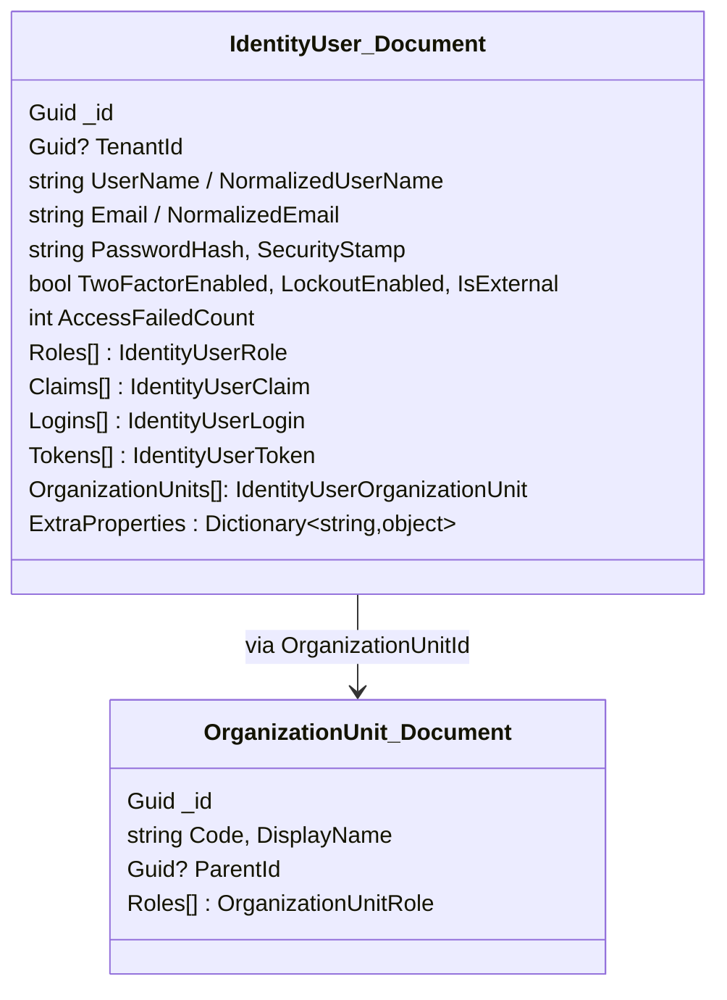
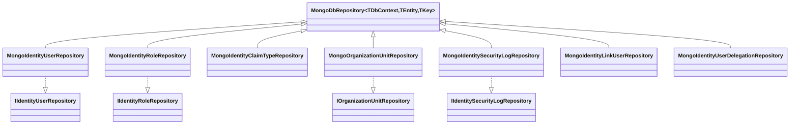

The `Volo.Abp.Identity.MongoDB` package is the document-oriented persistence
provider for the Identity module. It mirrors the EF Core integration: an
`IAbpIdentityMongoDbContext` interface exposes one `IMongoCollection<T>` per
aggregate, an `AbpIdentityMongoDbContext` provides the default
implementation, a `ConfigureIdentity()` model builder extension sets
collection names, and one `MongoXxxRepository` per aggregate implements the
domain repository contracts. This page lists every file in the package and
maps it to the domain interfaces it satisfies.

## Package layout

```
modules/identity/src/Volo.Abp.Identity.MongoDB/
└── Volo/Abp/Identity/MongoDB/
    ├── AbpIdentityMongoDbModule.cs
    ├── IAbpIdentityMongoDbContext.cs
    ├── AbpIdentityMongoDbContext.cs
    ├── AbpIdentityMongoDbContextExtensions.cs   (ConfigureIdentity)
    ├── MongoIdentityUserRepository.cs
    ├── MongoIdentityRoleRepository.cs
    ├── MongoIdentityClaimTypeRepository.cs
    ├── MongoOrganizationUnitRepository.cs
    ├── MongoIdentitySecurityLogRepository.cs
    ├── MongoIdentityLinkUserRepository.cs
    └── MongoIdentityUserDelegationRepository.cs
```

## Module class

`AbpIdentityMongoDbModule` depends on the Identity domain module and on
`Volo.Abp.Users.MongoDB` so the shared user collection conventions are
applied first. It calls `AddMongoDbContext<AbpIdentityMongoDbContext>` and
registers one repository per aggregate:

```csharp title="modules/identity/src/Volo.Abp.Identity.MongoDB/Volo/Abp/Identity/MongoDB/AbpIdentityMongoDbModule.cs"
[DependsOn(
    typeof(AbpIdentityDomainModule),
    typeof(AbpUsersMongoDbModule)
)]
public class AbpIdentityMongoDbModule : AbpModule
{
    public override void ConfigureServices(ServiceConfigurationContext context)
    {
        context.Services.AddMongoDbContext<AbpIdentityMongoDbContext>(options =>
        {
            options.AddRepository<IdentityUser, MongoIdentityUserRepository>();
            options.AddRepository<IdentityRole, MongoIdentityRoleRepository>();
            options.AddRepository<IdentityClaimType, MongoIdentityClaimTypeRepository>();
            options.AddRepository<OrganizationUnit, MongoOrganizationUnitRepository>();
            options.AddRepository<IdentitySecurityLog, MongoIdentitySecurityLogRepository>();
            options.AddRepository<IdentityLinkUser, MongoIdentityLinkUserRepository>();
            options.AddRepository<IdentityUserDelegation, MongoIdentityUserDelegationRepository>();
        });
    }
}
```

`AddMongoDbContext` registers the context with both its concrete type and
its interface (`IAbpIdentityMongoDbContext`), and `AddRepository<TEntity,
TRepository>()` registers the implementation under the matching
`I<Entity>Repository` from the domain layer. Mongo repositories use
`MongoDbRepository<TDbContext, TEntity, TKey>` from the framework which
provides `GetMongoQueryableAsync()` and `GetCollectionAsync()` helpers
backed by an `IMongoDbContextProvider`.

## DbContext and interface

`IAbpIdentityMongoDbContext` declares one `IMongoCollection<T>` per Identity
aggregate. Notice that there is no separate `Roles`/`Logins`/`Claims`
collection for the per-user navigation collections — those are stored as
embedded BSON arrays on the `IdentityUser` document itself:

```csharp title="modules/identity/src/Volo.Abp.Identity.MongoDB/Volo/Abp/Identity/MongoDB/IAbpIdentityMongoDbContext.cs"
[ConnectionStringName(AbpIdentityDbProperties.ConnectionStringName)]
public interface IAbpIdentityMongoDbContext : IAbpMongoDbContext
{
    IMongoCollection<IdentityUser> Users { get; }
    IMongoCollection<IdentityRole> Roles { get; }
    IMongoCollection<IdentityClaimType> ClaimTypes { get; }
    IMongoCollection<OrganizationUnit> OrganizationUnits { get; }
    IMongoCollection<IdentitySecurityLog> SecurityLogs { get; }
    IMongoCollection<IdentityLinkUser> LinkUsers { get; }
    IMongoCollection<IdentityUserDelegation> UserDelegations { get; }
}
```

`AbpIdentityMongoDbContext` provides the default implementation. Each
collection accessor delegates to `Collection<T>()`, and `CreateModel`
configures the collection names through `ConfigureIdentity()`:

```csharp title="modules/identity/src/Volo.Abp.Identity.MongoDB/Volo/Abp/Identity/MongoDB/AbpIdentityMongoDbContext.cs"
[ConnectionStringName(AbpIdentityDbProperties.ConnectionStringName)]
public class AbpIdentityMongoDbContext : AbpMongoDbContext, IAbpIdentityMongoDbContext
{
    public IMongoCollection<IdentityUser> Users => Collection<IdentityUser>();
    public IMongoCollection<IdentityRole> Roles => Collection<IdentityRole>();
    public IMongoCollection<IdentityClaimType> ClaimTypes => Collection<IdentityClaimType>();
    public IMongoCollection<OrganizationUnit> OrganizationUnits => Collection<OrganizationUnit>();
    public IMongoCollection<IdentitySecurityLog> SecurityLogs => Collection<IdentitySecurityLog>();
    public IMongoCollection<IdentityLinkUser> LinkUsers => Collection<IdentityLinkUser>();
    public IMongoCollection<IdentityUserDelegation> UserDelegations => Collection<IdentityUserDelegation>();

    protected override void CreateModel(IMongoModelBuilder modelBuilder)
    {
        base.CreateModel(modelBuilder);
        modelBuilder.ConfigureIdentity();
    }
}
```

## ConfigureIdentity collection mapping

The model builder extension only sets collection names — the embedded
document layout is intrinsic to the entity classes:

```csharp title="modules/identity/src/Volo.Abp.Identity.MongoDB/Volo/Abp/Identity/MongoDB/AbpIdentityMongoDbContextExtensions.cs"
public static void ConfigureIdentity(this IMongoModelBuilder builder)
{
    Check.NotNull(builder, nameof(builder));

    builder.Entity<IdentityUser>(b =>
        b.CollectionName = AbpIdentityDbProperties.DbTablePrefix + "Users");
    builder.Entity<IdentityRole>(b =>
        b.CollectionName = AbpIdentityDbProperties.DbTablePrefix + "Roles");
    builder.Entity<IdentityClaimType>(b =>
        b.CollectionName = AbpIdentityDbProperties.DbTablePrefix + "ClaimTypes");
    builder.Entity<OrganizationUnit>(b =>
        b.CollectionName = AbpIdentityDbProperties.DbTablePrefix + "OrganizationUnits");
    builder.Entity<IdentitySecurityLog>(b =>
        b.CollectionName = AbpIdentityDbProperties.DbTablePrefix + "SecurityLogs");
    builder.Entity<IdentityLinkUser>(b =>
        b.CollectionName = AbpIdentityDbProperties.DbTablePrefix + "LinkUsers");
    builder.Entity<IdentityUserDelegation>(b =>
        b.CollectionName = AbpIdentityDbProperties.DbTablePrefix + "UserDelegations");
}
```

The `AbpIdentityDbProperties.DbTablePrefix` defaults to `Abp` — the same
constant used by the EF Core provider — so the seven collections become
`AbpUsers`, `AbpRoles`, `AbpClaimTypes`, `AbpOrganizationUnits`,
`AbpSecurityLogs`, `AbpLinkUsers`, and `AbpUserDelegations` by default.

## Document shape

Because Mongo allows embedded arrays, the user document holds every
membership and credential directly:



Joins that would be SQL `JOIN`s on the EF Core side become
`Where(x => array.Contains(x.Id))` against the dependent collection in Mongo.
That is exactly the pattern the Mongo repositories use.

## Repositories



### MongoIdentityUserRepository

The user repository implements every method on `IIdentityUserRepository`:

| Method | Notes |
| --- | --- |
| `FindByNormalizedUserNameAsync` / `FindByNormalizedEmailAsync` | Direct collection lookups with `IncludeDetails` ignored — every detail is embedded |
| `FindByLoginAsync(loginProvider, providerKey, …)` | Matches against the embedded `Logins[]` array |
| `FindByTenantIdAndUserNameAsync` | Tenant-scoped lookup used by the cross-tenant link flow |
| `GetRoleNamesAsync(Guid)` | Resolves direct + OU-derived roles by loading the user, fetching OUs by id, then `IdentityRole` documents in one round trip |
| `GetRoleNamesAsync(IEnumerable<Guid>)` | Batched variant returning `IdentityUserIdWithRoleNames` |
| `GetRoleNamesInOrganizationUnitAsync(Guid)` | Only the OU-derived roles |
| `GetListByClaimAsync(Claim)` | Match `Claims[]` |
| `GetListByNormalizedRoleNameAsync(string)` | Match `Roles[]` |
| `GetUserIdListByRoleIdAsync(Guid)` | Projects user `_id`s |
| `GetListAsync(sorting, max, skip, filter, …)` | Paged list with `Filter` matching `UserName`, `Email`, `Name`, `Surname`, `PhoneNumber` |
| `GetCountAsync(filter, …)` | Count |
| `GetRolesAsync(Guid)` / `GetOrganizationUnitsAsync(Guid)` | Related entity fetch |
| `GetUsersInOrganizationUnitAsync(Guid)` | Users whose embedded `OrganizationUnits[]` contains the id |
| `GetUsersInOrganizationUnitWithChildrenAsync(string code)` | Resolve OU subtree by code prefix, then match users |
| `GetUsersInOrganizationsListAsync(IEnumerable<Guid>)` | Bulk OU membership filter |
| `GetListByIdsAsync(IEnumerable<Guid>, includeDetails, …)` | Batched fetch |
| `UpdateRoleAsync(sourceRoleId, targetRoleId, …)` | Rewrites every embedded `Roles[]` entry that referenced the source role |
| `UpdateOrganizationAsync(sourceOrgId, targetOrgId, …)` | Same idea for OU membership |

The OU-aware role lookup illustrates the load-then-filter style:

```csharp title="modules/identity/src/Volo.Abp.Identity.MongoDB/Volo/Abp/Identity/MongoDB/MongoIdentityUserRepository.cs"
public virtual async Task<List<string>> GetRoleNamesAsync(
    Guid id, CancellationToken cancellationToken = default)
{
    cancellationToken = GetCancellationToken(cancellationToken);
    var user = await GetAsync(id, cancellationToken: cancellationToken);
    var organizationUnitIds = user.OrganizationUnits
        .Select(r => r.OrganizationUnitId).ToArray();

    var organizationUnits = await (await GetMongoQueryableAsync<OrganizationUnit>(cancellationToken))
        .Where(ou => organizationUnitIds.Contains(ou.Id))
        .ToListAsync(cancellationToken);

    var orgUnitRoleIds = organizationUnits.SelectMany(x => x.Roles.Select(r => r.RoleId)).ToArray();
    var roleIds = user.Roles.Select(r => r.RoleId).ToArray();
    var allRoleIds = orgUnitRoleIds.Union(roleIds);

    return await (await GetMongoQueryableAsync<IdentityRole>(cancellationToken))
        .Where(r => allRoleIds.Contains(r.Id))
        .Select(r => r.Name)
        .ToListAsync(cancellationToken);
}
```

### MongoIdentityRoleRepository

Implements `IIdentityRoleRepository`:

| Method | Notes |
| --- | --- |
| `FindByNormalizedNameAsync(string)` | Standard lookup |
| `GetListAsync(sorting, max, skip, filter, …)` | Paged list with name filter |
| `GetListWithUserCountAsync(sorting, max, skip, filter, …)` | Aggregation that counts users referencing each role |
| `GetDefaultOnesAsync(…)` | `IsDefault == true` |
| `GetCountAsync(filter)` | Count |

### MongoIdentitySecurityLogRepository

Implements `IIdentitySecurityLogRepository`. The Mongo variant offers the
same filtered list and count signatures as the EF Core variant — `startTime`,
`endTime`, `applicationName`, `identity`, `action`, `userId`, `userName`,
`clientIpAddress`, `correlationId`, plus paging — and a
`GetByUserIdAsync(Guid id, Guid userId, …)` for single-row reads.

### MongoOrganizationUnitRepository

Implements `IOrganizationUnitRepository` with the same surface area as the
EF Core variant (children, members, role membership, unadded users/roles,
`RemoveAllMembersAsync`). Because user-OU membership is embedded on the
`IdentityUser` document, member queries enumerate users by
`OrganizationUnits[].OrganizationUnitId`.

### MongoIdentityClaimTypeRepository / MongoIdentityLinkUserRepository / MongoIdentityUserDelegationRepository

The remaining repositories implement smaller contracts:

- `MongoIdentityClaimTypeRepository.FindByNameAsync(string, CancellationToken)`
  and `IsNameInUseAsync(Guid?, string, CancellationToken)`.
- `MongoIdentityLinkUserRepository.FindAsync(IdentityLinkUserInfo source,
  IdentityLinkUserInfo target, …)` and
  `GetListAsync(IdentityLinkUserInfo userInfo, bool includeIndirect, …)`.
- `MongoIdentityUserDelegationRepository.FindActiveDelegationsAsync(…)`,
  `GetListAsync(Guid sourceUserId, …)`, etc., used by the impersonation
  workflow.

## Indexing recommendations

The Mongo provider does not declare schema-level indexes the way the EF
Core configuration does — collections are schemaless. The
[ABP MongoDB integration](/data) creates the default `_id` index, but
production deployments typically add the following hand-rolled indexes
(commonly seeded via `MongoInitializerService`s in the application start-up):

| Collection | Index | Why |
| --- | --- | --- |
| `AbpUsers` | `{ TenantId: 1, NormalizedUserName: 1 }` | login lookup |
| `AbpUsers` | `{ TenantId: 1, NormalizedEmail: 1 }` | email login |
| `AbpUsers` | `{ "Roles.RoleId": 1 }` | role membership scan |
| `AbpUsers` | `{ "OrganizationUnits.OrganizationUnitId": 1 }` | OU member scan |
| `AbpRoles` | `{ TenantId: 1, NormalizedName: 1 }` | role lookup |
| `AbpOrganizationUnits` | `{ TenantId: 1, Code: 1 }` | subtree prefix queries |
| `AbpSecurityLogs` | `{ TenantId: 1, CreationTime: -1 }` | log time-range listing |
| `AbpSecurityLogs` | `{ TenantId: 1, UserId: 1, CreationTime: -1 }` | per-user log panel |

These mirror the indexes the EF Core `ConfigureIdentity()` method declares
on the relational side.

## Cross-context composition

As with the EF Core provider, host applications typically merge the Identity
collections into their own context:

```csharp title="MyAppMongoDbContext.cs (host pattern)"
[ReplaceDbContext(typeof(IAbpIdentityMongoDbContext))]
[ConnectionStringName("Default")]
public class MyAppMongoDbContext : AbpMongoDbContext, IAbpIdentityMongoDbContext
{
    public IMongoCollection<IdentityUser> Users => Collection<IdentityUser>();
    public IMongoCollection<IdentityRole> Roles => Collection<IdentityRole>();
    // ... other collections from IAbpIdentityMongoDbContext

    protected override void CreateModel(IMongoModelBuilder modelBuilder)
    {
        base.CreateModel(modelBuilder);
        modelBuilder.ConfigureIdentity();
    }
}
```

`ReplaceDbContextAttribute` instructs the Mongo integration to resolve
`IAbpIdentityMongoDbContext` to `MyAppMongoDbContext` so every Mongo
repository keeps working through its generic `TDbContext` constraint.

## Related pages

<CardGroup cols={2}>
  <Card title="Identity module overview" href="/modules/identity/overview" icon="circle-info">
    Aggregates and how the persistence providers slot in.
  </Card>
  <Card title="EF Core provider" href="/modules/identity/entity-framework-core" icon="database">
    The relational counterpart to this page.
  </Card>
  <Card title="ABP data layer" href="/data" icon="layer-group">
    `AbpMongoDbContext`, `MongoDbRepository`, and unit-of-work integration.
  </Card>
  <Card title="Data seeding & installer" href="/modules/identity/data-seeding-and-installer" icon="seedling">
    Bootstrapping admin user/role into the Mongo collections.
  </Card>
</CardGroup>
