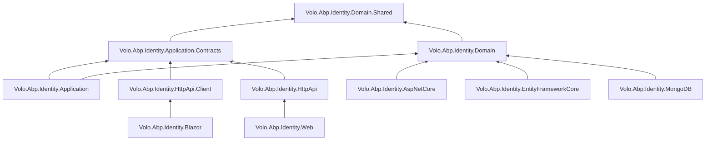
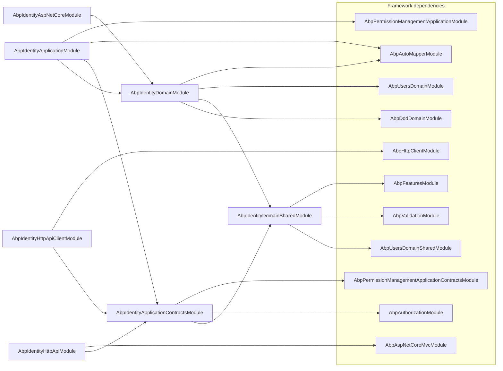

The ABP Identity module is the canonical implementation of user, role, organization unit, and security‑log management on top of ASP.NET Core Identity. It ships as a stack of layered NuGet packages — `Volo.Abp.Identity.Domain.Shared`, `Volo.Abp.Identity.Domain`, `Volo.Abp.Identity.Application.Contracts`, `Volo.Abp.Identity.Application`, `Volo.Abp.Identity.HttpApi`, `Volo.Abp.Identity.HttpApi.Client`, `Volo.Abp.Identity.AspNetCore`, plus pluggable persistence (EF Core, MongoDB) and UI surfaces (Blazor, Blazor.Server, Blazor.WebAssembly, Web). This overview maps the source tree under `modules/identity/src/`, lists every package, draws the `[DependsOn]` graph, and points you at the deeper pages for each layer.

<Info>
Source root: [`modules/identity/src/`](https://github.com/abpframework/abp/tree/dev/modules/identity/src). This page references file paths relative to that root.
</Info>

## Why a dedicated Identity module?

ABP's general framework gives you `IUser`, `ICurrentUser`, claims and authorization primitives, but it leaves the *aggregate* — the persisted user, the role model, the lookup providers, the data seeder, and the wiring into ASP.NET Core Identity — to a module. The Identity module fills that gap with:

- A persisted `IdentityUser` / `IdentityRole` aggregate model that extends Microsoft's `IdentityUser` / `IdentityRole` shape with multi‑tenancy, organization units, dynamic claims, link‑user (impersonation) records, user delegations, and security logs.
- `IdentityUserManager` / `IdentityRoleManager` — `UserManager<>` / `RoleManager<>` subclasses registered as ABP domain services.
- An application layer (`IdentityUserAppService`, `IdentityRoleAppService`, `IdentityUserIntegrationService`) backed by permission definitions in [`/modules/permission-management`](/modules/permission-management/overview).
- HTTP controllers and matching typed client proxies so the module works inside a monolith *or* across a service boundary.
- An ASP.NET Core integration package that registers `AbpSignInManager`, `AbpSecurityStampValidator`, `LinkUserTokenProvider`, and `AbpIdentityUserValidator` on the `IdentityBuilder`.

For the auth flows that consume this module (login, register, two‑factor, external login UI), see [`/modules/account`](/modules/account/overview).

## Package matrix

The module is split along ABP's standard layering. Each row below maps to a project directory under `modules/identity/src/`.

| Package | Project folder | Layer | Primary purpose |
| --- | --- | --- | --- |
| `Volo.Abp.Identity.Domain.Shared` | `Volo.Abp.Identity.Domain.Shared/` | Domain.Shared | Constants, enums, error codes, ETO contracts, localization resources |
| `Volo.Abp.Identity.Domain` | `Volo.Abp.Identity.Domain/` | Domain | Aggregates, repositories, managers, settings, external login providers |
| `Volo.Abp.Identity.Application.Contracts` | `Volo.Abp.Identity.Application.Contracts/` | App.Contracts | App service interfaces, DTOs, permission definitions |
| `Volo.Abp.Identity.Application` | `Volo.Abp.Identity.Application/` | Application | App service implementations, AutoMapper profile |
| `Volo.Abp.Identity.HttpApi` | `Volo.Abp.Identity.HttpApi/` | HTTP API | MVC controllers exposing the app services |
| `Volo.Abp.Identity.HttpApi.Client` | `Volo.Abp.Identity.HttpApi.Client/` | HTTP API Client | Generated typed client proxies |
| `Volo.Abp.Identity.AspNetCore` | `Volo.Abp.Identity.AspNetCore/` | ASP.NET Core | `AbpSignInManager`, `AbpSecurityStampValidator`, cookie wiring |
| `Volo.Abp.Identity.EntityFrameworkCore` | `Volo.Abp.Identity.EntityFrameworkCore/` | Persistence | EF Core `DbContext` & repository implementations |
| `Volo.Abp.Identity.MongoDB` | `Volo.Abp.Identity.MongoDB/` | Persistence | MongoDB repository implementations |
| `Volo.Abp.Identity.Web` | `Volo.Abp.Identity.Web/` | UI (MVC) | Razor Pages for user/role/OU management |
| `Volo.Abp.Identity.Blazor` | `Volo.Abp.Identity.Blazor/` | UI (Blazor) | Shared Blazor components |
| `Volo.Abp.Identity.Blazor.Server` | `Volo.Abp.Identity.Blazor.Server/` | UI (Blazor Server) | Server‑hosted Blazor menu/contributors |
| `Volo.Abp.Identity.Blazor.WebAssembly` | `Volo.Abp.Identity.Blazor.WebAssembly/` | UI (Blazor WASM) | WebAssembly host bindings |
| `Volo.Abp.Identity.Installer` | `Volo.Abp.Identity.Installer/` | Tooling | NuGet meta‑package used by the ABP CLI installer |
| `Volo.Abp.PermissionManagement.Domain.Identity` | `Volo.Abp.PermissionManagement.Domain.Identity/` | Integration | Bridges Identity users/roles to the permission management domain |

<Note>
Most ABP solutions consume *only* `Application.Contracts` from non‑Identity modules and pick exactly one of `EntityFrameworkCore` / `MongoDB`. See [`/data/overview`](/data/overview) for the broader data‑access story.
</Note>

## Layered composition

The diagram below shows how the runtime layers stack at module load time. Each box is a NuGet package; arrows point from a depending module to the module it `[DependsOn]`.



A typical monolithic host references `Application`, `HttpApi`, `AspNetCore`, and either `EntityFrameworkCore` or `MongoDB`. A microservice host that consumes Identity over HTTP references only `HttpApi.Client` plus `Domain.Shared`.

## `[DependsOn]` graph

Each module class advertises its dependencies with `[DependsOn(typeof(...))]`. The arrows below trace those attributes directly from source.



The complete declarations live in the module files; for example, `AbpIdentityDomainModule`:

```csharp modules/identity/src/Volo.Abp.Identity.Domain/Volo/Abp/Identity/AbpIdentityDomainModule.cs
[DependsOn(
    typeof(AbpDddDomainModule),
    typeof(AbpIdentityDomainSharedModule),
    typeof(AbpUsersDomainModule),
    typeof(AbpAutoMapperModule)
    )]
public class AbpIdentityDomainModule : AbpModule
{
    // ...
}
```

And the application module:

```csharp modules/identity/src/Volo.Abp.Identity.Application/Volo/Abp/Identity/AbpIdentityApplicationModule.cs
[DependsOn(
    typeof(AbpIdentityDomainModule),
    typeof(AbpIdentityApplicationContractsModule),
    typeof(AbpAutoMapperModule),
    typeof(AbpPermissionManagementApplicationModule)
    )]
public class AbpIdentityApplicationModule : AbpModule
```

See [`/modularity/depends-on-and-plug-ins`](/modularity/depends-on-and-plug-ins) for how ABP resolves this graph at startup.

## Layer responsibilities at a glance

<CardGroup cols={2}>
  <Card title="Domain.Shared" icon="cube">
    Names, error codes, settings keys (`IdentitySettingNames`), permission group name, ETOs (`IdentityRoleEto`, `OrganizationUnitEto`), and the `IdentityResource` localization root.
  </Card>
  <Card title="Domain" icon="layer-group" href="/modules/identity/domain">
    Aggregates (`IdentityUser`, `IdentityRole`, `OrganizationUnit`, `IdentitySecurityLog`, `IdentityClaimType`, `IdentityLinkUser`, `IdentityUserDelegation`), repositories, `IdentityUserManager`, `IdentityRoleManager`, `IdentityDataSeeder`, external login providers.
  </Card>
  <Card title="Application" icon="gears" href="/modules/identity/application">
    `IdentityUserAppService`, `IdentityRoleAppService`, `IdentityUserLookupAppService`, `IdentityUserIntegrationService`, AutoMapper profile.
  </Card>
  <Card title="HTTP API & Client" icon="globe" href="/modules/identity/http-api">
    MVC controllers under `api/identity/...` and generated typed `ClientProxy` classes that satisfy the same app‑service interfaces remotely.
  </Card>
  <Card title="ASP.NET Core integration" icon="shield-halved" href="/modules/identity/aspnet-core-integration">
    `AbpSignInManager`, `AbpSecurityStampValidator`, `LinkUserTokenProvider`, cookie configuration on the `IdentityBuilder`.
  </Card>
  <Card title="Persistence & UI" icon="database">
    EF Core / Mongo repositories; Blazor & Web management pages. Wire through `AddAbpDbContext<>()` (EF Core) and `AddMongoDbContext<>()` (Mongo) — see [`/data/overview`](/data/overview).
  </Card>
</CardGroup>

## Module file inventory (top‑level types)

The table below catalogs the top‑level types that other ABP modules depend on. For full method signatures, follow the layer page links.

### `Volo.Abp.Identity.Domain.Shared`

| Type | Kind | File |
| --- | --- | --- |
| `AbpIdentityDomainSharedModule` | `AbpModule` | `Volo/Abp/Identity/AbpIdentityDomainSharedModule.cs` |
| `IdentityErrorCodes` | static class | `Volo/Abp/Identity/IdentityErrorCodes.cs` |
| `IdentitySecurityLogActionConsts` | static class | `Volo/Abp/Identity/IdentitySecurityLogActionConsts.cs` |
| `IdentitySettingNames` | static class | `Volo/Abp/Identity/Settings/IdentitySettingNames.cs` |
| `IdentityRoleEto` / `IdentityClaimTypeEto` / `OrganizationUnitEto` | distributed ETO records | `Volo/Abp/Identity/*Eto.cs` |
| `IdentityResource` | localization resource | `Volo/Abp/Identity/Localization/IdentityResource.cs` |
| `IUserRoleFinder` | abstraction | `Volo/Abp/Identity/IUserRoleFinder.cs` |

### `Volo.Abp.Identity.Domain` (selected)

| Type | Kind | Purpose |
| --- | --- | --- |
| `IdentityUser` | `FullAuditedAggregateRoot<Guid>` | Persisted user aggregate |
| `IdentityRole` | `AggregateRoot<Guid>` | Role aggregate |
| `IdentityClaimType` | `AggregateRoot<Guid>` | Tenant‑scoped custom claim definition |
| `IdentitySecurityLog` | `AggregateRoot<Guid>` | Audit row for sign‑in / 2FA events |
| `IdentityLinkUser` | `BasicAggregateRoot<Guid>` | Link‑user (impersonation) record |
| `IdentityUserDelegation` | `BasicAggregateRoot<Guid>` | Time‑boxed user delegation |
| `OrganizationUnit` | `FullAuditedAggregateRoot<Guid>` | OU node in the tree |
| `IdentityUserManager` | `UserManager<IdentityUser>` | Domain service |
| `IdentityRoleManager` | `RoleManager<IdentityRole>` | Domain service |
| `OrganizationUnitManager` | domain service | OU tree manipulation |
| `IdentityDataSeeder` | seeder | Seeds the `admin` user and roles |
| `AbpUserClaimsPrincipalFactory` | factory | Adds ABP claims to the principal |

### `Volo.Abp.Identity.Application.Contracts`

| Type | Kind | File |
| --- | --- | --- |
| `IIdentityUserAppService` | interface | `Volo/Abp/Identity/IIdentityUserAppService.cs` |
| `IIdentityRoleAppService` | interface | `Volo/Abp/Identity/IIdentityRoleAppService.cs` |
| `IIdentityUserLookupAppService` | interface (obsolete) | `Volo/Abp/Identity/IIdentityUserLookupAppService.cs` |
| `IIdentityUserIntegrationService` | `[IntegrationService]` | `Volo/Abp/Identity/Integration/IIdentityUserIntegrationService.cs` |
| `IdentityPermissions` | static class | `Volo/Abp/Identity/IdentityPermissions.cs` |
| `IdentityPermissionDefinitionProvider` | provider | `Volo/Abp/Identity/IdentityPermissionDefinitionProvider.cs` |
| `IdentityUserDto`, `IdentityRoleDto`, etc. | DTOs | `Volo/Abp/Identity/Identity*Dto.cs` |

### `Volo.Abp.Identity.HttpApi` controllers

| Controller | Route | Implements |
| --- | --- | --- |
| `IdentityUserController` | `api/identity/users` | `IIdentityUserAppService` |
| `IdentityRoleController` | `api/identity/roles` | `IIdentityRoleAppService` |
| `IdentityUserLookupController` | `api/identity/users/lookup` | `IIdentityUserLookupAppService` |
| `IdentityUserIntegrationController` | `integration-api/identity/users` | `IIdentityUserIntegrationService` |

### `Volo.Abp.Identity.AspNetCore`

| Type | Purpose |
| --- | --- |
| `AbpIdentityAspNetCoreModule` | Wires `AbpSignInManager`, validator, cookie auth |
| `AbpIdentityAspNetCoreOptions` | `ConfigureAuthentication` toggle |
| `AbpSignInManager` | `SignInManager<IdentityUser>` with external‑login hooks |
| `AbpSecurityStampValidator` | Tenant‑aware security stamp refresh |
| `LinkUserTokenProvider` | Token provider for link‑user flow |
| `SignInResultExtensions` | Maps `SignInResult` → `IdentitySecurityLogActionConsts` |

## Remote service name and module constants

The Identity HTTP API publishes itself under a single remote service name so that `AddStaticHttpClientProxies` and OpenAPI generation can target it:

```csharp modules/identity/src/Volo.Abp.Identity.Application.Contracts/Volo/Abp/Identity/IdentityRemoteServiceConsts.cs
public static class IdentityRemoteServiceConsts
{
    public const string RemoteServiceName = "AbpIdentity";
    public const string ModuleName = "identity";
}
```

The `HttpApi.Client` module uses this constant when registering generated proxies:

```csharp modules/identity/src/Volo.Abp.Identity.HttpApi.Client/Volo/Abp/Identity/AbpIdentityHttpApiClientModule.cs
context.Services.AddStaticHttpClientProxies(
    typeof(AbpIdentityApplicationContractsModule).Assembly,
    IdentityRemoteServiceConsts.RemoteServiceName
);
```

## Permission group

All Identity permissions live under one group name, defined in:

```csharp modules/identity/src/Volo.Abp.Identity.Application.Contracts/Volo/Abp/Identity/IdentityPermissions.cs
public static class IdentityPermissions
{
    public const string GroupName = "AbpIdentity";

    public static class Roles
    {
        public const string Default            = GroupName + ".Roles";
        public const string Create             = Default + ".Create";
        public const string Update             = Default + ".Update";
        public const string Delete             = Default + ".Delete";
        public const string ManagePermissions  = Default + ".ManagePermissions";
    }

    public static class Users
    {
        public const string Default            = GroupName + ".Users";
        public const string Create             = Default + ".Create";
        public const string Update             = Default + ".Update";
        public const string Delete             = Default + ".Delete";
        public const string ManagePermissions  = Default + ".ManagePermissions";
    }

    public static class UserLookup
    {
        public const string Default = GroupName + ".UserLookup";
    }
}
```

These names are what `[Authorize("AbpIdentity.Users.Create")]` attributes on the app services match. See [`/authz/overview`](/authz/overview) for how the authorization pipeline resolves them, and [`/modules/permission-management/overview`](/modules/permission-management/overview) for how the values are persisted per tenant/role/user.

## Setting definitions

`AbpIdentitySettingDefinitionProvider` (Domain) registers password, lockout, sign‑in, two‑factor, and organization‑unit settings against `IdentityResource` localization keys. Two snippets:

```csharp modules/identity/src/Volo.Abp.Identity.Domain/Volo/Abp/Identity/AbpIdentitySettingDefinitionProvider.cs
context.Add(
    new SettingDefinition(
        IdentitySettingNames.Password.RequiredLength,
        6.ToString(),
        L("DisplayName:Abp.Identity.Password.RequiredLength"),
        L("Description:Abp.Identity.Password.RequiredLength"),
        true),
    // ...
);
```

Setting values flow into `IdentityOptions` at runtime via `AbpIdentityOptionsManager`, an `IOptionsMonitor` adapter registered by:

```csharp modules/identity/src/Volo.Abp.Identity.Domain/Volo/Abp/Identity/AbpIdentityDomainModule.cs
context.Services.AddAbpDynamicOptions<IdentityOptions, AbpIdentityOptionsManager>();
```

## Distributed event topology

The domain module registers ETO mappings so other modules can subscribe to user/role/OU changes over the distributed event bus:

```csharp modules/identity/src/Volo.Abp.Identity.Domain/Volo/Abp/Identity/AbpIdentityDomainModule.cs
Configure<AbpDistributedEntityEventOptions>(options =>
{
    options.EtoMappings.Add<IdentityUser, UserEto>(typeof(AbpIdentityDomainModule));
    options.EtoMappings.Add<IdentityClaimType, IdentityClaimTypeEto>(typeof(AbpIdentityDomainModule));
    options.EtoMappings.Add<IdentityRole, IdentityRoleEto>(typeof(AbpIdentityDomainModule));
    options.EtoMappings.Add<OrganizationUnit, OrganizationUnitEto>(typeof(AbpIdentityDomainModule));

    options.AutoEventSelectors.Add<IdentityUser>();
    options.AutoEventSelectors.Add<IdentityRole>();
});
```

## What's next?

<CardGroup cols={2}>
  <Card title="Domain layer" icon="cube" href="/modules/identity/domain">
    Walk through aggregates, repositories, managers, the data seeder, and external‑login provider extension points.
  </Card>
  <Card title="Application layer" icon="gears" href="/modules/identity/application">
    Inspect `IdentityUserAppService`, the integration service, permission attributes, and the AutoMapper profile.
  </Card>
  <Card title="HTTP API & client proxies" icon="globe" href="/modules/identity/http-api">
    Controller routes plus the generated `IdentityUserClientProxy` / `IdentityRoleClientProxy`.
  </Card>
  <Card title="ASP.NET Core integration" icon="shield-halved" href="/modules/identity/aspnet-core-integration">
    `AbpSignInManager`, security stamp validation, cookie auth wiring.
  </Card>
  <Card title="Account module" icon="user" href="/modules/account/overview">
    The login / register / 2FA UI that drives Identity.
  </Card>
  <Card title="Permission Management" icon="key" href="/modules/permission-management/overview">
    How the `IdentityPermissions` are persisted and evaluated.
  </Card>
</CardGroup>
