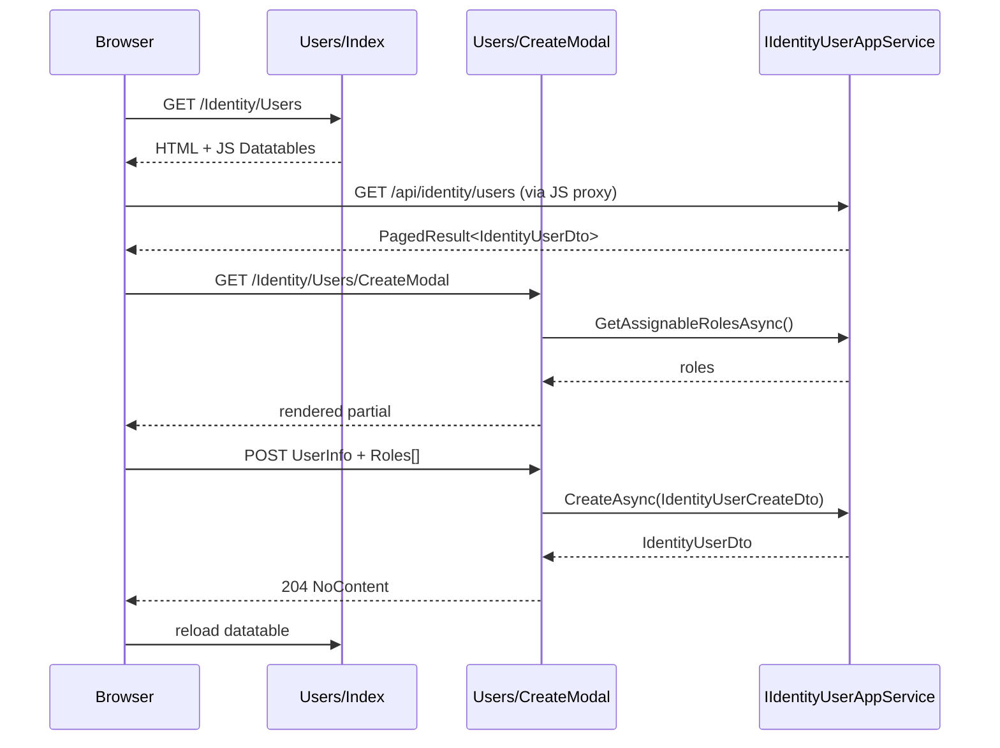

The `Volo.Abp.Identity.Web` package is the MVC / Razor Pages variant of the
Identity administration UI. It registers two Razor page areas —
`/Identity/Users` and `/Identity/Roles` — each with an Index page and a
pair of Create / Edit modal pages backed by `IIdentityUserAppService` and
`IIdentityRoleAppService`. It also contributes the *Identity Management*
menu group to the administration menu, configures the page toolbars to
add *New User* and *New Role* buttons, and ships an AutoMapper profile that
wires DTOs to the view models the modals bind to.

## Package layout

```
modules/identity/src/Volo.Abp.Identity.Web/
├── AbpIdentityWebModule.cs
├── AbpIdentityWebAutoMapperProfile.cs
├── Navigation/
│   ├── AbpIdentityWebMainMenuContributor.cs
│   └── IdentityMenuNames.cs
└── Pages/Identity/
    ├── IdentityPageModel.cs
    ├── _ViewImports.cshtml
    ├── Roles/
    │   ├── Index.cshtml          (+ .cs)
    │   ├── CreateModal.cshtml    (+ .cs)
    │   └── EditModal.cshtml      (+ .cs)
    └── Users/
        ├── Index.cshtml          (+ .cs)
        ├── CreateModal.cshtml    (+ .cs)
        └── EditModal.cshtml      (+ .cs)
```

## Module class

`AbpIdentityWebModule` is built up across `PreConfigureServices`,
`ConfigureServices`, and `PostConfigureServices`. It depends on the
application contracts module (for the DTO and app-service types), the
AutoMapper module, the
`AbpPermissionManagementWebModule` (because the Permissions modal lives in
that package), and the shared MVC UI theme module.

```csharp title="modules/identity/src/Volo.Abp.Identity.Web/AbpIdentityWebModule.cs"
[DependsOn(typeof(AbpIdentityApplicationContractsModule))]
[DependsOn(typeof(AbpAutoMapperModule))]
[DependsOn(typeof(AbpPermissionManagementWebModule))]
[DependsOn(typeof(AbpAspNetCoreMvcUiThemeSharedModule))]
public class AbpIdentityWebModule : AbpModule
```

### PreConfigureServices

```csharp title="modules/identity/src/Volo.Abp.Identity.Web/AbpIdentityWebModule.cs"
public override void PreConfigureServices(ServiceConfigurationContext context)
{
    context.Services.PreConfigure<AbpMvcDataAnnotationsLocalizationOptions>(options =>
    {
        options.AddAssemblyResource(typeof(IdentityResource), typeof(AbpIdentityWebModule).Assembly);
    });

    PreConfigure<IMvcBuilder>(mvcBuilder =>
    {
        mvcBuilder.AddApplicationPartIfNotExists(typeof(AbpIdentityWebModule).Assembly);
    });
}
```

- `AddAssemblyResource` tells MVC's DataAnnotations localizer to look up
  validation messages for view-model attributes in `IdentityResource`.
- `AddApplicationPartIfNotExists` makes ASP.NET Core discover the
  embedded Razor pages in this assembly.

### ConfigureServices

`ConfigureServices` plugs in the menu contributor, registers the embedded
file set (so the `.cshtml` files in the assembly are served), registers the
AutoMapper profile, authorises every page against the relevant Identity
permission, adds the *New User* / *New Role* toolbar buttons, and disables
the JS proxy generator for the Identity remote service (because the Razor
pages bind through `IIdentityXxxAppService` directly):

```csharp title="modules/identity/src/Volo.Abp.Identity.Web/AbpIdentityWebModule.cs"
public override void ConfigureServices(ServiceConfigurationContext context)
{
    Configure<AbpNavigationOptions>(options =>
    {
        options.MenuContributors.Add(new AbpIdentityWebMainMenuContributor());
    });

    Configure<AbpVirtualFileSystemOptions>(options =>
    {
        options.FileSets.AddEmbedded<AbpIdentityWebModule>();
    });

    context.Services.AddAutoMapperObjectMapper<AbpIdentityWebModule>();

    Configure<AbpAutoMapperOptions>(options =>
    {
        options.AddProfile<AbpIdentityWebAutoMapperProfile>(validate: true);
    });

    Configure<RazorPagesOptions>(options =>
    {
        options.Conventions.AuthorizePage("/Identity/Users/Index",       IdentityPermissions.Users.Default);
        options.Conventions.AuthorizePage("/Identity/Users/CreateModal", IdentityPermissions.Users.Create);
        options.Conventions.AuthorizePage("/Identity/Users/EditModal",   IdentityPermissions.Users.Update);
        options.Conventions.AuthorizePage("/Identity/Roles/Index",       IdentityPermissions.Roles.Default);
        options.Conventions.AuthorizePage("/Identity/Roles/CreateModal", IdentityPermissions.Roles.Create);
        options.Conventions.AuthorizePage("/Identity/Roles/EditModal",   IdentityPermissions.Roles.Update);
    });

    Configure<AbpPageToolbarOptions>(options =>
    {
        options.Configure<Volo.Abp.Identity.Web.Pages.Identity.Users.IndexModel>(toolbar =>
        {
            toolbar.AddButton(
                LocalizableString.Create<IdentityResource>("NewUser"),
                icon: "plus",
                name: "CreateUser",
                requiredPolicyName: IdentityPermissions.Users.Create);
        });

        options.Configure<Volo.Abp.Identity.Web.Pages.Identity.Roles.IndexModel>(toolbar =>
        {
            toolbar.AddButton(
                LocalizableString.Create<IdentityResource>("NewRole"),
                icon: "plus",
                name: "CreateRole",
                requiredPolicyName: IdentityPermissions.Roles.Create);
        });
    });

    Configure<DynamicJavaScriptProxyOptions>(options =>
    {
        options.DisableModule(IdentityRemoteServiceConsts.ModuleName);
    });
}
```

### PostConfigureServices

After all modules have configured, `PostConfigureServices` invokes the
`ModuleExtensionConfigurationHelper.ApplyEntityConfigurationToUi` for both
user and role entities. This binds the global object-extension definitions
(from the application contracts module) to the **specific view-model classes**
the create/edit modals use, so extra properties surface as form fields:

```csharp title="modules/identity/src/Volo.Abp.Identity.Web/AbpIdentityWebModule.cs"
ModuleExtensionConfigurationHelper.ApplyEntityConfigurationToUi(
    IdentityModuleExtensionConsts.ModuleName,
    IdentityModuleExtensionConsts.EntityNames.Role,
    createFormTypes: new[] { typeof(Pages.Identity.Roles.CreateModalModel.RoleInfoModel) },
    editFormTypes:   new[] { typeof(Pages.Identity.Roles.EditModalModel.RoleInfoModel) });

ModuleExtensionConfigurationHelper.ApplyEntityConfigurationToUi(
    IdentityModuleExtensionConsts.ModuleName,
    IdentityModuleExtensionConsts.EntityNames.User,
    createFormTypes: new[] { typeof(Pages.Identity.Users.CreateModalModel.UserInfoViewModel) },
    editFormTypes:   new[] { typeof(Pages.Identity.Users.EditModalModel.UserInfoViewModel) });
```

A `OneTimeRunner` guards this code so it executes exactly once even if the
module is loaded several times in a composition graph.

## Menu contributor

`Navigation/AbpIdentityWebMainMenuContributor` adds the same
*AbpIdentity* group under the administration menu used by the Blazor UI,
with permission-gated *Roles* and *Users* children:

```csharp title="modules/identity/src/Volo.Abp.Identity.Web/Navigation/AbpIdentityWebMainMenuContributor.cs"
public class AbpIdentityWebMainMenuContributor : IMenuContributor
{
    public virtual Task ConfigureMenuAsync(MenuConfigurationContext context)
    {
        if (context.Menu.Name != StandardMenus.Main)
            return Task.CompletedTask;

        var l = context.GetLocalizer<IdentityResource>();

        var identityMenuItem = new ApplicationMenuItem(
            IdentityMenuNames.GroupName,
            l["Menu:IdentityManagement"],
            icon: "fa fa-id-card-o");

        identityMenuItem.AddItem(new ApplicationMenuItem(
            IdentityMenuNames.Roles, l["Roles"],
            url: "~/Identity/Roles")
            .RequirePermissions(IdentityPermissions.Roles.Default));

        identityMenuItem.AddItem(new ApplicationMenuItem(
            IdentityMenuNames.Users, l["Users"],
            url: "~/Identity/Users")
            .RequirePermissions(IdentityPermissions.Users.Default));

        context.Menu.GetAdministration().AddItem(identityMenuItem);
        return Task.CompletedTask;
    }
}
```

The menu names are deliberately the same as the Blazor variant
(`AbpIdentity.Roles`, `AbpIdentity.Users`) so contributors don't need to
fork their code for different UI flavours.

## Razor pages

### Page base class

Every Identity page inherits `IdentityPageModel : AbpPageModel`, which
simply pins the AutoMapper object-mapper context to the
`AbpIdentityWebModule` assembly so `ObjectMapper.Map<>(...)` resolves to the
profile that ships with this package:

```csharp title="modules/identity/src/Volo.Abp.Identity.Web/Pages/Identity/IdentityPageModel.cs"
public abstract class IdentityPageModel : AbpPageModel
{
    protected IdentityPageModel()
    {
        ObjectMapperContext = typeof(AbpIdentityWebModule);
    }
}
```

### Users/Index

The index page model is intentionally tiny — the grid is rendered by Datatables
on the client side using the JS proxy of `IIdentityUserAppService`:

```csharp title="modules/identity/src/Volo.Abp.Identity.Web/Pages/Identity/Users/Index.cshtml.cs"
public class IndexModel : IdentityPageModel
{
    public virtual Task<IActionResult> OnGetAsync()  => Task.FromResult<IActionResult>(Page());
    public virtual Task<IActionResult> OnPostAsync() => Task.FromResult<IActionResult>(Page());
}
```

### Users/CreateModal

The create modal binds a `UserInfo` view model and an
`AssignedRoleViewModel[]`. On `OnGet` it asks the app service for the list of
assignable roles, maps them to the view-model array, and marks default roles
as pre-assigned. On `OnPost` it composes `IdentityUserCreateDto.RoleNames`
from the checked rows before calling `IIdentityUserAppService.CreateAsync`:

```csharp title="modules/identity/src/Volo.Abp.Identity.Web/Pages/Identity/Users/CreateModal.cshtml.cs"
public class CreateModalModel : IdentityPageModel
{
    [BindProperty] public UserInfoViewModel UserInfo { get; set; }
    [BindProperty] public AssignedRoleViewModel[] Roles { get; set; }

    protected IIdentityUserAppService IdentityUserAppService { get; }

    public CreateModalModel(IIdentityUserAppService identityUserAppService)
    {
        IdentityUserAppService = identityUserAppService;
    }

    public virtual async Task<IActionResult> OnGetAsync()
    {
        UserInfo = new UserInfoViewModel();
        var roleDtoList = (await IdentityUserAppService.GetAssignableRolesAsync()).Items;
        Roles = ObjectMapper.Map<IReadOnlyList<IdentityRoleDto>, AssignedRoleViewModel[]>(roleDtoList);
        foreach (var role in Roles)
        {
            role.IsAssigned = role.IsDefault;
        }
        return Page();
    }

    public virtual async Task<NoContentResult> OnPostAsync()
    {
        ValidateModel();
        var input = ObjectMapper.Map<UserInfoViewModel, IdentityUserCreateDto>(UserInfo);
        input.RoleNames = Roles.Where(r => r.IsAssigned).Select(r => r.Name).ToArray();
        await IdentityUserAppService.CreateAsync(input);
        return NoContent();
    }

    public class UserInfoViewModel : ExtensibleObject
    {
        [Required]
        [DynamicStringLength(typeof(IdentityUserConsts), nameof(IdentityUserConsts.MaxUserNameLength))]
        public string UserName { get; set; }

        [DynamicStringLength(typeof(IdentityUserConsts), nameof(IdentityUserConsts.MaxNameLength))]
        public string Name { get; set; }

        [DynamicStringLength(typeof(IdentityUserConsts), nameof(IdentityUserConsts.MaxSurnameLength))]
        public string Surname { get; set; }

        [Required, DataType(DataType.Password), DisableAuditing]
        [DynamicStringLength(typeof(IdentityUserConsts), nameof(IdentityUserConsts.MaxPasswordLength))]
        public string Password { get; set; }

        [Required, EmailAddress]
        [DynamicStringLength(typeof(IdentityUserConsts), nameof(IdentityUserConsts.MaxEmailLength))]
        public string Email { get; set; }

        [DynamicStringLength(typeof(IdentityUserConsts), nameof(IdentityUserConsts.MaxPhoneNumberLength))]
        public string PhoneNumber { get; set; }

        public bool IsActive { get; set; } = true;
        public bool LockoutEnabled { get; set; } = true;
    }

    public class AssignedRoleViewModel
    {
        [Required, HiddenInput] public string Name { get; set; }
        public bool IsAssigned { get; set; }
        public bool IsDefault { get; set; }
    }
}
```

Notable details:

- `UserInfoViewModel` derives from `ExtensibleObject`, so the
  `ApplyEntityConfigurationToUi` registration in
  `PostConfigureServices` populates this object's `ExtraProperties`
  dictionary and the `<abp-extra-properties>` tag helper renders them.
- `DynamicStringLength` defers length validation to the entity constants so
  changing `IdentityUserConsts.MaxUserNameLength` automatically tightens
  the UI validation.
- `[DisableAuditing]` ensures the plaintext password never makes it into an
  audit log entry.

### Users/EditModal

The edit modal additionally loads the user's current roles, pre-checks
them, and projects an audit `DetailViewModel` (creator / modifier
usernames, lockout state) that is displayed on a *Details* tab. The view
model implements `IHasConcurrencyStamp` so the optimistic-concurrency check
in the back-end repository can spot stale edits:

```csharp title="modules/identity/src/Volo.Abp.Identity.Web/Pages/Identity/Users/EditModal.cshtml.cs"
public class EditModalModel : IdentityPageModel
{
    [BindProperty] public UserInfoViewModel UserInfo { get; set; }
    [BindProperty] public AssignedRoleViewModel[] Roles { get; set; }
    public DetailViewModel Detail { get; set; }
    public bool IsEditCurrentUser { get; set; }

    public virtual async Task<IActionResult> OnGetAsync(Guid id)
    {
        var user = await IdentityUserAppService.GetAsync(id);
        UserInfo = ObjectMapper.Map<IdentityUserDto, UserInfoViewModel>(user);
        Roles = ObjectMapper.Map<IReadOnlyList<IdentityRoleDto>, AssignedRoleViewModel[]>(
            (await IdentityUserAppService.GetAssignableRolesAsync()).Items);
        IsEditCurrentUser = CurrentUser.Id == id;

        var userRoleNames = (await IdentityUserAppService.GetRolesAsync(UserInfo.Id))
            .Items.Select(r => r.Name).ToList();
        foreach (var role in Roles)
            if (userRoleNames.Contains(role.Name)) role.IsAssigned = true;

        Detail = ObjectMapper.Map<IdentityUserDto, DetailViewModel>(user);
        Detail.CreatedBy = await GetUserNameOrNullAsync(user.CreatorId);
        Detail.ModifiedBy = await GetUserNameOrNullAsync(user.LastModifierId);
        return Page();
    }

    public virtual async Task<IActionResult> OnPostAsync()
    {
        ValidateModel();
        var input = ObjectMapper.Map<UserInfoViewModel, IdentityUserUpdateDto>(UserInfo);
        input.RoleNames = Roles.Where(r => r.IsAssigned).Select(r => r.Name).ToArray();
        await IdentityUserAppService.UpdateAsync(UserInfo.Id, input);
        return NoContent();
    }
}
```

### Roles/Index, CreateModal, EditModal

The role pages follow the same shape but bind to a smaller
`RoleInfoModel`:

```csharp title="modules/identity/src/Volo.Abp.Identity.Web/Pages/Identity/Roles/CreateModal.cshtml.cs"
public class CreateModalModel : IdentityPageModel
{
    [BindProperty] public RoleInfoModel Role { get; set; }
    protected IIdentityRoleAppService IdentityRoleAppService { get; }

    public virtual Task<IActionResult> OnGetAsync()
    {
        Role = new RoleInfoModel();
        return Task.FromResult<IActionResult>(Page());
    }

    public virtual async Task<IActionResult> OnPostAsync()
    {
        ValidateModel();
        var input = ObjectMapper.Map<RoleInfoModel, IdentityRoleCreateDto>(Role);
        await IdentityRoleAppService.CreateAsync(input);
        return NoContent();
    }

    public class RoleInfoModel : ExtensibleObject
    {
        [Required]
        [DynamicStringLength(typeof(IdentityRoleConsts), nameof(IdentityRoleConsts.MaxNameLength))]
        [Display(Name = "DisplayName:RoleName")]
        public string Name { get; set; }

        [Display(Name = "DisplayName:IsDefault")] public bool IsDefault { get; set; }
        [Display(Name = "DisplayName:IsPublic")]  public bool IsPublic  { get; set; }
    }
}
```

The edit modal mirrors the create modal but loads the existing role through
`GetAsync(id)`, projects it onto `RoleInfoModel`, and posts to
`UpdateAsync(id, ...)`.

## AutoMapper profile

`AbpIdentityWebAutoMapperProfile` declares every mapping the page models
need. User mappings ignore `Password` and `RoleNames` because they are
collected from separate inputs, and every map uses `MapExtraProperties()`
so the object-extension `ExtraProperties` survive both directions of the
round trip:

```csharp title="modules/identity/src/Volo.Abp.Identity.Web/AbpIdentityWebAutoMapperProfile.cs"
public class AbpIdentityWebAutoMapperProfile : Profile
{
    public AbpIdentityWebAutoMapperProfile()
    {
        CreateUserMappings();
        CreateRoleMappings();
    }

    protected virtual void CreateUserMappings()
    {
        CreateMap<IdentityUserDto, EditUserModalModel.UserInfoViewModel>()
            .Ignore(x => x.Password);

        CreateMap<CreateUserModalModel.UserInfoViewModel, IdentityUserCreateDto>()
            .MapExtraProperties()
            .ForMember(dest => dest.RoleNames, opt => opt.Ignore());

        CreateMap<IdentityRoleDto, CreateUserModalModel.AssignedRoleViewModel>()
            .ForMember(dest => dest.IsAssigned, opt => opt.Ignore());

        CreateMap<EditUserModalModel.UserInfoViewModel, IdentityUserUpdateDto>()
            .MapExtraProperties()
            .ForMember(dest => dest.RoleNames, opt => opt.Ignore());

        CreateMap<IdentityRoleDto, EditUserModalModel.AssignedRoleViewModel>()
            .ForMember(dest => dest.IsAssigned, opt => opt.Ignore());

        CreateMap<IdentityUserDto, EditUserModalModel.DetailViewModel>()
            .ForMember(dest => dest.CreatedBy, opt => opt.Ignore())
            .ForMember(dest => dest.ModifiedBy, opt => opt.Ignore());
    }

    protected virtual void CreateRoleMappings()
    {
        CreateMap<IdentityRoleDto, EditModalModel.RoleInfoModel>();
        CreateMap<CreateModalModel.RoleInfoModel, IdentityRoleCreateDto>().MapExtraProperties();
        CreateMap<EditModalModel.RoleInfoModel,  IdentityRoleUpdateDto>().MapExtraProperties();
    }
}
```

## Page lifecycle at a glance



## Related pages

<CardGroup cols={2}>
  <Card title="Identity module overview" href="/modules/identity/overview" icon="circle-info">
    Aggregates, managers, app services, and where this UI plugs in.
  </Card>
  <Card title="Blazor UI" href="/modules/identity/blazor-ui" icon="bolt">
    Alternative Blazorise-based admin pages.
  </Card>
  <Card title="ABP MVC / Razor Pages UI" href="/ui-mvc" icon="window-maximize">
    `AbpPageModel`, page toolbar, and object-extension helpers used here.
  </Card>
  <Card title="Data seeding & installer" href="/modules/identity/data-seeding-and-installer" icon="seedling">
    Provisioning the initial admin user this UI logs in as.
  </Card>
</CardGroup>
