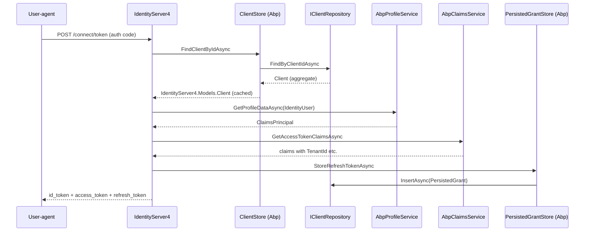

`Volo.Abp.IdentityServer.Domain` is the heart of the IdentityServer
module. It declares six aggregate roots — `Client`, `ApiResource`,
`ApiScope`, `IdentityResource`, `PersistedGrant` and `DeviceFlowCodes`
— exposes a repository interface per aggregate, registers ASP.NET
Core's `IIdentityServerBuilder` against those repositories and supplies
ABP-aware replacements for IdentityServer4's most important pluggable
services (`IClientStore`, `IResourceStore`, `IPersistedGrantStore`,
`IDeviceFlowStore`, `IProfileService`, `IClaimsService`,
`ICorsPolicyService`, `IResourceOwnerPasswordValidator`,
`IClientConfigurationValidator`, `IRedirectUriValidator`). It also
contributes the `IdentityResourceDataSeeder` that creates the five
OIDC-standard identity resources at first run, plus a periodic
`TokenCleanupBackgroundWorker` that deletes expired
`PersistedGrant`/`DeviceFlowCodes` rows. Source lives entirely under
`modules/identityserver/src/Volo.Abp.IdentityServer.Domain/`. For the
package map see [/modules/identityserver/overview](/modules/identityserver/overview);
for the persistence providers see
[/modules/identityserver/persistence](/modules/identityserver/persistence);
for the higher-level walkthrough see
[/auth/identityserver-module](/auth/identityserver-module).

## File inventory

The domain project is bigger than the OpenIddict domain because the
schema itself is bigger. The table below groups the files by purpose.

### Module & utility

| Path | Role |
| --- | --- |
| `Volo/Abp/IdentityServer/AbpIdentityServerDomainModule.cs` | `[DependsOn]` and `AddIdentityServer()` bootstrap. |
| `Volo/Abp/IdentityServer/AbpIdentityServerDbProperties.cs` | DbTablePrefix / DbSchema / `ConnectionStringName = "AbpIdentityServer"`. |
| `Volo/Abp/IdentityServer/AbpIdentityServerBuilderOptions.cs` | Five toggles consumed by the bootstrap. |
| `Volo/Abp/IdentityServer/AbpIdentityServerBuilderExtensions.cs` | `AddAbpIdentityServer` extension that wires the ABP services. |
| `Volo/Abp/IdentityServer/IdentityServerBuilderExtensions.cs` | `AddAbpStores` extension implemented by the providers. |
| `Volo/Abp/IdentityServer/IdentityServerAutoMapperProfile.cs` | AutoMapper profile mapping aggregates ↔ IdentityServer4 in-memory `Models.*` types. |

### Pluggable services

| Path | Replaces / implements |
| --- | --- |
| `Volo/Abp/IdentityServer/Clients/ClientStore.cs` | `IClientStore` — reads the `Client` aggregate, maps to `IdentityServer4.Models.Client` and caches the result. |
| `Volo/Abp/IdentityServer/ResourceStore.cs` | `IResourceStore` — reads `ApiResource`, `ApiScope`, `IdentityResource`. |
| `Volo/Abp/IdentityServer/Grants/PersistedGrantStore.cs` | `IPersistedGrantStore`. |
| `Volo/Abp/IdentityServer/Devices/DeviceFlowStore.cs` | `IDeviceFlowStore`. |
| `Volo/Abp/IdentityServer/AbpClaimsService.cs` | `DefaultClaimsService` subclass — adds tenant/impersonation claims. |
| `Volo/Abp/IdentityServer/AspNetIdentity/AbpProfileService.cs` | `ProfileService<IdentityUser>` subclass. |
| `Volo/Abp/IdentityServer/AspNetIdentity/AbpResourceOwnerPasswordValidator.cs` | `IResourceOwnerPasswordValidator` for the password grant. |
| `Volo/Abp/IdentityServer/AspNetIdentity/AbpUserClaimsFactory.cs` | `IUserClaimsPrincipalFactory<IdentityUser>` adapter. |
| `Volo/Abp/IdentityServer/AbpCorsPolicyService.cs` | `ICorsPolicyService` — reads `ClientCorsOrigin` and caches. |
| `Volo/Abp/IdentityServer/AbpClientConfigurationValidator.cs` | `DefaultClientConfigurationValidator` subclass — relaxes CORS when wildcard origins exist. |
| `Volo/Abp/IdentityServer/AbpStrictRedirectUriValidator.cs` | `StrictRedirectUriValidator` subclass — supports `{0}.example.com`-style wildcard redirect URIs. |
| `Volo/Abp/IdentityServer/AbpWildcardSubdomainCorsPolicyService.cs` | Wildcard subdomain CORS policy. |

### Aggregates and repositories (per directory)

| Aggregate | Files |
| --- | --- |
| `Client` | `Clients/Client.cs`, `Clients/ClientScope.cs`, `Clients/ClientSecret.cs`, `Clients/ClientGrantType.cs`, `Clients/ClientCorsOrigin.cs`, `Clients/ClientRedirectUri.cs`, `Clients/ClientPostLogoutRedirectUri.cs`, `Clients/ClientIdPRestriction.cs`, `Clients/ClientClaim.cs`, `Clients/ClientProperty.cs`, `Clients/IClientRepository.cs` |
| `ApiResource` | `ApiResources/ApiResource.cs`, `ApiResources/ApiResourceScope.cs`, `ApiResources/ApiResourceSecret.cs`, `ApiResources/ApiResourceClaim.cs`, `ApiResources/ApiResourceProperty.cs`, `ApiResources/IApiResourceRepository.cs` |
| `ApiScope` | `ApiScopes/ApiScope.cs`, `ApiScopes/ApiScopeClaim.cs`, `ApiScopes/ApiScopeProperty.cs`, `ApiScopes/IApiScopeRepository.cs` |
| `IdentityResource` | `IdentityResources/IdentityResource.cs`, `IdentityResources/IdentityResourceClaim.cs`, `IdentityResources/IdentityResourceProperty.cs`, `IdentityResources/IIdentityResourceRepository.cs`, `IdentityResources/IdentityResourceDataSeeder.cs`, `IdentityResources/IIdentityResourceDataSeeder.cs` |
| `PersistedGrant` | `Grants/PersistedGrant.cs`, `Grants/IPersistentGrantRepository.cs` |
| `DeviceFlowCodes` | `Devices/DeviceFlowCodes.cs`, `Devices/IDeviceFlowCodesRepository.cs` |

### Tokens & background work

| Path | Role |
| --- | --- |
| `Volo/Abp/IdentityServer/Tokens/TokenCleanupService.cs` | Calls `IPersistentGrantRepository.DeleteExpirationAsync` and the device-flow equivalent. |
| `Volo/Abp/IdentityServer/Tokens/TokenCleanupOptions.cs` | `CleanupPeriod`, `IsCleanupEnabled`. |
| `Volo/Abp/IdentityServer/Tokens/TokenCleanupBackgroundWorker.cs` | `AsyncPeriodicBackgroundWorkerBase` that runs the service on a schedule. |

## The six aggregates

### `Client`

`Client` is the biggest aggregate in the module — it holds dozens of
boolean and integer settings that map one-to-one onto IdentityServer4's
`Models.Client`. The opening lines of the file:

```csharp title="modules/identityserver/src/Volo.Abp.IdentityServer.Domain/Volo/Abp/IdentityServer/Clients/Client.cs"
public class Client : FullAuditedAggregateRoot<Guid>
{
    public virtual string ClientId { get; set; }
    public virtual string ClientName { get; set; }
    public virtual string Description { get; set; }
    public virtual string ClientUri { get; set; }
    public virtual string LogoUri { get; set; }
    public virtual bool Enabled { get; set; } = true;
    public virtual string ProtocolType { get; set; }
    public virtual bool RequireClientSecret { get; set; }
    public virtual bool RequireConsent { get; set; }
    public virtual bool AllowRememberConsent { get; set; }
    public virtual bool AlwaysIncludeUserClaimsInIdToken { get; set; }
    public virtual bool RequirePkce { get; set; }
    public virtual bool AllowPlainTextPkce { get; set; }
    public virtual bool RequireRequestObject { get; set; }
    public virtual bool AllowAccessTokensViaBrowser { get; set; }
    public virtual string FrontChannelLogoutUri { get; set; }
    public virtual bool FrontChannelLogoutSessionRequired { get; set; }
    public virtual string BackChannelLogoutUri { get; set; }
    public virtual bool BackChannelLogoutSessionRequired { get; set; }
    public virtual bool AllowOfflineAccess { get; set; }
    public virtual int IdentityTokenLifetime { get; set; }
    public virtual string AllowedIdentityTokenSigningAlgorithms { get; set; }
    public virtual int AccessTokenLifetime { get; set; }
    public virtual int AuthorizationCodeLifetime { get; set; }
    public virtual int? ConsentLifetime { get; set; }
    public virtual int AbsoluteRefreshTokenLifetime { get; set; }
    public virtual int SlidingRefreshTokenLifetime { get; set; }
    public virtual int RefreshTokenUsage { get; set; }
    public virtual bool UpdateAccessTokenClaimsOnRefresh { get; set; }
    public virtual int RefreshTokenExpiration { get; set; }
    public virtual int AccessTokenType { get; set; }
    public virtual bool EnableLocalLogin { get; set; }
    public virtual bool IncludeJwtId { get; set; }
    public virtual bool AlwaysSendClientClaims { get; set; }
    public virtual string ClientClaimsPrefix { get; set; }
    public virtual string PairWiseSubjectSalt { get; set; }
    public virtual int? UserSsoLifetime { get; set; }
    public virtual string UserCodeType { get; set; }
    public virtual int DeviceCodeLifetime { get; set; } = 300;

    public virtual List<ClientScope>                  AllowedScopes               { get; set; }
    public virtual List<ClientSecret>                 ClientSecrets               { get; set; }
    public virtual List<ClientGrantType>              AllowedGrantTypes           { get; set; }
    public virtual List<ClientCorsOrigin>             AllowedCorsOrigins          { get; set; }
    public virtual List<ClientRedirectUri>            RedirectUris                { get; set; }
    public virtual List<ClientPostLogoutRedirectUri>  PostLogoutRedirectUris      { get; set; }
    public virtual List<ClientIdPRestriction>         IdentityProviderRestrictions{ get; set; }
    public virtual List<ClientClaim>                  Claims                      { get; set; }
    public virtual List<ClientProperty>               Properties                  { get; set; }
}
```

The constructor sets the same defaults that
`new IdentityServer4.Models.Client()` uses — `RequirePkce = true`,
`AccessTokenLifetime = 3600`, `AbsoluteRefreshTokenLifetime = 2592000`,
`DeviceCodeLifetime = 300`, etc. — so creating a new `Client(id, clientId)`
in your seeder gives you a sensible starting point.

### `ApiResource`

```csharp title="modules/identityserver/src/Volo.Abp.IdentityServer.Domain/Volo/Abp/IdentityServer/ApiResources/ApiResource.cs"
public class ApiResource : FullAuditedAggregateRoot<Guid>
{
    [NotNull] public virtual string Name { get; protected set; }
    public virtual string DisplayName { get; set; }
    public virtual string Description { get; set; }
    public virtual bool Enabled { get; set; }
    public virtual string AllowedAccessTokenSigningAlgorithms { get; set; }
    public virtual bool ShowInDiscoveryDocument { get; set; } = true;

    public virtual List<ApiResourceSecret>   Secrets    { get; protected set; }
    public virtual List<ApiResourceScope>    Scopes     { get; protected set; }
    public virtual List<ApiResourceClaim>    UserClaims { get; protected set; }
    public virtual List<ApiResourceProperty> Properties { get; protected set; }
}
```

The constructor automatically adds an `ApiResourceScope` with the same
`Name` so that — by convention — an API resource named `"users"`
exposes a scope named `"users"`.

### `ApiScope`

```csharp title="modules/identityserver/src/Volo.Abp.IdentityServer.Domain/Volo/Abp/IdentityServer/ApiScopes/ApiScope.cs"
public class ApiScope : FullAuditedAggregateRoot<Guid>
{
    public virtual bool Enabled { get; set; }
    [NotNull] public virtual string Name { get; protected set; }
    public virtual string DisplayName { get; set; }
    public virtual string Description { get; set; }
    public virtual bool Required { get; set; }
    public virtual bool Emphasize { get; set; }
    public virtual bool ShowInDiscoveryDocument { get; set; }

    public virtual List<ApiScopeClaim>    UserClaims { get; protected set; }
    public virtual List<ApiScopeProperty> Properties { get; protected set; }
}
```

### `IdentityResource`

```csharp title="modules/identityserver/src/Volo.Abp.IdentityServer.Domain/Volo/Abp/IdentityServer/IdentityResources/IdentityResource.cs"
public class IdentityResource : FullAuditedAggregateRoot<Guid>
{
    public virtual string Name { get; set; }
    public virtual string DisplayName { get; set; }
    public virtual string Description { get; set; }
    public virtual bool Enabled { get; set; }
    public virtual bool Required { get; set; }
    public virtual bool Emphasize { get; set; }
    public virtual bool ShowInDiscoveryDocument { get; set; }

    public virtual List<IdentityResourceClaim>    UserClaims { get; set; }
    public virtual List<IdentityResourceProperty> Properties { get; set; }
}
```

### `PersistedGrant`

```csharp title="modules/identityserver/src/Volo.Abp.IdentityServer.Domain/Volo/Abp/IdentityServer/Grants/PersistedGrant.cs"
public class PersistedGrant : AggregateRoot<Guid>
{
    public virtual string Key { get; set; }
    public virtual string Type { get; set; }
    public virtual string SubjectId { get; set; }
    public virtual string SessionId { get; set; }
    public virtual string ClientId { get; set; }
    public virtual string Description { get; set; }
    public virtual DateTime CreationTime { get; set; }
    public virtual DateTime? Expiration { get; set; }
    public virtual DateTime? ConsumedTime { get; set; }
    public virtual string Data { get; set; }
}
```

Unlike the others, `PersistedGrant` derives from `AggregateRoot<Guid>`
rather than `FullAuditedAggregateRoot<Guid>` — the audit columns would
be pure overhead because IdentityServer4 prunes the row as soon as it
expires.

### `DeviceFlowCodes`

```csharp title="modules/identityserver/src/Volo.Abp.IdentityServer.Domain/Volo/Abp/IdentityServer/Devices/DeviceFlowCodes.cs"
public class DeviceFlowCodes : CreationAuditedAggregateRoot<Guid>
{
    public virtual string DeviceCode { get; set; }
    public virtual string UserCode { get; set; }
    public virtual string SubjectId { get; set; }
    public virtual string SessionId { get; set; }
    public virtual string ClientId { get; set; }
    public virtual string Description { get; set; }
    public virtual DateTime? Expiration { get; set; }
    public virtual string Data { get; set; }
}
```

### ERD

```mermaid
erDiagram
    Client ||--o{ ClientScope : "ClientId"
    Client ||--o{ ClientSecret : "ClientId"
    Client ||--o{ ClientGrantType : "ClientId"
    Client ||--o{ ClientRedirectUri : "ClientId"
    Client ||--o{ ClientPostLogoutRedirectUri : "ClientId"
    Client ||--o{ ClientClaim : "ClientId"
    Client ||--o{ ClientProperty : "ClientId"
    Client ||--o{ ClientCorsOrigin : "ClientId"
    Client ||--o{ ClientIdPRestriction : "ClientId"
    ApiResource ||--o{ ApiResourceScope : "ApiResourceId"
    ApiResource ||--o{ ApiResourceSecret : "ApiResourceId"
    ApiResource ||--o{ ApiResourceClaim : "ApiResourceId"
    ApiResource ||--o{ ApiResourceProperty : "ApiResourceId"
    ApiScope ||--o{ ApiScopeClaim : "ApiScopeId"
    ApiScope ||--o{ ApiScopeProperty : "ApiScopeId"
    IdentityResource ||--o{ IdentityResourceClaim : "IdentityResourceId"
    IdentityResource ||--o{ IdentityResourceProperty : "IdentityResourceId"
    Client {
        Guid Id
        string ClientId
        string ClientName
        string ProtocolType
        bool RequirePkce
    }
    ApiResource {
        Guid Id
        string Name
        bool Enabled
        bool ShowInDiscoveryDocument
    }
    ApiScope {
        Guid Id
        string Name
        bool Required
    }
    IdentityResource {
        Guid Id
        string Name
        bool Required
    }
    PersistedGrant {
        Guid Id
        string Key
        string Type
        string SubjectId
        string ClientId
    }
    DeviceFlowCodes {
        Guid Id
        string UserCode
        string DeviceCode
        string SubjectId
    }
```



`PersistedGrant` and `DeviceFlowCodes` have no foreign keys — they are
keyed by string identifiers (`Key`, `UserCode`, `DeviceCode`) that
IdentityServer4 generates and looks up directly.

## Repository contracts

Each aggregate gets a repository interface that extends
`IBasicRepository<TEntity, Guid>` with the lookups IdentityServer4
needs.

```csharp title="modules/identityserver/src/Volo.Abp.IdentityServer.Domain/Volo/Abp/IdentityServer/Clients/IClientRepository.cs"
public interface IClientRepository : IBasicRepository<Client, Guid>
{
    Task<Client> FindByClientIdAsync([NotNull] string clientId, bool includeDetails = true, CancellationToken cancellationToken = default);
    Task<List<Client>> GetListAsync(string sorting, int skipCount, int maxResultCount, string filter = null, bool includeDetails = false, CancellationToken cancellationToken = default);
    Task<long> GetCountAsync(string filter = null, CancellationToken cancellationToken = default);
    Task<List<string>> GetAllDistinctAllowedCorsOriginsAsync(CancellationToken cancellationToken = default);
    Task<bool> CheckClientIdExistAsync(string clientId, Guid? expectedId = null, CancellationToken cancellationToken = default);
}
```

```csharp title="modules/identityserver/src/Volo.Abp.IdentityServer.Domain/Volo/Abp/IdentityServer/ApiResources/IApiResourceRepository.cs"
public interface IApiResourceRepository : IBasicRepository<ApiResource, Guid>
{
    Task<ApiResource> FindByNameAsync(string apiResourceName, bool includeDetails = true, CancellationToken cancellationToken = default);
    Task<List<ApiResource>> FindByNameAsync(string[] apiResourceNames, bool includeDetails = true, CancellationToken cancellationToken = default);
    Task<List<ApiResource>> GetListByScopesAsync(string[] scopeNames, bool includeDetails = false, CancellationToken cancellationToken = default);
    Task<List<ApiResource>> GetListAsync(string sorting, int skipCount, int maxResultCount, string filter = null, bool includeDetails = false, CancellationToken cancellationToken = default);
    Task<long> GetCountAsync(string filter = null, CancellationToken cancellationToken = default);
    Task<bool> CheckNameExistAsync(string name, Guid? expectedId = null, CancellationToken cancellationToken = default);
}
```

```csharp title="modules/identityserver/src/Volo.Abp.IdentityServer.Domain/Volo/Abp/IdentityServer/Devices/IDeviceFlowCodesRepository.cs"
public interface IDeviceFlowCodesRepository : IBasicRepository<DeviceFlowCodes, Guid>
{
    Task<DeviceFlowCodes> FindByUserCodeAsync(string userCode, CancellationToken cancellationToken = default);
    Task<DeviceFlowCodes> FindByDeviceCodeAsync(string deviceCode, CancellationToken cancellationToken = default);
    Task<List<DeviceFlowCodes>> GetListByExpirationAsync(DateTime maxExpirationDate, int maxResultCount, CancellationToken cancellationToken = default);
    Task DeleteExpirationAsync(DateTime maxExpirationDate, CancellationToken cancellationToken = default);
}
```

The `includeDetails` parameter is what makes the EF Core provider issue
the `Include()` calls for child collections; the MongoDB provider
ignores it because documents are already loaded with their embedded
sub-collections.

## Pluggable services

`AbpIdentityServerDomainModule.AddIdentityServer` registers a chain of
ABP-flavoured replacements for IdentityServer4's default services.

### `ClientStore` and `ResourceStore`

```csharp title="modules/identityserver/src/Volo.Abp.IdentityServer.Domain/Volo/Abp/IdentityServer/Clients/ClientStore.cs"
public class ClientStore : IClientStore
{
    protected IClientRepository ClientRepository { get; }
    protected IObjectMapper<AbpIdentityServerDomainModule> ObjectMapper { get; }
    protected IDistributedCache<IdentityServer4.Models.Client> Cache { get; }
    protected IdentityServerOptions Options { get; }

    public virtual async Task<IdentityServer4.Models.Client> FindClientByIdAsync(string clientId)
    {
        return await GetCacheItemAsync(clientId);
    }

    protected virtual async Task<IdentityServer4.Models.Client> GetCacheItemAsync(string clientId)
    {
        return await Cache.GetOrAddAsync(clientId, async () =>
            {
                var client = await ClientRepository.FindByClientIdAsync(clientId);
                return ObjectMapper.Map<Client, IdentityServer4.Models.Client>(client);
            },
            optionsFactory: () => new DistributedCacheEntryOptions()
            {
                AbsoluteExpirationRelativeToNow = Options.Caching.ClientStoreExpiration
            },
            considerUow: true);
    }
}
```

`ResourceStore` follows the same pattern for `ApiResource`, `ApiScope`
and `IdentityResource`. Caching is driven by
`IdentityServerOptions.Caching.*Expiration` and respects the current
unit of work (`considerUow: true`) so that in-process writes invalidate
the cached copy.

### `PersistedGrantStore` and `DeviceFlowStore`

`PersistedGrantStore` implements `IPersistedGrantStore.StoreAsync`,
`GetAllAsync`, `RemoveAllAsync` (by subject/client/type) and so on, all
delegating to `IPersistentGrantRepository`. `DeviceFlowStore`
implements `IDeviceFlowStore` against `IDeviceFlowCodesRepository`
plus a helper that serializes the `DeviceCode` payload with
`IPersistentGrantSerializer`.

### `AbpClaimsService`

```csharp title="modules/identityserver/src/Volo.Abp.IdentityServer.Domain/Volo/Abp/IdentityServer/AbpClaimsService.cs"
public class AbpClaimsService : DefaultClaimsService
{
    private static readonly string[] AdditionalOptionalClaimNames =
    {
        AbpClaimTypes.TenantId,
        AbpClaimTypes.ImpersonatorTenantId,
        AbpClaimTypes.ImpersonatorUserId,
        AbpClaimTypes.Name,
        AbpClaimTypes.SurName,
        JwtRegisteredClaimNames.UniqueName,
        JwtClaimTypes.PreferredUserName,
        JwtClaimTypes.GivenName,
        JwtClaimTypes.FamilyName,
    };
    /* ... */
}
```

The class extends `DefaultClaimsService` and overrides
`FilterRequestedClaimTypes` so that the tenant and impersonation
claims always survive filtering — IdentityServer4 would normally drop
them because they are not part of any `IdentityResource.UserClaims`.

### `AbpProfileService`

```csharp title="modules/identityserver/src/Volo.Abp.IdentityServer.Domain/Volo/Abp/IdentityServer/AspNetIdentity/AbpProfileService.cs"
public class AbpProfileService : ProfileService<IdentityUser>
{
    protected ICurrentTenant CurrentTenant { get; }

    public AbpProfileService(
        IdentityUserManager userManager,
        IUserClaimsPrincipalFactory<IdentityUser> claimsFactory,
        ICurrentTenant currentTenant)
        /* ... */
}
```

`ProfileService<IdentityUser>` is the IdentityServer4 base class — the
ABP override flips into the correct tenant before resolving the user.
Combined with `AbpUserClaimsFactory<IdentityUser>` the issued tokens
carry the same claims that ABP's standard claims-principal contributors
would produce.

### `AbpResourceOwnerPasswordValidator`

Handles the password grant. It uses `SignInManager<IdentityUser>` to
validate the credentials, raises ABP's `IdentitySecurityLogManager`
events on success/failure and pushes localized error messages through
`IStringLocalizer<AbpIdentityServerResource>`.

### `AbpCorsPolicyService`

Reads the union of `ClientCorsOrigin` rows for every enabled client,
caches the result in `IDistributedCache<AllowedCorsOriginsCacheItem>`
with the configured expiration, and answers IdentityServer4's
`IsOriginAllowedAsync` from cache:

```csharp title="modules/identityserver/src/Volo.Abp.IdentityServer.Domain/Volo/Abp/IdentityServer/AbpCorsPolicyService.cs"
public virtual async Task<bool> IsOriginAllowedAsync(string origin)
{
    var cacheItem = await Cache.GetOrAddAsync(AllowedCorsOriginsCacheItem.AllOrigins, CreateCacheItemAsync,
        () => new DistributedCacheEntryOptions()
        {
            AbsoluteExpirationRelativeToNow = Options.Caching.CorsExpiration
        });
    /* ... */
}
```

### `AbpClientConfigurationValidator` + `AbpStrictRedirectUriValidator`

Together these two enable wildcard-redirect-URI support. The
configuration validator strips the `{0}.` prefix from
`AllowedCorsOrigins` so that IdentityServer4 stops rejecting wildcard
origin entries, and the strict redirect-URI validator falls back to a
`FormattedStringValueExtracter` match for wildcard URIs:

```csharp title="modules/identityserver/src/Volo.Abp.IdentityServer.Domain/Volo/Abp/IdentityServer/AbpStrictRedirectUriValidator.cs"
public override async Task<bool> IsRedirectUriValidAsync(string requestedUri, Client client)
{
    var isAllowed = await base.IsRedirectUriValidAsync(requestedUri, client);
    return isAllowed || await IsRedirectUriValidWithDomainFormatsAsync(client.RedirectUris, requestedUri);
}
```

## Domain module bootstrap

The module class wires every service registered above into
IdentityServer4's pluggable architecture:

```csharp title="modules/identityserver/src/Volo.Abp.IdentityServer.Domain/Volo/Abp/IdentityServer/AbpIdentityServerDomainModule.cs"
[DependsOn(
    typeof(AbpIdentityServerDomainSharedModule),
    typeof(AbpAutoMapperModule),
    typeof(AbpIdentityDomainModule),
    typeof(AbpSecurityModule),
    typeof(AbpCachingModule),
    typeof(AbpValidationModule),
    typeof(AbpBackgroundWorkersModule)
)]
public class AbpIdentityServerDomainModule : AbpModule
```

`ConfigureServices` registers the AutoMapper profile, then calls a
private helper that assembles the IdentityServer builder:

```csharp title="modules/identityserver/src/Volo.Abp.IdentityServer.Domain/Volo/Abp/IdentityServer/AbpIdentityServerDomainModule.cs"
private static void AddIdentityServer(IServiceCollection services)
{
    var configuration = services.GetConfiguration();
    var builderOptions = services.ExecutePreConfiguredActions<AbpIdentityServerBuilderOptions>();

    var identityServerBuilder = AddIdentityServer(services, builderOptions);

    if (builderOptions.AddDeveloperSigningCredential)
    {
        identityServerBuilder = identityServerBuilder.AddDeveloperSigningCredential();
    }

    identityServerBuilder.AddAbpIdentityServer(builderOptions);

    services.ExecutePreConfiguredActions(identityServerBuilder);

    if (!services.IsAdded<IPersistedGrantService>())
    {
        services.TryAddSingleton<IPersistedGrantStore, InMemoryPersistedGrantStore>();
    }

    if (!services.IsAdded<IDeviceFlowStore>())
    {
        services.TryAddSingleton<IDeviceFlowStore, InMemoryDeviceFlowStore>();
    }

    if (!services.IsAdded<IClientStore>())
    {
        identityServerBuilder.AddInMemoryClients(configuration.GetSection("IdentityServer:Clients"));
    }

    if (!services.IsAdded<IResourceStore>())
    {
        identityServerBuilder.AddInMemoryApiResources(configuration.GetSection("IdentityServer:ApiResources"));
        identityServerBuilder.AddInMemoryIdentityResources(configuration.GetSection("IdentityServer:IdentityResources"));
    }
}
```

The five `if (!services.IsAdded<...>)` checks are deliberate — when one
of the persistence providers calls `AddAbpStores()`, the four DB-backed
stores are registered, the `IsAdded` checks fail and the in-memory
fallbacks are skipped. If you forget to depend on a persistence module
the in-memory fallbacks take over so the server still starts (and you
get a glaring warning in the logs when nothing persists).

The builder options:

```csharp title="modules/identityserver/src/Volo.Abp.IdentityServer.Domain/Volo/Abp/IdentityServer/AbpIdentityServerBuilderOptions.cs"
public class AbpIdentityServerBuilderOptions
{
    public bool UpdateJwtSecurityTokenHandlerDefaultInboundClaimTypeMap { get; set; } = true;
    public bool UpdateAbpClaimTypes { get; set; } = true;
    public bool IntegrateToAspNetIdentity { get; set; } = true;
    public bool AddDeveloperSigningCredential { get; set; } = true;
    public bool AddIdentityServerCookieAuthentication { get; set; } = true;
}
```

`IntegrateToAspNetIdentity = true` is what triggers
`builder.AddAspNetIdentity<IdentityUser>()`,
`builder.AddProfileService<AbpProfileService>()` and
`builder.AddResourceOwnerValidator<AbpResourceOwnerPasswordValidator>()`
in `AddAbpIdentityServer`.

## Identity-resource data seeder

```csharp title="modules/identityserver/src/Volo.Abp.IdentityServer.Domain/Volo/Abp/IdentityServer/IdentityResources/IdentityResourceDataSeeder.cs"
public class IdentityResourceDataSeeder : IIdentityResourceDataSeeder, ITransientDependency
{
    public virtual async Task CreateStandardResourcesAsync()
    {
        var resources = new[]
        {
            new IdentityServer4.Models.IdentityResources.OpenId(),
            new IdentityServer4.Models.IdentityResources.Profile(),
            new IdentityServer4.Models.IdentityResources.Email(),
            new IdentityServer4.Models.IdentityResources.Address(),
            new IdentityServer4.Models.IdentityResources.Phone(),
            new IdentityServer4.Models.IdentityResource("role", "Roles of the user", new[] { "role" })
        };

        foreach (var resource in resources)
        {
            foreach (var claimType in resource.UserClaims)
            {
                await AddClaimTypeIfNotExistsAsync(claimType);
            }

            await AddIdentityResourceIfNotExistsAsync(resource);
        }
    }
}
```

The seeder also writes corresponding `IdentityClaimType` rows into the
identity module so that the standard OIDC claims appear in the user
edit form.

## Token cleanup

```csharp title="modules/identityserver/src/Volo.Abp.IdentityServer.Domain/Volo/Abp/IdentityServer/Tokens/TokenCleanupService.cs"
public class TokenCleanupService : ITransientDependency
{
    protected IPersistentGrantRepository PersistentGrantRepository { get; }
    protected IDeviceFlowCodesRepository DeviceFlowCodesRepository { get; }
    protected TokenCleanupOptions Options { get; }

    [UnitOfWork]
    public virtual async Task CleanAsync()
    {
        await RemoveGrantsAsync();
        await RemoveDeviceCodesAsync();
    }

    protected virtual async Task RemoveGrantsAsync()
    {
        await PersistentGrantRepository.DeleteExpirationAsync(DateTime.UtcNow);
    }
    /* RemoveDeviceCodesAsync */
}
```

```csharp title="modules/identityserver/src/Volo.Abp.IdentityServer.Domain/Volo/Abp/IdentityServer/Tokens/TokenCleanupOptions.cs"
public class TokenCleanupOptions
{
    public int CleanupPeriod { get; set; } = 3_600_000;   // 1 hour
    public bool IsCleanupEnabled { get; set; } = true;
}
```

```csharp title="modules/identityserver/src/Volo.Abp.IdentityServer.Domain/Volo/Abp/IdentityServer/Tokens/TokenCleanupBackgroundWorker.cs"
public class TokenCleanupBackgroundWorker : AsyncPeriodicBackgroundWorkerBase
{
    public TokenCleanupBackgroundWorker(
        AbpAsyncTimer timer,
        IServiceScopeFactory serviceScopeFactory,
        IOptions<TokenCleanupOptions> options)
        : base(timer, serviceScopeFactory)
    {
        Options = options.Value;
        timer.Period = Options.CleanupPeriod;
    }

    protected async override Task DoWorkAsync(PeriodicBackgroundWorkerContext workerContext)
    {
        await workerContext.ServiceProvider
            .GetRequiredService<TokenCleanupService>()
            .CleanAsync();
    }
}
```

`AbpIdentityServerDomainModule.OnApplicationInitializationAsync`
conditionally registers this worker — same shape as the OpenIddict
module.

## End-to-end pipeline



## Where to go next

<CardGroup cols={2}>
  <Card title="Persistence providers" icon="database" href="/modules/identityserver/persistence">
    EF Core and MongoDB DbContexts plus `ConfigureIdentityServer`.
  </Card>
  <Card title="Module overview" icon="layer-group" href="/modules/identityserver/overview">
    Package list and dependency diagram.
  </Card>
  <Card title="IdentityServer walkthrough" icon="play" href="/auth/identityserver-module">
    Higher-level guide.
  </Card>
  <Card title="OpenIddict domain" icon="cube" href="/modules/openiddict/domain">
    Side-by-side comparison with the OpenIddict aggregates.
  </Card>
</CardGroup>
