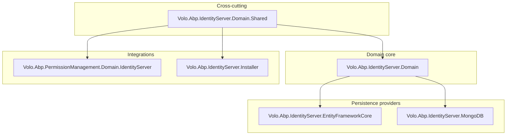
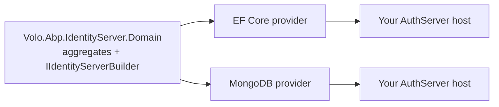

The IdentityServer module is the ABP Framework's IdentityServer4-based
authorization-server module. It is the predecessor of the
[OpenIddict module](/modules/openiddict/overview) and is still shipped
for backwards compatibility with applications that were generated from
older ABP templates. The module persists IdentityServer4's
configuration objects — clients, API resources, API scopes, identity
resources, persisted grants and device-flow codes — through ABP
aggregates, registers ASP.NET Core Identity as the user backend, and
swaps in ABP-flavoured implementations of IdentityServer's pluggable
services (claims, profile, resource owner password, CORS, redirect URI
validation). Source for this module lives under
`modules/identityserver/src/` in the
[`abpframework/abp`](https://github.com/abpframework/abp) repository.
For the higher-level walkthrough see
[/auth/identityserver-module](/auth/identityserver-module); for the
modern alternative see [/auth/openiddict-server](/auth/openiddict-server)
and [/modules/openiddict/overview](/modules/openiddict/overview).

<Note>
New ABP applications use OpenIddict by default — see the
[OpenIddict overview](/modules/openiddict/overview). The
IdentityServer module is described here both for existing applications
and so that you can compare the two stacks before migrating.
</Note>

## Packages in the module

The `modules/identityserver/src/` folder contains six projects. The
layering mirrors the OpenIddict module: domain-shared on the bottom,
domain in the middle, two persistence providers and an installer at the
top, plus a permission-integration project that bridges to the
permission-management module.

| Project | NuGet package | Purpose |
| --- | --- | --- |
| `Volo.Abp.IdentityServer.Domain.Shared` | `Volo.Abp.IdentityServer.Domain.Shared` | Constants (`ClientConsts`, `ApiResourceConsts`, `ApiScopeConsts`, `IdentityResourceConsts`, `PersistedGrantConsts`, `DeviceFlowCodesConsts`, etc.), localization resource `AbpIdentityServerResource`, ETOs for distributed event publishing, and `IdentityServerModuleExtensionConsts`. |
| `Volo.Abp.IdentityServer.Domain` | `Volo.Abp.IdentityServer.Domain` | Aggregate roots, repository interfaces, store implementations (`ClientStore`, `ResourceStore`, `PersistedGrantStore`, `DeviceFlowStore`), `AbpProfileService`, `AbpClaimsService`, `AbpResourceOwnerPasswordValidator`, `AbpCorsPolicyService`, `TokenCleanupBackgroundWorker` and the data seeder. |
| `Volo.Abp.IdentityServer.EntityFrameworkCore` | `Volo.Abp.IdentityServer.EntityFrameworkCore` | `IdentityServerDbContext` / `IIdentityServerDbContext`, the `ConfigureIdentityServer` model-builder extension and EF Core repositories. |
| `Volo.Abp.IdentityServer.MongoDB` | `Volo.Abp.IdentityServer.MongoDB` | `AbpIdentityServerMongoDbContext` / `IAbpIdentityServerMongoDbContext` and MongoDB repositories. |
| `Volo.Abp.IdentityServer.Installer` | `Volo.Abp.IdentityServer.Installer` | A thin module used by the `abp install-module` tooling. |
| `Volo.Abp.PermissionManagement.Domain.IdentityServer` | `Volo.Abp.PermissionManagement.Domain.IdentityServer` | Registers `ClientPermissionManagementProvider` so the permission-management module can grant permissions to IdentityServer clients. |

## Layer map

The projects line up with the standard ABP DDD layering:



Arrows are `DependsOn` relationships. The IdentityServer module — like
OpenIddict — does not ship an ASP.NET Core project of its own; the
HTTP layer is provided by IdentityServer4 itself, and the ABP module
plugs into it through `AddIdentityServerBuilder()` from
`AbpIdentityServerDomainModule`.

## Module dependency reference

### `AbpIdentityServerDomainSharedModule`

```csharp title="modules/identityserver/src/Volo.Abp.IdentityServer.Domain.Shared/Volo/Abp/IdentityServer/AbpIdentityServerDomainSharedModule.cs"
[DependsOn(
    typeof(AbpValidationModule)
)]
public class AbpIdentityServerDomainSharedModule : AbpModule
```

Registers the embedded localization resources for the module and the
`Volo.IdentityServer` exception-code namespace.

### `AbpIdentityServerDomainModule`

```csharp title="modules/identityserver/src/Volo.Abp.IdentityServer.Domain/Volo/Abp/IdentityServer/AbpIdentityServerDomainModule.cs"
[DependsOn(
    typeof(AbpIdentityServerDomainSharedModule),
    typeof(AbpAutoMapperModule),
    typeof(AbpIdentityDomainModule),
    typeof(AbpSecurityModule),
    typeof(AbpCachingModule),
    typeof(AbpValidationModule),
    typeof(AbpBackgroundWorkersModule)
)]
public class AbpIdentityServerDomainModule : AbpModule
```

This is where `AddIdentityServer()` is called and where the ABP stores
and pluggable services are registered. See
[/modules/identityserver/domain](/modules/identityserver/domain) for
the full breakdown. The dependency on `AbpAutoMapperModule` is there
because the stores map between the ABP aggregates and IdentityServer4's
in-memory `Models.*` types; the dependency on `AbpIdentityDomainModule`
brings in `IdentityUser` so that the ASP.NET Identity integration can
use it.

### `AbpIdentityServerEntityFrameworkCoreModule`

```csharp title="modules/identityserver/src/Volo.Abp.IdentityServer.EntityFrameworkCore/Volo/Abp/IdentityServer/EntityFrameworkCore/AbpIdentityServerEntityFrameworkCoreModule.cs"
[DependsOn(
    typeof(AbpIdentityServerDomainModule),
    typeof(AbpEntityFrameworkCoreModule)
)]
public class AbpIdentityServerEntityFrameworkCoreModule : AbpModule
```

Registers `IdentityServerDbContext` and six EF Core repositories — one
per aggregate. See
[/modules/identityserver/persistence](/modules/identityserver/persistence).

### `AbpIdentityServerMongoDbModule`

```csharp title="modules/identityserver/src/Volo.Abp.IdentityServer.MongoDB/Volo/Abp/IdentityServer/MongoDB/AbpIdentityServerMongoDbModule.cs"
[DependsOn(
    typeof(AbpIdentityServerDomainModule),
    typeof(AbpMongoDbModule)
)]
public class AbpIdentityServerMongoDbModule : AbpModule
```

Same shape, MongoDB-backed. See
[/modules/identityserver/persistence](/modules/identityserver/persistence).

### `AbpPermissionManagementDomainIdentityServerModule`

```csharp title="modules/identityserver/src/Volo.Abp.PermissionManagement.Domain.IdentityServer/Volo/Abp/PermissionManagement/IdentityServer/AbpPermissionManagementDomainIdentityServerModule.cs"
[DependsOn(
    typeof(AbpIdentityServerDomainSharedModule),
    typeof(AbpPermissionManagementDomainModule)
)]
public class AbpPermissionManagementDomainIdentityServerModule : AbpModule
{
    public override void ConfigureServices(ServiceConfigurationContext context)
    {
        Configure<PermissionManagementOptions>(options =>
        {
            options.ManagementProviders.Add<ClientPermissionManagementProvider>();
            options.ProviderPolicies[ClientPermissionValueProvider.ProviderName] =
                "IdentityServer.Client.ManagePermissions";
        });
    }
}
```

Registers the same `"C"` (Client) permission provider used by the
OpenIddict module — but maps it to the `IdentityServer.Client.ManagePermissions`
policy rather than `OpenIddictPro.Application.ManagePermissions`. The
runtime behaviour is otherwise identical: a `client_id` claim on the
principal allows the permission-management module to find a matching
`PermissionGrants` row.

## OpenIddict comparison

The IdentityServer and OpenIddict modules cover the same problem space.
The shape is similar but the persisted entity model is different —
IdentityServer4 stores a rich, fully-typed schema with many child
tables, whereas OpenIddict 4.x stores most settings as JSON blobs on
four tables. The table below shows the rough one-to-one correspondence:

| Concept | IdentityServer | OpenIddict |
| --- | --- | --- |
| Client / Application | `Client` aggregate with child tables for grant types, scopes, secrets, redirect URIs, claims, properties, CORS origins, IdP restrictions | `OpenIddictApplication` (single table with JSON columns) |
| Resource catalog | `ApiResource` + `ApiResourceScope` + `ApiResourceSecret` + `ApiResourceClaim` + `ApiResourceProperty`; `IdentityResource` + `IdentityResourceClaim` + `IdentityResourceProperty`; `ApiScope` + `ApiScopeClaim` + `ApiScopeProperty` | `OpenIddictScope` (single table) |
| Issued tokens / authorizations | `PersistedGrant` | `OpenIddictAuthorization` + `OpenIddictToken` |
| Device flow | `DeviceFlowCodes` aggregate | `OpenIddictToken` rows of type `DeviceCode` and `UserCode` |
| Pluggable services | `ClientStore`, `ResourceStore`, `PersistedGrantStore`, `DeviceFlowStore`, `AbpProfileService`, `AbpClaimsService`, `AbpCorsPolicyService`, `AbpResourceOwnerPasswordValidator`, `AbpClientConfigurationValidator`, `AbpStrictRedirectUriValidator` | `AbpApplicationManager`, `AbpAuthorizationManager`, `AbpScopeManager`, `AbpTokenManager`, the five wildcard-domain handlers, the claims-principal handler chain |

For a clean comparison of the configuration approaches see
[/auth/identityserver-module](/auth/identityserver-module) and
[/auth/openiddict-server](/auth/openiddict-server).

## Choosing between EF Core and MongoDB



Both providers register against the same `[ConnectionStringName("AbpIdentityServer")]`
key, so you only pick one. The relational provider takes advantage of
EF Core's `Include()` for fully-typed child collections; the MongoDB
provider stores each aggregate as a denormalised document with embedded
sub-collections.

## What is in the box

### Aggregates

```mermaid
erDiagram
    Client ||--o{ ClientScope : "ClientId"
    Client ||--o{ ClientSecret : "ClientId"
    Client ||--o{ ClientGrantType : "ClientId"
    Client ||--o{ ClientRedirectUri : "ClientId"
    Client ||--o{ ClientPostLogoutRedirectUri : "ClientId"
    Client ||--o{ ClientClaim : "ClientId"
    Client ||--o{ ClientProperty : "ClientId"
    Client ||--o{ ClientCorsOrigin : "ClientId"
    Client ||--o{ ClientIdPRestriction : "ClientId"
    ApiResource ||--o{ ApiResourceScope : "ApiResourceId"
    ApiResource ||--o{ ApiResourceSecret : "ApiResourceId"
    ApiResource ||--o{ ApiResourceClaim : "ApiResourceId"
    ApiResource ||--o{ ApiResourceProperty : "ApiResourceId"
    ApiScope ||--o{ ApiScopeClaim : "ApiScopeId"
    ApiScope ||--o{ ApiScopeProperty : "ApiScopeId"
    IdentityResource ||--o{ IdentityResourceClaim : "IdentityResourceId"
    IdentityResource ||--o{ IdentityResourceProperty : "IdentityResourceId"
```



The diagram is reproduced in detail in
[/modules/identityserver/domain](/modules/identityserver/domain).

### Built-in data seeder

The module ships a public `IdentityResourceDataSeeder` that creates the
five OIDC-standard identity resources plus `role`:

```csharp title="modules/identityserver/src/Volo.Abp.IdentityServer.Domain/Volo/Abp/IdentityServer/IdentityResources/IdentityResourceDataSeeder.cs"
public virtual async Task CreateStandardResourcesAsync()
{
    var resources = new[]
    {
        new IdentityServer4.Models.IdentityResources.OpenId(),
        new IdentityServer4.Models.IdentityResources.Profile(),
        new IdentityServer4.Models.IdentityResources.Email(),
        new IdentityServer4.Models.IdentityResources.Address(),
        new IdentityServer4.Models.IdentityResources.Phone(),
        new IdentityServer4.Models.IdentityResource("role", "Roles of the user", new[] { "role" })
    };

    foreach (var resource in resources)
    {
        foreach (var claimType in resource.UserClaims)
        {
            await AddClaimTypeIfNotExistsAsync(claimType);
        }

        await AddIdentityResourceIfNotExistsAsync(resource);
    }
}
```

Unlike OpenIddict — which leaves the seeding entirely to the
application template — the IdentityServer module ships this seeder so
that the standard resources are guaranteed to exist after any
`DbMigrator` run that calls `IIdentityResourceDataSeeder`.

### Token cleanup background worker

The domain module registers a `TokenCleanupBackgroundWorker` that, on a
schedule, calls `IPersistentGrantRepository.DeleteExpirationAsync` and
the `DeviceFlowCodesRepository` cleanup. The schedule is controlled by
`TokenCleanupOptions`.

## Where to go next

<CardGroup cols={2}>
  <Card title="Aggregates and stores" icon="cube" href="/modules/identityserver/domain">
    The full aggregate inventory and the pluggable IdentityServer4
    services replaced by ABP.
  </Card>
  <Card title="Persistence providers" icon="database" href="/modules/identityserver/persistence">
    EF Core and MongoDB DbContexts side by side, plus the
    `ConfigureIdentityServer` model-builder extension.
  </Card>
  <Card title="Server walkthrough" icon="play" href="/auth/identityserver-module">
    Higher-level guide to adding the module to a host.
  </Card>
  <Card title="OpenIddict module" icon="arrow-right" href="/modules/openiddict/overview">
    Modern alternative used by new ABP applications.
  </Card>
</CardGroup>
