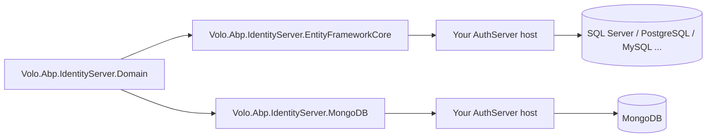

`Volo.Abp.IdentityServer.EntityFrameworkCore` and
`Volo.Abp.IdentityServer.MongoDB` are the two persistence providers for
the IdentityServer module. They are interchangeable: a host project
depends on exactly one of them, and the rest of the module —
IdentityServer4 itself, the ABP stores, the cleanup background worker
— behaves identically. The EF Core provider has a richer relational
schema with child tables for every collection on every aggregate; the
MongoDB provider stores each aggregate as a single document with the
child collections embedded. Both providers expose an interface
(`IIdentityServerDbContext` for EF Core, `IAbpIdentityServerMongoDbContext`
for MongoDB) that lets you implement the same `DbSet` / collection
shape on your application context. Source lives under
`modules/identityserver/src/Volo.Abp.IdentityServer.EntityFrameworkCore/`
and `modules/identityserver/src/Volo.Abp.IdentityServer.MongoDB/`. For
the aggregates being persisted see
[/modules/identityserver/domain](/modules/identityserver/domain); for
the package map see [/modules/identityserver/overview](/modules/identityserver/overview).

## How the providers plug in

Both modules `PreConfigure` the `IIdentityServerBuilder` to call
`AddAbpStores()`, which is the bridge from IdentityServer4's pluggable
service interfaces to the ABP repositories:

```csharp title="modules/identityserver/src/Volo.Abp.IdentityServer.Domain/Volo/Abp/IdentityServer/IdentityServerBuilderExtensions.cs"
public static class IdentityServerBuilderExtensions
{
    public static IIdentityServerBuilder AddAbpStores(this IIdentityServerBuilder builder)
    {
        builder.Services.AddTransient<IPersistedGrantStore, PersistedGrantStore>();
        builder.Services.AddTransient<IDeviceFlowStore, DeviceFlowStore>();

        return builder
            .AddClientStore<ClientStore>()
            .AddResourceStore<ResourceStore>()
            .AddCorsPolicyService<AbpCorsPolicyService>();
    }
}
```

Because the call is done in `PreConfigureServices`, the domain module's
`AddIdentityServer()` sees that `IClientStore`, `IResourceStore`,
`IPersistedGrantStore`, `IDeviceFlowStore` and `ICorsPolicyService` are
already registered and skips its in-memory fallbacks. Each provider
module looks like this:

```csharp title="modules/identityserver/src/Volo.Abp.IdentityServer.EntityFrameworkCore/Volo/Abp/IdentityServer/EntityFrameworkCore/AbpIdentityServerEntityFrameworkCoreModule.cs"
[DependsOn(
    typeof(AbpIdentityServerDomainModule),
    typeof(AbpEntityFrameworkCoreModule)
)]
public class AbpIdentityServerEntityFrameworkCoreModule : AbpModule
{
    public override void PreConfigureServices(ServiceConfigurationContext context)
    {
        context.Services.PreConfigure<IIdentityServerBuilder>(builder => { builder.AddAbpStores(); });
    }

    public override void ConfigureServices(ServiceConfigurationContext context)
    {
        context.Services.AddAbpDbContext<IdentityServerDbContext>(options =>
        {
            options.AddDefaultRepositories<IIdentityServerDbContext>();

            options.AddRepository<Client,           ClientRepository>();
            options.AddRepository<ApiResource,      ApiResourceRepository>();
            options.AddRepository<ApiScope,         ApiScopeRepository>();
            options.AddRepository<IdentityResource, IdentityResourceRepository>();
            options.AddRepository<PersistedGrant,   PersistentGrantRepository>();
            options.AddRepository<DeviceFlowCodes,  DeviceFlowCodesRepository>();
        });
    }
}
```

The MongoDB module is structurally identical:

```csharp title="modules/identityserver/src/Volo.Abp.IdentityServer.MongoDB/Volo/Abp/IdentityServer/MongoDB/AbpIdentityServerMongoDbModule.cs"
[DependsOn(
    typeof(AbpIdentityServerDomainModule),
    typeof(AbpMongoDbModule)
)]
public class AbpIdentityServerMongoDbModule : AbpModule
{
    public override void PreConfigureServices(ServiceConfigurationContext context)
    {
        context.Services.PreConfigure<IIdentityServerBuilder>(builder => { builder.AddAbpStores(); });
    }

    public override void ConfigureServices(ServiceConfigurationContext context)
    {
        context.Services.AddMongoDbContext<AbpIdentityServerMongoDbContext>(options =>
        {
            options.AddRepository<ApiResource,      MongoApiResourceRepository>();
            options.AddRepository<ApiScope,         MongoApiScopeRepository>();
            options.AddRepository<IdentityResource, MongoIdentityResourceRepository>();
            options.AddRepository<Client,           MongoClientRepository>();
            options.AddRepository<PersistedGrant,   MongoPersistentGrantRepository>();
            options.AddRepository<DeviceFlowCodes,  MongoDeviceFlowCodesRepository>();
        });
    }
}
```

## Entity Framework Core provider

### File inventory

| Path | Role |
| --- | --- |
| `Volo/Abp/IdentityServer/EntityFrameworkCore/AbpIdentityServerEntityFrameworkCoreModule.cs` | Module class shown above. |
| `Volo/Abp/IdentityServer/EntityFrameworkCore/IIdentityServerDbContext.cs` | Reusable DbContext contract. |
| `Volo/Abp/IdentityServer/EntityFrameworkCore/IdentityServerDbContext.cs` | Concrete DbContext for isolated databases. |
| `Volo/Abp/IdentityServer/EntityFrameworkCore/IdentityServerDbContextModelCreatingExtensions.cs` | `ConfigureIdentityServer` model-builder extension. |
| `Volo/Abp/IdentityServer/AbpIdentityServerEfCoreQueryableExtensions.cs` | `IncludeDetails` extension methods (six aggregates). |
| `Volo/Abp/IdentityServer/Clients/ClientRepository.cs` | `IClientRepository`. |
| `Volo/Abp/IdentityServer/ApiResources/ApiResourceRepository.cs` | `IApiResourceRepository`. |
| `Volo/Abp/IdentityServer/ApiScopes/ApiScopeRepository.cs` | `IApiScopeRepository`. |
| `Volo/Abp/IdentityServer/IdentityResources/IdentityResourceRepository.cs` | `IIdentityResourceRepository`. |
| `Volo/Abp/IdentityServer/Grants/PersistentGrantRepository.cs` | `IPersistentGrantRepository`. |
| `Volo/Abp/IdentityServer/Devices/DeviceFlowCodesRepository.cs` | `IDeviceFlowCodesRepository`. |

### `IIdentityServerDbContext`

The interface is large because every aggregate has its own
`DbSet` plus a `DbSet` for each child entity:

```csharp title="modules/identityserver/src/Volo.Abp.IdentityServer.EntityFrameworkCore/Volo/Abp/IdentityServer/EntityFrameworkCore/IIdentityServerDbContext.cs"
[IgnoreMultiTenancy]
[ConnectionStringName(AbpIdentityServerDbProperties.ConnectionStringName)]
public interface IIdentityServerDbContext : IEfCoreDbContext
{
    #region ApiResource
    DbSet<ApiResource>         ApiResources         { get; }
    DbSet<ApiResourceSecret>   ApiResourceSecrets   { get; }
    DbSet<ApiResourceClaim>    ApiResourceClaims    { get; }
    DbSet<ApiResourceScope>    ApiResourceScopes    { get; }
    DbSet<ApiResourceProperty> ApiResourceProperties{ get; }
    #endregion

    #region ApiScope
    DbSet<ApiScope>            ApiScopes            { get; }
    DbSet<ApiScopeClaim>       ApiScopeClaims       { get; }
    DbSet<ApiScopeProperty>    ApiScopeProperties   { get; }
    #endregion

    #region IdentityResource
    DbSet<IdentityResource>         IdentityResources         { get; }
    DbSet<IdentityResourceClaim>    IdentityClaims            { get; }
    DbSet<IdentityResourceProperty> IdentityResourceProperties{ get; }
    #endregion

    #region Client
    DbSet<Client>                       Clients                       { get; }
    DbSet<ClientGrantType>              ClientGrantTypes              { get; }
    DbSet<ClientRedirectUri>            ClientRedirectUris            { get; }
    DbSet<ClientPostLogoutRedirectUri>  ClientPostLogoutRedirectUris  { get; }
    DbSet<ClientScope>                  ClientScopes                  { get; }
    DbSet<ClientSecret>                 ClientSecrets                 { get; }
    DbSet<ClientClaim>                  ClientClaims                  { get; }
    DbSet<ClientIdPRestriction>         ClientIdPRestrictions         { get; }
    DbSet<ClientCorsOrigin>             ClientCorsOrigins             { get; }
    DbSet<ClientProperty>               ClientProperties              { get; }
    #endregion

    DbSet<PersistedGrant>  PersistedGrants  { get; }
    DbSet<DeviceFlowCodes> DeviceFlowCodes  { get; }
}
```

Two attributes again:

- `[IgnoreMultiTenancy]` — IdentityServer configuration is global.
- `[ConnectionStringName("AbpIdentityServer")]` — controls which
  connection string section of `appsettings.json` the DbContext uses.

### `IdentityServerDbContext`

A no-frills `AbpDbContext` that implements every `DbSet`:

```csharp title="modules/identityserver/src/Volo.Abp.IdentityServer.EntityFrameworkCore/Volo/Abp/IdentityServer/EntityFrameworkCore/IdentityServerDbContext.cs"
[IgnoreMultiTenancy]
[ConnectionStringName(AbpIdentityServerDbProperties.ConnectionStringName)]
public class IdentityServerDbContext : AbpDbContext<IdentityServerDbContext>, IIdentityServerDbContext
{
    /* every DbSet ... */

    protected override void OnModelCreating(ModelBuilder builder)
    {
        base.OnModelCreating(builder);
        builder.ConfigureIdentityServer();
    }
}
```

### `ConfigureIdentityServer` model builder

The model-builder extension method is the biggest in the module —
each aggregate has its own `builder.Entity<T>(b => ...)` block that
sets the table name (`IdentityServer*`), invokes `ConfigureByConvention`,
configures keys, max-length constants and the cascading FKs that link
child rows back to their owning aggregate. The opening lines for
`Client`:

```csharp title="modules/identityserver/src/Volo.Abp.IdentityServer.EntityFrameworkCore/Volo/Abp/IdentityServer/EntityFrameworkCore/IdentityServerDbContextModelCreatingExtensions.cs"
builder.Entity<Client>(b =>
{
    b.ToTable(AbpIdentityServerDbProperties.DbTablePrefix + "Clients", AbpIdentityServerDbProperties.DbSchema);
    b.ConfigureByConvention();

    b.Property(x => x.ClientId).HasMaxLength(ClientConsts.ClientIdMaxLength).IsRequired();
    b.Property(x => x.ProtocolType).HasMaxLength(ClientConsts.ProtocolTypeMaxLength).IsRequired();
    b.Property(x => x.ClientName).HasMaxLength(ClientConsts.ClientNameMaxLength);
    /* more properties ... */

    b.HasMany(x => x.AllowedScopes).WithOne().HasForeignKey(x => x.ClientId).IsRequired();
    b.HasMany(x => x.ClientSecrets).WithOne().HasForeignKey(x => x.ClientId).IsRequired();
    b.HasMany(x => x.AllowedGrantTypes).WithOne().HasForeignKey(x => x.ClientId).IsRequired();
    b.HasMany(x => x.AllowedCorsOrigins).WithOne().HasForeignKey(x => x.ClientId).IsRequired();
    b.HasMany(x => x.RedirectUris).WithOne().HasForeignKey(x => x.ClientId).IsRequired();
    b.HasMany(x => x.PostLogoutRedirectUris).WithOne().HasForeignKey(x => x.ClientId).IsRequired();
    b.HasMany(x => x.IdentityProviderRestrictions).WithOne().HasForeignKey(x => x.ClientId).IsRequired();
    b.HasMany(x => x.Claims).WithOne().HasForeignKey(x => x.ClientId).IsRequired();
    b.HasMany(x => x.Properties).WithOne().HasForeignKey(x => x.ClientId).IsRequired();

    b.HasIndex(x => x.ClientId);

    b.ApplyObjectExtensionMappings();
});

builder.Entity<ClientGrantType>(b =>
{
    b.ToTable(AbpIdentityServerDbProperties.DbTablePrefix + "ClientGrantTypes", AbpIdentityServerDbProperties.DbSchema);
    b.ConfigureByConvention();
    b.HasKey(x => new { x.ClientId, x.GrantType });
    b.Property(x => x.GrantType).HasMaxLength(ClientGrantTypeConsts.GrantTypeMaxLength).IsRequired();
    b.ApplyObjectExtensionMappings();
});
```

The pattern continues for `ClientRedirectUri`, `ClientScope`,
`ClientSecret` and every other child of `Client`, then for the
`ApiResource`, `ApiScope`, `IdentityResource`, `PersistedGrant` and
`DeviceFlowCodes` aggregates.

### Resulting tables

| Owner | Tables |
| --- | --- |
| `Client` | `IdentityServerClients`, `IdentityServerClientGrantTypes`, `IdentityServerClientRedirectUris`, `IdentityServerClientPostLogoutRedirectUris`, `IdentityServerClientScopes`, `IdentityServerClientSecrets`, `IdentityServerClientClaims`, `IdentityServerClientIdPRestrictions`, `IdentityServerClientCorsOrigins`, `IdentityServerClientProperties` |
| `ApiResource` | `IdentityServerApiResources`, `IdentityServerApiResourceSecrets`, `IdentityServerApiResourceClaims`, `IdentityServerApiResourceScopes`, `IdentityServerApiResourceProperties` |
| `ApiScope` | `IdentityServerApiScopes`, `IdentityServerApiScopeClaims`, `IdentityServerApiScopeProperties` |
| `IdentityResource` | `IdentityServerIdentityResources`, `IdentityServerIdentityClaims`, `IdentityServerIdentityResourceProperties` |
| `PersistedGrant` | `IdentityServerPersistedGrants` |
| `DeviceFlowCodes` | `IdentityServerDeviceFlowCodes` |

The `IdentityServer` prefix comes from
`AbpIdentityServerDbProperties.DbTablePrefix`. The `IdentityServerIdentityClaims`
table — note the spelling — is the child table for `IdentityResource`
claims (the C# property is just `IdentityClaims`).

### Eager-loading helpers

`AbpIdentityServerEfCoreQueryableExtensions` provides one
`IncludeDetails` overload per aggregate. The repositories call them
when `includeDetails: true` is passed by the IdentityServer4 store
implementations:

```csharp title="modules/identityserver/src/Volo.Abp.IdentityServer.EntityFrameworkCore/Volo/Abp/IdentityServer/AbpIdentityServerEfCoreQueryableExtensions.cs"
public static IQueryable<ApiResource> IncludeDetails(this IQueryable<ApiResource> queryable, bool include = true)
{
    if (!include) return queryable;
    return queryable
        .Include(x => x.Secrets)
        .Include(x => x.UserClaims)
        .Include(x => x.Scopes)
        .Include(x => x.Properties);
}
```

The repositories themselves are thin LINQ-with-IncludeDetails wrappers:

```csharp title="modules/identityserver/src/Volo.Abp.IdentityServer.EntityFrameworkCore/Volo/Abp/IdentityServer/Clients/ClientRepository.cs"
public class ClientRepository : EfCoreRepository<IIdentityServerDbContext, Client, Guid>, IClientRepository
{
    public ClientRepository(IDbContextProvider<IIdentityServerDbContext> dbContextProvider)
        : base(dbContextProvider) { }

    public virtual async Task<Client> FindByClientIdAsync(
        string clientId, bool includeDetails = true, CancellationToken cancellationToken = default)
    {
        return await (await GetDbSetAsync())
            .IncludeDetails(includeDetails)
            .OrderBy(x => x.ClientId)
            .FirstOrDefaultAsync(x => x.ClientId == clientId, GetCancellationToken(cancellationToken));
    }
    /* ... */
}
```

## MongoDB provider

### File inventory

| Path | Role |
| --- | --- |
| `Volo/Abp/IdentityServer/MongoDB/AbpIdentityServerMongoDbModule.cs` | Module class shown above. |
| `Volo/Abp/IdentityServer/MongoDB/IAbpIdentityServerMongoDbContext.cs` | Reusable MongoDbContext contract. |
| `Volo/Abp/IdentityServer/MongoDB/AbpIdentityServerMongoDbContext.cs` | Concrete `AbpMongoDbContext`. |
| `Volo/Abp/IdentityServer/MongoDB/AbpIdentityServerMongoDbContextExtensions.cs` | `ConfigureIdentityServer` for `IMongoModelBuilder`. |
| `Volo/Abp/IdentityServer/MongoDB/MongoClientRepository.cs` | `IClientRepository`. |
| `Volo/Abp/IdentityServer/MongoDB/MongoApiResourceRepository.cs` | `IApiResourceRepository`. |
| `Volo/Abp/IdentityServer/MongoDB/MongoApiScopeRepository.cs` | `IApiScopeRepository`. |
| `Volo/Abp/IdentityServer/MongoDB/MongoIdentityResourceRepository.cs` | `IIdentityResourceRepository`. |
| `Volo/Abp/IdentityServer/MongoDB/MongoPersistentGrantRepository.cs` | `IPersistentGrantRepository`. |
| `Volo/Abp/IdentityServer/MongoDB/MongoDeviceFlowCodesRepository.cs` | `IDeviceFlowCodesRepository`. |

### `IAbpIdentityServerMongoDbContext`

The MongoDB interface is much smaller than its EF Core counterpart
because the child collections are embedded in their parent document:

```csharp title="modules/identityserver/src/Volo.Abp.IdentityServer.MongoDB/Volo/Abp/IdentityServer/MongoDB/IAbpIdentityServerMongoDbContext.cs"
[IgnoreMultiTenancy]
[ConnectionStringName(AbpIdentityServerDbProperties.ConnectionStringName)]
public interface IAbpIdentityServerMongoDbContext : IAbpMongoDbContext
{
    IMongoCollection<ApiResource>      ApiResources      { get; }
    IMongoCollection<ApiScope>         ApiScopes         { get; }
    IMongoCollection<Client>           Clients           { get; }
    IMongoCollection<IdentityResource> IdentityResources { get; }
    IMongoCollection<PersistedGrant>   PersistedGrants   { get; }
    IMongoCollection<DeviceFlowCodes>  DeviceFlowCodes   { get; }
}
```

There are six collections — one per aggregate — instead of EF Core's
twenty-plus tables. The child entities (`ClientScope`, `ClientSecret`,
`ApiResourceClaim`, …) end up as embedded arrays on their parent
document.

### `AbpIdentityServerMongoDbContext`

```csharp title="modules/identityserver/src/Volo.Abp.IdentityServer.MongoDB/Volo/Abp/IdentityServer/MongoDB/AbpIdentityServerMongoDbContext.cs"
[IgnoreMultiTenancy]
[ConnectionStringName(AbpIdentityServerDbProperties.ConnectionStringName)]
public class AbpIdentityServerMongoDbContext : AbpMongoDbContext, IAbpIdentityServerMongoDbContext
{
    public IMongoCollection<ApiResource>      ApiResources      => Collection<ApiResource>();
    public IMongoCollection<ApiScope>         ApiScopes         => Collection<ApiScope>();
    public IMongoCollection<Client>           Clients           => Collection<Client>();
    public IMongoCollection<IdentityResource> IdentityResources => Collection<IdentityResource>();
    public IMongoCollection<PersistedGrant>   PersistedGrants   => Collection<PersistedGrant>();
    public IMongoCollection<DeviceFlowCodes>  DeviceFlowCodes   => Collection<DeviceFlowCodes>();

    protected override void CreateModel(IMongoModelBuilder modelBuilder)
    {
        base.CreateModel(modelBuilder);
        modelBuilder.ConfigureIdentityServer();
    }
}
```

### `ConfigureIdentityServer` for MongoDB

```csharp title="modules/identityserver/src/Volo.Abp.IdentityServer.MongoDB/Volo/Abp/IdentityServer/MongoDB/AbpIdentityServerMongoDbContextExtensions.cs"
public static class AbpIdentityServerMongoDbContextExtensions
{
    public static void ConfigureIdentityServer(this IMongoModelBuilder builder)
    {
        Check.NotNull(builder, nameof(builder));

        builder.Entity<ApiResource>(b      => { b.CollectionName = AbpIdentityServerDbProperties.DbTablePrefix + "ApiResources"; });
        builder.Entity<ApiScope>(b         => { b.CollectionName = AbpIdentityServerDbProperties.DbTablePrefix + "ApiScopes"; });
        builder.Entity<IdentityResource>(b => { b.CollectionName = AbpIdentityServerDbProperties.DbTablePrefix + "IdentityResources"; });
        builder.Entity<Client>(b           => { b.CollectionName = AbpIdentityServerDbProperties.DbTablePrefix + "Clients"; });
        builder.Entity<PersistedGrant>(b   => { b.CollectionName = AbpIdentityServerDbProperties.DbTablePrefix + "PersistedGrants"; });
        builder.Entity<DeviceFlowCodes>(b  => { b.CollectionName = AbpIdentityServerDbProperties.DbTablePrefix + "DeviceFlowCodes"; });
    }
}
```

### Resulting collections

| Collection | Document |
| --- | --- |
| `IdentityServerClients` | `Client` (with embedded scopes / secrets / grant types / redirect URIs / claims / properties / CORS origins / IdP restrictions) |
| `IdentityServerApiResources` | `ApiResource` (with embedded secrets / scopes / user claims / properties) |
| `IdentityServerApiScopes` | `ApiScope` (with embedded user claims / properties) |
| `IdentityServerIdentityResources` | `IdentityResource` (with embedded user claims / properties) |
| `IdentityServerPersistedGrants` | `PersistedGrant` |
| `IdentityServerDeviceFlowCodes` | `DeviceFlowCodes` |

### Repositories

The MongoDB repositories ignore the `includeDetails` flag because the
sub-collections are loaded as part of the BSON document:

```csharp title="modules/identityserver/src/Volo.Abp.IdentityServer.MongoDB/Volo/Abp/IdentityServer/MongoDB/MongoClientRepository.cs"
public class MongoClientRepository : MongoDbRepository<IAbpIdentityServerMongoDbContext, Client, Guid>, IClientRepository
{
    public MongoClientRepository(IMongoDbContextProvider<IAbpIdentityServerMongoDbContext> dbContextProvider)
        : base(dbContextProvider) { }

    public virtual async Task<Client> FindByClientIdAsync(
        string clientId, bool includeDetails = true, CancellationToken cancellationToken = default)
    {
        return await (await GetMongoQueryableAsync(cancellationToken))
            .OrderBy(x => x.Id)
            .FirstOrDefaultAsync(x => x.ClientId == clientId, GetCancellationToken(cancellationToken));
    }
    /* ... */
}
```

## Side-by-side comparison

| Concern | EF Core | MongoDB |
| --- | --- | --- |
| DbContext interface | `IIdentityServerDbContext` (20+ `DbSet`) | `IAbpIdentityServerMongoDbContext` (6 `IMongoCollection`) |
| Model builder | `ConfigureIdentityServer(ModelBuilder)` | `ConfigureIdentityServer(IMongoModelBuilder)` |
| Connection string name | `AbpIdentityServer` | `AbpIdentityServer` |
| Table/collection prefix | `IdentityServer` (set by `AbpIdentityServerDbProperties.DbTablePrefix`) | same |
| Child entities | Separate tables with cascading FKs | Embedded arrays in the parent document |
| `includeDetails` flag | Drives `.Include(...)` chains | Ignored — documents are always complete |
| Schema attribute | `IgnoreMultiTenancy` + `ConnectionStringName` on both interface and context | Same |
| Cleanup query | `PersistentGrantRepository.DeleteExpirationAsync` runs as a bulk delete | `MongoPersistentGrantRepository.DeleteExpirationAsync` does a `DeleteManyAsync` |

## Choosing a provider



The trade-offs are the same as for any ABP module:

- **EF Core** wins when the rest of your application uses EF Core,
  when you want server-side joins, when you need strong relational
  constraints, or when your operations team is more comfortable with
  SQL.
- **MongoDB** wins when the rest of your application uses MongoDB,
  when you want zero-overhead reads of a fully-loaded aggregate (no
  `Include` to remember), or when you want to share a cluster with
  other ABP modules already on MongoDB.

## Migration generation (EF Core)

<Steps>
<Step title="Reference the package">
Add `Volo.Abp.IdentityServer.EntityFrameworkCore` to your EF Core
integration project and `[DependsOn]` to your `*.EntityFrameworkCore`
module class.
</Step>
<Step title="Implement IIdentityServerDbContext">
The application templates implement the interface on the existing
`MyProjectDbContext`. Call `builder.ConfigureIdentityServer()` from
`OnModelCreating`.
</Step>
<Step title="dotnet ef migrations add">
The generated migration will contain ~20 `CreateTable(...)` blocks —
one per relational table listed in the EF Core inventory above.
</Step>
<Step title="dotnet ef database update">
Or run the `*.DbMigrator` console application to apply the migration
alongside any other module migrations.
</Step>
</Steps>

## Collection bootstrap (MongoDB)

There is no migration concept in MongoDB — collections are created on
first write. `ConfigureIdentityServer` only registers the collection
names; no indexes are configured automatically. If you have
high-volume traffic, add indexes manually on
`IdentityServerPersistedGrants.Key`,
`IdentityServerPersistedGrants.SubjectId`,
`IdentityServerDeviceFlowCodes.UserCode` and
`IdentityServerDeviceFlowCodes.DeviceCode` to mirror the EF Core schema.

## Where to go next

<CardGroup cols={2}>
  <Card title="Domain internals" icon="cube" href="/modules/identityserver/domain">
    The aggregates these providers persist.
  </Card>
  <Card title="Module overview" icon="layer-group" href="/modules/identityserver/overview">
    Package list and dependency diagram.
  </Card>
  <Card title="IdentityServer walkthrough" icon="play" href="/auth/identityserver-module">
    Higher-level guide.
  </Card>
  <Card title="OpenIddict persistence (EF Core)" icon="arrow-right" href="/modules/openiddict/entity-framework-core">
    The equivalent persistence layer for the OpenIddict module.
  </Card>
</CardGroup>
