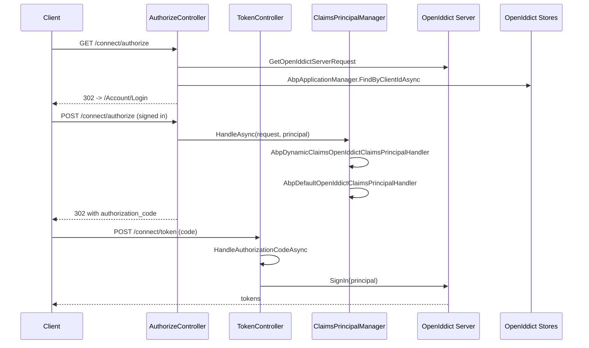

`Volo.Abp.OpenIddict.AspNetCore` is the host-facing layer of the
OpenIddict module. It is the package that an AuthServer project pulls
in, and it is what makes OpenIddict feel like an ASP.NET Core feature
rather than a bag of services: it wires the OpenIddict server pipeline
with sensible defaults, registers the `/connect/*` MVC controllers,
plugs ABP's claims principal factory into the token-emission pipeline so
that issued claims carry the right destinations, and contributes a few
ABP-specific event handlers to the OpenIddict server. Source lives under
`modules/openiddict/src/Volo.Abp.OpenIddict.AspNetCore/`. For the
higher-level guide see [/auth/openiddict-server](/auth/openiddict-server);
for what the controllers ultimately render, see
[/modules/account/web-openiddict](/modules/account/web-openiddict).

## File inventory

| Path | Purpose |
| --- | --- |
| `Volo/Abp/OpenIddict/AbpOpenIddictAspNetCoreModule.cs` | The module class; calls `AddOpenIddict().AddServer(...)`. |
| `Volo/Abp/OpenIddict/AbpOpenIddictOptions.cs` | `AbpOpenIddictAspNetCoreOptions` — two toggles. |
| `Microsoft/AspNetCore/Builder/ApplicationBuilderAbpOpenIddictMiddlewareExtension.cs` | `UseAbpOpenIddictValidation` middleware. |
| `Microsoft/Extensions/DependencyInjection/OpenIddictServerBuilderExtensions.cs` | `AddProductionEncryptionAndSigningCertificate`. |
| `Volo/Abp/OpenIddict/AbpOpenIddictHttpContextExtensions.cs` | `HttpContext.GetOpenIddictServerTransaction()`. |
| `Volo/Abp/OpenIddict/OpenIddictClaimsPrincipalContributor.cs` | `IAbpClaimsPrincipalContributor` adding `preferred_username` and `client_id`. |
| `Volo/Abp/OpenIddict/RemoveClaimsFromClientCredentialsGrantType.cs` | Event handler stripping `sub`/`preferred_username` for client-credentials grants. |
| `Volo/Abp/OpenIddict/Scopes/AttachScopes.cs` | Event handler appending discovered scopes into the discovery document. |
| `Volo/Abp/OpenIddict/Claims/IAbpOpenIddictClaimsPrincipalHandler.cs` | Pipeline interface. |
| `Volo/Abp/OpenIddict/Claims/AbpOpenIddictClaimsPrincipalManager.cs` | Runs the handler chain. |
| `Volo/Abp/OpenIddict/Claims/AbpOpenIddictClaimsPrincipalOptions.cs` | Handler list. |
| `Volo/Abp/OpenIddict/Claims/AbpDefaultOpenIddictClaimsPrincipalHandler.cs` | Sets `SetDestinations(...)` on every claim. |
| `Volo/Abp/OpenIddict/Claims/AbpDynamicClaimsOpenIddictClaimsPrincipalHandler.cs` | Calls `IAbpClaimsPrincipalFactory.CreateDynamicAsync`. |
| `Volo/Abp/OpenIddict/ExtensionGrantTypes/IExtensionGrant.cs` | Extension-grant base contract. |
| `Volo/Abp/OpenIddict/ExtensionGrantTypes/ITokenExtensionGrant.cs` | Token endpoint extension grant. |
| `Volo/Abp/OpenIddict/ExtensionGrantTypes/AbpOpenIddictExtensionGrantsOptions.cs` | Registers extension grants by name. |
| `Volo/Abp/OpenIddict/ExtensionGrantTypes/ExtensionGrantContext.cs` | Context passed into the grant. |
| `Volo/Abp/OpenIddict/Controllers/AuthorizeController.cs` | `connect/authorize` handler. |
| `Volo/Abp/OpenIddict/Controllers/TokenController.cs` | `connect/token` dispatcher. |
| `Volo/Abp/OpenIddict/Controllers/TokenController.AuthorizationCode.cs` | `authorization_code` handler. |
| `Volo/Abp/OpenIddict/Controllers/TokenController.ClientCredentials.cs` | `client_credentials` handler. |
| `Volo/Abp/OpenIddict/Controllers/TokenController.DeviceCode.cs` | `urn:ietf:params:oauth:grant-type:device_code` handler. |
| `Volo/Abp/OpenIddict/Controllers/TokenController.Password.cs` | `password` handler. |
| `Volo/Abp/OpenIddict/Controllers/TokenController.RefreshToken.cs` | `refresh_token` handler. |
| `Volo/Abp/OpenIddict/Controllers/UserInfoController.cs` | `connect/userinfo` handler. |
| `Volo/Abp/OpenIddict/Controllers/LogoutController.cs` | `connect/logout` handler. |
| `Volo/Abp/OpenIddict/Controllers/AbpOpenIdDictControllerBase.cs` | Base class with shared helpers. |
| `Volo/Abp/OpenIddict/WildcardDomains/AbpOpenIddictWildcardDomainOptions.cs` | Wildcard-host configuration. |
| `Volo/Abp/OpenIddict/WildcardDomains/AbpOpenIddictWildcardDomainBase.cs` | Base for the four wildcard validators. |
| `Volo/Abp/OpenIddict/WildcardDomains/AbpValidateClientRedirectUri.cs` | Override of `ValidateClientRedirectUri`. |
| `Volo/Abp/OpenIddict/WildcardDomains/AbpValidateRedirectUriParameter.cs` | Override of `ValidateRedirectUriParameter`. |
| `Volo/Abp/OpenIddict/WildcardDomains/AbpValidateClientPostLogoutRedirectUri.cs` | Override of `ValidateClientPostLogoutRedirectUri`. |
| `Volo/Abp/OpenIddict/WildcardDomains/AbpValidatePostLogoutRedirectUriParameter.cs` | Override of `ValidatePostLogoutRedirectUriParameter`. |
| `Volo/Abp/OpenIddict/WildcardDomains/AbpValidateAuthorizedParty.cs` | Override of `ValidateAuthorizedParty`. |

## `AbpOpenIddictAspNetCoreModule`

The module class is declarative: `[DependsOn]` brings in
the domain module, the MVC UI theme shared module (for the embedded
authorize / logout views) and the multi-tenancy module:

```csharp title="modules/openiddict/src/Volo.Abp.OpenIddict.AspNetCore/Volo/Abp/OpenIddict/AbpOpenIddictAspNetCoreModule.cs"
[DependsOn(
    typeof(AbpAspNetCoreMvcUiThemeSharedModule),
    typeof(AbpAspNetCoreMultiTenancyModule),
    typeof(AbpOpenIddictDomainModule)
)]
public class AbpOpenIddictAspNetCoreModule : AbpModule
```

`ConfigureServices` does three things — adds the OpenIddict server,
registers the two default claims handlers and adds a Razor view
location:

```csharp title="modules/openiddict/src/Volo.Abp.OpenIddict.AspNetCore/Volo/Abp/OpenIddict/AbpOpenIddictAspNetCoreModule.cs"
public override void ConfigureServices(ServiceConfigurationContext context)
{
    AddOpenIddictServer(context.Services);

    Configure<AbpOpenIddictClaimsPrincipalOptions>(options =>
    {
        options.ClaimsPrincipalHandlers.Add<AbpDynamicClaimsOpenIddictClaimsPrincipalHandler>();
        options.ClaimsPrincipalHandlers.Add<AbpDefaultOpenIddictClaimsPrincipalHandler>();
    });

    Configure<RazorViewEngineOptions>(options =>
    {
        options.ViewLocationFormats.Add("/Volo/Abp/OpenIddict/Views/{1}/{0}.cshtml");
    });
}
```

The `RazorViewEngineOptions` line is what makes the embedded
`Authorize.cshtml` and `Logout.cshtml` accessible without overriding
them in your host project.

## `AbpOpenIddictAspNetCoreOptions`

Two toggles drive the server bootstrap:

```csharp title="modules/openiddict/src/Volo.Abp.OpenIddict.AspNetCore/Volo/Abp/OpenIddict/AbpOpenIddictOptions.cs"
public class AbpOpenIddictAspNetCoreOptions
{
    public bool UpdateAbpClaimTypes { get; set; } = true;
    public bool AddDevelopmentEncryptionAndSigningCertificate { get; set; } = true;
}
```

You set them via `PreConfigure<AbpOpenIddictAspNetCoreOptions>(...)` in
your AuthServer module's `PreConfigureServices`. The module reads them
through `services.ExecutePreConfiguredActions<AbpOpenIddictAspNetCoreOptions>()`
inside `AddOpenIddictServer`.

### What `UpdateAbpClaimTypes` does

When true, the module rewrites the constants on `AbpClaimTypes`
(`Volo.Abp.Security.Claims`) so that the rest of the framework reads its
claims using OpenIddict's standard names:

```csharp title="modules/openiddict/src/Volo.Abp.OpenIddict.AspNetCore/Volo/Abp/OpenIddict/AbpOpenIddictAspNetCoreModule.cs"
if (builderOptions.UpdateAbpClaimTypes)
{
    AbpClaimTypes.UserId               = OpenIddictConstants.Claims.Subject;
    AbpClaimTypes.Role                 = OpenIddictConstants.Claims.Role;
    AbpClaimTypes.UserName             = OpenIddictConstants.Claims.PreferredUsername;
    AbpClaimTypes.Name                 = OpenIddictConstants.Claims.GivenName;
    AbpClaimTypes.SurName              = OpenIddictConstants.Claims.FamilyName;
    AbpClaimTypes.PhoneNumber          = OpenIddictConstants.Claims.PhoneNumber;
    AbpClaimTypes.PhoneNumberVerified  = OpenIddictConstants.Claims.PhoneNumberVerified;
    AbpClaimTypes.Email                = OpenIddictConstants.Claims.Email;
    AbpClaimTypes.EmailVerified        = OpenIddictConstants.Claims.EmailVerified;
    AbpClaimTypes.ClientId             = OpenIddictConstants.Claims.ClientId;
}
```

Disable it only if you have an existing application that already reads
claims under the legacy ASP.NET Core names.

### What `AddDevelopmentEncryptionAndSigningCertificate` does

When true, the bootstrap registers OpenIddict's auto-generated
ephemeral certificates so that the server runs out of the box on a
developer machine:

```csharp
builder
    .AddDevelopmentEncryptionCertificate()
    .AddDevelopmentSigningCertificate();
```

For production you call the helper extension:

```csharp title="modules/openiddict/src/Volo.Abp.OpenIddict.AspNetCore/Microsoft/Extensions/DependencyInjection/OpenIddictServerBuilderExtensions.cs"
public static class OpenIddictServerBuilderExtensions
{
    public static OpenIddictServerBuilder AddProductionEncryptionAndSigningCertificate(this OpenIddictServerBuilder builder, string fileName, string passPhrase)
    {
        if (!File.Exists(fileName))
        {
            throw new FileNotFoundException($"Signing Certificate couldn't found: {fileName}");
        }

        var certificate = new X509Certificate2(fileName, passPhrase);
        builder.AddSigningCertificate(certificate);
        builder.AddEncryptionCertificate(certificate);
        return builder;
    }
}
```

Pair this with `PreConfigure<AbpOpenIddictAspNetCoreOptions>(o =>
o.AddDevelopmentEncryptionAndSigningCertificate = false)` and call
`AddProductionEncryptionAndSigningCertificate` inside a
`PreConfigure<OpenIddictServerBuilder>` block.

## Endpoint configuration

`AddOpenIddictServer` enables all the standard endpoints and grant
flows. The endpoint paths are hard-coded so that they line up with the
controllers shipped in this same project:

```csharp title="modules/openiddict/src/Volo.Abp.OpenIddict.AspNetCore/Volo/Abp/OpenIddict/AbpOpenIddictAspNetCoreModule.cs"
builder
    .SetAuthorizationEndpointUris("connect/authorize", "connect/authorize/callback")
    .SetDeviceEndpointUris("device")
    .SetIntrospectionEndpointUris("connect/introspect")
    .SetLogoutEndpointUris("connect/logout")
    .SetRevocationEndpointUris("connect/revocat")
    .SetTokenEndpointUris("connect/token")
    .SetUserinfoEndpointUris("connect/userinfo")
    .SetVerificationEndpointUris("connect/verify");
```

| Endpoint | Path |
| --- | --- |
| Authorization | `/connect/authorize`, `/connect/authorize/callback` |
| Device | `/device` |
| Introspection | `/connect/introspect` |
| Logout | `/connect/logout` |
| Revocation | `/connect/revocat` |
| Token | `/connect/token` |
| Userinfo | `/connect/userinfo` |
| Verification | `/connect/verify` |

<Note>
The revocation path is `/connect/revocat` (not `/connect/revocation`)
because that is what the module currently registers — this is unusual
but intentional; clients calling the revocation endpoint must use this
path.
</Note>

## Grant flows enabled

All seven OpenIddict-supported grant flows are enabled by the bootstrap:

```csharp title="modules/openiddict/src/Volo.Abp.OpenIddict.AspNetCore/Volo/Abp/OpenIddict/AbpOpenIddictAspNetCoreModule.cs"
builder
    .AllowAuthorizationCodeFlow()
    .AllowHybridFlow()
    .AllowImplicitFlow()
    .AllowPasswordFlow()
    .AllowClientCredentialsFlow()
    .AllowRefreshTokenFlow()
    .AllowDeviceCodeFlow()
    .AllowNoneFlow();
```

You constrain which grants a particular client can use by setting the
`Permissions` JSON column on `OpenIddictApplication` (e.g.
`oidc/gt:authorization_code`, `oidc/gt:refresh_token`); the bootstrap
allowing a flow only opens it to clients that have been granted that
permission.

### Standard scopes

```csharp
builder.RegisterScopes(new[]
{
    OpenIddictConstants.Scopes.OpenId,
    OpenIddictConstants.Scopes.Email,
    OpenIddictConstants.Scopes.Profile,
    OpenIddictConstants.Scopes.Phone,
    OpenIddictConstants.Scopes.Roles,
    OpenIddictConstants.Scopes.Address,
    OpenIddictConstants.Scopes.OfflineAccess
});
```

Custom scopes that you seed into `OpenIddictScopes` are surfaced into
the OIDC discovery document by the `AttachScopes` event handler — see
below.

### ASP.NET Core integration

```csharp
builder.UseAspNetCore()
    .EnableAuthorizationEndpointPassthrough()
    .EnableTokenEndpointPassthrough()
    .EnableUserinfoEndpointPassthrough()
    .EnableLogoutEndpointPassthrough()
    .EnableVerificationEndpointPassthrough()
    .EnableStatusCodePagesIntegration();

builder.DisableAccessTokenEncryption();
```

`Enable*Passthrough` lets the MVC controllers see the requests; the
default OpenIddict pipeline would short-circuit and return a JSON
response itself. `DisableAccessTokenEncryption()` switches access
tokens from the default JWE-wrapped form to plain JWTs so that downstream
APIs can validate them without sharing the encryption key.

## Custom OpenIddict event handlers

The module contributes two `IOpenIddictServerHandler` implementations to
the server pipeline.

### `RemoveClaimsFromClientCredentialsGrantType`

Strips the user-bound `sub` and `preferred_username` claims when the
grant is `client_credentials` — because no user is involved:

```csharp title="modules/openiddict/src/Volo.Abp.OpenIddict.AspNetCore/Volo/Abp/OpenIddict/RemoveClaimsFromClientCredentialsGrantType.cs"
public class RemoveClaimsFromClientCredentialsGrantType : IOpenIddictServerHandler<OpenIddictServerEvents.ProcessSignInContext>
{
    public static OpenIddictServerHandlerDescriptor Descriptor { get; }
        = OpenIddictServerHandlerDescriptor.CreateBuilder<OpenIddictServerEvents.ProcessSignInContext>()
            .AddFilter<OpenIddictServerHandlerFilters.RequireAccessTokenGenerated>()
            .UseSingletonHandler<RemoveClaimsFromClientCredentialsGrantType>()
            .SetOrder(OpenIddictServerHandlers.PrepareAccessTokenPrincipal.Descriptor.Order - 1)
            .SetType(OpenIddictServerHandlerType.Custom)
            .Build();

    public virtual ValueTask HandleAsync(OpenIddictServerEvents.ProcessSignInContext context)
    {
        if (context.Request.IsClientCredentialsGrantType())
        {
            if (context.Principal != null)
            {
                context.Principal.RemoveClaims(OpenIddictConstants.Claims.Subject);
                context.Principal.RemoveClaims(OpenIddictConstants.Claims.PreferredUsername);
            }
        }

        return default;
    }
}
```

### `AttachScopes`

Adds every scope from `IOpenIddictScopeRepository` to the discovery
document, so that the `scopes_supported` array reflects the database
state and not just the hard-coded list above:

```csharp title="modules/openiddict/src/Volo.Abp.OpenIddict.AspNetCore/Volo/Abp/OpenIddict/Scopes/AttachScopes.cs"
public class AttachScopes : IOpenIddictServerHandler<OpenIddictServerEvents.HandleConfigurationRequestContext>
{
    /* descriptor omitted */
    public virtual async ValueTask HandleAsync(OpenIddictServerEvents.HandleConfigurationRequestContext context)
    {
        var scopes = await _scopeRepository.GetListAsync();
        context.Scopes.UnionWith(scopes.Select(x => x.Name));
    }
}
```

## Claim destination pipeline

When a controller calls `SignIn(principal)` to issue tokens, OpenIddict
reads the `Destinations` property of every claim on the principal and
decides whether the claim is written to the access token, the identity
token or both. ABP ships a small handler pipeline so that you can hook
into this decision without overriding the controllers.

### `AbpOpenIddictClaimsPrincipalManager`

The manager iterates over the handlers configured through
`AbpOpenIddictClaimsPrincipalOptions.ClaimsPrincipalHandlers`:

```csharp title="modules/openiddict/src/Volo.Abp.OpenIddict.AspNetCore/Volo/Abp/OpenIddict/Claims/AbpOpenIddictClaimsPrincipalManager.cs"
public class AbpOpenIddictClaimsPrincipalManager : ISingletonDependency
{
    public virtual async Task HandleAsync(OpenIddictRequest openIddictRequest, ClaimsPrincipal principal)
    {
        using (var scope = ServiceScopeFactory.CreateScope())
        {
            foreach (var providerType in Options.Value.ClaimsPrincipalHandlers)
            {
                var provider = (IAbpOpenIddictClaimsPrincipalHandler)scope.ServiceProvider.GetRequiredService(providerType);
                await provider.HandleAsync(new AbpOpenIddictClaimsPrincipalHandlerContext(scope.ServiceProvider, openIddictRequest, principal));
            }
        }
    }
}
```

The options register two handlers by default:

```csharp
options.ClaimsPrincipalHandlers.Add<AbpDynamicClaimsOpenIddictClaimsPrincipalHandler>();
options.ClaimsPrincipalHandlers.Add<AbpDefaultOpenIddictClaimsPrincipalHandler>();
```

### `AbpDynamicClaimsOpenIddictClaimsPrincipalHandler`

Runs first and delegates to ABP's `IAbpClaimsPrincipalFactory` so that
any contributor registered against the framework (for example,
`CurrentTenantClaimsPrincipalContributor`) gets a chance to add claims:

```csharp title="modules/openiddict/src/Volo.Abp.OpenIddict.AspNetCore/Volo/Abp/OpenIddict/Claims/AbpDynamicClaimsOpenIddictClaimsPrincipalHandler.cs"
public class AbpDynamicClaimsOpenIddictClaimsPrincipalHandler : IAbpOpenIddictClaimsPrincipalHandler, ITransientDependency
{
    public virtual async Task HandleAsync(AbpOpenIddictClaimsPrincipalHandlerContext context)
    {
        var abpClaimsPrincipalFactory = context
            .ScopeServiceProvider
            .GetRequiredService<IAbpClaimsPrincipalFactory>();

        await abpClaimsPrincipalFactory.CreateDynamicAsync(context.Principal);
    }
}
```

### `AbpDefaultOpenIddictClaimsPrincipalHandler`

Runs second and sets the destination of every claim. The logic recognises
the standard OIDC claims and respects the scopes requested by the
client:

```csharp title="modules/openiddict/src/Volo.Abp.OpenIddict.AspNetCore/Volo/Abp/OpenIddict/Claims/AbpDefaultOpenIddictClaimsPrincipalHandler.cs"
foreach (var claim in context.Principal.Claims)
{
    if (claim.Type == AbpClaimTypes.TenantId)
    {
        claim.SetDestinations(OpenIddictConstants.Destinations.AccessToken, OpenIddictConstants.Destinations.IdentityToken);
        continue;
    }

    switch (claim.Type)
    {
        case OpenIddictConstants.Claims.PreferredUsername:
            claim.SetDestinations(OpenIddictConstants.Destinations.AccessToken);
            if (context.Principal.HasScope(OpenIddictConstants.Scopes.Profile))
            {
                claim.SetDestinations(OpenIddictConstants.Destinations.AccessToken, OpenIddictConstants.Destinations.IdentityToken);
            }
            break;

        case OpenIddictConstants.Claims.Email:
            claim.SetDestinations(OpenIddictConstants.Destinations.AccessToken);
            if (context.Principal.HasScope(OpenIddictConstants.Scopes.Email))
            {
                claim.SetDestinations(OpenIddictConstants.Destinations.AccessToken, OpenIddictConstants.Destinations.IdentityToken);
            }
            break;

        case OpenIddictConstants.Claims.Role:
            claim.SetDestinations(OpenIddictConstants.Destinations.AccessToken);
            if (context.Principal.HasScope(OpenIddictConstants.Scopes.Roles))
            {
                claim.SetDestinations(OpenIddictConstants.Destinations.AccessToken, OpenIddictConstants.Destinations.IdentityToken);
            }
            break;

        default:
            // Never include the security stamp in the access and identity tokens, as it's a secret value.
            if (claim.Type != securityStampClaimType)
            {
                claim.SetDestinations(OpenIddictConstants.Destinations.AccessToken);
            }
            break;
    }
}
```

The implication is that — by default — every non-security-stamp claim
ends up in the access token, while the identity token only carries the
claims associated with the scopes the client requested.

### Adding your own handler

```csharp title="MyAuthServerModule.cs"
public override void ConfigureServices(ServiceConfigurationContext context)
{
    Configure<AbpOpenIddictClaimsPrincipalOptions>(options =>
    {
        options.ClaimsPrincipalHandlers.Add<MyTenantNameClaimsHandler>();
    });
}
```

A custom handler implements `IAbpOpenIddictClaimsPrincipalHandler`:

```csharp title="modules/openiddict/src/Volo.Abp.OpenIddict.AspNetCore/Volo/Abp/OpenIddict/Claims/IAbpOpenIddictClaimsPrincipalHandler.cs"
public interface IAbpOpenIddictClaimsPrincipalHandler
{
    Task HandleAsync(AbpOpenIddictClaimsPrincipalHandlerContext context);
}
```

The context exposes the request, the scoped service provider and the
mutable `ClaimsPrincipal`:

```csharp title="modules/openiddict/src/Volo.Abp.OpenIddict.AspNetCore/Volo/Abp/OpenIddict/Claims/AbpOpenIddictClaimsPrincipalHandlerContext.cs"
public class AbpOpenIddictClaimsPrincipalHandlerContext
{
    public IServiceProvider ScopeServiceProvider { get; }
    public OpenIddictRequest OpenIddictRequest { get; }
    public ClaimsPrincipal Principal { get;}
}
```

## `OpenIddictClaimsPrincipalContributor`

This ABP-framework contributor — separate from the handler chain above —
runs whenever ABP builds a `ClaimsPrincipal`. It copies the
`UserNameClaimType` into both `preferred_username` and `unique_name`,
and pulls the `client_id` from the in-flight OpenIddict request when one
is available:

```csharp title="modules/openiddict/src/Volo.Abp.OpenIddict.AspNetCore/Volo/Abp/OpenIddict/OpenIddictClaimsPrincipalContributor.cs"
public class OpenIddictClaimsPrincipalContributor : IAbpClaimsPrincipalContributor, ITransientDependency
{
    public Task ContributeAsync(AbpClaimsPrincipalContributorContext context)
    {
        var identity = context.ClaimsPrincipal.Identities.FirstOrDefault();
        if (identity != null)
        {
            var options = context.ServiceProvider.GetRequiredService<IOptions<IdentityOptions>>().Value;
            var usernameClaim = identity.FindFirst(options.ClaimsIdentity.UserNameClaimType);
            if (usernameClaim != null)
            {
                identity.AddIfNotContains(new Claim(OpenIddictConstants.Claims.PreferredUsername, usernameClaim.Value));
                identity.AddIfNotContains(new Claim(JwtRegisteredClaimNames.UniqueName, usernameClaim.Value));
            }

            var httpContext = context.ServiceProvider.GetRequiredService<IHttpContextAccessor>().HttpContext;
            if (httpContext != null)
            {
                var clientId = httpContext.GetOpenIddictServerRequest()?.ClientId;
                if (clientId != null)
                {
                    identity.AddClaim(OpenIddictConstants.Claims.ClientId, clientId);
                }
            }
        }

        return Task.CompletedTask;
    }
}
```

## Controllers

The five `/connect/*` controllers all derive from
`AbpOpenIdDictControllerBase` and live in the
`Volo/Abp/OpenIddict/Controllers/` directory.

### `TokenController`

The token endpoint dispatches based on the grant type — the partial
class is split file-per-grant for clarity:

```csharp title="modules/openiddict/src/Volo.Abp.OpenIddict.AspNetCore/Volo/Abp/OpenIddict/Controllers/TokenController.cs"
[Route("connect/token")]
[IgnoreAntiforgeryToken]
[ApiExplorerSettings(IgnoreApi = true)]
public partial class TokenController : AbpOpenIdDictControllerBase
{
    [HttpGet, HttpPost, Produces("application/json")]
    public virtual async Task<IActionResult> HandleAsync()
    {
        var request = await GetOpenIddictServerRequestAsync(HttpContext);

        if (request.IsPasswordGrantType())          return await HandlePasswordAsync(request);
        if (request.IsAuthorizationCodeGrantType()) return await HandleAuthorizationCodeAsync(request);
        if (request.IsRefreshTokenGrantType())      return await HandleRefreshTokenAsync(request);
        if (request.IsDeviceCodeGrantType())        return await HandleDeviceCodeAsync(request);
        if (request.IsClientCredentialsGrantType()) return await HandleClientCredentialsAsync(request);

        var extensionGrantsOptions = HttpContext.RequestServices.GetRequiredService<IOptions<AbpOpenIddictExtensionGrantsOptions>>();
        var extensionTokenGrant = extensionGrantsOptions.Value.Find<ITokenExtensionGrant>(request.GrantType);
        if (extensionTokenGrant != null)
        {
            return await extensionTokenGrant.HandleAsync(new ExtensionGrantContext(HttpContext, request));
        }

        throw new AbpException(string.Format(L["TheSpecifiedGrantTypeIsNotImplemented"], request.GrantType));
    }
}
```

### Other controllers

| Controller | Route | Method | Purpose |
| --- | --- | --- | --- |
| `AuthorizeController` | `connect/authorize` | `GET/POST HandleAsync` | Runs the consent + login redirect machinery. |
| `LogoutController` | `connect/logout` | `GET/POST HandleAsync` | Renders the logout confirmation view and ends the session. |
| `UserInfoController` | `connect/userinfo` | `GET/POST HandleAsync` | Returns user claims to clients holding a valid access token. |

## Extension grants

To support a custom grant type at the token endpoint:

```csharp title="modules/openiddict/src/Volo.Abp.OpenIddict.AspNetCore/Volo/Abp/OpenIddict/ExtensionGrantTypes/ITokenExtensionGrant.cs"
public interface ITokenExtensionGrant : IExtensionGrant
{
}
```

```csharp title="modules/openiddict/src/Volo.Abp.OpenIddict.AspNetCore/Volo/Abp/OpenIddict/ExtensionGrantTypes/IExtensionGrant.cs"
public interface IExtensionGrant
{
    string Name { get; }
    Task<IActionResult> HandleAsync(ExtensionGrantContext context);
}
```

Register it through `AbpOpenIddictExtensionGrantsOptions`:

```csharp title="modules/openiddict/src/Volo.Abp.OpenIddict.AspNetCore/Volo/Abp/OpenIddict/ExtensionGrantTypes/AbpOpenIddictExtensionGrantsOptions.cs"
public class AbpOpenIddictExtensionGrantsOptions
{
    public Dictionary<string, IExtensionGrant> Grants { get; }

    public AbpOpenIddictExtensionGrantsOptions()
    {
        Grants = new Dictionary<string, IExtensionGrant>();
    }

    public TExtensionGrantType Find<TExtensionGrantType>(string name)
        where TExtensionGrantType : IExtensionGrant
    {
        return (TExtensionGrantType)Grants.FirstOrDefault(x => x.Key == name && x.Value is TExtensionGrantType).Value;
    }
}
```

`ExtensionGrantContext` carries the HTTP context and the parsed request:

```csharp title="modules/openiddict/src/Volo.Abp.OpenIddict.AspNetCore/Volo/Abp/OpenIddict/ExtensionGrantTypes/ExtensionGrantContext.cs"
public class ExtensionGrantContext
{
    public HttpContext HttpContext { get; }
    public OpenIddictRequest Request { get; }

    public ExtensionGrantContext(HttpContext httpContext, OpenIddictRequest request)
    {
        HttpContext = httpContext;
        Request = request;
    }
}
```

## Wildcard redirect URIs

The wildcard-domain feature lets a single client registration match
many subdomains — a common need for multi-tenant apps:

```csharp title="modules/openiddict/src/Volo.Abp.OpenIddict.AspNetCore/Volo/Abp/OpenIddict/WildcardDomains/AbpOpenIddictWildcardDomainOptions.cs"
public class AbpOpenIddictWildcardDomainOptions
{
    public bool EnableWildcardDomainSupport { get; set; }
    public HashSet<string> WildcardDomainsFormat { get; }

    public AbpOpenIddictWildcardDomainOptions()
    {
        WildcardDomainsFormat = new HashSet<string>();
    }
}
```

When `EnableWildcardDomainSupport` is true, the module swaps five
OpenIddict server handlers for its own — each derived from
`AbpOpenIddictWildcardDomainBase`:

```csharp title="modules/openiddict/src/Volo.Abp.OpenIddict.AspNetCore/Volo/Abp/OpenIddict/AbpOpenIddictAspNetCoreModule.cs"
builder.RemoveEventHandler(OpenIddictServerHandlers.Authentication.ValidateClientRedirectUri.Descriptor);
builder.AddEventHandler(AbpValidateClientRedirectUri.Descriptor);

builder.RemoveEventHandler(OpenIddictServerHandlers.Authentication.ValidateRedirectUriParameter.Descriptor);
builder.AddEventHandler(AbpValidateRedirectUriParameter.Descriptor);

builder.RemoveEventHandler(OpenIddictServerHandlers.Session.ValidateClientPostLogoutRedirectUri.Descriptor);
builder.AddEventHandler(AbpValidateClientPostLogoutRedirectUri.Descriptor);

builder.RemoveEventHandler(OpenIddictServerHandlers.Session.ValidatePostLogoutRedirectUriParameter.Descriptor);
builder.AddEventHandler(AbpValidatePostLogoutRedirectUriParameter.Descriptor);

builder.RemoveEventHandler(OpenIddictServerHandlers.Session.ValidateAuthorizedParty.Descriptor);
builder.AddEventHandler(AbpValidateAuthorizedParty.Descriptor);
```

The base class uses `FormattedStringValueExtracter` (from
`Volo.Abp.Text.Formatting`) to match an incoming URL against a list of
format strings like `https://{0}.mytenant.com/signin-oidc`:

```csharp title="modules/openiddict/src/Volo.Abp.OpenIddict.AspNetCore/Volo/Abp/OpenIddict/WildcardDomains/AbpOpenIddictWildcardDomainBase.cs"
protected virtual Task<bool> CheckWildcardDomainAsync(string url)
{
    foreach (var domainFormat in WildcardDomainOptions.WildcardDomainsFormat)
    {
        var extractResult = FormattedStringValueExtracter.Extract(url, domainFormat, ignoreCase: true);
        if (extractResult.IsMatch)
        {
            return Task.FromResult(true);
        }
    }
    /* additional fallback */
    return Task.FromResult(false);
}
```

You enable wildcard support with `PreConfigure` because the module
reads the options before `ConfigureServices` runs:

```csharp
PreConfigure<AbpOpenIddictWildcardDomainOptions>(options =>
{
    options.EnableWildcardDomainSupport = true;
    options.WildcardDomainsFormat.Add("https://{0}.example.com/signin-oidc");
});
```

## Validation middleware

API hosts that consume tokens issued by this server use OpenIddict's
validation module. ABP provides a thin middleware helper to make the
authenticated principal flow into `HttpContext.User`:

```csharp title="modules/openiddict/src/Volo.Abp.OpenIddict.AspNetCore/Microsoft/AspNetCore/Builder/ApplicationBuilderAbpOpenIddictMiddlewareExtension.cs"
public static IApplicationBuilder UseAbpOpenIddictValidation(this IApplicationBuilder app, string schema = OpenIddictValidationAspNetCoreDefaults.AuthenticationScheme)
{
    return app.Use(async (ctx, next) =>
    {
        if (ctx.User.Identity?.IsAuthenticated != true)
        {
            var result = await ctx.AuthenticateAsync(schema);
            if (result.Succeeded && result.Principal != null)
            {
                ctx.User = result.Principal;
            }
        }

        await next();
    });
}
```

Add this between `UseAuthentication()` and `UseAuthorization()` if the
default authentication scheme on your API is not OpenIddict's validation
scheme but you still want validated tokens to populate `User`.

## End-to-end request flow



## Where to go next

<CardGroup cols={2}>
  <Card title="Domain internals" icon="cube" href="/modules/openiddict/domain">
    Stores, managers and the four aggregates the controllers ultimately
    persist through.
  </Card>
  <Card title="Permission integration" icon="key" href="/modules/openiddict/permission-integration">
    Add permissions to OpenIddict clients via the permission-management
    module.
  </Card>
  <Card title="Server walkthrough" icon="play" href="/auth/openiddict-server">
    Higher-level guide to spinning up an AuthServer with this module.
  </Card>
  <Card title="Account UI" icon="user" href="/modules/account/web-openiddict">
    The web UI that the `connect/authorize` flow redirects to for login.
  </Card>
</CardGroup>
