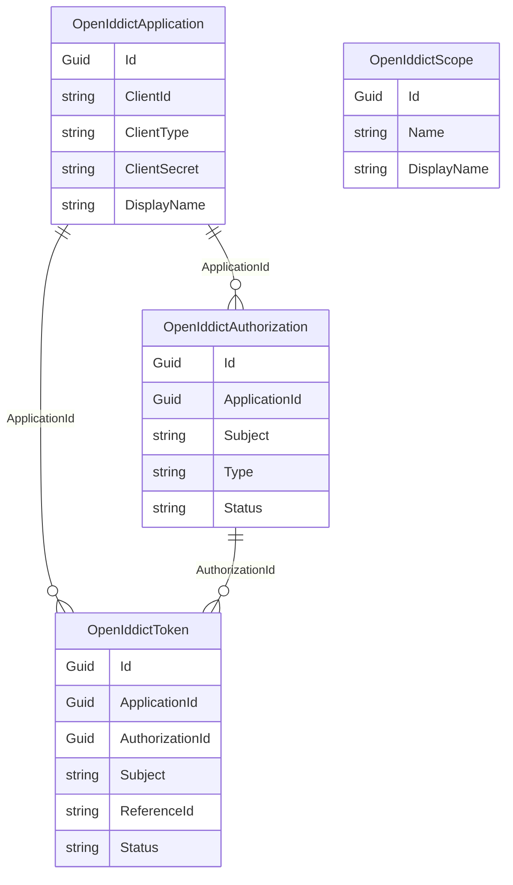

`Volo.Abp.OpenIddict.Domain` is the heart of the module. It declares the
four aggregate roots that OpenIddict needs in order to operate, defines
the repositories the persistence providers implement, and — most
importantly — replaces OpenIddict's default in-memory store and manager
types with ABP-aware subclasses that route every read and write through
ABP repositories and units of work. Because the OpenIddict server itself
talks to its abstractions (`IOpenIddictApplicationManager`,
`IOpenIddictTokenStore`, etc.) and never to the concrete types, the
replacement is transparent: from the server's point of view OpenIddict
looks exactly the same; from the database's point of view, OpenIddict
has been Abp-fied. Source for this page lives entirely under
`modules/openiddict/src/Volo.Abp.OpenIddict.Domain/`. Higher-level usage
is covered in [/auth/openiddict-server](/auth/openiddict-server); the
package map is at [/modules/openiddict/overview](/modules/openiddict/overview).

## File inventory

| Path | Type / role |
| --- | --- |
| `Volo/Abp/OpenIddict/AbpOpenIddictDomainModule.cs` | `AbpOpenIddictDomainModule` — registers stores, managers, cache and the cleanup worker. |
| `Volo/Abp/OpenIddict/AbpOpenIddictDbProperties.cs` | `AbpOpenIddictDbProperties` (DbTablePrefix, DbSchema, ConnectionStringName). |
| `Volo/Abp/OpenIddict/AbpOpenIddictIdentifierConverter.cs` | Guid ↔ string conversion used by every store and manager. |
| `Volo/Abp/OpenIddict/AbpOpenIddictStoreBase.cs` | Base class for the four `AbpOpenIddict*Store` types. |
| `Volo/Abp/OpenIddict/AbpOpenIddictCacheBase.cs` | Distributed-cache base used by the `Cache` variants of each store. |
| `Volo/Abp/OpenIddict/IOpenIddictDbConcurrencyExceptionHandler.cs` | Concurrency-handling hook (one implementation per persistence provider). |
| `Volo/Abp/OpenIddict/Applications/OpenIddictApplication.cs` | Aggregate root. |
| `Volo/Abp/OpenIddict/Applications/OpenIddictApplicationModel.cs` | OpenIddict transport DTO. |
| `Volo/Abp/OpenIddict/Applications/IOpenIddictApplicationRepository.cs` | Repository contract for the EF Core / Mongo providers. |
| `Volo/Abp/OpenIddict/Applications/AbpOpenIddictApplicationStore.cs` | `IOpenIddictApplicationStore<OpenIddictApplicationModel>` implementation. |
| `Volo/Abp/OpenIddict/Applications/IAbpOpenIdApplicationStore.cs` | ABP-specific extension to the store with `ClientUri`/`LogoUri`. |
| `Volo/Abp/OpenIddict/Applications/AbpApplicationManager.cs` | Manager subclass that calls the store and the cache. |
| `Volo/Abp/OpenIddict/Applications/IAbpApplicationManager.cs` | ABP-specific manager interface. |
| `Volo/Abp/OpenIddict/Applications/AbpApplicationDescriptor.cs` | Descriptor subclass with `ClientUri`/`LogoUri`. |
| `Volo/Abp/OpenIddict/Applications/AbpOpenIddictApplicationCache.cs` | Distributed cache implementation. |
| `Volo/Abp/OpenIddict/Authorizations/OpenIddictAuthorization.cs` | Aggregate root. |
| `Volo/Abp/OpenIddict/Authorizations/AbpAuthorizationManager.cs` | Manager subclass. |
| `Volo/Abp/OpenIddict/Authorizations/AbpOpenIddictAuthorizationStore.cs` | Store implementation. |
| `Volo/Abp/OpenIddict/Authorizations/IOpenIddictAuthorizationRepository.cs` | Repository contract. |
| `Volo/Abp/OpenIddict/Scopes/OpenIddictScope.cs` | Aggregate root. |
| `Volo/Abp/OpenIddict/Scopes/AbpScopeManager.cs` | Manager subclass. |
| `Volo/Abp/OpenIddict/Scopes/AbpOpenIddictScopeStore.cs` | Store implementation. |
| `Volo/Abp/OpenIddict/Scopes/IOpenIddictScopeRepository.cs` | Repository contract. |
| `Volo/Abp/OpenIddict/Tokens/OpenIddictToken.cs` | Aggregate root. |
| `Volo/Abp/OpenIddict/Tokens/AbpTokenManager.cs` | Manager subclass. |
| `Volo/Abp/OpenIddict/Tokens/AbpOpenIddictTokenStore.cs` | Store implementation. |
| `Volo/Abp/OpenIddict/Tokens/IOpenIddictTokenRepository.cs` | Repository contract. |
| `Volo/Abp/OpenIddict/Tokens/TokenCleanupService.cs` | Prunes expired tokens and authorizations. |
| `Volo/Abp/OpenIddict/Tokens/TokenCleanupOptions.cs` | Schedule and toggles. |
| `Volo/Abp/OpenIddict/Tokens/TokenCleanupBackgroundWorker.cs` | Distributed-lock-protected periodic worker. |

## The four aggregates

The aggregates derive from `FullAuditedAggregateRoot<Guid>` (defined by
`Volo.Abp.Ddd.Domain`), which means they automatically pick up
`CreationTime`, `CreatorId`, `LastModificationTime`,
`LastModifierId`, `IsDeleted`, `DeleterId` and `DeletionTime`. Most of
the columns are stored as JSON because OpenIddict's data model is
schemaless — the strings are written and read by the store via
`System.Text.Json`.

### `OpenIddictApplication`

```csharp title="modules/openiddict/src/Volo.Abp.OpenIddict.Domain/Volo/Abp/OpenIddict/Applications/OpenIddictApplication.cs"
public class OpenIddictApplication : FullAuditedAggregateRoot<Guid>
{
    public virtual string ApplicationType { get; set; }
    public virtual string ClientId { get; set; }
    public virtual string ClientSecret { get; set; }
    public string ClientType { get; set; }
    public virtual string ConsentType { get; set; }
    public virtual string DisplayName { get; set; }
    public virtual string DisplayNames { get; set; }
    public virtual string JsonWebKeySet { get; set; }
    public virtual string Permissions { get; set; }
    public virtual string PostLogoutRedirectUris { get; set; }
    public virtual string Properties { get; set; }
    public virtual string RedirectUris { get; set; }
    public virtual string Requirements { get; set; }
    public virtual string Settings { get; set; }
    public string ClientUri { get; set; }
    public string LogoUri { get; set; }
}
```

`ClientUri` and `LogoUri` are ABP-specific extensions to the OpenIddict
schema; they are surfaced through `IAbpOpenIdApplicationStore` and
`IAbpApplicationManager`.

### `OpenIddictAuthorization`

```csharp title="modules/openiddict/src/Volo.Abp.OpenIddict.Domain/Volo/Abp/OpenIddict/Authorizations/OpenIddictAuthorization.cs"
public class OpenIddictAuthorization : FullAuditedAggregateRoot<Guid>
{
    public virtual Guid? ApplicationId { get; set; }
    public virtual DateTime? CreationDate { get; set; }
    public virtual string Properties { get; set; }
    public virtual string Scopes { get; set; }
    public virtual string Status { get; set; }
    public virtual string Subject { get; set; }
    public virtual string Type { get; set; }
}
```

### `OpenIddictScope`

```csharp title="modules/openiddict/src/Volo.Abp.OpenIddict.Domain/Volo/Abp/OpenIddict/Scopes/OpenIddictScope.cs"
public class OpenIddictScope : FullAuditedAggregateRoot<Guid>
{
    public virtual string Description { get; set; }
    public virtual string Descriptions { get; set; }
    public virtual string DisplayName { get; set; }
    public virtual string DisplayNames { get; set; }
    public virtual string Name { get; set; }
    public virtual string Properties { get; set; }
    public virtual string Resources { get; set; }
}
```

### `OpenIddictToken`

```csharp title="modules/openiddict/src/Volo.Abp.OpenIddict.Domain/Volo/Abp/OpenIddict/Tokens/OpenIddictToken.cs"
public class OpenIddictToken : FullAuditedAggregateRoot<Guid>
{
    public virtual Guid? ApplicationId { get; set; }
    public virtual Guid? AuthorizationId { get; set; }
    public virtual DateTime? CreationDate { get; set; }
    public virtual DateTime? ExpirationDate { get; set; }
    public virtual string Payload { get; set; }
    public virtual string Properties { get; set; }
    public virtual DateTime? RedemptionDate { get; set; }
    public virtual string ReferenceId { get; set; }
    public virtual string Status { get; set; }
    public virtual string Subject { get; set; }
    public virtual string Type { get; set; }
}
```

### ERD

The application is the root; authorizations and tokens are both
children, and tokens may also belong to an authorization:



`OpenIddictScope` is intentionally disconnected — scopes are referenced
by name from the JSON columns on applications and authorizations, not by
foreign key, exactly mirroring OpenIddict's own data model.

## Repository contracts

Each aggregate has an `IOpenIddict*Repository` that extends
`IBasicRepository<TEntity, Guid>` with the lookup methods the OpenIddict
stores need. The EF Core and MongoDB projects implement these.

```csharp title="modules/openiddict/src/Volo.Abp.OpenIddict.Domain/Volo/Abp/OpenIddict/Applications/IOpenIddictApplicationRepository.cs"
public interface IOpenIddictApplicationRepository : IBasicRepository<OpenIddictApplication, Guid>
{
    Task<List<OpenIddictApplication>> GetListAsync(string sorting, int skipCount, int maxResultCount, string filter = null, CancellationToken cancellationToken = default);
    Task<long> GetCountAsync(string filter = null, CancellationToken cancellationToken = default);
    Task<OpenIddictApplication> FindByClientIdAsync(string clientId, CancellationToken cancellationToken = default);
    Task<List<OpenIddictApplication>> FindByPostLogoutRedirectUriAsync(string address, CancellationToken cancellationToken = default);
    Task<List<OpenIddictApplication>> FindByRedirectUriAsync(string address, CancellationToken cancellationToken = default);
    Task<List<OpenIddictApplication>> ListAsync(int? count, int? offset, CancellationToken cancellationToken = default);
}
```

```csharp title="modules/openiddict/src/Volo.Abp.OpenIddict.Domain/Volo/Abp/OpenIddict/Authorizations/IOpenIddictAuthorizationRepository.cs"
public interface IOpenIddictAuthorizationRepository : IBasicRepository<OpenIddictAuthorization, Guid>
{
    Task<List<OpenIddictAuthorization>> FindAsync(string subject, Guid client, CancellationToken cancellationToken = default);
    Task<List<OpenIddictAuthorization>> FindAsync(string subject, Guid client, string status, CancellationToken cancellationToken = default);
    Task<List<OpenIddictAuthorization>> FindAsync(string subject, Guid client, string status, string type, CancellationToken cancellationToken = default);
    Task<List<OpenIddictAuthorization>> FindByApplicationIdAsync(Guid applicationId, CancellationToken cancellationToken = default);
    Task<OpenIddictAuthorization> FindByIdAsync(Guid id, CancellationToken cancellationToken = default);
    Task<List<OpenIddictAuthorization>> FindBySubjectAsync(string subject, CancellationToken cancellationToken = default);
    Task<List<OpenIddictAuthorization>> ListAsync(int? count, int? offset, CancellationToken cancellationToken = default);
    Task<long> PruneAsync(DateTime date, CancellationToken cancellationToken = default);
}
```

The `PruneAsync` method on the authorization and token repositories is
what `TokenCleanupService` calls under the hood. Note the explicit
`Guid client` parameter — IDs are passed in their native form to the
repository even though OpenIddict treats them as strings at the
abstraction level; the `AbpOpenIddictIdentifierConverter` converts
between the two:

```csharp title="modules/openiddict/src/Volo.Abp.OpenIddict.Domain/Volo/Abp/OpenIddict/AbpOpenIddictIdentifierConverter.cs"
public class AbpOpenIddictIdentifierConverter : ITransientDependency
{
    public virtual Guid FromString(string identifier)
    {
        return string.IsNullOrEmpty(identifier) ? default : Guid.Parse(identifier);
    }

    public virtual string ToString(Guid identifier)
    {
        return identifier.ToString("D");
    }
}
```

## Stores

OpenIddict's manager talks to four store interfaces:
`IOpenIddictApplicationStore<TApplication>`,
`IOpenIddictAuthorizationStore<TAuthorization>`,
`IOpenIddictScopeStore<TScope>` and
`IOpenIddictTokenStore<TToken>`. The ABP module supplies a concrete
implementation of each, parameterised on the matching `*Model` transport
type:

| Store interface | ABP implementation |
| --- | --- |
| `IAbpOpenIdApplicationStore : IOpenIddictApplicationStore<OpenIddictApplicationModel>` | `AbpOpenIddictApplicationStore` |
| `IOpenIddictAuthorizationStore<OpenIddictAuthorizationModel>` | `AbpOpenIddictAuthorizationStore` |
| `IOpenIddictScopeStore<OpenIddictScopeModel>` | `AbpOpenIddictScopeStore` |
| `IOpenIddictTokenStore<OpenIddictTokenModel>` | `AbpOpenIddictTokenStore` |

They share a common base class that handles repository plumbing, ID
conversion, unit-of-work resolution, GUID generation and the concurrency
exception hook:

```csharp title="modules/openiddict/src/Volo.Abp.OpenIddict.Domain/Volo/Abp/OpenIddict/AbpOpenIddictStoreBase.cs"
public abstract class AbpOpenIddictStoreBase<TRepository>
    where TRepository : IRepository
{
    public ILogger<AbpOpenIddictStoreBase<TRepository>> Logger { get; set; }

    protected TRepository Repository { get; }
    protected IUnitOfWorkManager UnitOfWorkManager { get; }
    protected IGuidGenerator GuidGenerator { get; }
    protected AbpOpenIddictIdentifierConverter IdentifierConverter { get; }
    protected IOpenIddictDbConcurrencyExceptionHandler ConcurrencyExceptionHandler { get; }

    protected AbpOpenIddictStoreBase(
        TRepository repository,
        IUnitOfWorkManager unitOfWorkManager,
        IGuidGenerator guidGenerator,
        AbpOpenIddictIdentifierConverter identifierConverter,
        IOpenIddictDbConcurrencyExceptionHandler concurrencyExceptionHandler)
    { /* ... */ }

    protected virtual Guid ConvertIdentifierFromString(string identifier) => IdentifierConverter.FromString(identifier);
    protected virtual string ConvertIdentifierToString(Guid identifier) => IdentifierConverter.ToString(identifier);
}
```

`IOpenIddictDbConcurrencyExceptionHandler.HandleAsync` lets the provider
translate an `AbpDbConcurrencyException` into the
`OpenIddictExceptions.ConcurrencyException` that the OpenIddict server
expects:

```csharp title="modules/openiddict/src/Volo.Abp.OpenIddict.Domain/Volo/Abp/OpenIddict/IOpenIddictDbConcurrencyExceptionHandler.cs"
public interface IOpenIddictDbConcurrencyExceptionHandler
{
    Task HandleAsync(AbpDbConcurrencyException exception);
}
```

The EF Core implementation lives in
`modules/openiddict/src/Volo.Abp.OpenIddict.EntityFrameworkCore/Volo/Abp/OpenIddict/EfCoreOpenIddictDbConcurrencyExceptionHandler.cs`
and the MongoDB implementation in
`modules/openiddict/src/Volo.Abp.OpenIddict.MongoDB/Volo/Abp/OpenIddict/MongoOpenIddictDbConcurrencyExceptionHandler.cs`.

### The application store

`AbpOpenIddictApplicationStore` is the biggest of the four stores
(~650 lines). It implements every method on
`IOpenIddictApplicationStore<OpenIddictApplicationModel>` plus the two
ABP-specific accessors:

```csharp title="modules/openiddict/src/Volo.Abp.OpenIddict.Domain/Volo/Abp/OpenIddict/Applications/IAbpOpenIdApplicationStore.cs"
public interface IAbpOpenIdApplicationStore : IOpenIddictApplicationStore<OpenIddictApplicationModel>
{
    ValueTask<string> GetClientUriAsync(OpenIddictApplicationModel application, CancellationToken cancellationToken = default);
    ValueTask<string> GetLogoUriAsync(OpenIddictApplicationModel application, CancellationToken cancellationToken = default);
}
```

The store also takes a reference to `IOpenIddictTokenRepository` so that
`DeleteAsync(application)` can cascade-delete the tokens that belong to
that application — there is no FK-on-delete in the schema because that
would couple the persistence providers together.

### Cache wrappers

Each store has a `Cache` counterpart implementing the matching
`IOpenIddict*Cache<TModel>` interface. The common base is:

```csharp title="modules/openiddict/src/Volo.Abp.OpenIddict.Domain/Volo/Abp/OpenIddict/AbpOpenIddictCacheBase.cs"
public class AbpOpenIddictCacheBase<TEntity, TModel, TStore>
    where TModel : class
    where TEntity : class
{
    public ILogger<AbpOpenIddictCacheBase<TEntity, TModel, TStore>> Logger { get; set; }
    protected IDistributedCache<TModel> Cache { get; }
    protected IDistributedCache<TModel[]> ArrayCache { get; }
    protected TStore Store { get; }
    /* ... */
}
```

Each subclass — `AbpOpenIddictApplicationCache`,
`AbpOpenIddictAuthorizationCache`, `AbpOpenIddictScopeCache`,
`AbpOpenIddictTokenCache` — uses `IDistributedCache<TModel>` from
`Volo.Abp.Caching`. The cache lookup keys are `nameof(method)_value`,
for example `FindByClientIdAsync_my-client-id`.

## Managers

The four ABP manager classes extend OpenIddict's built-in managers and
inject `AbpOpenIddictIdentifierConverter` so that they can locate the
matching entity from a string identifier. The `UpdateAsync` override
explicitly invalidates the cached copy before delegating to the base
implementation:

```csharp title="modules/openiddict/src/Volo.Abp.OpenIddict.Domain/Volo/Abp/OpenIddict/Authorizations/AbpAuthorizationManager.cs"
public class AbpAuthorizationManager : OpenIddictAuthorizationManager<OpenIddictAuthorizationModel>
{
    protected AbpOpenIddictIdentifierConverter IdentifierConverter { get; }
    /* ctor omitted */

    public async override ValueTask UpdateAsync(OpenIddictAuthorizationModel authorization, CancellationToken cancellationToken = default)
    {
        if (!Options.CurrentValue.DisableEntityCaching)
        {
            var entity = await Store.FindByIdAsync(IdentifierConverter.ToString(authorization.Id), cancellationToken);
            if (entity != null)
            {
                await Cache.RemoveAsync(entity, cancellationToken);
            }
        }

        await base.UpdateAsync(authorization, cancellationToken);
    }
}
```

`AbpScopeManager` and `AbpTokenManager` have identical shape. The
application manager additionally implements an ABP-specific contract:

```csharp title="modules/openiddict/src/Volo.Abp.OpenIddict.Domain/Volo/Abp/OpenIddict/Applications/IAbpApplicationManager.cs"
public interface IAbpApplicationManager : IOpenIddictApplicationManager
{
    ValueTask<string> GetClientUriAsync(object application, CancellationToken cancellationToken = default);
    ValueTask<string> GetLogoUriAsync(object application, CancellationToken cancellationToken = default);
}
```

It also overrides `PopulateAsync` in both directions so that the
`ClientUri` / `LogoUri` round-trip through `AbpApplicationDescriptor`:

```csharp title="modules/openiddict/src/Volo.Abp.OpenIddict.Domain/Volo/Abp/OpenIddict/Applications/AbpApplicationManager.cs"
public async override ValueTask PopulateAsync(OpenIddictApplicationDescriptor descriptor, OpenIddictApplicationModel application, CancellationToken cancellationToken = default)
{
    await base.PopulateAsync(descriptor, application, cancellationToken);

    if (descriptor is AbpApplicationDescriptor model)
    {
        model.ClientUri = application.ClientUri;
        model.LogoUri = application.LogoUri;
    }
}
```

## How the domain module wires everything

`AbpOpenIddictDomainModule.ConfigureServices` is the single registration
point. It calls `services.AddOpenIddict().AddCore(...)` and then swaps
the four entity types, the four stores and the four managers:

```csharp title="modules/openiddict/src/Volo.Abp.OpenIddict.Domain/Volo/Abp/OpenIddict/AbpOpenIddictDomainModule.cs"
private void AddOpenIddictCore(IServiceCollection services)
{
    var openIddictBuilder = services.AddOpenIddict()
        .AddCore(builder =>
        {
            builder
                .SetDefaultApplicationEntity<OpenIddictApplicationModel>()
                .SetDefaultAuthorizationEntity<OpenIddictAuthorizationModel>()
                .SetDefaultScopeEntity<OpenIddictScopeModel>()
                .SetDefaultTokenEntity<OpenIddictTokenModel>();

            builder
                .AddApplicationStore<AbpOpenIddictApplicationStore>()
                .AddAuthorizationStore<AbpOpenIddictAuthorizationStore>()
                .AddScopeStore<AbpOpenIddictScopeStore>()
                .AddTokenStore<AbpOpenIddictTokenStore>();

            builder.ReplaceApplicationManager(typeof(AbpApplicationManager));
            builder.ReplaceAuthorizationManager(typeof(AbpAuthorizationManager));
            builder.ReplaceScopeManager(typeof(AbpScopeManager));
            builder.ReplaceTokenManager(typeof(AbpTokenManager));

            builder.Services.TryAddScoped(provider =>
                (IAbpApplicationManager)provider.GetRequiredService<IOpenIddictApplicationManager>());

            services.ExecutePreConfiguredActions(builder);
        });

    services.ExecutePreConfiguredActions(openIddictBuilder);
}
```

The `TryAddScoped(provider => (IAbpApplicationManager)...)` line is the
mechanism that exposes the ABP-specific `IAbpApplicationManager` to your
application services without you having to register a second instance.

`PostConfigureServices` calls
`ModuleExtensionConfigurationHelper.ApplyEntityConfigurationToEntity`
eight times to make the four aggregates and their `*Model` mirrors aware
of any object-extension properties configured via
`OneTimeRunner`-protected initialization.

## Token cleanup

The module ships a background worker that prunes expired tokens and
ad-hoc authorizations on a schedule. It is registered conditionally in
`OnApplicationInitializationAsync`:

```csharp title="modules/openiddict/src/Volo.Abp.OpenIddict.Domain/Volo/Abp/OpenIddict/AbpOpenIddictDomainModule.cs"
public async override Task OnApplicationInitializationAsync(ApplicationInitializationContext context)
{
    var options = context.ServiceProvider.GetRequiredService<IOptions<TokenCleanupOptions>>().Value;
    if (options.IsCleanupEnabled)
    {
        await context.ServiceProvider
            .GetRequiredService<IBackgroundWorkerManager>()
            .AddAsync(context.ServiceProvider.GetRequiredService<TokenCleanupBackgroundWorker>());
    }
}
```

The options:

```csharp title="modules/openiddict/src/Volo.Abp.OpenIddict.Domain/Volo/Abp/OpenIddict/Tokens/TokenCleanupOptions.cs"
public class TokenCleanupOptions
{
    public bool IsCleanupEnabled { get; set; } = true;
    public int CleanupPeriod { get; set; } = 3_600_000;
    public bool DisableAuthorizationPruning { get; set; }
    public bool DisableTokenPruning { get; set; }
    public TimeSpan MinimumAuthorizationLifespan { get; set; } = TimeSpan.FromDays(14);
    public TimeSpan MinimumTokenLifespan { get; set; } = TimeSpan.FromDays(14);
}
```

The worker is an `AsyncPeriodicBackgroundWorkerBase` guarded by
`IAbpDistributedLock` so that exactly one instance of the worker prunes
in a multi-pod deployment:

```csharp title="modules/openiddict/src/Volo.Abp.OpenIddict.Domain/Volo/Abp/OpenIddict/Tokens/TokenCleanupBackgroundWorker.cs"
public class TokenCleanupBackgroundWorker : AsyncPeriodicBackgroundWorkerBase
{
    protected IAbpDistributedLock DistributedLock { get; }
    /* ctor */

    protected async override Task DoWorkAsync(PeriodicBackgroundWorkerContext workerContext)
    {
        await using (var handle = await DistributedLock.TryAcquireAsync(nameof(TokenCleanupBackgroundWorker)))
        {
            if (handle != null)
            {
                await workerContext.ServiceProvider
                    .GetRequiredService<TokenCleanupService>()
                    .CleanAsync();
                return;
            }
        }
    }
}
```

`TokenCleanupService` delegates to OpenIddict's `IOpenIddictTokenManager`
and `IOpenIddictAuthorizationManager`:

```csharp title="modules/openiddict/src/Volo.Abp.OpenIddict.Domain/Volo/Abp/OpenIddict/Tokens/TokenCleanupService.cs"
public virtual async Task CleanAsync()
{
    if (!CleanupOptions.DisableTokenPruning)
    {
        var threshold = DateTimeOffset.UtcNow - CleanupOptions.MinimumTokenLifespan;
        try
        {
            await TokenManager.PruneAsync(threshold);
        }
        catch (Exception exception) { Logger.LogException(exception); }
    }

    if (!CleanupOptions.DisableAuthorizationPruning)
    {
        var threshold = DateTimeOffset.UtcNow - CleanupOptions.MinimumAuthorizationLifespan;
        try
        {
            await AuthorizationManager.PruneAsync(threshold);
        }
        catch (Exception exception) { Logger.LogException(exception); }
    }
}
```

## Data seeding

Unlike many ABP modules, the OpenIddict domain module does not ship a
`Volo.Abp.IDataSeedContributor` implementation of its own — every
application has different clients and scopes, so the data seeder is
generated into your `*.Domain` project by the application template.
The template files live under
`templates/app/aspnet-core/src/MyCompanyName.MyProjectName.Domain/OpenIddict/OpenIddictDataSeedContributor.cs`
and use the ABP manager and `IOpenIddictApplicationRepository`. The
test-only `OpenIddictDataSeedContributor` at
`modules/openiddict/test/Volo.Abp.OpenIddict.TestBase/Volo/Abp/OpenIddict/OpenIddictDataSeedContributor.cs`
is a reference implementation you can copy from.

<Note>
If you do roll your own seeder, prefer `IAbpApplicationManager` (the ABP
interface) over `IOpenIddictApplicationManager` so that you can populate
`ClientUri` and `LogoUri` through `AbpApplicationDescriptor`.
</Note>

## Database property knobs

Three statics let you change the table prefix and schema without
shadowing the model builder:

```csharp title="modules/openiddict/src/Volo.Abp.OpenIddict.Domain/Volo/Abp/OpenIddict/AbpOpenIddictDbProperties.cs"
public static class AbpOpenIddictDbProperties
{
    public static string DbTablePrefix { get; set; } = "OpenIddict";
    public static string DbSchema { get; set; } = AbpCommonDbProperties.DbSchema;
    public const string ConnectionStringName = "AbpOpenIddict";
}
```

`ConnectionStringName = "AbpOpenIddict"` is what the EF Core and MongoDB
contexts are decorated with via `[ConnectionStringName]`, so it doubles
as the key to use under the `ConnectionStrings` section of
`appsettings.json` when you want to put the OpenIddict tables on a
separate database.

## Object extensions

The four aggregates participate in the ABP object-extension system
through these constants:

```csharp title="modules/openiddict/src/Volo.Abp.OpenIddict.Domain.Shared/Volo/Abp/ObjectExtending/OpenIddictModuleExtensionConsts.cs"
public class OpenIddictModuleExtensionConsts
{
    public const string ModuleName = "OpenIddict";

    public static class EntityNames
    {
        public const string Application = "Application";
        public const string Authorization = "Authorization";
        public const string Scope = "Scope";
        public const string Token = "Token";
    }
}
```

`PostConfigureServices` calls
`ApplyEntityConfigurationToEntity(ModuleName, entityName, type)` twice
for each entity — once for the aggregate and once for its
`*Model` mirror — so that any property added through
`ObjectExtensionManager.Instance.AddOrUpdateProperty<...>(...)` is
visible on both the persisted entity and the OpenIddict transport
object.

## Where to go next

<CardGroup cols={2}>
  <Card title="ASP.NET Core integration" icon="globe" href="/modules/openiddict/aspnet-core">
    Endpoints, grant flows and the claims-principal handler chain.
  </Card>
  <Card title="EF Core provider" icon="database" href="/modules/openiddict/entity-framework-core">
    `IOpenIddictDbContext`, the model-builder extension and the
    repositories.
  </Card>
  <Card title="MongoDB provider" icon="leaf" href="/modules/openiddict/mongodb">
    `IOpenIddictMongoDbContext` and its collection layout.
  </Card>
  <Card title="Permission integration" icon="key" href="/modules/openiddict/permission-integration">
    Grant permissions to OpenIddict clients via ABP's permission system.
  </Card>
</CardGroup>
