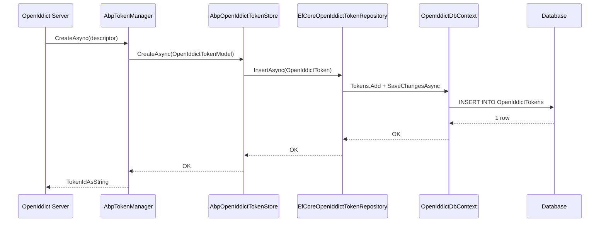

`Volo.Abp.OpenIddict.EntityFrameworkCore` is the relational-database
implementation of the four `IOpenIddict*Repository` interfaces declared
by the domain module. It contributes a `DbContext`, an
`IOpenIddictDbContext` interface that lets you reuse the same `DbSet`
shapes in your own context, a model-building extension method, four
EF Core repository classes and a concurrency-exception handler. The
project depends on `AbpOpenIddictDomainModule` and
`AbpEntityFrameworkCoreModule`; once both are loaded the OpenIddict
server reads and writes through these classes without any further
configuration. Source lives under
`modules/openiddict/src/Volo.Abp.OpenIddict.EntityFrameworkCore/`. For
the MongoDB equivalent see [/modules/openiddict/mongodb](/modules/openiddict/mongodb);
for the aggregates being persisted see
[/modules/openiddict/domain](/modules/openiddict/domain).

## File inventory

| Path | Type |
| --- | --- |
| `Volo/Abp/OpenIddict/EntityFrameworkCore/AbpOpenIddictEntityFrameworkCoreModule.cs` | Module class. |
| `Volo/Abp/OpenIddict/EntityFrameworkCore/IOpenIddictDbContext.cs` | Reusable DbContext contract. |
| `Volo/Abp/OpenIddict/EntityFrameworkCore/OpenIddictDbContext.cs` | Concrete DbContext for an isolated database. |
| `Volo/Abp/OpenIddict/EntityFrameworkCore/OpenIddictDbContextModelCreatingExtensions.cs` | `ConfigureOpenIddict` model-builder extension. |
| `Volo/Abp/OpenIddict/Applications/EfCoreOpenIddictApplicationRepository.cs` | Application repository. |
| `Volo/Abp/OpenIddict/Authorizations/EfCoreOpenIddictAuthorizationRepository.cs` | Authorization repository. |
| `Volo/Abp/OpenIddict/Scopes/EfCoreOpenIddictScopeRepository.cs` | Scope repository. |
| `Volo/Abp/OpenIddict/Tokens/EfCoreOpenIddictTokenRepository.cs` | Token repository. |
| `Volo/Abp/OpenIddict/EfCoreOpenIddictDbConcurrencyExceptionHandler.cs` | Maps EF Core concurrency exceptions to ABP's expected behaviour. |

## Module

```csharp title="modules/openiddict/src/Volo.Abp.OpenIddict.EntityFrameworkCore/Volo/Abp/OpenIddict/EntityFrameworkCore/AbpOpenIddictEntityFrameworkCoreModule.cs"
[DependsOn(
    typeof(AbpOpenIddictDomainModule),
    typeof(AbpEntityFrameworkCoreModule)
)]
public class AbpOpenIddictEntityFrameworkCoreModule : AbpModule
{
    public override void ConfigureServices(ServiceConfigurationContext context)
    {
        context.Services.AddAbpDbContext<OpenIddictDbContext>(options =>
        {
            options.AddDefaultRepositories<IOpenIddictDbContext>();

            options.AddRepository<OpenIddictApplication,   EfCoreOpenIddictApplicationRepository>();
            options.AddRepository<OpenIddictAuthorization, EfCoreOpenIddictAuthorizationRepository>();
            options.AddRepository<OpenIddictScope,         EfCoreOpenIddictScopeRepository>();
            options.AddRepository<OpenIddictToken,         EfCoreOpenIddictTokenRepository>();
        });
    }
}
```

`AddDefaultRepositories<IOpenIddictDbContext>()` opens default
`IBasicRepository<T, Guid>` registrations against any application
DbContext that implements `IOpenIddictDbContext`, while the four
`AddRepository` overloads override the basic repositories with the
specialised contracts.

## `IOpenIddictDbContext`

The interface intentionally exposes only the `DbSet<>` properties the
four EF Core repositories need. You can let your existing application
DbContext implement it instead of using the stand-alone
`OpenIddictDbContext` shipped with the module:

```csharp title="modules/openiddict/src/Volo.Abp.OpenIddict.EntityFrameworkCore/Volo/Abp/OpenIddict/EntityFrameworkCore/IOpenIddictDbContext.cs"
[IgnoreMultiTenancy]
[ConnectionStringName(AbpOpenIddictDbProperties.ConnectionStringName)]
public interface IOpenIddictDbContext : IEfCoreDbContext
{
    DbSet<OpenIddictApplication> Applications { get; }
    DbSet<OpenIddictAuthorization> Authorizations { get; }
    DbSet<OpenIddictScope> Scopes { get; }
    DbSet<OpenIddictToken> Tokens { get; }
}
```

Two attributes matter:

- `[IgnoreMultiTenancy]` — OpenIddict data is global, not per-tenant.
  ABP's `AbpDbContext` skips the data filter when it sees this
  attribute.
- `[ConnectionStringName("AbpOpenIddict")]` — lets you point the
  OpenIddict tables at a different physical database by adding an
  `AbpOpenIddict` entry under `ConnectionStrings` in
  `appsettings.json`.

## `OpenIddictDbContext`

A no-frills `AbpDbContext` that you can register as the OpenIddict
database when you do not want to merge the tables into your existing
context:

```csharp title="modules/openiddict/src/Volo.Abp.OpenIddict.EntityFrameworkCore/Volo/Abp/OpenIddict/EntityFrameworkCore/OpenIddictDbContext.cs"
[IgnoreMultiTenancy]
[ConnectionStringName(AbpOpenIddictDbProperties.ConnectionStringName)]
public class OpenIddictDbContext : AbpDbContext<OpenIddictDbContext>, IOpenIddictDbContext
{
    public DbSet<OpenIddictApplication>   Applications   { get; set; }
    public DbSet<OpenIddictAuthorization> Authorizations { get; set; }
    public DbSet<OpenIddictScope>         Scopes         { get; set; }
    public DbSet<OpenIddictToken>         Tokens         { get; set; }

    public OpenIddictDbContext(DbContextOptions<OpenIddictDbContext> options)
        : base(options)
    {
    }

    protected override void OnModelCreating(ModelBuilder builder)
    {
        base.OnModelCreating(builder);
        builder.ConfigureOpenIddict();
    }
}
```

`builder.ConfigureOpenIddict()` is the model-builder extension that does
the real work — see the next section.

### Merging into your application DbContext

Most ABP application templates put the OpenIddict tables into the main
application DbContext instead:

```csharp title="MyProjectDbContext.cs (template)"
public class MyProjectDbContext : AbpDbContext<MyProjectDbContext>,
    IIdentityProDbContext,
    IOpenIddictDbContext   // implement the interface
{
    public DbSet<OpenIddictApplication>   Applications   { get; set; }
    public DbSet<OpenIddictAuthorization> Authorizations { get; set; }
    public DbSet<OpenIddictScope>         Scopes         { get; set; }
    public DbSet<OpenIddictToken>         Tokens         { get; set; }

    protected override void OnModelCreating(ModelBuilder builder)
    {
        base.OnModelCreating(builder);
        builder.ConfigureOpenIddict();  // same call
        /* ... */
    }
}
```

Because `AddDefaultRepositories<IOpenIddictDbContext>()` opens against
the interface, the repositories pick up whichever DbContext implements
it.

## `ConfigureOpenIddict`: tables and indexes

`OpenIddictDbContextModelCreatingExtensions` configures the four
aggregates. Reading the file top to bottom, the configuration follows
exactly the same recipe for each entity: table name with prefix,
`ConfigureByConvention`, indexes, max-length constraints, object
extensions, and (for child aggregates) a non-required FK to the
parent. It also early-exits when the DbContext is a tenant-only one:

```csharp title="modules/openiddict/src/Volo.Abp.OpenIddict.EntityFrameworkCore/Volo/Abp/OpenIddict/EntityFrameworkCore/OpenIddictDbContextModelCreatingExtensions.cs"
public static void ConfigureOpenIddict(this ModelBuilder builder)
{
    Check.NotNull(builder, nameof(builder));

    if (builder.IsTenantOnlyDatabase())
    {
        return;
    }

    builder.Entity<OpenIddictApplication>(b =>
    {
        b.ToTable(AbpOpenIddictDbProperties.DbTablePrefix + "Applications", AbpOpenIddictDbProperties.DbSchema);
        b.ConfigureByConvention();

        b.HasIndex(x => x.ClientId);

        b.Property(x => x.ApplicationType).HasMaxLength(OpenIddictApplicationConsts.ApplicationTypeMaxLength);
        b.Property(x => x.ClientId).HasMaxLength(OpenIddictApplicationConsts.ClientIdMaxLength);
        b.Property(x => x.ConsentType).HasMaxLength(OpenIddictApplicationConsts.ConsentTypeMaxLength);
        b.Property(x => x.ClientType).HasMaxLength(OpenIddictApplicationConsts.ClientTypeMaxLength);

        b.ApplyObjectExtensionMappings();
    });

    builder.Entity<OpenIddictAuthorization>(b =>
    {
        b.ToTable(AbpOpenIddictDbProperties.DbTablePrefix + "Authorizations", AbpOpenIddictDbProperties.DbSchema);
        b.ConfigureByConvention();

        b.HasIndex(x => new
        {
            x.ApplicationId,
            x.Status,
            x.Subject,
            x.Type
        });

        b.Property(x => x.Status).HasMaxLength(OpenIddictAuthorizationConsts.StatusMaxLength);
        b.Property(x => x.Subject).HasMaxLength(OpenIddictAuthorizationConsts.SubjectMaxLength);
        b.Property(x => x.Type).HasMaxLength(OpenIddictAuthorizationConsts.TypeMaxLength);

        b.HasOne<OpenIddictApplication>().WithMany().HasForeignKey(x => x.ApplicationId).IsRequired(false);

        b.ApplyObjectExtensionMappings();
    });

    builder.Entity<OpenIddictScope>(b =>
    {
        b.ToTable(AbpOpenIddictDbProperties.DbTablePrefix + "Scopes", AbpOpenIddictDbProperties.DbSchema);
        b.ConfigureByConvention();

        b.HasIndex(x => x.Name);
        b.Property(x => x.Name).HasMaxLength(OpenIddictScopeConsts.NameMaxLength);

        b.ApplyObjectExtensionMappings();
    });

    builder.Entity<OpenIddictToken>(b =>
    {
        b.ToTable(AbpOpenIddictDbProperties.DbTablePrefix + "Tokens", AbpOpenIddictDbProperties.DbSchema);
        b.ConfigureByConvention();

        b.HasIndex(x => x.ReferenceId);
        b.HasIndex(x => new
        {
            x.ApplicationId,
            x.Status,
            x.Subject,
            x.Type
        });

        b.Property(x => x.ReferenceId).HasMaxLength(OpenIddictTokenConsts.ReferenceIdMaxLength);
        b.Property(x => x.Status).HasMaxLength(OpenIddictTokenConsts.StatusMaxLength);
        b.Property(x => x.Subject).HasMaxLength(OpenIddictTokenConsts.SubjectMaxLength);
        b.Property(x => x.Type).HasMaxLength(OpenIddictTokenConsts.TypeMaxLength);

        b.HasOne<OpenIddictApplication>().WithMany().HasForeignKey(x => x.ApplicationId).IsRequired(false);
        b.HasOne<OpenIddictAuthorization>().WithMany().HasForeignKey(x => x.AuthorizationId).IsRequired(false);

        b.ApplyObjectExtensionMappings();
    });
}
```

### Resulting tables

| Table | Indexes |
| --- | --- |
| `OpenIddictApplications` | `ClientId` (non-unique). |
| `OpenIddictAuthorizations` | Composite `(ApplicationId, Status, Subject, Type)`. Plus a non-required FK to `OpenIddictApplications.Id`. |
| `OpenIddictScopes` | `Name` (non-unique). |
| `OpenIddictTokens` | `ReferenceId` (non-unique) and composite `(ApplicationId, Status, Subject, Type)`. Plus non-required FKs to `OpenIddictApplications.Id` and `OpenIddictAuthorizations.Id`. |

The FK comments above are exactly what
`b.HasOne<…>().WithMany().HasForeignKey(…).IsRequired(false)` produces
— non-required because OpenIddict allows dangling references for
ad-hoc tokens.

<Note>
The `ClientId` and `Name` indexes are deliberately **not** marked as
unique — the source code has the `.IsUnique()` line commented out for
both. If you need a uniqueness constraint, either alter the index in a
migration or call `b.HasIndex(x => x.ClientId).IsUnique()` from your
DbContext after `ConfigureOpenIddict()`.
</Note>

### Max-length constants

The max-length values come from `Volo.Abp.OpenIddict.Domain.Shared`:

```csharp title="modules/openiddict/src/Volo.Abp.OpenIddict.Domain.Shared/Volo/Abp/OpenIddict/Applications/OpenIddictApplicationConsts.cs"
public class OpenIddictApplicationConsts
{
    public static int ApplicationTypeMaxLength { get; set; } = 50;
    public static int ClientIdMaxLength { get; set; } = 100;
    public static int ConsentTypeMaxLength { get; set; } = 50;
    public static int ClientTypeMaxLength { get; set; } = 50;
}
```

```csharp title="modules/openiddict/src/Volo.Abp.OpenIddict.Domain.Shared/Volo/Abp/OpenIddict/Scopes/OpenIddictScopeConsts.cs"
public class OpenIddictScopeConsts
{
    public static int NameMaxLength { get; set; } = 200;
}
```

The constants are statics with public setters — you can raise the
limits before the first `OnModelCreating` call if your schema needs
longer values.

## Repositories

Each repository extends `EfCoreRepository<IOpenIddictDbContext, TEntity, Guid>`,
which is parameterised against the interface (not the concrete
`OpenIddictDbContext`) so that repositories work against whichever
context implements `IOpenIddictDbContext`.

### `EfCoreOpenIddictApplicationRepository`

```csharp title="modules/openiddict/src/Volo.Abp.OpenIddict.EntityFrameworkCore/Volo/Abp/OpenIddict/Applications/EfCoreOpenIddictApplicationRepository.cs"
public class EfCoreOpenIddictApplicationRepository
    : EfCoreRepository<IOpenIddictDbContext, OpenIddictApplication, Guid>,
      IOpenIddictApplicationRepository
{
    public EfCoreOpenIddictApplicationRepository(IDbContextProvider<IOpenIddictDbContext> dbContextProvider)
        : base(dbContextProvider)
    {
    }

    public virtual async Task<List<OpenIddictApplication>> GetListAsync(
        string sorting, int skipCount, int maxResultCount, string filter = null,
        CancellationToken cancellationToken = default)
    {
        return await (await GetDbSetAsync())
            .WhereIf(!filter.IsNullOrWhiteSpace(), x => x.ClientId.Contains(filter))
            .OrderBy(sorting.IsNullOrWhiteSpace() ? nameof(OpenIddictApplication.ClientId) : sorting)
            .PageBy(skipCount, maxResultCount)
            .ToListAsync(GetCancellationToken(cancellationToken));
    }

    public virtual async Task<long> GetCountAsync(string filter = null, CancellationToken cancellationToken = default)
    {
        return await (await GetDbSetAsync())
            .WhereIf(!filter.IsNullOrWhiteSpace(), x => x.ClientId.Contains(filter))
            .LongCountAsync(GetCancellationToken(cancellationToken));
    }
    /* ... */
}
```

Note the use of `System.Linq.Dynamic.Core` (`OrderBy(string)`) so that
the `sorting` parameter can be any property name with optional
`ascending` / `descending` qualifier — that is how the admin UI of the
OpenIddict-Pro module drives the application list.

### Concurrency handling

```csharp title="modules/openiddict/src/Volo.Abp.OpenIddict.EntityFrameworkCore/Volo/Abp/OpenIddict/EfCoreOpenIddictDbConcurrencyExceptionHandler.cs"
public class EfCoreOpenIddictDbConcurrencyExceptionHandler : IOpenIddictDbConcurrencyExceptionHandler, ITransientDependency
{
    public virtual Task HandleAsync(AbpDbConcurrencyException exception)
    {
        if (exception != null &&
            exception.InnerException is DbUpdateConcurrencyException updateConcurrencyException)
        {
            foreach (var entry in updateConcurrencyException.Entries)
            {
                // Reset the state of the entity to prevents future calls to SaveChangesAsync() from failing.
                entry.State = EntityState.Unchanged;
            }
        }

        return Task.CompletedTask;
    }
}
```

This handler is what `AbpOpenIddictStoreBase.ConcurrencyExceptionHandler`
is resolved against. The reset to `EntityState.Unchanged` is needed
because the OpenIddict server retries on `OpenIddictExceptions.ConcurrencyException`
and a sticky failed change-tracker entry would surface the same error
on the next retry.

## Putting it together: how a token write happens



Every box on this diagram is in a different package: the server is
from OpenIddict itself, the manager and store are from
[Volo.Abp.OpenIddict.Domain](/modules/openiddict/domain), the
repository and DbContext are from this project, and the database is
the one you configured via `[ConnectionStringName("AbpOpenIddict")]`.

## Migration generation

The recommended workflow:

<Steps>
<Step title="Add the module">
Pull the `Volo.Abp.OpenIddict.EntityFrameworkCore` package and add
`[DependsOn(typeof(AbpOpenIddictEntityFrameworkCoreModule))]` to your
EF Core integration module.
</Step>
<Step title="Implement IOpenIddictDbContext">
Either implement the interface on your application DbContext (the
template approach) or rely on the stand-alone `OpenIddictDbContext`.
Call `builder.ConfigureOpenIddict()` from `OnModelCreating`.
</Step>
<Step title="Generate a migration">
Run `dotnet ef migrations add Added_OpenIddict_Tables` from your
EntityFrameworkCore project. You should see one `Up` block per table
that calls `migrationBuilder.CreateTable("OpenIddictApplications", ...)`,
plus the matching indexes and foreign keys.
</Step>
<Step title="Apply">
`dotnet ef database update` — or let the `DbMigrator` console app run
the migration during deployment.
</Step>
</Steps>

## Where to go next

<CardGroup cols={2}>
  <Card title="MongoDB provider" icon="leaf" href="/modules/openiddict/mongodb">
    The collection-based equivalent of this page.
  </Card>
  <Card title="Domain internals" icon="cube" href="/modules/openiddict/domain">
    The aggregates and repositories these EF Core classes implement.
  </Card>
  <Card title="ASP.NET Core integration" icon="globe" href="/modules/openiddict/aspnet-core">
    How the controllers feed reads/writes to the repositories registered
    here.
  </Card>
  <Card title="Server walkthrough" icon="play" href="/auth/openiddict-server">
    End-to-end setup of an AuthServer that uses this provider.
  </Card>
</CardGroup>
