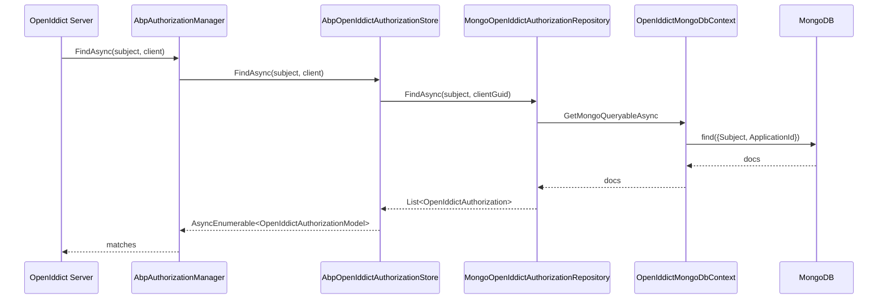

`Volo.Abp.OpenIddict.MongoDB` is the document-database implementation of
the four `IOpenIddict*Repository` interfaces declared by the domain
module. It plays exactly the same role as the
[EF Core provider](/modules/openiddict/entity-framework-core) — it
contributes a `MongoDbContext`, an `IOpenIddictMongoDbContext` interface
that you can implement on your own context, a model-builder extension
that wires the collection names, four repository classes and a
concurrency-handler stub. The OpenIddict server is unchanged at runtime:
when you swap one provider for the other, only the binding from the
`IOpenIddict*Repository` interfaces changes. Source lives under
`modules/openiddict/src/Volo.Abp.OpenIddict.MongoDB/`. For the EF Core
equivalent see [/modules/openiddict/entity-framework-core](/modules/openiddict/entity-framework-core);
for the aggregates persisted here see
[/modules/openiddict/domain](/modules/openiddict/domain).

## File inventory

| Path | Type |
| --- | --- |
| `Volo/Abp/OpenIddict/MongoDB/AbpOpenIddictMongoDbModule.cs` | Module class. |
| `Volo/Abp/OpenIddict/MongoDB/IOpenIddictMongoDbContext.cs` | Reusable MongoDbContext contract. |
| `Volo/Abp/OpenIddict/MongoDB/OpenIddictMongoDbContext.cs` | Concrete `AbpMongoDbContext`. |
| `Volo/Abp/OpenIddict/MongoDB/OpenIddictMongoDbContextExtensions.cs` | `ConfigureOpenIddict` extension for `IMongoModelBuilder`. |
| `Volo/Abp/OpenIddict/Applications/MongoOpenIddictApplicationRepository.cs` | Application repository. |
| `Volo/Abp/OpenIddict/Authorizations/MongoOpenIddictAuthorizationRepository.cs` | Authorization repository. |
| `Volo/Abp/OpenIddict/Scopes/MongoOpenIddictScopeRepository.cs` | Scope repository. |
| `Volo/Abp/OpenIddict/Tokens/MongoOpenIddictTokenRepository.cs` | Token repository. |
| `Volo/Abp/OpenIddict/MongoOpenIddictDbConcurrencyExceptionHandler.cs` | Concurrency exception handler (no-op). |

## Module

```csharp title="modules/openiddict/src/Volo.Abp.OpenIddict.MongoDB/Volo/Abp/OpenIddict/MongoDB/AbpOpenIddictMongoDbModule.cs"
[DependsOn(
    typeof(AbpOpenIddictDomainModule),
    typeof(AbpMongoDbModule)
)]
public class AbpOpenIddictMongoDbModule : AbpModule
{
    public override void ConfigureServices(ServiceConfigurationContext context)
    {
        context.Services.AddMongoDbContext<OpenIddictMongoDbContext>(options =>
        {
            options.AddDefaultRepositories<IOpenIddictMongoDbContext>();

            options.AddRepository<OpenIddictApplication,   MongoOpenIddictApplicationRepository>();
            options.AddRepository<OpenIddictAuthorization, MongoOpenIddictAuthorizationRepository>();
            options.AddRepository<OpenIddictScope,         MongoOpenIddictScopeRepository>();
            options.AddRepository<OpenIddictToken,         MongoOpenIddictTokenRepository>();
        });
    }
}
```

The shape is identical to the EF Core module — the only difference is
`AddMongoDbContext` instead of `AddAbpDbContext`. `AddDefaultRepositories<IOpenIddictMongoDbContext>()`
opens fallback registrations on any context implementing the interface
and the four `AddRepository` calls override them with the typed
contracts.

## `IOpenIddictMongoDbContext`

```csharp title="modules/openiddict/src/Volo.Abp.OpenIddict.MongoDB/Volo/Abp/OpenIddict/MongoDB/IOpenIddictMongoDbContext.cs"
[IgnoreMultiTenancy]
[ConnectionStringName(AbpOpenIddictDbProperties.ConnectionStringName)]
public interface IOpenIddictMongoDbContext : IAbpMongoDbContext
{
    IMongoCollection<OpenIddictApplication>   Applications   { get; }
    IMongoCollection<OpenIddictAuthorization> Authorizations { get; }
    IMongoCollection<OpenIddictScope>         Scopes         { get; }
    IMongoCollection<OpenIddictToken>         Tokens         { get; }
}
```

Two attributes carry over from the EF Core interface:

- `[IgnoreMultiTenancy]` — OpenIddict data is shared across tenants.
- `[ConnectionStringName("AbpOpenIddict")]` — `AbpOpenIddict` under
  `ConnectionStrings` becomes the connection string the MongoDB
  driver uses.

## `OpenIddictMongoDbContext`

```csharp title="modules/openiddict/src/Volo.Abp.OpenIddict.MongoDB/Volo/Abp/OpenIddict/MongoDB/OpenIddictMongoDbContext.cs"
[IgnoreMultiTenancy]
[ConnectionStringName(AbpOpenIddictDbProperties.ConnectionStringName)]
public class OpenIddictMongoDbContext : AbpMongoDbContext, IOpenIddictMongoDbContext
{
    public IMongoCollection<OpenIddictApplication>   Applications   => Collection<OpenIddictApplication>();
    public IMongoCollection<OpenIddictAuthorization> Authorizations => Collection<OpenIddictAuthorization>();
    public IMongoCollection<OpenIddictScope>         Scopes         => Collection<OpenIddictScope>();
    public IMongoCollection<OpenIddictToken>         Tokens         => Collection<OpenIddictToken>();

    protected override void CreateModel(IMongoModelBuilder modelBuilder)
    {
        base.CreateModel(modelBuilder);
        modelBuilder.ConfigureOpenIddict();
    }
}
```

`Collection<TEntity>()` is the ABP-provided helper that looks up the
collection name registered through `IMongoModelBuilder` — that is what
`ConfigureOpenIddict()` populates.

### Merging into your existing context

As with EF Core, most ABP templates have a single application
`MongoDbContext` that implements every module's database interface,
including this one:

```csharp title="MyProjectMongoDbContext.cs (template)"
public class MyProjectMongoDbContext : AbpMongoDbContext,
    IIdentityProMongoDbContext,
    IOpenIddictMongoDbContext   // implement the interface
{
    public IMongoCollection<OpenIddictApplication>   Applications   => Collection<OpenIddictApplication>();
    public IMongoCollection<OpenIddictAuthorization> Authorizations => Collection<OpenIddictAuthorization>();
    public IMongoCollection<OpenIddictScope>         Scopes         => Collection<OpenIddictScope>();
    public IMongoCollection<OpenIddictToken>         Tokens         => Collection<OpenIddictToken>();

    protected override void CreateModel(IMongoModelBuilder modelBuilder)
    {
        base.CreateModel(modelBuilder);
        modelBuilder.ConfigureOpenIddict();   // same call
    }
}
```

## `ConfigureOpenIddict`: collection mapping

`OpenIddictMongoDbContextExtensions` simply assigns the collection name
for each entity — there are no indexes or relationships declared here,
because in MongoDB those are created at insert time by the driver
defaults and the cross-aggregate links are plain `Guid?` properties on
the documents:

```csharp title="modules/openiddict/src/Volo.Abp.OpenIddict.MongoDB/Volo/Abp/OpenIddict/MongoDB/OpenIddictMongoDbContextExtensions.cs"
public static class OpenIddictMongoDbContextExtensions
{
    public static void ConfigureOpenIddict(this IMongoModelBuilder builder)
    {
        Check.NotNull(builder, nameof(builder));

        builder.Entity<OpenIddictApplication>(b =>
        {
            b.CollectionName = AbpOpenIddictDbProperties.DbTablePrefix + "Applications";
        });

        builder.Entity<OpenIddictAuthorization>(b =>
        {
            b.CollectionName = AbpOpenIddictDbProperties.DbTablePrefix + "Authorizations";
        });

        builder.Entity<OpenIddictScope>(b =>
        {
            b.CollectionName = AbpOpenIddictDbProperties.DbTablePrefix + "Scopes";
        });

        builder.Entity<OpenIddictToken>(b =>
        {
            b.CollectionName = AbpOpenIddictDbProperties.DbTablePrefix + "Tokens";
        });
    }
}
```

### Resulting collections

| Collection | Document model |
| --- | --- |
| `OpenIddictApplications` | `OpenIddictApplication` |
| `OpenIddictAuthorizations` | `OpenIddictAuthorization` |
| `OpenIddictScopes` | `OpenIddictScope` |
| `OpenIddictTokens` | `OpenIddictToken` |

The prefix `OpenIddict` comes from `AbpOpenIddictDbProperties.DbTablePrefix`
— change the static to retarget the collections.

### Why no indexes are configured

`AbpMongoDbContext` does not have a fluent index-builder phase in the
way EF Core does. If you want to add indexes to match the EF Core
provider's composite indexes you do so explicitly at startup, e.g.:

```csharp
public class MyOpenIddictMongoIndexesContributor : IHostedService
{
    private readonly IMongoDatabase _database;
    public MyOpenIddictMongoIndexesContributor(IMongoDatabase database) => _database = database;

    public async Task StartAsync(CancellationToken cancellationToken)
    {
        var tokens = _database.GetCollection<OpenIddictToken>("OpenIddictTokens");
        var keys = Builders<OpenIddictToken>.IndexKeys
            .Ascending(x => x.ApplicationId)
            .Ascending(x => x.Status)
            .Ascending(x => x.Subject)
            .Ascending(x => x.Type);
        await tokens.Indexes.CreateOneAsync(new CreateIndexModel<OpenIddictToken>(keys), cancellationToken: cancellationToken);
    }
    public Task StopAsync(CancellationToken cancellationToken) => Task.CompletedTask;
}
```

For most installations the default `_id` index plus the
`Guid?` references is enough — the prune queries on
`IOpenIddictTokenRepository.PruneAsync` rely on `ExpirationDate`
filtering, which is also a good candidate for an explicit index.

## Repositories

The repositories extend `MongoDbRepository<TMongoDbContext, TEntity, Guid>`
and use `GetMongoQueryableAsync()` for LINQ projections. The shape
mirrors the EF Core repositories — same method signatures from the
interface, different driver:

```csharp title="modules/openiddict/src/Volo.Abp.OpenIddict.MongoDB/Volo/Abp/OpenIddict/Applications/MongoOpenIddictApplicationRepository.cs"
public class MongoOpenIddictApplicationRepository
    : MongoDbRepository<OpenIddictMongoDbContext, OpenIddictApplication, Guid>,
      IOpenIddictApplicationRepository
{
    public MongoOpenIddictApplicationRepository(IMongoDbContextProvider<OpenIddictMongoDbContext> dbContextProvider)
        : base(dbContextProvider) { }

    public virtual async Task<List<OpenIddictApplication>> GetListAsync(
        string sorting, int skipCount, int maxResultCount, string filter = null,
        CancellationToken cancellationToken = default)
    {
        return await ((await GetMongoQueryableAsync(cancellationToken)))
            .WhereIf(!filter.IsNullOrWhiteSpace(), x => x.ClientId.Contains(filter))
            .OrderBy(sorting.IsNullOrWhiteSpace() ? nameof(OpenIddictApplication.ClientId) : sorting)
            .PageBy(skipCount, maxResultCount)
            .As<IMongoQueryable<OpenIddictApplication>>()
            .ToListAsync(GetCancellationToken(cancellationToken));
    }

    public virtual async Task<OpenIddictApplication> FindByClientIdAsync(string clientId, CancellationToken cancellationToken = default)
    {
        return await (await GetMongoQueryableAsync(cancellationToken))
            .FirstOrDefaultAsync(x => x.ClientId == clientId, cancellationToken);
    }

    public virtual async Task<List<OpenIddictApplication>> FindByPostLogoutRedirectUriAsync(string address, CancellationToken cancellationToken = default)
    {
        return await (await GetMongoQueryableAsync(cancellationToken))
            .Where(x => x.PostLogoutRedirectUris.Contains(address))
            .ToListAsync(GetCancellationToken(cancellationToken));
    }
    /* ... */
}
```

The `OrderBy(string)` overload is `System.Linq.Dynamic.Core` again, so
the admin UI can drive the list by passing column names as strings.

<Note>
`PostLogoutRedirectUris` and `RedirectUris` are stored as JSON
strings on the document. The MongoDB driver's
`String.Contains(address)` projection works because the property is a
string — but it is a substring match. That means callers must use
exact URL values when seeding `PostLogoutRedirectUris`, otherwise the
match may produce false positives for URLs that share a prefix.
</Note>

## Concurrency

MongoDB does not have an equivalent of EF Core's
`DbUpdateConcurrencyException`, so the handler is a no-op:

```csharp title="modules/openiddict/src/Volo.Abp.OpenIddict.MongoDB/Volo/Abp/OpenIddict/MongoOpenIddictDbConcurrencyExceptionHandler.cs"
public class MongoOpenIddictDbConcurrencyExceptionHandler : IOpenIddictDbConcurrencyExceptionHandler, ITransientDependency
{
    public virtual Task HandleAsync(AbpDbConcurrencyException exception)
    {
        return Task.CompletedTask;
    }
}
```

`AbpOpenIddictStoreBase` still gets called with this handler, but
because the MongoDB driver returns its own conflict signalling, the
hook does nothing — the manager-level retry logic relies on
`IOpenIddictTokenManager.UpdateAsync` raising the OpenIddict-native
concurrency exception, which in MongoDB happens when the
`ConcurrencyStamp` document field does not match.

## Document layout

The four documents are persisted as-is — every property on the C#
aggregate becomes a top-level field in the BSON document. Reference
links use plain `Guid` strings:

```json
{
  "_id": "5e0a6b8b-...-...",
  "ApplicationId": "11111111-...",
  "AuthorizationId": "22222222-...",
  "Subject": "user-guid-as-string",
  "Status": "valid",
  "Type": "access_token",
  "Payload": "<encrypted jwt>",
  "ReferenceId": "ref-12345",
  "CreationDate": "2024-01-12T08:00:00Z",
  "ExpirationDate": "2024-01-12T09:00:00Z",
  "Properties": "{ ... json ... }",
  "ExtraProperties": { /* object extensions */ },
  "ConcurrencyStamp": "...",
  "IsDeleted": false,
  "CreatorId": null,
  "CreationTime": "2024-01-12T08:00:00Z"
}
```

The five trailing fields are added by `FullAuditedAggregateRoot<Guid>`
and are written automatically by `AbpMongoDbContext`.

## Putting it together



The interfaces between the server, the manager and the store are
identical to those used by the EF Core provider — only the bottom
three boxes differ.

## Choosing this provider

<CardGroup cols={2}>
  <Card title="Use MongoDB when" icon="leaf">
    The rest of your solution uses MongoDB, OR you want the OpenIddict
    data to live in a different cluster from your relational data and
    do not want to deploy two ORM stacks.
  </Card>
  <Card title="Prefer EF Core when" icon="database">
    You need strong relational constraints, server-side joins for
    reports across applications/tokens, or your team is more familiar
    with EF Core migrations than with manual index management.
  </Card>
</CardGroup>

## Where to go next

<CardGroup cols={2}>
  <Card title="EF Core provider" icon="database" href="/modules/openiddict/entity-framework-core">
    The relational counterpart of this page.
  </Card>
  <Card title="Domain internals" icon="cube" href="/modules/openiddict/domain">
    The aggregates and repository contracts these classes implement.
  </Card>
  <Card title="ASP.NET Core integration" icon="globe" href="/modules/openiddict/aspnet-core">
    The HTTP layer that drives reads and writes through these
    repositories.
  </Card>
  <Card title="Server walkthrough" icon="play" href="/auth/openiddict-server">
    Higher-level guide to spinning up the AuthServer with this
    provider.
  </Card>
</CardGroup>
