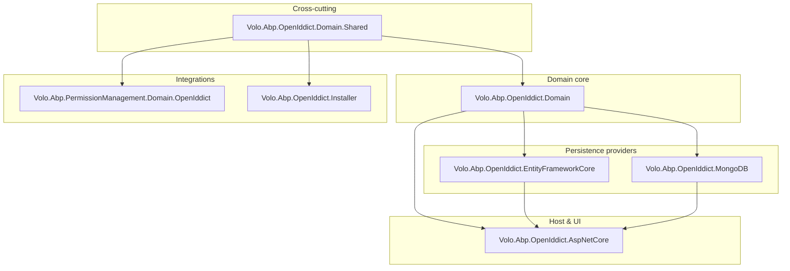
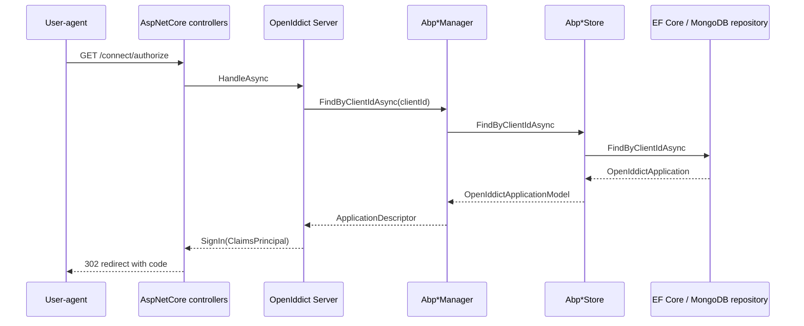

The OpenIddict module is the ABP Framework's first-party integration with
[OpenIddict 4.x](https://documentation.openiddict.com/). It ships the
aggregates, repositories, managers, stores and ASP.NET Core wiring that
turn a vanilla OpenIddict installation into an ABP application module:
applications, authorizations, scopes and tokens are persisted through ABP
repositories; the OpenIddict managers are replaced with ABP-aware
subclasses so that the entity cache and the ABP unit of work cooperate;
and an ASP.NET Core layer registers the standard `/connect/*` endpoints
together with the controllers and views that drive the authorize, token,
userinfo, logout, device-flow and verification flows. The source for this
module lives under `modules/openiddict/src/` in the
[`abpframework/abp`](https://github.com/abpframework/abp) repository, and
the per-layer pages in this section drill down into each package; this
overview enumerates the packages and shows how they fit together. For the
user-facing guide to standing up an authorization server with this
module, see [/auth/openiddict-server](/auth/openiddict-server); for the
account UI and login screens that sit in front of it, see
[/modules/account/overview](/modules/account/overview).

## Packages in the module

The repository folder `modules/openiddict/src/` contains seven C#
projects. They split the module into the standard ABP layers — domain
shared, domain, provider-specific persistence, ASP.NET Core, an installer
shim and a permission-management integration:

| Project | NuGet package | Purpose |
| --- | --- | --- |
| `Volo.Abp.OpenIddict.Domain.Shared` | `Volo.Abp.OpenIddict.Domain.Shared` | Constants (`OpenIddictApplicationConsts`, `OpenIddictScopeConsts`, `OpenIddictErrorCodes`), localization resource `AbpOpenIddictResource`, and the `OpenIddictModuleExtensionConsts` used by the object-extension system. |
| `Volo.Abp.OpenIddict.Domain` | `Volo.Abp.OpenIddict.Domain` | Aggregate roots (`OpenIddictApplication`, `OpenIddictAuthorization`, `OpenIddictScope`, `OpenIddictToken`), repository interfaces, ABP-aware OpenIddict `Manager` and `Store` implementations, `TokenCleanupBackgroundWorker`. |
| `Volo.Abp.OpenIddict.EntityFrameworkCore` | `Volo.Abp.OpenIddict.EntityFrameworkCore` | `OpenIddictDbContext` / `IOpenIddictDbContext`, fluent model-builder extension `ConfigureOpenIddict`, EF Core repositories. |
| `Volo.Abp.OpenIddict.MongoDB` | `Volo.Abp.OpenIddict.MongoDB` | `OpenIddictMongoDbContext` / `IOpenIddictMongoDbContext`, collection registration via `ConfigureOpenIddict`, MongoDB repositories. |
| `Volo.Abp.OpenIddict.AspNetCore` | `Volo.Abp.OpenIddict.AspNetCore` | `AbpOpenIddictAspNetCoreModule`, the OpenIddict server registration, claims-principal handlers, `/connect/*` controllers and embedded views. |
| `Volo.Abp.OpenIddict.Installer` | `Volo.Abp.OpenIddict.Installer` | A lightweight module used by the `abp install-module` tooling so that the module can be added to a solution from the CLI. |
| `Volo.Abp.PermissionManagement.Domain.OpenIddict` | `Volo.Abp.PermissionManagement.Domain.OpenIddict` | Bridges OpenIddict client applications to the permission-management module via `ApplicationPermissionManagementProvider`. See [/modules/openiddict/permission-integration](/modules/openiddict/permission-integration). |

<Note>
The module also contains a `test/Volo.Abp.OpenIddict.TestBase` project
with an `OpenIddictDataSeedContributor` used by the unit tests. The
production seeder is generated into your `*.Domain` project by the
application template (see `templates/app/aspnet-core/src/MyCompanyName.MyProjectName.Domain/OpenIddict/OpenIddictDataSeedContributor.cs`)
rather than shipped as part of the module — that is a deliberate choice
so that you own the list of clients and scopes seeded into your
database.
</Note>

## Layer map

The packages line up with the standard ABP DDD layering. Reading top to
bottom, each layer pulls in the layers above:



The arrows are `DependsOn` relationships: `AbpOpenIddictAspNetCoreModule`
depends on `AbpOpenIddictDomainModule`, which in turn depends on
`AbpOpenIddictDomainSharedModule`; the EF Core and MongoDB providers
depend on the domain module and contribute their repositories to it.
The permission-integration module only depends on the domain-shared
module because it does not need entity types — it only needs the
`OpenIddict` constants used as policy keys.

## Module dependency reference

The exact `[DependsOn]` attributes from each module class follow. The
file paths are the source of truth; the page-level docs in this section
reproduce them so you can pick a host project and see what is dragged
in.

### `AbpOpenIddictDomainSharedModule`

```csharp title="modules/openiddict/src/Volo.Abp.OpenIddict.Domain.Shared/Volo/Abp/OpenIddict/AbpOpenIddictDomainSharedModule.cs"
[DependsOn(
    typeof(AbpValidationModule)
)]
public class AbpOpenIddictDomainSharedModule : AbpModule
```

This module registers the embedded virtual-file system files (the
localization resources) and maps the `Volo.OpenIddict` exception code
namespace to `AbpOpenIddictResource`.

### `AbpOpenIddictDomainModule`

```csharp title="modules/openiddict/src/Volo.Abp.OpenIddict.Domain/Volo/Abp/OpenIddict/AbpOpenIddictDomainModule.cs"
[DependsOn(
    typeof(AbpDddDomainModule),
    typeof(AbpIdentityDomainModule),
    typeof(AbpOpenIddictDomainSharedModule),
    typeof(AbpDistributedLockingAbstractionsModule),
    typeof(AbpCachingModule),
    typeof(AbpGuidsModule)
)]
public class AbpOpenIddictDomainModule : AbpModule
```

This is where the actual `services.AddOpenIddict().AddCore(...)` call
lives, where the four `AbpOpenIddict*Store` types are registered against
OpenIddict, and where the four ABP `Manager` subclasses are swapped in
through `ReplaceApplicationManager`, `ReplaceAuthorizationManager`,
`ReplaceScopeManager` and `ReplaceTokenManager`. The dependency on the
identity-domain module is what lets the issued claims piggy-back on
ABP's identity user types. See
[/modules/openiddict/domain](/modules/openiddict/domain) for the full
breakdown.

### `AbpOpenIddictEntityFrameworkCoreModule`

```csharp title="modules/openiddict/src/Volo.Abp.OpenIddict.EntityFrameworkCore/Volo/Abp/OpenIddict/EntityFrameworkCore/AbpOpenIddictEntityFrameworkCoreModule.cs"
[DependsOn(
    typeof(AbpOpenIddictDomainModule),
    typeof(AbpEntityFrameworkCoreModule)
)]
public class AbpOpenIddictEntityFrameworkCoreModule : AbpModule
```

Registers `OpenIddictDbContext` and four EF Core repositories. See
[/modules/openiddict/entity-framework-core](/modules/openiddict/entity-framework-core).

### `AbpOpenIddictMongoDbModule`

```csharp title="modules/openiddict/src/Volo.Abp.OpenIddict.MongoDB/Volo/Abp/OpenIddict/MongoDB/AbpOpenIddictMongoDbModule.cs"
[DependsOn(
    typeof(AbpOpenIddictDomainModule),
    typeof(AbpMongoDbModule)
)]
public class AbpOpenIddictMongoDbModule : AbpModule
```

Same shape as the EF Core module but for MongoDB. See
[/modules/openiddict/mongodb](/modules/openiddict/mongodb).

### `AbpOpenIddictAspNetCoreModule`

```csharp title="modules/openiddict/src/Volo.Abp.OpenIddict.AspNetCore/Volo/Abp/OpenIddict/AbpOpenIddictAspNetCoreModule.cs"
[DependsOn(
    typeof(AbpAspNetCoreMvcUiThemeSharedModule),
    typeof(AbpAspNetCoreMultiTenancyModule),
    typeof(AbpOpenIddictDomainModule)
)]
public class AbpOpenIddictAspNetCoreModule : AbpModule
```

This is the host-facing module — see
[/modules/openiddict/aspnet-core](/modules/openiddict/aspnet-core) for
the endpoints registered, the grant flows enabled and the
`AbpOpenIddictAspNetCoreOptions` knobs.

### `AbpPermissionManagementDomainOpenIddictModule`

```csharp title="modules/openiddict/src/Volo.Abp.PermissionManagement.Domain.OpenIddict/Volo/Abp/PermissionManagement/OpenIddict/AbpPermissionManagementDomainOpenIddictModule.cs"
[DependsOn(
    typeof(AbpOpenIddictDomainSharedModule),
    typeof(AbpPermissionManagementDomainModule)
)]
public class AbpPermissionManagementDomainOpenIddictModule : AbpModule
```

Registers an `ApplicationPermissionManagementProvider` so that
permissions granted to OpenIddict client applications are stored and
checked through the standard permission-management pipeline. See
[/modules/openiddict/permission-integration](/modules/openiddict/permission-integration).

## How the layers wire together at runtime

The diagram below shows a typical AuthServer process. The arrows are
runtime calls, not `DependsOn`:



The three boundaries — controllers, OpenIddict server, ABP stores — map
one-to-one onto the three big packages: the AspNetCore project owns the
controllers, the Domain project owns the managers and stores, and the EF
Core or MongoDB project owns the repository. Reading from the bottom
up: a repository call returns an `OpenIddictApplication` entity, the
store converts that to OpenIddict's transport type
`OpenIddictApplicationModel`, the manager hands that to the OpenIddict
server, and the server emits whatever protocol response the controller
returns to the user agent.

## Choosing between EF Core and MongoDB

Both providers are interchangeable from the OpenIddict server's
perspective because they both end up calling the same
`AbpOpenIddict*Store` types — only the underlying repository changes.
You will pick one based on the rest of your application:

<CardGroup cols={2}>
  <Card title="Entity Framework Core" icon="database" href="/modules/openiddict/entity-framework-core">
    Use when the rest of the solution already uses EF Core. Adds tables
    prefixed `OpenIddict*` (e.g. `OpenIddictApplications`) and joins
    them with foreign keys for `ApplicationId` and `AuthorizationId`.
  </Card>
  <Card title="MongoDB" icon="leaf" href="/modules/openiddict/mongodb">
    Use when the rest of the solution uses MongoDB. Adds collections
    prefixed `OpenIddict*` with the same names but no foreign keys —
    cross-aggregate references are plain `Guid?` fields.
  </Card>
</CardGroup>

## Where to go next

<CardGroup cols={2}>
  <Card title="Aggregates and managers" icon="cube" href="/modules/openiddict/domain">
    The four aggregate roots, the stores that read and write them, the
    ABP manager subclasses and the token cleanup background worker.
  </Card>
  <Card title="ASP.NET Core integration" icon="globe" href="/modules/openiddict/aspnet-core">
    `AbpOpenIddictAspNetCoreModule`, options, controllers and the claim
    handlers that shape access and identity tokens.
  </Card>
  <Card title="Permission integration" icon="key" href="/modules/openiddict/permission-integration">
    How `Volo.Abp.PermissionManagement.Domain.OpenIddict` lets you grant
    permissions to client applications.
  </Card>
  <Card title="Server walkthrough" icon="play" href="/auth/openiddict-server">
    Higher-level guide to adding the module to a host and exercising the
    grant flows.
  </Card>
</CardGroup>
