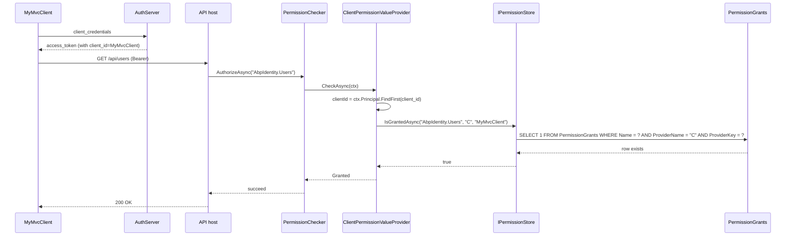

`Volo.Abp.PermissionManagement.Domain.OpenIddict` is a single-file
integration that lets ABP's permission-management module grant and
check permissions for OpenIddict client applications. It does not
contain any entities of its own — instead it relies on
`ClientPermissionValueProvider` from `Volo.Abp.Authorization`, the
`PermissionGrant` row schema from `Volo.Abp.PermissionManagement`, and
adds a `PermissionManagementProvider` that scopes every grant to the
host tenant. When this module is added to a host, the
"Permissions" button next to a client application in the OpenIddict-Pro
admin UI starts working: clicking it shows the permission tree, ticking
a permission writes a `PermissionGrants` row with `ProviderName = "C"`,
and `IPermissionChecker.IsGrantedAsync` returns `Granted` when the
running token carries the matching `client_id` claim. Source lives at
`modules/openiddict/src/Volo.Abp.PermissionManagement.Domain.OpenIddict/`.
Cross-reference [/modules/openiddict/aspnet-core](/modules/openiddict/aspnet-core)
for the layer that supplies the `client_id` claim, and
[/auth/openiddict-server](/auth/openiddict-server) for the high-level
walkthrough.

## File inventory

| Path | Type |
| --- | --- |
| `Volo/Abp/PermissionManagement/OpenIddict/AbpPermissionManagementDomainOpenIddictModule.cs` | Module class. |
| `Volo/Abp/PermissionManagement/OpenIddict/ApplicationPermissionManagementProvider.cs` | `PermissionManagementProvider` subclass. |
| `Volo/Abp/PermissionManagement/ClientPermissionManagerExtensions.cs` | `IPermissionManager` extension methods. |

Note that `ClientPermissionValueProvider` itself is **not** in this
project — it ships with `Volo.Abp.Authorization`, because the provider
needs to be discoverable from any host that issues OAuth tokens, with
or without OpenIddict. This module's job is to register the
*management*-side provider that pairs with it.

## How permissions are stored

ABP's permission-management module stores grants as rows in a
`PermissionGrants` table (or collection):

| Column | Example |
| --- | --- |
| `Id` | guid |
| `TenantId` | null (provider sets it to null) |
| `Name` | `"AbpIdentity.Users.Create"` |
| `ProviderName` | `"C"` |
| `ProviderKey` | `"MyMvcClient"` |

For roles the `ProviderName` would be `"R"`; for users `"U"`; for
clients `"C"`. The provider name is a one-character constant defined
on the value provider:

```csharp title="framework/src/Volo.Abp.Authorization/Volo/Abp/Authorization/Permissions/ClientPermissionValueProvider.cs"
public class ClientPermissionValueProvider : PermissionValueProvider
{
    public const string ProviderName = "C";

    public override string Name => ProviderName;

    public ClientPermissionValueProvider(IPermissionStore permissionStore, ICurrentTenant currentTenant)
        : base(permissionStore)
    {
        CurrentTenant = currentTenant;
    }
    /* ... */
}
```

## How `ClientPermissionValueProvider` checks at runtime

The provider is the *check* side: it runs on every
`IAuthorizationService.AuthorizeAsync` call, finds the `client_id`
claim on the principal, and asks the permission store whether that
client has been granted the requested permission. The whole class is
just two `CheckAsync` overloads:

```csharp title="framework/src/Volo.Abp.Authorization/Volo/Abp/Authorization/Permissions/ClientPermissionValueProvider.cs"
public override async Task<PermissionGrantResult> CheckAsync(PermissionValueCheckContext context)
{
    var clientId = context.Principal?.FindFirst(AbpClaimTypes.ClientId)?.Value;

    if (clientId == null)
    {
        return PermissionGrantResult.Undefined;
    }

    using (CurrentTenant.Change(null))
    {
        return await PermissionStore.IsGrantedAsync(context.Permission.Name, Name, clientId)
            ? PermissionGrantResult.Granted
            : PermissionGrantResult.Undefined;
    }
}

public override async Task<MultiplePermissionGrantResult> CheckAsync(PermissionValuesCheckContext context)
{
    var permissionNames = context.Permissions.Select(x => x.Name).Distinct().ToArray();
    Check.NotNullOrEmpty(permissionNames, nameof(permissionNames));

    var clientId = context.Principal?.FindFirst(AbpClaimTypes.ClientId)?.Value;
    if (clientId == null)
    {
        return new MultiplePermissionGrantResult(permissionNames);
    }

    using (CurrentTenant.Change(null))
    {
        return await PermissionStore.IsGrantedAsync(permissionNames, Name, clientId);
    }
}
```

Two key behaviours:

- The provider reads `client_id` from `AbpClaimTypes.ClientId`. The
  [OpenIddict ASP.NET Core module](/modules/openiddict/aspnet-core)
  ensures that this claim is populated — either through
  `OpenIddictClaimsPrincipalContributor` (which copies the request's
  `client_id`) or — when `UpdateAbpClaimTypes` is true — by aliasing
  `AbpClaimTypes.ClientId` to `OpenIddictConstants.Claims.ClientId`.
- The check runs with `CurrentTenant.Change(null)`. OpenIddict clients
  are host-level entities, so the matching grant row also has a null
  `TenantId`. This is why both check overloads pop into the host
  tenant.

## The management-side module

The module class is short. It does two things — register the
management provider and set the policy that controls who is allowed to
edit client permissions:

```csharp title="modules/openiddict/src/Volo.Abp.PermissionManagement.Domain.OpenIddict/Volo/Abp/PermissionManagement/OpenIddict/AbpPermissionManagementDomainOpenIddictModule.cs"
[DependsOn(
    typeof(AbpOpenIddictDomainSharedModule),
    typeof(AbpPermissionManagementDomainModule)
)]
public class AbpPermissionManagementDomainOpenIddictModule : AbpModule
{
    public override void ConfigureServices(ServiceConfigurationContext context)
    {
        Configure<PermissionManagementOptions>(options =>
        {
            options.ManagementProviders.Add<ApplicationPermissionManagementProvider>();
            options.ProviderPolicies[ClientPermissionValueProvider.ProviderName] = "OpenIddictPro.Application.ManagePermissions";
        });
    }
}
```

`ManagementProviders` is the list of providers that can *change* grants,
in contrast to the `ValueProviders` list that can *check* them. The
provider key in `ProviderPolicies` is `"C"` again — same constant. The
value `"OpenIddictPro.Application.ManagePermissions"` is the
authorization policy a user must satisfy to call
`IPermissionManager.SetForClientAsync`; in the commercial OpenIddict-Pro
package this maps to the "Manage Permissions" menu item on the
applications list.

<Note>
`DependsOn(typeof(AbpOpenIddictDomainSharedModule))` is only there so
that the module can reference the OpenIddict constants — it does not
pull in any of the aggregates or persistence. The integration module
is purposely lean so that you can drop it into a host that talks to
OpenIddict over HTTP without bringing in OpenIddict's own server
implementation.
</Note>

## `ApplicationPermissionManagementProvider`

The management provider is a tiny `PermissionManagementProvider`
subclass that scopes every call to the host tenant:

```csharp title="modules/openiddict/src/Volo.Abp.PermissionManagement.Domain.OpenIddict/Volo/Abp/PermissionManagement/OpenIddict/ApplicationPermissionManagementProvider.cs"
public class ApplicationPermissionManagementProvider : PermissionManagementProvider
{
    public override string Name => ClientPermissionValueProvider.ProviderName;

    public ApplicationPermissionManagementProvider(
        IPermissionGrantRepository permissionGrantRepository,
        IGuidGenerator guidGenerator,
        ICurrentTenant currentTenant)
        : base(permissionGrantRepository, guidGenerator, currentTenant)
    {
    }

    public override Task<PermissionValueProviderGrantInfo> CheckAsync(string name, string providerName, string providerKey)
    {
        using (CurrentTenant.Change(null))
        {
            return base.CheckAsync(name, providerName, providerKey);
        }
    }

    protected override Task GrantAsync(string name, string providerKey)
    {
        using (CurrentTenant.Change(null))
        {
            return base.GrantAsync(name, providerKey);
        }
    }

    protected override Task RevokeAsync(string name, string providerKey)
    {
        using (CurrentTenant.Change(null))
        {
            return base.RevokeAsync(name, providerKey);
        }
    }

    public override Task SetAsync(string name, string providerKey, bool isGranted)
    {
        using (CurrentTenant.Change(null))
        {
            return base.SetAsync(name, providerKey, isGranted);
        }
    }
}
```

The four overrides — `CheckAsync`, `GrantAsync`, `RevokeAsync`,
`SetAsync` — all do the same dance: `using (CurrentTenant.Change(null))`
then delegate to the base implementation. The base class is the
generic `PermissionManagementProvider` in
`Volo.Abp.PermissionManagement.Domain`; it writes to
`IPermissionGrantRepository` after applying the provider's `Name` and
the caller-supplied `providerKey`.

## Extension methods on `IPermissionManager`

`ClientPermissionManagerExtensions` is the only piece in this module
your application code is likely to call by hand. It exposes three
client-flavoured wrappers around `IPermissionManager`:

```csharp title="modules/openiddict/src/Volo.Abp.PermissionManagement.Domain.OpenIddict/Volo/Abp/PermissionManagement/ClientPermissionManagerExtensions.cs"
public static class ClientPermissionManagerExtensions
{
    public static Task<PermissionWithGrantedProviders> GetForClientAsync(
        [NotNull] this IPermissionManager permissionManager, string clientId, string permissionName)
    {
        Check.NotNull(permissionManager, nameof(permissionManager));
        return permissionManager.GetAsync(permissionName, ClientPermissionValueProvider.ProviderName, clientId);
    }

    public static Task<List<PermissionWithGrantedProviders>> GetAllForClientAsync(
        [NotNull] this IPermissionManager permissionManager, string clientId)
    {
        Check.NotNull(permissionManager, nameof(permissionManager));
        return permissionManager.GetAllAsync(ClientPermissionValueProvider.ProviderName, clientId);
    }

    public static Task SetForClientAsync(
        [NotNull] this IPermissionManager permissionManager, string clientId,
        [NotNull] string permissionName, bool isGranted)
    {
        Check.NotNull(permissionManager, nameof(permissionManager));
        return permissionManager.SetAsync(permissionName, ClientPermissionValueProvider.ProviderName, clientId, isGranted);
    }
}
```

| Method | Purpose |
| --- | --- |
| `GetForClientAsync(clientId, permissionName)` | Inspects whether one specific permission is granted to the client. |
| `GetAllForClientAsync(clientId)` | Returns the full permission set for the client. |
| `SetForClientAsync(clientId, permissionName, isGranted)` | Grants or revokes a single permission. |

Each method simply forwards to the matching `IPermissionManager` method
with the `"C"` provider hard-coded. The benefit is purely API
ergonomics — the caller never has to remember the provider key.

### Example: granting a permission from a data seeder

```csharp title="MyOpenIddictPermissionsSeedContributor.cs"
public class MyOpenIddictPermissionsSeedContributor : IDataSeedContributor, ITransientDependency
{
    private readonly IPermissionManager _permissionManager;
    public MyOpenIddictPermissionsSeedContributor(IPermissionManager permissionManager) =>
        _permissionManager = permissionManager;

    public async Task SeedAsync(DataSeedContext context)
    {
        await _permissionManager.SetForClientAsync(
            clientId:       "MyMvcClient",
            permissionName: IdentityPermissions.Users.Default,
            isGranted:      true);
    }
}
```

The framework picks up `SetForClientAsync`, routes it to the
`ApplicationPermissionManagementProvider` registered above, and the
provider writes a row to `PermissionGrants` with
`ProviderName = "C"`, `ProviderKey = "MyMvcClient"` and
`TenantId = null`.

### Example: checking from application code

There is rarely a reason to check imperatively — the standard
`[Authorize("AbpIdentity.Users")]` attribute already cooperates with
the value provider — but if you want to, the same conversion holds:

```csharp
var permission = await _permissionManager.GetForClientAsync(
    clientId:       "MyMvcClient",
    permissionName: IdentityPermissions.Users.Default);

if (permission.IsGranted)
{
    /* ... */
}
```

## End-to-end pipeline



The diagram is exhaustive: every box is a real type. The interesting
detail is that the `PermissionChecker` is invoked by the
`[Authorize(...)]` attribute on the API controller, while the
*management* provider documented earlier never participates in the
read path — it only writes the row that the value provider later
reads.

## Adding the module to a host

The integration module sits in the *Domain* layer of your application,
not the host:

<Steps>
<Step title="Reference the package">
Add `Volo.Abp.PermissionManagement.Domain.OpenIddict` to your
`*.Domain` project alongside `Volo.Abp.PermissionManagement.Domain` and
`Volo.Abp.OpenIddict.Domain.Shared`.
</Step>
<Step title="DependsOn">
Add `[DependsOn(typeof(AbpPermissionManagementDomainOpenIddictModule))]`
to your `*.Domain` module class. The framework will register the
`ApplicationPermissionManagementProvider` and wire the
`ProviderPolicies` mapping for `"C"`.
</Step>
<Step title="Define a policy (or reuse one)">
The `ProviderPolicies["C"] = "OpenIddictPro.Application.ManagePermissions"`
mapping means a user must satisfy this policy to call
`IPermissionManager.SetForClientAsync`. The OpenIddict-Pro module
defines this permission in its
`OpenIddictProPermissionDefinitionProvider`; if you are not using
that module, override the policy:

```csharp
public override void PreConfigureServices(ServiceConfigurationContext context)
{
    PreConfigure<PermissionManagementOptions>(options =>
    {
        options.ProviderPolicies[ClientPermissionValueProvider.ProviderName] = "MyAuthServer.Clients.ManagePermissions";
    });
}
```
</Step>
<Step title="Surface the editor in your UI">
The commercial OpenIddict-Pro module ships an "Permissions" button
that opens the standard permission-management dialog with
`providerName="C"` and `providerKey=clientId`. To roll your own UI,
call `IPermissionAppService.GetAsync("C", clientId)` and
`IPermissionAppService.UpdateAsync("C", clientId, new UpdatePermissionsDto { ... })`.
</Step>
</Steps>

## What about user and role grants?

The permission-management module ships providers for users (`"U"`),
roles (`"R"`) and clients (`"C"`). When a token is issued, every
relevant provider checks its store:

| Provider | Looks up by claim | Provider name |
| --- | --- | --- |
| `UserPermissionValueProvider` | `AbpClaimTypes.UserId` (i.e. `sub`) | `"U"` |
| `RolePermissionValueProvider` | `AbpClaimTypes.Role` (one or more) | `"R"` |
| `ClientPermissionValueProvider` | `AbpClaimTypes.ClientId` | `"C"` |

For a user signed in interactively via authorization code, the user
and role providers are usually enough — the client provider returns
`Undefined` and gets out of the way. For a daemon talking to your API
with `client_credentials`, the token carries no `sub`, so only the
client provider matters; without this integration module, machine
clients would have no way to be granted permissions through ABP's
standard permission-management UI.

## Where to go next

<CardGroup cols={2}>
  <Card title="ASP.NET Core layer" icon="globe" href="/modules/openiddict/aspnet-core">
    The layer that puts the `client_id` claim on the principal in the
    first place.
  </Card>
  <Card title="Server walkthrough" icon="play" href="/auth/openiddict-server">
    End-to-end guide to wiring an AuthServer with this integration.
  </Card>
  <Card title="Domain internals" icon="cube" href="/modules/openiddict/domain">
    The `OpenIddictApplication` aggregate whose `ClientId` becomes the
    `ProviderKey` here.
  </Card>
  <Card title="Account web (OpenIddict)" icon="user" href="/modules/account/web-openiddict">
    The UI a user goes through before the OpenIddict server emits the
    token.
  </Card>
</CardGroup>
