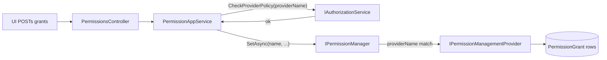

`Volo.Abp.PermissionManagement.Application` is a thin layer. There is one user-facing app service — `PermissionAppService` — plus one integration service for cross-host grant checks, a flat set of DTOs, and a contracts module that other UIs depend on without taking the persistence packages. This page documents the real signatures, walks through the read and write flows, and shows how `PermissionManagementOptions.ProviderPolicies` becomes the only authorization gate that matters.

For the persistence layer the app service writes through, see [Domain](/modules/permission-management/domain). For the HTTP shape that exposes the same surface over REST, see [HTTP API](/modules/permission-management/http-api). For the Blazor / Razor Pages tree editor that consumes `GetPermissionListResultDto`, see [Blazor and Web UI](/modules/permission-management/blazor-and-web).

## File inventory

### `Volo.Abp.PermissionManagement.Application.Contracts`

| File | Type | Role |
| --- | --- | --- |
| `AbpPermissionManagementApplicationContractsModule.cs` | module | Depends on `AbpDddApplicationContractsModule`, `AbpAuthorizationAbstractionsModule`, and `AbpPermissionManagementDomainSharedModule`. |
| `IPermissionAppService.cs` | interface | Two methods: `GetAsync`, `UpdateAsync`. |
| `GetPermissionListResultDto.cs` | DTO | `EntityDisplayName`, `Groups`. |
| `PermissionGroupDto.cs` | DTO | One tab in the UI; carries localization metadata. |
| `PermissionGrantInfoDto.cs` | DTO | One row in the UI; carries `AllowedProviders` and `GrantedProviders`. |
| `ProviderInfoDto.cs` | DTO | `(ProviderName, ProviderKey)` for the "granted via …" badges. |
| `UpdatePermissionsDto.cs` / `UpdatePermissionDto.cs` | DTO | The save payload sent back from the UI. |
| `PermissionManagementRemoteServiceConsts.cs` | static | `RemoteServiceName = "AbpPermissionManagement"`, `ModuleName = "permissionManagement"`. |
| `Integration/IPermissionIntegrationService.cs` | interface | Cross-host `IsGrantedAsync(List<IsGrantedRequest>)`. |

### `Volo.Abp.PermissionManagement.Application`

| File | Type | Role |
| --- | --- | --- |
| `AbpPermissionManagementApplicationModule.cs` | module | Depends on Domain + Contracts + `AbpDddApplicationModule`. |
| `PermissionAppService.cs` | service | `[Authorize]`, implements `IPermissionAppService`. |
| `Integration/PermissionIntegrationService.cs` | service | Implements `IPermissionIntegrationService` for the integration controller. |

## The app service contract

```csharp modules/permission-management/src/Volo.Abp.PermissionManagement.Application.Contracts/Volo/Abp/PermissionManagement/IPermissionAppService.cs
public interface IPermissionAppService : IApplicationService
{
    Task<GetPermissionListResultDto> GetAsync([NotNull] string providerName, [NotNull] string providerKey);

    Task UpdateAsync([NotNull] string providerName, [NotNull] string providerKey, UpdatePermissionsDto input);
}
```

Two methods, both keyed by `(providerName, providerKey)`. The same shape is used to manage permissions for a role (`("R", "admin")`), a user (`("U", userId)`), or any custom subject kind.

## DTO shapes

The read result is a small tree:

```csharp modules/permission-management/src/Volo.Abp.PermissionManagement.Application.Contracts/Volo/Abp/PermissionManagement/GetPermissionListResultDto.cs
public class GetPermissionListResultDto
{
    public string EntityDisplayName { get; set; }
    public List<PermissionGroupDto> Groups { get; set; }
}
```

```csharp modules/permission-management/src/Volo.Abp.PermissionManagement.Application.Contracts/Volo/Abp/PermissionManagement/PermissionGroupDto.cs
public class PermissionGroupDto
{
    public string Name { get; set; }
    public string DisplayName { get; set; }
    public string DisplayNameKey { get; set; }
    public string DisplayNameResource { get; set; }
    public List<PermissionGrantInfoDto> Permissions { get; set; }
}
```

```csharp modules/permission-management/src/Volo.Abp.PermissionManagement.Application.Contracts/Volo/Abp/PermissionManagement/PermissionGrantInfoDto.cs
public class PermissionGrantInfoDto
{
    public string Name { get; set; }
    public string DisplayName { get; set; }
    public string ParentName { get; set; }
    public bool IsGranted { get; set; }
    public List<string> AllowedProviders { get; set; }
    public List<ProviderInfoDto> GrantedProviders { get; set; }
}
```

A few field-level details that matter to the UI:

- `DisplayNameKey` and `DisplayNameResource` are the *raw* localization key + resource type name. The UI re-localizes from those (so a tenant admin sees French strings even if the host fetched the catalog in English) — without them you would get whatever language the server pulled.
- `AllowedProviders` is the static list from the permission definition (`PermissionDefinition.Providers`). If empty, every provider can host the permission; if not, only listed providers see it.
- `GrantedProviders` is the *dynamic* list of providers that returned `true` for this subject. The UI uses it to grey out a checkbox when a higher-priority provider already grants the permission ("granted via role X").

The save payload is intentionally minimal:

```csharp modules/permission-management/src/Volo.Abp.PermissionManagement.Application.Contracts/Volo/Abp/PermissionManagement/UpdatePermissionsDto.cs
public class UpdatePermissionsDto
{
    public UpdatePermissionDto[] Permissions { get; set; }
}
```

```csharp modules/permission-management/src/Volo.Abp.PermissionManagement.Application.Contracts/Volo/Abp/PermissionManagement/UpdatePermissionDto.cs
public class UpdatePermissionDto
{
    public string Name { get; set; }
    public bool IsGranted { get; set; }
}
```

There is no provider name in the payload — the URL carries `providerName` once. The client sends every permission row it knows about; the server walks the array and calls `IPermissionManager.SetAsync` for each entry. There is no diffing, which keeps the contract uniform.

## `PermissionAppService.GetAsync` — the read path

```csharp modules/permission-management/src/Volo.Abp.PermissionManagement.Application/Volo/Abp/PermissionManagement/PermissionAppService.cs
[Authorize]
public class PermissionAppService : ApplicationService, IPermissionAppService
{
    protected PermissionManagementOptions Options { get; }
    protected IPermissionManager PermissionManager { get; }
    protected IPermissionDefinitionManager PermissionDefinitionManager { get; }
    protected ISimpleStateCheckerManager<PermissionDefinition> SimpleStateCheckerManager { get; }

    public virtual async Task<GetPermissionListResultDto> GetAsync(string providerName, string providerKey)
    {
        await CheckProviderPolicy(providerName);

        var result = new GetPermissionListResultDto
        {
            EntityDisplayName = providerKey,
            Groups = new List<PermissionGroupDto>()
        };

        var multiTenancySide = CurrentTenant.GetMultiTenancySide();

        foreach (var group in await PermissionDefinitionManager.GetGroupsAsync())
        {
            // ...
        }

        return result;
    }
}
```

A few subtle pieces:

1. **`CheckProviderPolicy(providerName)` first.** Before any data is touched, the service maps `providerName` to a policy via `PermissionManagementOptions.ProviderPolicies` and runs the policy through `IAuthorizationService.CheckAsync`. See [Provider-policy enforcement](#provider-policy-enforcement) below.
2. **`EntityDisplayName = providerKey`** is the *fallback*. The UI may also pass a `providerKeyDisplayName` (in the MVC case) or supply its own (Blazor `OpenAsync(providerName, providerKey, entityDisplayName)`), but the server has no notion of "role name vs role id" by itself.
3. **Group filtering by tenancy.** Each `PermissionDefinition` carries a `MultiTenancySide` flag. The server filters by `CurrentTenant.GetMultiTenancySide()` so a tenant-side admin never sees host-only permissions.
4. **Group filtering by allowed providers.** `Where(x => !x.Providers.Any() || x.Providers.Contains(providerName))` skips permissions that aren't valid for the requested subject kind.
5. **Simple-state checking.** Each permission can have one or more `ISimpleStateChecker<PermissionDefinition>` registered (for example, the setting-management module's `AllowChangingEmailSettingsFeatureSimpleStateChecker`). `SimpleStateCheckerManager.IsEnabledAsync(permission)` runs them all; permissions that are not enabled fall out of the response.
6. **One batch call to `IPermissionManager.GetAsync(string[], …)`.** All permissions in a group are evaluated in a single call so the cache lookup happens once per group.

The grant info builder copies localization and provider data straight off the definition:

```csharp modules/permission-management/src/Volo.Abp.PermissionManagement.Application/Volo/Abp/PermissionManagement/PermissionAppService.cs
private PermissionGrantInfoDto CreatePermissionGrantInfoDto(PermissionDefinition permission)
{
    return new PermissionGrantInfoDto {
        Name = permission.Name,
        DisplayName = permission.DisplayName?.Localize(StringLocalizerFactory),
        ParentName = permission.Parent?.Name,
        AllowedProviders = permission.Providers,
        GrantedProviders = new List<ProviderInfoDto>()
    };
}
```

`ParentName` is the link the UI uses to render the indented tree (see `FlatTreeDepthFinder` in the Web UI and `_permissionDepths` in the Blazor modal).

## `PermissionAppService.UpdateAsync` — the write path

```csharp modules/permission-management/src/Volo.Abp.PermissionManagement.Application/Volo/Abp/PermissionManagement/PermissionAppService.cs
public virtual async Task UpdateAsync(string providerName, string providerKey, UpdatePermissionsDto input)
{
    await CheckProviderPolicy(providerName);

    foreach (var permissionDto in input.Permissions)
    {
        await PermissionManager.SetAsync(permissionDto.Name, providerName, providerKey, permissionDto.IsGranted);
    }
}
```

This loop is intentionally simple. Every call goes through `IPermissionManager.SetAsync`, which:

1. Looks up the definition (returns silently if it doesn't exist — defensive against stale UIs).
2. Calls `Check.NotNull(providerKey)` style validation on input.
3. Routes to the right `IPermissionManagementProvider.SetAsync(name, providerKey, isGranted)`.
4. Inserts, updates, or deletes a `PermissionGrant` row.
5. Raises an `EntityChangedEvent<PermissionGrant>` which the cache invalidator handles (see [Domain](/modules/permission-management/domain#cache-invalidation)).

Because the cache key includes the permission name, only the affected entries are evicted — neighbouring permissions on the same role stay hot.

<Tip>
The simple loop means there is no transactional batching guarantee across rows by default. If you need all-or-nothing semantics, wrap the call in `IUnitOfWorkManager` from your own code or override the app service.
</Tip>

## Provider-policy enforcement

This is the entire authorization story for permission management:

```csharp modules/permission-management/src/Volo.Abp.PermissionManagement.Application/Volo/Abp/PermissionManagement/PermissionAppService.cs
protected virtual async Task CheckProviderPolicy(string providerName)
{
    var policyName = Options.ProviderPolicies.GetOrDefault(providerName);
    if (policyName.IsNullOrEmpty())
    {
        throw new AbpException(
            $"No policy defined to get/set permissions for the provider '{providerName}'. " +
            $"Use {nameof(PermissionManagementOptions)} to map the policy.");
    }

    await AuthorizationService.CheckAsync(policyName);
}
```

`ProviderPolicies` is populated by the *consuming* modules. The Identity module's `AbpPermissionManagementDomainIdentityModule` registers the two role-/user-level policies; the OpenIddict module registers the client-level policy; and any module you write that introduces a custom subject kind must register its own. Without the mapping, the app service throws hard — there is no implicit "allow all" path.



## `PermissionIntegrationService`

A separate, small service exposes cross-host grant checks. The contract:

```csharp modules/permission-management/src/Volo.Abp.PermissionManagement.Application.Contracts/Volo/Abp/PermissionManagement/Integration/IPermissionIntegrationService.cs
[IntegrationService]
public interface IPermissionIntegrationService : IApplicationService
{
    Task<ListResultDto<IsGrantedResponse>> IsGrantedAsync(List<IsGrantedRequest> input);
}
```

`IsGrantedRequest` / `IsGrantedResponse` live in `Domain.Shared` so client hosts can reference the contract without taking the management UI on. The matching `HttpClientPermissionFinder` (in `Volo.Abp.PermissionManagement.HttpApi.Client`) implements `IPermissionFinder` over this service so a consumer host can use a thin client to delegate every grant check to the management host — see [HTTP API](/modules/permission-management/http-api#the-integration-service).

The `[IntegrationService]` attribute marks this as a *machine-to-machine* surface that the framework excludes from public API docs and dynamic JavaScript proxies.

## Module wiring

```csharp modules/permission-management/src/Volo.Abp.PermissionManagement.Application/Volo/Abp/PermissionManagement/AbpPermissionManagementApplicationModule.cs
[DependsOn(
    typeof(AbpPermissionManagementDomainModule),
    typeof(AbpPermissionManagementApplicationContractsModule),
    typeof(AbpDddApplicationModule)
    )]
public class AbpPermissionManagementApplicationModule : AbpModule
{
}
```

There is no `ConfigureServices` body — ABP's conventional registration picks up `PermissionAppService` and `PermissionIntegrationService` because they inherit `ApplicationService`. The matching profile-less story applies: no AutoMapper profile is needed because the read DTOs are constructed by hand inside `PermissionAppService`.

The contracts module pulls in only the abstractions:

```csharp modules/permission-management/src/Volo.Abp.PermissionManagement.Application.Contracts/Volo/Abp/PermissionManagement/AbpPermissionManagementApplicationContractsModule.cs
[DependsOn(typeof(AbpDddApplicationContractsModule))]
[DependsOn(typeof(AbpPermissionManagementDomainSharedModule))]
[DependsOn(typeof(AbpAuthorizationAbstractionsModule))]
public class AbpPermissionManagementApplicationContractsModule : AbpModule
{
}
```

That is the package every UI module depends on — Blazor, Web, the Angular client, and the HTTP-client proxy module.

## Localization and culture

Two distinct localization paths run side by side:

| Source | Path | Used by |
| --- | --- | --- |
| Localized display strings from definitions | `permission.DisplayName.Localize(StringLocalizerFactory)` | Server-rendered fallback (Razor Pages, server Blazor). |
| Raw key + resource | `DisplayNameKey`, `DisplayNameResource` on the DTO | Client-side re-localization (Blazor WASM, Angular). |

`PermissionGroupDto.DisplayName` is always localized server-side; the key/resource fields are only populated when the definition uses a `LocalizableString`. The Blazor modal uses `IOptions<AbpLocalizationOptions>` to resolve the resource type by name and re-localize on the client; see [Blazor and Web UI](/modules/permission-management/blazor-and-web).

## Cross-references

- The provider chain that `PermissionManager.SetAsync` writes through is documented in [Domain](/modules/permission-management/domain#ipermissionmanagementprovider--one-per-kind-of-subject).
- The HTTP shape that maps these methods to PUT/GET is documented in [HTTP API](/modules/permission-management/http-api).
- The Razor Pages and Blazor consumers of the DTO tree are documented in [Blazor and Web UI](/modules/permission-management/blazor-and-web).
- For the analogous setting-management `EmailSettingsAppService` / `TimeZoneSettingsAppService`, see [Setting management application](/modules/setting-management/application).
