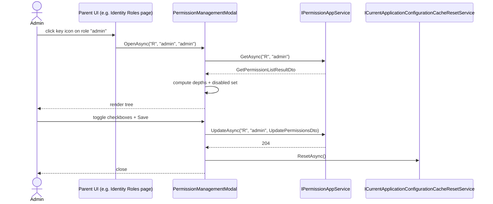

The UI side of permission management ships in four interlocking packages: `Volo.Abp.PermissionManagement.Web` for Razor Pages / MVC themes, `Volo.Abp.PermissionManagement.Blazor` for the shared Blazor surface, and the two hosts `Volo.Abp.PermissionManagement.Blazor.Server` and `Volo.Abp.PermissionManagement.Blazor.WebAssembly`. All four converge on a single component — `PermissionManagementModal` — which is what the Identity, OpenIddict, and tenant-management UIs open when an admin clicks a key icon next to a role, user, or client. This page walks each module's `ConfigureServices`, the modal's lifecycle, and the small extensibility hooks (AutoMapper profile, depth finder, application-configuration cache reset).

For the DTO tree the modal renders, see [Application](/modules/permission-management/application). For the framework-level permission system the modal indirectly drives, see [Permission System](/authz/permission-system).

## File inventory

### `Volo.Abp.PermissionManagement.Web`

| File | Type | Role |
| --- | --- | --- |
| `AbpPermissionManagementWebModule.cs` | module | Adds AutoMapper profile + virtual file system, disables the dynamic JS proxy for this area. |
| `AbpPermissionManagementWebAutoMapperProfile.cs` | profile | Maps `PermissionGroupDto` / `PermissionGrantInfoDto` / `ProviderInfoDto` to nested view models. |
| `Pages/AbpPermissionManagement/PermissionManagementModal.cshtml.cs` | page | The `OnGet` loads the tree; `OnPostAsync` saves it. |
| `Pages/AbpPermissionManagement/PermissionManagementModal.cshtml` | Razor | Server-rendered Bootstrap modal. |
| `Utils/IFlatTreeItem.cs` | interface | `ParentName`, `Depth` — the contract the depth finder walks. |
| `Utils/FlatTreeDepthFinder.cs` | service | Sets `Depth` on every permission view model so the UI can indent children. |

### `Volo.Abp.PermissionManagement.Blazor`

| File | Type | Role |
| --- | --- | --- |
| `AbpPermissionManagementBlazorModule.cs` | module | Depends on `AbpAspNetCoreComponentsWebThemingModule`, `AbpAutoMapperModule`, `Application.Contracts`; adds `AbpUiResource` as a base. |
| `Components/PermissionManagementModal.razor` | Razor | Blazor markup (Blazorise `Modal`, `Tabs`, `Check`). |
| `Components/PermissionManagementModal.razor.cs` | code-behind | `OpenAsync(providerName, providerKey, entityDisplayName)`, save logic, depth tracking. |

### `Volo.Abp.PermissionManagement.Blazor.Server` and `Volo.Abp.PermissionManagement.Blazor.WebAssembly`

| File | Type | Role |
| --- | --- | --- |
| `AbpPermissionManagementBlazorServerModule.cs` | module | Adds `AbpAspNetCoreComponentsServerThemingModule`. |
| `AbpPermissionManagementBlazorWebAssemblyModule.cs` | module | Adds `AbpAspNetCoreComponentsWebAssemblyThemingModule` + `HttpApi.Client` so the WASM host calls the API over HTTP. |

## The MVC / Razor Pages module

```csharp modules/permission-management/src/Volo.Abp.PermissionManagement.Web/AbpPermissionManagementWebModule.cs
[DependsOn(typeof(AbpPermissionManagementApplicationContractsModule))]
[DependsOn(typeof(AbpAspNetCoreMvcUiBootstrapModule))]
[DependsOn(typeof(AbpAutoMapperModule))]
public class AbpPermissionManagementWebModule : AbpModule
{
    public override void PreConfigureServices(ServiceConfigurationContext context)
    {
        context.Services.PreConfigure<AbpMvcDataAnnotationsLocalizationOptions>(options =>
        {
            options.AddAssemblyResource(typeof(AbpPermissionManagementResource));
        });

        PreConfigure<IMvcBuilder>(mvcBuilder =>
        {
            mvcBuilder.AddApplicationPartIfNotExists(typeof(AbpPermissionManagementWebModule).Assembly);
        });
    }

    public override void ConfigureServices(ServiceConfigurationContext context)
    {
        Configure<AbpVirtualFileSystemOptions>(options =>
        {
            options.FileSets.AddEmbedded<AbpPermissionManagementWebModule>();
        });

        context.Services.AddAutoMapperObjectMapper<AbpPermissionManagementWebModule>();
        Configure<AbpAutoMapperOptions>(options =>
        {
            options.AddProfile<AbpPermissionManagementWebAutoMapperProfile>(validate: true);
        });

        Configure<DynamicJavaScriptProxyOptions>(options =>
        {
            options.DisableModule(PermissionManagementRemoteServiceConsts.ModuleName);
        });
    }
}
```

Three things worth highlighting:

- The **virtual file system** picks up the embedded `.cshtml`, `.css`, and `.js` from this assembly. ABP modules ship their UI as embedded resources; that is what makes a single `dotnet add package` enough.
- `validate: true` on the AutoMapper profile means the boot check throws if any property mapping is broken — preferred over discovering it at first user click.
- **Disabling the dynamic JS proxy** matters because the Web UI fetches the permission tree by posting to its own Razor Page handler, not by calling the JS proxy. Leaving it enabled would expose a duplicate, less-typed endpoint to client JavaScript.

### AutoMapper profile

```csharp modules/permission-management/src/Volo.Abp.PermissionManagement.Web/AbpPermissionManagementWebAutoMapperProfile.cs
public class AbpPermissionManagementWebAutoMapperProfile : Profile
{
    public AbpPermissionManagementWebAutoMapperProfile()
    {
        CreateMap<PermissionGroupDto, PermissionManagementModal.PermissionGroupViewModel>()
            .Ignore(p => p.IsAllPermissionsGranted);

        CreateMap<PermissionGrantInfoDto, PermissionManagementModal.PermissionGrantInfoViewModel>()
            .ForMember(p => p.Depth, opts => opts.Ignore());

        CreateMap<ProviderInfoDto, PermissionManagementModal.ProviderInfoViewModel>();
    }
}
```

`Depth` and `IsAllPermissionsGranted` are computed post-mapping. The page model calls `FlatTreeDepthFinder` per group to set depths, and a final pass folds `IsAllPermissionsGranted = group.Permissions.All(p => p.IsGranted)`.

### Razor Page model

```csharp modules/permission-management/src/Volo.Abp.PermissionManagement.Web/Pages/AbpPermissionManagement/PermissionManagementModal.cshtml.cs
public class PermissionManagementModal : AbpPageModel
{
    [Required] [HiddenInput] [BindProperty(SupportsGet = true)]
    public string ProviderName { get; set; }

    [Required] [HiddenInput] [BindProperty(SupportsGet = true)]
    public string ProviderKey { get; set; }

    [BindProperty(SupportsGet = true)]
    public string ProviderKeyDisplayName { get; set; }

    [BindProperty]
    public List<PermissionGroupViewModel> Groups { get; set; }

    public virtual async Task<IActionResult> OnGetAsync()
    {
        ValidateModel();

        var result = await PermissionAppService.GetAsync(ProviderName, ProviderKey);

        EntityDisplayName = !string.IsNullOrWhiteSpace(ProviderKeyDisplayName)
            ? ProviderKeyDisplayName
            : result.EntityDisplayName;

        Groups = ObjectMapper
            .Map<List<PermissionGroupDto>, List<PermissionGroupViewModel>>(result.Groups)
            .OrderBy(g => g.DisplayName)
            .ToList();

        foreach (var group in Groups)
        {
            new FlatTreeDepthFinder<PermissionGrantInfoViewModel>().SetDepths(group.Permissions);
        }
        // ...
    }
}
```

The page is opened by other ABP UIs through `abp.ModalManager.open(...)` with a route to this handler, so the same modal is reused by Identity's user/role pages, the OpenIddict applications page, and the tenant-management roles page.

### Depth finder

```csharp modules/permission-management/src/Volo.Abp.PermissionManagement.Web/Utils/FlatTreeDepthFinder.cs
public class FlatTreeDepthFinder<T> where T : class, IFlatTreeItem
{
    public virtual void SetDepths(List<T> items)
        => SetDepths(items, null, 0);

    private static void SetDepths(List<T> items, string currentParent, int currentDepth)
    {
        foreach (var item in items)
        {
            if (item.ParentName == currentParent)
            {
                item.Depth = currentDepth;
                SetDepths(items, item.Name, currentDepth + 1);
            }
        }
    }
}
```

Permission definitions form a tree (`PermissionDefinition.AddChild`), but the DTO is flattened — `ParentName` is the only link the UI gets. The depth finder walks the flat list and sets `Depth` so the Razor / Blazor view can indent rows with `margin-inline-start`.

## The Blazor module

```csharp modules/permission-management/src/Volo.Abp.PermissionManagement.Blazor/AbpPermissionManagementBlazorModule.cs
[DependsOn(
    typeof(AbpAspNetCoreComponentsWebThemingModule),
    typeof(AbpAutoMapperModule),
    typeof(AbpPermissionManagementApplicationContractsModule)
    )]
public class AbpPermissionManagementBlazorModule : AbpModule
{
    public override void ConfigureServices(ServiceConfigurationContext context)
    {
        Configure<AbpLocalizationOptions>(options =>
        {
            options.Resources
                .Get<AbpPermissionManagementResource>()
                .AddBaseTypes(typeof(AbpUiResource));
        });
    }
}
```

This module is theming-agnostic: it depends on `AbpAspNetCoreComponentsWebThemingModule`, which is the shared theming contract. The Server and WebAssembly hosts each add their concrete theming module on top. No AutoMapper profile lives in the shared Blazor package because the Blazor modal works directly with the DTOs — there is no intermediate view model.

### Server vs WebAssembly

```csharp modules/permission-management/src/Volo.Abp.PermissionManagement.Blazor.Server/AbpPermissionManagementBlazorServerModule.cs
[DependsOn(
    typeof(AbpPermissionManagementBlazorModule),
    typeof(AbpAspNetCoreComponentsServerThemingModule)
)]
public class AbpPermissionManagementBlazorServerModule : AbpModule
{
}
```

```csharp modules/permission-management/src/Volo.Abp.PermissionManagement.Blazor.WebAssembly/AbpPermissionManagementBlazorWebAssemblyModule.cs
[DependsOn(
    typeof(AbpPermissionManagementBlazorModule),
    typeof(AbpAspNetCoreComponentsWebAssemblyThemingModule),
    typeof(AbpPermissionManagementHttpApiClientModule)
)]
public class AbpPermissionManagementBlazorWebAssemblyModule : AbpModule
{
}
```

The key difference is that the WebAssembly module pulls in `AbpPermissionManagementHttpApiClientModule`. A WASM host has no in-process app service, so calls to `IPermissionAppService` must go over HTTP through the static client proxy (see [HTTP API](/modules/permission-management/http-api#the-client-proxy-module)). The Server module skips that dependency because the app service lives in the same process.

## The Blazor modal

```csharp modules/permission-management/src/Volo.Abp.PermissionManagement.Blazor/Components/PermissionManagementModal.razor.cs
public partial class PermissionManagementModal
{
    [Inject] protected IPermissionAppService PermissionAppService { get; set; }
    [Inject] protected ICurrentApplicationConfigurationCacheResetService CurrentApplicationConfigurationCacheResetService { get; set; }
    [Inject] protected IOptions<AbpLocalizationOptions> LocalizationOptions { get; set; }

    protected Modal _modal;
    protected string _providerName;
    protected string _providerKey;
    protected string _entityDisplayName;
    protected List<PermissionGroupDto> _groups;
    protected List<PermissionGrantInfoDto> _disabledPermissions = new List<PermissionGrantInfoDto>();
    protected string _selectedTabName;
    protected int _grantedPermissionCount = 0;
    protected int _notGrantedPermissionCount = 0;
    protected bool _selectAllDisabled;
    protected Dictionary<string, int> _permissionDepths = new Dictionary<string, int>();

    public PermissionManagementModal()
    {
        LocalizationResource = typeof(AbpPermissionManagementResource);
    }

    public virtual async Task OpenAsync(string providerName, string providerKey, string entityDisplayName = null)
    {
        _providerName = providerName;
        _providerKey = providerKey;

        var result = await PermissionAppService.GetAsync(_providerName, _providerKey);

        _entityDisplayName = entityDisplayName ?? result.EntityDisplayName;
        _groups = result.Groups;
        // ...
    }
}
```

The public API a parent component sees is a single `OpenAsync(providerName, providerKey, entityDisplayName = null)` method. The Identity UI calls it from a role-list row click; tenant management calls it after fetching a tenant's owner role; OpenIddict calls it for client grants. Each consumer just adds the component once and grabs an `@ref`.

### Disabled permissions and "granted via"

The modal computes a set of "disabled" permissions — rows that are granted at a higher provider level (for example, "this permission is on for a user only because their role has it"). The UI greys those rows out and labels them with the granting provider. The logic:

```csharp modules/permission-management/src/Volo.Abp.PermissionManagement.Blazor/Components/PermissionManagementModal.razor.cs
foreach (var permission in _groups.SelectMany(x => x.Permissions))
{
    if (permission.IsGranted && permission.GrantedProviders.All(x => x.ProviderName != _providerName))
    {
        _disabledPermissions.Add(permission);
        continue;
    }
    // ...
}
```

That is the reason `GetPermissionListResultDto` carries `GrantedProviders` instead of a single boolean — the server returns the full provenance, and the UI decides what to disable.

### Resetting the configuration cache after save

After a successful save, the modal calls:

```csharp
await CurrentApplicationConfigurationCacheResetService.ResetAsync();
```

`ICurrentApplicationConfigurationCacheResetService` is the framework-side cache for `AbpApplicationConfiguration`, the JSON payload that the Blazor host downloads on startup and which contains the granted permissions for the *current* user. Without the reset the UI would not see the new grants until the next full reload.

### Tree rendering

The Razor markup uses Blazorise `Tabs` for the groups and a hand-rolled `<Field>` per permission, indented by `_permissionDepths[name] * 20px`:

```razor modules/permission-management/src/Volo.Abp.PermissionManagement.Blazor/Components/PermissionManagementModal.razor
<Field Style="@($"margin-inline-start: {GetPermissionDepthOrDefault(permission.Name) * 20}px")">
    <Check Disabled="@(IsDisabledPermission(permission))"
           Cursor="Cursor.Pointer"
           Checked="@permission.IsGranted"
           CheckedChanged="@(b => PermissionChanged(b, group, permission))"
           TValue="bool">
        @GetShownName(permission)
    </Check>
</Field>
```

The header shows live "X of Y granted" counters and a master "Select all in all tabs" checkbox that the `GrantAll` property toggles in bulk.

## Modal lifecycle at a glance



## Cross-references

- The DTO shape the modal binds to is documented in [Application](/modules/permission-management/application).
- The integration that maps a *role* row to `("R", "admin")` lives in the Identity module — see [Identity overview](/modules/identity/overview).
- The parallel UI for settings (with its own modal/page model and contributor system) is in [Setting management Blazor & Web UI](/modules/setting-management/blazor-and-web).
- The framework-level permission system that the modal indirectly drives is at [Permission System](/authz/permission-system).
