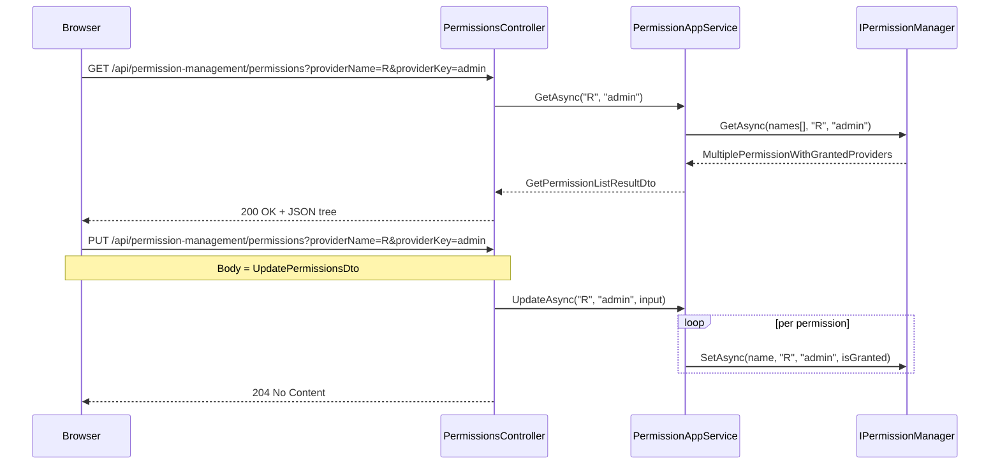
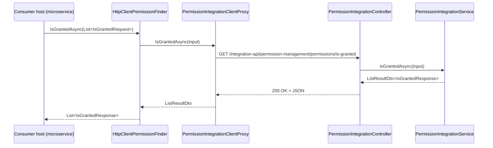

The HTTP layer of the permission-management module is intentionally a one-to-one mirror of the application layer. `PermissionsController` re-exposes `IPermissionAppService` over `api/permission-management/permissions`, `PermissionIntegrationController` exposes the cross-host grant check at `integration-api/permission-management/permissions/is-granted`, and the `HttpApi.Client` package ships pre-generated `ClientProxy` types so a remote host can call either contract with strong types. This page walks each route, shows the matching client proxy entry point, and documents how the module hooks into AutoMapper / dynamic-proxy generation.

For the upstream contracts these controllers re-export, see [Application](/modules/permission-management/application). For the Blazor / Razor Pages consumers, see [Blazor and Web UI](/modules/permission-management/blazor-and-web).

## File inventory

### `Volo.Abp.PermissionManagement.HttpApi`

| File | Type | Role |
| --- | --- | --- |
| `AbpPermissionManagementHttpApiModule.cs` | module | Depends on `AbpAspNetCoreMvcModule` + `Application.Contracts`; localizes the UI resource and adds the assembly as an MVC application part. |
| `PermissionsController.cs` | controller | `IPermissionAppService` over REST, route `api/permission-management/permissions`. |
| `Integration/PermissionIntegrationController.cs` | controller | `IPermissionIntegrationService` over REST, route `integration-api/permission-management/permissions/is-granted`. |

### `Volo.Abp.PermissionManagement.HttpApi.Client`

| File | Type | Role |
| --- | --- | --- |
| `AbpPermissionManagementHttpApiClientModule.cs` | module | Calls `AddStaticHttpClientProxies(typeof(AbpPermissionManagementApplicationContractsModule).Assembly, RemoteServiceName)`. |
| `ClientProxies/PermissionsClientProxy.cs` / `*.Generated.cs` | proxy | Strongly typed client for `IPermissionAppService`. |
| `ClientProxies/Integration/PermissionIntegrationClientProxy.cs` / `*.Generated.cs` | proxy | Strongly typed client for `IPermissionIntegrationService`. |
| `HttpClientPermissionFinder.cs` | service | `IPermissionFinder` implementation that delegates to the integration proxy. |

## The HTTP module

```csharp modules/permission-management/src/Volo.Abp.PermissionManagement.HttpApi/Volo/Abp/PermissionManagement/AbpPermissionManagementHttpApiModule.cs
[DependsOn(
    typeof(AbpPermissionManagementApplicationContractsModule),
    typeof(AbpAspNetCoreMvcModule)
    )]
public class AbpPermissionManagementHttpApiModule : AbpModule
{
    public override void PreConfigureServices(ServiceConfigurationContext context)
    {
        PreConfigure<IMvcBuilder>(mvcBuilder =>
        {
            mvcBuilder.AddApplicationPartIfNotExists(typeof(AbpPermissionManagementHttpApiModule).Assembly);
        });
    }

    public override void ConfigureServices(ServiceConfigurationContext context)
    {
        Configure<AbpLocalizationOptions>(options =>
        {
            options.Resources
                .Get<AbpPermissionManagementResource>()
                .AddBaseTypes(typeof(AbpUiResource));
        });
    }
}
```

Two important details:

- The `AddApplicationPartIfNotExists` call ensures both controllers are discovered even when the host assembly doesn't reference them directly (typical in a microservice that loads modules dynamically).
- `AbpUiResource` is added as a base for `AbpPermissionManagementResource` so generic UI strings (`"Save"`, `"Cancel"`) inherit, which the controllers' error responses use through `IStringLocalizer`.

Notice it does *not* depend on `AbpPermissionManagementDomainModule`. A host that wants only the HTTP surface — for example a reverse-proxy host that forwards to another service — can use the HTTP API module without taking the persistence packages. In practice the framework's ABP convention means whichever host hosts the controllers also hosts the app services, so the Application module is typically pulled in elsewhere.

## `PermissionsController`

```csharp modules/permission-management/src/Volo.Abp.PermissionManagement.HttpApi/Volo/Abp/PermissionManagement/PermissionsController.cs
[RemoteService(Name = PermissionManagementRemoteServiceConsts.RemoteServiceName)]
[Area(PermissionManagementRemoteServiceConsts.ModuleName)]
[Route("api/permission-management/permissions")]
public class PermissionsController : AbpControllerBase, IPermissionAppService
{
    protected IPermissionAppService PermissionAppService { get; }

    public PermissionsController(IPermissionAppService permissionAppService)
    {
        PermissionAppService = permissionAppService;
    }

    [HttpGet]
    public virtual Task<GetPermissionListResultDto> GetAsync(string providerName, string providerKey)
    {
        return PermissionAppService.GetAsync(providerName, providerKey);
    }

    [HttpPut]
    public virtual Task UpdateAsync(string providerName, string providerKey, UpdatePermissionsDto input)
    {
        return PermissionAppService.UpdateAsync(providerName, providerKey, input);
    }
}
```

The controller is a thin pass-through. The class-level attributes do the heavy lifting:

| Attribute | Effect |
| --- | --- |
| `[RemoteService(Name = "AbpPermissionManagement")]` | Tags the controller for the dynamic JavaScript proxy generator and the API definition discovery service. |
| `[Area("permissionManagement")]` | Groups the controller in MVC area routing — matters mostly for the OpenAPI document and conventional URL grouping. |
| `[Route("api/permission-management/permissions")]` | Fixes the base URL. |
| `: IPermissionAppService` | Inherits the `[Authorize]` attribute and the method-level routing conventions from the app service (the framework's controller convention is route-by-interface). |

### Routes

| Verb | Path | Action | Body / Query |
| --- | --- | --- | --- |
| `GET` | `/api/permission-management/permissions?providerName=R&providerKey=admin` | `GetAsync` | `providerName` and `providerKey` as query parameters. |
| `PUT` | `/api/permission-management/permissions?providerName=R&providerKey=admin` | `UpdateAsync` | `UpdatePermissionsDto` in the body. |

Both routes go through ABP's dynamic action filters: `[Authorize]` on the app service runs, then the app service's own `CheckProviderPolicy(providerName)` runs (see [Application](/modules/permission-management/application#provider-policy-enforcement)).

<Note>
The `providerName` and `providerKey` go in the query string by default because they are scalars. The `UpdatePermissionsDto` body is the array of `(name, isGranted)` pairs — the controller does not split into per-permission PATCH calls.
</Note>

## The integration service

The integration controller exposes a separate "kernel" surface for service-to-service calls:

```csharp modules/permission-management/src/Volo.Abp.PermissionManagement.HttpApi/Volo/Abp/PermissionManagement/Integration/PermissionIntegrationController.cs
[RemoteService(Name = PermissionManagementRemoteServiceConsts.RemoteServiceName)]
[Area(PermissionManagementRemoteServiceConsts.ModuleName)]
[ControllerName("PermissionIntegration")]
[Route("integration-api/permission-management/permissions")]
public class PermissionIntegrationController : AbpControllerBase, IPermissionIntegrationService
{
    protected IPermissionIntegrationService PermissionIntegrationService { get; }

    [HttpGet]
    [Route("is-granted")]
    public virtual Task<ListResultDto<IsGrantedResponse>> IsGrantedAsync(List<IsGrantedRequest> input)
    {
        return PermissionIntegrationService.IsGrantedAsync(input);
    }
}
```

The route prefix is `integration-api/` instead of `api/` — that is the convention ABP uses for `[IntegrationService]` controllers. Several things flow from that prefix:

- The dynamic JavaScript proxy generator and the public API definition discovery service skip routes under `integration-api/`.
- API gateways and OpenAPI tooling can be configured to exclude the prefix from public docs while still routing to it.
- Authorization is typically tightened with a separate scope/policy in OpenIddict / IdentityServer configurations.

### `IsGrantedRequest` and `IsGrantedResponse`

Both DTOs live in `Volo.Abp.PermissionManagement.Domain.Shared` so any client can reference them without taking the management UI. They are batch-oriented — a single request carries one user and many permission names, and the response carries a `Dictionary<string, bool>` keyed by permission name:

```csharp modules/permission-management/src/Volo.Abp.PermissionManagement.Domain.Shared/Volo/Abp/PermissionManagement/IsGrantedRequest.cs
public class IsGrantedRequest
{
    public Guid UserId { get; set; }

    public string[] PermissionNames { get; set; }
}
```

```csharp modules/permission-management/src/Volo.Abp.PermissionManagement.Domain.Shared/Volo/Abp/PermissionManagement/IsGrantedResponse.cs
public class IsGrantedResponse
{
    public Guid UserId { get; set; }

    public Dictionary<string, bool> Permissions { get; set; }
}
```

The matching server implementation wraps a single call to `IPermissionFinder.IsGrantedAsync(...)`:

```csharp modules/permission-management/src/Volo.Abp.PermissionManagement.Application/Volo/Abp/PermissionManagement/Integration/PermissionIntegrationService.cs
[IntegrationService]
public class PermissionIntegrationService : ApplicationService, IPermissionIntegrationService
{
    protected IPermissionFinder PermissionFinder { get; }

    public virtual async Task<ListResultDto<IsGrantedResponse>> IsGrantedAsync(List<IsGrantedRequest> input)
    {
        return new ListResultDto<IsGrantedResponse>(await PermissionFinder.IsGrantedAsync(input));
    }
}
```

`HttpClientPermissionFinder` calls this service so a remote host's `IPermissionFinder.IsGrantedAsync` becomes a REST call to the management host. Bundling many permissions and many users into one round trip is the whole reason the integration surface exists separately from `PermissionsController`.

## The client proxy module

```csharp modules/permission-management/src/Volo.Abp.PermissionManagement.HttpApi.Client/Volo/Abp/PermissionManagement/AbpPermissionManagementHttpApiClientModule.cs
[DependsOn(
    typeof(AbpPermissionManagementApplicationContractsModule),
    typeof(AbpHttpClientModule))]
public class AbpPermissionManagementHttpApiClientModule : AbpModule
{
    public override void ConfigureServices(ServiceConfigurationContext context)
    {
        context.Services.AddStaticHttpClientProxies(
            typeof(AbpPermissionManagementApplicationContractsModule).Assembly,
            PermissionManagementRemoteServiceConsts.RemoteServiceName
        );
    }
}
```

`AddStaticHttpClientProxies` walks every `IRemoteService` interface in the contracts assembly and registers the corresponding `*ClientProxy` from this assembly as the DI implementation. After the module loads, any DI consumer of `IPermissionAppService` or `IPermissionIntegrationService` automatically gets the HTTP-backed proxy.

### `PermissionsClientProxy`

```csharp modules/permission-management/src/Volo.Abp.PermissionManagement.HttpApi.Client/ClientProxies/Volo/Abp/PermissionManagement/PermissionsClientProxy.cs
[Dependency(ReplaceServices = true)]
[ExposeServices(typeof(IPermissionAppService))]
public partial class PermissionsClientProxy : ClientProxyBase<IPermissionAppService>, IPermissionAppService
{
}
```

The user-editable partial is empty; everything is delegated to `PermissionsClientProxy.Generated.cs`, which contains the actual `await RequestAsync<…>("…", new ClientProxyRequestTypeValue { … })` calls. ABP regenerates the `.Generated.cs` from the contracts assembly so contract changes flow through automatically.

### `PermissionIntegrationClientProxy`

The integration proxy follows the same partial split. The matching `HttpClientPermissionFinder` then turns the result back into the framework-shaped contract:

```csharp modules/permission-management/src/Volo.Abp.PermissionManagement.HttpApi.Client/Volo/Abp/PermissionManagement/HttpClientPermissionFinder.cs
[Dependency(TryRegister = true)]
public class HttpClientPermissionFinder : IPermissionFinder, ITransientDependency
{
    protected IPermissionIntegrationService PermissionIntegrationService { get; }

    public virtual async Task<List<IsGrantedResponse>> IsGrantedAsync(List<IsGrantedRequest> requests)
    {
        return (await PermissionIntegrationService.IsGrantedAsync(requests)).Items.ToList();
    }
}
```

`[Dependency(TryRegister = true)]` means an alternate `IPermissionFinder` (the in-process one from the Domain package) wins if the consuming host has both modules loaded. A pure-client host registers only `HttpClientPermissionFinder` and goes over HTTP for every grant lookup.

## Composition flow





## Identity and policy plumbing on the wire

The two routes above are gated only by `[Authorize]` plus the provider-policy check inside the app service. For an HTTP-API host that lives behind OpenIddict, the typical configuration adds:

- A bearer token requirement on `api/permission-management/**` via the ASP.NET Core auth pipeline.
- A scope claim such as `AbpPermissionManagement` on the access token issued by OpenIddict.
- The policy that `ProviderPolicies` maps to (for example `IdentityPermissions.Roles.ManagePermissions`) granted to whoever is allowed to call.

See [Identity module overview](/modules/identity/overview) for the Identity-side wiring of those policies. The matching framework story for resolving the claims into `PermissionGrantResult` is in [Permission System](/authz/permission-system).

## OpenAPI surface

Because both controllers implement `IPermissionAppService` / `IPermissionIntegrationService`, ABP's API description provider tags both with the same area name (`permissionManagement`). The resulting OpenAPI document groups them under that tag and emits the JSON schema for every DTO automatically. Hosts that turn on Swashbuckle pick them up without further wiring.

The `[RemoteService]` attribute is what the dynamic JavaScript proxy generator looks for; the `Web` module disables that generator for this area by name (see [Blazor and Web UI](/modules/permission-management/blazor-and-web)) because it wants to render its own server-side modal instead of going through the JS proxy.

## Cross-references

- The contracts and DTOs are documented in [Application](/modules/permission-management/application).
- The repository layer behind both routes is in [Persistence](/modules/permission-management/persistence).
- The matching "I am a client" story for setting management is in [Setting management HTTP API](/modules/setting-management/http-api).
- For the framework-level `[IntegrationService]` and `[RemoteService]` conventions, see [HTTP API conventions](/http/overview).
