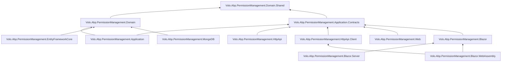

The `modules/permission-management/` directory ships the persistent, manageable companion to ABP's framework-level permission system. Where `framework/src/Volo.Abp.Authorization` defines `PermissionDefinition`, `IPermissionChecker`, and the value-provider chain, this module supplies the missing rung that turns those abstractions into a real product: a `PermissionGrant` aggregate, an `IPermissionManager` for writing grants, a chain of `IPermissionManagementProvider`s, a cached `IPermissionStore`, the `PermissionsController` REST surface, EF Core + MongoDB persistence, and a Blazor / Razor Pages permission editor modal. This overview maps the whole package matrix, draws the `[DependsOn]` graph, and links to the per-layer deep dives.

<Info>
Source root: [`modules/permission-management/src/`](https://github.com/abpframework/abp/tree/dev/modules/permission-management/src). All file paths on this page are relative to that root unless noted.
</Info>

For the framework-side abstractions that this module fills in, start at [Permission System](/authz/permission-system) and the shorter overview at [Permission Management Module](/authz/permission-management-module). The wider authorization story lives at [Authorization stack overview](/authz/overview).

## Why a dedicated module?

`Volo.Abp.Authorization.Permissions` already gives you `PermissionDefinitionProvider`, `IPermissionChecker`, and the `RolePermissionValueProvider` / `UserPermissionValueProvider` / `ClientPermissionValueProvider` chain. What it does *not* give you is:

- A persisted record of "this grant exists" — by default the framework registers a `NullPermissionStore` that always returns `false`.
- A way to *write* a grant for a role or a user from an admin UI.
- A way to invalidate the per-grant cache when an admin clicks a checkbox.
- A way to discover permissions defined by *other* hosts (microservices) at runtime.
- Tables and indexes for any of the above.

The permission-management module solves each of these in its own package so you can pull in only the pieces you need. A pure consumer (an HTTP API microservice that wants to *check* permissions but not edit them) might depend on only `Volo.Abp.PermissionManagement.HttpApi.Client` to call a central management host, while the management host itself takes the full stack including `EntityFrameworkCore` and `Web` / `Blazor`.

## Package matrix

Each row maps to a project folder under `modules/permission-management/src/`.

| Package | Project folder | Layer | Primary purpose |
| --- | --- | --- | --- |
| `Volo.Abp.PermissionManagement.Domain.Shared` | `Volo.Abp.PermissionManagement.Domain.Shared/` | Domain.Shared | `PermissionGrantConsts`, `PermissionDefinitionRecordConsts`, `IsGrantedRequest`/`IsGrantedResponse`, `IPermissionFinder`, localization resource. |
| `Volo.Abp.PermissionManagement.Domain` | `Volo.Abp.PermissionManagement.Domain/` | Domain | `PermissionGrant` aggregate, `IPermissionManager` + `PermissionManager`, `PermissionStore`, `IPermissionManagementProvider`, `StaticPermissionSaver`, dynamic definition store, cache invalidator. |
| `Volo.Abp.PermissionManagement.Application.Contracts` | `Volo.Abp.PermissionManagement.Application.Contracts/` | App.Contracts | `IPermissionAppService`, DTOs (`GetPermissionListResultDto`, `UpdatePermissionsDto`, `PermissionGrantInfoDto`), `IPermissionIntegrationService`. |
| `Volo.Abp.PermissionManagement.Application` | `Volo.Abp.PermissionManagement.Application/` | Application | `PermissionAppService` and `PermissionIntegrationService` implementations. |
| `Volo.Abp.PermissionManagement.HttpApi` | `Volo.Abp.PermissionManagement.HttpApi/` | HTTP API | `PermissionsController`, `PermissionIntegrationController`. |
| `Volo.Abp.PermissionManagement.HttpApi.Client` | `Volo.Abp.PermissionManagement.HttpApi.Client/` | HTTP API Client | Generated client proxies and `HttpClientPermissionFinder`. |
| `Volo.Abp.PermissionManagement.EntityFrameworkCore` | `Volo.Abp.PermissionManagement.EntityFrameworkCore/` | Persistence | `PermissionManagementDbContext`, EF Core repositories and `ConfigurePermissionManagement()` model builder. |
| `Volo.Abp.PermissionManagement.MongoDB` | `Volo.Abp.PermissionManagement.MongoDB/` | Persistence | `PermissionManagementMongoDbContext` and MongoDB repositories. |
| `Volo.Abp.PermissionManagement.Web` | `Volo.Abp.PermissionManagement.Web/` | UI (MVC) | Razor Pages permission editor modal (`Pages/AbpPermissionManagement/PermissionManagementModal.cshtml`). |
| `Volo.Abp.PermissionManagement.Blazor` | `Volo.Abp.PermissionManagement.Blazor/` | UI (Blazor) | `Components/PermissionManagementModal.razor`, theming, localization. |
| `Volo.Abp.PermissionManagement.Blazor.Server` | `Volo.Abp.PermissionManagement.Blazor.Server/` | UI (Blazor Server) | Server-hosted Blazor entry module. |
| `Volo.Abp.PermissionManagement.Blazor.WebAssembly` | `Volo.Abp.PermissionManagement.Blazor.WebAssembly/` | UI (Blazor WASM) | WASM entry module that depends on `HttpApi.Client`. |
| `Volo.Abp.PermissionManagement.Installer` | `Volo.Abp.PermissionManagement.Installer/` | Tooling | NuGet meta-package used by the ABP CLI installer. |

<Note>
Each persistence package is mutually exclusive — depend on **either** `EntityFrameworkCore` or `MongoDB`, not both. The Blazor UI flavours (`Server` / `WebAssembly`) wrap the shared `Volo.Abp.PermissionManagement.Blazor` package; pick one based on your render mode.
</Note>

## Layered composition

The `[DependsOn]` graph below is taken from the module classes in each project. Arrows point from a depending module to the module it `[DependsOn]`.



Notice that `Web` and `Blazor` depend only on `Application.Contracts`, not on `Application` or `Domain`. That is the standard ABP UI rule: a UI module talks to app services through interfaces and DTOs and stays portable across in-process and HTTP-client wiring.

## Composition recipes

Most solutions mix the packages above in one of three shapes:

<CardGroup cols={3}>
  <Card title="Monolith host" icon="server">
    Domain + Application + HttpApi + one persistence package + one UI package. Everything in one process, no `HttpApi.Client`.
  </Card>
  <Card title="Management microservice" icon="network-wired">
    Domain + Application + HttpApi + EF Core (or MongoDB). Consumers depend on `HttpApi.Client` and call the integration endpoint.
  </Card>
  <Card title="UI-only host (BFF)" icon="window">
    Blazor.WebAssembly + HttpApi.Client. The remote permissions API does all the work.
  </Card>
</CardGroup>

## Key types per layer

The deep-dive pages cover each of these; the table is here as a roadmap.

| Layer | Type | File | Page |
| --- | --- | --- | --- |
| Domain.Shared | `IsGrantedRequest` / `IsGrantedResponse` | `Volo.Abp.PermissionManagement.Domain.Shared/Volo/Abp/PermissionManagement/IsGrantedRequest.cs` | [Domain](/modules/permission-management/domain) |
| Domain.Shared | `IPermissionFinder` | `Volo.Abp.PermissionManagement.Domain.Shared/Volo/Abp/PermissionManagement/IPermissionFinder.cs` | [Domain](/modules/permission-management/domain) |
| Domain | `PermissionGrant` | `Volo.Abp.PermissionManagement.Domain/Volo/Abp/PermissionManagement/PermissionGrant.cs` | [Domain](/modules/permission-management/domain) |
| Domain | `IPermissionManager` / `PermissionManager` | `Volo.Abp.PermissionManagement.Domain/Volo/Abp/PermissionManagement/PermissionManager.cs` | [Domain](/modules/permission-management/domain) |
| Domain | `PermissionStore` (implements `IPermissionStore`) | `Volo.Abp.PermissionManagement.Domain/Volo/Abp/PermissionManagement/PermissionStore.cs` | [Domain](/modules/permission-management/domain) |
| Domain | `IPermissionManagementProvider` / `PermissionManagementProvider` | `Volo.Abp.PermissionManagement.Domain/Volo/Abp/PermissionManagement/PermissionManagementProvider.cs` | [Domain](/modules/permission-management/domain) |
| Domain | `IStaticPermissionSaver` / `StaticPermissionSaver` | `Volo.Abp.PermissionManagement.Domain/Volo/Abp/PermissionManagement/StaticPermissionSaver.cs` | [Domain](/modules/permission-management/domain) |
| Application | `PermissionAppService` | `Volo.Abp.PermissionManagement.Application/Volo/Abp/PermissionManagement/PermissionAppService.cs` | [Application](/modules/permission-management/application) |
| HTTP API | `PermissionsController` | `Volo.Abp.PermissionManagement.HttpApi/Volo/Abp/PermissionManagement/PermissionsController.cs` | [HTTP API](/modules/permission-management/http-api) |
| Persistence | `PermissionManagementDbContext` / `Mongo*` | `Volo.Abp.PermissionManagement.EntityFrameworkCore/.../PermissionManagementDbContext.cs` | [Persistence](/modules/permission-management/persistence) |
| UI | `PermissionManagementModal` | `Volo.Abp.PermissionManagement.Blazor/Components/PermissionManagementModal.razor` | [Blazor & Web UI](/modules/permission-management/blazor-and-web) |

## Module root and entry classes

Each project exposes exactly one `AbpModule` subclass. The domain module is the linchpin — it wires options, schedules the dynamic permission initializer, and pulls in `AbpAuthorizationModule`:

```csharp modules/permission-management/src/Volo.Abp.PermissionManagement.Domain/Volo/Abp/PermissionManagement/AbpPermissionManagementDomainModule.cs
[DependsOn(typeof(AbpAuthorizationModule))]
[DependsOn(typeof(AbpDddDomainModule))]
[DependsOn(typeof(AbpPermissionManagementDomainSharedModule))]
[DependsOn(typeof(AbpCachingModule))]
[DependsOn(typeof(AbpJsonModule))]
public class AbpPermissionManagementDomainModule : AbpModule
{
    public override void ConfigureServices(ServiceConfigurationContext context)
    {
        if (context.Services.IsDataMigrationEnvironment())
        {
            Configure<PermissionManagementOptions>(options =>
            {
                options.SaveStaticPermissionsToDatabase = false;
                options.IsDynamicPermissionStoreEnabled = false;
            });
        }
    }
}
```

In a data-migration host the module disables both background tasks — you do *not* want a migrations runner to race the application on the permissions table.

## The PermissionGrant row

`PermissionGrant` is the single table this module owns. Every "Admin can do something" decision the management UI persists is one row here:

```csharp modules/permission-management/src/Volo.Abp.PermissionManagement.Domain/Volo/Abp/PermissionManagement/PermissionGrant.cs
public class PermissionGrant : Entity<Guid>, IMultiTenant
{
    public virtual Guid? TenantId { get; protected set; }

    [NotNull]
    public virtual string Name { get; protected set; }

    [NotNull]
    public virtual string ProviderName { get; protected set; }

    [CanBeNull]
    public virtual string ProviderKey { get; protected internal set; }
}
```

That four-tuple `(TenantId, Name, ProviderName, ProviderKey)` is the unique index defined in the EF Core mapping. `Name` is the permission name (for example `"AbpIdentity.Users.Update"`), `ProviderName` is the kind of subject (`"R"` for a role, `"U"` for a user, `"C"` for an OpenIddict client), and `ProviderKey` is the subject id (role name, user id, client id). See [Persistence](/modules/permission-management/persistence) for the full mapping and index list.

## Runtime flow at a glance

When `IPermissionChecker.IsGrantedAsync("AbpIdentity.Users.Update")` fires for an authenticated user, the framework asks each `ISettingValueProvider`-equivalent (`UserPermissionValueProvider`, `RolePermissionValueProvider`, `ClientPermissionValueProvider`) which in turn delegates to `IPermissionStore`. With this module installed, the implementation that fields the call is `PermissionStore`:

```mermaid
sequenceDiagram
    actor Caller as Caller code
    participant PC as IPermissionChecker
    participant VP as PermissionValueProvider chain
    participant PS as PermissionStore (this module)
    participant Cache as IDistributedCache&lt;PermissionGrantCacheItem&gt;
    participant Repo as IPermissionGrantRepository

    Caller->>PC: IsGrantedAsync("X")
    PC->>VP: walk providers (U, R, C, ...)
    VP->>PS: IsGrantedAsync("X", "R", "admin")
    PS->>Cache: GetAsync("pn:R,pk:admin,n:X")
    alt cache hit
        Cache-->>PS: PermissionGrantCacheItem(true)
    else cache miss
        PS->>Repo: GetListAsync("R", "admin")
        Repo-->>PS: List<PermissionGrant>
        PS->>Cache: SetManyAsync(items)
    end
    PS-->>VP: true / false
    VP-->>PC: PermissionGrantResult
    PC-->>Caller: true / false
```

The matching write path — `PermissionAppService.UpdateAsync` → `IPermissionManager.SetAsync` → the right `IPermissionManagementProvider` — is laid out in [Application](/modules/permission-management/application).

## What this module does *not* do

<Warning>
This module persists *grants*, not *definitions*. Permission *definitions* (the catalog of permission names) come from `PermissionDefinitionProvider`s in your own assemblies and are aggregated by the framework's `PermissionDefinitionManager`. The dynamic store this module ships (`DynamicPermissionDefinitionStore`) is an opt-in cache of records pushed by *other* services for cross-host discovery, not a UI for defining your own permissions.
</Warning>

It also has no opinion about *who* can edit grants — every entry point on `PermissionAppService` calls `CheckProviderPolicy(providerName)`, which looks up a policy name in `PermissionManagementOptions.ProviderPolicies`. Modules that introduce a provider (Identity, OpenIddict, …) are responsible for registering both the provider class and the matching policy.

## Cross-module integration points

The packages on this page are consumed by several adjacent ABP modules:

| Consumer | What it adds |
| --- | --- |
| `modules/identity` | `RolePermissionManagementProvider` (`"R"`) and `UserPermissionManagementProvider` (`"U"`) ship in `Volo.Abp.PermissionManagement.Domain.Identity`. See [Identity module overview](/modules/identity/overview). |
| `modules/openiddict` | `ClientPermissionManagementProvider` (`"C"`) registered against this module's `IPermissionManager`. |
| `modules/setting-management` | Uses its own `ISettingManagementProvider` chain but shares the same caching and dynamic-definition pattern documented here. See [Setting management overview](/modules/setting-management/overview). |

## Where to go next

<CardGroup cols={2}>
  <Card title="Domain layer" icon="layer-group" href="/modules/permission-management/domain">
    `PermissionGrant`, `IPermissionManager`, `PermissionStore`, providers, `StaticPermissionSaver`.
  </Card>
  <Card title="Application layer" icon="cubes" href="/modules/permission-management/application">
    `PermissionAppService`, the `UpdatePermissionsDto` shape, and provider-policy enforcement.
  </Card>
  <Card title="HTTP API" icon="server" href="/modules/permission-management/http-api">
    `PermissionsController`, `PermissionIntegrationController`, and the client-proxy module.
  </Card>
  <Card title="Persistence" icon="database" href="/modules/permission-management/persistence">
    EF Core / MongoDB DbContexts, repositories, and the schema.
  </Card>
  <Card title="Blazor & Web UI" icon="window-maximize" href="/modules/permission-management/blazor-and-web">
    `PermissionManagementModal` — the tree editor consumed by Identity and friends.
  </Card>
  <Card title="Framework primitives" icon="puzzle-piece" href="/authz/permission-system">
    `PermissionDefinition`, `IPermissionChecker`, value providers — the layer below this module.
  </Card>
</CardGroup>
