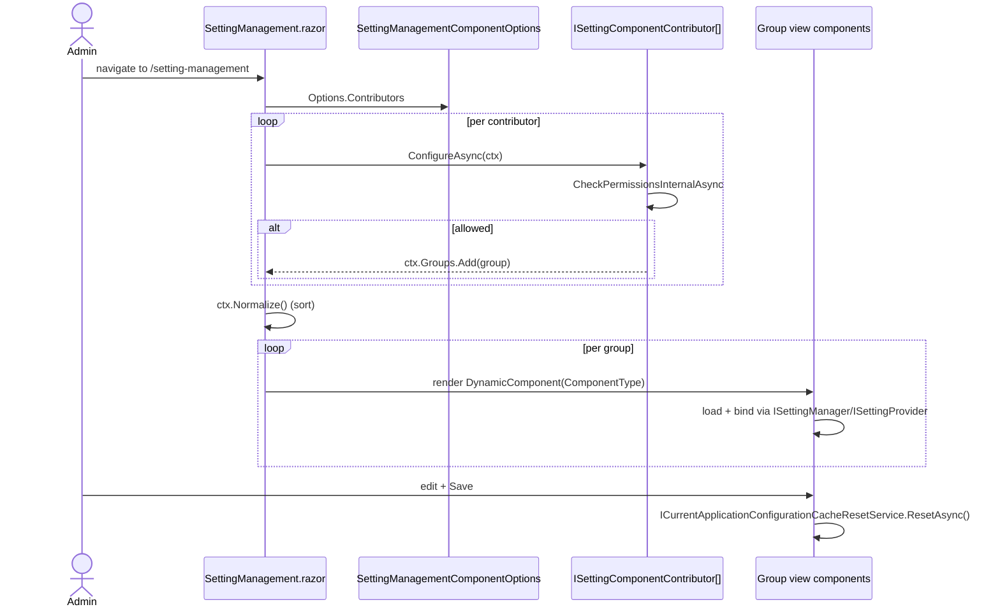

The UI side of setting-management ships in four packages: `Volo.Abp.SettingManagement.Web` for Razor Pages / MVC themes, `Volo.Abp.SettingManagement.Blazor` for the shared Blazor surface, and the two render-mode hosts `Volo.Abp.SettingManagement.Blazor.Server` and `Volo.Abp.SettingManagement.Blazor.WebAssembly`. The UI is built around a *contributor* extension point: the Web module ships `ISettingPageContributor`; the Blazor module ships the analogous `ISettingComponentContributor`. The two built-in contributors (`EmailingPageContributor`, `TimeZonePageContributor`) register the email and time-zone groups, and any consumer module — `Volo.Abp.Account.*`, `Volo.Abp.AuditLogging.*`, the application itself — can add its own group on the same `/SettingManagement` page.

For the contracts the UI binds to, see [Application](/modules/setting-management/application). For the framework-level setting system below this module, see [Settings overview](/settings-features/settings-overview).

## File inventory

### `Volo.Abp.SettingManagement.Web`

| File | Type | Role |
| --- | --- | --- |
| `AbpSettingManagementWebModule.cs` | module | Adds `SettingManagementMainMenuContributor`, registers built-in contributors, AutoMapper, embedded files. |
| `SettingManagementWebAutoMapperProfile.cs` | profile | DTO → view-model mappings used by the view components. |
| `Pages/SettingManagement/Index.cshtml(.cs)` | page | `[Authorize]` + `[RequiresFeature(Enable)]`; renders every available group. |
| `Pages/SettingManagement/SettingManagementPageOptions.cs` | options | `Contributors` list of `ISettingPageContributor`. |
| `Pages/SettingManagement/ISettingPageContributor.cs` / `SettingPageContributorBase.cs` | extension | Per-group "add a tab" hook with permission + feature gates. |
| `Pages/SettingManagement/SettingPageContributorManager.cs` | service | Walks contributors, calls `CheckPermissionsAsync` + feature checks, returns the live list. |
| `Pages/SettingManagement/Components/EmailSettingGroup/*` | view component | Renders the email tab, including the "Send test email" modal. |
| `Pages/SettingManagement/Components/TimeZoneSettingGroup/*` | view component | Renders the time-zone tab. |
| `Settings/EmailingPageContributor.cs`, `Settings/TimeZonePageContributor.cs` | contributors | Default registrations. |
| `Navigation/SettingManagementMainMenuContributor.cs` | menu | Adds the "Settings" item under Administration. |

### `Volo.Abp.SettingManagement.Blazor`

| File | Type | Role |
| --- | --- | --- |
| `AbpSettingManagementBlazorModule.cs` | module | Adds Blazor contributors, AutoMapper profile, router additional assembly, navigation menu. |
| `SettingManagementBlazorAutoMapperProfile.cs` | profile | DTO → Blazor view-model mappings. |
| `SettingManagementComponentOptions.cs` | options | `Contributors` list of `ISettingComponentContributor`. |
| `ISettingComponentContributor.cs` / `SettingComponentCreationContext.cs` | extension | Blazor-side contributor contract. |
| `SettingComponentGroup.cs` | model | `(Id, DisplayName, ComponentType, Parameter, Order)` tuple consumed by the page. |
| `Pages/SettingManagement/SettingManagement.razor(.cs)` | page | Hosts the contributor groups; `/setting-management` route. |
| `Pages/SettingManagement/EmailSettingGroup/EmailSettingGroupViewComponent.razor(.cs)` | component | Blazor email group with send-test modal. |
| `Pages/SettingManagement/TimeZoneSettingGroup/TimeZoneSettingGroupViewComponent.razor(.cs)` | component | Blazor time-zone group. |
| `Settings/EmailingPageContributor.cs`, `Settings/TimeZonePageContributor.cs` | contributors | Default registrations + per-tenant feature checks. |
| `Menus/SettingManagementMenuContributor.cs` | menu | Adds the Blazor menu item. |

### `Volo.Abp.SettingManagement.Blazor.Server` / `.WebAssembly`

| File | Type | Role |
| --- | --- | --- |
| `AbpSettingManagementBlazorServerModule.cs` | module | Adds `AbpAspNetCoreComponentsServerThemingModule`. |
| `AbpSettingManagementBlazorWebAssemblyModule.cs` | module | Adds `AbpAspNetCoreComponentsWebAssemblyThemingModule` + `HttpApi.Client` so the WASM host calls the API over HTTP. |

## The MVC / Razor Pages module

```csharp modules/setting-management/src/Volo.Abp.SettingManagement.Web/AbpSettingManagementWebModule.cs
[DependsOn(
    typeof(AbpSettingManagementApplicationContractsModule),
    typeof(AbpAutoMapperModule),
    typeof(AbpAspNetCoreMvcUiThemeSharedModule),
    typeof(AbpSettingManagementDomainSharedModule)
    )]
public class AbpSettingManagementWebModule : AbpModule
{
    public override void ConfigureServices(ServiceConfigurationContext context)
    {
        Configure<AbpNavigationOptions>(options =>
        {
            options.MenuContributors.Add(new SettingManagementMainMenuContributor());
        });

        Configure<SettingManagementPageOptions>(options =>
        {
            options.Contributors.Add(new EmailingPageContributor());
            options.Contributors.Add(new TimeZonePageContributor());
        });

        Configure<AbpVirtualFileSystemOptions>(options =>
        {
            options.FileSets.AddEmbedded<AbpSettingManagementWebModule>();
        });

        Configure<DynamicJavaScriptProxyOptions>(options =>
        {
            options.DisableModule(SettingManagementRemoteServiceConsts.ModuleName);
        });

        context.Services.AddAutoMapperObjectMapper<AbpSettingManagementWebModule>();
        Configure<AbpAutoMapperOptions>(options =>
        {
            options.AddProfile<SettingManagementWebAutoMapperProfile>(validate: true);
        });
    }
}
```

Highlights:

- `EmailingPageContributor` and `TimeZonePageContributor` are added as built-in tabs. Consumer modules add more by calling the same `Configure<SettingManagementPageOptions>`.
- `DisableModule(SettingManagementRemoteServiceConsts.ModuleName)` turns off the dynamic JS proxy for this area — the page is rendered server-side and the view components call the app services directly.
- The menu item under "Administration" → "Settings" is added by `SettingManagementMainMenuContributor`.

### Main-menu contributor

```csharp modules/setting-management/src/Volo.Abp.SettingManagement.Web/Navigation/SettingManagementMainMenuContributor.cs
public class SettingManagementMainMenuContributor : IMenuContributor
{
    public virtual async Task ConfigureMenuAsync(MenuConfigurationContext context)
    {
        if (context.Menu.Name != StandardMenus.Main) return;

        if (context.Menu.FindMenuItem(SettingManagementMenuNames.GroupName) != null)
        {
            /* This may happen if blazor server UI is being used in the same application.
             * In this case, we don't add the MVC setting management UI. */
            return;
        }

        var settingPageContributorManager = context.ServiceProvider.GetRequiredService<SettingPageContributorManager>();
        if (!(await settingPageContributorManager.GetAvailableContributors()).Any())
        {
            return;
        }
        // ...
        context.Menu
            .GetAdministration()
            .AddItem(new ApplicationMenuItem(
                SettingManagementMenuNames.GroupName, l["Settings"],
                "~/SettingManagement", icon: "fa fa-cog"
            ).RequireFeatures(SettingManagementFeatures.Enable));
    }
}
```

Notice the de-duplication step: if the Blazor module is also in the host, *its* menu contributor wins and the MVC contributor backs off. That keeps the menu clean in mixed render-mode hosts.

## `ISettingPageContributor`

A contributor is a small declarative class. The framework calls `ConfigureAsync` to learn which `SettingPageGroup`s the contributor wants to add, and consults `CheckPermissionsAsync`, `GetRequiredPermissions`, and `GetRequiredFeatures` to decide whether to actually show them.

```csharp modules/setting-management/src/Volo.Abp.SettingManagement.Web/Pages/SettingManagement/SettingPageContributorBase.cs
public abstract class SettingPageContributorBase : ISettingPageContributor
{
    protected virtual SettingPageContributorBase RequiredPermissions(params string[] permissions)
    { _requiredPermissions.AddIfNotContains(permissions); return this; }

    protected virtual SettingPageContributorBase RequiredFeatures(params string[] features)
    { _requiredFeatures.AddIfNotContains(features); return this; }

    protected virtual SettingPageContributorBase RequiredTenantSideFeatures(params string[] features)
    { _requiredTenantSideFeatures.AddIfNotContains(features); return this; }

    public abstract Task ConfigureAsync(SettingPageCreationContext context);

    public virtual Task<bool> CheckPermissionsAsync(SettingPageCreationContext context)
        => Task.FromResult(true);
}
```

The base class wires three independent gates: permission, host-side feature, tenant-side feature. The `Get*` methods return read-only sets that `SettingPageContributorManager` uses to filter live contributors.

### `EmailingPageContributor`

```csharp modules/setting-management/src/Volo.Abp.SettingManagement.Web/Settings/EmailingPageContributor.cs
public class EmailingPageContributor : SettingPageContributorBase
{
    public EmailingPageContributor()
    {
        RequiredTenantSideFeatures(SettingManagementFeatures.Enable);
        RequiredTenantSideFeatures(SettingManagementFeatures.AllowChangingEmailSettings);
        RequiredPermissions(SettingManagementPermissions.Emailing);
    }

    public override Task ConfigureAsync(SettingPageCreationContext context)
    {
        var l = context.ServiceProvider.GetRequiredService<IStringLocalizer<AbpSettingManagementResource>>();
        context.Groups.Add(
            new SettingPageGroup(
                "Volo.Abp.EmailSetting",
                l["Menu:Emailing"],
                typeof(EmailSettingGroupViewComponent)
            )
        );
        return Task.CompletedTask;
    }
}
```

The two tenant-side features are exactly what the [Application layer](/modules/setting-management/application#permissions-and-features) checks at the service boundary; declaring them here mirrors that check at the UI boundary so the tab is hidden when the underlying service would refuse the request.

### `TimeZonePageContributor`

```csharp modules/setting-management/src/Volo.Abp.SettingManagement.Web/Settings/TimeZonePageContributor.cs
public class TimeZonePageContributor : SettingPageContributorBase
{
    public TimeZonePageContributor()
    {
        RequiredPermissions(SettingManagementPermissions.TimeZone);
    }

    public override Task ConfigureAsync(SettingPageCreationContext context)
    {
        var l = context.ServiceProvider.GetRequiredService<IStringLocalizer<AbpSettingManagementResource>>();
        if (context.ServiceProvider.GetRequiredService<IClock>().SupportsMultipleTimezone)
        {
            context.Groups.Add(
                new SettingPageGroup(
                    "Volo.Abp.TimeZone",
                    l["Menu:TimeZone"],
                    typeof(TimeZoneSettingGroupViewComponent)));
        }
        return Task.CompletedTask;
    }
}
```

`IClock.SupportsMultipleTimezone` short-circuits when the host's clock is fixed (`Clock.Kind == DateTimeKind.Unspecified`), so applications that have decided "everything is UTC" don't show a misleading dropdown.

## The Razor Page model

```csharp modules/setting-management/src/Volo.Abp.SettingManagement.Web/Pages/SettingManagement/Index.cshtml.cs
[Authorize]
[RequiresFeature(SettingManagementFeatures.Enable)]
public class IndexModel : AbpPageModel
{
    public SettingPageCreationContext SettingPageCreationContext { get; private set; }

    protected SettingPageContributorManager SettingPageContributorManager { get; }
    protected ILocalEventBus LocalEventBus { get; }

    public IndexModel(ILocalEventBus localEventBus, SettingPageContributorManager settingPageContributorManager)
    {
        LocalEventBus = localEventBus;
        SettingPageContributorManager = settingPageContributorManager;
    }
}
```

`OnGetAsync` calls `SettingPageContributorManager.GetAvailableContributors()`, walks each one's `ConfigureAsync`, and renders the resulting `Groups` list. The `[RequiresFeature]` attribute at the class level means the whole page returns `403` when the feature is off — that is what enforces tenant-level disable.

## The Email view component

```csharp modules/setting-management/src/Volo.Abp.SettingManagement.Web/Pages/SettingManagement/Components/EmailSettingGroup/EmailSettingGroupViewComponent.cs
public class EmailSettingGroupViewComponent : AbpViewComponent
{
    protected IEmailSettingsAppService EmailSettingsAppService { get; }

    public virtual async Task<IViewComponentResult> InvokeAsync()
    {
        var emailSettings = await EmailSettingsAppService.GetAsync();
        var model = ObjectMapper.Map<EmailSettingsDto, UpdateEmailSettingsViewModel>(emailSettings);
        return View("~/Pages/SettingManagement/Components/EmailSettingGroup/Default.cshtml", model);
    }

    public class UpdateEmailSettingsViewModel
    {
        [MaxLength(256)] [Display(Name = "SmtpHost")] public string SmtpHost { get; set; }
        [Range(1, 65535)] [Display(Name = "SmtpPort")] public int SmtpPort { get; set; }
        [MaxLength(1024)] [Display(Name = "SmtpUserName")] public string SmtpUserName { get; set; }

        [MaxLength(1024)]
        [DataType(DataType.Password)]
        [DisableAuditing]
        [Display(Name = "SmtpPassword")]
        public string SmtpPassword { get; set; }
        // ...
    }
}
```

The view model is a near-copy of `UpdateEmailSettingsDto` with `[Display(Name = ...)]` attributes pointing at localization keys. The AutoMapper profile in `SettingManagementWebAutoMapperProfile` does the projection.

The matching `SendTestEmailModal.cshtml.cs` opens the inline modal that posts to `SendTestEmailAsync`. The modal asks for sender, target, subject, body and is only enabled when the user has `SettingManagement.Emailing.Test` (the host-side check; the server enforces it again on submit).

## The Blazor module

```csharp modules/setting-management/src/Volo.Abp.SettingManagement.Blazor/AbpSettingManagementBlazorModule.cs
[DependsOn(
    typeof(AbpAutoMapperModule),
    typeof(AbpAspNetCoreComponentsWebThemingModule),
    typeof(AbpSettingManagementApplicationContractsModule)
)]
public class AbpSettingManagementBlazorModule : AbpModule
{
    public override void ConfigureServices(ServiceConfigurationContext context)
    {
        context.Services.AddAutoMapperObjectMapper<AbpSettingManagementBlazorModule>();

        Configure<AbpAutoMapperOptions>(options =>
        {
            options.AddProfile<SettingManagementBlazorAutoMapperProfile>(validate: true);
        });

        Configure<AbpNavigationOptions>(options =>
        {
            options.MenuContributors.Add(new SettingManagementMenuContributor());
        });

        Configure<AbpRouterOptions>(options =>
        {
            options.AdditionalAssemblies.Add(typeof(AbpSettingManagementBlazorModule).Assembly);
        });

        Configure<SettingManagementComponentOptions>(options =>
        {
            options.Contributors.Add(new EmailingPageContributor());
            options.Contributors.Add(new TimeZonePageContributor());
        });

        Configure<AbpLocalizationOptions>(options =>
        {
            options.Resources
                .Get<AbpSettingManagementResource>()
                .AddBaseTypes(typeof(AbpUiResource));
        });
    }
}
```

Key registrations:

- `AbpRouterOptions.AdditionalAssemblies` is what makes the Blazor router pick up the `[Route("/setting-management")]` attribute on `SettingManagement.razor`. Without it the route would never resolve in a host that doesn't directly reference this assembly's pages.
- `SettingManagementComponentOptions.Contributors` is the Blazor equivalent of `SettingManagementPageOptions.Contributors`.

### Server vs WebAssembly

The Server host adds the server theming and nothing else. The WebAssembly host adds WASM theming plus `AbpSettingManagementHttpApiClientModule` so the HTTP client proxies described in [HTTP API](/modules/setting-management/http-api#the-client-proxy-module) are registered. Without that proxy the WASM host has no implementation of `IEmailSettingsAppService` and the page throws on first render.

## `ISettingComponentContributor`

```csharp modules/setting-management/src/Volo.Abp.SettingManagement.Blazor/ISettingComponentContributor.cs
public interface ISettingComponentContributor
{
    Task ConfigureAsync(SettingComponentCreationContext context);
    Task<bool> CheckPermissionsAsync(SettingComponentCreationContext context);
}
```

The Blazor version is slightly leaner than the Razor Pages version because the permission and feature gates are handled by `CheckPermissionsInternalAsync` inside each contributor. The shipped `EmailingPageContributor` runs both checks:

```csharp modules/setting-management/src/Volo.Abp.SettingManagement.Blazor/Settings/EmailingPageContributor.cs
public class EmailingPageContributor : ISettingComponentContributor
{
    public async Task ConfigureAsync(SettingComponentCreationContext context)
    {
        if (!await CheckPermissionsInternalAsync(context)) return;

        var l = context.ServiceProvider.GetRequiredService<IStringLocalizer<AbpSettingManagementResource>>();
        context.Groups.Add(
            new SettingComponentGroup(
                "Volo.Abp.SettingManagement",
                l["Menu:Emailing"],
                typeof(EmailSettingGroupViewComponent)
            )
        );
    }

    private async Task<bool> CheckPermissionsInternalAsync(SettingComponentCreationContext context)
    {
        if (!await CheckFeatureAsync(context)) return false;

        var authorizationService = context.ServiceProvider.GetRequiredService<IAuthorizationService>();
        return await authorizationService.IsGrantedAsync(SettingManagementPermissions.Emailing);
    }

    private async Task<bool> CheckFeatureAsync(SettingComponentCreationContext context)
    {
        var currentTenant = context.ServiceProvider.GetRequiredService<ICurrentTenant>();
        if (!currentTenant.IsAvailable) return true;

        var featureCheck = context.ServiceProvider.GetRequiredService<IFeatureChecker>();
        return await featureCheck.IsEnabledAsync(SettingManagementFeatures.AllowChangingEmailSettings);
    }
}
```

The `SettingComponentGroup` carries `Order` (default 1000) which the `SettingComponentCreationContext.Normalize()` step sorts on. Account, Identity, and other consumers add groups with different `Order` values to position themselves above or below the built-ins.

## The Blazor page

```csharp modules/setting-management/src/Volo.Abp.SettingManagement.Blazor/Pages/SettingManagement/SettingManagement.razor.cs
public partial class SettingManagement
{
    [Inject] protected IServiceProvider ServiceProvider { get; set; }
    protected SettingComponentCreationContext SettingComponentCreationContext { get; set; }

    [Inject] protected IOptions<SettingManagementComponentOptions> _options { get; set; }
    [Inject] protected IStringLocalizer<AbpSettingManagementResource> L { get; set; }

    protected SettingManagementComponentOptions Options => _options.Value;
    protected List<RenderFragment> SettingItemRenders { get; set; } = new();
    protected string SelectedGroup;
    protected List<BreadcrumbItem> BreadcrumbItems = new();
}
```

On initialization the page walks `Options.Contributors`, calls each `ConfigureAsync`, normalizes the result, and converts every `SettingComponentGroup` into a `RenderFragment` that wraps `DynamicComponent` with `ComponentType = group.ComponentType` and the parameter dictionary. That keeps the page generic — adding a group is as simple as registering a contributor that points at *any* Blazor component.

## The Blazor email component

```csharp modules/setting-management/src/Volo.Abp.SettingManagement.Blazor/Pages/SettingManagement/EmailSettingGroup/EmailSettingGroupViewComponent.razor.cs
public partial class EmailSettingGroupViewComponent
{
    [Inject] protected IEmailSettingsAppService EmailSettingsAppService { get; set; }
    [Inject] protected IPermissionChecker PermissionChecker { get; set; }
    [Inject] private ICurrentApplicationConfigurationCacheResetService CurrentApplicationConfigurationCacheResetService { get; set; }
    [Inject] protected IUiMessageService UiMessageService { get; set; }

    protected UpdateEmailSettingsViewModel EmailSettings;
    protected SendTestEmailViewModel SendTestEmailInput;
    protected Validations EmailSettingValidation;
    protected Validations EmailSettingTestValidation;
    protected Modal SendTestEmailModal;
    protected bool HasSendTestEmailPermission { get; set; }
}
```

After a successful save the component calls `CurrentApplicationConfigurationCacheResetService.ResetAsync()` — the same trick the [Permission management modal](/modules/permission-management/blazor-and-web#resetting-the-configuration-cache-after-save) uses to refresh the JSON config payload the Blazor host downloads at startup. The "Send test email" button is hidden unless `HasSendTestEmailPermission == true`, which is set from `PermissionChecker.IsGrantedAsync(SettingManagementPermissions.EmailingTest)`.

## Integration with `AbpAccount`

The account module — `modules/account` — adds its own group to the same Razor page. Its contributor is registered through `Configure<SettingManagementPageOptions>` in `AbpAccountWebModule`:

- The contributor returns a `SettingPageGroup` whose `ComponentType` is the account-specific view component (`PersonalSettingsGroupViewComponent`).
- The view component itself uses `ISettingProvider` and `IProfileAppService` from the Account module, not from this module.
- The user-side persistence still goes through this module's `ISettingManager` because every account setting is stored as a `Setting` row keyed by `("U", userId)`.

That separation is intentional. The setting-management module owns the *page shell* and the *infrastructure*; consumer modules own the *content*. From the admin's point of view there is a single "Settings" page; from the architecture's point of view each module remains self-contained.

For the analogous "settings modal" pattern (which a few admin UIs reuse for per-entity preference editing), look at how Account exposes its `MyProfile` flow — those pages embed the same `EmailSettingGroupViewComponent` when the host wants per-user email settings.

## Page lifecycle at a glance



## Cross-references

- The DTOs and service contracts the view components bind to are documented in [Application](/modules/setting-management/application).
- The HTTP route the WASM host calls is documented in [HTTP API](/modules/setting-management/http-api).
- The persistence underneath every save is in [Persistence](/modules/setting-management/persistence).
- The parallel UI for permission management — modal-based instead of page-based — is in [Permission management Blazor & Web UI](/modules/permission-management/blazor-and-web).
- The Identity module that owns the user/role pages where the [Permission management modal](/modules/permission-management/blazor-and-web) opens is documented at [Identity module overview](/modules/identity/overview).
