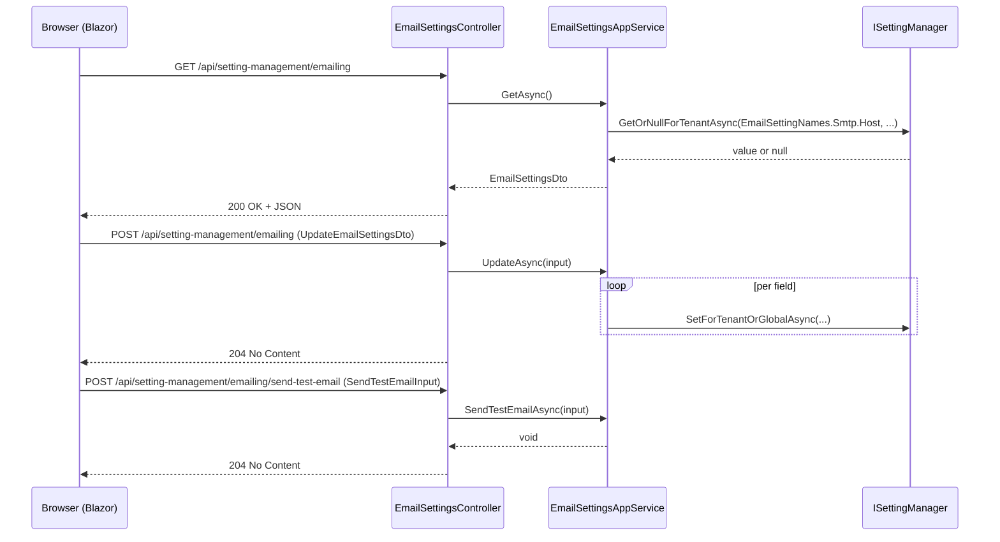

The HTTP layer of the setting-management module is a straight one-to-one mirror of the application layer. `EmailSettingsController` re-exposes `IEmailSettingsAppService` at `api/setting-management/emailing`, `TimeZoneSettingsController` re-exposes `ITimeZoneSettingsAppService` at `api/setting-management/timezone`, and the `HttpApi.Client` package ships pre-generated `ClientProxy` types so a remote host can call either contract over HTTP with strong types. This page walks each route, shows the matching client proxy, and documents how the module hooks into AutoMapper / dynamic-proxy generation.

For the upstream contracts these controllers re-export, see [Application](/modules/setting-management/application). For the Blazor / Razor Pages consumers, see [Blazor and Web UI](/modules/setting-management/blazor-and-web).

## File inventory

### `Volo.Abp.SettingManagement.HttpApi`

| File | Type | Role |
| --- | --- | --- |
| `AbpSettingManagementHttpApiModule.cs` | module | Depends on `AbpAspNetCoreMvcModule` + `Application.Contracts`; localizes the UI resource and adds the assembly as an MVC application part. |
| `EmailSettingsController.cs` | controller | `IEmailSettingsAppService` over REST. |
| `TimeZoneSettingsController.cs` | controller | `ITimeZoneSettingsAppService` over REST. |

### `Volo.Abp.SettingManagement.HttpApi.Client`

| File | Type | Role |
| --- | --- | --- |
| `AbpSettingManagementHttpApiClientModule.cs` | module | Calls `AddStaticHttpClientProxies(typeof(AbpSettingManagementApplicationContractsModule).Assembly, RemoteServiceName)`. |
| `ClientProxies/EmailSettingsClientProxy.cs` / `*.Generated.cs` | proxy | Strongly typed client for `IEmailSettingsAppService`. |
| `ClientProxies/TimeZoneSettingsClientProxy.cs` / `*.Generated.cs` | proxy | Strongly typed client for `ITimeZoneSettingsAppService`. |

## The HTTP module

```csharp modules/setting-management/src/Volo.Abp.SettingManagement.HttpApi/Volo/Abp/SettingManagement/AbpSettingManagementHttpApiModule.cs
[DependsOn(
    typeof(AbpSettingManagementApplicationContractsModule),
    typeof(AbpAspNetCoreMvcModule))]
public class AbpSettingManagementHttpApiModule : AbpModule
{
    public override void PreConfigureServices(ServiceConfigurationContext context)
    {
        PreConfigure<IMvcBuilder>(mvcBuilder =>
        {
            mvcBuilder.AddApplicationPartIfNotExists(typeof(AbpSettingManagementHttpApiModule).Assembly);
        });
    }

    public override void ConfigureServices(ServiceConfigurationContext context)
    {
        Configure<AbpLocalizationOptions>(options =>
        {
            options.Resources
                .Get<AbpSettingManagementResource>()
                .AddBaseTypes(typeof(AbpUiResource));
        });
    }
}
```

Just like the permission-management HTTP module:

- `AddApplicationPartIfNotExists` is the safety net that ensures both controllers are discovered when the host loads modules dynamically.
- `AbpUiResource` is added as a base so generic strings (`"Save"`, `"Cancel"`) inherit, useful for the validation messages the controllers emit through `IStringLocalizer`.

Importantly the module does *not* depend on `AbpSettingManagementDomainModule`. A pure HTTP-frontend host can expose the controllers without taking the persistence packages.

## `EmailSettingsController`

```csharp modules/setting-management/src/Volo.Abp.SettingManagement.HttpApi/Volo/Abp/SettingManagement/EmailSettingsController.cs
[RemoteService(Name = SettingManagementRemoteServiceConsts.RemoteServiceName)]
[Area(SettingManagementRemoteServiceConsts.ModuleName)]
[Route("api/setting-management/emailing")]
public class EmailSettingsController : AbpControllerBase, IEmailSettingsAppService
{
    private readonly IEmailSettingsAppService _emailSettingsAppService;

    public EmailSettingsController(IEmailSettingsAppService emailSettingsAppService)
    {
        _emailSettingsAppService = emailSettingsAppService;
    }

    [HttpGet]
    public Task<EmailSettingsDto> GetAsync()
    {
        return _emailSettingsAppService.GetAsync();
    }

    [HttpPost]
    public Task UpdateAsync(UpdateEmailSettingsDto input)
    {
        return _emailSettingsAppService.UpdateAsync(input);
    }

    [HttpPost("send-test-email")]
    public Task SendTestEmailAsync(SendTestEmailInput input)
    {
        return _emailSettingsAppService.SendTestEmailAsync(input);
    }
}
```

The class-level attributes:

| Attribute | Effect |
| --- | --- |
| `[RemoteService(Name = "SettingManagement")]` | Tags the controller for dynamic JS proxies and the API definition discovery service. |
| `[Area("settingManagement")]` | Area grouping for OpenAPI + URL conventions. |
| `[Route("api/setting-management/emailing")]` | Fixes the base URL. |
| `: IEmailSettingsAppService` | Inherits the `[Authorize(SettingManagementPermissions.Emailing)]` attribute and the framework's interface-based action routing conventions. |

### Routes

| Verb | Path | Action | Body |
| --- | --- | --- | --- |
| `GET` | `/api/setting-management/emailing` | `GetAsync` | — |
| `POST` | `/api/setting-management/emailing` | `UpdateAsync` | `UpdateEmailSettingsDto` |
| `POST` | `/api/setting-management/emailing/send-test-email` | `SendTestEmailAsync` | `SendTestEmailInput` |

<Note>
Both modification endpoints use `POST`, not `PUT`. The setting-management module standardised on `POST` for "apply these settings", in contrast to the permission-management module which uses `PUT` for its bulk update. Both are valid REST shapes; the framework client proxies generate the right verb either way.
</Note>

The method-level `[Authorize(EmailingTest)]` on the app service interface implementation also flows through to the controller — `send-test-email` requires the *child* permission. Without it the response is `401`/`403` instead of a slipped-through email.

## `TimeZoneSettingsController`

```csharp modules/setting-management/src/Volo.Abp.SettingManagement.HttpApi/Volo/Abp/SettingManagement/TimeZoneSettingsController.cs
[RemoteService(Name = SettingManagementRemoteServiceConsts.RemoteServiceName)]
[Area(SettingManagementRemoteServiceConsts.ModuleName)]
[Route("api/setting-management/timezone")]
public class TimeZoneSettingsController : AbpControllerBase, ITimeZoneSettingsAppService
{
    private readonly ITimeZoneSettingsAppService _timeZoneSettingsAppService;

    [HttpGet]
    public Task<string> GetAsync()
    {
        return _timeZoneSettingsAppService.GetAsync();
    }

    [HttpGet]
    [Route("timezones")]
    public Task<List<NameValue>> GetTimezonesAsync()
    {
        return _timeZoneSettingsAppService.GetTimezonesAsync();
    }

    [HttpPost]
    public Task UpdateAsync(string timezone)
    {
        return _timeZoneSettingsAppService.UpdateAsync(timezone);
    }
}
```

### Routes

| Verb | Path | Action | Body / Query |
| --- | --- | --- | --- |
| `GET` | `/api/setting-management/timezone` | `GetAsync` | — |
| `GET` | `/api/setting-management/timezone/timezones` | `GetTimezonesAsync` | — |
| `POST` | `/api/setting-management/timezone` | `UpdateAsync` | `timezone` as query parameter |

`UpdateAsync` takes a single `string`, which the framework binds as a query-string parameter by default. The Blazor UI calls it as `await TimeZoneSettingsAppService.UpdateAsync(_selectedTimezone)` and the proxy puts the value in `?timezone=...`. There is no JSON body.

## Composition flow



## The client proxy module

```csharp modules/setting-management/src/Volo.Abp.SettingManagement.HttpApi.Client/Volo/Abp/SettingManagement/AbpSettingManagementHttpApiClientModule.cs
[DependsOn(
    typeof(AbpSettingManagementApplicationContractsModule),
    typeof(AbpHttpClientModule))]
public class AbpSettingManagementHttpApiClientModule : AbpModule
{
    public override void ConfigureServices(ServiceConfigurationContext context)
    {
        context.Services.AddStaticHttpClientProxies(
            typeof(AbpSettingManagementApplicationContractsModule).Assembly,
            SettingManagementRemoteServiceConsts.RemoteServiceName
        );
    }
}
```

`AddStaticHttpClientProxies` walks every `IRemoteService` interface in the contracts assembly and registers the corresponding `*ClientProxy` from this assembly. After the module loads, any DI consumer of `IEmailSettingsAppService` or `ITimeZoneSettingsAppService` automatically gets an HTTP-backed proxy.

### `EmailSettingsClientProxy`

```csharp modules/setting-management/src/Volo.Abp.SettingManagement.HttpApi.Client/ClientProxies/Volo/Abp/SettingManagement/EmailSettingsClientProxy.cs
[Dependency(ReplaceServices = true)]
[ExposeServices(typeof(IEmailSettingsAppService))]
public partial class EmailSettingsClientProxy : ClientProxyBase<IEmailSettingsAppService>, IEmailSettingsAppService
{
}
```

The user-editable partial is empty. The matching `EmailSettingsClientProxy.Generated.cs` contains the real `RequestAsync<…>` calls, generated from the contracts assembly so contract changes flow through automatically.

### `TimeZoneSettingsClientProxy`

Same split — empty user partial plus a generated companion that issues the three calls. The Blazor WebAssembly UI module pulls this client proxy module in transitively so WASM hosts can manage settings against a remote API.

## Identity and policy on the wire

The two controllers inherit `[Authorize(...)]` from the app-service interfaces. An OpenIddict-fronted host that wants to expose `api/setting-management/**` adds:

- Bearer-token validation on the matching route group.
- A scope claim on the access token (typically `SettingManagement`) so the API gateway can route it.
- The permission grants for `SettingManagement.Emailing`, `SettingManagement.Emailing.Test`, and `SettingManagement.TimeZone` on whoever needs them.

The permission-management module (see [Permission management overview](/modules/permission-management/overview)) is what actually persists those grants. The permissions themselves are declared by `SettingManagementPermissionDefinitionProvider` (see [Application](/modules/setting-management/application#permissions-and-features)) and discovered by `IPermissionDefinitionManager` on any host that loads `Volo.Abp.SettingManagement.Application.Contracts`.

## OpenAPI surface

Both controllers tag under the same OpenAPI tag (`settingManagement`) and emit JSON schema for every DTO automatically. Hosts that enable Swashbuckle pick them up without further wiring.

The `[RemoteService]` attribute is what the dynamic JavaScript proxy generator looks for. Unlike the permission-management web module, the setting-management Web UI does *not* call `options.DisableModule(...)` — its Razor Pages contributors do call into the JS proxies for the per-group view components. Disable it in your own host if you prefer to drive everything from a typed client proxy.

## Cross-references

- The contracts and DTOs are documented in [Application](/modules/setting-management/application).
- The repository layer behind both routes is in [Persistence](/modules/setting-management/persistence).
- The matching pattern for permission management is in [Permission management HTTP API](/modules/permission-management/http-api).
- For the framework-level `[RemoteService]` conventions and the JS proxy generator, see [HTTP API conventions](/http/overview).
