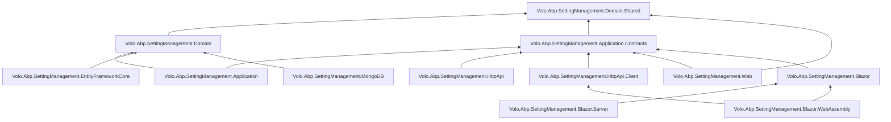

The `modules/setting-management/` directory turns ABP's framework-level setting system into a fully manageable, multi-tenant feature. Where `framework/src/Volo.Abp.Settings` defines `SettingDefinition`, `ISettingProvider`, and the user → tenant → global → configuration → default value-provider chain, this module supplies the missing rung that persists those values: a `Setting` aggregate, an `ISettingManager` for writing values, a parallel chain of `ISettingManagementProvider`s, a cached `SettingManagementStore`, `EmailSettingsAppService` / `TimeZoneSettingsAppService`, EF Core + MongoDB persistence, and a Razor Pages / Blazor management page that hosts pluggable "setting groups". This overview maps the whole package matrix, draws the `[DependsOn]` graph, and links to the per-layer deep dives.

<Info>
Source root: [`modules/setting-management/src/`](https://github.com/abpframework/abp/tree/dev/modules/setting-management/src). All file paths on this page are relative to that root unless noted.
</Info>

For the framework abstractions this module composes on top of, start at [Settings overview](/settings-features/settings-overview). For a tighter "what does setting-management add" recap that doubles as a settings-feature entry point, see [Setting management module](/settings-features/setting-management-module).

## Why a dedicated module?

`Volo.Abp.Settings` ships with `NullSettingStore`, which means any setting read returns its default until something replaces the store. The setting-management module fills that gap with:

- A persisted `Setting` row keyed by `(Name, ProviderName, ProviderKey)`.
- A parallel `ISettingManagementProvider` chain that lets the management UI write to a *specific* level (user/tenant/global) without surprising the read-side fallback rules.
- A distributed cache + event-driven invalidator so a save on one host is visible on every other host.
- An `EmailSettingsAppService` and `TimeZoneSettingsAppService` exposing the two settings everyone always needs.
- A `SettingManagementPageOptions.Contributors` extension point so other modules can add their own setting groups to the UI (account, identity, audit logging all do this).
- A `StaticSettingSaver` background job that pushes statically-defined settings to the database so microservices can discover each other's catalogs.

A pure consumer host that only *reads* settings still uses the framework's `ISettingProvider` — none of this module is required. Adding it is what makes settings *editable*.

## Package matrix

Each row maps to a project folder under `modules/setting-management/src/`.

| Package | Project folder | Layer | Primary purpose |
| --- | --- | --- | --- |
| `Volo.Abp.SettingManagement.Domain.Shared` | `Volo.Abp.SettingManagement.Domain.Shared/` | Domain.Shared | `SettingConsts`, `SettingDefinitionRecordConsts`, `SettingManagementFeatures`, `SettingManagementFeatureDefinitionProvider`, localization resource. |
| `Volo.Abp.SettingManagement.Domain` | `Volo.Abp.SettingManagement.Domain/` | Domain | `Setting` aggregate, `ISettingManager` + `SettingManager`, `SettingStore`, `ISettingManagementProvider` chain, `StaticSettingSaver`, dynamic definition store, cache invalidator. |
| `Volo.Abp.SettingManagement.Application.Contracts` | `Volo.Abp.SettingManagement.Application.Contracts/` | App.Contracts | `IEmailSettingsAppService`, `ITimeZoneSettingsAppService`, DTOs, `SettingManagementPermissions`, `AllowChangingEmailSettingsFeatureSimpleStateChecker`. |
| `Volo.Abp.SettingManagement.Application` | `Volo.Abp.SettingManagement.Application/` | Application | `EmailSettingsAppService`, `TimeZoneSettingsAppService`, `UserDeletedEventHandler`, `SettingManagementAppServiceBase`. |
| `Volo.Abp.SettingManagement.HttpApi` | `Volo.Abp.SettingManagement.HttpApi/` | HTTP API | `EmailSettingsController`, `TimeZoneSettingsController`. |
| `Volo.Abp.SettingManagement.HttpApi.Client` | `Volo.Abp.SettingManagement.HttpApi.Client/` | HTTP API Client | Generated client proxies for both app services. |
| `Volo.Abp.SettingManagement.EntityFrameworkCore` | `Volo.Abp.SettingManagement.EntityFrameworkCore/` | Persistence | `SettingManagementDbContext`, EF Core repositories, and `ConfigureSettingManagement()` model builder. |
| `Volo.Abp.SettingManagement.MongoDB` | `Volo.Abp.SettingManagement.MongoDB/` | Persistence | `SettingManagementMongoDbContext` and MongoDB repositories. |
| `Volo.Abp.SettingManagement.Web` | `Volo.Abp.SettingManagement.Web/` | UI (MVC) | Razor Pages settings UI with pluggable `ISettingPageContributor`s. |
| `Volo.Abp.SettingManagement.Blazor` | `Volo.Abp.SettingManagement.Blazor/` | UI (Blazor) | `SettingManagement.razor` page and `ISettingComponentContributor` extension point. |
| `Volo.Abp.SettingManagement.Blazor.Server` | `Volo.Abp.SettingManagement.Blazor.Server/` | UI (Blazor Server) | Server-hosted Blazor entry module. |
| `Volo.Abp.SettingManagement.Blazor.WebAssembly` | `Volo.Abp.SettingManagement.Blazor.WebAssembly/` | UI (Blazor WASM) | WASM entry module that depends on `HttpApi.Client`. |
| `Volo.Abp.SettingManagement.Installer` | `Volo.Abp.SettingManagement.Installer/` | Tooling | NuGet meta-package used by the ABP CLI installer. |

<Note>
The persistence packages are mutually exclusive (`EntityFrameworkCore` *or* `MongoDB`, not both). The Blazor UI flavours wrap the shared `Volo.Abp.SettingManagement.Blazor` package — pick `.Server` or `.WebAssembly` based on your render mode.
</Note>

## Layered composition

The diagram below is taken directly from the `[DependsOn]` attributes in each project's module class. Arrows point from a depending module to the module it `[DependsOn]`.



Notice that the application module also depends on `AbpEmailingModule`, `AbpTimingModule`, and `AbpUsersAbstractionModule` — those are what make `EmailSettingsAppService` and `TimeZoneSettingsAppService` work, and what wires `UserDeletedEventHandler` to the user-deleted distributed event.

## Composition recipes

<CardGroup cols={3}>
  <Card title="Monolith host" icon="server">
    Domain + Application + HttpApi + one persistence package + one UI package. Everything in process.
  </Card>
  <Card title="Management microservice" icon="network-wired">
    Domain + Application + HttpApi + EF Core/MongoDB. Other services consume `HttpApi.Client`.
  </Card>
  <Card title="UI-only host (BFF)" icon="window">
    Blazor.WebAssembly + HttpApi.Client. The settings API lives elsewhere.
  </Card>
</CardGroup>

## Module wiring

The domain module is the central registration point. It wires the default provider chain (default → configuration → global → tenant → user) into `SettingManagementOptions`, and it owns the dynamic-setting bootstrap task.

```csharp modules/setting-management/src/Volo.Abp.SettingManagement.Domain/Volo/Abp/SettingManagement/AbpSettingManagementDomainModule.cs
[DependsOn(
    typeof(AbpSettingsModule),
    typeof(AbpDddDomainModule),
    typeof(AbpSettingManagementDomainSharedModule),
    typeof(AbpCachingModule)
    )]
public class AbpSettingManagementDomainModule : AbpModule
{
    public override void ConfigureServices(ServiceConfigurationContext context)
    {
        Configure<SettingManagementOptions>(options =>
        {
            options.Providers.Add<DefaultValueSettingManagementProvider>();
            options.Providers.Add<ConfigurationSettingManagementProvider>();
            options.Providers.Add<GlobalSettingManagementProvider>();
            options.Providers.Add<TenantSettingManagementProvider>();
            options.Providers.Add<UserSettingManagementProvider>();
        });

        if (context.Services.IsDataMigrationEnvironment())
        {
            Configure<SettingManagementOptions>(options =>
            {
                options.SaveStaticSettingsToDatabase = false;
                options.IsDynamicSettingStoreEnabled = false;
            });
        }
    }
}
```

The five providers above are the *management* mirror image of the framework's `ISettingValueProvider` chain — read flows go through the framework's `D` → `C` → `G` → `T` → `U` providers; write flows go through the matching `*SettingManagementProvider`s registered here.

The `IsDataMigrationEnvironment` branch is the same defence-in-depth trick the permission-management module uses — a migration runner should never race the application on the settings tables.

## Key types per layer

| Layer | Type | File | Page |
| --- | --- | --- | --- |
| Domain | `Setting` (aggregate root) | `Volo.Abp.SettingManagement.Domain/Volo/Abp/SettingManagement/Setting.cs` | [Domain](/modules/setting-management/domain) |
| Domain | `ISettingManager` / `SettingManager` | `Volo.Abp.SettingManagement.Domain/Volo/Abp/SettingManagement/SettingManager.cs` | [Domain](/modules/setting-management/domain) |
| Domain | `SettingStore` (impl. of framework's `ISettingStore`) | `Volo.Abp.SettingManagement.Domain/Volo/Abp/SettingManagement/SettingStore.cs` | [Domain](/modules/setting-management/domain) |
| Domain | `ISettingManagementProvider` chain | `Volo.Abp.SettingManagement.Domain/Volo/Abp/SettingManagement/SettingManagementProvider.cs` | [Domain](/modules/setting-management/domain) |
| Domain | `IStaticSettingSaver` / `StaticSettingSaver` | `Volo.Abp.SettingManagement.Domain/Volo/Abp/SettingManagement/StaticSettingSaver.cs` | [Domain](/modules/setting-management/domain) |
| Application | `EmailSettingsAppService`, `TimeZoneSettingsAppService` | `Volo.Abp.SettingManagement.Application/Volo/Abp/SettingManagement/*.cs` | [Application](/modules/setting-management/application) |
| HTTP API | `EmailSettingsController`, `TimeZoneSettingsController` | `Volo.Abp.SettingManagement.HttpApi/Volo/Abp/SettingManagement/*.cs` | [HTTP API](/modules/setting-management/http-api) |
| Persistence | `SettingManagementDbContext` + Mongo equivalent | `Volo.Abp.SettingManagement.EntityFrameworkCore/.../SettingManagementDbContext.cs` | [Persistence](/modules/setting-management/persistence) |
| UI | `SettingManagement` Blazor page, `EmailSettingGroupViewComponent` | `Volo.Abp.SettingManagement.Blazor/Pages/SettingManagement/*` | [Blazor & Web UI](/modules/setting-management/blazor-and-web) |

## The Setting row

There is one persisted entity:

```csharp modules/setting-management/src/Volo.Abp.SettingManagement.Domain/Volo/Abp/SettingManagement/Setting.cs
public class Setting : Entity<Guid>, IAggregateRoot<Guid>
{
    [NotNull] public virtual string Name { get; protected set; }
    [NotNull] public virtual string Value { get; internal set; }
    [CanBeNull] public virtual string ProviderName { get; protected set; }
    [CanBeNull] public virtual string ProviderKey { get; protected set; }
}
```

Notice this entity is an `IAggregateRoot<Guid>` — unlike `PermissionGrant` over in [Permission management](/modules/permission-management/domain), settings are addressed individually. The unique index `(Name, ProviderName, ProviderKey)` lives in the EF Core mapping. See [Persistence](/modules/setting-management/persistence) for the full schema.

## Runtime read path

When code calls `ISettingProvider.GetOrNullAsync("Abp.Timing.TimeZone")`, the framework walks its value-provider chain. The first provider that returns non-null wins. Each rung that needs to look up "is there a stored value for this `(name, providerName, providerKey)`?" delegates to `ISettingStore`, which this module implements with `SettingStore`:

```mermaid
sequenceDiagram
    actor Caller as Caller code
    participant SP as ISettingProvider
    participant VP as Value-provider chain (U,T,G,C,D)
    participant SS as SettingStore
    participant MS as SettingManagementStore
    participant Cache as IDistributedCache&lt;SettingCacheItem&gt;
    participant Repo as ISettingRepository

    Caller->>SP: GetOrNullAsync("Abp.Timing.TimeZone")
    SP->>VP: walk providers
    VP->>SS: GetOrNullAsync("...", "U", userId)
    SS->>MS: GetOrNullAsync(name, "U", userId)
    MS->>Cache: GetAsync("pn:U,pk:42,n:Abp.Timing.TimeZone")
    alt cache miss
        MS->>Repo: GetListAsync("U", userId)
        Repo-->>MS: List<Setting>
        MS->>Cache: SetManyAsync(items)
    end
    MS-->>SS: value or null
    SS-->>VP: value or null
    VP-->>SP: first non-null
    SP-->>Caller: value
```

The matching write path through `ISettingManager.SetAsync` is laid out in [Domain](/modules/setting-management/domain) and [Application](/modules/setting-management/application).

## What this module ships out of the box

| App service | Audience | Permission | Feature gate |
| --- | --- | --- | --- |
| `EmailSettingsAppService` | Hosts and tenants (when feature is on) | `SettingManagement.Emailing` | `SettingManagement.Enable` + `SettingManagement.AllowChangingEmailSettings` (tenant side) |
| `TimeZoneSettingsAppService` | Hosts and tenants | `SettingManagement.TimeZone` | `SettingManagement.Enable` |

The permissions are declared in `SettingManagementPermissionDefinitionProvider`:

```csharp modules/setting-management/src/Volo.Abp.SettingManagement.Application.Contracts/Volo/Abp/SettingManagement/SettingManagementPermissionDefinitionProvider.cs
public class SettingManagementPermissionDefinitionProvider : PermissionDefinitionProvider
{
    public override void Define(IPermissionDefinitionContext context)
    {
        var moduleGroup = context.AddGroup(SettingManagementPermissions.GroupName, L("Permission:SettingManagement"));

        var emailPermission = moduleGroup
            .AddPermission(SettingManagementPermissions.Emailing, L("Permission:Emailing"));
        emailPermission.StateCheckers.Add(new AllowChangingEmailSettingsFeatureSimpleStateChecker());

        emailPermission.AddChild(SettingManagementPermissions.EmailingTest, L("Permission:EmailingTest"));

        moduleGroup.AddPermission(SettingManagementPermissions.TimeZone, L("Permission:TimeZone"));
    }
}
```

The features are declared in `SettingManagementFeatureDefinitionProvider`:

```csharp modules/setting-management/src/Volo.Abp.SettingManagement.Domain.Shared/Volo/Abp/SettingManagement/SettingManagementFeatureDefinitionProvider.cs
public class SettingManagementFeatureDefinitionProvider : FeatureDefinitionProvider
{
    public override void Define(IFeatureDefinitionContext context)
    {
        var group = context.AddGroup(SettingManagementFeatures.GroupName, L("Feature:SettingManagementGroup"));

        var settingEnableFeature = group.AddFeature(
            SettingManagementFeatures.Enable,
            "true",
            L("Feature:SettingManagementEnable"),
            L("Feature:SettingManagementEnableDescription"),
            new ToggleStringValueType(),
            isAvailableToHost: false);

        settingEnableFeature.CreateChild(
            SettingManagementFeatures.AllowChangingEmailSettings,
            "false",
            L("Feature:AllowChangingEmailSettings"),
            null,
            new ToggleStringValueType(),
            isAvailableToHost: false);
    }
}
```

`isAvailableToHost: false` means these features are tenant-only — host admins always have access; tenant admins have it only when the host turned it on. The `AllowChangingEmailSettingsFeatureSimpleStateChecker` ties the `Emailing` permission to the feature so a tenant whose feature is off does not even see the permission in the permission-management modal (it's hidden by the simple-state check described in [Permission management application](/modules/permission-management/application)).

## Cross-module integration points

| Consumer | What it adds |
| --- | --- |
| `modules/identity` | Reuses the email/time-zone settings; admin pages live in Identity but read through this module. See [Identity overview](/modules/identity/overview). |
| `modules/account` | Account UI adds its own setting-page contributor for personal settings. |
| `modules/audit-logging` | Adds an `Auditing` setting group through `ISettingPageContributor`. |
| `modules/feature-management` | Drives the gate on `SettingManagement.Enable` per tenant. |

## Where to go next

<CardGroup cols={2}>
  <Card title="Domain layer" icon="layer-group" href="/modules/setting-management/domain">
    `Setting`, `ISettingManager`, `SettingStore`, providers, `StaticSettingSaver`.
  </Card>
  <Card title="Application layer" icon="cubes" href="/modules/setting-management/application">
    `EmailSettingsAppService`, `TimeZoneSettingsAppService`, `UserDeletedEventHandler`.
  </Card>
  <Card title="HTTP API" icon="server" href="/modules/setting-management/http-api">
    `EmailSettingsController`, `TimeZoneSettingsController`, and the client-proxy module.
  </Card>
  <Card title="Persistence" icon="database" href="/modules/setting-management/persistence">
    EF Core / MongoDB DbContexts, repositories, and the schema.
  </Card>
  <Card title="Blazor & Web UI" icon="window-maximize" href="/modules/setting-management/blazor-and-web">
    `SettingManagement.razor`, `EmailingPageContributor`, `SettingsModalComponent`.
  </Card>
  <Card title="Framework primitives" icon="puzzle-piece" href="/settings-features/settings-overview">
    `SettingDefinition`, `ISettingProvider`, value-provider chain — the layer below this module.
  </Card>
</CardGroup>
