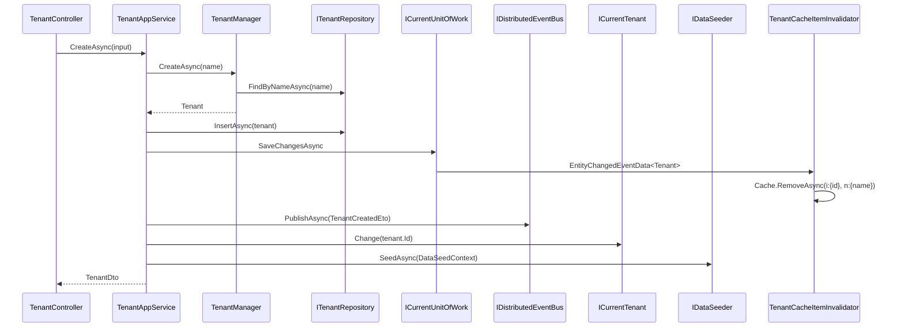

The Tenant Management application layer is the orchestration plane: it takes inbound DTOs from the HTTP API, runs them through `TenantManager`, persists the aggregate via `ITenantRepository`, publishes a distributed `TenantCreatedEto`, then steps into the new tenant's scope and calls `IDataSeeder.SeedAsync` so downstream modules (Identity, Permission Management) can seed an admin user. It also exposes three connection‑string endpoints that mutate the aggregate directly. The implementation is in `modules/tenant-management/src/Volo.Abp.TenantManagement.Application/` and its contract in `Volo.Abp.TenantManagement.Application.Contracts/`.

<Info>
`TenantAppService` is `[Authorize(TenantManagementPermissions.Tenants.Default)]` at the class level — every method requires the base permission, and the mutators add `Create`, `Update`, `Delete` or `ManageConnectionStrings` on top.
</Info>

## File inventory

| File | Role |
| --- | --- |
| `ITenantAppService.cs` | CRUD contract (`ICrudAppService<TenantDto, Guid, GetTenantsInput, TenantCreateDto, TenantUpdateDto>`) + three connection‑string endpoints. |
| `TenantAppService.cs` | Implementation. Composes `ITenantRepository`, `ITenantManager`, `IDataSeeder`, `IDistributedEventBus`. |
| `TenantManagementAppServiceBase.cs` | Base class fixing localization + object‑mapper context. |
| `AbpTenantManagementApplicationModule.cs` | `[DependsOn(Domain, ApplicationContracts, AbpDddApplication)]` + AutoMapper profile registration. |
| `AbpTenantManagementApplicationAutoMapperProfile.cs` | `Tenant → TenantDto` with extra‑property mapping. |
| `TenantCreateOrUpdateDtoBase.cs` | Shared `Name` validation (`Required`, `DynamicStringLength(TenantConsts.MaxNameLength)`). |
| `TenantCreateDto.cs` / `TenantUpdateDto.cs` | Inbound payloads. Create adds `AdminEmailAddress` + `AdminPassword`; Update carries `ConcurrencyStamp`. |
| `TenantDto.cs` | Outbound payload (`ExtensibleEntityDto<Guid>, IHasConcurrencyStamp`). |
| `GetTenantsInput.cs` | `PagedAndSortedResultRequestDto` + `Filter`. |
| `TenantManagementPermissions.cs` | Permission constants. |
| `AbpTenantManagementPermissionDefinitionProvider.cs` | Permission tree definition (host‑side only). |

## Contract: `ITenantAppService`

The contract is a vanilla `ICrudAppService` with three connection‑string operations grafted on:

```csharp modules/tenant-management/src/Volo.Abp.TenantManagement.Application.Contracts/Volo/Abp/TenantManagement/ITenantAppService.cs
public interface ITenantAppService : ICrudAppService<TenantDto, Guid, GetTenantsInput, TenantCreateDto, TenantUpdateDto>
{
    Task<string> GetDefaultConnectionStringAsync(Guid id);
    Task UpdateDefaultConnectionStringAsync(Guid id, string defaultConnectionString);
    Task DeleteDefaultConnectionStringAsync(Guid id);
}
```

That `ICrudAppService` gives the controller `GetAsync(id)`, `GetListAsync(input)`, `CreateAsync(input)`, `UpdateAsync(id, input)`, `DeleteAsync(id)` for free.

### DTOs

```csharp modules/tenant-management/src/Volo.Abp.TenantManagement.Application.Contracts/Volo/Abp/TenantManagement/TenantDto.cs
public class TenantDto : ExtensibleEntityDto<Guid>, IHasConcurrencyStamp
{
    public string Name { get; set; }
    public string ConcurrencyStamp { get; set; }
}
```

```csharp modules/tenant-management/src/Volo.Abp.TenantManagement.Application.Contracts/Volo/Abp/TenantManagement/TenantCreateOrUpdateDtoBase.cs
public abstract class TenantCreateOrUpdateDtoBase : ExtensibleObject
{
    [Required]
    [DynamicStringLength(typeof(TenantConsts), nameof(TenantConsts.MaxNameLength))]
    [Display(Name = "TenantName")]
    public string Name { get; set; }

    public TenantCreateOrUpdateDtoBase() : base(false) { }
}
```

```csharp modules/tenant-management/src/Volo.Abp.TenantManagement.Application.Contracts/Volo/Abp/TenantManagement/TenantCreateDto.cs
public class TenantCreateDto : TenantCreateOrUpdateDtoBase
{
    [Required, EmailAddress, MaxLength(256)]
    public virtual string AdminEmailAddress { get; set; }

    [Required, MaxLength(128), DisableAuditing]
    public virtual string AdminPassword { get; set; }
}
```

```csharp modules/tenant-management/src/Volo.Abp.TenantManagement.Application.Contracts/Volo/Abp/TenantManagement/TenantUpdateDto.cs
public class TenantUpdateDto : TenantCreateOrUpdateDtoBase, IHasConcurrencyStamp
{
    public string ConcurrencyStamp { get; set; }
}
```

Two details worth flagging:

- **`[DisableAuditing]`** on `AdminPassword` means the property never lands in audit logs — even with verbose action‑input logging on.
- **`ExtensibleEntityDto` / `ExtensibleObject`** plug the aggregate's `IHasExtraProperties` slot into the wire format. Combined with the `AbpTenantManagementApplicationContractsModule.PostConfigureServices` call to `ApplyEntityConfigurationToApi`, hosts can extend `Tenant` (e.g. add a `Region` property) and have it round‑trip on the API automatically.

## Implementation: `TenantAppService`

`TenantAppService` is `[Authorize(...Tenants.Default)]` and inherits `TenantManagementAppServiceBase` (localization + mapper context). It composes the four collaborators it needs:

```csharp modules/tenant-management/src/Volo.Abp.TenantManagement.Application/Volo/Abp/TenantManagement/TenantAppService.cs
[Authorize(TenantManagementPermissions.Tenants.Default)]
public class TenantAppService : TenantManagementAppServiceBase, ITenantAppService
{
    protected IDataSeeder DataSeeder { get; }
    protected ITenantRepository TenantRepository { get; }
    protected ITenantManager TenantManager { get; }
    protected IDistributedEventBus DistributedEventBus { get; }

    public TenantAppService(
        ITenantRepository tenantRepository,
        ITenantManager tenantManager,
        IDataSeeder dataSeeder,
        IDistributedEventBus distributedEventBus) { ... }
```

### Read operations

`GetAsync` / `GetListAsync` are thin wrappers over the repository, with the sort‑by‑name default that matches the UI's expected ordering:

```csharp modules/tenant-management/src/Volo.Abp.TenantManagement.Application/Volo/Abp/TenantManagement/TenantAppService.cs
public virtual async Task<PagedResultDto<TenantDto>> GetListAsync(GetTenantsInput input)
{
    if (input.Sorting.IsNullOrWhiteSpace()) input.Sorting = nameof(Tenant.Name);

    var count = await TenantRepository.GetCountAsync(input.Filter);
    var list = await TenantRepository.GetListAsync(
        input.Sorting, input.MaxResultCount, input.SkipCount, input.Filter);

    return new PagedResultDto<TenantDto>(count,
        ObjectMapper.Map<List<Tenant>, List<TenantDto>>(list));
}
```

### Tenant creation pipeline

`CreateAsync` is the most consequential method in the module. It runs in this order:

1. Validate + create the aggregate (`TenantManager.CreateAsync` enforces unique name).
2. Copy `ExtraProperties` from the DTO so host extensions are persisted.
3. Insert the aggregate and `SaveChangesAsync` immediately so subsequent code sees the new id.
4. Publish `TenantCreatedEto` on the distributed bus — `EventName: "abp.multi_tenancy.tenant.created"` — with `AdminEmail` / `AdminPassword` carried as properties.
5. Enter the new tenant's scope via `CurrentTenant.Change(tenant.Id, tenant.Name)` and call `IDataSeeder.SeedAsync` with the same admin credentials in the `DataSeedContext`.

```csharp modules/tenant-management/src/Volo.Abp.TenantManagement.Application/Volo/Abp/TenantManagement/TenantAppService.cs
[Authorize(TenantManagementPermissions.Tenants.Create)]
public virtual async Task<TenantDto> CreateAsync(TenantCreateDto input)
{
    var tenant = await TenantManager.CreateAsync(input.Name);
    input.MapExtraPropertiesTo(tenant);

    await TenantRepository.InsertAsync(tenant);
    await CurrentUnitOfWork.SaveChangesAsync();

    await DistributedEventBus.PublishAsync(
        new TenantCreatedEto
        {
            Id = tenant.Id,
            Name = tenant.Name,
            Properties =
            {
                { "AdminEmail", input.AdminEmailAddress },
                { "AdminPassword", input.AdminPassword }
            }
        });

    using (CurrentTenant.Change(tenant.Id, tenant.Name))
    {
        //TODO: Handle database creation?
        // TODO: Seeder might be triggered via event handler.
        await DataSeeder.SeedAsync(
            new DataSeedContext(tenant.Id)
                .WithProperty("AdminEmail", input.AdminEmailAddress)
                .WithProperty("AdminPassword", input.AdminPassword)
        );
    }

    return ObjectMapper.Map<Tenant, TenantDto>(tenant);
}
```

The framework's `TenantCreatedEto` lives in `Volo.Abp.MultiTenancy.Abstractions` so any host can subscribe without a hard reference to this module:

```csharp framework/src/Volo.Abp.MultiTenancy.Abstractions/Volo/Abp/MultiTenancy/TenantCreatedEto.cs
[Serializable]
[EventName("abp.multi_tenancy.tenant.created")]
public class TenantCreatedEto : EtoBase
{
    public Guid Id { get; set; }
    public string Name { get; set; } = default!;
}
```

The `EtoBase.Properties` dictionary is what carries `AdminEmail` / `AdminPassword` to remote handlers — handy when database creation or identity seeding runs in another microservice.

### Tenant update

`UpdateAsync` rehydrates the aggregate, delegates the name change to `TenantManager` (re‑validating uniqueness), threads the inbound `ConcurrencyStamp` so EF's optimistic concurrency check fires, and maps extra properties:

```csharp modules/tenant-management/src/Volo.Abp.TenantManagement.Application/Volo/Abp/TenantManagement/TenantAppService.cs
[Authorize(TenantManagementPermissions.Tenants.Update)]
public virtual async Task<TenantDto> UpdateAsync(Guid id, TenantUpdateDto input)
{
    var tenant = await TenantRepository.GetAsync(id);
    await TenantManager.ChangeNameAsync(tenant, input.Name);
    tenant.SetConcurrencyStampIfNotNull(input.ConcurrencyStamp);
    input.MapExtraPropertiesTo(tenant);
    await TenantRepository.UpdateAsync(tenant);
    return ObjectMapper.Map<Tenant, TenantDto>(tenant);
}
```

### Tenant deletion

```csharp modules/tenant-management/src/Volo.Abp.TenantManagement.Application/Volo/Abp/TenantManagement/TenantAppService.cs
[Authorize(TenantManagementPermissions.Tenants.Delete)]
public virtual async Task DeleteAsync(Guid id)
{
    var tenant = await TenantRepository.FindAsync(id);
    if (tenant == null) return;
    await TenantRepository.DeleteAsync(tenant);
}
```

Soft delete is automatic — `Tenant : FullAuditedAggregateRoot<Guid>` carries `IsDeleted` and the framework filter excludes deleted rows from subsequent reads. The repository's cascade also removes child `TenantConnectionString` rows via EF's `Cascade` configuration (see [`/modules/tenant-management/persistence`](/modules/tenant-management/persistence)).

### Connection‑string endpoints

The three connection‑string methods are gated by the dedicated `ManageConnectionStrings` permission so an operator can delegate it without granting full `Update`:

```csharp modules/tenant-management/src/Volo.Abp.TenantManagement.Application/Volo/Abp/TenantManagement/TenantAppService.cs
[Authorize(TenantManagementPermissions.Tenants.ManageConnectionStrings)]
public virtual async Task<string> GetDefaultConnectionStringAsync(Guid id)
{
    var tenant = await TenantRepository.GetAsync(id);
    return tenant?.FindDefaultConnectionString();
}

[Authorize(TenantManagementPermissions.Tenants.ManageConnectionStrings)]
public virtual async Task UpdateDefaultConnectionStringAsync(Guid id, string defaultConnectionString)
{
    var tenant = await TenantRepository.GetAsync(id);
    tenant.SetDefaultConnectionString(defaultConnectionString);
    await TenantRepository.UpdateAsync(tenant);
}

[Authorize(TenantManagementPermissions.Tenants.ManageConnectionStrings)]
public virtual async Task DeleteDefaultConnectionStringAsync(Guid id)
{
    var tenant = await TenantRepository.GetAsync(id);
    tenant.RemoveDefaultConnectionString();
    await TenantRepository.UpdateAsync(tenant);
}
```

Only the **default** connection string is exposed on the API by name. To add named per‑connection rows (e.g. `AbpIdentity`, `Saas`) you call `tenant.SetConnectionString("AbpIdentity", ...)` from a custom service.

## Permissions

The permission tree is a flat list under one group; everything is host‑only (`MultiTenancySides.Host`):

```csharp modules/tenant-management/src/Volo.Abp.TenantManagement.Application.Contracts/Volo/Abp/TenantManagement/TenantManagementPermissions.cs
public static class TenantManagementPermissions
{
    public const string GroupName = "AbpTenantManagement";

    public static class Tenants
    {
        public const string Default                 = GroupName + ".Tenants";
        public const string Create                  = Default + ".Create";
        public const string Update                  = Default + ".Update";
        public const string Delete                  = Default + ".Delete";
        public const string ManageFeatures          = Default + ".ManageFeatures";
        public const string ManageConnectionStrings = Default + ".ManageConnectionStrings";
    }
}
```

```csharp modules/tenant-management/src/Volo.Abp.TenantManagement.Application.Contracts/Volo/Abp/TenantManagement/AbpTenantManagementPermissionDefinitionProvider.cs
public override void Define(IPermissionDefinitionContext context)
{
    var group = context.AddGroup(TenantManagementPermissions.GroupName, L("Permission:TenantManagement"));
    var tenants = group.AddPermission(TenantManagementPermissions.Tenants.Default,
        L("Permission:TenantManagement"), multiTenancySide: MultiTenancySides.Host);

    tenants.AddChild(TenantManagementPermissions.Tenants.Create,
        L("Permission:Create"), multiTenancySide: MultiTenancySides.Host);
    tenants.AddChild(TenantManagementPermissions.Tenants.Update,
        L("Permission:Edit"), multiTenancySide: MultiTenancySides.Host);
    tenants.AddChild(TenantManagementPermissions.Tenants.Delete,
        L("Permission:Delete"), multiTenancySide: MultiTenancySides.Host);
    tenants.AddChild(TenantManagementPermissions.Tenants.ManageFeatures,
        L("Permission:ManageFeatures"), multiTenancySide: MultiTenancySides.Host);
    tenants.AddChild(TenantManagementPermissions.Tenants.ManageConnectionStrings,
        L("Permission:ManageConnectionStrings"), multiTenancySide: MultiTenancySides.Host);
}
```

The `ManageFeatures` child is the policy [`/modules/feature-management/domain`](/modules/feature-management/domain) registers via `FeatureManagementOptions.ProviderPolicies["T"]` — it's the bridge between the two modules. Permissions themselves are persisted and evaluated by the [permission management module](/modules/permission-management/overview).

## AutoMapper profile

The application profile keeps it minimal — the heavy lifting happens in the domain profile that maps `Tenant → TenantConfiguration` for the cache:

```csharp modules/tenant-management/src/Volo.Abp.TenantManagement.Application/Volo/Abp/TenantManagement/AbpTenantManagementApplicationAutoMapperProfile.cs
public class AbpTenantManagementApplicationAutoMapperProfile : Profile
{
    public AbpTenantManagementApplicationAutoMapperProfile()
    {
        CreateMap<Tenant, TenantDto>().MapExtraProperties();
    }
}
```

## End‑to‑end create flow



## Module wiring

```csharp modules/tenant-management/src/Volo.Abp.TenantManagement.Application/Volo/Abp/TenantManagement/AbpTenantManagementApplicationModule.cs
[DependsOn(typeof(AbpTenantManagementDomainModule))]
[DependsOn(typeof(AbpTenantManagementApplicationContractsModule))]
[DependsOn(typeof(AbpDddApplicationModule))]
public class AbpTenantManagementApplicationModule : AbpModule
{
    public override void ConfigureServices(ServiceConfigurationContext context)
    {
        context.Services.AddAutoMapperObjectMapper<AbpTenantManagementApplicationModule>();
        Configure<AbpAutoMapperOptions>(options =>
        {
            options.AddProfile<AbpTenantManagementApplicationAutoMapperProfile>(validate: true);
        });
    }
}
```

## Cross‑references

<CardGroup cols={3}>
  <Card title="Domain" icon="cube" href="/modules/tenant-management/domain">
    The aggregate, manager, and store this layer drives.
  </Card>
  <Card title="HTTP API" icon="plug" href="/modules/tenant-management/http-api">
    `TenantController` and the route table.
  </Card>
  <Card title="Persistence" icon="database" href="/modules/tenant-management/persistence">
    Where `TenantRepository.InsertAsync` actually writes.
  </Card>
  <Card title="Feature management" icon="bolt" href="/modules/feature-management/overview">
    `AbpTenantManagement.Tenants.ManageFeatures` is the policy its app service enforces.
  </Card>
  <Card title="Permission management" icon="lock" href="/modules/permission-management/overview">
    Stores the grants checked by `[Authorize(...)]` here.
  </Card>
  <Card title="Multi‑tenancy" icon="globe" href="/multitenancy">
    Why `CurrentTenant.Change(...)` is the way to scope the data seeder.
  </Card>
</CardGroup>
