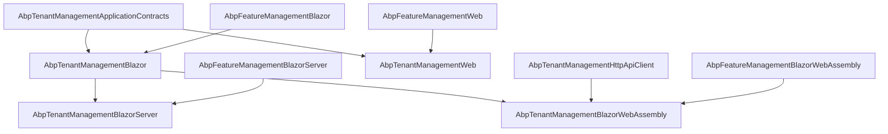

Both the MVC and Blazor admin surfaces in this module render the same artefact: a paged tenant list with a *New Tenant* toolbar button, per‑row *Edit* / *Features* / *Delete* actions, and modals for create/edit. The Blazor page is `TenantManagement.razor` (with a code‑behind that wires the entity actions and embeds `FeatureManagementModal`). The MVC equivalent is a trio of Razor pages under `Pages/TenantManagement/Tenants/`. Both pull `AbpFeatureManagement*Module` into their `[DependsOn]` graph so the *Features* action works out of the box.

<Info>
The Blazor page is the canonical UI in modern ABP solution templates; the MVC pages stay supported for solutions on the MVC theme. The two share permissions and DTOs but ship completely separate render trees.
</Info>

## File inventory

| File | UI | Role |
| --- | --- | --- |
| `AbpTenantManagementWebModule.cs` | MVC | Module entry. Registers embedded views, the page authorization conventions, the menu contributor and the page toolbar button. |
| `Navigation/AbpTenantManagementWebMainMenuContributor.cs` | MVC | Adds the *Administration → Tenant Management → Tenants* menu node. |
| `Pages/TenantManagement/Tenants/Index.cshtml(.cs)` | MVC | List page. |
| `Pages/TenantManagement/Tenants/CreateModal.cshtml(.cs)` | MVC | Create modal (TenantInfoModel with admin email + password). |
| `Pages/TenantManagement/Tenants/EditModal.cshtml(.cs)` | MVC | Edit modal (rename only). |
| `Pages/TenantManagement/Tenants/TenantManagementPageModel.cs` | MVC | Base page model fixing `ObjectMapperContext`. |
| `AbpTenantManagementWebAutoMapperProfile.cs` | MVC | DTO ↔ modal view‑model mappings. |
| `AbpTenantManagementBlazorModule.cs` | Blazor | Module entry. Registers the menu contributor, AutoMapper profile and additional router assembly. |
| `Pages/TenantManagement/TenantManagement.razor(.cs)` | Blazor | Page component inheriting `AbpCrudPageBase`. Wires entity actions, embeds `FeatureManagementModal`. |
| `Navigation/TenantManagementBlazorMenuContributor.cs` | Blazor | Adds the same *Administration → Tenant Management* node. |
| `AbpTenantManagementBlazorAutoMapperProfile.cs` | Blazor | `TenantDto → TenantUpdateDto` mapping for the edit form. |
| `AbpTenantManagementBlazorServerModule.cs` | Blazor Server | `[DependsOn(BlazorModule, FeatureManagementBlazorServerModule)]`. |
| `AbpTenantManagementBlazorWebAssemblyModule.cs` | Blazor WASM | Adds `AbpTenantManagementHttpApiClientModule` so the page hits the API over HTTP. |

## MVC module

`AbpTenantManagementWebModule` does six things in one place: registers the application part, the menu contributor, the embedded virtual file system, authorization conventions per page, the page toolbar's *NewTenant* button, and disables the dynamic JS proxy module key (the WebModule itself doesn't ship JS; the host's MVC theme builds it).

```csharp modules/tenant-management/src/Volo.Abp.TenantManagement.Web/AbpTenantManagementWebModule.cs
[DependsOn(typeof(AbpTenantManagementApplicationContractsModule))]
[DependsOn(typeof(AbpAspNetCoreMvcUiBootstrapModule))]
[DependsOn(typeof(AbpFeatureManagementWebModule))]
[DependsOn(typeof(AbpAutoMapperModule))]
public class AbpTenantManagementWebModule : AbpModule
{
    public override void ConfigureServices(ServiceConfigurationContext context)
    {
        Configure<AbpNavigationOptions>(options =>
        {
            options.MenuContributors.Add(new AbpTenantManagementWebMainMenuContributor());
        });

        Configure<AbpVirtualFileSystemOptions>(options =>
        {
            options.FileSets.AddEmbedded<AbpTenantManagementWebModule>();
        });

        context.Services.AddAutoMapperObjectMapper<AbpTenantManagementWebModule>();
        Configure<AbpAutoMapperOptions>(options =>
        {
            options.AddProfile<AbpTenantManagementWebAutoMapperProfile>(validate: true);
        });

        Configure<RazorPagesOptions>(options =>
        {
            options.Conventions.AuthorizePage("/TenantManagement/Tenants/Index",
                TenantManagementPermissions.Tenants.Default);
            options.Conventions.AuthorizePage("/TenantManagement/Tenants/CreateModal",
                TenantManagementPermissions.Tenants.Create);
            options.Conventions.AuthorizePage("/TenantManagement/Tenants/EditModal",
                TenantManagementPermissions.Tenants.Update);
        });

        Configure<AbpPageToolbarOptions>(options =>
        {
            options.Configure<Volo.Abp.TenantManagement.Web.Pages.TenantManagement.Tenants.IndexModel>(
                toolbar =>
                {
                    toolbar.AddButton(
                        LocalizableString.Create<AbpTenantManagementResource>("NewTenant"),
                        icon: "plus",
                        name: "CreateTenant",
                        requiredPolicyName: TenantManagementPermissions.Tenants.Create);
                });
        });

        Configure<DynamicJavaScriptProxyOptions>(options =>
        {
            options.DisableModule(TenantManagementRemoteServiceConsts.ModuleName);
        });
    }
}
```

The `[DependsOn(typeof(AbpFeatureManagementWebModule))]` is the contract: any host that adds tenant management Web automatically gets the features modal endpoint registered too.

### Menu contributor

```csharp modules/tenant-management/src/Volo.Abp.TenantManagement.Web/Navigation/AbpTenantManagementWebMainMenuContributor.cs
public class AbpTenantManagementWebMainMenuContributor : IMenuContributor
{
    public virtual Task ConfigureMenuAsync(MenuConfigurationContext context)
    {
        if (context.Menu.Name != StandardMenus.Main) return Task.CompletedTask;

        var administrationMenu = context.Menu.GetAdministration();
        var l = context.GetLocalizer<AbpTenantManagementResource>();

        var tm = new ApplicationMenuItem(
            TenantManagementMenuNames.GroupName,
            l["Menu:TenantManagement"], icon: "fa fa-users");
        administrationMenu.AddItem(tm);

        tm.AddItem(new ApplicationMenuItem(
            TenantManagementMenuNames.Tenants, l["Tenants"], url: "~/TenantManagement/Tenants")
            .RequirePermissions(TenantManagementPermissions.Tenants.Default));

        return Task.CompletedTask;
    }
}
```

The Blazor menu contributor is the symmetric one — same node, same permissions, different URL (`~/tenant-management/tenants`).

### MVC modals

The MVC pages keep their own view‑models (`TenantInfoModel`) so the create modal can carry `AdminEmailAddress` + `AdminPassword` without leaking them into the public DTO. Mapping is local to the page:

```csharp modules/tenant-management/src/Volo.Abp.TenantManagement.Web/Pages/TenantManagement/Tenants/EditModal.cshtml.cs
public virtual async Task<IActionResult> OnGetAsync(Guid id)
{
    Tenant = ObjectMapper.Map<TenantDto, TenantInfoModel>(await TenantAppService.GetAsync(id));
    return Page();
}

public virtual async Task<IActionResult> OnPostAsync()
{
    ValidateModel();
    var input = ObjectMapper.Map<TenantInfoModel, TenantUpdateDto>(Tenant);
    await TenantAppService.UpdateAsync(Tenant.Id, input);
    return NoContent();
}

public class TenantInfoModel : ExtensibleObject, IHasConcurrencyStamp
{
    [HiddenInput] public Guid Id { get; set; }
    [Required, DynamicStringLength(typeof(TenantConsts), nameof(TenantConsts.MaxNameLength))]
    [Display(Name = "DisplayName:TenantName")] public string Name { get; set; }
    [HiddenInput] public string ConcurrencyStamp { get; set; }
}
```

```csharp modules/tenant-management/src/Volo.Abp.TenantManagement.Web/AbpTenantManagementWebAutoMapperProfile.cs
public AbpTenantManagementWebAutoMapperProfile()
{
    CreateMap<TenantDto, EditModalModel.TenantInfoModel>();
    CreateMap<CreateModalModel.TenantInfoModel, TenantCreateDto>().MapExtraProperties();
    CreateMap<EditModalModel.TenantInfoModel, TenantUpdateDto>().MapExtraProperties();
}
```

### Object‑extension UI hook

The Web module's `PostConfigureServices` wires the create/edit modals into ABP's UI extension system so host‑added properties on `Tenant` show up in the modals automatically (see [`/modules/tenant-management/persistence`](/modules/tenant-management/persistence)):

```csharp modules/tenant-management/src/Volo.Abp.TenantManagement.Web/AbpTenantManagementWebModule.cs
public override void PostConfigureServices(ServiceConfigurationContext context)
{
    OneTimeRunner.Run(() =>
    {
        ModuleExtensionConfigurationHelper.ApplyEntityConfigurationToUi(
            TenantManagementModuleExtensionConsts.ModuleName,
            TenantManagementModuleExtensionConsts.EntityNames.Tenant,
            createFormTypes: new[] { typeof(Volo.Abp.TenantManagement.Web.Pages.TenantManagement.Tenants.CreateModalModel.TenantInfoModel) },
            editFormTypes:   new[] { typeof(Volo.Abp.TenantManagement.Web.Pages.TenantManagement.Tenants.EditModalModel.TenantInfoModel) }
        );
    });
}
```

## Blazor module

`AbpTenantManagementBlazorModule` is similar in spirit but smaller — Blazor doesn't need the Razor page authorization convention layer:

```csharp modules/tenant-management/src/Volo.Abp.TenantManagement.Blazor/AbpTenantManagementBlazorModule.cs
[DependsOn(
    typeof(AbpAutoMapperModule),
    typeof(AbpTenantManagementApplicationContractsModule),
    typeof(AbpFeatureManagementBlazorModule)
)]
public class AbpTenantManagementBlazorModule : AbpModule
{
    public override void ConfigureServices(ServiceConfigurationContext context)
    {
        context.Services.AddAutoMapperObjectMapper<AbpTenantManagementBlazorModule>();

        Configure<AbpAutoMapperOptions>(options =>
        {
            options.AddProfile<AbpTenantManagementBlazorAutoMapperProfile>(validate: true);
        });

        Configure<AbpNavigationOptions>(options =>
        {
            options.MenuContributors.Add(new TenantManagementBlazorMenuContributor());
        });

        Configure<AbpRouterOptions>(options =>
        {
            options.AdditionalAssemblies.Add(typeof(AbpTenantManagementBlazorModule).Assembly);
        });

        Configure<AbpLocalizationOptions>(options =>
        {
            options.Resources
                .Get<AbpTenantManagementResource>()
                .AddBaseTypes(
                    typeof(AbpFeatureManagementResource),
                    typeof(AbpUiResource));
        });
    }
}
```

`AbpRouterOptions.AdditionalAssemblies` is what allows the Blazor router to discover `[Route]` attributes on components in this assembly — without it, `TenantManagement.razor` would not be navigable. Notice that the Blazor module **explicitly depends on** `AbpFeatureManagementBlazorModule`, so the modal is registered in DI without the host having to add it manually.

### Host shells

```csharp modules/tenant-management/src/Volo.Abp.TenantManagement.Blazor.Server/AbpTenantManagementBlazorServerModule.cs
[DependsOn(
    typeof(AbpTenantManagementBlazorModule),
    typeof(AbpFeatureManagementBlazorServerModule)
    )]
public class AbpTenantManagementBlazorServerModule : AbpModule { }
```

```csharp modules/tenant-management/src/Volo.Abp.TenantManagement.Blazor.WebAssembly/AbpTenantManagementBlazorWebAssemblyModule.cs
[DependsOn(
    typeof(AbpTenantManagementBlazorModule),
    typeof(AbpFeatureManagementBlazorWebAssemblyModule),
    typeof(AbpTenantManagementHttpApiClientModule)
    )]
public class AbpTenantManagementBlazorWebAssemblyModule : AbpModule { }
```

Blazor Server resolves `ITenantAppService` to the in‑proc app service; Blazor WebAssembly resolves it to `TenantClientProxy` because the `…HttpApi.Client` module is in the graph.

## `TenantManagement.razor`

The Blazor page inherits `AbpCrudPageBase<ITenantAppService, TenantDto, Guid, GetTenantsInput, TenantCreateDto, TenantUpdateDto>` — every Create/Read/Update/Delete glue method (`OpenCreateModalAsync`, `OnDataGridReadAsync`, `DeleteEntityAsync`, …) is inherited. The component template renders three things:

- A `<PageHeader>` with breadcrumb + toolbar.
- An `<AbpExtensibleDataGrid>` bound to `Entities` + `OnDataGridReadAsync`.
- A `<Modal>` for create, one for edit, and the `<FeatureManagementModal>` used by the *Features* action.

```razor modules/tenant-management/src/Volo.Abp.TenantManagement.Blazor/Pages/TenantManagement/TenantManagement.razor
@page "/tenant-management/tenants"
@attribute [Authorize(TenantManagementPermissions.Tenants.Default)]
@inherits AbpCrudPageBase<ITenantAppService, TenantDto, Guid, GetTenantsInput, TenantCreateDto, TenantUpdateDto>
...
<Card>
    <CardHeader>
        <PageHeader Title="@L["Tenants"]" BreadcrumbItems="@BreadcrumbItems" Toolbar="@Toolbar" />
    </CardHeader>
    <CardBody>
        <AbpExtensibleDataGrid TItem="TenantDto"
                               Data="@Entities" ReadData="@OnDataGridReadAsync"
                               TotalItems="@TotalCount" ShowPager="true"
                               PageSize="@PageSize" CurrentPage="@CurrentPage"
                               Columns="@TenantManagementTableColumns" />
    </CardBody>
</Card>

@if (HasManageFeaturesPermission)
{
    <FeatureManagementModal @ref="FeatureManagementModal" />
}
```

### Code‑behind wiring

The code‑behind sets the permission policy names, breadcrumb, toolbar button and the per‑row entity actions:

```csharp modules/tenant-management/src/Volo.Abp.TenantManagement.Blazor/Pages/TenantManagement/TenantManagement.razor.cs
public partial class TenantManagement
{
    protected const string FeatureProviderName = "T";

    protected bool HasManageFeaturesPermission;
    protected string ManageFeaturesPolicyName;

    protected FeatureManagementModal FeatureManagementModal;

    protected PageToolbar Toolbar { get; } = new();
    protected List<TableColumn> TenantManagementTableColumns => TableColumns.Get<TenantManagement>();

    public TenantManagement()
    {
        LocalizationResource = typeof(AbpTenantManagementResource);
        ObjectMapperContext  = typeof(AbpTenantManagementBlazorModule);

        CreatePolicyName = TenantManagementPermissions.Tenants.Create;
        UpdatePolicyName = TenantManagementPermissions.Tenants.Update;
        DeletePolicyName = TenantManagementPermissions.Tenants.Delete;

        ManageFeaturesPolicyName = TenantManagementPermissions.Tenants.ManageFeatures;
    }

    protected override async Task SetPermissionsAsync()
    {
        await base.SetPermissionsAsync();
        HasManageFeaturesPermission = await AuthorizationService.IsGrantedAsync(ManageFeaturesPolicyName);
    }
```

The crucial detail is the *Features* action — it's a per‑row action that opens the `FeatureManagementModal` keyed by `("T", tenantId)`:

```csharp modules/tenant-management/src/Volo.Abp.TenantManagement.Blazor/Pages/TenantManagement/TenantManagement.razor.cs
new EntityAction
{
    Text = L["Features"],
    Visible = (data) => HasManageFeaturesPermission,
    Clicked = async (data) =>
    {
        var tenant = data.As<TenantDto>();
        await FeatureManagementModal.OpenAsync(FeatureProviderName, tenant.Id.ToString());
    }
}
```

`FeatureProviderName = "T"` is shared with `TenantFeatureValueProvider.ProviderName` — see the modal documentation at [`/modules/feature-management/blazor-and-web`](/modules/feature-management/blazor-and-web). The string lookup at the application service uses `TenantFeatureManagementProvider` (described at [`/modules/feature-management/domain`](/modules/feature-management/domain)).

### Table columns

The data grid columns are also wired in code, so they're extensible from the host:

```csharp modules/tenant-management/src/Volo.Abp.TenantManagement.Blazor/Pages/TenantManagement/TenantManagement.razor.cs
TenantManagementTableColumns.AddRange(new TableColumn[]
{
    new TableColumn { Title = L["Actions"], Actions = EntityActions.Get<TenantManagement>() },
    new TableColumn { Title = L["TenantName"], Sortable = true, Data = nameof(TenantDto.Name) },
});

TenantManagementTableColumns.AddRange(GetExtensionTableColumns(
    TenantManagementModuleExtensionConsts.ModuleName,
    TenantManagementModuleExtensionConsts.EntityNames.Tenant));
```

`GetExtensionTableColumns` is the hook that lights up object‑extended properties — same wiring path as the MVC pages.

### AutoMapper profile

```csharp modules/tenant-management/src/Volo.Abp.TenantManagement.Blazor/AbpTenantManagementBlazorAutoMapperProfile.cs
public class AbpTenantManagementBlazorAutoMapperProfile : Profile
{
    public AbpTenantManagementBlazorAutoMapperProfile()
    {
        CreateMap<TenantDto, TenantUpdateDto>().MapExtraProperties();
    }
}
```

`AbpCrudPageBase` uses this when the user clicks *Edit* — it maps the DTO back into the update DTO so the modal's form fields are pre‑populated. Create uses `NewEntity = new TenantCreateDto()` straight.

## Module composition



## Using the page in your host

For an MVC host the only thing you need (beyond pulling `Volo.Abp.TenantManagement.Web` into your `[DependsOn]` list) is to make sure the `Administration` menu is wired by the theme — every standard ABP theme already does this. For a Blazor host (Server or WASM) the page registers itself with the router automatically thanks to `AbpRouterOptions.AdditionalAssemblies` above.

If you need to embed `FeatureManagementModal` outside the tenant page, see the example at [`/modules/feature-management/blazor-and-web`](/modules/feature-management/blazor-and-web#hosting-the-modal-from-your-own-component).

## Cross‑references

<CardGroup cols={3}>
  <Card title="Overview" icon="layer-group" href="/modules/tenant-management/overview">
    Module composition, layered package matrix.
  </Card>
  <Card title="Application" icon="gears" href="/modules/tenant-management/application">
    The `ITenantAppService` this page drives.
  </Card>
  <Card title="HTTP API" icon="plug" href="/modules/tenant-management/http-api">
    Transport used by Blazor WebAssembly.
  </Card>
  <Card title="Feature management UI" icon="bolt" href="/modules/feature-management/blazor-and-web">
    The embedded `FeatureManagementModal`.
  </Card>
  <Card title="Permission management UI" icon="lock" href="/modules/permission-management/blazor-and-web">
    Sibling admin modal pattern.
  </Card>
  <Card title="Multi‑tenancy" icon="globe" href="/multitenancy">
    `ICurrentTenant`, `TenantConfiguration`, why the page lives under *Administration*.
  </Card>
</CardGroup>
