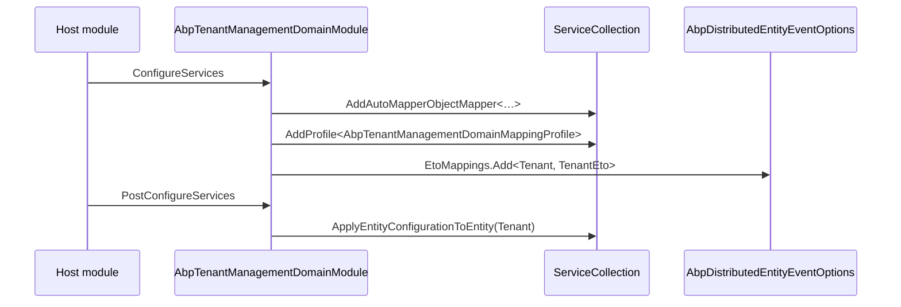

The Tenant Management domain layer (`Volo.Abp.TenantManagement.Domain`) is where the persisted tenant model lives. Every other layer — application, HTTP API, persistence backends, UI — flows from the four primitives on this page: the `Tenant` aggregate with its child `TenantConnectionString` entities, the `TenantManager` domain service that enforces uniqueness, the `ITenantRepository` contract, and the `TenantStore` implementation of the framework's `ITenantStore` (backed by a distributed cache and invalidated by a local‑event handler). Every snippet links to its source under `modules/tenant-management/src/Volo.Abp.TenantManagement.Domain/Volo/Abp/TenantManagement/`.

<Info>
`Tenant` is `[IgnoreMultiTenancy]` data — it lives on the host side. The framework's `ICurrentTenant.Change(...)` is **only** used by this module to scope side‑effects (the data seeder during create), never to filter `Tenant` queries.
</Info>

## File inventory

| File | Role |
| --- | --- |
| `Tenant.cs` | Aggregate root (`FullAuditedAggregateRoot<Guid>, IHasEntityVersion`). Holds name + list of connection strings. |
| `TenantConnectionString.cs` | Child entity. Composite key `(TenantId, Name)`. |
| `ITenantRepository.cs` | `IBasicRepository<Tenant, Guid>` with `FindByNameAsync` + paged list. |
| `ITenantManager.cs` / `TenantManager.cs` | Domain service: `CreateAsync(name)`, `ChangeNameAsync(tenant, name)`, with unique‑name validation. |
| `TenantStore.cs` | Implements the framework's `ITenantStore` over the repository, with a `IDistributedCache<TenantCacheItem>`. |
| `TenantCacheItem.cs` | Cache payload (carries `TenantConfiguration`). |
| `TenantCacheItemInvalidator.cs` | `LocalEventHandler<EntityChangedEventData<Tenant>>` — wipes cache on changes. |
| `AbpTenantManagementDomainMappingProfile.cs` | AutoMapper: `Tenant → TenantConfiguration` (with `ConnectionStrings` projection) + `Tenant → TenantEto`. |
| `AbpTenantManagementDomainModule.cs` | Wires the AutoMapper profile and registers the distributed ETO mapping. |

## The `Tenant` aggregate

`Tenant` is a `FullAuditedAggregateRoot<Guid>` with a single value property (`Name`) and a child collection. It also implements `IHasEntityVersion` so `EntityVersion` increments on every save — used downstream for optimistic concurrency on `TenantConfiguration` consumers:

```csharp modules/tenant-management/src/Volo.Abp.TenantManagement.Domain/Volo/Abp/TenantManagement/Tenant.cs
public class Tenant : FullAuditedAggregateRoot<Guid>, IHasEntityVersion
{
    public virtual string Name { get; protected set; }
    public virtual int EntityVersion { get; protected set; }
    public virtual List<TenantConnectionString> ConnectionStrings { get; protected set; }

    protected internal Tenant(Guid id, [NotNull] string name) : base(id)
    {
        SetName(name);
        ConnectionStrings = new List<TenantConnectionString>();
    }

    protected internal virtual void SetName([NotNull] string name)
    {
        Name = Check.NotNullOrWhiteSpace(name, nameof(name), TenantConsts.MaxNameLength);
    }
}
```

The constructor is `protected internal` — application code never `new`s a `Tenant` directly; it goes through `TenantManager.CreateAsync` so unique‑name validation runs first.

### Connection strings

`Tenant.ConnectionStrings` holds one row per logical connection name. The default name `Default` (i.e. `ConnectionStrings.DefaultConnectionStringName`) is the one ABP's `IConnectionStringResolver` looks up first; named strings (`AbpIdentity`, `Saas`, …) override the default for specific contexts:

```csharp modules/tenant-management/src/Volo.Abp.TenantManagement.Domain/Volo/Abp/TenantManagement/Tenant.cs
[CanBeNull]
public virtual string FindDefaultConnectionString()
    => FindConnectionString(Data.ConnectionStrings.DefaultConnectionStringName);

[CanBeNull]
public virtual string FindConnectionString(string name)
    => ConnectionStrings.FirstOrDefault(c => c.Name == name)?.Value;

public virtual void SetDefaultConnectionString(string connectionString)
    => SetConnectionString(Data.ConnectionStrings.DefaultConnectionStringName, connectionString);

public virtual void SetConnectionString(string name, string connectionString)
{
    var existing = ConnectionStrings.FirstOrDefault(x => x.Name == name);
    if (existing != null) existing.SetValue(connectionString);
    else ConnectionStrings.Add(new TenantConnectionString(Id, name, connectionString));
}

public virtual void RemoveDefaultConnectionString()
    => RemoveConnectionString(Data.ConnectionStrings.DefaultConnectionStringName);
```

The child entity is `Entity` (no auto‑id) with a **composite key** `(TenantId, Name)`:

```csharp modules/tenant-management/src/Volo.Abp.TenantManagement.Domain/Volo/Abp/TenantManagement/TenantConnectionString.cs
public class TenantConnectionString : Entity
{
    public virtual Guid TenantId { get; protected set; }
    public virtual string Name { get; protected set; }
    public virtual string Value { get; protected set; }

    public TenantConnectionString(Guid tenantId, [NotNull] string name, [NotNull] string value)
    {
        TenantId = tenantId;
        Name = Check.NotNullOrWhiteSpace(name, nameof(name), TenantConnectionStringConsts.MaxNameLength);
        SetValue(value);
    }

    public virtual void SetValue([NotNull] string value)
        => Value = Check.NotNullOrWhiteSpace(value, nameof(value), TenantConnectionStringConsts.MaxValueLength);

    public override object[] GetKeys() => new object[] { TenantId, Name };
}
```

Max lengths come from `TenantConsts` (Name = 64) and `TenantConnectionStringConsts` (Name = 64, Value = 1024). Both EF Core and Mongo schemas enforce them — see [`/modules/tenant-management/persistence`](/modules/tenant-management/persistence).

## `ITenantRepository`

The repository surface adds two things on top of the basic `IBasicRepository`: a `FindByNameAsync` (used by `TenantManager` for unique‑name checks) and a paged list with filter support consumed by the app service:

```csharp modules/tenant-management/src/Volo.Abp.TenantManagement.Domain/Volo/Abp/TenantManagement/ITenantRepository.cs
public interface ITenantRepository : IBasicRepository<Tenant, Guid>
{
    Task<Tenant> FindByNameAsync(string name, bool includeDetails = true, CancellationToken ct = default);

    Task<List<Tenant>> GetListAsync(
        string sorting = null,
        int maxResultCount = int.MaxValue,
        int skipCount = 0,
        string filter = null,
        bool includeDetails = false,
        CancellationToken ct = default);

    Task<long> GetCountAsync(string filter = null, CancellationToken ct = default);

    [Obsolete("Use FindByNameAsync method.")]
    Tenant FindByName(string name, bool includeDetails = true);
    [Obsolete("Use FindAsync method.")]
    Tenant FindById(Guid id, bool includeDetails = true);
}
```

The synchronous methods are tagged `[Obsolete]` and only kept for backward compatibility with the older `TenantStore` overloads.

## `TenantManager` domain service

`TenantManager` is the only legitimate way to create a `Tenant` or rename one. Both methods guard against duplicate names via `ValidateNameAsync`:

```csharp modules/tenant-management/src/Volo.Abp.TenantManagement.Domain/Volo/Abp/TenantManagement/TenantManager.cs
public class TenantManager : DomainService, ITenantManager
{
    protected ITenantRepository TenantRepository { get; }

    public virtual async Task<Tenant> CreateAsync(string name)
    {
        Check.NotNull(name, nameof(name));
        await ValidateNameAsync(name);
        return new Tenant(GuidGenerator.Create(), name);
    }

    public virtual async Task ChangeNameAsync(Tenant tenant, string name)
    {
        Check.NotNull(tenant, nameof(tenant));
        Check.NotNull(name, nameof(name));
        await ValidateNameAsync(name, tenant.Id);
        tenant.SetName(name);
    }

    protected virtual async Task ValidateNameAsync(string name, Guid? expectedId = null)
    {
        var tenant = await TenantRepository.FindByNameAsync(name);
        if (tenant != null && tenant.Id != expectedId)
        {
            throw new BusinessException("Volo.Abp.TenantManagement:DuplicateTenantName")
                .WithData("Name", name);
        }
    }
}
```

`DuplicateTenantName` is a localized error code — `AbpExceptionLocalizationOptions` maps the `Volo.Abp.TenantManagement` namespace to `AbpTenantManagementResource`, so the UI shows the user a friendly message.

`CreateAsync` does **not** insert the aggregate — that's `TenantAppService.CreateAsync`'s job after extra‑property mapping. The split lets you override the manager (subclass + register with `[Dependency(ReplaceServices = true)]`) without losing the surrounding application transaction.

## `TenantStore` — feeding `ICurrentTenant`

`TenantStore` is the bridge from this module's persisted `Tenant` to the framework's `ITenantStore` / `TenantConfiguration` plane. Every request that goes through `ICurrentTenant` ultimately calls one of these methods:

```csharp modules/tenant-management/src/Volo.Abp.TenantManagement.Domain/Volo/Abp/TenantManagement/TenantStore.cs
public class TenantStore : ITenantStore, ITransientDependency
{
    protected ITenantRepository TenantRepository { get; }
    protected IObjectMapper<AbpTenantManagementDomainModule> ObjectMapper { get; }
    protected ICurrentTenant CurrentTenant { get; }
    protected IDistributedCache<TenantCacheItem> Cache { get; }

    public virtual async Task<TenantConfiguration> FindAsync(string name)
        => (await GetCacheItemAsync(null, name)).Value;

    public virtual async Task<TenantConfiguration> FindAsync(Guid id)
        => (await GetCacheItemAsync(id, null)).Value;
}
```

### Cache lookup

`GetCacheItemAsync` is the hot path. It looks up the distributed cache, falls back to the repository on a miss, and **always queries inside `CurrentTenant.Change(null)`** so the host can read tenants regardless of who's making the request:

```csharp modules/tenant-management/src/Volo.Abp.TenantManagement.Domain/Volo/Abp/TenantManagement/TenantStore.cs
protected virtual async Task<TenantCacheItem> GetCacheItemAsync(Guid? id, string name)
{
    var cacheKey = CalculateCacheKey(id, name);
    var cacheItem = await Cache.GetAsync(cacheKey, considerUow: true);
    if (cacheItem != null) return cacheItem;

    if (id.HasValue)
    {
        using (CurrentTenant.Change(null))
        {
            var tenant = await TenantRepository.FindAsync(id.Value);
            return await SetCacheAsync(cacheKey, tenant);
        }
    }

    if (!name.IsNullOrWhiteSpace())
    {
        using (CurrentTenant.Change(null))
        {
            var tenant = await TenantRepository.FindByNameAsync(name);
            return await SetCacheAsync(cacheKey, tenant);
        }
    }

    throw new AbpException("Both id and name can't be invalid.");
}
```

### Mapping to `TenantConfiguration`

The store does *not* return the aggregate — the framework wants a `TenantConfiguration` (id + name + connection strings). The AutoMapper profile projects the child collection into a `ConnectionStrings` dictionary:

```csharp modules/tenant-management/src/Volo.Abp.TenantManagement.Domain/Volo/Abp/TenantManagement/AbpTenantManagementDomainMappingProfile.cs
public AbpTenantManagementDomainMappingProfile()
{
    CreateMap<Tenant, TenantConfiguration>()
        .ForMember(ti => ti.ConnectionStrings, opts =>
        {
            opts.MapFrom((tenant, ti) =>
            {
                var connStrings = new ConnectionStrings();
                foreach (var cs in tenant.ConnectionStrings)
                    connStrings[cs.Name] = cs.Value;
                return connStrings;
            });
        })
        .ForMember(x => x.IsActive, x => x.Ignore());

    CreateMap<Tenant, TenantEto>();
}
```

The `IsActive` member is intentionally ignored — this module doesn't model deactivation. (Hosts that need a "soft disable" extend the model via ABP's object‑extension system; see `TenantManagementModuleExtensionConsts`.)

### Cache key

```csharp modules/tenant-management/src/Volo.Abp.TenantManagement.Domain/Volo/Abp/TenantManagement/TenantCacheItem.cs
public static string CalculateCacheKey(Guid? id, string name)
{
    if (id == null && name.IsNullOrWhiteSpace())
        throw new AbpException("Both id and name can't be invalid.");
    return string.Format("i:{0},n:{1}",
        id?.ToString() ?? "null",
        (name.IsNullOrWhiteSpace() ? "null" : name));
}
```

Two cache entries are written for the same tenant — one keyed by id, one by name — which is why the invalidator removes *both* on any change.

## `TenantCacheItemInvalidator`

Cache coherence is enforced by a local event handler. On any insert/update/delete of `Tenant`, the handler removes both keys:

```csharp modules/tenant-management/src/Volo.Abp.TenantManagement.Domain/Volo/Abp/TenantManagement/TenantCacheItemInvalidator.cs
public class TenantCacheItemInvalidator : ILocalEventHandler<EntityChangedEventData<Tenant>>, ITransientDependency
{
    protected IDistributedCache<TenantCacheItem> Cache { get; }

    public virtual async Task HandleEventAsync(EntityChangedEventData<Tenant> eventData)
    {
        await Cache.RemoveAsync(TenantCacheItem.CalculateCacheKey(eventData.Entity.Id, null), considerUow: true);
        await Cache.RemoveAsync(TenantCacheItem.CalculateCacheKey(null, eventData.Entity.Name), considerUow: true);
    }
}
```

Because the framework publishes `EntityChangedEventData<Tenant>` on every save through the UoW, both the host and other nodes (when paired with a Redis distributed cache) see the invalidation. The bus also carries the matching `TenantEto` distributed event configured in the domain module:

```csharp modules/tenant-management/src/Volo.Abp.TenantManagement.Domain/Volo/Abp/TenantManagement/AbpTenantManagementDomainModule.cs
Configure<AbpDistributedEntityEventOptions>(options =>
{
    options.EtoMappings.Add<Tenant, TenantEto>();
});
```

`TenantEto` itself is a tiny serializable record in the shared layer:

```csharp modules/tenant-management/src/Volo.Abp.TenantManagement.Domain.Shared/Volo/Abp/TenantManagement/TenantEto.cs
[Serializable]
public class TenantEto : IHasEntityVersion
{
    public Guid Id { get; set; }
    public string Name { get; set; }
    public int EntityVersion { get; set; }
}
```

## Data seeding hook

This module doesn't implement an `IDataSeedContributor` itself — `TenantAppService.CreateAsync` *invokes* `IDataSeeder.SeedAsync` inside the new tenant's scope so other modules (Identity, Permission Management) get a chance to seed an admin user, default roles, etc. The properties added to `DataSeedContext` (`AdminEmail`, `AdminPassword`) are what the identity module's seeder reads. See [`/modules/tenant-management/application`](/modules/tenant-management/application#tenant-creation-pipeline) for the wiring.

## Object‑extension hook

The aggregate is extension‑friendly — the domain module activates the `Tenant` entity for ABP's object extension system on `PostConfigureServices`:

```csharp modules/tenant-management/src/Volo.Abp.TenantManagement.Domain/Volo/Abp/TenantManagement/AbpTenantManagementDomainModule.cs
public override void PostConfigureServices(ServiceConfigurationContext context)
{
    OneTimeRunner.Run(() =>
    {
        ModuleExtensionConfigurationHelper.ApplyEntityConfigurationToEntity(
            TenantManagementModuleExtensionConsts.ModuleName,
            TenantManagementModuleExtensionConsts.EntityNames.Tenant,
            typeof(Tenant)
        );
    });
}
```

Hosts can call `ObjectExtensionManager.Instance.AddOrUpdateProperty<Tenant, string>("Region")` in their composition root, and the EF/Mongo configurations will pick it up automatically via `ApplyObjectExtensionMappings()` in the model configuration.

## Boot summary



## Cross‑references

<CardGroup cols={3}>
  <Card title="Overview" icon="layer-group" href="/modules/tenant-management/overview">
    Package matrix and module graph.
  </Card>
  <Card title="Application" icon="gears" href="/modules/tenant-management/application">
    `TenantAppService`, data seeder invocation, distributed event publishing.
  </Card>
  <Card title="Persistence" icon="database" href="/modules/tenant-management/persistence">
    EF / Mongo schemas for `Tenant` + `TenantConnectionString`.
  </Card>
  <Card title="Multi‑tenancy" icon="globe" href="/multitenancy">
    `ICurrentTenant`, `ITenantStore`, resolvers — what this module fulfils.
  </Card>
  <Card title="Feature management domain" icon="cube" href="/modules/feature-management/domain">
    `TenantFeatureManagementProvider` keyed by `Tenant.Id`.
  </Card>
  <Card title="Permission management" icon="lock" href="/modules/permission-management/overview">
    Where `AbpTenantManagement.Tenants.*` permissions are stored and checked.
  </Card>
</CardGroup>
