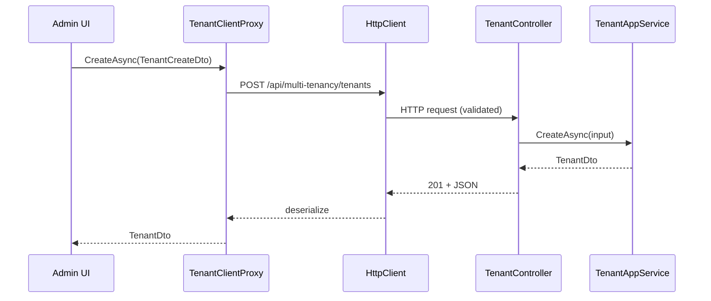

The Tenant Management HTTP API is the layer that publishes [`/modules/tenant-management/application`](/modules/tenant-management/application) as REST. `TenantController` implements `ITenantAppService` directly, which gives swagger, the dynamic JS proxy, and the strongly typed C# client proxy a single shared shape. Routes live under `/api/multi-tenancy/tenants` — the path reflects the framework's view of the world: tenant CRUD *is* the multi‑tenancy management API.

<Info>
Route prefix: `/api/multi-tenancy/tenants`. Remote‑service name: `AbpTenantManagement` (`TenantManagementRemoteServiceConsts.RemoteServiceName`). Area name: `multi-tenancy`.
</Info>

## File inventory

| File | Role |
| --- | --- |
| `TenantController.cs` | The MVC controller — implements `ITenantAppService` so the generated proxy can re‑use the interface. |
| `AbpTenantManagementHttpApiModule.cs` | Registers the application part, depends on `AbpFeatureManagementHttpApiModule` so the Features modal endpoint is available alongside. |
| `TenantClientProxy.cs` / `TenantClientProxy.Generated.cs` | Auto‑generated static proxy + manual partial. |
| `AbpTenantManagementHttpApiClientModule.cs` | `AddStaticHttpClientProxies` for the contract assembly under the `AbpTenantManagement` remote service. |

## Controller

`TenantController` is `[Controller]` (rather than just inheriting `AbpControllerBase`) because the framework's auto‑validation needs the explicit attribute when implementing an `ICrudAppService`:

```csharp modules/tenant-management/src/Volo.Abp.TenantManagement.HttpApi/Volo/Abp/TenantManagement/TenantController.cs
[Controller]
[RemoteService(Name = TenantManagementRemoteServiceConsts.RemoteServiceName)]
[Area(TenantManagementRemoteServiceConsts.ModuleName)]
[Route("api/multi-tenancy/tenants")]
public class TenantController : AbpControllerBase, ITenantAppService
{
    protected ITenantAppService TenantAppService { get; }

    public TenantController(ITenantAppService tenantAppService)
    {
        TenantAppService = tenantAppService;
    }

    [HttpGet, Route("{id}")]
    public virtual Task<TenantDto> GetAsync(Guid id)
        => TenantAppService.GetAsync(id);

    [HttpGet]
    public virtual Task<PagedResultDto<TenantDto>> GetListAsync(GetTenantsInput input)
        => TenantAppService.GetListAsync(input);

    [HttpPost]
    public virtual Task<TenantDto> CreateAsync(TenantCreateDto input)
    {
        ValidateModel();
        return TenantAppService.CreateAsync(input);
    }

    [HttpPut, Route("{id}")]
    public virtual Task<TenantDto> UpdateAsync(Guid id, TenantUpdateDto input)
        => TenantAppService.UpdateAsync(id, input);

    [HttpDelete, Route("{id}")]
    public virtual Task DeleteAsync(Guid id)
        => TenantAppService.DeleteAsync(id);

    [HttpGet, Route("{id}/default-connection-string")]
    public virtual Task<string> GetDefaultConnectionStringAsync(Guid id)
        => TenantAppService.GetDefaultConnectionStringAsync(id);

    [HttpPut, Route("{id}/default-connection-string")]
    public virtual Task UpdateDefaultConnectionStringAsync(Guid id, string defaultConnectionString)
        => TenantAppService.UpdateDefaultConnectionStringAsync(id, defaultConnectionString);

    [HttpDelete, Route("{id}/default-connection-string")]
    public virtual Task DeleteDefaultConnectionStringAsync(Guid id)
        => TenantAppService.DeleteDefaultConnectionStringAsync(id);
}
```

### Route table

| Verb | Route | Required permission | Body | Effect |
| --- | --- | --- | --- | --- |
| `GET` | `/api/multi-tenancy/tenants` | `AbpTenantManagement.Tenants` | — | Paged list (`GetTenantsInput`: `Filter`, paging, sorting). |
| `GET` | `/api/multi-tenancy/tenants/{id}` | `AbpTenantManagement.Tenants` | — | Single tenant by id. |
| `POST` | `/api/multi-tenancy/tenants` | `AbpTenantManagement.Tenants.Create` | `TenantCreateDto` | Creates the tenant, publishes `TenantCreatedEto`, runs `IDataSeeder`. |
| `PUT` | `/api/multi-tenancy/tenants/{id}` | `AbpTenantManagement.Tenants.Update` | `TenantUpdateDto` | Renames + applies extra props (concurrency‑stamp guarded). |
| `DELETE` | `/api/multi-tenancy/tenants/{id}` | `AbpTenantManagement.Tenants.Delete` | — | Soft‑deletes the tenant. |
| `GET` | `…/{id}/default-connection-string` | `AbpTenantManagement.Tenants.ManageConnectionStrings` | — | Returns the default connection string (may be `null`). |
| `PUT` | `…/{id}/default-connection-string` | `AbpTenantManagement.Tenants.ManageConnectionStrings` | `string` (query) | Upserts the default connection string. |
| `DELETE` | `…/{id}/default-connection-string` | `AbpTenantManagement.Tenants.ManageConnectionStrings` | — | Removes the default connection string. |

The permission check itself lives in the application layer's `[Authorize(...)]` attributes (see [`/modules/tenant-management/application`](/modules/tenant-management/application)).

### `ValidateModel()` on create

`CreateAsync` explicitly calls `ValidateModel()` because `TenantCreateDto.AdminPassword` is marked `[DisableAuditing]` and the framework's automatic validation runs *after* the audit redaction step — the call enforces the `[Required]` / `[EmailAddress]` / `[MaxLength]` annotations before any side‑effects start.

### Sample request

```http
POST /api/multi-tenancy/tenants HTTP/1.1
Authorization: Bearer …
Content-Type: application/json

{
  "name": "acme",
  "adminEmailAddress": "admin@acme.com",
  "adminPassword": "1q2w3E*"
}
```

Response:

```json
{
  "id": "8e9b5e2e-3d6f-4d76-bb0b-1e0a07a5e9b9",
  "name": "acme",
  "concurrencyStamp": "5fb1c6d9d12d4b9c8d2c1f3a4e6b2d11",
  "extraProperties": {}
}
```

A `TenantCreatedEto` lands on the distributed bus immediately after the row is inserted (see [`/modules/tenant-management/application#tenant-creation-pipeline`](/modules/tenant-management/application#tenant-creation-pipeline)).

### Connection‑string examples

```http
PUT /api/multi-tenancy/tenants/8e9b5e2e…/default-connection-string?defaultConnectionString=Server%3D...
```

```http
DELETE /api/multi-tenancy/tenants/8e9b5e2e…/default-connection-string
```

The framework's `IConnectionStringResolver` calls into `ITenantStore` → `TenantStore` → `TenantConfiguration.ConnectionStrings` on the next request, so the change takes effect after the `TenantCacheItemInvalidator` wipes the cache entry (see [`/modules/tenant-management/domain`](/modules/tenant-management/domain)).

## Module wiring

The HTTP API module pulls in `AbpFeatureManagementHttpApiModule` so a host that adds tenant management automatically exposes the features endpoint too — that's what powers the *Features* button on the tenant list:

```csharp modules/tenant-management/src/Volo.Abp.TenantManagement.HttpApi/Volo/Abp/TenantManagement/AbpTenantManagementHttpApiModule.cs
[DependsOn(
    typeof(AbpTenantManagementApplicationContractsModule),
    typeof(AbpFeatureManagementHttpApiModule),
    typeof(AbpAspNetCoreMvcModule)
    )]
public class AbpTenantManagementHttpApiModule : AbpModule
{
    public override void PreConfigureServices(ServiceConfigurationContext context)
    {
        PreConfigure<IMvcBuilder>(mvcBuilder =>
        {
            mvcBuilder.AddApplicationPartIfNotExists(typeof(AbpTenantManagementHttpApiModule).Assembly);
        });
    }

    public override void ConfigureServices(ServiceConfigurationContext context)
    {
        Configure<AbpLocalizationOptions>(options =>
        {
            options.Resources
                .Get<AbpTenantManagementResource>()
                .AddBaseTypes(
                    typeof(AbpFeatureManagementResource),
                    typeof(AbpUiResource));
        });
    }
}
```

## Client proxy

The HTTP client module registers static proxies for the contract assembly under the `AbpTenantManagement` remote service:

```csharp modules/tenant-management/src/Volo.Abp.TenantManagement.HttpApi.Client/Volo/Abp/TenantManagement/AbpTenantManagementHttpApiClientModule.cs
[DependsOn(
    typeof(AbpTenantManagementApplicationContractsModule),
    typeof(AbpHttpClientModule))]
public class AbpTenantManagementHttpApiClientModule : AbpModule
{
    public override void ConfigureServices(ServiceConfigurationContext context)
    {
        context.Services.AddStaticHttpClientProxies(
            typeof(AbpTenantManagementApplicationContractsModule).Assembly,
            TenantManagementRemoteServiceConsts.RemoteServiceName);
    }
}
```

The generated `TenantClientProxy` implements `ITenantAppService` directly:

```csharp modules/tenant-management/src/Volo.Abp.TenantManagement.HttpApi.Client/ClientProxies/Volo/Abp/TenantManagement/TenantClientProxy.Generated.cs
[Dependency(ReplaceServices = true)]
[ExposeServices(typeof(ITenantAppService), typeof(TenantClientProxy))]
public partial class TenantClientProxy : ClientProxyBase<ITenantAppService>, ITenantAppService
{
    public virtual async Task<TenantDto> CreateAsync(TenantCreateDto input)
        => await RequestAsync<TenantDto>(nameof(CreateAsync), new ClientProxyRequestTypeValue
        {
            { typeof(TenantCreateDto), input }
        });

    public virtual async Task<TenantDto> UpdateAsync(Guid id, TenantUpdateDto input)
        => await RequestAsync<TenantDto>(nameof(UpdateAsync), new ClientProxyRequestTypeValue
        {
            { typeof(Guid), id },
            { typeof(TenantUpdateDto), input }
        });

    public virtual async Task<string> GetDefaultConnectionStringAsync(Guid id)
        => await RequestAsync<string>(nameof(GetDefaultConnectionStringAsync), new ClientProxyRequestTypeValue
        {
            { typeof(Guid), id }
        });
    ...
}
```

Because the proxy implements `ITenantAppService` with `[ExposeServices(typeof(ITenantAppService), typeof(TenantClientProxy))]`, downstream code that resolves `ITenantAppService` gets the proxy automatically when only the client module is present — there's nothing to special‑case in the UI.

### Where the proxy is consumed

- **Blazor WebAssembly** — `AbpTenantManagementBlazorWebAssemblyModule` pulls in the HTTP client module, so `TenantManagement.razor` calls the API over HTTPS.
- **Microservice gateways** — Hosts that don't reference `…Application` can use `…HttpApi.Client` to manage tenants over the wire.
- **CLI/automation** — A console app can `AddApplication<…HttpApi.Client>()` and create tenants programmatically.

## End‑to‑end create



## OpenAPI / Swagger

Because the controller implements `ITenantAppService` (and is itself a remote service), ABP's `AbpServiceConvention` produces a clean Swagger group for it. The operations are named after the interface methods and the response/request schemas are inferred from the DTOs. Hosts that need a bespoke Swagger definition can use `AbpSwaggerOptions` to rename the group or split the controller into multiple definitions.

## Dynamic JS proxy

Unlike Feature Management, the tenant management Web module **does not** disable the dynamic JavaScript proxy — instead the embedded `abp.tenantManagement.tenants.*` proxy is generated dynamically by the framework's `DynamicJavaScriptProxyMiddleware` so MVC views can call the API straight from `abp.ajax(...)`. The Blazor WASM build uses the static C# proxy above.

## Cross‑references

<CardGroup cols={3}>
  <Card title="Application" icon="gears" href="/modules/tenant-management/application">
    The `ITenantAppService` contract this controller forwards to.
  </Card>
  <Card title="Blazor & Web UI" icon="window" href="/modules/tenant-management/blazor-and-web">
    Where the proxy is consumed.
  </Card>
  <Card title="Persistence" icon="database" href="/modules/tenant-management/persistence">
    Where rows are eventually written.
  </Card>
  <Card title="Feature management HTTP API" icon="bolt" href="/modules/feature-management/http-api">
    Sibling endpoint pulled in by the same `[DependsOn]`.
  </Card>
  <Card title="Multi‑tenancy" icon="globe" href="/multitenancy">
    `TenantCreatedEto`, `ICurrentTenant`, connection‑string semantics.
  </Card>
  <Card title="Permission management" icon="lock" href="/modules/permission-management/overview">
    Stores the grants checked by the `[Authorize(...)]` chain.
  </Card>
</CardGroup>
