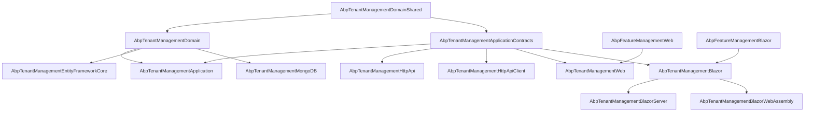
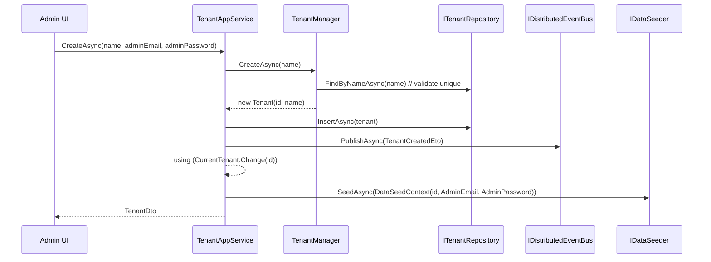
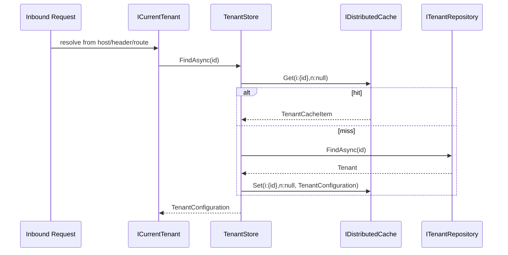

The ABP Tenant Management module is the persistent identity store for the framework's `ICurrentTenant` / `ITenantStore` plane. The framework gives you the *abstractions* — resolve a tenant from the request, expose it to data, settings, features — but it leaves the persistence and management of tenant records to a module. Tenant Management fills that gap: a `Tenant` aggregate with per‑tenant connection strings, an `ITenantRepository`, a `TenantManager` that enforces unique names, an `ITenantStore` implementation that backs `ICurrentTenant` resolution with a distributed cache, and an application service + HTTP API exposed at `/api/multi-tenancy/tenants` with a Blazor / MVC admin UI that embeds the Feature Management modal.

<Info>
Source root: [`modules/tenant-management/src/`](https://github.com/abpframework/abp/tree/dev/modules/tenant-management/src). The framework abstractions this module fulfils live under [`framework/src/Volo.Abp.MultiTenancy`](https://github.com/abpframework/abp/tree/dev/framework/src/Volo.Abp.MultiTenancy) and are documented at [`/multitenancy`](/multitenancy).
</Info>

## Why a dedicated Tenant Management module?

`Volo.Abp.MultiTenancy` ships interfaces (`ITenantStore`, `ITenantResolver`, `ICurrentTenant`) and resolution contributors (host, query string, cookie, header, route, …), but it deliberately defers four concerns to a module:

- **Storage of the tenant record.** Persisted name, audit fields, `EntityVersion`, and the **list of per‑tenant connection strings** keyed by logical name (e.g. `default`, `AbpIdentity`, `Saas`).
- **Domain rules.** Unique name validation, controlled mutation via `TenantManager.ChangeNameAsync`, and concurrency on `EntityVersion`.
- **Cache + invalidation.** A distributed `TenantCacheItem` keyed by `(id, name)` so `ICurrentTenant` resolution doesn't hit the database on every request, plus a local‑event handler that wipes the cache on every change.
- **Admin surface.** CRUD app service, HTTP API, and a Blazor / MVC page with create/edit modals + the Feature Management modal embedded.

This module also produces the `TenantCreatedEto` distributed event and runs `IDataSeeder` inside the created tenant's scope so downstream modules (notably the [identity module](/modules/identity/overview)) can seed an admin user.

For an end‑to‑end picture of multi‑tenancy (resolution, data filtering, connection switching), see [`/multitenancy`](/multitenancy). The sibling modules that integrate with this one are [`/modules/feature-management/overview`](/modules/feature-management/overview) (the *Features* action on a tenant row) and [`/modules/permission-management`](/modules/permission-management/overview) (where the tenant‑management permissions live).

## Package matrix

The module follows ABP's standard layering. Each row maps to a project folder under `modules/tenant-management/src/`.

| Package | Project folder | Layer | Primary purpose |
| --- | --- | --- | --- |
| `Volo.Abp.TenantManagement.Domain.Shared` | `Volo.Abp.TenantManagement.Domain.Shared/` | Domain.Shared | Constants (`TenantConsts`, `TenantConnectionStringConsts`), `TenantEto`, localization resource. |
| `Volo.Abp.TenantManagement.Domain` | `Volo.Abp.TenantManagement.Domain/` | Domain | `Tenant` aggregate, `TenantConnectionString`, `ITenantRepository`, `TenantManager`, `TenantStore`, `TenantCacheItem` + invalidator. |
| `Volo.Abp.TenantManagement.Application.Contracts` | `Volo.Abp.TenantManagement.Application.Contracts/` | Application.Contracts | `ITenantAppService`, DTOs (`TenantDto`, `TenantCreateDto`, `TenantUpdateDto`, `GetTenantsInput`), `TenantManagementPermissions`. |
| `Volo.Abp.TenantManagement.Application` | `Volo.Abp.TenantManagement.Application/` | Application | `TenantAppService`, AutoMapper profile, `TenantCreatedEto` publication, data‑seeder invocation. |
| `Volo.Abp.TenantManagement.HttpApi` | `Volo.Abp.TenantManagement.HttpApi/` | HttpApi | `TenantController` exposing `/api/multi-tenancy/tenants`. |
| `Volo.Abp.TenantManagement.HttpApi.Client` | `Volo.Abp.TenantManagement.HttpApi.Client/` | HttpApi.Client | Typed `TenantClientProxy` (static + generated). |
| `Volo.Abp.TenantManagement.EntityFrameworkCore` | `Volo.Abp.TenantManagement.EntityFrameworkCore/` | Persistence | `TenantManagementDbContext` + `EfCoreTenantRepository` + EF model. |
| `Volo.Abp.TenantManagement.MongoDB` | `Volo.Abp.TenantManagement.MongoDB/` | Persistence | `TenantManagementMongoDbContext` + `MongoTenantRepository`. |
| `Volo.Abp.TenantManagement.Web` | `Volo.Abp.TenantManagement.Web/` | MVC UI | `AbpTenantManagementWebModule`, Razor pages, `AbpTenantManagementWebMainMenuContributor`. |
| `Volo.Abp.TenantManagement.Blazor` | `Volo.Abp.TenantManagement.Blazor/` | Blazor UI | `AbpTenantManagementBlazorModule`, `TenantManagement.razor` page, menu contributor. |
| `Volo.Abp.TenantManagement.Blazor.Server` / `.WebAssembly` | `Volo.Abp.TenantManagement.Blazor.Server/`, `.../Blazor.WebAssembly/` | Blazor hosts | Empty `[DependsOn]` shells that pull the right transport. |
| `Volo.Abp.TenantManagement.Installer` | `Volo.Abp.TenantManagement.Installer/` | Installer | Embeds the NuGet manifest for the ABP CLI. |

## Layered composition



`AbpTenantManagementDomainModule` depends on `AbpMultiTenancyModule` (it implements `ITenantStore`), `AbpDataModule` (`IDataSeeder`), `AbpDddDomainModule` and `AbpAutoMapperModule`:

```csharp modules/tenant-management/src/Volo.Abp.TenantManagement.Domain/Volo/Abp/TenantManagement/AbpTenantManagementDomainModule.cs
[DependsOn(typeof(AbpMultiTenancyModule))]
[DependsOn(typeof(AbpTenantManagementDomainSharedModule))]
[DependsOn(typeof(AbpDataModule))]
[DependsOn(typeof(AbpDddDomainModule))]
[DependsOn(typeof(AbpAutoMapperModule))]
[DependsOn(typeof(AbpCachingModule))]
public class AbpTenantManagementDomainModule : AbpModule
{
    public override void ConfigureServices(ServiceConfigurationContext context)
    {
        context.Services.AddAutoMapperObjectMapper<AbpTenantManagementDomainModule>();

        Configure<AbpAutoMapperOptions>(options =>
        {
            options.AddProfile<AbpTenantManagementDomainMappingProfile>(validate: true);
        });

        Configure<AbpDistributedEntityEventOptions>(options =>
        {
            options.EtoMappings.Add<Tenant, TenantEto>();
        });
    }
}
```

The `EtoMappings.Add<Tenant, TenantEto>` line is what lets every other host on the bus react to tenant creation/deletion without referencing this module's domain types.

## Source tree at a glance

```
modules/tenant-management/src/
├── Volo.Abp.TenantManagement.Domain.Shared/
│   └── Volo/Abp/TenantManagement/
│       ├── AbpTenantManagementDomainSharedModule.cs
│       ├── TenantConsts.cs
│       ├── TenantConnectionStringConsts.cs
│       └── TenantEto.cs
├── Volo.Abp.TenantManagement.Domain/
│   └── Volo/Abp/TenantManagement/
│       ├── Tenant.cs                            ← aggregate root
│       ├── TenantConnectionString.cs            ← child entity
│       ├── ITenantRepository.cs
│       ├── ITenantManager.cs / TenantManager.cs
│       ├── TenantStore.cs                       ← ITenantStore impl
│       ├── TenantCacheItem.cs / TenantCacheItemInvalidator.cs
│       └── AbpTenantManagementDomainModule.cs
├── Volo.Abp.TenantManagement.Application.Contracts/
│   └── Volo/Abp/TenantManagement/
│       ├── ITenantAppService.cs
│       ├── TenantDto.cs / TenantCreateDto.cs / TenantUpdateDto.cs
│       ├── GetTenantsInput.cs
│       ├── TenantManagementPermissions.cs
│       └── AbpTenantManagementPermissionDefinitionProvider.cs
├── Volo.Abp.TenantManagement.Application/
│   └── Volo/Abp/TenantManagement/TenantAppService.cs
├── Volo.Abp.TenantManagement.HttpApi/
│   └── Volo/Abp/TenantManagement/TenantController.cs
├── Volo.Abp.TenantManagement.HttpApi.Client/
│   └── ClientProxies/.../TenantClientProxy.cs
├── Volo.Abp.TenantManagement.EntityFrameworkCore/
│   └── Volo/Abp/TenantManagement/EntityFrameworkCore/
│       ├── TenantManagementDbContext.cs
│       ├── EfCoreTenantRepository.cs
│       └── AbpTenantManagementDbContextModelCreatingExtensions.cs
├── Volo.Abp.TenantManagement.MongoDB/
│   └── Volo/Abp/TenantManagement/MongoDb/
│       ├── TenantManagementMongoDbContext.cs
│       └── MongoTenantRepository.cs
├── Volo.Abp.TenantManagement.Web/
│   ├── AbpTenantManagementWebModule.cs
│   ├── Navigation/AbpTenantManagementWebMainMenuContributor.cs
│   └── Pages/TenantManagement/Tenants/{Index,CreateModal,EditModal}.cshtml(.cs)
└── Volo.Abp.TenantManagement.Blazor/
    ├── AbpTenantManagementBlazorModule.cs
    ├── Navigation/TenantManagementBlazorMenuContributor.cs
    └── Pages/TenantManagement/TenantManagement.razor(.cs)
```

## Key flows

### Tenant creation

`TenantAppService.CreateAsync` is where the most happens. The application service builds the aggregate through `TenantManager`, saves it, publishes a `TenantCreatedEto` on the distributed bus, then changes into the created tenant's scope and runs `IDataSeeder.SeedAsync` so downstream modules (e.g. Identity) can seed an admin user:



### Tenant resolution and caching

The framework's `ICurrentTenant` resolver calls `ITenantStore.FindAsync(id|name)` on every request that needs to know "who is this?". `TenantStore` fronts the repository with a distributed cache keyed by `i:{id},n:{name}`:



The cache is invalidated by `TenantCacheItemInvalidator` (a `LocalEventHandler<EntityChangedEventData<Tenant>>`) whenever `TenantRepository` saves a change.

## Integration with Feature Management

`AbpTenantManagementWebModule` and `AbpTenantManagementBlazorModule` both `[DependsOn]` their Feature Management counterparts. The Blazor `TenantManagement.razor` page embeds `<FeatureManagementModal />` and exposes a *Features* action per row:

```csharp modules/tenant-management/src/Volo.Abp.TenantManagement.Blazor/Pages/TenantManagement/TenantManagement.razor.cs
new EntityAction
{
    Text = L["Features"],
    Visible = (data) => HasManageFeaturesPermission,
    Clicked = async (data) =>
    {
        var tenant = data.As<TenantDto>();
        await FeatureManagementModal.OpenAsync(FeatureProviderName, tenant.Id.ToString());
    }
}
```

`FeatureProviderName = "T"` is the constant shared with `TenantFeatureValueProvider.ProviderName` and the `TenantFeatureManagementProvider` documented at [`/modules/feature-management/domain`](/modules/feature-management/domain).

## When to use this module

<CardGroup cols={2}>
  <Card title="Use it" icon="check">
    - You ship a SaaS where tenants are runtime data (signup/admin‑created, not config).
    - You need per‑tenant connection strings (separate DBs).
    - You want a host admin page to manage tenants + features.
  </Card>
  <Card title="Skip it (use `Volo.Abp.MultiTenancy` directly)" icon="xmark">
    - Your tenants are a static list in config / hard‑coded `ITenantStore`.
    - You don't expose any tenant management UI to your operators.
    - You ship your own tenant CRUD over a different schema.
  </Card>
</CardGroup>

## Where to go next

<CardGroup cols={3}>
  <Card title="Domain layer" icon="cube" href="/modules/tenant-management/domain">
    `Tenant`, `TenantConnectionString`, `TenantManager`, store and cache.
  </Card>
  <Card title="Application layer" icon="gears" href="/modules/tenant-management/application">
    `TenantAppService`, DTOs, permissions, data seeding.
  </Card>
  <Card title="HTTP API" icon="plug" href="/modules/tenant-management/http-api">
    `TenantController`, route table, client proxy.
  </Card>
  <Card title="Persistence" icon="database" href="/modules/tenant-management/persistence">
    EF Core / MongoDB models and indexes.
  </Card>
  <Card title="Blazor & Web UI" icon="window" href="/modules/tenant-management/blazor-and-web">
    `TenantManagement.razor`, MVC pages, FeatureManagement integration.
  </Card>
  <Card title="Multi‑tenancy" icon="globe" href="/multitenancy">
    The framework abstractions this module implements.
  </Card>
</CardGroup>
