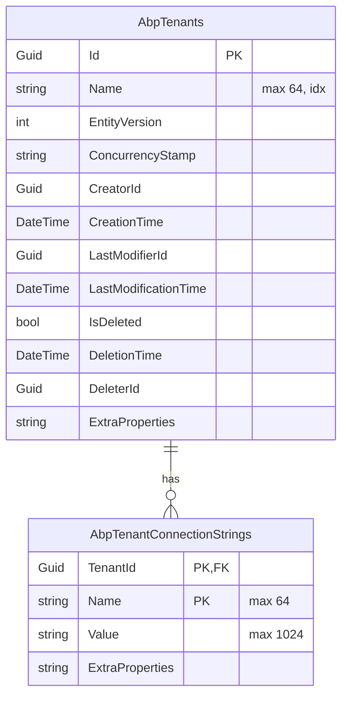

The tenant aggregate is small but the surrounding storage concerns are not — multi‑tenancy expects host‑side data (so the contexts are `[IgnoreMultiTenancy]`), connection strings live as a child collection with a composite key (so EF needs a `HasMany().WithOne()` shape and Mongo embeds them in the document), and `TenantRepository.GetListAsync` needs to support paged filter‑by‑name for the admin UI. This page maps the EF Core and MongoDB implementations side by side.

<Info>
Connection string name: `AbpTenantManagement` (`AbpTenantManagementDbProperties.ConnectionStringName`). Table / collection prefix defaults to `Abp` (`AbpCommonDbProperties.DbTablePrefix`).
</Info>

## Tables / collections

| Aggregate | Default table / collection | Purpose |
| --- | --- | --- |
| `Tenant` | `AbpTenants` | One row per tenant; full audit + `EntityVersion`. |
| `TenantConnectionString` | `AbpTenantConnectionStrings` (EF) / embedded (Mongo) | Per‑tenant named connection strings; composite key `(TenantId, Name)`. |

`TenantConsts` and `TenantConnectionStringConsts` define the maximum field widths used by both backends:

```csharp modules/tenant-management/src/Volo.Abp.TenantManagement.Domain.Shared/Volo/Abp/TenantManagement/TenantConsts.cs
public static class TenantConsts
{
    public static int MaxNameLength { get; set; } = 64;
    public static int MaxPasswordLength { get; set; } = 128;        // used by TenantCreateDto.AdminPassword
    public static int MaxAdminEmailAddressLength { get; set; } = 256;
}
```

```csharp modules/tenant-management/src/Volo.Abp.TenantManagement.Domain.Shared/Volo/Abp/TenantManagement/TenantConnectionStringConsts.cs
public static class TenantConnectionStringConsts
{
    public static int MaxNameLength { get; set; } = 64;
    public static int MaxValueLength { get; set; } = 1024;
}
```

## Entity Framework Core

### `ITenantManagementDbContext`

The interface is the binding contract for repositories. Like Feature Management, it is `[IgnoreMultiTenancy]` and `[ConnectionStringName]`‑tagged:

```csharp modules/tenant-management/src/Volo.Abp.TenantManagement.EntityFrameworkCore/Volo/Abp/TenantManagement/EntityFrameworkCore/ITenantManagementDbContext.cs
[IgnoreMultiTenancy]
[ConnectionStringName(AbpTenantManagementDbProperties.ConnectionStringName)]
public interface ITenantManagementDbContext : IEfCoreDbContext
{
    DbSet<Tenant> Tenants { get; }
    DbSet<TenantConnectionString> TenantConnectionStrings { get; }
}
```

`TenantManagementDbContext` is the concrete shape used for migrations:

```csharp modules/tenant-management/src/Volo.Abp.TenantManagement.EntityFrameworkCore/Volo/Abp/TenantManagement/EntityFrameworkCore/TenantManagementDbContext.cs
[IgnoreMultiTenancy]
[ConnectionStringName(AbpTenantManagementDbProperties.ConnectionStringName)]
public class TenantManagementDbContext : AbpDbContext<TenantManagementDbContext>, ITenantManagementDbContext
{
    public DbSet<Tenant> Tenants { get; set; }
    public DbSet<TenantConnectionString> TenantConnectionStrings { get; set; }

    protected override void OnModelCreating(ModelBuilder builder)
    {
        base.OnModelCreating(builder);
        builder.ConfigureTenantManagement();
    }
}
```

Hosts that fold tenant management into a single `MyAppDbContext` call `builder.ConfigureTenantManagement()` from their own `OnModelCreating` to pull the same model in.

### Model creation

`ConfigureTenantManagement` honours `IsTenantOnlyDatabase` (skips the model entirely on tenant‑only DBs) and configures both entities with the right lengths and the cascading FK:

```csharp modules/tenant-management/src/Volo.Abp.TenantManagement.EntityFrameworkCore/Volo/Abp/TenantManagement/EntityFrameworkCore/AbpTenantManagementDbContextModelCreatingExtensions.cs
public static void ConfigureTenantManagement(this ModelBuilder builder)
{
    if (builder.IsTenantOnlyDatabase()) return;

    builder.Entity<Tenant>(b =>
    {
        b.ToTable(AbpTenantManagementDbProperties.DbTablePrefix + "Tenants",
                  AbpTenantManagementDbProperties.DbSchema);
        b.ConfigureByConvention();

        b.Property(t => t.Name).IsRequired().HasMaxLength(TenantConsts.MaxNameLength);
        b.HasMany(u => u.ConnectionStrings).WithOne().HasForeignKey(uc => uc.TenantId).IsRequired();
        b.HasIndex(u => u.Name);

        b.ApplyObjectExtensionMappings();
    });

    builder.Entity<TenantConnectionString>(b =>
    {
        b.ToTable(AbpTenantManagementDbProperties.DbTablePrefix + "TenantConnectionStrings",
                  AbpTenantManagementDbProperties.DbSchema);
        b.ConfigureByConvention();

        b.HasKey(x => new { x.TenantId, x.Name });
        b.Property(cs => cs.Name).IsRequired().HasMaxLength(TenantConnectionStringConsts.MaxNameLength);
        b.Property(cs => cs.Value).IsRequired().HasMaxLength(TenantConnectionStringConsts.MaxValueLength);

        b.ApplyObjectExtensionMappings();
    });

    builder.TryConfigureObjectExtensions<TenantManagementDbContext>();
}
```

### Indexes that matter

| Table | Index | Used by |
| --- | --- | --- |
| `AbpTenants` | non‑unique on `Name` | `ITenantRepository.FindByNameAsync` (cache miss path, `TenantManager.ValidateNameAsync`). |
| `AbpTenants` | PK `Id` | `ITenantRepository.FindAsync(id)`, `TenantStore` cache‑by‑id miss. |
| `AbpTenantConnectionStrings` | composite PK `(TenantId, Name)` | `TenantConnectionString.GetKeys()`, eager load via `IncludeDetails`. |

The Name index is intentionally non‑unique — uniqueness is enforced at the domain level by `TenantManager.ValidateNameAsync` (which throws `BusinessException("Volo.Abp.TenantManagement:DuplicateTenantName")`). That keeps the DB happy when seeding fixtures or running tests with bulk imports that temporarily violate uniqueness.

### Repository

`EfCoreTenantRepository` is where the `IncludeDetails(...)` extension shines:

```csharp modules/tenant-management/src/Volo.Abp.TenantManagement.EntityFrameworkCore/Volo/Abp/TenantManagement/EntityFrameworkCore/EfCoreTenantRepository.cs
public class EfCoreTenantRepository : EfCoreRepository<ITenantManagementDbContext, Tenant, Guid>, ITenantRepository
{
    public virtual async Task<Tenant> FindByNameAsync(
        string name, bool includeDetails = true, CancellationToken ct = default)
    {
        return await (await GetDbSetAsync())
            .IncludeDetails(includeDetails)
            .OrderBy(t => t.Id)
            .FirstOrDefaultAsync(t => t.Name == name, GetCancellationToken(ct));
    }

    public virtual async Task<List<Tenant>> GetListAsync(
        string sorting = null, int maxResultCount = int.MaxValue, int skipCount = 0,
        string filter = null, bool includeDetails = false, CancellationToken ct = default)
    {
        return await (await GetDbSetAsync())
            .IncludeDetails(includeDetails)
            .WhereIf(!filter.IsNullOrWhiteSpace(), u => u.Name.Contains(filter))
            .OrderBy(sorting.IsNullOrEmpty() ? nameof(Tenant.Name) : sorting)
            .PageBy(skipCount, maxResultCount)
            .ToListAsync(GetCancellationToken(ct));
    }

    public virtual async Task<long> GetCountAsync(string filter = null, CancellationToken ct = default)
        => await (await GetQueryableAsync())
            .WhereIf(!filter.IsNullOrWhiteSpace(), u => u.Name.Contains(filter))
            .CountAsync(cancellationToken: GetCancellationToken(ct));

    public override async Task<IQueryable<Tenant>> WithDetailsAsync()
        => (await GetQueryableAsync()).IncludeDetails();
}
```

`IncludeDetails` itself is just `.Include(x => x.ConnectionStrings)`:

```csharp modules/tenant-management/src/Volo.Abp.TenantManagement.EntityFrameworkCore/Volo/Abp/TenantManagement/EntityFrameworkCore/TenantManagementEfCoreQueryableExtensions.cs
public static IQueryable<Tenant> IncludeDetails(this IQueryable<Tenant> queryable, bool include = true)
{
    if (!include) return queryable;
    return queryable.Include(x => x.ConnectionStrings);
}
```

Notice that `GetListAsync` defaults `includeDetails` to `false` — the admin list doesn't need connection strings, so the query stays a single‑table scan. `FindByNameAsync` defaults to `true` because `TenantStore.GetCacheItemAsync` needs the full `TenantConfiguration` (including connection strings) the first time a tenant is loaded into the cache.

### Schema diagram



### EF module wiring

The EF module is intentionally tiny — `AddDefaultRepositories` picks up `Tenant` and `TenantConnectionString` automatically; the `EfCoreTenantRepository` registration is convention‑based via `IExposeServices`:

```csharp modules/tenant-management/src/Volo.Abp.TenantManagement.EntityFrameworkCore/Volo/Abp/TenantManagement/EntityFrameworkCore/AbpTenantManagementEntityFrameworkCoreModule.cs
[DependsOn(typeof(AbpTenantManagementDomainModule))]
[DependsOn(typeof(AbpEntityFrameworkCoreModule))]
public class AbpTenantManagementEntityFrameworkCoreModule : AbpModule
{
    public override void ConfigureServices(ServiceConfigurationContext context)
    {
        context.Services.AddAbpDbContext<TenantManagementDbContext>(options =>
        {
            options.AddDefaultRepositories<ITenantManagementDbContext>();
        });
    }
}
```

## MongoDB

The MongoDB story embeds `ConnectionStrings` in the parent document — there's no separate collection. The DbContext only exposes the parent collection:

```csharp modules/tenant-management/src/Volo.Abp.TenantManagement.MongoDB/Volo/Abp/TenantManagement/MongoDb/ITenantManagementMongoDbContext.cs
[IgnoreMultiTenancy]
[ConnectionStringName(AbpTenantManagementDbProperties.ConnectionStringName)]
public interface ITenantManagementMongoDbContext : IAbpMongoDbContext
{
    IMongoCollection<Tenant> Tenants { get; }
}
```

```csharp modules/tenant-management/src/Volo.Abp.TenantManagement.MongoDB/Volo/Abp/TenantManagement/MongoDb/TenantManagementMongoDbContext.cs
[IgnoreMultiTenancy]
[ConnectionStringName(AbpTenantManagementDbProperties.ConnectionStringName)]
public class TenantManagementMongoDbContext : AbpMongoDbContext, ITenantManagementMongoDbContext
{
    public IMongoCollection<Tenant> Tenants => Collection<Tenant>();

    protected override void CreateModel(IMongoModelBuilder modelBuilder)
    {
        base.CreateModel(modelBuilder);
        modelBuilder.ConfigureTenantManagement();
    }
}
```

```csharp modules/tenant-management/src/Volo.Abp.TenantManagement.MongoDB/Volo/Abp/TenantManagement/MongoDb/AbpTenantManagementMongoDbContextExtensions.cs
public static void ConfigureTenantManagement(this IMongoModelBuilder builder)
{
    builder.Entity<Tenant>(b =>
    {
        b.CollectionName = AbpTenantManagementDbProperties.DbTablePrefix + "Tenants";
    });
}
```

### Repository

`MongoTenantRepository` mirrors the EF implementation function for function (with the obsolete sync overrides for backward compatibility):

```csharp modules/tenant-management/src/Volo.Abp.TenantManagement.MongoDB/Volo/Abp/TenantManagement/MongoDb/MongoTenantRepository.cs
public class MongoTenantRepository : MongoDbRepository<ITenantManagementMongoDbContext, Tenant, Guid>, ITenantRepository
{
    public virtual async Task<Tenant> FindByNameAsync(
        string name, bool includeDetails = true, CancellationToken ct = default)
        => await (await GetMongoQueryableAsync(ct))
            .FirstOrDefaultAsync(t => t.Name == name, GetCancellationToken(ct));

    public virtual async Task<List<Tenant>> GetListAsync(
        string sorting = null, int maxResultCount = int.MaxValue, int skipCount = 0,
        string filter = null, bool includeDetails = false, CancellationToken ct = default)
        => await (await GetMongoQueryableAsync(ct))
            .WhereIf<Tenant, IMongoQueryable<Tenant>>(
                !filter.IsNullOrWhiteSpace(), u => u.Name.Contains(filter))
            .OrderBy(sorting.IsNullOrEmpty() ? nameof(Tenant.Name) : sorting)
            .As<IMongoQueryable<Tenant>>()
            .PageBy<Tenant, IMongoQueryable<Tenant>>(skipCount, maxResultCount)
            .ToListAsync(GetCancellationToken(ct));
}
```

There's no separate eager‑load path — the embedded `ConnectionStrings` array is always part of the document, so `includeDetails` is effectively a no‑op on Mongo. `Name.Contains(filter)` translates to a `$regex` operator on the server; if your tenant list grows large, add a text index on `Name` from a startup hook.

### Mongo module wiring

```csharp modules/tenant-management/src/Volo.Abp.TenantManagement.MongoDB/Volo/Abp/TenantManagement/MongoDb/AbpTenantManagementMongoDbModule.cs
context.Services.AddMongoDbContext<TenantManagementMongoDbContext>(options =>
{
    options.AddDefaultRepositories<ITenantManagementMongoDbContext>();
    options.AddRepository<Tenant, MongoTenantRepository>();
});
```

## Choosing a backend

<CardGroup cols={2}>
  <Card title="EF Core" icon="database">
    Pick this when the rest of your host runs on EF Core. You get migrations, FK‑backed cascading delete on `AbpTenantConnectionStrings`, and the same `IUnitOfWork` semantics for `TenantAppService.CreateAsync` + `IDataSeeder.SeedAsync`.
  </Card>
  <Card title="MongoDB" icon="leaf">
    Pick this when your host uses Mongo end‑to‑end. Connection strings are embedded — no separate collection — which keeps the document model simple and lets a single `ReplaceOneAsync` carry the entire aggregate.
  </Card>
</CardGroup>

## Object extensions

Both backends call `ApplyObjectExtensionMappings()` / `TryConfigureObjectExtensions<...>()` (EF) or rely on the framework's default Mongo serialization (which honours `IHasExtraProperties`). Combined with the contract module's `ApplyEntityConfigurationToApi` call (see [`/modules/tenant-management/application`](/modules/tenant-management/application#dtos)), this means hosts can add their own properties to `Tenant` and have them flow through DTO ↔ aggregate ↔ DB transparently — see ABP's object‑extension docs for the syntax.

## Cross‑references

<CardGroup cols={3}>
  <Card title="Domain" icon="cube" href="/modules/tenant-management/domain">
    The aggregate this layer persists.
  </Card>
  <Card title="Application" icon="gears" href="/modules/tenant-management/application">
    `TenantAppService.CreateAsync` and `SaveChangesAsync` semantics.
  </Card>
  <Card title="Feature management persistence" icon="bolt" href="/modules/feature-management/persistence">
    Sibling persistence pattern; shares the `[IgnoreMultiTenancy]` + connection name conventions.
  </Card>
  <Card title="Permission management" icon="lock" href="/modules/permission-management/overview">
    Permission grants are stored in *its* persistence — separate from tenant rows.
  </Card>
  <Card title="Multi‑tenancy" icon="globe" href="/multitenancy">
    Why `[IgnoreMultiTenancy]` on the context, and how `ConnectionStrings` get consumed.
  </Card>
  <Card title="HTTP API" icon="plug" href="/modules/tenant-management/http-api">
    What ultimately drives the writes shown here.
  </Card>
</CardGroup>
