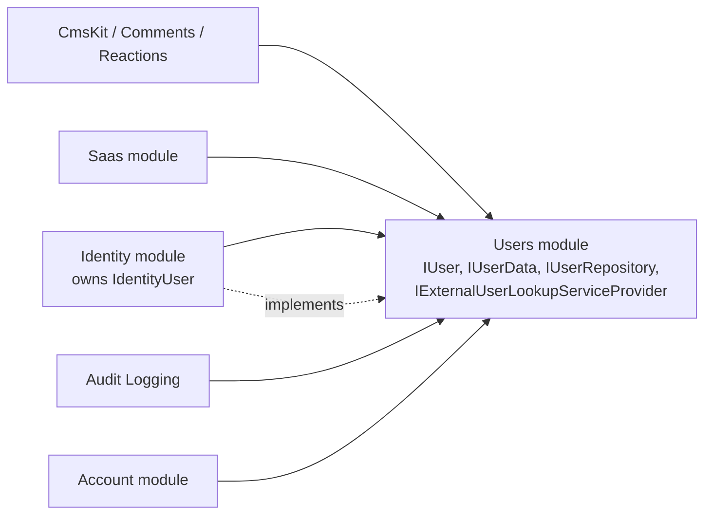
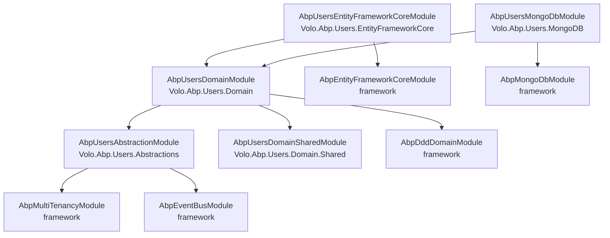
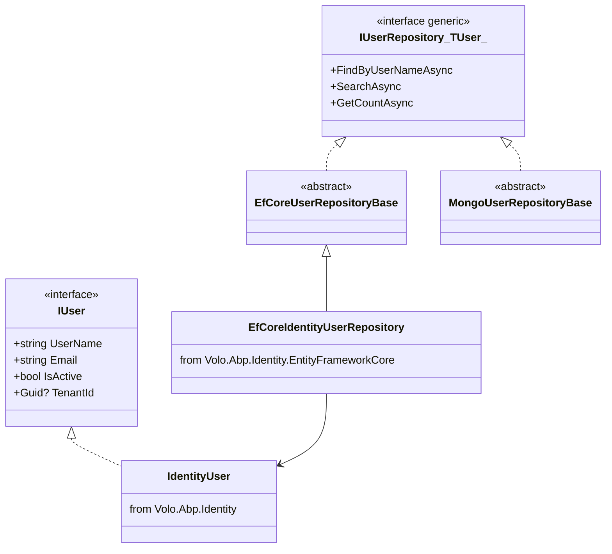
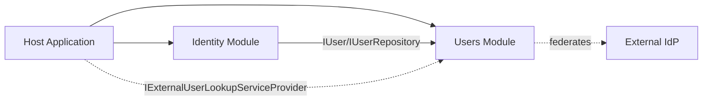

The Users module is one of the most quietly important pieces in the ABP module ecosystem: it does not own any database table on its own, yet most other modules — Identity, Account, IdentityServer, OpenIddict, the commercial CMS Kit, SaaS — depend on it. It publishes the *user abstractions* every module needs to read or "shadow‑store" users without taking a hard dependency on a concrete user aggregate. This page walks the package tree under `modules/users/src/`, the `[DependsOn]` graph, and the rationale behind every layer in the stack.

<Info>
Source root: [`modules/users/src/`](https://github.com/abpframework/abp/tree/dev/modules/users/src). Paths below are relative to that root.
</Info>

## Why the Users module exists

ABP's framework already gives you `ICurrentUser` — a request‑scoped abstraction over claims. That's enough to read the *active* user inside an application service. It is **not** enough for modules that need to:

- Persist a "shadow" user (link‑user, audit references, file owners, etc.) without owning the canonical user record.
- Look up users by id or username from a different bounded context.
- Federate user data from an external Identity Provider into a local table.
- Subscribe to user lifecycle events (created, updated, deleted, password‑change‑requested) across module boundaries.

If every module defined its own `IUser` contract, the ecosystem would either devolve into a tangled web of `Identity → CmsKit → Identity` cycles, or each module would carry a full copy of the user aggregate. The Users module breaks that cycle by publishing the contracts in a tiny, *dependency‑free* package that other modules can adopt without dragging Identity in.



<Note>
The Users module *does not* implement `IUser`. Identity does — `Volo.Abp.Identity.IdentityUser : IUser`. The Users module just makes the contract reusable.
</Note>

## Package matrix

| Package | Project folder | Layer | Primary purpose |
| --- | --- | --- | --- |
| `Volo.Abp.Users.Abstractions` | `Volo.Abp.Users.Abstractions/` | Abstractions | `IUserData`, `UserData`, `UserEto`, `IExternalUserLookupServiceProvider`, `UserPasswordChangeRequestedEto` |
| `Volo.Abp.Users.Domain.Shared` | `Volo.Abp.Users.Domain.Shared/` | Domain.Shared | `AbpUserConsts` length limits |
| `Volo.Abp.Users.Domain` | `Volo.Abp.Users.Domain/` | Domain | `IUser`, `IUserRepository<TUser>`, `IUserLookupService<TUser>`, `UserLookupService<,>`, `IUpdateUserData` |
| `Volo.Abp.Users.EntityFrameworkCore` | `Volo.Abp.Users.EntityFrameworkCore/` | Persistence (EF Core) | `ConfigureAbpUser<TUser>` model builder extension, `EfCoreUserRepositoryBase<,>` |
| `Volo.Abp.Users.MongoDB` | `Volo.Abp.Users.MongoDB/` | Persistence (Mongo) | `MongoUserRepositoryBase<,>` |
| `Volo.Abp.Users.Installer` | `Volo.Abp.Users.Installer/` | Tooling | NuGet meta‑package consumed by the ABP CLI |

There are no Application / HttpApi / UI packages here. The Users module is contract‑only; Identity and Account add behaviour and screens.

## Source tree

```
modules/users/src/
├── Volo.Abp.Users.Abstractions/
│   └── Volo/Abp/Users/
│       ├── AbpUsersAbstractionModule.cs
│       ├── IUserData.cs
│       ├── UserData.cs
│       ├── UserEto.cs
│       ├── UserPasswordChangeRequestedEto.cs
│       └── IExternalUserLookupServiceProvider.cs
├── Volo.Abp.Users.Domain.Shared/
│   └── Volo/Abp/Users/
│       ├── AbpUserConsts.cs
│       └── AbpUsersDomainSharedModule.cs
├── Volo.Abp.Users.Domain/
│   └── Volo/Abp/Users/
│       ├── AbpUsersDomainModule.cs
│       ├── IUser.cs
│       ├── IUserRepository.cs
│       ├── IUserLookupService.cs
│       ├── UserLookupService.cs
│       ├── UserLookupServiceExtensions.cs
│       ├── IUpdateUserData.cs
│       └── AbpUserExtensions.cs
├── Volo.Abp.Users.EntityFrameworkCore/
│   └── Volo/Abp/Users/EntityFrameworkCore/
│       ├── AbpUsersDbContextModelCreatingExtensions.cs
│       ├── AbpUsersEntityFrameworkCoreModule.cs
│       └── EfCoreAbpUserRepositoryBase.cs
├── Volo.Abp.Users.MongoDB/
│   └── Volo/Abp/Users/MongoDB/
│       ├── AbpUsersMongoDbModule.cs
│       └── MongoUserRepositoryBase.cs
└── Volo.Abp.Users.Installer/
    └── Volo/Abp/Users/AbpUsersInstallerModule.cs
```

## Module dependency graph

The graph is shallow on purpose — anything more would defeat the abstraction:



Real source:

```csharp title="Volo.Abp.Users.Abstractions/Volo/Abp/Users/AbpUsersAbstractionModule.cs"
//TODO: Consider to (somehow) move this to the framework to the same assemblily of ICurrentUser!

[DependsOn(
    typeof(AbpMultiTenancyModule),
    typeof(AbpEventBusModule)
    )]
public class AbpUsersAbstractionModule : AbpModule { }
```

```csharp title="Volo.Abp.Users.Domain/Volo/Abp/Users/AbpUsersDomainModule.cs"
[DependsOn(
    typeof(AbpUsersDomainSharedModule),
    typeof(AbpUsersAbstractionModule),
    typeof(AbpDddDomainModule)
    )]
public class AbpUsersDomainModule : AbpModule { }
```

<Note>
The framework's `ICurrentUser` lives in `Volo.Abp.Security` for historical reasons. The Users.Abstractions comment hints at a possible future where `IUser*` joins it. As of today, Users is the canonical place for these contracts.
</Note>

## What lives where: the three roles

### 1. Cross‑module data carrier — `Abstractions`

`IUserData` is the cross‑module read‑only DTO. It carries only the fields that other modules legitimately need to render a user reference (display name, email, active flag, multi‑tenant key). No password, no claims, no roles.

```csharp title="Volo.Abp.Users.Abstractions/Volo/Abp/Users/IUserData.cs"
public interface IUserData : IHasExtraProperties
{
    Guid Id { get; }
    Guid? TenantId { get; }
    string UserName { get; }
    string Name { get; }
    string Surname { get; }
    bool IsActive { get; }

    [CanBeNull] string Email { get; }
    bool EmailConfirmed { get; }

    [CanBeNull] string PhoneNumber { get; }
    bool PhoneNumberConfirmed { get; }
}
```

`UserEto` extends this with `[EventName("Volo.Abp.Users.User")]`, so distributed event subscribers can react to user lifecycle changes without ever loading the Identity assembly:

```csharp title="Volo.Abp.Users.Abstractions/Volo/Abp/Users/UserEto.cs"
[EventName("Volo.Abp.Users.User")]
public class UserEto : IUserData, IMultiTenant { /* same fields */ }
```

### 2. Federation hook — `IExternalUserLookupServiceProvider`

When ABP integrates with an external Identity Provider (an IdentityServer or OpenIddict in front of a separate user store), the local module still wants `FindByIdAsync` and `SearchAsync` to work. `IExternalUserLookupServiceProvider` is the seam:

```csharp title="Volo.Abp.Users.Abstractions/Volo/Abp/Users/IExternalUserLookupServiceProvider.cs"
public interface IExternalUserLookupServiceProvider
{
    Task<IUserData> FindByIdAsync(Guid id, CancellationToken cancellationToken = default);
    Task<IUserData> FindByUserNameAsync(string userName, CancellationToken cancellationToken = default);

    Task<List<IUserData>> SearchAsync(
        string sorting = null,
        string filter = null,
        int maxResultCount = int.MaxValue,
        int skipCount = 0,
        CancellationToken cancellationToken = default);

    Task<long> GetCountAsync(string filter = null, CancellationToken cancellationToken = default);
}
```

If a host registers an implementation (typically the Identity module wires one against an external IdP), the Domain layer's `UserLookupService<TUser, TUserRepository>` automatically falls through to it whenever a local user record is missing — and *synchronises* the local table on success. See [`/modules/users/abstractions-and-domain`](/modules/users/abstractions-and-domain).

### 3. Generic persistence — `Domain` and `EntityFrameworkCore` / `MongoDB`

`IUser` is the aggregate **contract** consumers must satisfy. It's intentionally narrow:

```csharp title="Volo.Abp.Users.Domain/Volo/Abp/Users/IUser.cs"
public interface IUser : IAggregateRoot<Guid>, IMultiTenant, IHasExtraProperties
{
    string UserName { get; }
    [CanBeNull] string Email { get; }
    [CanBeNull] string Name { get; }
    [CanBeNull] string Surname { get; }
    bool IsActive { get; }
    bool EmailConfirmed { get; }
    [CanBeNull] string PhoneNumber { get; }
    bool PhoneNumberConfirmed { get; }
}
```

The repository contract is generic in `TUser`:

```csharp title="Volo.Abp.Users.Domain/Volo/Abp/Users/IUserRepository.cs"
public interface IUserRepository<TUser> : IBasicRepository<TUser, Guid>
    where TUser : class, IUser, IAggregateRoot<Guid>
{
    Task<TUser> FindByUserNameAsync(string userName, CancellationToken cancellationToken = default);
    Task<List<TUser>> GetListAsync(IEnumerable<Guid> ids, CancellationToken cancellationToken = default);
    Task<List<TUser>> SearchAsync(/* sorting, paging, filter */);
    Task<long> GetCountAsync(string filter = null, CancellationToken cancellationToken = default);
}
```

And `EfCoreUserRepositoryBase<TDbContext, TUser>` / `MongoUserRepositoryBase<TDbContext, TUser>` provide turn‑key implementations. Identity's `EfCoreIdentityUserRepository` derives from the first, and `MongoIdentityUserRepository` from the second.



## Length limits

```csharp title="Volo.Abp.Users.Domain.Shared/Volo/Abp/Users/AbpUserConsts.cs"
public static int MaxUserNameLength { get; set; } = 256;
public static int MaxNameLength { get; set; } = 64;
public static int MaxSurnameLength { get; set; } = 64;
public static int MaxEmailLength { get; set; } = 256;
public static int MaxPhoneNumberLength { get; set; } = 16;
```

Both EF Core (`ConfigureAbpUser<TUser>`) and any Mongo schema validator read these statics, so raising one in `Program.cs` propagates to every consumer.

## Typical consumer wiring

A consuming module (Identity is the canonical example) does three things:

1. Declares an aggregate that implements `IUser`.
2. Calls `b.ConfigureAbpUser<TUser>()` from its EF model builder so the standard columns get mapped.
3. Implements `IUserRepository<TUser>` by inheriting from `EfCoreUserRepositoryBase<TDbContext, TUser>` (or its Mongo sibling).

If the host also exposes an external IdP, it registers an `IExternalUserLookupServiceProvider` and the consuming module's `UserLookupService` automatically threads federation through.



## Where to next

<CardGroup cols={3}>
<Card title="Abstractions & Domain" icon="cube" href="/modules/users/abstractions-and-domain">
The actual contracts — `IUserData`, `IUser`, `IUserRepository`, `UserLookupService`, federation flow.
</Card>
<Card title="Persistence" icon="database" href="/modules/users/persistence">
`ConfigureAbpUser<TUser>` and the `EfCoreUserRepositoryBase` / `MongoUserRepositoryBase` generics.
</Card>
<Card title="Identity module" icon="user" href="/modules/identity">
The reference implementation of every `IUser*` contract on this page.
</Card>
</CardGroup>

## Related reading

- [`/modules/identity`](/modules/identity) — Identity is the primary implementer; reading its overview alongside this one shows how the contracts fit.
- [`/auditing/overview`](/auditing/overview) — Audit Logging stores `UserId` and `UserName` from these abstractions.
- [`/background/jobs-overview`](/background/jobs-overview) — sibling persistence layout with the same EF/Mongo split.
