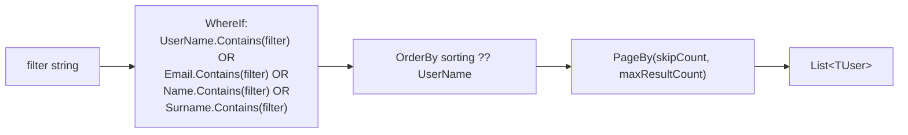
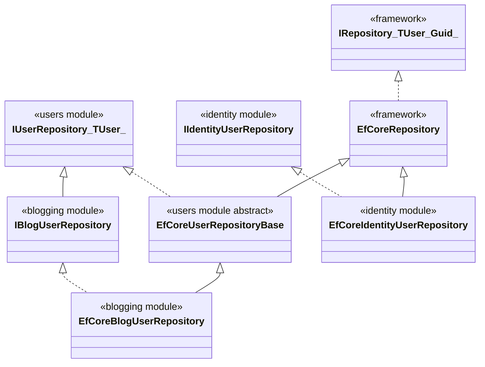

The Users module has no schema of its own — it ships *building blocks* that other modules' aggregates compose. The EF Core package contributes one model‑builder extension (`ConfigureAbpUser<TUser>`) plus an abstract repository base class; the MongoDB package contributes a sibling abstract repository. Identity, the Account module, and any commercial extension that defines its own user aggregate plugs into these generics so every user record shares the same column names, length limits, search/page semantics, and unique‑username semantics. This page walks both packages with the real signatures.

<Info>
Projects: [`modules/users/src/Volo.Abp.Users.EntityFrameworkCore/`](https://github.com/abpframework/abp/tree/dev/modules/users/src/Volo.Abp.Users.EntityFrameworkCore) and [`modules/users/src/Volo.Abp.Users.MongoDB/`](https://github.com/abpframework/abp/tree/dev/modules/users/src/Volo.Abp.Users.MongoDB).
</Info>

## File inventory

| File | Role |
| --- | --- |
| `Volo.Abp.Users.EntityFrameworkCore/EntityFrameworkCore/AbpUsersDbContextModelCreatingExtensions.cs` | `ConfigureAbpUser<TUser>(this EntityTypeBuilder<TUser>)` |
| `Volo.Abp.Users.EntityFrameworkCore/EntityFrameworkCore/EfCoreAbpUserRepositoryBase.cs` | `EfCoreUserRepositoryBase<TDbContext, TUser>` abstract base |
| `Volo.Abp.Users.EntityFrameworkCore/EntityFrameworkCore/AbpUsersEntityFrameworkCoreModule.cs` | DI module wiring |
| `Volo.Abp.Users.MongoDB/MongoDB/MongoUserRepositoryBase.cs` | `MongoUserRepositoryBase<TDbContext, TUser>` abstract base |
| `Volo.Abp.Users.MongoDB/MongoDB/AbpUsersMongoDbModule.cs` | DI module wiring |

There are no DbContext types in either project. The user table belongs to the *consuming module* (Identity owns the `AbpUsers` table, etc.) — the Users module just hands consumers the pieces.

## EF Core: `ConfigureAbpUser<TUser>`

This is the *only* function the EF package contributes. A consuming module calls it from inside its own `EntityTypeBuilder<TUser>` block to map the eight `IUser` columns consistently.

```csharp title="Volo.Abp.Users.EntityFrameworkCore/Volo/Abp/Users/EntityFrameworkCore/AbpUsersDbContextModelCreatingExtensions.cs"
public static class AbpUsersDbContextModelCreatingExtensions
{
    public static void ConfigureAbpUser<TUser>(this EntityTypeBuilder<TUser> b)
        where TUser : class, IUser
    {
        b.Property(u => u.TenantId).HasColumnName(nameof(IUser.TenantId));
        b.Property(u => u.UserName).IsRequired().HasMaxLength(AbpUserConsts.MaxUserNameLength).HasColumnName(nameof(IUser.UserName));
        b.Property(u => u.Email).IsRequired().HasMaxLength(AbpUserConsts.MaxEmailLength).HasColumnName(nameof(IUser.Email));
        b.Property(u => u.Name).HasMaxLength(AbpUserConsts.MaxNameLength).HasColumnName(nameof(IUser.Name));
        b.Property(u => u.Surname).HasMaxLength(AbpUserConsts.MaxSurnameLength).HasColumnName(nameof(IUser.Surname));
        b.Property(u => u.EmailConfirmed).HasDefaultValue(false).HasColumnName(nameof(IUser.EmailConfirmed));
        b.Property(u => u.PhoneNumber).HasMaxLength(AbpUserConsts.MaxPhoneNumberLength).HasColumnName(nameof(IUser.PhoneNumber));
        b.Property(u => u.PhoneNumberConfirmed).HasDefaultValue(false).HasColumnName(nameof(IUser.PhoneNumberConfirmed));
        b.Property(u => u.IsActive).HasColumnName(nameof(IUser.IsActive));
    }
}
```

### What it maps

| Column | Type / size | Constraint |
| --- | --- | --- |
| `TenantId` | `Guid?` | — |
| `UserName` | `nvarchar(256)` | Required (`AbpUserConsts.MaxUserNameLength`) |
| `Email` | `nvarchar(256)` | Required (`AbpUserConsts.MaxEmailLength`) |
| `Name` | `nvarchar(64)` | — |
| `Surname` | `nvarchar(64)` | — |
| `EmailConfirmed` | `bit` | Default `false` |
| `PhoneNumber` | `nvarchar(16)` | — |
| `PhoneNumberConfirmed` | `bit` | Default `false` |
| `IsActive` | `bit` | — |

What it *doesn't* map:

- `Id` — left to `ConfigureByConvention` in the consuming model.
- Indices — the consuming module owns its uniqueness story (Identity declares the multi‑tenant unique `(NormalizedUserName, TenantId)` index next to this call).
- Navigation collections (roles, claims, logins) — those are Identity‑specific.

### How a consumer uses it

The Identity module's `EfCoreIdentityDbContextModelCreatingExtensions` calls it like this (paraphrased to show shape):

```csharp
builder.Entity<IdentityUser>(b =>
{
    b.ToTable(AbpIdentityDbProperties.DbTablePrefix + "Users", AbpIdentityDbProperties.DbSchema);
    b.ConfigureByConvention();
    b.ConfigureAbpUser();   // ← contributes the IUser columns

    // Identity-specific extras
    b.HasMany(u => u.Roles).WithOne().HasForeignKey(ur => ur.UserId).IsRequired();
    // …unique indices, claims, logins, etc.
});
```

<Note>
The Users module never calls `ToTable`. The consuming module owns the table name and schema prefix — Identity uses `AbpUsers`, but a custom aggregate is free to map onto any other name.
</Note>

## EF Core module wiring

```csharp title="Volo.Abp.Users.EntityFrameworkCore/Volo/Abp/Users/EntityFrameworkCore/AbpUsersEntityFrameworkCoreModule.cs"
[DependsOn(
    typeof(AbpUsersDomainModule),
    typeof(AbpEntityFrameworkCoreModule)
    )]
public class AbpUsersEntityFrameworkCoreModule : AbpModule { }
```

No DI registrations — the abstract repository base is consumed via inheritance, not service registration. Identity's own `AbpIdentityEntityFrameworkCoreModule` registers the concrete repository when it sees the `IdentityUser` DbSet.

## `EfCoreUserRepositoryBase<TDbContext, TUser>`

The abstract base implements every method declared by `IUserRepository<TUser>` against `EfCoreRepository<,,>`. Subclasses inherit and (optionally) override.

```csharp title="Volo.Abp.Users.EntityFrameworkCore/Volo/Abp/Users/EntityFrameworkCore/EfCoreAbpUserRepositoryBase.cs"
public abstract class EfCoreUserRepositoryBase<TDbContext, TUser>
    : EfCoreRepository<TDbContext, TUser, Guid>, IUserRepository<TUser>
    where TDbContext : IEfCoreDbContext
    where TUser : class, IUser
{
    protected EfCoreUserRepositoryBase(IDbContextProvider<TDbContext> dbContextProvider)
        : base(dbContextProvider) { }

    public async Task<TUser> FindByUserNameAsync(string userName, CancellationToken cancellationToken = default)
    {
        return await (await GetDbSetAsync())
            .OrderBy(x => x.Id)
            .FirstOrDefaultAsync(u => u.UserName == userName, GetCancellationToken(cancellationToken));
    }

    public virtual async Task<List<TUser>> GetListAsync(IEnumerable<Guid> ids, CancellationToken cancellationToken = default)
    {
        return await (await GetDbSetAsync())
            .Where(u => ids.Contains(u.Id))
            .ToListAsync(GetCancellationToken(cancellationToken));
    }

    public async Task<List<TUser>> SearchAsync(
        string sorting = null,
        int maxResultCount = int.MaxValue,
        int skipCount = 0,
        string filter = null,
        CancellationToken cancellationToken = default)
    {
        return await (await GetDbSetAsync())
            .WhereIf(
                !filter.IsNullOrWhiteSpace(),
                u =>
                    u.UserName.Contains(filter) ||
                    (u.Email != null && u.Email.Contains(filter)) ||
                    (u.Name != null && u.Name.Contains(filter)) ||
                    (u.Surname != null && u.Surname.Contains(filter))
            )
            .OrderBy(sorting.IsNullOrEmpty() ? nameof(IUser.UserName) : sorting)
            .PageBy(skipCount, maxResultCount)
            .ToListAsync(GetCancellationToken(cancellationToken));
    }

    public async Task<long> GetCountAsync(string filter = null, CancellationToken cancellationToken = default)
    {
        return await (await GetDbSetAsync())
            .WhereIf(
                !filter.IsNullOrWhiteSpace(),
                u =>
                    u.UserName.Contains(filter) ||
                    (u.Email != null && u.Email.Contains(filter)) ||
                    (u.Name != null && u.Name.Contains(filter)) ||
                    (u.Surname != null && u.Surname.Contains(filter))
            )
            .LongCountAsync(GetCancellationToken(cancellationToken));
    }
}
```

### Semantics worth knowing

- **`FindByUserNameAsync` is case‑sensitive at this layer.** The string is compared with `==`, so collation rules decide case sensitivity. Identity adds a separate `NormalizedUserName` column and overrides this method to query that column instead, which is why case‑insensitive logins work in practice.
- **`FindByUserNameAsync` uses `OrderBy(x => x.Id).FirstOrDefaultAsync`.** If two rows somehow share a username (a bug, or before a unique index is enforced), the lowest‑Id row wins deterministically.
- **`SearchAsync` filters across four fields.** `UserName`, `Email`, `Name`, `Surname` — a single `filter` term hits all of them with `Contains`. That's what powers the admin user list search box.
- **`SearchAsync` defaults to `UserName ASC`.** Pass an explicit `sorting` if you want anything else; Dynamic LINQ syntax (`"Email DESC, UserName ASC"`) works.



## MongoDB: `MongoUserRepositoryBase<TDbContext, TUser>`

The Mongo sibling has the exact same shape, expressed in `IMongoQueryable<TUser>`:

```csharp title="Volo.Abp.Users.MongoDB/Volo/Abp/Users/MongoDB/MongoUserRepositoryBase.cs"
public abstract class MongoUserRepositoryBase<TDbContext, TUser>
    : MongoDbRepository<TDbContext, TUser, Guid>, IUserRepository<TUser>
    where TDbContext : IAbpMongoDbContext
    where TUser : class, IUser
{
    public virtual async Task<TUser> FindByUserNameAsync(string userName, CancellationToken cancellationToken = default)
    {
        cancellationToken = GetCancellationToken(cancellationToken);
        return await (await GetMongoQueryableAsync(cancellationToken))
            .OrderBy(x => x.Id)
            .FirstOrDefaultAsync(u => u.UserName == userName, cancellationToken);
    }

    public virtual async Task<List<TUser>> GetListAsync(IEnumerable<Guid> ids, CancellationToken cancellationToken = default)
    {
        cancellationToken = GetCancellationToken(cancellationToken);
        return await (await GetMongoQueryableAsync(cancellationToken))
            .Where(u => ids.Contains(u.Id))
            .ToListAsync(cancellationToken);
    }

    public async Task<List<TUser>> SearchAsync(
        string sorting = null,
        int maxResultCount = int.MaxValue,
        int skipCount = 0,
        string filter = null,
        CancellationToken cancellationToken = default)
    {
        cancellationToken = GetCancellationToken(cancellationToken);
        return await (await GetMongoQueryableAsync(cancellationToken))
            .WhereIf<TUser, IMongoQueryable<TUser>>(
                !filter.IsNullOrWhiteSpace(),
                u =>
                    u.UserName.Contains(filter) ||
                    (u.Email != null && u.Email.Contains(filter)) ||
                    (u.Name != null && u.Name.Contains(filter)) ||
                    (u.Surname != null && u.Surname.Contains(filter))
            )
            .OrderBy(sorting.IsNullOrEmpty() ? nameof(IUserData.UserName) : sorting)
            .As<IMongoQueryable<TUser>>()
            .PageBy<TUser, IMongoQueryable<TUser>>(skipCount, maxResultCount)
            .ToListAsync(cancellationToken);
    }

    public async Task<long> GetCountAsync(string filter = null, CancellationToken cancellationToken = default)
    {
        cancellationToken = GetCancellationToken(cancellationToken);
        return await (await GetMongoQueryableAsync(cancellationToken))
            .WhereIf<TUser, IMongoQueryable<TUser>>(
                !filter.IsNullOrWhiteSpace(),
                u =>
                    u.UserName.Contains(filter) ||
                    (u.Email != null && u.Email.Contains(filter)) ||
                    (u.Name != null && u.Name.Contains(filter)) ||
                    (u.Surname != null && u.Surname.Contains(filter))
            )
            .LongCountAsync(cancellationToken);
    }
}
```

The behavioural contract is byte‑for‑byte identical to the EF Core version. The only structural differences are the cancellation‑token threading and the generic dance around `IMongoQueryable<TUser>`.

## Mongo module wiring

```csharp title="Volo.Abp.Users.MongoDB/Volo/Abp/Users/MongoDB/AbpUsersMongoDbModule.cs"
[DependsOn(
    typeof(AbpUsersDomainModule),
    typeof(AbpMongoDbModule)
    )]
public class AbpUsersMongoDbModule : AbpModule { }
```

Again — no DI registrations. The Mongo base is inherited; the consuming module (Identity, etc.) registers the concrete.

## Who actually uses these bases

The Identity module is the most visible `IUser` implementer, but it does **not** inherit from `EfCoreUserRepositoryBase`. Identity needs joins onto `IdentityUserRole`, `IdentityUserClaim`, `IdentityUserLogin`, etc., so it derives directly from the framework's `EfCoreRepository<IIdentityDbContext, IdentityUser, Guid>` and exposes a fatter `IIdentityUserRepository : IBasicRepository<IdentityUser, Guid>` contract.

The OSS modules that *do* ride these generic bases are Blogging and CMS Kit, both of which keep a thin shadow of `IUser` for things like comment authorship:

```csharp title="modules/blogging/src/Volo.Blogging.EntityFrameworkCore/Volo/Blogging/Users/EfCoreBlogUserRepository.cs"
public class EfCoreBlogUserRepository
    : EfCoreUserRepositoryBase<IBloggingDbContext, BlogUser>, IBlogUserRepository
{
    // inherits FindByUserNameAsync, SearchAsync, GetCountAsync, GetListAsync(ids)
}
```

```csharp title="modules/cms-kit/src/Volo.CmsKit.EntityFrameworkCore/Volo/CmsKit/Users/EfCoreCmsUserRepository.cs"
public class EfCoreCmsUserRepository
    : EfCoreUserRepositoryBase<ICmsKitDbContext, CmsUser>, ICmsUserRepository
{
    // same — adds CmsUser-specific overloads only when needed
}
```

The Mongo siblings — `MongoBlogUserRepository` and `MongoCmsUserRepository` — derive from `MongoUserRepositoryBase<TDbContext, TUser>` with identical shape. That's the structural payoff: if Blogging swaps its persistence provider, the `IBlogUserRepository` consumers never notice.



<Note>
The Identity branch on the right intentionally skips `EfCoreUserRepositoryBase`. Identity reuses the `IUser` aggregate contract and the `ConfigureAbpUser<TUser>` mapping extension, but its repository surface is too rich to be expressed through `IUserRepository<TUser>`. That's the seam between the Users module (cross‑module abstractions) and the Identity module (full‑fat user management).
</Note>

## How to use it for a custom aggregate

If you're building a non‑Identity aggregate that satisfies `IUser` — say, a `LinkUser` for impersonation — the recipe is:

1. **Define the aggregate.**
   ```csharp
   public class LinkUser : AggregateRoot<Guid>, IUser
   {
       public Guid? TenantId { get; protected set; }
       public string UserName { get; protected set; }
       // …all IUser members…
   }
   ```
2. **Map it.**
   ```csharp
   builder.Entity<LinkUser>(b =>
   {
       b.ToTable("LinkUsers");
       b.ConfigureByConvention();
       b.ConfigureAbpUser();
   });
   ```
3. **Provide a repository.**
   ```csharp
   public class EfCoreLinkUserRepository
       : EfCoreUserRepositoryBase<MyDbContext, LinkUser>, ILinkUserRepository
   {
       public EfCoreLinkUserRepository(IDbContextProvider<MyDbContext> p) : base(p) { }
   }
   ```
4. **Register in the EF Core module.**
   ```csharp
   context.Services.AddAbpDbContext<MyDbContext>(opt =>
   {
       opt.AddRepository<LinkUser, EfCoreLinkUserRepository>();
   });
   ```

With those four steps your aggregate is `UserLookupService`‑capable, federation‑capable, and fits the cross‑module abstractions described in [`/modules/users/abstractions-and-domain`](/modules/users/abstractions-and-domain).

## What's *not* here

| Concern | Where it lives instead |
| --- | --- |
| `NormalizedUserName` / case‑insensitive uniqueness | Identity module |
| Password hashes & two‑factor | Identity module |
| Role and claim navigation collections | Identity module |
| Distributed event publishing for `UserEto` | Identity (via `IDistributedEventBus`) |
| `IExternalUserLookupServiceProvider` implementation | Host application or commercial federation modules |
| Migrations | Consuming module's migration project |

The Users persistence package stops at the field shape. Everything domain‑specific layers on top.

## Where to next

<CardGroup cols={3}>
<Card title="Abstractions & Domain" icon="cube" href="/modules/users/abstractions-and-domain">
The contracts these bases implement.
</Card>
<Card title="Overview" icon="map" href="/modules/users/overview">
Package matrix and dependency graph.
</Card>
<Card title="Identity module" icon="user" href="/modules/identity">
The reference consumer of every API on this page.
</Card>
</CardGroup>

## Related reading

- [`/modules/identity`](/modules/identity) — production consumer.
- [`/auditing/overview`](/auditing/overview) — Audit Logging stores user references using `IUserData`.
- [`/background/jobs-overview`](/background/jobs-overview) — sibling persistence layout, same EF/Mongo split.
- [`/modules/audit-logging/persistence`](/modules/audit-logging/persistence) — adjacent module with the same shape.
