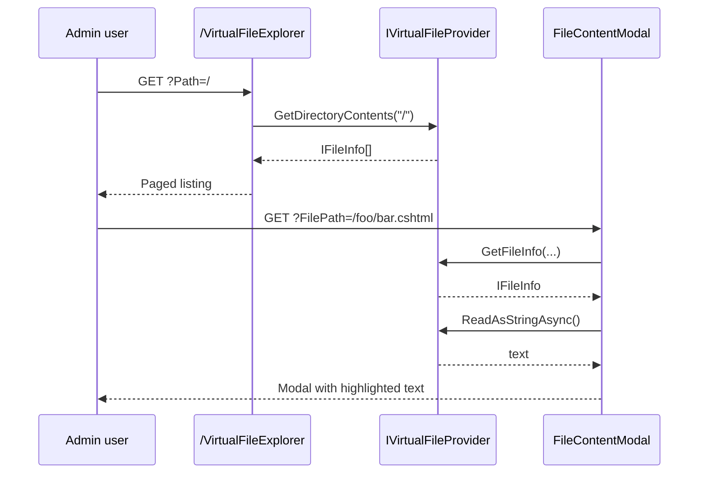

`Volo.Abp.VirtualFileExplorer.Web` is a tiny diagnostic module that
mounts a Razor Pages UI at `/VirtualFileExplorer` for browsing every
file currently registered in your application's `IVirtualFileProvider`.
It is the runtime answer to "is this `.cshtml`/`.json`/`.js` actually
embedded?" — particularly useful while building module overrides or
debugging missing assets.

<Info>
  For day-to-day usage, configuration, and screenshots, refer to the
  [virtual file explorer reference](/vfs/virtual-file-explorer-module).
  This page focuses on the module composition itself.
</Info>

## Packages

| Package | Purpose |
| --- | --- |
| `Volo.Abp.VirtualFileExplorer.Web` | The Razor Pages UI, menu contributor, options, consts |
| `Volo.Abp.VirtualFileExplorer.Installer` | CLI manifest |

Both live under
`modules/virtual-file-explorer/src/`.

## Module composition

`AbpVirtualFileExplorerWebModule` is gated on a single pre-configurable
option (`AbpVirtualFileExplorerOptions.IsEnabled`). When the option is
false, **nothing** is registered — the module silently no-ops, which
makes it safe to leave referenced in production while disabled.

```csharp Volo.Abp.VirtualFileExplorer.Web/AbpVirtualFileExplorerWebModule.cs
[DependsOn(typeof(AbpAspNetCoreMvcUiBootstrapModule))]
[DependsOn(typeof(AbpAspNetCoreMvcUiThemeSharedModule))]
public class AbpVirtualFileExplorerWebModule : AbpModule
{
    public override void PreConfigureServices(ServiceConfigurationContext context)
    {
        PreConfigure<IMvcBuilder>(mvcBuilder =>
        {
            mvcBuilder.AddApplicationPartIfNotExists(
                typeof(AbpVirtualFileExplorerWebModule).Assembly);
        });
    }

    public override void ConfigureServices(ServiceConfigurationContext context)
    {
        var virtualFileExplorerOptions =
            context.Services.ExecutePreConfiguredActions<AbpVirtualFileExplorerOptions>();

        if (virtualFileExplorerOptions.IsEnabled)
        {
            Configure<AbpNavigationOptions>(options =>
            {
                options.MenuContributors.Add(new VirtualFileExplorerMenuContributor());
            });

            Configure<AbpVirtualFileSystemOptions>(options =>
            {
                options.FileSets.AddEmbedded<AbpVirtualFileExplorerWebModule>(
                    "Volo.Abp.VirtualFileExplorer.Web");
            });

            Configure<AbpLocalizationOptions>(options =>
            {
                options.Resources
                    .Add<VirtualFileExplorerResource>("en")
                    .AddBaseTypes(typeof(AbpValidationResource))
                    .AddVirtualJson("/Localization/Resources");
            });

            Configure<AbpBundleContributorOptions>(options =>
            {
                options.Extensions<PrismjsStyleBundleContributor>()
                       .Add<PrismjsStyleBundleContributorDocsExtension>();
                options.Extensions<PrismjsScriptBundleContributor>()
                       .Add<PrismjsScriptBundleContributorDocsExtension>();
            });
        }
    }
}
```

The opt-in flag itself is a one-property record:

```csharp Volo.Abp.VirtualFileExplorer.Web/AbpVirtualFileExplorerOptions.cs
public class AbpVirtualFileExplorerOptions
{
    /// <summary>Default: true.</summary>
    public bool IsEnabled { get; set; } = true;
}
```

To disable from a host:

```csharp
PreConfigure<AbpVirtualFileExplorerOptions>(o => o.IsEnabled = false);
```

## Pages

| Path | Razor file | Purpose |
| --- | --- | --- |
| `/VirtualFileExplorer` | `Pages/VirtualFileExplorer/Index.cshtml` | List directory contents at `Path` |
| `/VirtualFileExplorer/FileContentModal` | `Pages/VirtualFileExplorer/FileContentModal.cshtml` | Modal view of a single file's text content |

### Index page

The index page reads a `Path` query parameter (defaulting to `"/"`),
asks `IVirtualFileProvider` for the directory contents, paginates them,
and renders a breadcrumb plus a table of files and folders:

```csharp Volo.Abp.VirtualFileExplorer.Web/Pages/VirtualFileExplorer/Index.cshtml.cs
public class IndexModel : VirtualFileExplorerPageModel
{
    [BindProperty(SupportsGet = true)] public string Path { get; set; } = "/";
    [BindProperty(SupportsGet = true)] public int CurrentPage { get; set; } = 1;
    [BindProperty(SupportsGet = true)] public int PageSize { get; set; } = 10;

    public List<FileInfoViewModel> FileInfoList { get; set; }
    public PagerModel PagerModel { get; set; }
    public string PathNavigation { get; set; }

    protected IVirtualFileProvider VirtualFileProvider { get; }

    public IndexModel(IVirtualFileProvider virtualFileProvider)
        => VirtualFileProvider = virtualFileProvider;

    public virtual IActionResult OnGet()
    {
        var query = VirtualFileProvider.GetDirectoryContents(Path)
            .Where(d => VirtualFileExplorerConsts.AllowFileInfoTypes
                                  .Contains(d.GetType().Name))
            .OrderByDescending(f => f.IsDirectory).ToList();

        PagerModel = new PagerModel(query.Count, PageSize, CurrentPage, PageSize,
            $"{Url.Content("~/")}VirtualFileExplorer?Path={Path}&PageSize={PageSize}");

        SetViewModel(query.Skip((CurrentPage - 1) * PageSize).Take(PageSize));
        SetPathNavigation();
        return Page();
    }
    // ...
}
```

`AllowFileInfoTypes` filters out file-info implementations the UI knows
how to render:

```csharp Volo.Abp.VirtualFileExplorer.Web/VirtualFileExplorerConsts.cs
public static class VirtualFileExplorerConsts
{
    public static readonly string[] AllowFileInfoTypes =
    {
        "VirtualDirectoryFileInfo",
        "EmbeddedResourceFileInfo",
        "ManifestDirectoryInfo",
        "ManifestFileInfo"
    };
}
```

These names mirror the concrete `IFileInfo` subclasses ABP uses:

* `VirtualDirectoryFileInfo` — a logical directory composed across many
  file sets.
* `EmbeddedResourceFileInfo` — a file embedded inside a module's
  assembly via `AddEmbedded<TModule>(...)`.
* `ManifestDirectoryInfo` / `ManifestFileInfo` — entries from
  `Microsoft.Extensions.FileProviders.Embedded` manifest resources.

The index controller is also defensive about output: folder rows render
their name as a clickable `<a>` deeper into the explorer, while file
rows render a stable virtual or physical path depending on the file
info type.

### File content modal

Clicking a file opens a modal page that loads the text content via
`IFileInfo.ReadAsStringAsync()`:

```csharp Volo.Abp.VirtualFileExplorer.Web/Pages/VirtualFileExplorer/FileContentModal.cshtml.cs
public class FileContentModal : PageModel
{
    [Required, BindProperty(SupportsGet = true)]
    public string FilePath { get; set; }

    public string Content { get; set; }

    protected IVirtualFileProvider VirtualFileProvider { get; }

    public FileContentModal(IVirtualFileProvider virtualFileProvider)
        => VirtualFileProvider = virtualFileProvider;

    public virtual async Task<IActionResult> OnGetAsync()
    {
        var fileInfo = VirtualFileProvider.GetFileInfo(FilePath);
        if (fileInfo == null || fileInfo.IsDirectory)
        {
            return NotFound();
        }
        Content = await fileInfo.ReadAsStringAsync();
        return Page();
    }
}
```

The modal renders the text inside a `<pre><code class="...">` block, and
the prism bundle extensions registered by the module ensure syntax
highlighting works for the language of the file. The extension classes
are named `PrismjsStyleBundleContributorDocsExtension` and
`PrismjsScriptBundleContributorDocsExtension` — the "Docs" in the names
is historical (they were borrowed from the Volo.Docs reader) and does
not imply any docs-module dependency.

## Menu contribution

```csharp Volo.Abp.VirtualFileExplorer.Web/Navigation/VirtualFileExplorerMenuContributor.cs
public class VirtualFileExplorerMenuContributor : IMenuContributor
{
    public virtual Task ConfigureMenuAsync(MenuConfigurationContext context)
    {
        if (context.Menu.Name != StandardMenus.Main)
        {
            return Task.CompletedTask;
        }

        var l = context.GetLocalizer<VirtualFileExplorerResource>();
        context.Menu.Items.Add(new ApplicationMenuItem(
            VirtualFileExplorerMenuNames.Index,
            l["Menu:VirtualFileExplorer"],
            icon: "fa fa-file",
            url: "~/VirtualFileExplorer"));

        return Task.CompletedTask;
    }
}
```

The menu node is only added to the standard *Main* menu, so secondary
admin menus stay clean. The localized label comes from
`VirtualFileExplorerResource`.

## End-to-end browse flow



## See also

* [Virtual file explorer reference](/vfs/virtual-file-explorer-module) —
  hosting, security, and customisation guidance.
* [Basic theme](/themes/basic-theme-module) — the layout the explorer
  renders inside.
* [Volo.Docs overview](/modules/docs/overview) — the prism bundle
  extensions originally come from the docs reader pipeline.
* [CMS Kit module](/modules/cms-kit/overview) — another good demo for inspecting
  embedded assets with this explorer.
