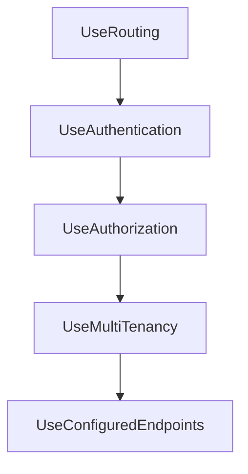
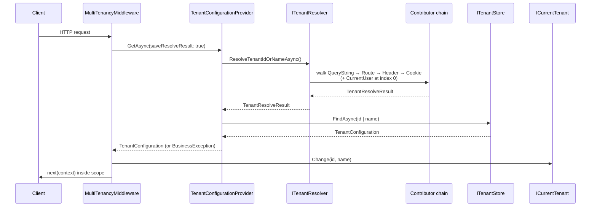

The core resolver pipeline documented on
[/multitenancy/tenant-resolvers](/multitenancy/tenant-resolvers) is transport-
agnostic: `ITenantResolver` walks a list of `ITenantResolveContributor` until
one of them claims the request. ASP.NET Core applications need contributors
that can read the *HTTP request* — its host name, its route values, its
headers, its query string, its cookies, its form body — and a middleware that
runs the chain at the right point in the pipeline and switches
`ICurrentTenant` for the duration of the request. Those concerns live in
`framework/src/Volo.Abp.AspNetCore.MultiTenancy/`. This page enumerates every
contributor class in that package, walks the shared base, and shows exactly
how `MultiTenancyMiddleware` consumes the resolved value.

## File inventory

| Path (relative to repo root) | Role |
| --- | --- |
| `framework/src/Volo.Abp.AspNetCore.MultiTenancy/Volo/Abp/AspNetCore/MultiTenancy/AbpAspNetCoreMultiTenancyModule.cs` | Module — wires the default contributor order |
| `framework/src/Volo.Abp.AspNetCore.MultiTenancy/Volo/Abp/AspNetCore/MultiTenancy/AbpAspNetCoreMultiTenancyOptions.cs` | `TenantKey` + error page builder |
| `framework/src/Volo.Abp.AspNetCore.MultiTenancy/Volo/Abp/AspNetCore/MultiTenancy/HttpTenantResolveContributorBase.cs` | Abstract base for every HTTP contributor |
| `framework/src/Volo.Abp.AspNetCore.MultiTenancy/Volo/Abp/AspNetCore/MultiTenancy/DomainTenantResolveContributor.cs` | Matches host name against a domain template |
| `framework/src/Volo.Abp.AspNetCore.MultiTenancy/Volo/Abp/AspNetCore/MultiTenancy/RouteTenantResolveContributor.cs` | Reads a route value (`__tenant` by default) |
| `framework/src/Volo.Abp.AspNetCore.MultiTenancy/Volo/Abp/AspNetCore/MultiTenancy/HeaderTenantResolveContributor.cs` | Reads an HTTP request header |
| `framework/src/Volo.Abp.AspNetCore.MultiTenancy/Volo/Abp/AspNetCore/MultiTenancy/QueryStringTenantResolveContributor.cs` | Reads `?__tenant=...` |
| `framework/src/Volo.Abp.AspNetCore.MultiTenancy/Volo/Abp/AspNetCore/MultiTenancy/CookieTenantResolveContributor.cs` | Reads the tenant cookie |
| `framework/src/Volo.Abp.AspNetCore.MultiTenancy/Volo/Abp/AspNetCore/MultiTenancy/FormTenantResolveContributor.cs` | Reads form values (obsolete) |
| `framework/src/Volo.Abp.AspNetCore.MultiTenancy/Volo/Abp/AspNetCore/MultiTenancy/MultiTenancyMiddleware.cs` | Resolves, validates, and switches `ICurrentTenant` |
| `framework/src/Volo.Abp.AspNetCore.MultiTenancy/Volo/Abp/AspNetCore/MultiTenancy/HttpContextTenantResolveResultAccessor.cs` | Stores the `TenantResolveResult` in `HttpContext.Items` |
| `framework/src/Volo.Abp.AspNetCore.MultiTenancy/Volo/Abp/AspNetCore/MultiTenancy/AbpMultiTenancyCookieHelper.cs` | Sets/deletes the `__tenant` cookie |
| `framework/src/Volo.Abp.AspNetCore.MultiTenancy/Volo/Abp/AspNetCore/MultiTenancy/TenantResolveContextExtensions.cs` | `GetAbpAspNetCoreMultiTenancyOptions()` helper |
| `framework/src/Volo.Abp.AspNetCore.MultiTenancy/Volo/Abp/MultiTenancy/AbpMultiTenancyOptionsExtensions.cs` | `AddDomainTenantResolver(...)` |
| `framework/src/Volo.Abp.AspNetCore.MultiTenancy/Microsoft/AspNetCore/Builder/AbpAspNetCoreMultiTenancyApplicationBuilderExtensions.cs` | `app.UseMultiTenancy()` |

## How the chain is assembled

The module registers four contributors in the exact order shown — the
`CurrentUserTenantResolveContributor` already lives at index `0` because the
core `AbpMultiTenancyModule` inserts it there:

```csharp framework/src/Volo.Abp.AspNetCore.MultiTenancy/Volo/Abp/AspNetCore/MultiTenancy/AbpAspNetCoreMultiTenancyModule.cs
[DependsOn(
    typeof(AbpMultiTenancyModule),
    typeof(AbpAspNetCoreModule)
    )]
public class AbpAspNetCoreMultiTenancyModule : AbpModule
{
    public override void ConfigureServices(ServiceConfigurationContext context)
    {
        Configure<AbpTenantResolveOptions>(options =>
        {
            options.TenantResolvers.Add(new QueryStringTenantResolveContributor());
            options.TenantResolvers.Add(new RouteTenantResolveContributor());
            options.TenantResolvers.Add(new HeaderTenantResolveContributor());
            options.TenantResolvers.Add(new CookieTenantResolveContributor());
        });
    }
}
```

After both modules initialise, the effective chain is:


`DomainTenantResolveContributor` and `FormTenantResolveContributor` are
**not** in the default list — they are opt-in (see below).

<Note>
`TenantResolver` stops at the first contributor whose `ITenantResolveContext`
reports `HasResolvedTenantOrHost() == true` (`Handled` set, or
`TenantIdOrName` populated). Earlier contributors win.
</Note>

## The HTTP base class

All HTTP contributors derive from `HttpTenantResolveContributorBase`, which
unwraps the `HttpContext` from the resolve context, catches exceptions, and
delegates to a template method:

```csharp framework/src/Volo.Abp.AspNetCore.MultiTenancy/Volo/Abp/AspNetCore/MultiTenancy/HttpTenantResolveContributorBase.cs
public abstract class HttpTenantResolveContributorBase : TenantResolveContributorBase
{
    public override async Task ResolveAsync(ITenantResolveContext context)
    {
        var httpContext = context.GetHttpContext();
        if (httpContext == null)
        {
            return;
        }

        try
        {
            await ResolveFromHttpContextAsync(context, httpContext);
        }
        catch (Exception e)
        {
            context.ServiceProvider
                .GetRequiredService<ILogger<HttpTenantResolveContributorBase>>()
                .LogWarning(e.ToString());
        }
    }

    protected virtual async Task ResolveFromHttpContextAsync(ITenantResolveContext context, HttpContext httpContext)
    {
        var tenantIdOrName = await GetTenantIdOrNameFromHttpContextOrNullAsync(context, httpContext);
        if (!tenantIdOrName.IsNullOrEmpty())
        {
            context.TenantIdOrName = tenantIdOrName;
        }
    }

    protected abstract Task<string?> GetTenantIdOrNameFromHttpContextOrNullAsync(
        [NotNull] ITenantResolveContext context,
        [NotNull] HttpContext httpContext);
}
```

Two things are worth highlighting:

- If `httpContext` is `null` — which happens inside a `BackgroundJobWorker` or
  any non-HTTP host that still shares the module graph — the contributor is a
  no-op. That is what makes the same `AbpTenantResolveOptions` list safe to
  share between Web API and a background worker.
- Setting `context.TenantIdOrName` does *not* by itself stop the chain. To
  short-circuit subsequent contributors, the concrete class must also set
  `context.Handled = true` (as `DomainTenantResolveContributor` does).

## The tenant key

Every HTTP contributor that needs a key reads it through
`TenantResolveContextExtensions`:

```csharp framework/src/Volo.Abp.AspNetCore.MultiTenancy/Volo/Abp/AspNetCore/MultiTenancy/TenantResolveContextExtensions.cs
public static class TenantResolveContextExtensions
{
    public static AbpAspNetCoreMultiTenancyOptions GetAbpAspNetCoreMultiTenancyOptions(this ITenantResolveContext context)
    {
        return context.ServiceProvider.GetRequiredService<IOptions<AbpAspNetCoreMultiTenancyOptions>>().Value;
    }
}
```

The key itself defaults to `__tenant`:

```csharp framework/src/Volo.Abp.AspNetCore.MultiTenancy/Volo/Abp/AspNetCore/MultiTenancy/AbpAspNetCoreMultiTenancyOptions.cs (excerpt)
public class AbpAspNetCoreMultiTenancyOptions
{
    public string TenantKey { get; set; }

    public Func<HttpContext, Exception, Task<bool>> MultiTenancyMiddlewareErrorPageBuilder { get; set; }

    public AbpAspNetCoreMultiTenancyOptions()
    {
        TenantKey = TenantResolverConsts.DefaultTenantKey; // "__tenant"
        // ...
    }
}
```

Override it once in your module to change the query parameter name, the
header name, the route token and the cookie name in one shot:

```csharp
Configure<AbpAspNetCoreMultiTenancyOptions>(options =>
{
    options.TenantKey = "X-Tenant";
});
```

## Contributors, one by one

### `QueryStringTenantResolveContributor`

First in the chain. Useful for explicit links (`/login?__tenant=acme`) and the
tenant-switch redirect the middleware uses to persist a chosen tenant into a
cookie:

```csharp framework/src/Volo.Abp.AspNetCore.MultiTenancy/Volo/Abp/AspNetCore/MultiTenancy/QueryStringTenantResolveContributor.cs (excerpt)
public class QueryStringTenantResolveContributor : HttpTenantResolveContributorBase
{
    public const string ContributorName = "QueryString";

    public override string Name => ContributorName;

    protected override Task<string?> GetTenantIdOrNameFromHttpContextOrNullAsync(
        ITenantResolveContext context, HttpContext httpContext)
    {
        if (httpContext.Request.QueryString.HasValue)
        {
            var tenantKey = context.GetAbpAspNetCoreMultiTenancyOptions().TenantKey;
            if (httpContext.Request.Query.ContainsKey(tenantKey))
            {
                var tenantValue = httpContext.Request.Query[tenantKey].ToString();
                if (tenantValue.IsNullOrWhiteSpace())
                {
                    context.Handled = true;
                    return Task.FromResult<string?>(null);
                }

                return Task.FromResult(tenantValue)!;
            }
        }

        return Task.FromResult<string?>(null);
    }
}
```

The empty-but-present case (`?__tenant=`) marks the request as resolved *to
host* — `Handled = true` with `TenantIdOrName = null` — which is how a user
explicitly switches *out* of a tenant.

### `RouteTenantResolveContributor`

```csharp framework/src/Volo.Abp.AspNetCore.MultiTenancy/Volo/Abp/AspNetCore/MultiTenancy/RouteTenantResolveContributor.cs
public class RouteTenantResolveContributor : HttpTenantResolveContributorBase
{
    public const string ContributorName = "Route";

    public override string Name => ContributorName;

    protected override Task<string?> GetTenantIdOrNameFromHttpContextOrNullAsync(
        ITenantResolveContext context, HttpContext httpContext)
    {
        var tenantId = httpContext.GetRouteValue(context.GetAbpAspNetCoreMultiTenancyOptions().TenantKey);
        return Task.FromResult(tenantId != null ? Convert.ToString(tenantId) : null);
    }
}
```

Use it when you expose tenant-scoped controllers under a path segment, e.g.:

```csharp
endpoints.MapControllerRoute(
    name: "tenant",
    pattern: "{__tenant}/{controller}/{action}");
```

`GetRouteValue` reads from the matched endpoint's route values, so the
contributor only fires *after* routing — which is exactly what
`UseMultiTenancy()` placement ensures (see below).

### `HeaderTenantResolveContributor`

Standard for SPAs and service-to-service calls — pass `__tenant: <id>` in the
request headers. The contributor reads
`httpContext.Request.Headers[tenantIdKey]` and, when the same header appears
multiple times (typically an upstream proxy misconfiguration), logs a warning
and uses the first value via
`tenantIdHeader.First()`. Source:
`HeaderTenantResolveContributor.cs` in
`framework/src/Volo.Abp.AspNetCore.MultiTenancy/Volo/Abp/AspNetCore/MultiTenancy/`.

### `CookieTenantResolveContributor`

```csharp framework/src/Volo.Abp.AspNetCore.MultiTenancy/Volo/Abp/AspNetCore/MultiTenancy/CookieTenantResolveContributor.cs
public class CookieTenantResolveContributor : HttpTenantResolveContributorBase
{
    public const string ContributorName = "Cookie";

    public override string Name => ContributorName;

    protected override Task<string?> GetTenantIdOrNameFromHttpContextOrNullAsync(
        ITenantResolveContext context, HttpContext httpContext)
    {
        return Task.FromResult(httpContext.Request.Cookies[
            context.GetAbpAspNetCoreMultiTenancyOptions().TenantKey]);
    }
}
```

This is the "remember my selection" leg of the chain. The cookie is written
by `AbpMultiTenancyCookieHelper.SetTenantCookie` — usually after the
query-string contributor sees a `?__tenant=...` and the middleware decides to
persist that selection.

### `DomainTenantResolveContributor` (opt-in)

```csharp framework/src/Volo.Abp.AspNetCore.MultiTenancy/Volo/Abp/AspNetCore/MultiTenancy/DomainTenantResolveContributor.cs
public class DomainTenantResolveContributor : HttpTenantResolveContributorBase
{
    public const string ContributorName = "Domain";

    public override string Name => ContributorName;

    private static readonly string[] ProtocolPrefixes = { "http://", "https://" };

    private readonly string _domainFormat;

    public DomainTenantResolveContributor(string domainFormat)
    {
        _domainFormat = domainFormat.RemovePreFix(ProtocolPrefixes);
    }

    protected override Task<string?> GetTenantIdOrNameFromHttpContextOrNullAsync(
        ITenantResolveContext context, HttpContext httpContext)
    {
        if (!httpContext.Request.Host.HasValue)
        {
            return Task.FromResult<string?>(null);
        }

        var hostName = httpContext.Request.Host.Value.RemovePreFix(ProtocolPrefixes);
        var extractResult = FormattedStringValueExtracter.Extract(
            hostName, _domainFormat, ignoreCase: true);

        context.Handled = true;

        return Task.FromResult(extractResult.IsMatch ? extractResult.Matches[0].Value : null);
    }
}
```

The constructor takes a *domain template* like `{0}.myapp.com`; the static
`FormattedStringValueExtracter` extracts the value of `{0}` from
`Request.Host`. The contributor always sets `context.Handled = true`, which
means: **once domain resolution runs, the chain stops** — even if no tenant
matched. That is the right behaviour for subdomain-per-tenant deployments,
where requests that *don't* match the template are host-side requests.

Domain resolution is not in the default list. Register it with the extension
helper, which inserts it after `CurrentUserTenantResolveContributor` so an
authenticated user's claim still wins:

```csharp framework/src/Volo.Abp.AspNetCore.MultiTenancy/Volo/Abp/MultiTenancy/AbpMultiTenancyOptionsExtensions.cs
public static class AbpMultiTenancyOptionsExtensions
{
    public static void AddDomainTenantResolver(this AbpTenantResolveOptions options, string domainFormat)
    {
        options.TenantResolvers.InsertAfter(
            r => r is CurrentUserTenantResolveContributor,
            new DomainTenantResolveContributor(domainFormat)
        );
    }
}
```

Typical usage:

```csharp
Configure<AbpTenantResolveOptions>(options =>
{
    options.AddDomainTenantResolver("{0}.myapp.com");
});
```

### `FormTenantResolveContributor` (obsolete)

```csharp framework/src/Volo.Abp.AspNetCore.MultiTenancy/Volo/Abp/AspNetCore/MultiTenancy/FormTenantResolveContributor.cs
[Obsolete("This may make some features of ASP NET Core unavailable, " +
          "Will be removed in future versions.")]
public class FormTenantResolveContributor : HttpTenantResolveContributorBase
{
    public const string ContributorName = "Form";

    public override string Name => ContributorName;

    protected override async Task<string?> GetTenantIdOrNameFromHttpContextOrNullAsync(
        ITenantResolveContext context, HttpContext httpContext)
    {
        if (!httpContext.Request.HasFormContentType)
        {
            return null;
        }

        var form = await httpContext.Request.ReadFormAsync();
        return form[context.GetAbpAspNetCoreMultiTenancyOptions().TenantKey];
    }
}
```

`ReadFormAsync` buffers the request body, which interferes with model binding,
file uploads and streamed payloads — that is why the class is marked
`[Obsolete]`. Prefer header- or cookie-based switching for login pages.

### `AuthenticatedUserTenantResolveContributor`

ABP does not ship a class with that exact name — the equivalent is
`CurrentUserTenantResolveContributor`, defined in the core package and
inserted at the head of the chain by `AbpMultiTenancyModule`:

```csharp framework/src/Volo.Abp.MultiTenancy/Volo/Abp/MultiTenancy/CurrentUserTenantResolveContributor.cs
public class CurrentUserTenantResolveContributor : TenantResolveContributorBase
{
    public const string ContributorName = "CurrentUser";

    public override string Name => ContributorName;

    public override Task ResolveAsync(ITenantResolveContext context)
    {
        var currentUser = context.ServiceProvider.GetRequiredService<ICurrentUser>();
        if (currentUser.IsAuthenticated)
        {
            context.Handled = true;
            context.TenantIdOrName = currentUser.TenantId?.ToString();
        }

        return Task.CompletedTask;
    }
}
```

Because `Handled = true` is set whenever the principal is authenticated, the
signed-in user's tenant claim **always wins** — header/cookie spoofing of
`__tenant` cannot override an authenticated session. The class is not derived
from `HttpTenantResolveContributorBase` because `ICurrentUser` works in any
host, not just HTTP. See [/multitenancy/tenant-resolvers](/multitenancy/tenant-resolvers)
for the full description.

## The middleware

`MultiTenancyMiddleware` is the integration point. It runs `ITenantResolver`
indirectly through `ITenantConfigurationProvider` (which validates the tenant
against `ITenantStore`), then opens an `ICurrentTenant.Change(...)` scope for
the rest of the request:

```csharp framework/src/Volo.Abp.AspNetCore.MultiTenancy/Volo/Abp/AspNetCore/MultiTenancy/MultiTenancyMiddleware.cs (excerpt)
public class MultiTenancyMiddleware : IMiddleware, ITransientDependency
{
    public async Task InvokeAsync(HttpContext context, RequestDelegate next)
    {
        TenantConfiguration? tenant = null;
        try
        {
            tenant = await _tenantConfigurationProvider.GetAsync(saveResolveResult: true);
        }
        catch (Exception e)
        {
            Logger.LogException(e);

            if (await _options.MultiTenancyMiddlewareErrorPageBuilder(context, e))
            {
                return;
            }
        }

        if (tenant?.Id != _currentTenant.Id)
        {
            using (_currentTenant.Change(tenant?.Id, tenant?.Name))
            {
                if (_tenantResolveResultAccessor.Result != null &&
                    _tenantResolveResultAccessor.Result.AppliedResolvers.Contains(
                        QueryStringTenantResolveContributor.ContributorName))
                {
                    AbpMultiTenancyCookieHelper.SetTenantCookie(
                        context, _currentTenant.Id, _options.TenantKey);
                }

                // ... request culture handling ...

                await next(context);
            }
        }
        else
        {
            await next(context);
        }
    }
}
```

Three behaviours fall out of that code:

1. **`saveResolveResult: true`** — the provider stashes the
   `TenantResolveResult` on
   `HttpContext.Items["__AbpTenantResolveResult"]` via
   `HttpContextTenantResolveResultAccessor`, so downstream code (filters,
   authorization handlers, the error page builder) can inspect *how* the
   tenant was resolved.
2. **Cookie persistence** — if any applied resolver was the query string,
   the chosen tenant id is persisted into the `__tenant` cookie. That is what
   makes `/?__tenant=acme` "sticky" for the rest of the session.
3. **Scope only when changed** — the `Change(...)` scope is only opened when
   the resolved tenant differs from the ambient one. That avoids redundant
   allocations on nested calls.

### Where to call `UseMultiTenancy()`

```csharp framework/src/Volo.Abp.AspNetCore.MultiTenancy/Microsoft/AspNetCore/Builder/AbpAspNetCoreMultiTenancyApplicationBuilderExtensions.cs
public static class AbpAspNetCoreMultiTenancyApplicationBuilderExtensions
{
    public static IApplicationBuilder UseMultiTenancy(this IApplicationBuilder app)
    {
        return app
            .UseMiddleware<MultiTenancyMiddleware>();
    }
}
```

Order matters in the request pipeline:



- After `UseRouting`, so `RouteTenantResolveContributor` sees matched route
  values.
- After `UseAuthentication`, so `CurrentUserTenantResolveContributor` sees the
  `User.Identity`.
- Before `UseAuthorization` is also acceptable — but the framework templates
  place `UseMultiTenancy` after authorization so that
  `[Authorize]`-protected endpoints reject anonymous requests before the
  middleware touches the tenant.

## The error path

When `TenantConfigurationProvider.GetAsync` throws (most commonly
`BusinessException` `Volo.AbpIo.MultiTenancy:010001` "tenant not found" or
`010002` "tenant not active"), the middleware delegates to
`AbpAspNetCoreMultiTenancyOptions.MultiTenancyMiddlewareErrorPageBuilder`. The
shipped default adds `Abp-Tenant-Resolve-Error: <message>` to the response
headers, deletes the `__tenant` cookie when the cookie resolver was applied,
signs the user out when a `CookieAuthenticationHandler` is involved, and
returns `404` (JSON `RemoteServiceErrorResponse` for AJAX, HTML otherwise).
Override it to redirect to a custom "tenant not found" page:

```csharp
Configure<AbpAspNetCoreMultiTenancyOptions>(options =>
{
    options.MultiTenancyMiddlewareErrorPageBuilder = (context, ex) =>
    {
        context.Response.Redirect("/tenant-error");
        return Task.FromResult(true);
    };
});
```

## The resolve-result accessor

`HttpContextTenantResolveResultAccessor` is the HTTP implementation of
`ITenantResolveResultAccessor`. The core package would otherwise hand out the
`NullTenantResolveResultAccessor`; ASP.NET Core hosts replace it via
`[Dependency(ReplaceServices = true)]`:

```csharp framework/src/Volo.Abp.AspNetCore.MultiTenancy/Volo/Abp/AspNetCore/MultiTenancy/HttpContextTenantResolveResultAccessor.cs
[Dependency(ReplaceServices = true)]
public class HttpContextTenantResolveResultAccessor : ITenantResolveResultAccessor, ITransientDependency
{
    public const string HttpContextItemName = "__AbpTenantResolveResult";

    public TenantResolveResult? Result {
        get => _httpContextAccessor.HttpContext?.Items[HttpContextItemName] as TenantResolveResult;
        set {
            if (_httpContextAccessor.HttpContext == null)
            {
                return;
            }

            _httpContextAccessor.HttpContext.Items[HttpContextItemName] = value;
        }
    }

    private readonly IHttpContextAccessor _httpContextAccessor;

    public HttpContextTenantResolveResultAccessor(IHttpContextAccessor httpContextAccessor)
    {
        _httpContextAccessor = httpContextAccessor;
    }
}
```

Inject `ITenantResolveResultAccessor` anywhere in your code (filters, app
services, controllers) to inspect *which* contributor identified the current
tenant.

## The cookie helper

```csharp framework/src/Volo.Abp.AspNetCore.MultiTenancy/Volo/Abp/AspNetCore/MultiTenancy/AbpMultiTenancyCookieHelper.cs
public static class AbpMultiTenancyCookieHelper
{
    public static void SetTenantCookie(
        HttpContext context,
        Guid? tenantId,
        string tenantKey)
    {
        if (tenantId != null)
        {
            context.Response.Cookies.Append(
                tenantKey,
                tenantId.ToString()!,
                new CookieOptions
                {
                    Path = "/",
                    HttpOnly = false,
                    IsEssential = true,
                    Expires = DateTimeOffset.Now.AddYears(10)
                }
            );
        }
        else
        {
            context.Response.Cookies.Delete(tenantKey);
        }
    }
}
```

The cookie is **`IsEssential = true`** so it survives consent rejection, and
**not `HttpOnly`** so client-side switch widgets (the
`tenant-switch.js` bundled by `Volo.Abp.AspNetCore.Mvc.UI.MultiTenancy`) can
read and replace it.

## Writing a custom HTTP contributor

Deriving from `HttpTenantResolveContributorBase` saves you from the
`HttpContext?` null check and the try/catch. Read a value from
`httpContext`, return it from `GetTenantIdOrNameFromHttpContextOrNullAsync`,
and register the contributor through `AbpTenantResolveOptions.TenantResolvers`
— always **after** `CurrentUserTenantResolveContributor` so that authenticated
sessions cannot be hijacked by spoofed headers:

```csharp
Configure<AbpTenantResolveOptions>(options =>
{
    options.TenantResolvers.InsertAfter(
        r => r is CurrentUserTenantResolveContributor,
        new SubdomainHeaderTenantResolveContributor());
});
```

## The cross-cutting picture



## Related reading

- [/multitenancy/overview](/multitenancy/overview) — the building blocks of
  the multi-tenancy stack.
- [/multitenancy/tenant-resolvers](/multitenancy/tenant-resolvers) — the
  transport-agnostic `ITenantResolver` and contributors.
- [/multitenancy/current-tenant](/multitenancy/current-tenant) —
  `ICurrentTenant`, the scope the middleware opens.
- [/multitenancy/connection-string-resolver](/multitenancy/connection-string-resolver) —
  how the resolved tenant is turned into a connection string.
- [/multitenancy/tenant-management-module](/multitenancy/tenant-management-module) —
  the persistence module that backs `ITenantStore` in real applications.
- [/data](/data) — the `AbpDbConnectionOptions` consumed downstream.
