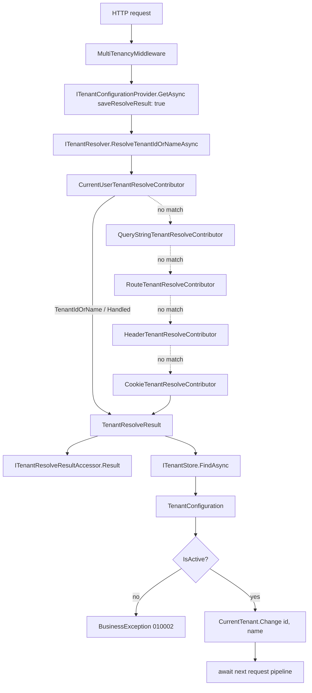

ABP Framework ships a first-class, pluggable multi-tenancy stack that is split
across two NuGet packages and two namespaces. The contracts and configuration
types live under `framework/src/Volo.Abp.MultiTenancy.Abstractions/` so that any
module — even ones that never reference the implementation — can model
tenant-scoped entities and read the current tenant. The runtime that resolves
the tenant from a request, switches scope, and routes connection strings lives
under `framework/src/Volo.Abp.MultiTenancy/`. A third package
(`framework/src/Volo.Abp.AspNetCore.MultiTenancy/`) layers HTTP-specific
contributors and the `MultiTenancyMiddleware` on top of those abstractions.
This page is the map for the rest of the `multitenancy/` section.

## What "multi-tenancy" means in ABP

The model is centered on three abstractions, all in
`framework/src/Volo.Abp.MultiTenancy.Abstractions/Volo/Abp/MultiTenancy/`:

1. **`IMultiTenant`** — entities that belong to a tenant implement it and
   expose a nullable `TenantId`.
2. **`ICurrentTenant`** — ambient accessor for the tenant of the *currently
   executing* unit of work, with a `Change(...)` method that returns an
   `IDisposable` scope.
3. **`TenantConfiguration`** — the resolved tenant's id, name, active flag and
   `ConnectionStrings`, sourced from an `ITenantStore`.

The two **sides** of a multi-tenant application are modeled by the
`MultiTenancySides` enum:

```csharp framework/src/Volo.Abp.MultiTenancy.Abstractions/Volo/Abp/MultiTenancy/MultiTenancySides.cs
[Flags]
public enum MultiTenancySides : byte
{
    Tenant = 1,
    Host = 2,
    Both = Tenant | Host
}
```

Anything decorated/queried with `Host` runs only when `ICurrentTenant.Id` is
`null`; anything `Tenant` runs only when an id is present; `Both` is unfiltered.
The extension `CurrentTenantExtensions.GetMultiTenancySide(this ICurrentTenant)`
collapses the boolean form into the enum.

A flag option also chooses how databases are physically arranged:

```csharp framework/src/Volo.Abp.MultiTenancy.Abstractions/Volo/Abp/MultiTenancy/MultiTenancyDatabaseStyle.cs
[Flags]
public enum MultiTenancyDatabaseStyle
{
    Shared = 1,
    PerTenant = 2,
    Hybrid = Shared | PerTenant
}
```

Both the master switch and the database style are read from
`AbpMultiTenancyOptions`:

```csharp framework/src/Volo.Abp.MultiTenancy.Abstractions/Volo/Abp/MultiTenancy/AbpMultiTenancyOptions.cs
public class AbpMultiTenancyOptions
{
    public bool IsEnabled { get; set; }

    public MultiTenancyDatabaseStyle DatabaseStyle { get; set; }
        = MultiTenancyDatabaseStyle.Hybrid;
}
```

<Note>
`IsEnabled` is the **central kill switch**. Modules that filter EF Core/MongoDB
queries by tenant id (see [/data/abp-data](/data/abp-data)) read this flag to
decide whether to apply their `IMultiTenant` query filter at all.
</Note>

## File inventory

### `Volo.Abp.MultiTenancy.Abstractions`

| Path (relative to repo root) | Role |
| --- | --- |
| `framework/src/Volo.Abp.MultiTenancy.Abstractions/Volo/Abp/MultiTenancy/IMultiTenant.cs` | Marker interface for tenant-scoped entities |
| `framework/src/Volo.Abp.MultiTenancy.Abstractions/Volo/Abp/MultiTenancy/ICurrentTenant.cs` | Ambient `Id`/`Name`/`IsAvailable` + `Change(...)` |
| `framework/src/Volo.Abp.MultiTenancy.Abstractions/Volo/Abp/MultiTenancy/ICurrentTenantAccessor.cs` | Low-level slot that stores the current `BasicTenantInfo` |
| `framework/src/Volo.Abp.MultiTenancy.Abstractions/Volo/Abp/MultiTenancy/BasicTenantInfo.cs` | Immutable `(TenantId, Name)` tuple held by the accessor |
| `framework/src/Volo.Abp.MultiTenancy.Abstractions/Volo/Abp/MultiTenancy/AbpMultiTenancyOptions.cs` | `IsEnabled` + `DatabaseStyle` |
| `framework/src/Volo.Abp.MultiTenancy.Abstractions/Volo/Abp/MultiTenancy/AbpTenantResolveOptions.cs` | Ordered `List<ITenantResolveContributor>` |
| `framework/src/Volo.Abp.MultiTenancy.Abstractions/Volo/Abp/MultiTenancy/MultiTenancySides.cs` | `Tenant`/`Host`/`Both` flags |
| `framework/src/Volo.Abp.MultiTenancy.Abstractions/Volo/Abp/MultiTenancy/MultiTenancyDatabaseStyle.cs` | `Shared`/`PerTenant`/`Hybrid` |
| `framework/src/Volo.Abp.MultiTenancy.Abstractions/Volo/Abp/MultiTenancy/ITenantResolver.cs` | Runs every contributor, returns a `TenantResolveResult` |
| `framework/src/Volo.Abp.MultiTenancy.Abstractions/Volo/Abp/MultiTenancy/ITenantResolveContributor.cs` | One step in the resolution chain |
| `framework/src/Volo.Abp.MultiTenancy.Abstractions/Volo/Abp/MultiTenancy/ITenantResolveContext.cs` | Mutable bag passed between contributors |
| `framework/src/Volo.Abp.MultiTenancy.Abstractions/Volo/Abp/MultiTenancy/TenantResolveContext.cs` | Default implementation (also in the runtime package) |
| `framework/src/Volo.Abp.MultiTenancy.Abstractions/Volo/Abp/MultiTenancy/TenantResolveResult.cs` | Output: `TenantIdOrName` + ordered `AppliedResolvers` |
| `framework/src/Volo.Abp.MultiTenancy.Abstractions/Volo/Abp/MultiTenancy/TenantResolverConsts.cs` | `DefaultTenantKey = "__tenant"` |
| `framework/src/Volo.Abp.MultiTenancy.Abstractions/Volo/Abp/MultiTenancy/ITenantConfigurationProvider.cs` | Resolves + loads + validates the tenant in one call |
| `framework/src/Volo.Abp.MultiTenancy.Abstractions/Volo/Abp/MultiTenancy/ITenantStore.cs` | `FindAsync(id)` / `FindAsync(name)` |
| `framework/src/Volo.Abp.MultiTenancy.Abstractions/Volo/Abp/MultiTenancy/TenantConfiguration.cs` | Resolved tenant: `Id`, `Name`, `IsActive`, `ConnectionStrings` |
| `framework/src/Volo.Abp.MultiTenancy.Abstractions/Volo/Abp/MultiTenancy/ConfigurationStore/AbpDefaultTenantStoreOptions.cs` | `TenantConfiguration[] Tenants` for the in-memory store |
| `framework/src/Volo.Abp.MultiTenancy.Abstractions/Volo/Abp/MultiTenancy/IMultiTenantUrlProvider.cs` | Replaces `{{tenantId}}` / `{{tenantName}}` in templates |
| `framework/src/Volo.Abp.MultiTenancy.Abstractions/Volo/Abp/MultiTenancy/IgnoreMultiTenancyAttribute.cs` | Opts an entity/repository out of tenant filtering |
| `framework/src/Volo.Abp.MultiTenancy.Abstractions/Volo/Abp/MultiTenancy/ITenantResolveResultAccessor.cs` | Stores the `TenantResolveResult` for the current request |
| `framework/src/Volo.Abp.MultiTenancy.Abstractions/Volo/Abp/MultiTenancy/TenantCreatedEto.cs` | `abp.multi_tenancy.tenant.created` distributed event |
| `framework/src/Volo.Abp.MultiTenancy.Abstractions/Volo/Abp/MultiTenancy/TenantConnectionStringUpdatedEto.cs` | `abp.multi_tenancy.tenant.connection_string.updated` |
| `framework/src/Volo.Abp.MultiTenancy.Abstractions/System/Security/Principal/AbpMultiTenancyClaimsIdentityExtensions.cs` | `GetMultiTenancySide()` on `IIdentity`/`ClaimsPrincipal` |

### `Volo.Abp.MultiTenancy`

| Path | Role |
| --- | --- |
| `framework/src/Volo.Abp.MultiTenancy/Volo/Abp/MultiTenancy/AbpMultiTenancyModule.cs` | Registers `AsyncLocalCurrentTenantAccessor`, `CurrentUserTenantResolveContributor`, `TenantSettingValueProvider` |
| `framework/src/Volo.Abp.MultiTenancy/Volo/Abp/MultiTenancy/CurrentTenant.cs` | `ICurrentTenant` reading the accessor; implements `Change(...)` |
| `framework/src/Volo.Abp.MultiTenancy/Volo/Abp/MultiTenancy/AsyncLocalCurrentTenantAccessor.cs` | `AsyncLocal<BasicTenantInfo?>` singleton |
| `framework/src/Volo.Abp.MultiTenancy/Volo/Abp/MultiTenancy/TenantResolver.cs` | Default `ITenantResolver` that drives the contributor chain |
| `framework/src/Volo.Abp.MultiTenancy/Volo/Abp/MultiTenancy/TenantResolveContributorBase.cs` | Abstract base for contributors |
| `framework/src/Volo.Abp.MultiTenancy/Volo/Abp/MultiTenancy/CurrentUserTenantResolveContributor.cs` | Reads `ICurrentUser.TenantId` |
| `framework/src/Volo.Abp.MultiTenancy/Volo/Abp/MultiTenancy/ActionTenantResolveContributor.cs` | Inline `Action<ITenantResolveContext>` contributor |
| `framework/src/Volo.Abp.MultiTenancy/Volo/Abp/MultiTenancy/TenantConfigurationProvider.cs` | Resolves → loads via `ITenantStore` → throws on inactive |
| `framework/src/Volo.Abp.MultiTenancy/Volo/Abp/MultiTenancy/ConfigurationStore/DefaultTenantStore.cs` | Reads from `AbpDefaultTenantStoreOptions.Tenants` |
| `framework/src/Volo.Abp.MultiTenancy/Volo/Abp/MultiTenancy/MultiTenantConnectionStringResolver.cs` | Overrides `DefaultConnectionStringResolver` with tenant lookup |
| `framework/src/Volo.Abp.MultiTenancy/Volo/Abp/MultiTenancy/MultiTenantUrlProvider.cs` | Default `IMultiTenantUrlProvider` |
| `framework/src/Volo.Abp.MultiTenancy/Volo/Abp/MultiTenancy/NullTenantResolveResultAccessor.cs` | Drop-in accessor outside HTTP — always returns `null` |
| `framework/src/Volo.Abp.MultiTenancy/Volo/Abp/MultiTenancy/TenantSettingValueProvider.cs` | `T`-scoped values for `ISettingProvider` |

## `IMultiTenant` entities

Tenant-aware entities implement a one-property interface:

```csharp framework/src/Volo.Abp.MultiTenancy.Abstractions/Volo/Abp/MultiTenancy/IMultiTenant.cs
public interface IMultiTenant
{
    Guid? TenantId { get; }
}
```

The `Volo.Abp.Data` and EF Core/MongoDB integrations use this marker to add a
global query filter that compares the row's `TenantId` against
`ICurrentTenant.Id`. See [/data/abp-data](/data/abp-data) and
[/data/entity-framework-core](/data/entity-framework-core) for the filter
implementation and how it interacts with `[IgnoreMultiTenancy]`.

A `Guid?` field is used (not `Guid`) so that the same model can represent a
*host* row (`TenantId == null`) and a *tenant* row in the same physical table.
The `MultiTenancyDatabaseStyle.Hybrid` default means the framework expects to
see both kinds — `Shared` denotes only shared rows, `PerTenant` denotes rows
that live in tenant-specific databases (no filter required because the
connection is already scoped).

## Host vs tenant scope

A request is **on the host side** when `ICurrentTenant.Id` is `null`, and **on
a tenant side** when it has a value. Multiple things flip the scope:

- The **`MultiTenancyMiddleware`** runs the resolver chain, looks the tenant up
  in `ITenantStore`, and wraps the rest of the pipeline in
  `CurrentTenant.Change(tenant?.Id, tenant?.Name)`.
- The **`TenantStore` implementation in the Tenant Management module** flips
  to host scope while reading from the database
  (`using (CurrentTenant.Change(null)) { ... }`) so that the lookup itself is
  not filtered by tenant.
- Application code can explicitly switch via `ICurrentTenant.Change(...)` to,
  for example, seed data into a specific tenant from a background job.

```csharp framework/src/Volo.Abp.MultiTenancy/Volo/Abp/MultiTenancy/CurrentTenant.cs
public IDisposable Change(Guid? id, string? name = null)
{
    return SetCurrent(id, name);
}

private IDisposable SetCurrent(Guid? tenantId, string? name = null)
{
    var parentScope = _currentTenantAccessor.Current;
    _currentTenantAccessor.Current = new BasicTenantInfo(tenantId, name);

    return new DisposeAction<ValueTuple<ICurrentTenantAccessor, BasicTenantInfo?>>(static (state) =>
    {
        var (currentTenantAccessor, parentScope) = state;
        currentTenantAccessor.Current = parentScope;
    }, (_currentTenantAccessor, parentScope));
}
```

Disposing the returned `IDisposable` restores the previous slot value, so
`Change` composes safely with nested scopes and async flow.

## The resolution pipeline

`ITenantResolver` is the entry point. The default
`TenantResolver` iterates `AbpTenantResolveOptions.TenantResolvers` in order,
short-circuiting as soon as any contributor sets `context.TenantIdOrName` or
flips `context.Handled = true`:

```csharp framework/src/Volo.Abp.MultiTenancy/Volo/Abp/MultiTenancy/TenantResolver.cs
public virtual async Task<TenantResolveResult> ResolveTenantIdOrNameAsync()
{
    var result = new TenantResolveResult();

    using (var serviceScope = _serviceProvider.CreateScope())
    {
        var context = new TenantResolveContext(serviceScope.ServiceProvider);

        foreach (var tenantResolver in _options.TenantResolvers)
        {
            await tenantResolver.ResolveAsync(context);

            result.AppliedResolvers.Add(tenantResolver.Name);

            if (context.HasResolvedTenantOrHost())
            {
                result.TenantIdOrName = context.TenantIdOrName;
                break;
            }
        }
    }

    return result;
}
```

`AbpMultiTenancyModule` always seeds the chain with
`CurrentUserTenantResolveContributor` (so an authenticated request always wins),
and `AbpAspNetCoreMultiTenancyModule` adds the four HTTP contributors after it:

```csharp framework/src/Volo.Abp.AspNetCore.MultiTenancy/Volo/Abp/AspNetCore/MultiTenancy/AbpAspNetCoreMultiTenancyModule.cs
Configure<AbpTenantResolveOptions>(options =>
{
    options.TenantResolvers.Add(new QueryStringTenantResolveContributor());
    options.TenantResolvers.Add(new RouteTenantResolveContributor());
    options.TenantResolvers.Add(new HeaderTenantResolveContributor());
    options.TenantResolvers.Add(new CookieTenantResolveContributor());
});
```

The result, a `TenantResolveResult`, is then fed to
`ITenantConfigurationProvider`, which materializes the `TenantConfiguration`
from `ITenantStore` and validates it:



`TenantConfigurationProvider.GetAsync` is the canonical bridge between the
contributor pipeline and the rest of the framework:

```csharp framework/src/Volo.Abp.MultiTenancy/Volo/Abp/MultiTenancy/TenantConfigurationProvider.cs
public virtual async Task<TenantConfiguration?> GetAsync(bool saveResolveResult = false)
{
    var resolveResult = await TenantResolver.ResolveTenantIdOrNameAsync();

    if (saveResolveResult)
    {
        TenantResolveResultAccessor.Result = resolveResult;
    }

    TenantConfiguration? tenant = null;
    if (resolveResult.TenantIdOrName != null)
    {
        tenant = await FindTenantAsync(resolveResult.TenantIdOrName);

        if (tenant == null)
        {
            throw new BusinessException(
                code: "Volo.AbpIo.MultiTenancy:010001",
                message: StringLocalizer["TenantNotFoundMessage"],
                details: StringLocalizer["TenantNotFoundDetails", resolveResult.TenantIdOrName]
            );
        }

        if (!tenant.IsActive)
        {
            throw new BusinessException(
                code: "Volo.AbpIo.MultiTenancy:010002",
                message: StringLocalizer["TenantNotActiveMessage"],
                details: StringLocalizer["TenantNotActiveDetails", resolveResult.TenantIdOrName]
            );
        }
    }

    return tenant;
}
```

`FindTenantAsync` first tries `Guid.TryParse` so the same value can carry an id
or a name. The provider never *enters* tenant scope — that is the responsibility
of the caller (the middleware).

## The default tenant store

Outside the Tenant Management module, the framework's only built-in store is
`DefaultTenantStore`, backed by an options-bound array:

```csharp framework/src/Volo.Abp.MultiTenancy/Volo/Abp/MultiTenancy/ConfigurationStore/DefaultTenantStore.cs
[Dependency(TryRegister = true)]
public class DefaultTenantStore : ITenantStore, ITransientDependency
{
    private readonly AbpDefaultTenantStoreOptions _options;

    public DefaultTenantStore(IOptionsMonitor<AbpDefaultTenantStoreOptions> options)
    {
        _options = options.CurrentValue;
    }

    public Task<TenantConfiguration?> FindAsync(string name)
    {
        return Task.FromResult(Find(name));
    }

    public Task<TenantConfiguration?> FindAsync(Guid id)
    {
        return Task.FromResult(Find(id));
    }
    // ...
}
```

`AbpMultiTenancyModule` binds the options to `configuration`, so you can fill
the array entirely from `appsettings.json`. The `[Dependency(TryRegister = true)]`
attribute is the seam: when you reference the Tenant Management module,
its `TenantStore` (over `ITenantRepository`) replaces `DefaultTenantStore`.

See the [connection string resolver](/multitenancy/connection-string-resolver)
page for how the store's `TenantConfiguration.ConnectionStrings` participate in
per-tenant database routing.

## ASP.NET Core wiring

`UseMultiTenancy()` installs the middleware:

```csharp framework/src/Volo.Abp.AspNetCore.MultiTenancy/Microsoft/AspNetCore/Builder/AbpAspNetCoreMultiTenancyApplicationBuilderExtensions.cs
public static IApplicationBuilder UseMultiTenancy(this IApplicationBuilder app)
{
    return app
        .UseMiddleware<MultiTenancyMiddleware>();
}
```

`HttpContextTenantResolveResultAccessor` replaces the
`NullTenantResolveResultAccessor` from the core package and stashes the
`TenantResolveResult` in `HttpContext.Items["__AbpTenantResolveResult"]`, so
later parts of the pipeline (error pages, the cookie helper, the API layer) can
inspect which resolver actually matched.

The MVC UI package
(`framework/src/Volo.Abp.AspNetCore.Mvc.UI.MultiTenancy/`) adds the
**tenant switch modal** and a thin `AbpTenantAppService` over `ITenantStore` so
the login pages can resolve "find tenant by name" lookups without exposing the
full Tenant Management API.

## Identity claims and `MultiTenancySides`

`ClaimsPrincipal.FindTenantId()` is provided by the security module; the
multi-tenancy abstractions layer the side helper on top:

```csharp framework/src/Volo.Abp.MultiTenancy.Abstractions/System/Security/Principal/AbpMultiTenancyClaimsIdentityExtensions.cs
public static MultiTenancySides GetMultiTenancySide(this IIdentity identity)
{
    var tenantId = identity.FindTenantId();
    return tenantId.HasValue
        ? MultiTenancySides.Tenant
        : MultiTenancySides.Host;
}
```

The same helper exists on `ICurrentTenant` via
`CurrentTenantExtensions.GetMultiTenancySide(this ICurrentTenant)`. Together
they let permission/feature/setting providers decide whether a definition
applies on the host, the tenant, or both — see
[authz/permission-system](/authz/permission-system) and
[settings/setting-value-providers](/settings-features/setting-providers).

## Events

Two integration events sit in the abstractions package and are raised by the
Tenant Management module:

```csharp framework/src/Volo.Abp.MultiTenancy.Abstractions/Volo/Abp/MultiTenancy/TenantCreatedEto.cs
[Serializable]
[EventName("abp.multi_tenancy.tenant.created")]
public class TenantCreatedEto : EtoBase
{
    public Guid Id { get; set; }
    public string Name { get; set; } = default!;
}
```

```csharp framework/src/Volo.Abp.MultiTenancy.Abstractions/Volo/Abp/MultiTenancy/TenantConnectionStringUpdatedEto.cs
[Serializable]
[EventName("abp.multi_tenancy.tenant.connection_string.updated")]
public class TenantConnectionStringUpdatedEto : EtoBase
{
    public Guid Id { get; set; }
    public string Name { get; set; } = default!;
    public string ConnectionStringName { get; set; } = default!;
    public string? OldValue { get; set; }
    public string? NewValue { get; set; }
}
```

Cache invalidation in the Tenant Management module subscribes to those events;
see [/modules/tenant-management/overview](/modules/tenant-management/overview).

## Where to go next

<CardGroup cols={2}>
  <Card title="Current tenant" href="/multitenancy/current-tenant">
    `ICurrentTenant`, the `AsyncLocal` accessor, and the `Change(...)` pattern.
  </Card>
  <Card title="Tenant resolvers" href="/multitenancy/tenant-resolvers">
    `ITenantResolver`, every built-in `ITenantResolveContributor`, custom
    contributors via `ActionTenantResolveContributor`.
  </Card>
  <Card title="ASP.NET Core resolvers" href="/multitenancy/aspnet-core-resolvers">
    Domain / route / header / query string / cookie / form contributors and
    `MultiTenancyMiddleware`.
  </Card>
  <Card title="Connection-string resolver" href="/multitenancy/connection-string-resolver">
    `MultiTenantConnectionStringResolver`, `ITenantStore`, `MultiTenantUrlProvider`.
  </Card>
  <Card title="Tenant Management module" href="/multitenancy/tenant-management-module">
    The high-level CRUD module that backs `ITenantStore` with a real database.
  </Card>
  <Card title="Tenant Management deep-dive" href="/modules/tenant-management/overview">
    Domain, app services, EF/Mongo persistence and Blazor/MVC UI for the module.
  </Card>
</CardGroup>
