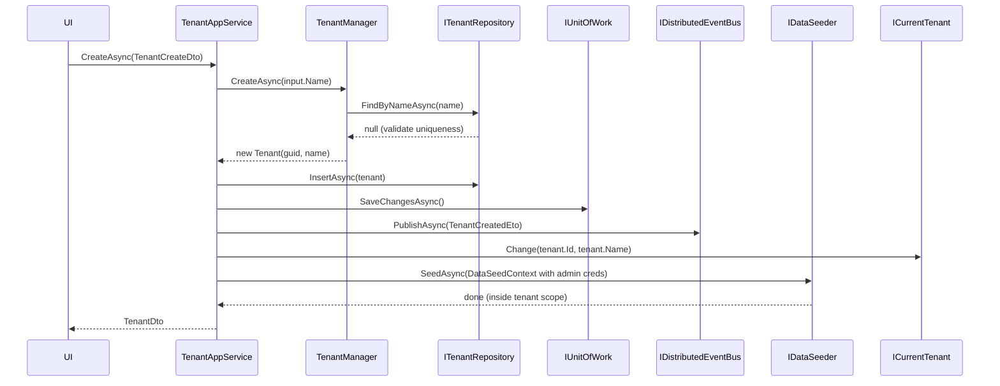
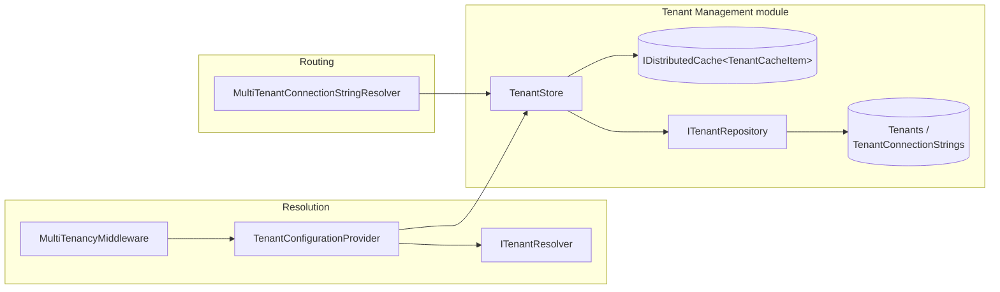

The framework's multi-tenancy stack documented on
[/multitenancy/overview](/multitenancy/overview) is intentionally open at
both ends: tenants are *resolved* through a chain of contributors, and they
are *loaded* through an `ITenantStore` interface — neither of which knows
anything about persistence. The **Tenant Management module**
(`modules/tenant-management/`) is the production-ready implementation that
plugs into that hole. It defines a `Tenant` aggregate, an `ITenantRepository`
with EF Core and MongoDB providers, a `TenantManager` domain service, a
distributed-cache-backed `TenantStore`, and a CRUD `TenantAppService` with
an Authorization-server-aware UI. This page is the framework-side reference
to those pieces; the full module surface (UI bundles, navigation entries,
event handlers in modules that depend on it) is documented at
[/modules/tenant-management/overview](/modules/tenant-management/overview).

## File inventory

### `Volo.Abp.TenantManagement.Domain`

| Path (relative to repo root) | Role |
| --- | --- |
| `modules/tenant-management/src/Volo.Abp.TenantManagement.Domain/Volo/Abp/TenantManagement/Tenant.cs` | `FullAuditedAggregateRoot<Guid>` — the tenant aggregate |
| `modules/tenant-management/src/Volo.Abp.TenantManagement.Domain/Volo/Abp/TenantManagement/TenantConnectionString.cs` | Owned entity per `(TenantId, Name)` |
| `modules/tenant-management/src/Volo.Abp.TenantManagement.Domain/Volo/Abp/TenantManagement/ITenantRepository.cs` | `IBasicRepository<Tenant, Guid>` + `FindByNameAsync`, `GetListAsync`, `GetCountAsync` |
| `modules/tenant-management/src/Volo.Abp.TenantManagement.Domain/Volo/Abp/TenantManagement/ITenantManager.cs` | Domain service contract — `CreateAsync`, `ChangeNameAsync` |
| `modules/tenant-management/src/Volo.Abp.TenantManagement.Domain/Volo/Abp/TenantManagement/TenantManager.cs` | Default implementation with name validation |
| `modules/tenant-management/src/Volo.Abp.TenantManagement.Domain/Volo/Abp/TenantManagement/TenantStore.cs` | `ITenantStore` backed by repository + `IDistributedCache` |
| `modules/tenant-management/src/Volo.Abp.TenantManagement.Domain/Volo/Abp/TenantManagement/TenantCacheItem.cs` | Cache shape — `[IgnoreMultiTenancy]` |
| `modules/tenant-management/src/Volo.Abp.TenantManagement.Domain/Volo/Abp/TenantManagement/TenantCacheItemInvalidator.cs` | `ILocalEventHandler<EntityChangedEventData<Tenant>>` |
| `modules/tenant-management/src/Volo.Abp.TenantManagement.Domain/Volo/Abp/TenantManagement/AbpTenantManagementDomainMappingProfile.cs` | `Tenant` → `TenantConfiguration` / `TenantEto` |
| `modules/tenant-management/src/Volo.Abp.TenantManagement.Domain/Volo/Abp/TenantManagement/AbpTenantManagementDomainModule.cs` | Module class |

### `Volo.Abp.TenantManagement.Application` + `Application.Contracts`

| Path | Role |
| --- | --- |
| `modules/tenant-management/src/Volo.Abp.TenantManagement.Application.Contracts/Volo/Abp/TenantManagement/ITenantAppService.cs` | `ICrudAppService` + connection-string endpoints |
| `modules/tenant-management/src/Volo.Abp.TenantManagement.Application.Contracts/Volo/Abp/TenantManagement/TenantDto.cs` | API DTO |
| `modules/tenant-management/src/Volo.Abp.TenantManagement.Application.Contracts/Volo/Abp/TenantManagement/TenantCreateDto.cs` | Includes admin email + password |
| `modules/tenant-management/src/Volo.Abp.TenantManagement.Application.Contracts/Volo/Abp/TenantManagement/TenantUpdateDto.cs` | Carries the concurrency stamp |
| `modules/tenant-management/src/Volo.Abp.TenantManagement.Application.Contracts/Volo/Abp/TenantManagement/GetTenantsInput.cs` | Paged input |
| `modules/tenant-management/src/Volo.Abp.TenantManagement.Application.Contracts/Volo/Abp/TenantManagement/TenantManagementPermissions.cs` | Permission constants |
| `modules/tenant-management/src/Volo.Abp.TenantManagement.Application/Volo/Abp/TenantManagement/TenantAppService.cs` | `[Authorize]` CRUD + connection-string operations |

### EF Core and MongoDB

| Path | Role |
| --- | --- |
| `modules/tenant-management/src/Volo.Abp.TenantManagement.EntityFrameworkCore/Volo/Abp/TenantManagement/EntityFrameworkCore/EfCoreTenantRepository.cs` | EF Core `ITenantRepository` |
| `modules/tenant-management/src/Volo.Abp.TenantManagement.EntityFrameworkCore/Volo/Abp/TenantManagement/EntityFrameworkCore/AbpTenantManagementDbContextModelCreatingExtensions.cs` | `ConfigureTenantManagement()` for the host DbContext |
| `modules/tenant-management/src/Volo.Abp.TenantManagement.EntityFrameworkCore/Volo/Abp/TenantManagement/EntityFrameworkCore/TenantManagementDbContext.cs` | The module's own DbContext (for migrations) |
| `modules/tenant-management/src/Volo.Abp.TenantManagement.MongoDB/Volo/Abp/TenantManagement/MongoDb/MongoTenantRepository.cs` | MongoDB `ITenantRepository` |
| `modules/tenant-management/src/Volo.Abp.TenantManagement.MongoDB/Volo/Abp/TenantManagement/MongoDb/TenantManagementMongoDbContext.cs` | The module's Mongo context |

<Note>
The module also ships UI projects — `Volo.Abp.TenantManagement.Blazor`,
`Volo.Abp.TenantManagement.Blazor.Server`,
`Volo.Abp.TenantManagement.Blazor.WebAssembly` — plus a Razor Pages UI under
`framework/src/Volo.Abp.AspNetCore.Mvc.UI.MultiTenancy/`. Those are covered
on [/modules/tenant-management/overview](/modules/tenant-management/overview).
</Note>

## The aggregate

```csharp modules/tenant-management/src/Volo.Abp.TenantManagement.Domain/Volo/Abp/TenantManagement/Tenant.cs (excerpt)
public class Tenant : FullAuditedAggregateRoot<Guid>, IHasEntityVersion
{
    public virtual string Name { get; protected set; }
    public virtual int EntityVersion { get; protected set; }
    public virtual List<TenantConnectionString> ConnectionStrings { get; protected set; }

    protected internal Tenant(Guid id, [NotNull] string name) : base(id)
    {
        SetName(name);
        ConnectionStrings = new List<TenantConnectionString>();
    }

    public virtual string FindDefaultConnectionString()
        => FindConnectionString(Data.ConnectionStrings.DefaultConnectionStringName);

    public virtual string FindConnectionString(string name)
        => ConnectionStrings.FirstOrDefault(c => c.Name == name)?.Value;

    public virtual void SetDefaultConnectionString(string connectionString)
        => SetConnectionString(Data.ConnectionStrings.DefaultConnectionStringName, connectionString);

    public virtual void SetConnectionString(string name, string connectionString)
    {
        var tcs = ConnectionStrings.FirstOrDefault(x => x.Name == name);
        if (tcs != null) tcs.SetValue(connectionString);
        else ConnectionStrings.Add(new TenantConnectionString(Id, name, connectionString));
    }

    public virtual void RemoveConnectionString(string name)
    {
        var tcs = ConnectionStrings.FirstOrDefault(x => x.Name == name);
        if (tcs != null) ConnectionStrings.Remove(tcs);
    }

    protected internal virtual void SetName([NotNull] string name)
        => Name = Check.NotNullOrWhiteSpace(name, nameof(name), TenantConsts.MaxNameLength);
}
```

Key design points:

- `FullAuditedAggregateRoot<Guid>` brings `CreationTime`/`CreatorId`,
  `LastModificationTime`/`LastModifierId`, soft delete and the
  `ExtraProperties` dictionary used by the
  [/modules/tenant-management/overview](/modules/tenant-management/overview)
  object-extending API.
- `IHasEntityVersion` adds an integer `EntityVersion` column that ABP's
  EF Core interceptor increments on every save — modules that cache by
  tenant id can invalidate their entries when the version changes.
- Connection strings are an **owned collection** of `TenantConnectionString`
  entities, with the canonical "Default" name surfaced through
  `FindDefaultConnectionString()` / `SetDefaultConnectionString()`. The
  `Data.ConnectionStrings.DefaultConnectionStringName` constant is shared
  with the data package — see
  [/multitenancy/connection-string-resolver](/multitenancy/connection-string-resolver).
- The constructor is `protected internal`, so application code creates
  tenants through `TenantManager.CreateAsync` only.

`TenantConnectionString` (sibling file in the same folder) is a plain
`Entity` with a composite key `(TenantId, Name)` returned from `GetKeys()` —
that enforces "one entry per connection-string name, per tenant" at the
database level. Its `Value` is bounded by
`TenantConnectionStringConsts.MaxValueLength`.

## The domain service

`TenantManager` is the only sanctioned place to create or rename a tenant —
both operations validate name uniqueness:

```csharp modules/tenant-management/src/Volo.Abp.TenantManagement.Domain/Volo/Abp/TenantManagement/TenantManager.cs
public class TenantManager : DomainService, ITenantManager
{
    protected ITenantRepository TenantRepository { get; }

    public TenantManager(ITenantRepository tenantRepository)
    {
        TenantRepository = tenantRepository;
    }

    public virtual async Task<Tenant> CreateAsync(string name)
    {
        Check.NotNull(name, nameof(name));

        await ValidateNameAsync(name);
        return new Tenant(GuidGenerator.Create(), name);
    }

    public virtual async Task ChangeNameAsync(Tenant tenant, string name)
    {
        Check.NotNull(tenant, nameof(tenant));
        Check.NotNull(name, nameof(name));

        await ValidateNameAsync(name, tenant.Id);
        tenant.SetName(name);
    }

    protected virtual async Task ValidateNameAsync(string name, Guid? expectedId = null)
    {
        var tenant = await TenantRepository.FindByNameAsync(name);
        if (tenant != null && tenant.Id != expectedId)
        {
            throw new BusinessException("Volo.Abp.TenantManagement:DuplicateTenantName").WithData("Name", name);
        }
    }
}
```

The `BusinessException` code `Volo.Abp.TenantManagement:DuplicateTenantName`
is the canonical signal — UI layers catch it and turn it into a user-visible
validation message.

## The repository contract

```csharp modules/tenant-management/src/Volo.Abp.TenantManagement.Domain/Volo/Abp/TenantManagement/ITenantRepository.cs
public interface ITenantRepository : IBasicRepository<Tenant, Guid>
{
    Task<Tenant> FindByNameAsync(
        string name,
        bool includeDetails = true,
        CancellationToken cancellationToken = default);

    Task<List<Tenant>> GetListAsync(
        string sorting = null,
        int maxResultCount = int.MaxValue,
        int skipCount = 0,
        string filter = null,
        bool includeDetails = false,
        CancellationToken cancellationToken = default);

    Task<long> GetCountAsync(
        string filter = null,
        CancellationToken cancellationToken = default);
}
```

`includeDetails: true` is the default on lookup APIs because the
`TenantStore` needs the `ConnectionStrings` collection in the same load — see
the next section. The provider implementations honour that flag by calling
`IncludeDetails()` (EF Core) or letting the eager loading happen
automatically (MongoDB, which inlines owned collections by default).

### EF Core provider

```csharp modules/tenant-management/src/Volo.Abp.TenantManagement.EntityFrameworkCore/Volo/Abp/TenantManagement/EntityFrameworkCore/EfCoreTenantRepository.cs (excerpt)
public class EfCoreTenantRepository
    : EfCoreRepository<ITenantManagementDbContext, Tenant, Guid>, ITenantRepository
{
    public virtual async Task<Tenant> FindByNameAsync(
        string name,
        bool includeDetails = true,
        CancellationToken cancellationToken = default)
    {
        return await (await GetDbSetAsync())
            .IncludeDetails(includeDetails)
            .OrderBy(t => t.Id)
            .FirstOrDefaultAsync(t => t.Name == name, GetCancellationToken(cancellationToken));
    }

    public virtual async Task<List<Tenant>> GetListAsync(
        string sorting = null,
        int maxResultCount = int.MaxValue,
        int skipCount = 0,
        string filter = null,
        bool includeDetails = false,
        CancellationToken cancellationToken = default)
    {
        return await (await GetDbSetAsync())
            .IncludeDetails(includeDetails)
            .WhereIf(!filter.IsNullOrWhiteSpace(),
                u => u.Name.Contains(filter))
            .OrderBy(sorting.IsNullOrEmpty() ? nameof(Tenant.Name) : sorting)
            .PageBy(skipCount, maxResultCount)
            .ToListAsync(GetCancellationToken(cancellationToken));
    }
}
```

The schema is set up in the model-creating extension:

```csharp modules/tenant-management/src/Volo.Abp.TenantManagement.EntityFrameworkCore/Volo/Abp/TenantManagement/EntityFrameworkCore/AbpTenantManagementDbContextModelCreatingExtensions.cs (excerpt)
public static void ConfigureTenantManagement(this ModelBuilder builder)
{
    Check.NotNull(builder, nameof(builder));
    if (builder.IsTenantOnlyDatabase()) return;

    builder.Entity<Tenant>(b =>
    {
        b.ToTable(AbpTenantManagementDbProperties.DbTablePrefix + "Tenants",
                  AbpTenantManagementDbProperties.DbSchema);
        b.ConfigureByConvention();
        b.Property(t => t.Name).IsRequired().HasMaxLength(TenantConsts.MaxNameLength);
        b.HasMany(u => u.ConnectionStrings).WithOne().HasForeignKey(uc => uc.TenantId).IsRequired();
        b.HasIndex(u => u.Name);
        b.ApplyObjectExtensionMappings();
    });

    builder.Entity<TenantConnectionString>(b =>
    {
        b.ToTable(AbpTenantManagementDbProperties.DbTablePrefix + "TenantConnectionStrings",
                  AbpTenantManagementDbProperties.DbSchema);
        b.ConfigureByConvention();
        b.HasKey(x => new { x.TenantId, x.Name });
        b.Property(cs => cs.Name).IsRequired().HasMaxLength(TenantConnectionStringConsts.MaxNameLength);
        b.Property(cs => cs.Value).IsRequired().HasMaxLength(TenantConnectionStringConsts.MaxValueLength);
        b.ApplyObjectExtensionMappings();
    });

    builder.TryConfigureObjectExtensions<TenantManagementDbContext>();
}
```

Two patterns are worth pointing out:

- **`builder.IsTenantOnlyDatabase()`** — when this DbContext is being used by
  a *tenant* (per-tenant database, hybrid style), the tenant tables are
  skipped entirely. Only the host owns the tenant rows.
- **`ApplyObjectExtensionMappings()`** — picks up any extra properties the
  application registered through `ObjectExtensionManager.Instance` and maps
  them onto the EF model. See
  [/modules/tenant-management/overview](/modules/tenant-management/overview)
  for the extension recipe.

Host applications register the tables on their own DbContext by calling
`modelBuilder.ConfigureTenantManagement()` from inside `OnModelCreating`.

### MongoDB provider

`MongoTenantRepository` (in
`modules/tenant-management/src/Volo.Abp.TenantManagement.MongoDB/Volo/Abp/TenantManagement/MongoDb/`)
derives from `MongoDbRepository<ITenantManagementMongoDbContext, Tenant, Guid>`
and uses the standard `GetMongoQueryableAsync` + LINQ pattern. The MongoDB
version ignores `includeDetails` — the `Tenant` document embeds its
connection strings, so they are always loaded with the parent.

## The cached store

`TenantStore` is the implementation of the framework's `ITenantStore` that
gets registered when this module is loaded — replacing the default in-memory
store described on
[/multitenancy/connection-string-resolver](/multitenancy/connection-string-resolver):

```csharp modules/tenant-management/src/Volo.Abp.TenantManagement.Domain/Volo/Abp/TenantManagement/TenantStore.cs (excerpt)
public class TenantStore : ITenantStore, ITransientDependency
{
    protected ITenantRepository TenantRepository { get; }
    protected IObjectMapper<AbpTenantManagementDomainModule> ObjectMapper { get; }
    protected ICurrentTenant CurrentTenant { get; }
    protected IDistributedCache<TenantCacheItem> Cache { get; }

    public virtual async Task<TenantConfiguration> FindAsync(string name)
    {
        return (await GetCacheItemAsync(null, name)).Value;
    }

    public virtual async Task<TenantConfiguration> FindAsync(Guid id)
    {
        return (await GetCacheItemAsync(id, null)).Value;
    }

    protected virtual async Task<TenantCacheItem> GetCacheItemAsync(Guid? id, string name)
    {
        var cacheKey = CalculateCacheKey(id, name);

        var cacheItem = await Cache.GetAsync(cacheKey, considerUow: true);
        if (cacheItem != null)
        {
            return cacheItem;
        }

        if (id.HasValue)
        {
            using (CurrentTenant.Change(null))
            {
                var tenant = await TenantRepository.FindAsync(id.Value);
                return await SetCacheAsync(cacheKey, tenant);
            }
        }

        if (!name.IsNullOrWhiteSpace())
        {
            using (CurrentTenant.Change(null))
            {
                var tenant = await TenantRepository.FindByNameAsync(name);
                return await SetCacheAsync(cacheKey, tenant);
            }
        }

        throw new AbpException("Both id and name can't be invalid.");
    }
}
```

Three details that are easy to miss:

- **`CurrentTenant.Change(null)`** — the repository call runs as the *host*.
  Without that, looking up tenant `acme` would attempt to query Acme's
  database for the row that *describes* Acme.
- **`considerUow: true`** — changes committed in the current unit of work
  (`TenantAppService.CreateAsync`, `UpdateAsync`, `DeleteAsync`) are visible
  to subsequent reads in the same transaction and roll back together with
  it.
- **Negative caching** — if the repository returns `null`, the wrapper
  `TenantCacheItem(null)` is still cached. That prevents repeated database
  hits for an unknown tenant id under load.

The cache item is intentionally marked as host-side:

```csharp modules/tenant-management/src/Volo.Abp.TenantManagement.Domain/Volo/Abp/TenantManagement/TenantCacheItem.cs (excerpt)
[Serializable]
[IgnoreMultiTenancy]
public class TenantCacheItem
{
    private const string CacheKeyFormat = "i:{0},n:{1}";

    public TenantConfiguration Value { get; set; }

    public static string CalculateCacheKey(Guid? id, string name)
    {
        if (id == null && name.IsNullOrWhiteSpace())
        {
            throw new AbpException("Both id and name can't be invalid.");
        }

        return string.Format(CacheKeyFormat,
            id?.ToString() ?? "null",
            (name.IsNullOrWhiteSpace() ? "null" : name));
    }
}
```

The `[IgnoreMultiTenancy]` attribute makes the distributed-cache key
provider skip the tenant-id prefix that ABP normally prepends — there is
exactly one cache entry per tenant, not one per (tenant, viewer) pair. See
[/multitenancy/overview](/multitenancy/overview) for `IgnoreMultiTenancyAttribute`.

### Invalidation

`TenantCacheItemInvalidator` listens to the local entity-changed event and
clears both keys:

```csharp modules/tenant-management/src/Volo.Abp.TenantManagement.Domain/Volo/Abp/TenantManagement/TenantCacheItemInvalidator.cs
public class TenantCacheItemInvalidator
    : ILocalEventHandler<EntityChangedEventData<Tenant>>, ITransientDependency
{
    protected IDistributedCache<TenantCacheItem> Cache { get; }

    public TenantCacheItemInvalidator(IDistributedCache<TenantCacheItem> cache)
    {
        Cache = cache;
    }

    public virtual async Task HandleEventAsync(EntityChangedEventData<Tenant> eventData)
    {
        await Cache.RemoveAsync(
            TenantCacheItem.CalculateCacheKey(eventData.Entity.Id, null),
            considerUow: true);
        await Cache.RemoveAsync(
            TenantCacheItem.CalculateCacheKey(null, eventData.Entity.Name),
            considerUow: true);
    }
}
```

Because ABP raises `EntityChangedEventData<Tenant>` on insert, update **and**
delete, every CRUD operation through `TenantAppService` automatically
invalidates the cache — including connection-string updates, which save the
aggregate and therefore trigger the same event.

### Mapping to `TenantConfiguration`

The cache stores `TenantConfiguration`, not `Tenant`. The conversion happens
via AutoMapper:

```csharp modules/tenant-management/src/Volo.Abp.TenantManagement.Domain/Volo/Abp/TenantManagement/AbpTenantManagementDomainMappingProfile.cs
public class AbpTenantManagementDomainMappingProfile : Profile
{
    public AbpTenantManagementDomainMappingProfile()
    {
        CreateMap<Tenant, TenantConfiguration>()
            .ForMember(ti => ti.ConnectionStrings, opts =>
            {
                opts.MapFrom((tenant, ti) =>
                {
                    var connStrings = new ConnectionStrings();

                    foreach (var connectionString in tenant.ConnectionStrings)
                    {
                        connStrings[connectionString.Name] = connectionString.Value;
                    }

                    return connStrings;
                });
            })
            .ForMember(x => x.IsActive, x => x.Ignore());

        CreateMap<Tenant, TenantEto>();
    }
}
```

`IsActive` is `Ignore()`d because the default for `TenantConfiguration` is
`true` and the module does not currently expose a "disabled" flag — every
persisted tenant is active.

## The application service

```csharp modules/tenant-management/src/Volo.Abp.TenantManagement.Application/Volo/Abp/TenantManagement/TenantAppService.cs (excerpt)
[Authorize(TenantManagementPermissions.Tenants.Default)]
public class TenantAppService : TenantManagementAppServiceBase, ITenantAppService
{
    public virtual async Task<TenantDto> GetAsync(Guid id) { /* ... */ }
    public virtual async Task<PagedResultDto<TenantDto>> GetListAsync(GetTenantsInput input) { /* ... */ }

    [Authorize(TenantManagementPermissions.Tenants.Create)]
    public virtual async Task<TenantDto> CreateAsync(TenantCreateDto input)
    {
        var tenant = await TenantManager.CreateAsync(input.Name);
        input.MapExtraPropertiesTo(tenant);

        await TenantRepository.InsertAsync(tenant);
        await CurrentUnitOfWork.SaveChangesAsync();

        await DistributedEventBus.PublishAsync(
            new TenantCreatedEto
            {
                Id = tenant.Id,
                Name = tenant.Name,
                Properties =
                {
                    { "AdminEmail", input.AdminEmailAddress },
                    { "AdminPassword", input.AdminPassword }
                }
            });

        using (CurrentTenant.Change(tenant.Id, tenant.Name))
        {
            await DataSeeder.SeedAsync(
                new DataSeedContext(tenant.Id)
                    .WithProperty("AdminEmail", input.AdminEmailAddress)
                    .WithProperty("AdminPassword", input.AdminPassword)
            );
        }

        return ObjectMapper.Map<Tenant, TenantDto>(tenant);
    }

    [Authorize(TenantManagementPermissions.Tenants.Update)]
    public virtual async Task<TenantDto> UpdateAsync(Guid id, TenantUpdateDto input) { /* ... */ }

    [Authorize(TenantManagementPermissions.Tenants.Delete)]
    public virtual async Task DeleteAsync(Guid id) { /* ... */ }

    [Authorize(TenantManagementPermissions.Tenants.ManageConnectionStrings)]
    public virtual async Task<string> GetDefaultConnectionStringAsync(Guid id) { /* ... */ }

    [Authorize(TenantManagementPermissions.Tenants.ManageConnectionStrings)]
    public virtual async Task UpdateDefaultConnectionStringAsync(Guid id, string defaultConnectionString)
    {
        var tenant = await TenantRepository.GetAsync(id);
        tenant.SetDefaultConnectionString(defaultConnectionString);
        await TenantRepository.UpdateAsync(tenant);
    }

    [Authorize(TenantManagementPermissions.Tenants.ManageConnectionStrings)]
    public virtual async Task DeleteDefaultConnectionStringAsync(Guid id) { /* ... */ }
}
```

The service surface implements `ICrudAppService<TenantDto, Guid, GetTenantsInput, TenantCreateDto, TenantUpdateDto>`
plus three extra connection-string methods:

```csharp modules/tenant-management/src/Volo.Abp.TenantManagement.Application.Contracts/Volo/Abp/TenantManagement/ITenantAppService.cs
public interface ITenantAppService :
    ICrudAppService<TenantDto, Guid, GetTenantsInput, TenantCreateDto, TenantUpdateDto>
{
    Task<string> GetDefaultConnectionStringAsync(Guid id);
    Task UpdateDefaultConnectionStringAsync(Guid id, string defaultConnectionString);
    Task DeleteDefaultConnectionStringAsync(Guid id);
}
```

### `CreateAsync` end to end

The create flow is the most interesting because it ties the module to the
rest of the platform:



Three subtleties:

- **Seeder runs inside `CurrentTenant.Change(...)`.** Any seeder registered
  through `IDataSeedContributor` runs in the tenant's scope — which means
  Identity Pro's seeder creates the admin user in the new tenant's database
  (if it has one) automatically. See
  [/multitenancy/connection-string-resolver](/multitenancy/connection-string-resolver)
  for how the resolver picks up the new tenant.
- **`TenantCreatedEto` is published *before* seeding.** Downstream modules
  (Identity Pro, OpenIddict, FeatureManagement) react to that event to
  provision their own per-tenant data. The Id/Name/Properties shape carries
  the admin email and password so subscribers can finish their work without
  another round-trip.
- **The DTOs are extensible.** `TenantCreateDto`/`TenantUpdateDto` inherit
  from `TenantCreateOrUpdateDtoBase : ExtensibleObject`, and
  `MapExtraPropertiesTo(tenant)` copies any extra properties the host
  registered through `ObjectExtensionManager.Instance` onto the aggregate's
  `ExtraProperties` dictionary.

### Permissions

```csharp modules/tenant-management/src/Volo.Abp.TenantManagement.Application.Contracts/Volo/Abp/TenantManagement/TenantManagementPermissions.cs
public static class TenantManagementPermissions
{
    public const string GroupName = "AbpTenantManagement";

    public static class Tenants
    {
        public const string Default = GroupName + ".Tenants";
        public const string Create  = Default + ".Create";
        public const string Update  = Default + ".Update";
        public const string Delete  = Default + ".Delete";
        public const string ManageFeatures           = Default + ".ManageFeatures";
        public const string ManageConnectionStrings  = Default + ".ManageConnectionStrings";
    }
}
```

`ManageConnectionStrings` is a separate, often-elevated permission — most
deployments only grant it to host superadmins because the value is a
credential.

## Persistence options at a glance

| Concern | EF Core | MongoDB |
| --- | --- | --- |
| Connection strings collection | `TenantConnectionStrings` table, composite PK `(TenantId, Name)` | Embedded array on the `Tenant` document |
| Eager loading | `IncludeDetails()` opt-in (default `true` on `Find*`) | Always loaded |
| Tenant-only DB skip | `builder.IsTenantOnlyDatabase()` short-circuit | N/A (Mongo modules don't share contexts with tenants) |
| Object extensions | `ApplyObjectExtensionMappings()` | Map-by-convention via `BsonExtensionData` |
| Module DbContext (migrations only) | `TenantManagementDbContext` | `TenantManagementMongoDbContext` |
| Repository | `EfCoreTenantRepository : EfCoreRepository<…, Tenant, Guid>` | `MongoTenantRepository : MongoDbRepository<…, Tenant, Guid>` |

Pick exactly one of the persistence projects — they replace each other, both
implementing `ITenantRepository`. Hosts that already share a DbContext with
other modules just call `modelBuilder.ConfigureTenantManagement()` inside
`OnModelCreating` and use that DbContext's connection string.

## How it slots into the multi-tenancy stack



- The middleware (or any host-side caller of `ITenantConfigurationProvider`)
  asks the resolver chain for an id, then asks `TenantStore` to load the
  `TenantConfiguration`.
- The store hits the distributed cache first; on a miss it falls back to the
  repository, opening a host-side scope with `CurrentTenant.Change(null)`.
- `MultiTenantConnectionStringResolver` independently asks the same store
  for the same `TenantConfiguration` to compute the per-tenant connection
  string.

## Related reading

- [/multitenancy/overview](/multitenancy/overview) — the framework primitives
  this module plugs into.
- [/multitenancy/tenant-resolvers](/multitenancy/tenant-resolvers) — the
  contributor chain that produces the id this module's store loads.
- [/multitenancy/aspnet-core-resolvers](/multitenancy/aspnet-core-resolvers) —
  HTTP-side resolvers and the middleware.
- [/multitenancy/connection-string-resolver](/multitenancy/connection-string-resolver) —
  `MultiTenantConnectionStringResolver` consumes this module's `TenantStore`.
- [/multitenancy/current-tenant](/multitenancy/current-tenant) — the
  ambient `ICurrentTenant` scope opened by `TenantAppService.CreateAsync`.
- [/modules/tenant-management/overview](/modules/tenant-management/overview) —
  full module documentation including UI bundles, navigation, and
  object-extension recipes.
- [/data](/data) — `IDataSeeder`, `IUnitOfWork`, and `IBasicRepository<TEntity, TKey>`
  used throughout the module.
