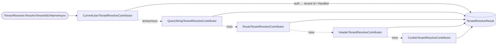
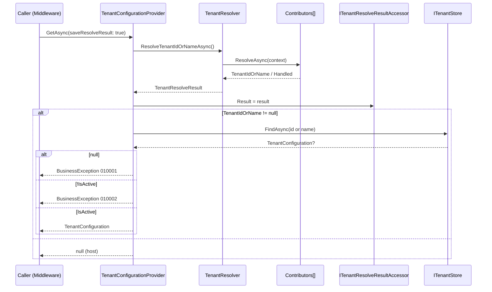

Every request that enters an ABP application has to answer the question "which
tenant is this?" before the rest of the framework can apply data filters,
permissions, settings or per-tenant connection strings. That question is
answered by a single service — `ITenantResolver` — running an ordered list of
`ITenantResolveContributor` implementations until one of them claims the
result. The contracts and shared types live in
`framework/src/Volo.Abp.MultiTenancy.Abstractions/Volo/Abp/MultiTenancy/`; the
default resolver, base class, and the core contributors live in
`framework/src/Volo.Abp.MultiTenancy/Volo/Abp/MultiTenancy/`. This page covers
that surface; the HTTP-specific contributors are documented on
[/multitenancy/aspnet-core-resolvers](/multitenancy/aspnet-core-resolvers).

## File inventory

| Path | Role |
| --- | --- |
| `framework/src/Volo.Abp.MultiTenancy.Abstractions/Volo/Abp/MultiTenancy/ITenantResolver.cs` | Public entry point — returns a `TenantResolveResult` |
| `framework/src/Volo.Abp.MultiTenancy.Abstractions/Volo/Abp/MultiTenancy/ITenantResolveContributor.cs` | One step in the chain |
| `framework/src/Volo.Abp.MultiTenancy.Abstractions/Volo/Abp/MultiTenancy/ITenantResolveContext.cs` | Mutable bag passed to each contributor |
| `framework/src/Volo.Abp.MultiTenancy.Abstractions/Volo/Abp/MultiTenancy/TenantResolveContext.cs` | Default implementation |
| `framework/src/Volo.Abp.MultiTenancy.Abstractions/Volo/Abp/MultiTenancy/TenantResolveResult.cs` | Output of `ResolveTenantIdOrNameAsync` |
| `framework/src/Volo.Abp.MultiTenancy.Abstractions/Volo/Abp/MultiTenancy/TenantResolverConsts.cs` | `DefaultTenantKey = "__tenant"` |
| `framework/src/Volo.Abp.MultiTenancy.Abstractions/Volo/Abp/MultiTenancy/AbpTenantResolveOptions.cs` | The ordered `List<ITenantResolveContributor>` |
| `framework/src/Volo.Abp.MultiTenancy/Volo/Abp/MultiTenancy/TenantResolver.cs` | Default `ITenantResolver`, runs the chain in order |
| `framework/src/Volo.Abp.MultiTenancy/Volo/Abp/MultiTenancy/TenantResolveContributorBase.cs` | Abstract base — `Name` + `ResolveAsync` |
| `framework/src/Volo.Abp.MultiTenancy/Volo/Abp/MultiTenancy/CurrentUserTenantResolveContributor.cs` | Reads `ICurrentUser.TenantId` |
| `framework/src/Volo.Abp.MultiTenancy/Volo/Abp/MultiTenancy/ActionTenantResolveContributor.cs` | Inline contributor over `Action<ITenantResolveContext>` |
| `framework/src/Volo.Abp.MultiTenancy/Volo/Abp/MultiTenancy/TenantConfigurationProvider.cs` | Glues the resolver to `ITenantStore` |
| `framework/src/Volo.Abp.MultiTenancy/Volo/Abp/MultiTenancy/AbpMultiTenancyModule.cs` | Inserts `CurrentUserTenantResolveContributor` at index `0` |

## The public entry point

`ITenantResolver` is a one-method interface:

```csharp framework/src/Volo.Abp.MultiTenancy.Abstractions/Volo/Abp/MultiTenancy/ITenantResolver.cs
public interface ITenantResolver
{
    [NotNull]
    Task<TenantResolveResult> ResolveTenantIdOrNameAsync();
}
```

The return type carries both the value and the audit trail of which
contributors fired:

```csharp framework/src/Volo.Abp.MultiTenancy.Abstractions/Volo/Abp/MultiTenancy/TenantResolveResult.cs
public class TenantResolveResult
{
    public string? TenantIdOrName { get; set; }
    public List<string> AppliedResolvers { get; }

    public TenantResolveResult()
    {
        AppliedResolvers = new List<string>();
    }
}
```

`TenantIdOrName` is a `string` because some contributors carry an id
(`Guid` parsed downstream by `TenantConfigurationProvider`) and some carry a
unique tenant name. The `AppliedResolvers` list is used by the HTTP layer to
decide whether to set/clear the tenant cookie and to write the
`Abp-Tenant-Resolve-Error` header on failures — see
[/multitenancy/aspnet-core-resolvers](/multitenancy/aspnet-core-resolvers).

## Contributor contract

```csharp framework/src/Volo.Abp.MultiTenancy.Abstractions/Volo/Abp/MultiTenancy/ITenantResolveContributor.cs
public interface ITenantResolveContributor
{
    string Name { get; }

    Task ResolveAsync(ITenantResolveContext context);
}
```

The abstract base class is intentionally empty — it only buys you the
`override` keyword for `Name` and `ResolveAsync`:

```csharp framework/src/Volo.Abp.MultiTenancy/Volo/Abp/MultiTenancy/TenantResolveContributorBase.cs
public abstract class TenantResolveContributorBase : ITenantResolveContributor
{
    public abstract string Name { get; }

    public abstract Task ResolveAsync(ITenantResolveContext context);
}
```

`Name` is *not* just documentation — both `MultiTenancyMiddleware` and the
default error-page builder look at the contributor name to decide whether to
clear a cookie or sign the user out. Every built-in contributor declares it as
a `public const string ContributorName = "..."`.

The context is the mutable bag that flows between contributors:

```csharp framework/src/Volo.Abp.MultiTenancy.Abstractions/Volo/Abp/MultiTenancy/ITenantResolveContext.cs
public interface ITenantResolveContext : IServiceProviderAccessor
{
    string? TenantIdOrName { get; set; }

    bool Handled { get; set; }
}
```

```csharp framework/src/Volo.Abp.MultiTenancy.Abstractions/Volo/Abp/MultiTenancy/TenantResolveContext.cs
public class TenantResolveContext : ITenantResolveContext
{
    public IServiceProvider ServiceProvider { get; }

    public string? TenantIdOrName { get; set; }

    public bool Handled { get; set; }

    public bool HasResolvedTenantOrHost()
    {
        return Handled || TenantIdOrName != null;
    }

    public TenantResolveContext(IServiceProvider serviceProvider)
    {
        ServiceProvider = serviceProvider;
    }
}
```

The two boolean signals matter:

- Setting `TenantIdOrName` means "use *this* value as the tenant id-or-name"
  — the result is propagated and the chain breaks.
- Setting `Handled = true` means "I conclusively decided we are on the
  **host** side" — the chain also breaks, but the next contributor never gets
  to overwrite that decision with a stale cookie or query string.

`HasResolvedTenantOrHost()` collapses the two into the single short-circuit
condition that `TenantResolver` checks after each step.

## The default `TenantResolver`

```csharp framework/src/Volo.Abp.MultiTenancy/Volo/Abp/MultiTenancy/TenantResolver.cs
public class TenantResolver : ITenantResolver, ITransientDependency
{
    private readonly IServiceProvider _serviceProvider;
    private readonly AbpTenantResolveOptions _options;

    public TenantResolver(IOptions<AbpTenantResolveOptions> options, IServiceProvider serviceProvider)
    {
        _serviceProvider = serviceProvider;
        _options = options.Value;
    }

    public virtual async Task<TenantResolveResult> ResolveTenantIdOrNameAsync()
    {
        var result = new TenantResolveResult();

        using (var serviceScope = _serviceProvider.CreateScope())
        {
            var context = new TenantResolveContext(serviceScope.ServiceProvider);

            foreach (var tenantResolver in _options.TenantResolvers)
            {
                await tenantResolver.ResolveAsync(context);

                result.AppliedResolvers.Add(tenantResolver.Name);

                if (context.HasResolvedTenantOrHost())
                {
                    result.TenantIdOrName = context.TenantIdOrName;
                    break;
                }
            }
        }

        return result;
    }
}
```

Three observations:

1. The resolver creates its **own DI scope** so contributors that need scoped
   services (the HTTP contributors need `IHttpContextAccessor`, the current
   user contributor needs `ICurrentUser`) get a clean scope independent of the
   caller's.
2. The `AppliedResolvers` list grows even when the contributor produced
   nothing — which is the only way the middleware can know that "Cookie was
   tried and didn't fire" later on.
3. The loop short-circuits on the first contributor that produces a value or
   sets `Handled`. *Order matters.*

The options object is a plain list:

```csharp framework/src/Volo.Abp.MultiTenancy.Abstractions/Volo/Abp/MultiTenancy/AbpTenantResolveOptions.cs
public class AbpTenantResolveOptions
{
    [NotNull]
    public List<ITenantResolveContributor> TenantResolvers { get; }

    public AbpTenantResolveOptions()
    {
        TenantResolvers = new List<ITenantResolveContributor>();
    }
}
```

## The built-in chain

`AbpMultiTenancyModule` only adds **one** contributor — the current-user one,
inserted at the front:

```csharp framework/src/Volo.Abp.MultiTenancy/Volo/Abp/MultiTenancy/AbpMultiTenancyModule.cs
Configure<AbpTenantResolveOptions>(options =>
{
    options.TenantResolvers.Insert(0, new CurrentUserTenantResolveContributor());
});
```

`AbpAspNetCoreMultiTenancyModule` then appends the four HTTP contributors in
order — see
[/multitenancy/aspnet-core-resolvers](/multitenancy/aspnet-core-resolvers).
The complete out-of-the-box pipeline is therefore:



The HTTP contributors all inherit from `HttpTenantResolveContributorBase`,
which silently no-ops when there is no `HttpContext` — so the same options
list works in console hosts, background workers and tests.

| Order | `Name` (const) | Type | Source / Package |
| ---: | --- | --- | --- |
| 0 | `CurrentUser` | `CurrentUserTenantResolveContributor` | `Volo.Abp.MultiTenancy` |
| 1 | `QueryString` | `QueryStringTenantResolveContributor` | `Volo.Abp.AspNetCore.MultiTenancy` |
| 2 | `Route` | `RouteTenantResolveContributor` | `Volo.Abp.AspNetCore.MultiTenancy` |
| 3 | `Header` | `HeaderTenantResolveContributor` | `Volo.Abp.AspNetCore.MultiTenancy` |
| 4 | `Cookie` | `CookieTenantResolveContributor` | `Volo.Abp.AspNetCore.MultiTenancy` |
| (opt-in) | `Domain` | `DomainTenantResolveContributor` | added via `AddDomainTenantResolver(...)` |
| (opt-in, obsolete) | `Form` | `FormTenantResolveContributor` | `Volo.Abp.AspNetCore.MultiTenancy` |
| (custom) | `Action` | `ActionTenantResolveContributor` | `Volo.Abp.MultiTenancy` |

## `CurrentUserTenantResolveContributor`

The most important contributor: if a user is authenticated, **trust the
claims** and never look at the request URL.

```csharp framework/src/Volo.Abp.MultiTenancy/Volo/Abp/MultiTenancy/CurrentUserTenantResolveContributor.cs
public class CurrentUserTenantResolveContributor : TenantResolveContributorBase
{
    public const string ContributorName = "CurrentUser";

    public override string Name => ContributorName;

    public override Task ResolveAsync(ITenantResolveContext context)
    {
        var currentUser = context.ServiceProvider.GetRequiredService<ICurrentUser>();
        if (currentUser.IsAuthenticated)
        {
            context.Handled = true;
            context.TenantIdOrName = currentUser.TenantId?.ToString();
        }

        return Task.CompletedTask;
    }
}
```

Note that when the user is a *host* user (`TenantId == null`) it still sets
`Handled = true` while leaving `TenantIdOrName = null`. That is the
"explicitly host" signal — without it, an attacker could append
`?__tenant=acme` to a host admin's URL and try to coerce them into the wrong
tenant scope.

## `ActionTenantResolveContributor`

For one-off custom logic that does not justify a separate class:

```csharp framework/src/Volo.Abp.MultiTenancy/Volo/Abp/MultiTenancy/ActionTenantResolveContributor.cs
public class ActionTenantResolveContributor : TenantResolveContributorBase
{
    public const string ContributorName = "Action";

    public override string Name => ContributorName;

    private readonly Action<ITenantResolveContext> _resolveAction;

    public ActionTenantResolveContributor([NotNull] Action<ITenantResolveContext> resolveAction)
    {
        Check.NotNull(resolveAction, nameof(resolveAction));

        _resolveAction = resolveAction;
    }

    public override Task ResolveAsync(ITenantResolveContext context)
    {
        _resolveAction(context);
        return Task.CompletedTask;
    }
}
```

Use it for things like "resolve the tenant from a JWT claim that is not the
standard `__tenant` claim" or "tag every request to `/admin/*` as host":

```csharp YourModule.cs
Configure<AbpTenantResolveOptions>(options =>
{
    options.TenantResolvers.Insert(0, new ActionTenantResolveContributor(context =>
    {
        var http = context.ServiceProvider
            .GetRequiredService<IHttpContextAccessor>()
            .HttpContext;
        if (http?.Request.Path.StartsWithSegments("/admin") == true)
        {
            context.Handled = true; // force host scope, ignore everything else
        }
    }));
});
```

## Registration patterns

The list lives in `AbpTenantResolveOptions.TenantResolvers`, and ABP's
collection helpers (`InsertAfter`, `InsertBefore`, `RemoveAll<T>`) make it
trivial to slot a contributor between two existing ones. For example, the
`AddDomainTenantResolver` extension uses `InsertAfter` to put the domain
contributor right after the current-user one:

```csharp framework/src/Volo.Abp.AspNetCore.MultiTenancy/Volo/Abp/MultiTenancy/AbpMultiTenancyOptionsExtensions.cs
public static void AddDomainTenantResolver(this AbpTenantResolveOptions options, string domainFormat)
{
    options.TenantResolvers.InsertAfter(
        r => r is CurrentUserTenantResolveContributor,
        new DomainTenantResolveContributor(domainFormat)
    );
}
```

The same pattern applies to custom contributors:

```csharp YourModule.cs
Configure<AbpTenantResolveOptions>(options =>
{
    // 1) Add after CurrentUser, before any HTTP contributor:
    options.TenantResolvers.InsertAfter(
        r => r is CurrentUserTenantResolveContributor,
        new MyCustomTenantResolveContributor());

    // 2) Replace the cookie contributor:
    options.TenantResolvers.RemoveAll(r => r is CookieTenantResolveContributor);
    options.TenantResolvers.Add(new MySignedCookieTenantResolveContributor());
});
```

<Tip>
Order is the contract. The earlier a contributor sits, the harder it is for
later contributors to override it. Keep `CurrentUser` at the front so an
authenticated user can never be tricked into another tenant via the URL.
</Tip>

## From resolver result to `ICurrentTenant`

`ITenantResolver` only returns a string. Turning that string into a
`TenantConfiguration` (and rejecting unknown / inactive tenants) is the job of
`ITenantConfigurationProvider`:

```csharp framework/src/Volo.Abp.MultiTenancy/Volo/Abp/MultiTenancy/TenantConfigurationProvider.cs
public virtual async Task<TenantConfiguration?> GetAsync(bool saveResolveResult = false)
{
    var resolveResult = await TenantResolver.ResolveTenantIdOrNameAsync();

    if (saveResolveResult)
    {
        TenantResolveResultAccessor.Result = resolveResult;
    }

    TenantConfiguration? tenant = null;
    if (resolveResult.TenantIdOrName != null)
    {
        tenant = await FindTenantAsync(resolveResult.TenantIdOrName);

        if (tenant == null)
        {
            throw new BusinessException(
                code: "Volo.AbpIo.MultiTenancy:010001",
                message: StringLocalizer["TenantNotFoundMessage"],
                details: StringLocalizer["TenantNotFoundDetails", resolveResult.TenantIdOrName]
            );
        }

        if (!tenant.IsActive)
        {
            throw new BusinessException(
                code: "Volo.AbpIo.MultiTenancy:010002",
                message: StringLocalizer["TenantNotActiveMessage"],
                details: StringLocalizer["TenantNotActiveDetails", resolveResult.TenantIdOrName]
            );
        }
    }

    return tenant;
}

protected virtual async Task<TenantConfiguration?> FindTenantAsync(string tenantIdOrName)
{
    if (Guid.TryParse(tenantIdOrName, out var parsedTenantId))
    {
        return await TenantStore.FindAsync(parsedTenantId);
    }
    else
    {
        return await TenantStore.FindAsync(tenantIdOrName);
    }
}
```

This is the only place where the framework decides whether a value is a `Guid`
or a name (via `Guid.TryParse`). When the resolver chain returned
`Handled = true` with no value, the provider returns `null` — host side —
without ever hitting the store.

The middleware feeds the result into `ICurrentTenant.Change(...)`; see
[/multitenancy/aspnet-core-resolvers](/multitenancy/aspnet-core-resolvers).

## Writing a custom contributor

A typical custom contributor follows the same shape as the HTTP ones — read
the request, derive a value, set `context.TenantIdOrName`. The minimum is:

```csharp YourTenantResolveContributor.cs
public class HostHeaderSubdomainTenantResolveContributor : TenantResolveContributorBase
{
    public const string ContributorName = "HostHeaderSubdomain";

    public override string Name => ContributorName;

    public override Task ResolveAsync(ITenantResolveContext context)
    {
        var http = context.ServiceProvider
            .GetRequiredService<IHttpContextAccessor>()
            .HttpContext;

        if (http == null || !http.Request.Host.HasValue)
        {
            return Task.CompletedTask;
        }

        var host = http.Request.Host.Value;
        var dot = host.IndexOf('.');
        if (dot <= 0) return Task.CompletedTask;

        var sub = host[..dot];
        if (!string.Equals(sub, "www", StringComparison.OrdinalIgnoreCase) &&
            !string.Equals(sub, "admin", StringComparison.OrdinalIgnoreCase))
        {
            context.TenantIdOrName = sub;
        }

        return Task.CompletedTask;
    }
}
```

Then register it:

```csharp YourModule.cs
Configure<AbpTenantResolveOptions>(options =>
{
    options.TenantResolvers.InsertAfter(
        r => r is CurrentUserTenantResolveContributor,
        new HostHeaderSubdomainTenantResolveContributor());
});
```

If your contributor reads from the request, **derive from
`HttpTenantResolveContributorBase`** instead — it handles the missing-
`HttpContext` case, logs exceptions, and writes back to
`context.TenantIdOrName` for you. See
[/multitenancy/aspnet-core-resolvers](/multitenancy/aspnet-core-resolvers).

## Validation flow at a glance



The `010001`/`010002` codes come from the abstractions package and are
localized via `AbpMultiTenancyResource`.

## Defaults you should know

- `TenantResolverConsts.DefaultTenantKey = "__tenant"` — the key used by the
  HTTP contributors and the cookie helper. Override it via
  `AbpAspNetCoreMultiTenancyOptions.TenantKey`.
- The `CurrentUser` contributor sits at index `0` and is the *only* contributor
  whose presence is guaranteed by `AbpMultiTenancyModule`. Removing it leaves
  authenticated requests subject to URL/cookie spoofing.
- The default `TenantResolver` is registered conventionally as a transient. To
  replace it (e.g. to add caching across the whole chain) declare your own
  class with `[Dependency(ReplaceServices = true)]` and implement
  `ITenantResolver`.

## Next pages

<CardGroup cols={2}>
  <Card title="ASP.NET Core resolvers" href="/multitenancy/aspnet-core-resolvers">
    Domain / route / header / query string / cookie / form contributors plus
    `MultiTenancyMiddleware`.
  </Card>
  <Card title="Current tenant" href="/multitenancy/current-tenant">
    Where the resolved id ends up — `ICurrentTenant` and the change scope.
  </Card>
  <Card title="Connection-string resolver" href="/multitenancy/connection-string-resolver">
    `MultiTenantConnectionStringResolver` reads `CurrentTenant.Id` to pick the
    right database.
  </Card>
  <Card title="Tenant Management module" href="/modules/tenant-management/overview">
    The `ITenantStore` backed by EF Core/MongoDB and a `Tenant` aggregate.
  </Card>
</CardGroup>
