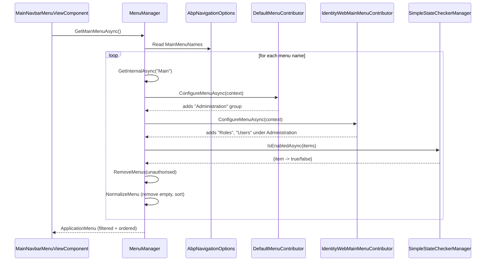

`Volo.Abp.UI.Navigation` is the framework-agnostic menu system used by every UI stack in ABP. A theme (MVC, Blazor, MauiBlazor) does not own menu definitions — it asks `IMenuManager` for an `ApplicationMenu` and renders whatever items the contributor pipeline produced. This page maps the moving parts of `framework/src/Volo.Abp.UI.Navigation` and shows how a request for "the main menu" turns into a tree of `ApplicationMenuItem` objects, normalised, ordered, and filtered by permission.

## File inventory

| File                                  | Type        | Purpose                                                                                       |
| ------------------------------------- | ----------- | --------------------------------------------------------------------------------------------- |
| `AbpUiNavigationModule.cs`            | `AbpModule` | Registers the resource, embedded VFS, and the `DefaultMenuContributor` in `AbpNavigationOptions`. |
| `AbpNavigationOptions.cs`             | options     | Holds `MenuContributors` list and `MainMenuNames` (defaults to `[ "Main" ]`).                 |
| `IMenuManager.cs`                     | interface   | `GetAsync(string name)` and `GetMainMenuAsync()`.                                             |
| `MenuManager.cs`                      | service     | Default `IMenuManager` — composes menus, runs permission checks, normalises results.          |
| `ApplicationMenu.cs`                  | model       | Top-level menu with `Items`, `Groups`, `CustomData`.                                          |
| `ApplicationMenuItem.cs`              | model       | A single menu node (recursive via `Items`), with `Order`, `Url`, `Icon`, `RequiredPermissionName`, `StateCheckers`. |
| `ApplicationMenuItemList.cs`          | collection  | List that knows how to `Normalize()` (remove empty + order by `Order`).                       |
| `ApplicationMenuGroup.cs` / `*GroupList.cs` | model | Optional grouping of items inside a menu.                                                     |
| `IHasMenuItems.cs` / `IHasMenuGroups.cs` | interface | Mix-ins implemented by both `ApplicationMenu` and `ApplicationMenuItem`.                      |
| `IMenuContributor.cs`                 | interface   | `Task ConfigureMenuAsync(MenuConfigurationContext context)` — implemented by every feature module. |
| `IMenuConfigurationContext.cs` / `MenuConfigurationContext.cs` | DTO | Passed to contributors; exposes the in-flight `Menu`, `AuthorizationService`, `StringLocalizerFactory`. |
| `DefaultMenuContributor.cs`           | contributor | Adds the `Administration` menu item to the `Main` menu.                                       |
| `DefaultMenuNames.cs`                 | constants   | `DefaultMenuNames.Application.Main.Administration = "Abp.Application.Main.Administration"`.   |
| `StandardMenus.cs`                    | constants   | `Main`, `User`, `Shortcut`.                                                                   |
| `ApplicationMenuExtensions.cs`        | extensions  | `GetAdministration()`, `GetMenuItem(name)`, `TryRemoveMenuItem(name)`, group helpers.         |
| `HasMenuItemsExtensions.cs`           | extensions  | Recursive `FindMenuItem(name)`.                                                               |
| `Urls/AppUrlProvider.cs` / `AppUrlOptions.cs` | service / options | Application URL discovery (logo links, password reset URLs).                          |
| `Localization/Resource/AbpUiNavigationResource.cs` + `*.json` | localization | Built-in strings (`Menu:Administration` etc.).                                       |

## The module

```csharp framework/src/Volo.Abp.UI.Navigation/Volo/Abp/Ui/Navigation/AbpUiNavigationModule.cs
[DependsOn(typeof(AbpUiModule), typeof(AbpAuthorizationModule), typeof(AbpMultiTenancyModule))]
public class AbpUiNavigationModule : AbpModule
{
    public override void ConfigureServices(ServiceConfigurationContext context)
    {
        Configure<AbpVirtualFileSystemOptions>(options =>
        {
            options.FileSets.AddEmbedded<AbpUiNavigationModule>();
        });

        Configure<AbpLocalizationOptions>(options =>
        {
            options.Resources
                .Add<AbpUiNavigationResource>("en")
                .AddVirtualJson("/Volo/Abp/Ui/Navigation/Localization/Resource");
        });

        Configure<AbpNavigationOptions>(options =>
        {
            options.MenuContributors.Add(new DefaultMenuContributor());
        });
    }
}
```

This is the only place where the framework itself contributes a menu item. The dependency on `AbpAuthorizationModule` is what lets `MenuManager` resolve `ISimpleStateCheckerManager<ApplicationMenuItem>` and the permission state checker.

## The `IMenuManager` contract

```csharp framework/src/Volo.Abp.UI.Navigation/Volo/Abp/Ui/Navigation/IMenuManager.cs
public interface IMenuManager
{
    Task<ApplicationMenu> GetAsync(string name);

    Task<ApplicationMenu> GetMainMenuAsync();
}
```

`GetMainMenuAsync()` is what UI shells consume (the MVC `MainNavbarMenuViewComponent` and the Blazor `MainMenu` component). `GetAsync(name)` is the lower-level entry — call it to retrieve `StandardMenus.User`, `StandardMenus.Shortcut`, or any custom menu you've defined.

## Options

```csharp framework/src/Volo.Abp.UI.Navigation/Volo/Abp/Ui/Navigation/AbpNavigationOptions.cs
public class AbpNavigationOptions
{
    [NotNull]
    public List<IMenuContributor> MenuContributors { get; }

    /// <summary>
    /// Includes the <see cref="StandardMenus.Main"/> by default.
    /// </summary>
    public List<string> MainMenuNames { get; }

    public AbpNavigationOptions()
    {
        MenuContributors = new List<IMenuContributor>();
        MainMenuNames = new List<string> { StandardMenus.Main };
    }
}
```

```csharp framework/src/Volo.Abp.UI.Navigation/Volo/Abp/Ui/Navigation/StandardMenus.cs
public static class StandardMenus
{
    public const string Main = "Main";
    public const string User = "User";
    public const string Shortcut = "Shortcut";
}
```

`MainMenuNames` is a list, not a single string — `GetMainMenuAsync()` will merge multiple named menus into one. This is the seam that lets you split a complex app into `"Main"` + `"Operations"` and have the navbar render both, all without the contributor knowing what menu it's appended to (it only cares about the menu name guard).

## How a menu is built



The `MenuManager` implementation walks every contributor, invokes permission checks in batch, then normalises the result. Reproducing the core loop verbatim:

```csharp framework/src/Volo.Abp.UI.Navigation/Volo/Abp/Ui/Navigation/MenuManager.cs
protected virtual async Task<ApplicationMenu> GetInternalAsync(string name)
{
    var menu = new ApplicationMenu(name);

    using (var scope = ServiceScopeFactory.CreateScope())
    {
        using (RequirePermissionsSimpleBatchStateChecker<ApplicationMenuItem>.Use(
                   new RequirePermissionsSimpleBatchStateChecker<ApplicationMenuItem>()))
        {
            var context = new MenuConfigurationContext(menu, scope.ServiceProvider);

            foreach (var contributor in Options.MenuContributors)
            {
                await contributor.ConfigureMenuAsync(context);
            }

            await CheckPermissionsAsync(scope.ServiceProvider, menu);
        }
    }

    NormalizeMenu(menu);
    NormalizeMenuGroup(menu);

    return menu;
}
```

Three things are worth highlighting:

1. **A scope is created per call.** Contributors that resolve scoped services (e.g. an `ICurrentTenant` or an `IRepository`) get a fresh scope; menu rendering does not leak service lifetimes into the rendering thread.
2. **Permission checking is batched.** A `RequirePermissionsSimpleBatchStateChecker<ApplicationMenuItem>` is pushed onto an ambient stack so every `RequirePermissions(...)` call recorded by contributors is folded into a single batch authorisation check. The `SimpleStateCheckerManager` then evaluates them in one pass.
3. **Normalisation is two-phase.** `NormalizeMenu` walks the item tree and calls `ApplicationMenuItemList.Normalize()` which removes empty items and orders by `Order`. `NormalizeMenuGroup` collapses unknown group references on items.

### Merging multiple `MainMenuNames`

```csharp framework/src/Volo.Abp.UI.Navigation/Volo/Abp/Ui/Navigation/MenuManager.cs
protected virtual async Task<ApplicationMenu> GetAsync(params string[] menuNames)
{
    if (menuNames.IsNullOrEmpty())
    {
        return new ApplicationMenu(StandardMenus.Main);
    }

    var menus = new List<ApplicationMenu>();

    foreach (var menuName in Options.MainMenuNames)
    {
        menus.Add(await GetInternalAsync(menuName));
    }

    return MergeMenus(menus);
}

protected virtual ApplicationMenu MergeMenus(List<ApplicationMenu> menus)
{
    Check.NotNullOrEmpty(menus, nameof(menus));
    if (menus.Count == 1) return menus[0];

    var firstMenu = menus[0];
    for (int i = 1; i < menus.Count; i++)
    {
        var currentMenu = menus[i];
        foreach (var menuItem in currentMenu.Items)
        {
            firstMenu.AddItem(menuItem);
        }
    }
    return firstMenu;
}
```

If `MainMenuNames = [ "Main", "Operations" ]`, both menus are built (each going through the full contributor pipeline) and then their root-level items are concatenated into the first menu. The merged menu inherits the first menu's `Name`.

## The model

### `ApplicationMenu`

```csharp framework/src/Volo.Abp.UI.Navigation/Volo/Abp/Ui/Navigation/ApplicationMenu.cs
public class ApplicationMenu : IHasMenuItems, IHasMenuGroups
{
    public string Name { get; }
    public string DisplayName { get; set; }
    public ApplicationMenuItemList Items { get; }
    public ApplicationMenuGroupList Groups { get; }
    public Dictionary<string, object> CustomData { get; } = new();

    public ApplicationMenu([NotNull] string name, string? displayName = null) { ... }

    public ApplicationMenu AddItem([NotNull] ApplicationMenuItem menuItem) { Items.Add(menuItem); return this; }
    public ApplicationMenu AddGroup([NotNull] ApplicationMenuGroup group)  { Groups.Add(group);  return this; }
    public ApplicationMenu WithCustomData(string key, object value)        { CustomData[key] = value; return this; }
}
```

`CustomData` is the extensibility seam: themes carry component types in it (see `BasicThemeNavigationExtensions.UseComponent`), and apps can store arbitrary rendering metadata.

### `ApplicationMenuItem`

```csharp framework/src/Volo.Abp.UI.Navigation/Volo/Abp/Ui/Navigation/ApplicationMenuItem.cs
public class ApplicationMenuItem : IHasMenuItems, IHasSimpleStateCheckers<ApplicationMenuItem>
{
    public const int DefaultOrder = 1000;

    public string Name { get; }
    public string DisplayName { get; set; }
    public int Order { get; set; }
    public string? Url { get; set; }
    public string? Icon { get; set; }
    public bool IsLeaf => Items.IsNullOrEmpty();
    public string? Target { get; set; }
    public bool IsDisabled { get; set; }
    public ApplicationMenuItemList Items { get; }

    [Obsolete("Use RequirePermissions extension method.")]
    public string? RequiredPermissionName { get; set; }

    public List<ISimpleStateChecker<ApplicationMenuItem>> StateCheckers { get; }
    public Dictionary<string, object> CustomData { get; } = new();
    public string? ElementId { get; set; }   // dots replaced with underscores
    public string? CssClass { get; set; }
    public string? GroupName { get; set; }

    public ApplicationMenuItem(
        string name, string displayName, string? url = null, string? icon = null,
        int order = DefaultOrder, string? target = null, string? elementId = null,
        string? cssClass = null, string? groupName = null, string? requiredPermissionName = null) { ... }

    public ApplicationMenuItem AddItem(ApplicationMenuItem menuItem) { Items.Add(menuItem); return this; }
    public ApplicationMenuItem WithCustomData(string key, object value) { CustomData[key] = value; return this; }
}
```

| Property                  | Notes                                                                                                       |
| ------------------------- | ----------------------------------------------------------------------------------------------------------- |
| `Name`                    | Unique within its parent. Used as a lookup key and as the default `ElementId` prefix (`MenuItem_<Name>`).    |
| `Order`                   | Default `1000`. `Normalize()` sorts ascending — set lower to push earlier.                                  |
| `Url`                     | If null, the item is treated as a grouping node; leaf items with null URL are removed by `Normalize()`.     |
| `Target`                  | `null`, `"_blank"`, `"_self"`, `"_parent"`, `"_top"`, or a frame name.                                      |
| `IsDisabled`              | Themes are expected to render disabled state without removing the item.                                     |
| `RequiredPermissionName`  | Marked obsolete in favour of the `RequirePermissions(...)` extension which adds an `ISimpleStateChecker`.   |
| `StateCheckers`           | The general filter mechanism — anything that yields `true`/`false` per item gates visibility.               |
| `GroupName`               | Optional; references an `ApplicationMenuGroup` on the parent `ApplicationMenu`.                             |
| `IsLeaf`                  | Computed — true when `Items` is empty.                                                                     |
| `ElementId`               | Auto-derived from `Name` (dots → underscores) so menu items have stable DOM ids for testing.                |

### Normalisation rules

```csharp framework/src/Volo.Abp.UI.Navigation/Volo/Abp/Ui/Navigation/ApplicationMenuItemList.cs
public void Normalize()
{
    RemoveEmptyItems();   // removes items where IsLeaf && Url.IsNullOrEmpty()
    Order();              // stable order by ApplicationMenuItem.Order
}
```

Two consequences engineers hit in practice:

- A grouping item whose children were all filtered out by permission checks becomes a leaf with no URL and is dropped. You do not need to remove empty parents manually.
- Items added in any order during contribution are reshuffled at the end, so contributors only need to set sensible `Order` numbers, not coordinate.

## Extensions you will actually use

```csharp framework/src/Volo.Abp.UI.Navigation/Volo/Abp/Ui/Navigation/ApplicationMenuExtensions.cs
public static ApplicationMenuItem GetAdministration(this ApplicationMenu applicationMenu)
    => applicationMenu.GetMenuItem(DefaultMenuNames.Application.Main.Administration);

public static ApplicationMenuItem GetMenuItem(this IHasMenuItems menuWithItems, string menuItemName) { ... }
public static ApplicationMenuItem? GetMenuItemOrNull(this IHasMenuItems menuWithItems, string menuItemName) { ... }

public static bool TryRemoveMenuItem(this IHasMenuItems menuWithItems, string menuItemName) { ... }

public static IHasMenuItems SetSubItemOrder(this IHasMenuItems menuWithItems, string menuItemName, int order) { ... }
public static IHasMenuGroups SetMenuGroupOrder(this IHasMenuGroups menuWithGroups, string menuGroupName, int order) { ... }
```

```csharp framework/src/Volo.Abp.UI.Navigation/Volo/Abp/Ui/Navigation/HasMenuItemsExtensions.cs
public static ApplicationMenuItem? FindMenuItem(this IHasMenuItems container, string menuItemName)
```

`FindMenuItem` searches recursively (depth-first) where `GetMenuItemOrNull` only looks at direct children. Use the former to reach into the `Administration` subtree without knowing whether your item ended up nested or flat.

## Default contributor

```csharp framework/src/Volo.Abp.UI.Navigation/Volo/Abp/Ui/Navigation/DefaultMenuContributor.cs
public class DefaultMenuContributor : IMenuContributor
{
    public virtual Task ConfigureMenuAsync(MenuConfigurationContext context)
    {
        Configure(context);
        return Task.CompletedTask;
    }

    protected virtual void Configure(MenuConfigurationContext context)
    {
        var l = context.GetLocalizer<AbpUiNavigationResource>();

        if (context.Menu.Name == StandardMenus.Main)
        {
            context.Menu.AddItem(
                new ApplicationMenuItem(
                    DefaultMenuNames.Application.Main.Administration,
                    l["Menu:Administration"],
                    icon: "fa fa-wrench"
                )
            );
        }
    }
}
```

This is why every ABP app has an empty "Administration" parent in the navbar before any feature module contributes — the navigation module itself seeds it. Identity, Permission Management, Feature Management, etc. all attach themselves under this node via the `GetAdministration()` extension.

## `MenuConfigurationContext`

```csharp framework/src/Volo.Abp.UI.Navigation/Volo/Abp/Ui/Navigation/MenuConfigurationContext.cs
public class MenuConfigurationContext : IMenuConfigurationContext
{
    public IServiceProvider ServiceProvider { get; }
    public IAuthorizationService AuthorizationService => _lazyServiceProvider.LazyGetRequiredService<IAuthorizationService>();
    public IStringLocalizerFactory StringLocalizerFactory => _lazyServiceProvider.LazyGetRequiredService<IStringLocalizerFactory>();
    public ApplicationMenu Menu { get; }

    public Task<bool> IsGrantedAsync(string policyName) => AuthorizationService.IsGrantedAsync(policyName);
    public IStringLocalizer? GetDefaultLocalizer() => StringLocalizerFactory.CreateDefaultOrNull();
    public IStringLocalizer GetLocalizer<T>() => StringLocalizerFactory.Create<T>();
    public IStringLocalizer GetLocalizer(Type resourceType) => StringLocalizerFactory.Create(resourceType);
}
```

The lazy service provider pattern means contributors that never call `AuthorizationService` or `StringLocalizerFactory` don't pay for their resolution. The context also exposes the raw `ServiceProvider` for anything else.

## Standard menus

| Constant                 | Conventional usage                                                                |
| ------------------------ | --------------------------------------------------------------------------------- |
| `StandardMenus.Main`     | The primary navbar menu (rendered by `MainNavbarMenuViewComponent` in the Basic Theme). |
| `StandardMenus.User`     | The user-menu dropdown (rendered by `UserMenuViewComponent`).                     |
| `StandardMenus.Shortcut` | Optional shortcut/quick-action menu shown by some themes (e.g. LeptonX).          |

Contributors should always guard on `context.Menu.Name == StandardMenus.X` to stay polite.

## Permission filtering — `RequirePermissions`

`ApplicationMenuItem` implements `IHasSimpleStateCheckers<ApplicationMenuItem>`, so any number of `ISimpleStateChecker<ApplicationMenuItem>` can be attached. The most common one is permission-based:

```csharp
identityMenuItem.AddItem(
    new ApplicationMenuItem(IdentityMenuNames.Users, l["Users"], url: "~/Identity/Users")
        .RequirePermissions(IdentityPermissions.Users.Default));
```

`RequirePermissions` lives in `Volo.Abp.Authorization.Permissions` and appends a `RequirePermissionsSimpleBatchStateChecker` registration. When `MenuManager.CheckPermissionsAsync` runs, every item with a checker is evaluated; items whose checkers return `false` are removed from the tree.

<Tip>
The obsolete `RequiredPermissionName` constructor argument is still folded into the same pipeline — `CheckPermissionsAsync` reads it and synthesises a `RequirePermissions(name)` call before the batch check. New code should use the extension method directly.
</Tip>

## Localisation

Built-in strings live in `Volo/Abp/Ui/Navigation/Localization/Resource/{culture}.json`. The resource type is `AbpUiNavigationResource` and includes entries like `Menu:Administration`. To localise your own menu items, use `context.GetLocalizer<MyModuleResource>()["Menu:Whatever"]` inside the contributor.

## Where to go next

- [Menu contributors](/navigation/menu-contributors) — implementing `IMenuContributor`, ordering, replacing items, real examples from Identity and the Account module.
- [Themes overview](/themes/overview) — who consumes `IMenuManager.GetMainMenuAsync()`.
- [Basic Theme module](/themes/basic-theme-module) — the canonical rendering implementation.
- [Authorization](/authz) — `IAuthorizationService`, `RequirePermissions`, and the policy model that backs menu filtering.
- [HTTP client](/http) — how navigation is delivered to remote clients (the URL provider and `AppUrlOptions`).
